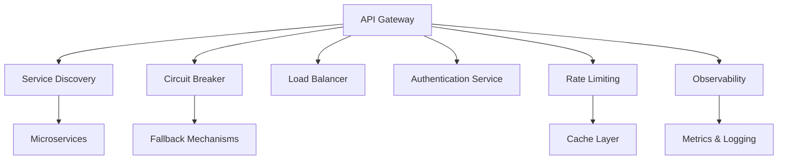
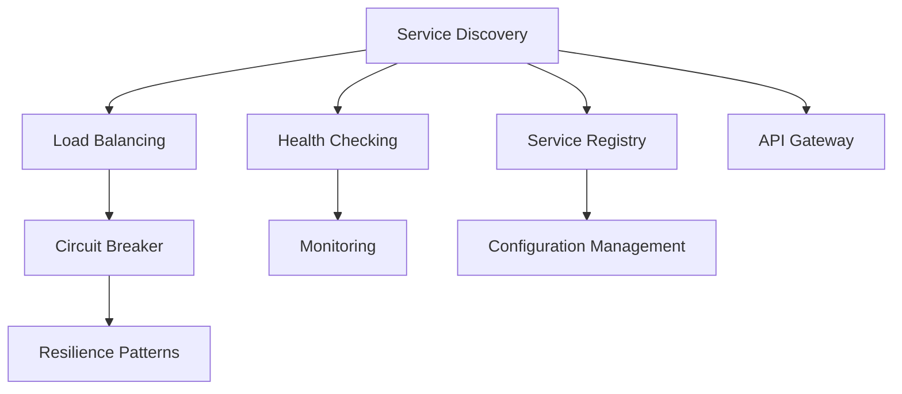
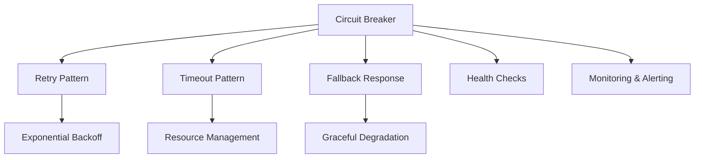
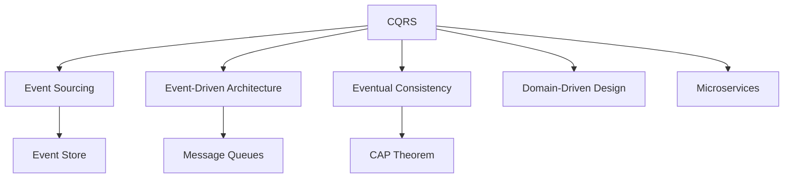
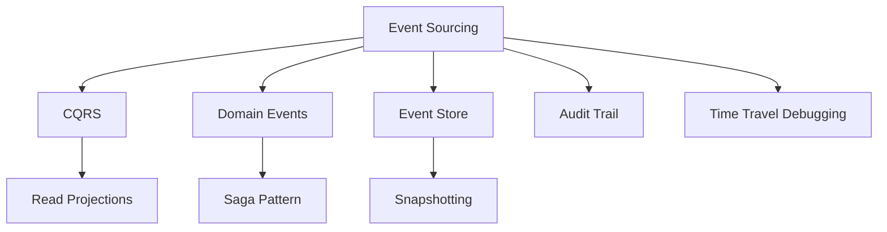

# Szoftver Architektúra

## Rövid összefoglaló

A szoftver architektúra a rendszerek szerkezeti és szervezési elveit határozza meg, amelyek hosszú távon biztosítják a fenntarthatóságot, skálázhatóságot és megbízhatóságot. Modern architektúrák mikroszolgáltatás alapúak, használnak rétegezett felépítést (layered architecture), port-adapter mintákat és bounded context koncepciókat. Az idempotencia és aszinkron üzenetkezelés alapvető elvek, amelyeket cache-eléssel és resiliency mechanizmusokkal (retry, circuit breaker) egészítünk ki. Megfigyelhetőség (observability) kulcsfontosságú a hibakereséshez. Fő buktatók: overengineering, chatty services és monolitikus adatbázis-használat.

## Fogalmak

### Monolit {#monolit}

<div class="concept-section mental-model" data-filter="patterns junior">

🏢 **Fogalom meghatározása**  
*A monolitikus architektúra egy szoftvertervezési minta, amelyben az alkalmazás minden komponense (UI, üzleti logika, adatelérési réteg) egyetlen, egységes kódbázisban és deployment egységben van összeépítve. Minden funkció szorosan összekapcsolódik, közös memóriaterületen fut, és általában egyetlen adatbázist használ. A deployment, skálázás és verziókezelés az egész alkalmazásra vonatkozik egyszerre.*

</div>

<div class="concept-section why-important" data-filter="patterns junior">

💡 **Miért számít?**
- **Egyszerű kezdés**: egy alkalmazás, egy adatbázis, egy deployment
- **Fejlesztési sebesség**: kezdeti fejlesztés gyors, összes kód egy helyen
- **Testing egyszerűség**: integráció és E2E tesztek könnyebbek
- **Skálázási korlátok**: egész alkalmazást kell skálázni, nem csak a bottleneck részeket

</div>

<div class="runnable-model" data-filter="patterns junior">

**Runnable mental model**
```java
// Monolitikus alkalmazás struktúra - minden egy helyen
@SpringBootApplication
public class MonolithicECommerceApplication {
    // Minden komponens egy alkalmazásban
    
    @RestController
    class OrderController {
        @GetMapping("/orders")
        public List<Order> getOrders() { /* orders logic */ }
    }
    
    @RestController  
    class ProductController {
        @GetMapping("/products")
        public List<Product> getProducts() { /* products logic */ }
    }
    
    @RestController
    class UserController {
        @GetMapping("/users")
        public List<User> getUsers() { /* users logic */ }
    }
    
    // Közös adatbázis minden funkcióhoz
    @Repository
    class DatabaseRepository {
        // orders, products, users táblák ugyanabban a DB-ben
        // Egy transaction mindent kezel
    }
}
```
*Figyeld meg: minden üzleti logika egy alkalmazásban, közös adatbázissal és deployment egységgel.*

</div>

<div class="concept-section myths" data-filter="patterns">

<details>
<summary>🧯 <strong>Gyakori tévhitek / félreértések</strong></summary>

<div>

- „Monolit mindig rossz." → Kis csapatoknak és egyszerű alkalmazásoknak tökéletes választás
- „Microservice mindig jobb." → Komplexitás és infrastruktúra overhead is jár vele
- „Monolitból nem lehet microservice." → Strangler Fig pattern segítségével fokozatosan átállítható

</div>

</details>

</div>

<div class="concept-section micro-learning" data-filter="patterns">

<details>
<summary>📚 <strong>5 perces mikro-tanulás</strong></summary>

<div>

**Monolit előnyei:**
- Egyszerű deployment (egy JAR/WAR file)
- ACID tranzakciók könnyű kezelése
- Performance - nincs network overhead
- Debugging egyszerűbb
- DevOps költségek alacsonyabbak

**Monolit hátrányai:**
- Skálázás korlátai
- Technology lock-in
- Fejlesztői csapat konfliktusok
- Large codebase karbantartása

**Mikor válassz monolitot:**
- Kis csapat (< 8-10 fő)
- MVP és proof of concept
- Jól definiált, stabil domain
- Egyszerű deployment requirements

</div>

</details>

</div>

### Mikroszolgáltatások (Microservices) {#mikroszolgaltatasok-microservices}

<div class="concept-section mental-model" data-filter="microservices medior">

🔧 **Fogalom meghatározása**  
*A mikroszolgáltatás architektúra (microservices) egy szoftvertervezési megközelítés, amelyben az alkalmazást kis, független, lazán csatolt szolgáltatásokra bontjuk. Minden mikroszolgáltatás egy konkrét üzleti funkcionalitást valósít meg, saját adatbázissal rendelkezik, független életciklusú (külön deploy-olható), és jól definiált API-n keresztül kommunikál más szolgáltatásokkal. A szolgáltatások eltérő technológiákat használhatnak, és külön-külön skálázhatók.*

</div>

<div class="concept-section why-important" data-filter="microservices medior">

💡 **Miért számít?**
- **Independent scaling**: csak a bottleneck szolgáltatásokat kell skálázni
- **Technology diversity**: minden service saját tech stack-et használhat
- **Team autonomy**: kis csapatok saját service-eket birtokolnak
- **Fault isolation**: egy service hibája nem dönt le mindent

</div>

<div class="runnable-model" data-filter="microservices">

**Runnable mental model**
```java
// User Service - független alkalmazás
@SpringBootApplication
public class UserServiceApplication {
    @RestController
    class UserController {
        @GetMapping("/users/{id}")
        public User getUser(@PathVariable Long id) {
            return userService.findById(id);
        }
    }
    
    // Saját adatbázis - user_db
    @Repository
    interface UserRepository extends JpaRepository<User, Long> {}
}

// Order Service - külön alkalmazás és deployment
@SpringBootApplication  
public class OrderServiceApplication {
    @RestController
    class OrderController {
        @PostMapping("/orders")
        public Order createOrder(@RequestBody CreateOrderRequest request) {
            // HTTP hívás a User Service-hez
            User user = restTemplate.getForObject(
                "http://user-service/users/" + request.getUserId(), 
                User.class
            );
            
            // HTTP hívás a Product Service-hez
            Product product = restTemplate.getForObject(
                "http://product-service/products/" + request.getProductId(),
                Product.class
            );
            
            return orderService.createOrder(request, user, product);
        }
    }
    
    // Saját adatbázis - order_db
    @Repository
    interface OrderRepository extends JpaRepository<Order, Long> {}
}
```
*Figyeld meg: minden service saját adatbázissal, HTTP API-n keresztül kommunikálnak.*

</div>

<div class="concept-section myths" data-filter="microservices">

<details>
<summary>🧯 <strong>Gyakori tévhitek / félreértések</strong></summary>

<div>

- „Microservice = kis kód." → Nem a kód mérete, hanem a business capability határozza meg
- „Minden microservice külön adatbázis." → Ideális, de pragmatikusan shared DB is elfogadható átmenet során
- „Microservice mindig gyorsabb." → Network latency és distributed system complexity is jár vele

</div>

</details>

</div>

<div class="concept-section micro-learning" data-filter="microservices">

<details>
<summary>📚 <strong>5 perces mikro-tanulás</strong></summary>

<div>

**Microservice decomposition strategies:**
```
Business capability alapján:
- User Management Service
- Product Catalog Service  
- Order Processing Service
- Payment Service
- Notification Service

Data szempontból:
- Bounded context per service
- Database per service
- Eventual consistency
```

**Communication patterns:**
```
Synchronous:
- HTTP/REST API calls
- GraphQL
- gRPC

Asynchronous:
- Event-driven (Kafka, RabbitMQ)
- Message queues
- Event sourcing
```

**Service discovery:**
- Service registry (Eureka, Consul)
- API Gateway (Zuul, Kong)
- Load balancing
- Circuit breaker pattern

</div>

</details>

</div>

### Rétegek (Layered Architecture) {#retegek-layered-architecture}
Logikai rétegek: prezentáció, üzleti logika, adatkezelés. Segíti a separation of concerns elvét.

**Példa:**
```java
// Presentation Layer
@RestController
@RequestMapping("/api/users")
public class UserController {
    private final UserService userService;
    
    @GetMapping("/{id}")
    public ResponseEntity<UserDTO> getUser(@PathVariable Long id) {
        UserDTO user = userService.getUserById(id);
        return ResponseEntity.ok(user);
    }
    
    @PostMapping
    public ResponseEntity<UserDTO> createUser(@RequestBody CreateUserRequest request) {
        UserDTO createdUser = userService.createUser(request);
        return ResponseEntity.status(HttpStatus.CREATED).body(createdUser);
    }
}

// Business Logic Layer
@Service
@Transactional
public class UserService {
    private final UserRepository userRepository;
    private final EmailService emailService;
    
    public UserDTO createUser(CreateUserRequest request) {
        // Business logic validation
        if (userRepository.existsByEmail(request.getEmail())) {
            throw new UserAlreadyExistsException();
        }
        
        User user = new User(request.getName(), request.getEmail());
        User savedUser = userRepository.save(user);
        
        // Business logic - send welcome email
        emailService.sendWelcomeEmail(savedUser.getEmail());
        
        return UserMapper.toDTO(savedUser);
    }
}

// Data Access Layer
@Repository
public interface UserRepository extends JpaRepository<User, Long> {
    boolean existsByEmail(String email);
    Optional<User> findByEmail(String email);
}
```

Magyarázat: Minden réteg csak az alatta lévő rétegre támaszkodik, tiszta elválasztás a felelősségek között.

### Port–Adapter (Hexagonal) {#port-adapter-hexagonal}

<div class="concept-section mental-model" data-filter="patterns medior">

⬡ **Fogalom meghatározása**  
*A Hexagonal Architecture (más néven Ports and Adapters) egy szoftver architektúra minta, amely elválasztja az alkalmazás központi üzleti logikáját (domain core) a külső függőségektől (adatbázisok, UI, external services). A **portok** absztrakciók (interface-ek), amelyeken keresztül a core kommunikál a külvilággal, míg az **adapterek** konkrét implementációk, amelyek a portokhoz csatlakoznak. Ez lehetővé teszi a külső technológiák cseréjét anélkül, hogy az üzleti logikát módosítani kellene.*

</div>

<div class="concept-section why-important" data-filter="patterns medior">

💡 **Miért számít?**
- **Technology independence**: core logic független az adatbázistól, UI-tól
- **Testability**: könnyű unit és integration tesztek
- **Flexibility**: külső rendszerek cseréje anélkül, hogy a core logika változna
- **Clean architecture**: business logic a középpontban, infrastructure peremén

</div>

<div class="runnable-model" data-filter="patterns">

**Runnable mental model**
```java
// Domain Core - Port (Interface)
public interface UserRepository {
    User save(User user);
    Optional<User> findById(Long id);
    Optional<User> findByEmail(String email);
}

public interface NotificationService {
    void sendNotification(String message, String recipient);
}

// Domain Service (Core Logic) - csak portokat ismer
@Service
public class UserService {
    private final UserRepository userRepository;
    private final NotificationService notificationService;
    
    // Dependency injection - csak interfészektől függ
    public UserService(UserRepository userRepository, 
                      NotificationService notificationService) {
        this.userRepository = userRepository;
        this.notificationService = notificationService;
    }
    
    public User createUser(String name, String email) {
        // Core business logic
        if (userRepository.findByEmail(email).isPresent()) {
            throw new UserAlreadyExistsException(email);
        }
        
        User user = new User(name, email);
        User savedUser = userRepository.save(user);
        
        // Business rule: send welcome notification
        notificationService.sendNotification("Welcome!", email);
        
        return savedUser;
    }
}

// Adapter - Database Implementation (Infrastructure)
@Repository
public class JpaUserRepository implements UserRepository {
    private final JpaUserRepositoryInterface jpaRepo;
    
    @Override
    public User save(User user) {
        UserEntity entity = UserMapper.toEntity(user);
        UserEntity savedEntity = jpaRepo.save(entity);
        return UserMapper.toDomain(savedEntity);
    }
    
    @Override
    public Optional<User> findByEmail(String email) {
        return jpaRepo.findByEmail(email)
            .map(UserMapper::toDomain);
    }
}

// Adapter - Email Implementation (Infrastructure)
@Component
public class EmailNotificationService implements NotificationService {
    @Override
    public void sendNotification(String message, String recipient) {
        // SMTP email sending logic
        emailClient.sendEmail(recipient, "Welcome", message);
    }
}
```
*Figyeld meg: UserService csak az interfészeket ismeri, konkrét implementációktól független.*

</div>

<div class="concept-section micro-learning" data-filter="patterns">

<details>
<summary>📚 <strong>5 perces mikro-tanulás</strong></summary>

<div>

**Hexagonal Architecture rétegei:**
```
Domain Core (Business Logic):
- Entities, Value Objects
- Domain Services  
- Business Rules
- Ports (Interfaces)

Application Layer:
- Use Cases
- Application Services
- Command/Query Handlers

Infrastructure (Adapters):
- Database implementations
- External API clients
- Message queue handlers
- Web controllers
```

**Testing strategy:**
```java
// Unit test - mock adapters
@Test
void shouldCreateUserWithNotification() {
    // Given
    UserRepository mockRepo = mock(UserRepository.class);
    NotificationService mockNotification = mock(NotificationService.class);
    UserService service = new UserService(mockRepo, mockNotification);
    
    // When
    service.createUser("John", "john@test.com");
    
    // Then - business logic verification
    verify(mockRepo).save(any(User.class));
    verify(mockNotification).sendNotification("Welcome!", "john@test.com");
}
```

</div>

</details>

</div>

### Bounded Context {#bounded-context}
Domain Driven Design (DDD) fogalom: egy adott üzleti terület logikailag elkülönített része.

**Példa:**
```java
// User Management Context
package com.ecommerce.user;
public class User {
    private Long id;
    private String name;
    private String email;
    private UserStatus status;
}

// Order Management Context - másik User fogalom
package com.ecommerce.order;
public class User {
    private Long userId;
    private String shippingAddress;
    private PaymentMethod preferredPayment;
    // Itt csak a rendeléshez szükséges adatok
}

// Inventory Context - megint más User reprezentáció
package com.ecommerce.inventory;
public class User {
    private Long userId;
    private UserType type; // retail, wholesale
    private DiscountLevel discountLevel;
}
```

Magyarázat: Minden bounded context-ben a User fogalma más jelentéssel bír, a kontextusnak megfelelően.

### Idempotencia {#idempotencia}

<div class="concept-section mental-model" data-filter="resilience medior">

🔁 **Fogalom meghatározása**  
*Az idempotencia egy matematikai és számítástechnikai tulajdonság, amely szerint egy művelet többszöri végrehajtása ugyanazt az eredményt produkálja, mint az egyszeri végrehajtás. Elosztott rendszerekben kritikus koncepció: lehetővé teszi, hogy biztonságosan újra próbálkozhassunk sikertelen műveletekkel (retry) anélkül, hogy káros mellékhatásokat okoznánk (pl. duplikált tranzakciók, többszörös levonások). HTTP szempontból: GET, PUT, DELETE természetüknél fogva idempotensek, POST általában nem az.*

</div>

<div class="concept-section why-important" data-filter="resilience medior">

💡 **Miért számít?**
- **Network reliability**: hálózati hibák esetén biztonságos retry
- **Distributed systems**: több instance is futtathatja ugyanazt a műveletet
- **User experience**: retry logika anélkül, hogy side effect-ek lennének
- **Data consistency**: duplicate request-ek nem okoznak problémát

</div>

<div class="runnable-model" data-filter="resilience">

**Runnable mental model**
```java
@RestController
public class PaymentController {
    
    // Idempotent operation - ugyanazzal az idempotency key-vel
    @PostMapping("/payments")
    public ResponseEntity<Payment> processPayment(
            @RequestBody PaymentRequest request,
            @RequestHeader("Idempotency-Key") String idempotencyKey) {
        
        // 1. Ellenőrizzük, hogy már feldolgoztuk-e ezt a key-t
        Optional<Payment> existingPayment = paymentService
            .findByIdempotencyKey(idempotencyKey);
            
        if (existingPayment.isPresent()) {
            // Ugyanazt az eredményt adjuk vissza, nem duplikálunk
            return ResponseEntity.ok(existingPayment.get());
        }
        
        // 2. Első alkalommal dolgozzuk fel
        Payment payment = paymentService.processPayment(request, idempotencyKey);
        return ResponseEntity.status(HttpStatus.CREATED).body(payment);
    }
    
    // PUT operations are naturally idempotent
    @PutMapping("/users/{id}")
    public ResponseEntity<User> updateUser(@PathVariable Long id, 
                                          @RequestBody User user) {
        // Többszöri hívás ugyanazt az eredményt adja
        User updatedUser = userService.updateUser(id, user);
        return ResponseEntity.ok(updatedUser);
    }
}

// Service layer idempotency implementation
@Service
public class PaymentService {
    
    @Transactional
    public Payment processPayment(PaymentRequest request, String idempotencyKey) {
        // Idempotency key alapú locking
        Payment payment = new Payment(request.getAmount(), request.getUserId());
        payment.setIdempotencyKey(idempotencyKey);
        
        // Atomic operation - database constraint biztosítja az uniqueness-t
        try {
            return paymentRepository.save(payment);
        } catch (DataIntegrityViolationException e) {
            // Ha már létezik ilyen key, visszaadjuk az eredetit
            return paymentRepository.findByIdempotencyKey(idempotencyKey)
                .orElseThrow(() -> new IllegalStateException("Concurrent modification"));
        }
    }
}
```
*Figyeld meg: idempotency key biztosítja, hogy ugyanaz a payment request csak egyszer kerüljön feldolgozásra.*

</div>

<div class="concept-section myths" data-filter="resilience">

<details>
<summary>🧯 <strong>Gyakori tévhitek / félreértések</strong></summary>

<div>

- „Minden API automatikusan idempotent." → Csak GET, PUT, DELETE természetüknél fogva; POST-ot külön kell kezelni
- „Idempotencia = ugyanaz a response." → Az eredmény ugyanaz, de a response data frissebb lehet
- „Database transaction elég az idempotencia-hoz." → Külön idempotency key és business logic szükséges

</div>

</details>

</div>

<div class="concept-section micro-learning" data-filter="resilience">

<details>
<summary>📚 <strong>5 perces mikro-tanulás</strong></summary>

<div>

**HTTP metódusok idempotencia:**
```
GET     - ✅ Idempotent (read-only)
POST    - ❌ Nem idempotent (creates new resource)
PUT     - ✅ Idempotent (full replace)
PATCH   - ❌ Általában nem idempotent  
DELETE  - ✅ Idempotent (same end state)
```

**Idempotency patterns:**
```java
// 1. Unique constraint az adatbázisban
CREATE UNIQUE INDEX idx_payments_idempotency 
ON payments(idempotency_key);

// 2. Application-level checking
Optional<Payment> existing = findByIdempotencyKey(key);
if (existing.isPresent()) return existing.get();

// 3. Optimistic locking
@Version
private Long version;
```

**Best practices:**
- UUID-t használj idempotency key-nek
- TTL-t állíts be az idempotency record-okra
- 409 Conflict státuszkódot adj vissza race condition esetén

</div>

</details>

</div>

### Aszinkron üzenetkezelés {#aszinkron-uzenetkezeles}
Komponensek közötti kommunikáció események, üzenetsorok (RabbitMQ, Kafka) segítségével.

**Példa:**
```java
// Event Publisher
@Service
public class OrderService {
    
    @Autowired
    private RabbitTemplate rabbitTemplate;
    
    public Order createOrder(CreateOrderRequest request) {
        Order order = new Order(request);
        Order savedOrder = orderRepository.save(order);
        
        // Aszinkron esemény kibocsátás
        OrderCreatedEvent event = new OrderCreatedEvent(
            savedOrder.getId(), 
            savedOrder.getUserId(), 
            savedOrder.getItems()
        );
        
        rabbitTemplate.convertAndSend("order.exchange", "order.created", event);
        
        return savedOrder;
    }
}

// Event Consumer - Inventory Service
@Component
public class InventoryEventHandler {
    
    @RabbitListener(queues = "inventory.order.queue")
    public void handleOrderCreated(OrderCreatedEvent event) {
        // Készlet frissítése aszinkron módon
        for (OrderItem item : event.getItems()) {
            inventoryService.reserveStock(item.getProductId(), item.getQuantity());
        }
        
        // Ha sikeres, újabb eseményt küldünk
        stockReservedPublisher.publishStockReserved(event.getOrderId());
    }
}

// Event Consumer - Notification Service  
@Component
public class NotificationEventHandler {
    
    @RabbitListener(queues = "notification.order.queue")
    public void handleOrderCreated(OrderCreatedEvent event) {
        // Email küldése aszinkron módon
        User user = userService.findById(event.getUserId());
        emailService.sendOrderConfirmation(user.getEmail(), event.getOrderId());
    }
}
```

Magyarázat: Az Order Service nem blokkolódik a készlet és értesítés műveletek miatt, azok aszinkron futnak.

### Cache {#cache}
Gyakran használt adatok gyors elérése memóriából (pl. Redis, Memcached).

**Példa:**
```java
@Service
public class ProductService {
    
    @Autowired
    private ProductRepository productRepository;
    
    @Autowired
    private RedisTemplate<String, Product> redisTemplate;
    
    public Product getProductById(Long id) {
        // 1. Próbáljuk cache-ből
        String cacheKey = "product:" + id;
        Product cachedProduct = redisTemplate.opsForValue().get(cacheKey);
        
        if (cachedProduct != null) {
            return cachedProduct; // Cache hit
        }
        
        // 2. Ha nincs cache-ben, adatbázisból
        Product product = productRepository.findById(id)
            .orElseThrow(() -> new ProductNotFoundException(id));
        
        // 3. Cache-be mentjük (TTL: 1 óra)
        redisTemplate.opsForValue().set(cacheKey, product, Duration.ofHours(1));
        
        return product;
    }
    
    // Spring Cache Annotation approach
    @Cacheable(value = "products", key = "#id")
    public Product getProductByIdCached(Long id) {
        return productRepository.findById(id)
            .orElseThrow(() -> new ProductNotFoundException(id));
    }
    
    @CacheEvict(value = "products", key = "#product.id")
    public Product updateProduct(Product product) {
        return productRepository.save(product);
    }
}
```

Magyarázat: Cache jelentősen csökkenti az adatbázis terhelést és javítja a response time-ot.

### Resiliency (Hibatűrés) {#resiliency-hibatures}
Hibatűrés: retry, circuit breaker, fallback mechanizmusok.

**Példa:**
```java
// Retry mechanizmus
@Service
public class ExternalApiService {
    
    @Retryable(value = {Exception.class}, maxAttempts = 3, backoff = @Backoff(delay = 1000))
    public ApiResponse callExternalService(String request) {
        // Hálózati hívás, ami sikertelen lehet
        return restTemplate.postForObject("/external-api", request, ApiResponse.class);
    }
    
    @Recover
    public ApiResponse recover(Exception ex, String request) {
        // Ha minden retry sikertelen, fallback válasz
        return new ApiResponse("Service temporarily unavailable");
    }
}

// Circuit Breaker pattern implementáció
@Component
public class CircuitBreakerService {
    
    private final CircuitBreaker circuitBreaker;
    
    public CircuitBreakerService() {
        this.circuitBreaker = CircuitBreaker.ofDefaults("externalService");
        circuitBreaker.getEventPublisher()
            .onStateTransition(event -> 
                log.info("Circuit breaker state transition: {}", event.getStateTransition()));
    }
    
    public String callServiceWithCircuitBreaker() {
        return circuitBreaker.executeSupplier(() -> {
            // Külső szolgáltatás hívása
            return externalApiClient.getData();
        });
    }
}

// Bulkhead pattern - resource isolation
@Configuration
public class ExecutorConfig {
    
    @Bean("userServiceExecutor")
    public Executor userServiceExecutor() {
        ThreadPoolTaskExecutor executor = new ThreadPoolTaskExecutor();
        executor.setCorePoolSize(5);
        executor.setMaxPoolSize(10);
        executor.setQueueCapacity(100);
        executor.setThreadNamePrefix("user-service-");
        return executor;
    }
    
    @Bean("orderServiceExecutor") 
    public Executor orderServiceExecutor() {
        ThreadPoolTaskExecutor executor = new ThreadPoolTaskExecutor();
        executor.setCorePoolSize(10);
        executor.setMaxPoolSize(20);
        executor.setQueueCapacity(200);
        executor.setThreadNamePrefix("order-service-");
        return executor;
    }
}
```

Magyarázat: Resiliency minták biztosítják, hogy a rendszer működjön külső szolgáltatások hibái esetén is.

### Observability (Megfigyelhetőség) {#observability-megfigyelhetoseg}
Rendszer megfigyelhetősége: logging, metrics, tracing.

**Példa:**
```java
// Structured Logging
@RestController
public class UserController {
    
    private static final Logger logger = LoggerFactory.getLogger(UserController.class);
    
    @GetMapping("/users/{id}")
    public ResponseEntity<User> getUser(@PathVariable Long id) {
        // Structured log with context
        logger.info("Getting user - userId: {}, timestamp: {}", 
            id, Instant.now());
        
        try {
            User user = userService.findById(id);
            logger.info("User found successfully - userId: {}, userName: {}", 
                id, user.getName());
            return ResponseEntity.ok(user);
        } catch (UserNotFoundException e) {
            logger.warn("User not found - userId: {}, error: {}", 
                id, e.getMessage());
            return ResponseEntity.notFound().build();
        }
    }
}

// Custom Metrics with Micrometer
@Service
public class OrderService {
    
    private final Counter orderCreatedCounter;
    private final Timer orderProcessingTimer;
    
    public OrderService(MeterRegistry meterRegistry) {
        this.orderCreatedCounter = Counter.builder("orders.created")
            .description("Number of orders created")
            .register(meterRegistry);
            
        this.orderProcessingTimer = Timer.builder("orders.processing.time")
            .description("Order processing time")
            .register(meterRegistry);
    }
    
    public Order createOrder(CreateOrderRequest request) {
        return orderProcessingTimer.recordCallable(() -> {
            Order order = processOrder(request);
            orderCreatedCounter.increment(
                Tags.of("status", order.getStatus().toString())
            );
            return order;
        });
    }
}

// Distributed Tracing with Sleuth
@Service
@Slf4j
public class PaymentService {
    
    @NewSpan("payment-processing")
    public PaymentResult processPayment(@SpanTag("amount") BigDecimal amount, 
                                       @SpanTag("userId") Long userId) {
        
        log.info("Processing payment for user {} amount {}", userId, amount);
        
        // Trace context automatically propagated to downstream calls
        BankResponse response = bankApiClient.chargeCard(amount);
        
        return new PaymentResult(response.getTransactionId(), response.getStatus());
    }
}
```

Magyarázat: Observability segít gyorsan azonosítani és diagnosztizálni a problémákat production-ben.

### API Gateway {#api-gateway}

<div class="concept-section mental-model" data-filter="microservices junior">

🚪 **Fogalom meghatározása**  
*Az API Gateway egy központi belépési pont (single entry point) mikroszolgáltatás alapú rendszerekben, amely a kliensek és a backend szolgáltatások között közvetítő rétegként működik. Fő funkciói: routing (kérések továbbítása a megfelelő service-hez), authentication/authorization, rate limiting, load balancing, protocol translation, request/response transformation, és monitoring. Az API Gateway implementálja a cross-cutting concerns-öket, így ezeket nem kell minden egyes mikroszolgáltatásban újra implementálni.*

</div>

<div class="concept-section why-important" data-filter="microservices junior">

💡 **Miért számít?**
- **Single entry point**: egyetlen belépési pont a külső klienseknek
- **Cross-cutting concerns**: authentication, rate limiting, logging egy helyen
- **Service evolution**: backend változások nem érintik a klienseket
- **Protocol translation**: különböző protokollok közötti fordítás (REST, GraphQL, gRPC)

</div>

<div class="runnable-model" data-filter="microservices">

**Runnable mental model**
```java
// API Gateway implementáció Spring Cloud Gateway-vel
@Configuration
public class GatewayConfig {
    
    @Bean
    public RouteLocator customRouteLocator(RouteLocatorBuilder builder) {
        return builder.routes()
            // User Service routing
            .route("user-service", r -> r.path("/api/users/**")
                .filters(f -> f
                    .stripPrefix(1)
                    .addRequestHeader("X-Gateway", "true")
                    .circuitBreaker(config -> config
                        .setName("user-service-cb")
                        .setFallbackUri("forward:/fallback/users"))
                )
                .uri("lb://user-service")) // Load balanced
            
            // Product Service routing
            .route("product-service", r -> r.path("/api/products/**")
                .filters(f -> f
                    .stripPrefix(1)
                    .rateLimit(config -> config
                        .setRateLimiter(RedisRateLimiter.class)
                        .setKeyResolver(exchange -> 
                            Mono.just(exchange.getRequest().getRemoteAddress().toString()))
                    )
                )
                .uri("lb://product-service"))
            
            // Order Service routing with authentication
            .route("order-service", r -> r.path("/api/orders/**")
                .filters(f -> f
                    .stripPrefix(1)
                    .filter(new AuthenticationGatewayFilter())
                )
                .uri("lb://order-service"))
            .build();
    }
    
    // Custom authentication filter
    @Component
    public static class AuthenticationGatewayFilter implements GatewayFilter {
        @Override
        public Mono<Void> filter(ServerWebExchange exchange, GatewayFilterChain chain) {
            ServerHttpRequest request = exchange.getRequest();
            
            // JWT token validation
            String authHeader = request.getHeaders().getFirst("Authorization");
            if (authHeader == null || !authHeader.startsWith("Bearer ")) {
                ServerHttpResponse response = exchange.getResponse();
                response.setStatusCode(HttpStatus.UNAUTHORIZED);
                return response.setComplete();
            }
            
            // Validate JWT token
            String token = authHeader.substring(7);
            if (!jwtService.validateToken(token)) {
                ServerHttpResponse response = exchange.getResponse();
                response.setStatusCode(HttpStatus.UNAUTHORIZED);
                return response.setComplete();
            }
            
            // Add user info to request headers
            String userId = jwtService.extractUserId(token);
            ServerHttpRequest modifiedRequest = request.mutate()
                .header("X-User-Id", userId)
                .build();
            
            return chain.filter(exchange.mutate().request(modifiedRequest).build());
        }
    }
    
    // Fallback controller
    @RestController
    public static class FallbackController {
        @RequestMapping("/fallback/users")
        public ResponseEntity<Map<String, String>> userFallback() {
            Map<String, String> response = Map.of(
                "message", "User service is temporarily unavailable",
                "status", "fallback"
            );
            return ResponseEntity.status(HttpStatus.SERVICE_UNAVAILABLE).body(response);
        }
    }
}
```
*Figyeld meg: Gateway kezeli a routing-ot, authentication-t, rate limiting-et és fallback mechanizmust.*

</div>

<div class="concept-section myths" data-filter="microservices">

<details>
<summary>🧯 <strong>Gyakori tévhitek / félreértések</strong></summary>

<div>

- „API Gateway bottleneck lesz." → Horizontálisan skálázható, cache-elhető response-ok
- „Minden logic a Gateway-be kerül." → Csak cross-cutting concerns, business logic a service-ekben
- „Single point of failure." → Redundancia és circuit breaker-ekkel kezelhető

</div>

</details>

</div>

<div class="concept-section micro-learning" data-filter="microservices">

<details>
<summary>📚 <strong>5 perces mikro-tanulás</strong></summary>

<div>

**API Gateway funkciók:**
```
Routing & Load Balancing:
- Request routing backend services-hez
- Service discovery integration
- Health check és auto-failover

Security:
- Authentication & Authorization
- API key management
- Rate limiting & throttling
- Input validation

Monitoring & Analytics:
- Request/response logging
- Metrics collection
- Error tracking
- Performance monitoring
```

**Gateway patterns:**
```
Backend for Frontend (BFF):
- Mobile-specific gateway
- Web-specific gateway
- Custom data aggregation

Protocol Translation:
- REST → gRPC
- GraphQL → multiple REST calls
- WebSocket proxy
```

**Kong/AWS API Gateway példa konfig:**
```yaml
services:
- name: user-service
  url: http://user-service:8080
  
routes:
- name: user-routes
  service: user-service
  paths: ["/api/users"]
  
plugins:
- name: rate-limiting
  config:
    minute: 100
    hour: 1000
- name: jwt
  config:
    secret_is_base64: false
```

</div>

</details>

</div>

<div class="concept-section interview" data-filter="microservices">

<details>
<summary>💼 <strong>Interjú kérdések</strong></summary>

<div>

**Q: Mikor használnál API Gateway-t és mikor nem?**
> Használjuk: mikroszolgáltatások, cross-cutting concerns, external API-k kezelése. Nem használjuk: egyszerű monolit, internal service-to-service communication.

**Q: Hogyan kezelnéd az API Gateway skálázhatóságát?**
> Horizontal scaling, load balancer elé, stateless design, cache layer, connection pooling.

**Q: Mi a Backend for Frontend (BFF) pattern?**
> Különböző kliensekhez (mobile, web) optimalizált API gateway-ek, amelyek az adott platform igényeire szabott adatot szolgáltatnak.

</div>

</details>

</div>

<div class="concept-section connections" data-filter="microservices">

<details>
<summary>🔗 <strong>Kapcsolati térkép</strong></summary>

<div>



**Kapcsolódó minták:**
- **Service Discovery**: dinamikus service routing
- **Circuit Breaker**: hibakezelés downstream service-ekhez
- **Rate Limiting**: DDoS protection és fair usage
- **Authentication**: centralizált security
- **Observability**: monitoring és troubleshooting

</div>

</details>

</div>

### Service Discovery {#service-discovery}

<div class="concept-section mental-model" data-filter="microservices junior">

📍 **Fogalom meghatározása**  
*A Service Discovery egy mechanizmus mikroszolgáltatás környezetekben, amely automatikusan felderíti és nyilvántartja a hálózatban elérhető service instance-ok címeit és portjait. Két fő komponensből áll: **Service Registry** (központi katalógus, ahol a szolgáltatások regisztrálják magukat), és **Service Discovery Client** (amely lekérdezi a registry-t és kiválasztja a megfelelő instance-t). Támogatja a dinamikus IP címzést, auto-scaling-et, és health checking-et, így csak az egészséges instance-ok szerepelnek a registry-ben.*

</div>

<div class="concept-section why-important" data-filter="microservices junior">

💡 **Miért számít?**
- **Dynamic environment**: service instance-ok jönnek-mennek (scaling, deployment)
- **No hardcoded URLs**: IP címek és portok dinamikusan változnak
- **Health checking**: csak az egészséges instance-ok szerepelnek
- **Load distribution**: automatic load balancing a rendelkezésre álló instance-ok között

</div>

<div class="runnable-model" data-filter="microservices">

**Runnable mental model**
```java
// Service Registration - minden service regisztrálja magát
@SpringBootApplication
@EnableEurekaClient
public class UserServiceApplication {
    public static void main(String[] args) {
        SpringApplication.run(UserServiceApplication.class, args);
    }
}

// application.yml - User Service configuration
/*
spring:
  application:
    name: user-service
eureka:
  client:
    service-url:
      defaultZone: http://localhost:8761/eureka/
  instance:
    prefer-ip-address: true
    lease-renewal-interval-in-seconds: 10
    health-check-url-path: /actuator/health
server:
  port: 8081
*/

// Service Discovery Client - Order Service használja a User Service-t
@Service
public class OrderService {
    
    @Autowired
    private DiscoveryClient discoveryClient;
    
    @Autowired
    private LoadBalancerClient loadBalancer;
    
    @Autowired
    private RestTemplate restTemplate;
    
    public Order createOrder(CreateOrderRequest request) {
        // 1. Service Discovery - megkeressük a user-service instance-okat
        List<ServiceInstance> instances = discoveryClient.getInstances("user-service");
        
        if (instances.isEmpty()) {
            throw new ServiceUnavailableException("User service not available");
        }
        
        // 2. Load Balancing - választunk egy instance-t
        ServiceInstance instance = loadBalancer.choose("user-service");
        String userServiceUrl = instance.getUri().toString();
        
        // 3. API hívás a dinamikusan felderített service-hez
        User user = restTemplate.getForObject(
            userServiceUrl + "/users/" + request.getUserId(), 
            User.class
        );
        
        return processOrder(request, user);
    }
    
    // Még egyszerűbb megoldás - automatikus load balancing
    @LoadBalanced
    @Bean
    public RestTemplate restTemplate() {
        return new RestTemplate();
    }
    
    public Order createOrderSimple(CreateOrderRequest request) {
        // Eureka automatikusan feloldja a "user-service" nevet
        User user = restTemplate.getForObject(
            "http://user-service/users/" + request.getUserId(), 
            User.class
        );
        
        return processOrder(request, user);
    }
}

// Eureka Server - Service Registry
@SpringBootApplication
@EnableEurekaServer
public class ServiceRegistryApplication {
    public static void main(String[] args) {
        SpringApplication.run(ServiceRegistryApplication.class, args);
    }
}

// Health Check implementáció
@Component
public class UserServiceHealthIndicator implements HealthIndicator {
    
    @Autowired
    private DatabaseHealthService databaseHealth;
    
    @Override
    public Health health() {
        if (databaseHealth.isConnected()) {
            return Health.up()
                .withDetail("database", "connected")
                .withDetail("service", "user-service")
                .build();
        } else {
            return Health.down()
                .withDetail("database", "disconnected")
                .withDetail("error", "Cannot connect to database")
                .build();
        }
    }
}
```
*Figyeld meg: service-ek automatikusan regisztrálják magukat, a kliensek dinamikusan fedezik fel őket.*

</div>

<div class="concept-section myths" data-filter="microservices">

<details>
<summary>🧯 <strong>Gyakori tévhitek / félreértések</strong></summary>

<div>

- „Service Discovery csak Kubernetes-ben kell." → Minden dinamikus környezetben hasznos (Docker, cloud)
- „DNS elég a service discovery-hez." → DNS nem támogatja a health checking-et és load balancing-et
- „Service Registry single point of failure." → Cluster mode-ban futtatható redundanciával

</div>

</details>

</div>

<div class="concept-section micro-learning" data-filter="microservices">

<details>
<summary>📚 <strong>5 perces mikro-tanulás</strong></summary>

<div>

**Service Discovery pattern típusok:**
```
Client-Side Discovery:
- Kliens kérdezi le a registry-t
- Kliens dönt a load balancing-ról
- Példa: Netflix Eureka + Ribbon

Server-Side Discovery:
- Load balancer kérdezi le a registry-t
- Kliens nem tud a discovery-ről
- Példa: AWS ELB + ECS

Service Mesh:
- Infrastructure layer kezeli
- Transparent a service-eknek
- Példa: Istio, Linkerd
```

**Implementációs opciók:**
```yaml
# Consul service definition
service:
  name: user-service
  port: 8080
  address: 192.168.1.100
  health_check:
    http: http://192.168.1.100:8080/health
    interval: 10s
    timeout: 3s
  tags:
    - v1.2.0
    - production
```

**Kubernetes Service Discovery:**
```yaml
apiVersion: v1
kind: Service
metadata:
  name: user-service
spec:
  selector:
    app: user-service
  ports:
  - port: 80
    targetPort: 8080
  type: ClusterIP
---
# Automatic DNS: user-service.namespace.svc.cluster.local
```

</div>

</details>

</div>

<div class="concept-section interview" data-filter="microservices">

<details>
<summary>💼 <strong>Interjú kérdések</strong></summary>

<div>

**Q: Mi a különbség client-side és server-side service discovery között?**
> Client-side: kliens közvetlenül kérdezi le a registry-t és dönt. Server-side: proxy/load balancer kezeli, kliens nem tud róla.

**Q: Hogyan működik a health checking a service discovery-ben?**
> Periodic ping/HTTP check, unhealthy instance-ok automatikus eltávolítása a registry-ből, graceful shutdown handling.

**Q: Mik a service discovery megvalósításának főbb kihívásai?**
> Network partitions, registry consistency, service startup ordering, configuration management.

</div>

</details>

</div>

<div class="concept-section connections" data-filter="microservices">

<details>
<summary>🔗 <strong>Kapcsolati térkép</strong></summary>

<div>



**Kapcsolódó minták:**
- **API Gateway**: dinamikus routing service discovery alapján
- **Circuit Breaker**: health status alapján circuit nyitás
- **Load Balancing**: available instance-ok között
- **Configuration Management**: service metadata és konfig

</div>

</details>

</div>

### Circuit Breaker Pattern {#circuit-breaker-pattern}

<div class="concept-section mental-model" data-filter="resilience junior">

⚡ **Fogalom meghatározása**  
*A Circuit Breaker egy hibatolerancia tervezési minta elosztott rendszerekben, amely megakadályozza a kaszkádos hibákat (cascading failures) azáltal, hogy monitorozza a downstream szolgáltatások hívásait és automatikusan megszakítja a kapcsolatot, ha a hibaarány meghalad egy küszöböt. Három állapota van: **Closed** (normál működés), **Open** (hívások blokkolása, fast-fail), és **Half-Open** (próba jellegű hívások az újraindításhoz). Ez védi a rendszert az erőforrások kimerülésétől (thread pool exhaustion, connection timeout) és gyorsabb hibajelzést biztosít.*

</div>

<div class="concept-section why-important" data-filter="resilience junior">

💡 **Miért számít?**
- **Cascading failure prevention**: egy service hibája nem dönt le mindent
- **Fast failure**: gyors hibajelzés ahelyett, hogy várnánk a timeout-ra
- **System recovery**: automatic visszaállás amikor a downstream service meggyógyul
- **Resource protection**: nem pazaroljuk a connection-öket és thread-eket

</div>

<div class="runnable-model" data-filter="resilience">

**Runnable mental model**
```java
// Circuit Breaker implementáció Resilience4j-vel
@Service
public class PaymentService {
    
    private final CircuitBreaker circuitBreaker;
    private final TimeLimiter timeLimiter;
    
    public PaymentService() {
        // Circuit Breaker konfiguráció
        this.circuitBreaker = CircuitBreaker.ofDefaults("payment-service");
        
        // Custom konfiguráció
        CircuitBreakerConfig config = CircuitBreakerConfig.custom()
            .failureRateThreshold(50) // 50% failure rate
            .waitDurationInOpenState(Duration.ofSeconds(30)) // 30s waiting
            .slidingWindowSize(10) // 10 call sliding window
            .minimumNumberOfCalls(5) // min 5 call needed
            .slowCallRateThreshold(50) // 50% slow calls
            .slowCallDurationThreshold(Duration.ofSeconds(2)) // >2s = slow
            .build();
            
        this.circuitBreaker = CircuitBreaker.of("payment-service", config);
        
        // Event listeners
        circuitBreaker.getEventPublisher()
            .onStateTransition(event -> 
                log.info("Circuit breaker state transition: {} -> {}", 
                    event.getStateTransition().getFromState(),
                    event.getStateTransition().getToState()))
            .onCallNotPermitted(event -> 
                log.warn("Circuit breaker call not permitted: {}", event))
            .onFailureRateExceeded(event -> 
                log.error("Circuit breaker failure rate exceeded: {}%", 
                    event.getFailureRate()));
    }
    
    public PaymentResult processPayment(PaymentRequest request) {
        // Circuit Breaker wrapper
        Supplier<PaymentResult> decoratedSupplier = CircuitBreaker
            .decorateSupplier(circuitBreaker, () -> {
                // Downstream service hívás, ami hibás lehet
                return externalPaymentGateway.charge(
                    request.getCardNumber(), 
                    request.getAmount()
                );
            });
        
        try {
            return decoratedSupplier.get();
        } catch (CallNotPermittedException e) {
            // Circuit OPEN állapotban - fallback response
            log.warn("Payment service circuit breaker is OPEN, using fallback");
            return createFallbackResponse(request);
        }
    }
    
    // Alternative: Annotation-based approach
    @CircuitBreaker(name = "payment-service", fallbackMethod = "fallbackPayment")
    @TimeLimiter(name = "payment-service")
    public CompletableFuture<PaymentResult> processPaymentAsync(PaymentRequest request) {
        return CompletableFuture.supplyAsync(() -> 
            externalPaymentGateway.charge(request.getCardNumber(), request.getAmount())
        );
    }
    
    // Fallback method - same signature + Exception parameter
    public CompletableFuture<PaymentResult> fallbackPayment(PaymentRequest request, Exception ex) {
        log.warn("Payment fallback triggered: {}", ex.getMessage());
        
        // Fallback strategy
        PaymentResult fallbackResult = new PaymentResult();
        fallbackResult.setStatus(PaymentStatus.PENDING);
        fallbackResult.setMessage("Payment will be processed later");
        fallbackResult.setTransactionId("FALLBACK-" + UUID.randomUUID());
        
        // Async feldolgozásra sorba állítjuk
        paymentQueue.addToRetryQueue(request);
        
        return CompletableFuture.completedFuture(fallbackResult);
    }
    
    // Manual circuit breaker state management
    public void forceOpenCircuit() {
        circuitBreaker.transitionToOpenState();
    }
    
    public void resetCircuit() {
        circuitBreaker.reset();
    }
    
    // Health check endpoint circuit breaker státuszhoz
    @GetMapping("/health/circuit-breaker")
    public ResponseEntity<Map<String, Object>> getCircuitBreakerStatus() {
        CircuitBreaker.State state = circuitBreaker.getState();
        CircuitBreaker.Metrics metrics = circuitBreaker.getMetrics();
        
        Map<String, Object> status = Map.of(
            "state", state.toString(),
            "failureRate", metrics.getFailureRate(),
            "slowCallRate", metrics.getSlowCallRate(),
            "numberOfCalls", metrics.getNumberOfBufferedCalls(),
            "numberOfFailedCalls", metrics.getNumberOfFailedCalls()
        );
        
        return ResponseEntity.ok(status);
    }
}

// Configuration class
@Configuration
public class ResilienceConfig {
    
    @Bean
    public CircuitBreakerRegistry circuitBreakerRegistry() {
        return CircuitBreakerRegistry.ofDefaults();
    }
    
    // Különböző service-ekhez különböző konfiguráció
    @Bean
    public CircuitBreaker userServiceCircuitBreaker() {
        return CircuitBreaker.of("user-service", CircuitBreakerConfig.custom()
            .failureRateThreshold(30)
            .waitDurationInOpenState(Duration.ofSeconds(10))
            .build());
    }
    
    @Bean 
    public CircuitBreaker criticalServiceCircuitBreaker() {
        return CircuitBreaker.of("critical-service", CircuitBreakerConfig.custom()
            .failureRateThreshold(70) // toleránsabb
            .waitDurationInOpenState(Duration.ofSeconds(60)) // hosszabb várakozás
            .build());
    }
}
```
*Figyeld meg: Circuit Breaker automatikusan követi a failure rate-et és átváltja az állapotokat.*

</div>

<div class="concept-section myths" data-filter="resilience">

<details>
<summary>🧯 <strong>Gyakori tévhitek / félreértések</strong></summary>

<div>

- „Circuit Breaker megoldja az összes resilience problémát." → Csak az egyik eszköz, retry-val és timeout-tal együtt hatékony
- „Mindig fallback response kell." → Néha a fast failure jobb, mint a misleading response
- „Egy circuit breaker elég az egész alkalmazáshoz." → Service-enként és operation-önként külön kell konfigurálni

</div>

</details>

</div>

<div class="concept-section micro-learning" data-filter="resilience">

<details>
<summary>📚 <strong>5 perces mikro-tanulás</strong></summary>

<div>

**Circuit Breaker állapotok:**
```
CLOSED (Normal):
- Minden hívás átmegy
- Failure rate monitoring
- Ha threshold túllépve → OPEN

OPEN (Fault detected):
- Minden hívás elutasítva
- Fallback response
- Wait duration után → HALF_OPEN

HALF_OPEN (Testing):
- Limitált hívások engedélyezve
- Ha sikeres → CLOSED
- Ha sikertelen → OPEN
```

**Konfiguráció best practices:**
```java
// Production beállítások
CircuitBreakerConfig config = CircuitBreakerConfig.custom()
    .failureRateThreshold(50)           // 50% failure
    .slowCallRateThreshold(30)          // 30% slow calls
    .slowCallDurationThreshold(Duration.ofSeconds(3))
    .slidingWindowType(COUNT_BASED)     // vagy TIME_BASED
    .slidingWindowSize(20)              // 20 call window
    .minimumNumberOfCalls(10)           // min sample size
    .waitDurationInOpenState(Duration.ofSeconds(30))
    .permittedNumberOfCallsInHalfOpenState(5)
    .build();
```

**Monitoring metrics:**
```
- failure_rate: hiba százalék
- slow_call_rate: lassú hívások százaléka
- state: CLOSED/OPEN/HALF_OPEN
- calls_total: összes hívás
- calls_failed: sikertelen hívások
```

</div>

</details>

</div>

<div class="concept-section interview" data-filter="resilience">

<details>
<summary>💼 <strong>Interjú kérdések</strong></summary>

<div>

**Q: Mikor használnál Circuit Breaker pattern-t?**
> Downstream service-ek hívásánál, hálózati kommunikációnál, external API-knál, database connection-öknél.

**Q: Mi a különbség a retry és circuit breaker között?**
> Retry: ismételt próbálkozás sikertelen hívás után. Circuit Breaker: megelőzés, nem enged hívásokat ha a service hibás.

**Q: Hogyan állítanád be a circuit breaker threshold-okat?**
> Historical data alapján, gradual tuning, különböző service-ekhez különböző értékek, business impact figyelembevétele.

</div>

</details>

</div>

<div class="concept-section connections" data-filter="resilience">

<details>
<summary>🔗 <strong>Kapcsolati térkép</strong></summary>

<div>



**Kapcsolódó minták:**
- **Retry Pattern**: circuit breaker CLOSED állapotban retry
- **Timeout Pattern**: slow call detection-höz
- **Bulkhead Pattern**: resource isolation
- **Health Checks**: circuit breaker state monitoring

</div>

</details>

</div>

### CQRS (Command Query Responsibility Segregation) {#cqrs}

<div class="concept-section mental-model" data-filter="patterns medior">

📖 **Fogalom meghatározása**  
*A CQRS (Command Query Responsibility Segregation) egy architektúra minta, amely szétválasztja az adatok olvasási (query) és írási (command) műveleteit külön modellekre. A **Command model** az állapotváltozásokat kezeli (create, update, delete), míg a **Query model** az adatok lekérdezésére optimalizált (gyakran denormalizált, read-only). Ez lehetővé teszi az egyes modellek független skálázását, optimalizálását, és akár különböző adatbázis technológiák használatát. Gyakran kombinálják Event Sourcing mintával és eventual consistency megközelítéssel.*

</div>

<div class="concept-section why-important" data-filter="patterns medior">

💡 **Miért számít?**
- **Performance optimization**: read és write modellek külön optimalizálhatók
- **Scalability**: read és write instance-ok függetlenül skálázhatók
- **Complexity separation**: egyszerűbb business logic külön read/write oldalon
- **Different data formats**: denormalizált read modellek, normalizált write modellek

</div>

<div class="runnable-model" data-filter="patterns">

**Runnable mental model**
```java
// Command Side - Write operations (normalizált adatmodell)
@Entity
public class Order {
    @Id
    private Long id;
    private Long customerId;
    private OrderStatus status;
    private BigDecimal totalAmount;
    private LocalDateTime createdAt;
    
    @OneToMany(mappedBy = "order")
    private List<OrderItem> items;
}

@Entity
public class OrderItem {
    @Id
    private Long id;
    @ManyToOne
    private Order order;
    private Long productId;
    private Integer quantity;
    private BigDecimal unitPrice;
}

// Command Handler - business logic
@Component
public class OrderCommandHandler {
    
    private final OrderRepository orderRepository;
    private final EventPublisher eventPublisher;
    
    @Transactional
    public void handle(CreateOrderCommand command) {
        // Business validation
        validateOrderCommand(command);
        
        // Create aggregate
        Order order = new Order();
        order.setCustomerId(command.getCustomerId());
        order.setStatus(OrderStatus.PENDING);
        
        for (CreateOrderItem item : command.getItems()) {
            OrderItem orderItem = new OrderItem();
            orderItem.setProductId(item.getProductId());
            orderItem.setQuantity(item.getQuantity());
            orderItem.setUnitPrice(item.getUnitPrice());
            order.addItem(orderItem);
        }
        
        order.calculateTotal();
        Order savedOrder = orderRepository.save(order);
        
        // Publish domain event
        eventPublisher.publish(new OrderCreatedEvent(
            savedOrder.getId(),
            savedOrder.getCustomerId(),
            savedOrder.getTotalAmount(),
            savedOrder.getItems().stream()
                .map(item -> new OrderItemDTO(item.getProductId(), item.getQuantity()))
                .collect(Collectors.toList())
        ));
    }
}

// Query Side - Read operations (denormalizált read modellek)
@Document(collection = "order_summaries")
public class OrderSummary {
    private String id;
    private Long orderId;
    private String customerName;
    private String customerEmail;
    private String status;
    private BigDecimal totalAmount;
    private LocalDateTime orderDate;
    private Integer itemCount;
    private List<OrderItemSummary> items;
    
    // Optimalizált read-only adatstruktúra
    public static class OrderItemSummary {
        private String productName;
        private String productCategory;
        private Integer quantity;
        private BigDecimal unitPrice;
        private String productImageUrl;
    }
}

// Query Handler - read operations
@Component
public class OrderQueryHandler {
    
    private final OrderSummaryRepository orderSummaryRepository;
    
    public OrderSummary getOrderSummary(Long orderId) {
        return orderSummaryRepository.findByOrderId(orderId)
            .orElseThrow(() -> new OrderNotFoundException(orderId));
    }
    
    public Page<OrderSummary> getOrdersByCustomer(
            Long customerId, 
            Pageable pageable) {
        return orderSummaryRepository.findByCustomerIdOrderByOrderDateDesc(
            customerId, pageable);
    }
}

// Event Handler - szinkronizálja a read modellt
@Component
public class OrderProjectionHandler {
    
    private final OrderSummaryRepository orderSummaryRepository;
    private final CustomerService customerService;
    private final ProductService productService;
    
    @EventListener
    @Async
    public void handle(OrderCreatedEvent event) {
        // Összeállítjuk a denormalizált read modellt
        Customer customer = customerService.getCustomer(event.getCustomerId());
        
        List<OrderItemSummary> itemSummaries = event.getItems().stream()
            .map(item -> {
                Product product = productService.getProduct(item.getProductId());
                return new OrderItemSummary(
                    product.getName(),
                    product.getCategory(),
                    item.getQuantity(),
                    item.getUnitPrice(),
                    product.getImageUrl()
                );
            })
            .collect(Collectors.toList());
        
        OrderSummary summary = new OrderSummary();
        summary.setOrderId(event.getOrderId());
        summary.setCustomerName(customer.getName());
        summary.setCustomerEmail(customer.getEmail());
        summary.setStatus("PENDING");
        summary.setTotalAmount(event.getTotalAmount());
        summary.setOrderDate(event.getCreatedAt());
        summary.setItemCount(event.getItems().size());
        summary.setItems(itemSummaries);
        
        orderSummaryRepository.save(summary);
    }
}
```
*Figyeld meg: külön write (normalizált) és read (denormalizált) modellek, események szinkronizálják őket.*

</div>

<div class="concept-section myths" data-filter="patterns">

<details>
<summary>🧯 <strong>Gyakori tévhitek / félreértések</strong></summary>

<div>

- „CQRS mindig Event Sourcing-gal jár." → CQRS független az Event Sourcing-tól
- „CQRS minden esetben jobb." → Egyszerű CRUD alkalmazásokhoz overkill
- „Read model mindig real-time." → Eventual consistency elfogadható sok esetben

</div>

</details>

</div>

<div class="concept-section micro-learning" data-filter="patterns">

<details>
<summary>📚 <strong>5 perces mikro-tanulás</strong></summary>

<div>

**CQRS implementációs szintek:**
```
Level 1 - Separate Models:
- Külön read/write DTO-k
- Ugyanaz az adatbázis
- Egyszerű projection

Level 2 - Separate Databases:
- Write DB: relational, normalized
- Read DB: NoSQL, denormalized
- Event-driven sync

Level 3 - Event Sourcing:
- Write: event store
- Read: projections from events
- Full audit trail
```

**Performance előnyök:**
```
Write optimizations:
- Normalized schema
- ACID transactions
- Business rule validation
- Concurrency handling

Read optimizations:
- Denormalized views
- Caching layers
- Read replicas
- Specialized indexes
```

</div>

</details>

</div>

<div class="concept-section interview" data-filter="patterns">

<details>
<summary>💼 <strong>Interjú kérdések</strong></summary>

<div>

**Q: Mikor használnál CQRS-t és mikor nem?**
> Használjuk: komplex business logic, különböző read/write requirements, high-scale systems. Nem használjuk: egyszerű CRUD, kis alkalmazások, strong consistency igény.

**Q: Hogyan kezelnéd a read/write modellek közötti szinkronizációt?**
> Event-driven architecture, eventual consistency, retry mechanisms, conflict resolution strategies.

**Q: Mi a különbség CQRS és hagyományos layered architecture között?**
> CQRS: külön read/write stack, eventual consistency. Layered: shared model, immediate consistency, egyszerűbb szerkezet.

</div>

</details>

</div>

<div class="concept-section connections" data-filter="patterns">

<details>
<summary>🔗 <strong>Kapcsolati térkép</strong></summary>

<div>



**Kapcsolódó minták:**
- **Event Sourcing**: természetes write model CQRS-hez
- **Event-Driven Architecture**: read model szinkronizáció
- **Domain-Driven Design**: aggregate boundaries
- **Saga Pattern**: distributed transactions handling

</div>

</details>

</div>

### Event Sourcing {#event-sourcing}

<div class="concept-section mental-model" data-filter="patterns medior">

📜 **Fogalom meghatározása**  
*Az Event Sourcing egy adattárolási minta, amelyben az alkalmazás állapotát nem közvetlenül tároljuk, hanem az állapotváltozásokat kiváltó események immutábilis sorozataként (event stream). Minden állapotváltozás egy domain event-ként kerül rögzítésre egy event store-ban időbélyeggel. A jelenlegi állapot az események visszajátszásával (replay) rekonstruálható. Előnyök: teljes audit trail, időutazás (temporal queries), event-driven architecture támogatása, bug javítás utólagos újraszámítással. Hátránya a komplexitás növekedése és az eventual consistency kezelése.*

</div>

<div class="concept-section why-important" data-filter="patterns medior">

💡 **Miért számít?**
- **Complete audit trail**: minden változás teljes nyomon követhetősége
- **Time travel**: bármely múltbeli állapot rekonstruálható
- **Business insights**: mély üzleti analitika az események alapján
- **Debugging capability**: problémák könnyű visszakövetése és reprodukálása

</div>

<div class="runnable-model" data-filter="patterns">

**Runnable mental model**
```java
// Domain Events - immutable, értékes business információk
public abstract class DomainEvent {
    private final String eventId;
    private final LocalDateTime occurredAt;
    private final Long aggregateId;
    private final Long version;
    
    public DomainEvent(Long aggregateId, Long version) {
        this.eventId = UUID.randomUUID().toString();
        this.occurredAt = LocalDateTime.now();
        this.aggregateId = aggregateId;
        this.version = version;
    }
}

public class AccountCreatedEvent extends DomainEvent {
    private final String accountNumber;
    private final String ownerName;
    private final BigDecimal initialBalance;
    
    public AccountCreatedEvent(Long aggregateId, Long version, 
                              String accountNumber, String ownerName, BigDecimal initialBalance) {
        super(aggregateId, version);
        this.accountNumber = accountNumber;
        this.ownerName = ownerName;
        this.initialBalance = initialBalance;
    }
}

public class MoneyDepositedEvent extends DomainEvent {
    private final BigDecimal amount;
    private final String description;
    
    public MoneyDepositedEvent(Long aggregateId, Long version, 
                              BigDecimal amount, String description) {
        super(aggregateId, version);
        this.amount = amount;
        this.description = description;
    }
}

public class MoneyWithdrawnEvent extends DomainEvent {
    private final BigDecimal amount;
    private final String description;
    
    public MoneyWithdrawnEvent(Long aggregateId, Long version, 
                              BigDecimal amount, String description) {
        super(aggregateId, version);
        this.amount = amount;
        this.description = description;
    }
}

// Aggregate Root - event sourced
public class BankAccount {
    private Long id;
    private String accountNumber;
    private String ownerName;
    private BigDecimal balance;
    private Long version;
    
    // Uncommitted events
    private final List<DomainEvent> uncommittedEvents = new ArrayList<>();
    
    // Private constructor for reconstruction
    private BankAccount() {}
    
    // Factory method - creates new aggregate
    public static BankAccount createAccount(String accountNumber, String ownerName, 
                                          BigDecimal initialBalance) {
        BankAccount account = new BankAccount();
        account.applyEvent(new AccountCreatedEvent(
            null, 0L, accountNumber, ownerName, initialBalance));
        return account;
    }
    
    // Business methods - generate events
    public void deposit(BigDecimal amount, String description) {
        if (amount.compareTo(BigDecimal.ZERO) <= 0) {
            throw new IllegalArgumentException("Amount must be positive");
        }
        
        applyEvent(new MoneyDepositedEvent(id, version + 1, amount, description));
    }
    
    public void withdraw(BigDecimal amount, String description) {
        if (amount.compareTo(BigDecimal.ZERO) <= 0) {
            throw new IllegalArgumentException("Amount must be positive");
        }
        
        if (balance.compareTo(amount) < 0) {
            throw new InsufficientBalanceException("Insufficient balance");
        }
        
        applyEvent(new MoneyWithdrawnEvent(id, version + 1, amount, description));
    }
    
    // Event application - state changes
    private void applyEvent(DomainEvent event) {
        if (event instanceof AccountCreatedEvent) {
            apply((AccountCreatedEvent) event);
        } else if (event instanceof MoneyDepositedEvent) {
            apply((MoneyDepositedEvent) event);
        } else if (event instanceof MoneyWithdrawnEvent) {
            apply((MoneyWithdrawnEvent) event);
        }
        
        this.version = event.getVersion();
        this.uncommittedEvents.add(event);
    }
    
    private void apply(AccountCreatedEvent event) {
        this.id = event.getAggregateId();
        this.accountNumber = event.getAccountNumber();
        this.ownerName = event.getOwnerName();
        this.balance = event.getInitialBalance();
    }
    
    private void apply(MoneyDepositedEvent event) {
        this.balance = this.balance.add(event.getAmount());
    }
    
    private void apply(MoneyWithdrawnEvent event) {
        this.balance = this.balance.subtract(event.getAmount());
    }
    
    // Reconstruction from events - replay history
    public static BankAccount fromEvents(Long id, List<DomainEvent> events) {
        BankAccount account = new BankAccount();
        account.id = id;
        
        for (DomainEvent event : events) {
            account.applyEvent(event);
        }
        
        account.uncommittedEvents.clear(); // Already persisted
        return account;
    }
    
    public List<DomainEvent> getUncommittedEvents() {
        return new ArrayList<>(uncommittedEvents);
    }
    
    public void markEventsAsCommitted() {
        uncommittedEvents.clear();
    }
}

// Event Store - events perzisztálása
@Entity
@Table(name = "events")
public class EventEntity {
    @Id
    @GeneratedValue
    private Long id;
    
    @Column(name = "event_id")
    private String eventId;
    
    @Column(name = "aggregate_id")
    private Long aggregateId;
    
    @Column(name = "event_type")
    private String eventType;
    
    @Column(name = "event_data", columnDefinition = "TEXT")
    private String eventData;
    
    @Column(name = "version")
    private Long version;
    
    @Column(name = "occurred_at")
    private LocalDateTime occurredAt;
}

@Repository
public interface EventRepository extends JpaRepository<EventEntity, Long> {
    List<EventEntity> findByAggregateIdOrderByVersion(Long aggregateId);
    List<EventEntity> findByAggregateIdAndVersionGreaterThanOrderByVersion(
        Long aggregateId, Long version);
}

// Event Store Service
@Service
public class EventStore {
    
    private final EventRepository eventRepository;
    private final ObjectMapper objectMapper;
    
    @Transactional
    public void saveEvents(Long aggregateId, List<DomainEvent> events, Long expectedVersion) {
        // Optimistic locking check
        Long currentVersion = getCurrentVersion(aggregateId);
        if (!Objects.equals(currentVersion, expectedVersion)) {
            throw new ConcurrencyException("Aggregate has been modified");
        }
        
        // Save events
        for (DomainEvent event : events) {
            EventEntity entity = new EventEntity();
            entity.setEventId(event.getEventId());
            entity.setAggregateId(aggregateId);
            entity.setEventType(event.getClass().getSimpleName());
            entity.setEventData(serializeEvent(event));
            entity.setVersion(event.getVersion());
            entity.setOccurredAt(event.getOccurredAt());
            
            eventRepository.save(entity);
        }
    }
    
    public List<DomainEvent> getEvents(Long aggregateId) {
        List<EventEntity> entities = eventRepository.findByAggregateIdOrderByVersion(aggregateId);
        return entities.stream()
            .map(this::deserializeEvent)
            .collect(Collectors.toList());
    }
    
    public List<DomainEvent> getEventsAfterVersion(Long aggregateId, Long version) {
        List<EventEntity> entities = eventRepository
            .findByAggregateIdAndVersionGreaterThanOrderByVersion(aggregateId, version);
        return entities.stream()
            .map(this::deserializeEvent)
            .collect(Collectors.toList());
    }
    
    private String serializeEvent(DomainEvent event) {
        try {
            return objectMapper.writeValueAsString(event);
        } catch (Exception e) {
            throw new RuntimeException("Failed to serialize event", e);
        }
    }
    
    private DomainEvent deserializeEvent(EventEntity entity) {
        try {
            Class<? extends DomainEvent> eventClass = getEventClass(entity.getEventType());
            return objectMapper.readValue(entity.getEventData(), eventClass);
        } catch (Exception e) {
            throw new RuntimeException("Failed to deserialize event", e);
        }
    }
}

// Repository - aggregate loading/saving
@Service
public class BankAccountRepository {
    
    private final EventStore eventStore;
    
    public BankAccount findById(Long id) {
        List<DomainEvent> events = eventStore.getEvents(id);
        if (events.isEmpty()) {
            throw new AggregateNotFoundException("Account not found: " + id);
        }
        
        return BankAccount.fromEvents(id, events);
    }
    
    @Transactional
    public void save(BankAccount account) {
        List<DomainEvent> uncommittedEvents = account.getUncommittedEvents();
        if (uncommittedEvents.isEmpty()) {
            return;
        }
        
        eventStore.saveEvents(
            account.getId(), 
            uncommittedEvents, 
            account.getVersion() - uncommittedEvents.size()
        );
        
        account.markEventsAsCommitted();
    }
}

// Projection for read model
@Component
public class AccountBalanceProjection {
    
    private final AccountSummaryRepository summaryRepository;
    
    @EventListener
    public void handle(AccountCreatedEvent event) {
        AccountSummary summary = new AccountSummary();
        summary.setAccountId(event.getAggregateId());
        summary.setAccountNumber(event.getAccountNumber());
        summary.setOwnerName(event.getOwnerName());
        summary.setBalance(event.getInitialBalance());
        summary.setLastTransactionDate(event.getOccurredAt());
        summary.setTransactionCount(1);
        
        summaryRepository.save(summary);
    }
    
    @EventListener
    public void handle(MoneyDepositedEvent event) {
        AccountSummary summary = summaryRepository.findByAccountId(event.getAggregateId())
            .orElseThrow(() -> new IllegalStateException("Account summary not found"));
            
        summary.setBalance(summary.getBalance().add(event.getAmount()));
        summary.setLastTransactionDate(event.getOccurredAt());
        summary.setTransactionCount(summary.getTransactionCount() + 1);
        
        summaryRepository.save(summary);
    }
    
    @EventListener
    public void handle(MoneyWithdrawnEvent event) {
        AccountSummary summary = summaryRepository.findByAccountId(event.getAggregateId())
            .orElseThrow(() -> new IllegalStateException("Account summary not found"));
            
        summary.setBalance(summary.getBalance().subtract(event.getAmount()));
        summary.setLastTransactionDate(event.getOccurredAt());
        summary.setTransactionCount(summary.getTransactionCount() + 1);
        
        summaryRepository.save(summary);
    }
}
```
*Figyeld meg: minden állapotváltozás event-eken keresztül, teljes history megőrzése, projectionök az olvasáshoz.*

</div>

<div class="concept-section myths" data-filter="patterns">

<details>
<summary>🧯 <strong>Gyakori tévhitek / félreértések</strong></summary>

<div>

- „Event Sourcing túl komplex minden esethez." → Audit, compliance, analytics igényű domainekhez ideális
- „Soha nem törölhetsz adatokat." → GDPR-compatible megoldások léteznek (encryption, pseudonymization)
- „Event Sourcing mindig lassú." → Snapshots és optimalizált event store-okkal nagyon gyors lehet

</div>

</details>

</div>

<div class="concept-section micro-learning" data-filter="patterns">

<details>
<summary>📚 <strong>5 perces mikro-tanulás</strong></summary>

<div>

**Event Store optimalizáció:**
```
Snapshots:
- Periodic aggregate state mentése
- Gyorsabb loading nagyobb historynál
- Snapshot + incremental events

Partitioning:
- Aggregate ID alapján sharding
- Temporal partitioning (havi táblák)
- Hot/cold data separation

Indexing:
- (aggregate_id, version) composite index
- Event type indexing projectionokhoz
- Timestamp index analytics-hez
```

**Event versioning:**
```java
// Event schema evolution
@JsonTypeInfo(use = JsonTypeInfo.Id.NAME, property = "eventVersion")
@JsonSubTypes({
    @JsonSubTypes.Type(value = MoneyDepositedEventV1.class, name = "v1"),
    @JsonSubTypes.Type(value = MoneyDepositedEventV2.class, name = "v2")
})
public abstract class MoneyDepositedEvent extends DomainEvent {
    // Version-specific implementations
}

// Upcasting old events
public class EventUpcaster {
    public MoneyDepositedEventV2 upcast(MoneyDepositedEventV1 oldEvent) {
        return new MoneyDepositedEventV2(
            oldEvent.getAggregateId(),
            oldEvent.getVersion(),
            oldEvent.getAmount(),
            oldEvent.getDescription(),
            "CASH" // default payment method
        );
    }
}
```

**GDPR compliance:**
```java
// Personal data encryption
public class EncryptedPersonalData {
    private final String encryptedData;
    private final String keyReference;
    
    // Data subject deletion = key deletion
    public void forgetPersonalData() {
        encryptionKeyService.deleteKey(keyReference);
        // Encrypted data becomes unreadable
    }
}
```

</div>

</details>

</div>

<div class="concept-section interview" data-filter="patterns">

<details>
<summary>💼 <strong>Interjú kérdések</strong></summary>

<div>

**Q: Mikor választanál Event Sourcing-ot és mikor nem?**
> Használjuk: audit trail szükséges, komplex business rules, analytics igény, regulatory compliance. Nem használjuk: egyszerű CRUD, performance kritikus read-heavy alkalmazások.

**Q: Hogyan kezelnéd az Event Store performance problémáit?**
> Snapshots, partitioning, CQRS read modellek, async projections, event store clustering.

**Q: Mi történik ha egy event processing hibás?**
> Idempotent event handlers, retry mechanisms, dead letter queues, manual intervention tooling.

</div>

</details>

</div>

<div class="concept-section connections" data-filter="patterns">

<details>
<summary>🔗 <strong>Kapcsolati térkép</strong></summary>

<div>



**Kapcsolódó minták:**
- **CQRS**: természetes párja az Event Sourcing-nak
- **Saga Pattern**: distributed transactions event-driven way
- **Domain-Driven Design**: aggregate boundaries és domain events
- **Eventual Consistency**: aszinkron projection updates

</div>

</details>

</div>

### Saga Pattern {#saga-pattern}

<div class="concept-section mental-model" data-filter="distributed medior">

📋 **Fogalom meghatározása**  
*A Saga Pattern egy elosztott tranzakciókezelési mintázat, amely egy hosszú üzleti műveletet lokális tranzakciók sorozatára bont. Minden lépésnek van kompenzációs (compensating) művelete hiba esetén. Két implementáció: Choreography (esemény-alapú, decentralizált) és Orchestration (központi koordinátor). Eventual consistency-t biztosít elosztott rendszerekben.*

</div>

<div class="concept-section why-important" data-filter="distributed medior">

💡 **Miért számít?**
- **Distributed transactions**: több service között koordinált műveletek
- **Data consistency**: eventual consistency biztosítása mikroszolgáltatásokban
- **Rollback capability**: hibás lépések esetén kompenzáló műveletek
- **Long-running processes**: órákig vagy napokig tartó business workflow-k kezelése

</div>

<div class="runnable-model" data-filter="distributed">

**Runnable mental model**
```java
// Saga Events - koordináció események
public abstract class SagaEvent {
    private final String sagaId;
    private final LocalDateTime timestamp;
    
    public SagaEvent(String sagaId) {
        this.sagaId = sagaId;
        this.timestamp = LocalDateTime.now();
    }
}

// Order Saga Events
public class OrderSagaStartedEvent extends SagaEvent {
    private final CreateOrderRequest orderRequest;
    
    public OrderSagaStartedEvent(String sagaId, CreateOrderRequest orderRequest) {
        super(sagaId);
        this.orderRequest = orderRequest;
    }
}

public class InventoryReservedEvent extends SagaEvent {
    private final Long orderId;
    private final List<ReservedItem> reservedItems;
    
    public InventoryReservedEvent(String sagaId, Long orderId, List<ReservedItem> reservedItems) {
        super(sagaId);
        this.orderId = orderId;
        this.reservedItems = reservedItems;
    }
}

public class PaymentProcessedEvent extends SagaEvent {
    private final Long orderId;
    private final String transactionId;
    private final BigDecimal amount;
    
    public PaymentProcessedEvent(String sagaId, Long orderId, String transactionId, BigDecimal amount) {
        super(sagaId);
        this.orderId = orderId;
        this.transactionId = transactionId;
        this.amount = amount;
    }
}

public class InventoryReservationFailedEvent extends SagaEvent {
    private final Long orderId;
    private final String reason;
    
    public InventoryReservationFailedEvent(String sagaId, Long orderId, String reason) {
        super(sagaId);
        this.orderId = orderId;
        this.reason = reason;
    }
}

// Saga State Machine
public enum OrderSagaState {
    STARTED,
    INVENTORY_RESERVED,
    PAYMENT_PROCESSED,
    ORDER_CONFIRMED,
    COMPENSATING_PAYMENT,
    COMPENSATING_INVENTORY,
    CANCELLED,
    COMPLETED
}

// Orchestrator Pattern - központi koordinátor
@Component
public class OrderSagaOrchestrator {
    
    private final OrderService orderService;
    private final InventoryService inventoryService;
    private final PaymentService paymentService;
    private final NotificationService notificationService;
    private final SagaStateRepository sagaStateRepository;
    
    @SagaStart
    @EventListener
    public void handle(OrderSagaStartedEvent event) {
        String sagaId = event.getSagaId();
        
        // Save saga state
        SagaState sagaState = new SagaState(sagaId, OrderSagaState.STARTED);
        sagaState.setOrderRequest(event.getOrderRequest());
        sagaStateRepository.save(sagaState);
        
        // Start first step: reserve inventory
        try {
            List<ReservedItem> reservedItems = inventoryService.reserveItems(
                event.getOrderRequest().getItems());
                
            publishEvent(new InventoryReservedEvent(sagaId, null, reservedItems));
        } catch (InsufficientInventoryException e) {
            publishEvent(new InventoryReservationFailedEvent(sagaId, null, e.getMessage()));
        }
    }
    
    @EventListener
    public void handle(InventoryReservedEvent event) {
        String sagaId = event.getSagaId();
        SagaState sagaState = sagaStateRepository.findBySagaId(sagaId)
            .orElseThrow(() -> new SagaStateNotFoundException(sagaId));
            
        // Update saga state
        sagaState.setState(OrderSagaState.INVENTORY_RESERVED);
        sagaState.setReservedItems(event.getReservedItems());
        sagaStateRepository.save(sagaState);
        
        // Create order
        Order order = orderService.createOrder(sagaState.getOrderRequest());
        sagaState.setOrderId(order.getId());
        sagaStateRepository.save(sagaState);
        
        // Next step: process payment
        try {
            String transactionId = paymentService.processPayment(\n                sagaState.getOrderRequest().getPaymentInfo(),\n                order.getTotalAmount());\n                \n            publishEvent(new PaymentProcessedEvent(sagaId, order.getId(), transactionId, order.getTotalAmount()));\n        } catch (PaymentFailedException e) {\n            // Compensate: release inventory\n            publishEvent(new PaymentFailedEvent(sagaId, order.getId(), e.getMessage()));\n        }\n    }\n    \n    @EventListener\n    public void handle(PaymentProcessedEvent event) {\n        String sagaId = event.getSagaId();\n        SagaState sagaState = sagaStateRepository.findBySagaId(sagaId)\n            .orElseThrow(() -> new SagaStateNotFoundException(sagaId));\n            \n        // Update saga state\n        sagaState.setState(OrderSagaState.PAYMENT_PROCESSED);\n        sagaState.setTransactionId(event.getTransactionId());\n        sagaStateRepository.save(sagaState);\n        \n        // Confirm order\n        orderService.confirmOrder(event.getOrderId());\n        \n        // Send confirmation notification\n        notificationService.sendOrderConfirmation(sagaState.getOrderRequest().getCustomerId(), event.getOrderId());\n        \n        // Complete saga\n        sagaState.setState(OrderSagaState.COMPLETED);\n        sagaStateRepository.save(sagaState);\n        \n        publishEvent(new OrderSagaCompletedEvent(sagaId, event.getOrderId()));\n    }\n    \n    // Compensation handlers\n    @EventListener\n    public void handle(InventoryReservationFailedEvent event) {\n        String sagaId = event.getSagaId();\n        SagaState sagaState = sagaStateRepository.findBySagaId(sagaId)\n            .orElseThrow(() -> new SagaStateNotFoundException(sagaId));\n            \n        sagaState.setState(OrderSagaState.CANCELLED);\n        sagaState.setFailureReason(event.getReason());\n        sagaStateRepository.save(sagaState);\n        \n        // Notify customer about failure\n        notificationService.sendOrderFailureNotification(\n            sagaState.getOrderRequest().getCustomerId(), \n            event.getReason());\n        \n        publishEvent(new OrderSagaCancelledEvent(sagaId, event.getReason()));\n    }\n    \n    @EventListener\n    public void handle(PaymentFailedEvent event) {\n        String sagaId = event.getSagaId();\n        SagaState sagaState = sagaStateRepository.findBySagaId(sagaId)\n            .orElseThrow(() -> new SagaStateNotFoundException(sagaId));\n            \n        // Start compensation: release inventory\n        sagaState.setState(OrderSagaState.COMPENSATING_INVENTORY);\n        sagaStateRepository.save(sagaState);\n        \n        inventoryService.releaseReservation(sagaState.getReservedItems());\n        \n        // Cancel order\n        if (sagaState.getOrderId() != null) {\n            orderService.cancelOrder(sagaState.getOrderId());\n        }\n        \n        sagaState.setState(OrderSagaState.CANCELLED);\n        sagaState.setFailureReason(event.getReason());\n        sagaStateRepository.save(sagaState);\n        \n        publishEvent(new OrderSagaCancelledEvent(sagaId, event.getReason()));\n    }\n}\n\n// Choreography Pattern - decentralized coordination\n@Service\npublic class InventoryService {\n    \n    @EventListener\n    public void handle(OrderCreatedEvent event) {\n        try {\n            // Reserve inventory\n            List<ReservedItem> reservedItems = reserveItems(event.getOrderItems());\n            \n            // Publish success event\n            eventPublisher.publish(new InventoryReservedEvent(\n                event.getOrderId(), \n                reservedItems\n            ));\n        } catch (InsufficientInventoryException e) {\n            // Publish failure event\n            eventPublisher.publish(new InventoryReservationFailedEvent(\n                event.getOrderId(), \n                e.getMessage()\n            ));\n        }\n    }\n    \n    @EventListener\n    public void handle(OrderCancelledEvent event) {\n        // Compensate: release reserved inventory\n        releaseReservation(event.getOrderId());\n        \n        eventPublisher.publish(new InventoryReleasedEvent(\n            event.getOrderId()\n        ));\n    }\n}\n\n@Service\npublic class PaymentService {\n    \n    @EventListener\n    public void handle(InventoryReservedEvent event) {\n        try {\n            // Process payment\n            String transactionId = processPayment(\n                event.getPaymentInfo(), \n                event.getAmount()\n            );\n            \n            eventPublisher.publish(new PaymentProcessedEvent(\n                event.getOrderId(),\n                transactionId,\n                event.getAmount()\n            ));\n        } catch (PaymentFailedException e) {\n            // Trigger compensation\n            eventPublisher.publish(new PaymentFailedEvent(\n                event.getOrderId(),\n                e.getMessage()\n            ));\n        }\n    }\n    \n    @EventListener\n    public void handle(InventoryReservationFailedEvent event) {\n        // No payment needed if inventory reservation failed\n        log.info(\"Payment skipped due to inventory failure: {}\", event.getOrderId());\n    }\n    \n    @EventListener\n    public void handle(OrderCancelledEvent event) {\n        // Compensate: refund payment if already processed\n        if (event.getTransactionId() != null) {\n            refundPayment(event.getTransactionId());\n            \n            eventPublisher.publish(new PaymentRefundedEvent(\n                event.getOrderId(),\n                event.getTransactionId()\n            ));\n        }\n    }\n}\n\n// Saga State persistence\n@Entity\n@Table(name = \"saga_states\")\npublic class SagaState {\n    @Id\n    private String sagaId;\n    \n    @Enumerated(EnumType.STRING)\n    private OrderSagaState state;\n    \n    @Column(columnDefinition = \"TEXT\")\n    private String orderRequestData;\n    \n    private Long orderId;\n    private String transactionId;\n    private String failureReason;\n    \n    @Column(columnDefinition = \"TEXT\")\n    private String reservedItemsData;\n    \n    private LocalDateTime createdAt;\n    private LocalDateTime updatedAt;\n    \n    // JSON serialization helpers\n    public void setOrderRequest(CreateOrderRequest request) {\n        this.orderRequestData = JsonUtils.toJson(request);\n    }\n    \n    public CreateOrderRequest getOrderRequest() {\n        return JsonUtils.fromJson(orderRequestData, CreateOrderRequest.class);\n    }\n}\n\n// Saga monitoring and recovery\n@Service\npublic class SagaMonitoringService {\n    \n    private final SagaStateRepository sagaStateRepository;\n    \n    @Scheduled(fixedDelay = 60000) // Every minute\n    public void checkStuckSagas() {\n        LocalDateTime threshold = LocalDateTime.now().minusMinutes(10);\n        \n        List<SagaState> stuckSagas = sagaStateRepository\n            .findByStateNotInAndUpdatedAtBefore(\n                Arrays.asList(OrderSagaState.COMPLETED, OrderSagaState.CANCELLED),\n                threshold\n            );\n        \n        for (SagaState stuckSaga : stuckSagas) {\n            log.warn(\"Stuck saga detected: {} in state {}\", \n                stuckSaga.getSagaId(), \n                stuckSaga.getState());\n                \n            // Trigger recovery or alert\n            handleStuckSaga(stuckSaga);\n        }\n    }\n    \n    private void handleStuckSaga(SagaState sagaState) {\n        switch (sagaState.getState()) {\n            case STARTED:\n                // Retry inventory reservation\n                retryInventoryReservation(sagaState);\n                break;\n            case INVENTORY_RESERVED:\n                // Retry payment processing\n                retryPaymentProcessing(sagaState);\n                break;\n            case COMPENSATING_PAYMENT:\n            case COMPENSATING_INVENTORY:\n                // Retry compensation\n                retryCompensation(sagaState);\n                break;\n            default:\n                // Manual intervention needed\n                alertOperations(sagaState);\n        }\n    }\n}\n```\n*Figyeld meg: koordinált lépések kompenzáló műveletekkel, state tracking, error handling és recovery mechanizmusok.*\n\n</div>\n\n<div class=\"concept-section myths\" data-filter=\"distributed\">\n\n<details>\n<summary>🧯 <strong>Gyakori tévhitek / félreértések</strong></summary>\n\n<div>\n\n- „Saga garantálja az ACID tulajdonságokat." → Csak eventual consistency-t biztosít, nem ACID-ot\n- „Choreography mindig jobb mint Orchestration." → Orchestration egyszerűbb debug és monitoring\n- „Minden distributed transaction-höz Saga kell." → Egyszerű esetekben 2PC vagy eventual consistency elegendő\n\n</div>\n\n</details>\n\n</div>\n\n<div class=\"concept-section micro-learning\" data-filter=\"distributed\">\n\n<details>\n<summary>📚 <strong>5 perces mikro-tanulás</strong></summary>\n\n<div>\n\n**Saga Pattern típusok:**\n```\nOrchestration (Centralized):\n✅ Központi koordinátor\n✅ Egyszerű monitoring\n✅ Clear business logic\n❌ Single point of failure\n❌ Coupling to orchestrator\n\nChoreography (Decentralized):\n✅ Loosely coupled services\n✅ No single point of failure\n✅ Natural event-driven flow\n❌ Complex monitoring\n❌ Implicit business logic\n```\n\n**Compensation strategies:**\n```java\n// Semantic Compensation\npublic void compensateInventoryReservation(List<ReservedItem> items) {\n    // Business logic alapú visszavonás\n    for (ReservedItem item : items) {\n        inventoryService.releaseReservation(item.getReservationId());\n    }\n}\n\n// Syntactic Compensation\npublic void compensatePayment(String transactionId) {\n    // Technikai visszavonás\n    paymentGateway.refund(transactionId);\n}\n```\n\n**Error handling patterns:**\n```\nRetry Pattern:\n- Transient error-ok esetén\n- Exponential backoff\n- Max retry limit\n\nCircuit Breaker:\n- Service unavailable esetén\n- Fast failure\n- Graceful degradation\n\nDead Letter Queue:\n- Nem feldolgozható üzenetek\n- Manual intervention\n- Monitoring és alerting\n```\n\n</div>\n\n</details>\n\n</div>\n\n<div class=\"concept-section interview\" data-filter=\"distributed\">\n\n<details>\n<summary>💼 <strong>Interjú kérdések</strong></summary>\n\n<div>\n\n**Q: Mikor választanál Saga pattern-t 2PC (Two-Phase Commit) helyett?**\n> Saga: microservices, long-running processes, eventual consistency OK. 2PC: strong consistency szükséges, short transactions, monolith vagy closely coupled services.\n\n**Q: Hogyan kezelnéd a Saga timeout-okat és stuck state-eket?**\n> Monitoring job, configurable timeouts, automatic retry mechanisms, manual intervention workflows, alerting és escalation.\n\n**Q: Mi a különbség orchestration és choreography között?**\n> Orchestration: central coordinator, explicit workflow, easier debugging. Choreography: event-driven, decentralized, implicit workflow, better scalability.\n\n</div>\n\n</details>\n\n</div>\n\n<div class=\"concept-section connections\" data-filter=\"distributed\">\n\n<details>\n<summary>🔗 <strong>Kapcsolati térkép</strong></summary>\n\n<div>\n\n```mermaid\ngraph TD\n    A[Saga Pattern] --> B[Event-Driven Architecture]\n    A --> C[Eventual Consistency]\n    A --> D[Compensation Actions]\n    B --> E[Message Queues]\n    C --> F[CAP Theorem]\n    D --> G[Idempotency]\n    A --> H[Circuit Breaker]\n    A --> I[Retry Pattern]\n    A --> J[State Machines]\n```\n\n**Kapcsolódó minták:**\n- **Event-Driven Architecture**: kommunikáció services között\n- **Circuit Breaker**: hibakezelés external service-eknél\n- **Idempotency**: safe retry operations\n- **CQRS**: read/write separation saga context-ben\n\n</div>\n\n</details>\n\n</div>\n\n## Kódrészletek és minták"

### SOLID Alapelvek

**SRP – Single Responsibility Principle**
```java
// HIBÁS - több felelősség egy osztályban
class User {
    private String name;
    private String email;
    
    public void save() { /* adatbázis művelet */ }
    public void sendEmail(String msg) { /* email küldés */ }
    public boolean validate() { /* validáció */ }
}

// HELYES - szétválasztott felelősségek
class User {
    private String name;
    private String email;
    // csak data holder
}

class UserRepository {
    public void save(User user) { /* adatbázis művelet */ }
}

class EmailService {
    public void sendEmail(User user, String msg) { /* email küldés */ }
}

class UserValidator {
    public boolean validate(User user) { /* validáció */ }
}
```

**OCP – Open/Closed Principle**
```java
interface DiscountStrategy {
    double calculateDiscount(double amount);
}

class RegularDiscount implements DiscountStrategy {
    public double calculateDiscount(double amount) { return amount * 0.05; }
}

class PremiumDiscount implements DiscountStrategy {
    public double calculateDiscount(double amount) { return amount * 0.1; }
}

class PriceCalculator {
    private DiscountStrategy strategy;
    public PriceCalculator(DiscountStrategy strategy) { this.strategy = strategy; }
    public double calculate(double base) { return base - strategy.calculateDiscount(base); }
}
```

**LSP – Liskov Substitution Principle**
```java
abstract class Bird { abstract void eat(); }

class Sparrow extends Bird { 
    void eat() { /* ... */ } 
    void fly() { /* ... */ }
}

class Penguin extends Bird { 
    void eat() { /* ... */ } 
    // Pingvin nem implementálja a repülést - helyes LSP
}

// Jobb megközelítés
interface Flyable { void fly(); }
class Sparrow extends Bird implements Flyable { /* ... */ }
class Penguin extends Bird { /* ... */ } // Nem flyable
```

**ISP – Interface Segregation Principle**
```java
// HIBÁS - "fat interface"
interface Worker { void work(); void eat(); void sleep(); }

// HELYES - szeparált interfészek
interface Workable { void work(); }
interface Eatable { void eat(); }
interface Sleepable { void sleep(); }

class Human implements Workable, Eatable, Sleepable { /* ... */ }
class Robot implements Workable { /* csak dolgozik */ }
```

**DIP – Dependency Inversion Principle**
```java
interface NotificationService { void send(String msg); }

class EmailNotification implements NotificationService {
    public void send(String msg) { /* email */ }
}

class SMSNotification implements NotificationService {
    public void send(String msg) { /* SMS */ }
}

class OrderService {
    private NotificationService notification; // absztrakció!
    
    public OrderService(NotificationService notification) {
        this.notification = notification;
    }
    
    public void processOrder(Order order) {
        notification.send("Order processed");
    }
}
```

### Design Patterns

**Singleton**
```java
public class DatabaseConnection {
    private static DatabaseConnection instance;
    private DatabaseConnection() {}
    
    public static synchronized DatabaseConnection getInstance() {
        if (instance == null) instance = new DatabaseConnection();
        return instance;
    }
}

// Thread-safe, lazy loading
public class ThreadSafeSingleton {
    private static volatile ThreadSafeSingleton instance;
    private ThreadSafeSingleton() {}
    
    public static ThreadSafeSingleton getInstance() {
        if (instance == null) {
            synchronized (ThreadSafeSingleton.class) {
                if (instance == null) instance = new ThreadSafeSingleton();
            }
        }
        return instance;
    }
}
```

**Factory**
```java
interface Animal { void makeSound(); }
class Dog implements Animal { public void makeSound() { System.out.println("Woof!"); } }
class Cat implements Animal { public void makeSound() { System.out.println("Meow!"); } }

class AnimalFactory {
    public static Animal createAnimal(String type) {
        switch (type) {
            case "dog": return new Dog();
            case "cat": return new Cat();
            default: throw new IllegalArgumentException("Unknown: " + type);
        }
    }
}

// Használat
Animal dog = AnimalFactory.createAnimal("dog");
dog.makeSound(); // "Woof!"
```

**Builder**
```java
public class User {
    private String name, email;
    private int age;
    
    private User(Builder b) { name = b.name; email = b.email; age = b.age; }
    
    public static class Builder {
        private String name, email; private int age;
        
        public Builder(String name, String email) { this.name = name; this.email = email; }
        public Builder age(int age) { this.age = age; return this; }
        public User build() { return new User(this); }
    }
}

// Használat
User user = new User.Builder("John", "john@example.com")
    .age(25)
    .build();
```

**Adapter**
```java
// Legacy rendszer
class LegacyPrinter { public void printOld(String text) { System.out.println(text); } }

// Modern interfész
interface ModernPrinter { void print(String text); }

// Adapter
class PrinterAdapter implements ModernPrinter {
    private LegacyPrinter legacy;
    public PrinterAdapter(LegacyPrinter legacy) { this.legacy = legacy; }
    public void print(String text) { legacy.printOld(text); }
}
```

**Decorator**
```java
interface Coffee { String getDescription(); double getCost(); }

class SimpleCoffee implements Coffee {
    public String getDescription() { return "Simple"; }
    public double getCost() { return 2.0; }
}

abstract class CoffeeDecorator implements Coffee {
    protected Coffee coffee;
    public CoffeeDecorator(Coffee coffee) { this.coffee = coffee; }
}

class MilkDecorator extends CoffeeDecorator {
    public MilkDecorator(Coffee coffee) { super(coffee); }
    public String getDescription() { return coffee.getDescription() + ", milk"; }
    public double getCost() { return coffee.getCost() + 0.5; }
}

// Használat
Coffee coffee = new SimpleCoffee();
coffee = new MilkDecorator(coffee);
System.out.println(coffee.getDescription() + " costs " + coffee.getCost());
```

**Observer**
```java
interface Observer { void update(String msg); }
interface Subject { void attach(Observer o); void detach(Observer o); void notifyObservers(String msg); }

class NewsAgency implements Subject {
    private List<Observer> observers = new ArrayList<>();
    public void attach(Observer o) { observers.add(o); }
    public void detach(Observer o) { observers.remove(o); }
    public void notifyObservers(String msg) { 
        for (Observer o : observers) o.update(msg); 
    }
    
    public void setNews(String news) { notifyObservers(news); }
}

class NewsChannel implements Observer {
    private String name;
    public NewsChannel(String name) { this.name = name; }
    public void update(String news) { System.out.println(name + ": " + news); }
}
```

**Strategy**
```java
interface SortingStrategy { void sort(int[] arr); }
class BubbleSort implements SortingStrategy { public void sort(int[] arr) { /* ... */ } }
class QuickSort implements SortingStrategy { public void sort(int[] arr) { /* ... */ } }

class SortingContext {
    private SortingStrategy strategy;
    public SortingContext(SortingStrategy strategy) { this.strategy = strategy; }
    public void setStrategy(SortingStrategy strategy) { this.strategy = strategy; }
    public void performSort(int[] arr) { strategy.sort(arr); }
}
```

### Architektúra minták

**MVC (Model-View-Controller)**
```java
// Model - adatok és üzleti logika
class User { 
    private String name; 
    private String email; 
    // getters/setters
}

// View - megjelenítés
class UserView { 
    public void displayUser(String n, String e) { 
        System.out.println(n + " " + e); 
    } 
}

// Controller - koordináció
class UserController {
    private User model; 
    private UserView view;
    
    public UserController(User m, UserView v) { model = m; view = v; }
    public void updateView() { view.displayUser(model.getName(), model.getEmail()); }
}
```

**Repository Pattern**
```java
// Domain layer interface
interface UserRepository { 
    void save(User u); 
    User findById(Long id); 
    List<User> findAll(); 
    void delete(Long id); 
}

// Infrastructure layer implementation
@Repository
class DatabaseUserRepository implements UserRepository {
    @Autowired private EntityManager em;
    
    public void save(User u) { em.persist(u); }
    public User findById(Long id) { return em.find(User.class, id); }
    public List<User> findAll() { return em.createQuery("FROM User", User.class).getResultList(); }
    public void delete(Long id) { em.remove(em.find(User.class, id)); }
}

// Service layer - business logic
@Service
class UserService { 
    private UserRepository repo; 
    public UserService(UserRepository r) { repo = r; }
    
    @Transactional
    public void createUser(User user) {
        validateUser(user);
        repo.save(user);
        sendWelcomeEmail(user);
    }
}
```

**CQRS (Command Query Responsibility Segregation)**
```java
// Command side - írási műveletek
@Component
class CreateUserCommand {
    private UserRepository userRepo;
    private EventPublisher eventPublisher;
    
    public void handle(CreateUserRequest request) {
        User user = new User(request.getName(), request.getEmail());
        userRepo.save(user);
        eventPublisher.publish(new UserCreatedEvent(user.getId()));
    }
}

// Query side - olvasási műveletek
@Component  
class UserQueryService {
    private UserReadModelRepository readRepo; // denormalizált adatok
    
    public UserSummary getUserSummary(Long userId) {
        return readRepo.findSummaryById(userId);
    }
    
    public List<UserListItem> searchUsers(String query) {
        return readRepo.searchByNameOrEmail(query);
    }
}

// Event Handler - szinkronizálja a read model-t
@EventListener
class UserProjectionHandler {
    public void handle(UserCreatedEvent event) {
        // Read model frissítése
        UserSummary summary = createUserSummary(event);
        readModelRepo.save(summary);
    }
}
```

## Gyakori hibák és buktatók

<div class="concept-section myths" data-filter="junior medior">

### Overengineering

<details>
<summary>🧯 <strong>Túl komplex architektúra és felesleges absztrakciók</strong></summary>

<div>

**❌ Hibás példa - Túl bonyolult egy egyszerű CRUD-hoz:**
```java
// HIBÁS - Túl sok pattern egy egyszerű user kezeléshez
interface UserFactoryAbstractFactoryInterface {
    UserCreationStrategyInterface createUserCreationStrategy();
}

class UserFactoryAbstractFactory implements UserFactoryAbstractFactoryInterface {
    public UserCreationStrategyInterface createUserCreationStrategy() {
        return new ConcreteUserCreationStrategyFactoryBean()
            .createUserCreationStrategyImplementation();
    }
}

interface UserCreationStrategyInterface {
    User createUserUsingAdvancedFactoryPattern(UserCreationRequestDTO dto);
}

// 5 layer abstraction egy CRUD művelethez...
```

**✅ Helyes megoldás - YAGNI (You Aren't Gonna Need It):**
```java
// HELYES - Egyszerű, érthető megoldás
@Service
public class UserService {
    private final UserRepository userRepository;
    
    public User createUser(CreateUserRequest request) {
        // Input validáció
        if (request.getEmail() == null || !isValidEmail(request.getEmail())) {
            throw new ValidationException("Invalid email");
        }
        
        // Business logic
        User user = new User(request.getName(), request.getEmail());
        return userRepository.save(user);
    }
}
```

**Mikor kerüld az overengineering-et:**
- MVP és proof of concept projektek
- Kis csapat (< 5 fő)
- Egyszerű CRUD alkalmazások
- Tight deadline-ok
- Bizonytalan requirements

</div>

</details>

### Chatty Services

<details>
<summary>⚡ <strong>Túl sok apró szolgáltatás közötti kommunikáció</strong></summary>

<div>

**❌ Hibás példa - N+1 problem microservices-ben:**
```java
// HIBÁS - Túl sok HTTP hívás egy művelethez
public class OrderService {
    public Order createOrder(CreateOrderRequest request) {
        // 1. User szolgáltatás hívása
        User user = userServiceClient.getUser(request.getUserId());
        
        // 2. Minden termékhez külön hívás (N+1 problem!)
        List<Product> products = new ArrayList<>();
        for (Long productId : request.getProductIds()) {
            Product product = productServiceClient.getProduct(productId);
            products.add(product);
        }
        
        // 3. Inventory ellenőrzés minden termékhez külön
        for (Product product : products) {
            boolean available = inventoryServiceClient
                .checkAvailability(product.getId());
        }
        
        // 4. Pricing szolgáltatás hívása
        Price totalPrice = pricingServiceClient.calculatePrice(products);
        
        // 5. Payment szolgáltatás hívása
        PaymentResult payment = paymentServiceClient.processPayment(totalPrice);
        
        return new Order(user, products, payment);
        // 5 + N HTTP hívás egy order létrehozáshoz!
    }
}
```

**✅ Helyes megoldás - Batch operations és aggregation:**
```java
// HELYES - Batch hívások és async processing
public class OrderService {
    public Order createOrder(CreateOrderRequest request) {
        // Batch product hívás - egyetlen request
        List<Product> products = productServiceClient
            .getProducts(request.getProductIds());
        
        // Batch inventory ellenőrzés
        Map<Long, Boolean> availability = inventoryServiceClient
            .checkAvailabilityBatch(request.getProductIds());
            
        // Async event-driven processing
        publishOrderCreatedEvent(new OrderCreatedEvent(request));
        
        // Egy pricing hívás mindent kezel
        Price totalPrice = pricingServiceClient.calculateTotalPrice(request);
        
        return processOrder(request, products, totalPrice);
        // 3 HTTP hívás helyett 5 + N-ből
    }
}

// Event-driven async processing
@EventListener
public void handleOrderCreated(OrderCreatedEvent event) {
    // Payment processing async módon
    paymentService.processPaymentAsync(event.getOrderId());
    
    // Email notification async módon  
    notificationService.sendOrderConfirmationAsync(event);
}
```

**Performance impact:**
- 1000 termékkel: 1001 HTTP hívás → 3 HTTP hívás
- Network latency: 1001 * 50ms = 50 másodperc → 150ms
- Database connection pool terhelés jelentős csökkenése

</div>

</details>

### Monolitikus adatbázis microservices-szel

<details>
<summary>🗄️ <strong>Shared database anti-pattern</strong></summary>

<div>

**❌ Hibás példa - Microservices shared database-szel:**
```sql
-- HIBÁS - Minden service ugyanazt a DB-t használja
CREATE DATABASE ecommerce_shared;

-- User Service tábla
CREATE TABLE users (id, name, email, password_hash);

-- Order Service tábla  
CREATE TABLE orders (
    id, 
    user_id,  -- FOREIGN KEY users(id) - service coupling!
    total_amount, 
    status
);

-- Product Service tábla
CREATE TABLE products (id, name, description, price);

-- Order items tábla
CREATE TABLE order_items (
    order_id,    -- FK orders(id)
    product_id,  -- FK products(id) - cross-service FK!
    quantity, 
    price
);
```

```java
// PROBLEM - Services directly access other service tables
@Repository
public class OrderRepository {
    public Order getOrderWithUserDetails(Long orderId) {
        // HIBÁS - Order service directly queries users table
        return jdbcTemplate.queryForObject("""
            SELECT o.*, u.name, u.email 
            FROM orders o 
            JOIN users u ON o.user_id = u.id 
            WHERE o.id = ?
            """, orderId);
    }
}
```

**✅ Helyes megoldás - Database per service:**
```yaml
# Service-specific databases
user_service:
  database: user_db
  tables:
    - users (id, name, email, password_hash)
    - user_profiles (user_id, address, phone)

order_service:
  database: order_db  
  tables:
    - orders (id, user_id, total_amount, status)
    - order_items (order_id, product_id, quantity, price)
    # user_id és product_id csak reference ID-k, nem FK-k!

product_service:
  database: product_db
  tables:
    - products (id, name, description, price)
    - categories (id, name)
```

```java
// HELYES - API calls instead of cross-service queries
@Service
public class OrderService {
    public OrderWithDetails getOrderWithUserDetails(Long orderId) {
        // 1. Order lekérdezése saját DB-ből
        Order order = orderRepository.findById(orderId);
        
        // 2. User details API hívással
        User user = userServiceClient.getUser(order.getUserId());
        
        // 3. Data aggregation application layerben
        return new OrderWithDetails(order, user);
    }
}
```

**Database isolation előnyei:**
- Service autonomy - független deployment és scaling
- Technology diversity - service-enkénti DB választás
- Data ownership - clear responsibility boundaries
- Fault isolation - egy DB probléma nem befolyásolja az összes service-t

</div>

</details>

</div>

### Rossz rétegkeverés
Prezentációs logika keveredik az üzleti vagy adatkezelési réteggel.

**Hibás példa:**
```java
@RestController
public class UserController {
    
    @PostMapping("/users")
    public ResponseEntity<String> createUser(@RequestBody Map<String, String> request) {
        // HIBA: Üzleti logika a controller-ben
        String name = request.get("name");
        String email = request.get("email");
        
        // HIBA: Validáció a controller-ben
        if (name == null || name.trim().isEmpty()) {
            return ResponseEntity.badRequest().body("Name is required");
        }
        
        if (!email.contains("@")) {
            return ResponseEntity.badRequest().body("Invalid email format");
        }
        
        // HIBA: Közvetlen adatbázis hozzáférés a controller-ből
        try (Connection conn = DriverManager.getConnection("jdbc:...")) {
            PreparedStatement stmt = conn.prepareStatement(
                "INSERT INTO users (name, email) VALUES (?, ?)");
            stmt.setString(1, name);
            stmt.setString(2, email);
            stmt.executeUpdate();
        }
        
        // HIBA: HTML generálás a controller-ben
        return ResponseEntity.ok("<html><body>User " + name + " created!</body></html>");
    }
}

// Helyes megoldás - rétegek elválasztása
@RestController
public class UserController {
    private final UserService userService;
    
    @PostMapping("/users") 
    public ResponseEntity<UserDTO> createUser(@Valid @RequestBody CreateUserRequest request) {
        UserDTO user = userService.createUser(request);
        return ResponseEntity.status(HttpStatus.CREATED).body(user);
    }
}
```

## Interjúkérdések és válaszok

<div class="concept-section interview-pitfalls" data-filter="junior medior">

<details>
<summary>💼 <strong>Gyakori interjúkérdések - Junior szint</strong></summary>

<div>

**Q: Mi a különbség monolit és mikroszolgáltatás között?**
> Monolit: egy deploy egység, minden funkcionalitás együtt. Microservice: független, kis szolgáltatások, saját adatbázissal.

**Q: Mik a legfontosabb design pattern-ek?**
> Singleton, Factory, Builder, Adapter, Decorator, Observer, Strategy, Repository, MVC.

**Q: Mit jelent a separation of concerns?**
> Különböző felelősségek elkülönítése külön komponensekben, könnyebb fejlesztés és karbantartás.

**Q: Mi a hexagonális architektúra lényege?**
> Core business logika portokon keresztül kommunikál külső rendszerekkel, adapterek biztosítják az implementációt.

**Q: Mik a SOLID elvek?**
> SRP, OCP, LSP, ISP, DIP - clean code és maintainable architektúra alapelvei.

</div>

</details>

<details>
<summary>💼 <strong>Haladó interjúkérdések - Medior+ szint</strong></summary>

<div>

**Q: Hogyan oldanád meg a resiliency-t egy rendszerben?**
> Retry mechanizmus, circuit breaker, fallback válaszok, timeout beállítások, bulkhead pattern.

**Q: Mi az idempotencia és miért fontos?**
> Többszöri végrehajtás nem változtatja az eredményt. API-k megbízhatósága, hálózati hibák kezelése miatt fontos.

**Q: Hogyan terveznél egy skálázható REST API-t?**
> Layered architektúra, cache réteg, async műveletek, rate limiting, API versioning, proper HTTP status codes.

**Q: Mi a különbség chatty és chunky service között?**
> Chatty: sok kis hívás, lassú hálózat miatt. Chunky: kevesebb hívás nagyobb payloadokkal, hatékonyabb.

**Q: Hogyan implementálnál cache-t egy webalkalmazásban?**
> Redis/Memcached, application-level cache, HTTP cache headers, CDN, database query cache.

**Q: Mi a különbség CQRS és hagyományos CRUD között?**
> CQRS: külön read/write modellek, skálázható. CRUD: egy modell minden művelethez.

**Q: Hogyan biztosítanád az observability-t?**
> Structured logging, metrics (Prometheus), distributed tracing (Jaeger), health checks, alerting.

**Q: Mikor választanál event-driven architektúrát?**
> Loose coupling szükséges, async processing, high scalability, complex business workflows.

</div>

</details>

</div>

## Gyakorlati feladat

<div class="concept-section micro-learning" data-filter="junior medior">

<details>
<summary>🎯 <strong>E-commerce Platform Architecture Design</strong></summary>

<div>

### Webshop architektúra tervezése

**Feladat célja:** Tervezd meg egy skálázható e-commerce platform teljes architektúráját, amely demonstrálja a modern szoftverarchitektúra elveit.

**Üzleti követelmények:**
```
Funkcionális:
- User registration & authentication
- Product catalog browsing & search
- Shopping cart management  
- Order processing & payment
- Inventory management
- Email notifications
- Admin dashboard

Non-funkcionális:
- 10,000 concurrent users
- 99.9% uptime  
- < 200ms response time
- Global availability
- PCI DSS compliance (payment)
```

**Architektúra tervezési feladatok:**

**1. Service Decomposition:**
```
Microservices azonosítása:
- User Management Service
- Product Catalog Service
- Shopping Cart Service  
- Order Processing Service
- Payment Service
- Inventory Service
- Notification Service
- Search Service

Bounded Context-ek meghatározása
Database per service stratégia
```

**2. API Design:**
```http
# RESTful endpoints tervezése
POST /api/v1/users/register
GET  /api/v1/products?category=electronics&page=1
POST /api/v1/orders  
PUT  /api/v1/orders/{id}/status

# Error handling & status codes
# API versioning strategy
# Authentication & authorization
```

**3. Data Architecture:**
```sql
-- Service-specific schemas
user_service_db:
  - users, user_profiles, user_preferences

product_service_db:  
  - products, categories, product_images

order_service_db:
  - orders, order_items, order_status_history
```

**4. Communication Patterns:**
```
Synchronous:
- API Gateway → Services (HTTP/REST)
- User authentication flow
- Real-time inventory checks

Asynchronous:
- Order Created → Inventory Update
- Payment Processed → Order Fulfillment  
- User Registered → Welcome Email

Event-driven architecture design
```

**5. Resilience & Scalability:**
```
- Circuit breaker implementation
- Retry policies with exponential backoff
- Rate limiting & throttling
- Caching strategy (Redis)
- Load balancing & auto-scaling
- Database replication & sharding
```

**6. Deployment Architecture:**
```yaml
# Kubernetes deployment
apiVersion: apps/v1
kind: Deployment
metadata:
  name: user-service
spec:
  replicas: 3
  selector:
    matchLabels:
      app: user-service
  template:
    spec:
      containers:
      - name: user-service
        image: ecommerce/user-service:v1.2.0
        resources:
          requests:
            memory: "256Mi"
            cpu: "250m"
          limits:
            memory: "512Mi" 
            cpu: "500m"
```

**Értékelési kritériumok:**
- 📊 Proper service boundaries és minimal coupling
- 🔄 Event-driven communication design
- 🛡️ Security & data privacy compliance
- 📈 Scalability & performance considerations
- 🔍 Observability & monitoring strategy
- 💰 Cost optimization & resource efficiency

</div>

</details>

</div>

## Kapcsolódó témák

### Domain-Driven Design (DDD) {#domain-driven-design}

<div class="concept-section mental-model" data-filter="patterns senior">

📋 **Fogalom meghatározása**  
*A Domain-Driven Design egy szoftverfejlesztési megközelítés, amely a komplex üzleti logikát (domain) helyezi középpontba. Fő elemei: Ubiquitous Language (közös nyelv), Bounded Context (kontextus határok), Entities, Value Objects, Aggregates, Repositories, Domain Events. A modell az üzleti szabályokat és folyamatokat tükrözi, nem a technikai implementációt.*

</div>

<div class="concept-section why-important" data-filter="patterns senior">

💡 **Miért számít?**
- **Ubiquitous Language**: közös nyelv business és tech team között
- **Business focus**: szoftver a valós üzleti problémákat tükrözi
- **Bounded contexts**: komplexitás kezelése clear boundaries-szel
- **Rich domain models**: üzleti logika encapsulation az objektumokban

</div>

<div class="runnable-model" data-filter="patterns">

**Runnable mental model**
```java
// Value Objects - immutable, behavior rich
@Value
public class Money {
    private final BigDecimal amount;
    private final Currency currency;
    
    public Money add(Money other) {
        if (!this.currency.equals(other.currency)) {
            throw new CurrencyMismatchException();
        }
        return new Money(this.amount.add(other.amount), this.currency);
    }
    
    public boolean isGreaterThan(Money other) {
        return this.amount.compareTo(other.amount) > 0;
    }
}

// Entity - identity matters
@Entity
public class Customer {
    @Id
    private CustomerId id;
    private String name;
    private Email email;
    private CustomerStatus status;
    
    // Domain behavior
    public void changeEmail(Email newEmail) {
        if (this.status == CustomerStatus.INACTIVE) {
            throw new InactiveCustomerException("Cannot change email for inactive customer");
        }
        this.email = newEmail;
        // Domain event
        DomainEvents.publish(new CustomerEmailChangedEvent(this.id, newEmail));
    }
    
    public boolean canPlaceOrder(Money orderAmount) {
        return this.status == CustomerStatus.ACTIVE && 
               orderAmount.isLessThanOrEqual(getCreditLimit());
    }
}

// Aggregate Root - consistency boundary
@Entity
public class Order {
    @Id
    private OrderId id;
    private CustomerId customerId;
    private OrderStatus status;
    private Money totalAmount;
    
    @OneToMany(cascade = CascadeType.ALL)
    private List<OrderLine> orderLines = new ArrayList<>();
    
    // Factory method
    public static Order createOrder(CustomerId customerId, List<OrderLineRequest> requests) {
        Order order = new Order();
        order.id = OrderId.generate();
        order.customerId = customerId;
        order.status = OrderStatus.PENDING;
        
        for (OrderLineRequest request : requests) {
            order.addOrderLine(request.getProductId(), request.getQuantity(), request.getUnitPrice());
        }
        
        order.calculateTotal();
        return order;
    }
    
    // Business invariants
    private void addOrderLine(ProductId productId, int quantity, Money unitPrice) {
        if (quantity <= 0) {
            throw new InvalidQuantityException("Quantity must be positive");
        }
        
        OrderLine orderLine = new OrderLine(productId, quantity, unitPrice);
        orderLines.add(orderLine);
    }
    
    public void confirm() {
        if (status != OrderStatus.PENDING) {
            throw new OrderStateException("Can only confirm pending orders");
        }
        
        if (orderLines.isEmpty()) {
            throw new EmptyOrderException("Cannot confirm empty order");
        }
        
        this.status = OrderStatus.CONFIRMED;
        DomainEvents.publish(new OrderConfirmedEvent(this.id, this.totalAmount));
    }
}

// Domain Service - business logic spanning multiple aggregates
@Service
public class OrderingService {
    
    private final CustomerRepository customerRepository;
    private final ProductRepository productRepository;
    
    public Order placeOrder(CustomerId customerId, List<OrderLineRequest> requests) {
        // Load aggregates
        Customer customer = customerRepository.findById(customerId)
            .orElseThrow(() -> new CustomerNotFoundException(customerId));
            
        // Business rules validation
        Money totalAmount = calculateTotal(requests);
        if (!customer.canPlaceOrder(totalAmount)) {
            throw new OrderNotAllowedException("Customer cannot place this order");
        }
        
        // Check product availability
        for (OrderLineRequest request : requests) {
            Product product = productRepository.findById(request.getProductId())
                .orElseThrow(() -> new ProductNotFoundException(request.getProductId()));
                
            if (!product.isAvailable(request.getQuantity())) {
                throw new InsufficientStockException(request.getProductId());
            }
        }
        
        // Create order
        return Order.createOrder(customerId, requests);
    }
}

// Repository - domain interface
public interface CustomerRepository {
    Optional<Customer> findById(CustomerId id);
    Optional<Customer> findByEmail(Email email);
    void save(Customer customer);
    List<Customer> findActiveCustomers();
}

// Infrastructure implementation
@Repository
public class JpaCustomerRepository implements CustomerRepository {
    
    private final CustomerJpaRepository jpaRepository;
    
    @Override
    public Optional<Customer> findById(CustomerId id) {
        return jpaRepository.findById(id.getValue())
            .map(CustomerMapper::toDomain);
    }
    
    @Override
    public void save(Customer customer) {
        CustomerEntity entity = CustomerMapper.toEntity(customer);
        jpaRepository.save(entity);
    }
}
```
*Figyeld meg: rich domain models, business rules encapsulation, ubiquitous language használata.*

</div>

<div class="concept-section interview" data-filter="patterns">

<details>
<summary>💼 <strong>Interjú kérdések</strong></summary>

<div>

**Q: Mi a különbség Entity és Value Object között?**
> Entity: identity-based, mutable, lifecycle management. Value Object: value-based, immutable, no identity.

**Q: Hogyan kezelnéd a cross-aggregate consistency-t?**
> Eventual consistency, domain events, saga patterns, explicit consistency boundaries.

**Q: Mikor használnál Domain Service-t?**
> Business logic spanning multiple aggregates, external service coordination, policy enforcement.

</div>

</details>

</div>

### Serverless Architecture {#serverless-architecture}

<div class="concept-section mental-model" data-filter="cloud senior">

📋 **Fogalom meghatározása**  
*A Serverless architektúra egy cloud computing modell, ahol a cloud provider dinamikusan menedzseli a szerverinfrastruktúrát. A fejlesztő csak a kódra koncentrál (Function as a Service - FaaS), a scaling, provisioning, szerverkarbantartás automatikus. Eseményalapú, stateless függvények, fizetés csak a tényleges futtatási időért (AWS Lambda, Azure Functions, Google Cloud Functions).*

</div>

<div class="concept-section why-important" data-filter="cloud senior">

💡 **Miért számít?**
- **Cost efficiency**: csak a tényleges használatért fizetsz
- **Auto-scaling**: automatikus skálázás 0-tól milliókig
- **Reduced operational overhead**: nincs server management
- **Event-driven**: természetesen event-driven architektúra

</div>

<div class="runnable-model" data-filter="cloud">

**Runnable mental model**
```javascript
// AWS Lambda function - user registration
exports.handler = async (event) => {
    const { body } = event;
    const userData = JSON.parse(body);
    
    try {
        // Validate input
        if (!userData.email || !userData.name) {
            return {
                statusCode: 400,
                body: JSON.stringify({ error: 'Email and name are required' })
            };
        }
        
        // Save to DynamoDB
        const dynamodb = new AWS.DynamoDB.DocumentClient();
        const user = {
            id: generateUUID(),
            email: userData.email,
            name: userData.name,
            createdAt: new Date().toISOString(),
            status: 'ACTIVE'
        };
        
        await dynamodb.put({
            TableName: 'Users',
            Item: user
        }).promise();
        
        // Publish event to SNS
        const sns = new AWS.SNS();
        await sns.publish({
            TopicArn: process.env.USER_REGISTERED_TOPIC,
            Message: JSON.stringify({
                userId: user.id,
                email: user.email,
                name: user.name
            })
        }).promise();
        
        return {
            statusCode: 201,
            headers: {
                'Content-Type': 'application/json',
                'Access-Control-Allow-Origin': '*'
            },
            body: JSON.stringify({ 
                id: user.id,
                message: 'User registered successfully' 
            })
        };
        
    } catch (error) {
        console.error('Registration error:', error);
        
        return {
            statusCode: 500,
            body: JSON.stringify({ error: 'Internal server error' })
        };
    }
};

// Event-driven processing - welcome email
exports.sendWelcomeEmail = async (event) => {
    // SNS message processing
    for (const record of event.Records) {
        const message = JSON.parse(record.Sns.Message);
        
        const emailParams = {
            Source: process.env.FROM_EMAIL,
            Destination: {
                ToAddresses: [message.email]
            },
            Message: {
                Subject: {
                    Data: 'Welcome to our platform!'
                },
                Body: {
                    Html: {
                        Data: `
                            <h1>Welcome ${message.name}!</h1>
                            <p>Thank you for registering with us.</p>
                        `
                    }
                }
            }
        };
        
        const ses = new AWS.SES();
        await ses.sendEmail(emailParams).promise();
        
        console.log(`Welcome email sent to ${message.email}`);
    }
};

// API Gateway integration with validation
// serverless.yml configuration
/*
service: user-management

provider:
  name: aws
  runtime: nodejs14.x
  environment:
    USER_REGISTERED_TOPIC: !Ref UserRegisteredTopic
    FROM_EMAIL: noreply@example.com

functions:
  registerUser:
    handler: handlers/userRegistration.handler
    events:
      - http:
          path: /users
          method: post
          cors: true
          request:
            schemas:
              application/json: ${file(schemas/user-registration.json)}
    environment:
      USERS_TABLE: !Ref UsersTable

  sendWelcomeEmail:
    handler: handlers/welcomeEmail.sendWelcomeEmail
    events:
      - sns:
          arn: !Ref UserRegisteredTopic

  processUserAnalytics:
    handler: handlers/analytics.processUserData
    events:
      - stream:
          type: dynamodb
          arn: !GetAtt UsersTable.StreamArn

resources:
  Resources:
    UsersTable:
      Type: AWS::DynamoDB::Table
      Properties:
        TableName: Users
        AttributeDefinitions:
          - AttributeName: id
            AttributeType: S
          - AttributeName: email
            AttributeType: S
        KeySchema:
          - AttributeName: id
            KeyType: HASH
        GlobalSecondaryIndexes:
          - IndexName: EmailIndex
            KeySchema:
              - AttributeName: email
                KeyType: HASH
            Projection:
              ProjectionType: ALL
        StreamSpecification:
          StreamViewType: NEW_AND_OLD_IMAGES

    UserRegisteredTopic:
      Type: AWS::SNS::Topic
      Properties:
        TopicName: UserRegistered
*/

// Step Functions for complex workflows
const orderProcessingDefinition = {
    "Comment": "Order processing workflow",
    "StartAt": "ValidateOrder",
    "States": {
        "ValidateOrder": {
            "Type": "Task",
            "Resource": "arn:aws:lambda:region:account:function:validateOrder",
            "Next": "CheckInventory",
            "Retry": [
                {
                    "ErrorEquals": ["Lambda.ServiceException", "Lambda.AWSLambdaException"],
                    "IntervalSeconds": 2,
                    "MaxAttempts": 3,
                    "BackoffRate": 2
                }
            ],
            "Catch": [
                {
                    "ErrorEquals": ["States.TaskFailed"],
                    "Next": "OrderValidationFailed"
                }
            ]
        },
        "CheckInventory": {
            "Type": "Task",
            "Resource": "arn:aws:lambda:region:account:function:checkInventory",
            "Next": "ProcessPayment"
        },
        "ProcessPayment": {
            "Type": "Task",
            "Resource": "arn:aws:lambda:region:account:function:processPayment",
            "Next": "UpdateInventory",
            "Catch": [
                {
                    "ErrorEquals": ["PaymentFailedException"],
                    "Next": "PaymentFailed"
                }
            ]
        },
        "UpdateInventory": {
            "Type": "Task",
            "Resource": "arn:aws:lambda:region:account:function:updateInventory",
            "Next": "SendConfirmation"
        },
        "SendConfirmation": {
            "Type": "Task",
            "Resource": "arn:aws:lambda:region:account:function:sendOrderConfirmation",
            "End": true
        },
        "OrderValidationFailed": {
            "Type": "Fail",
            "Cause": "Order validation failed"
        },
        "PaymentFailed": {
            "Type": "Fail",
            "Cause": "Payment processing failed"
        }
    }
};

// Monitoring and observability
exports.healthCheck = async (event) => {
    const checks = await Promise.allSettled([
        checkDatabaseConnection(),
        checkExternalAPIHealth(),
        checkMessageQueueHealth()
    ]);
    
    const healthStatus = {
        status: checks.every(check => check.status === 'fulfilled') ? 'healthy' : 'unhealthy',
        timestamp: new Date().toISOString(),
        checks: {
            database: checks[0].status === 'fulfilled' ? 'healthy' : 'unhealthy',
            externalAPI: checks[1].status === 'fulfilled' ? 'healthy' : 'unhealthy',
            messageQueue: checks[2].status === 'fulfilled' ? 'healthy' : 'unhealthy'
        }
    };
    
    // Custom CloudWatch metrics
    const cloudwatch = new AWS.CloudWatch();
    await cloudwatch.putMetricData({
        Namespace: 'UserService',
        MetricData: [
            {
                MetricName: 'HealthCheck',
                Value: healthStatus.status === 'healthy' ? 1 : 0,
                Unit: 'Count',
                Timestamp: new Date()
            }
        ]
    }).promise();
    
    return {
        statusCode: healthStatus.status === 'healthy' ? 200 : 503,
        body: JSON.stringify(healthStatus)
    };
};
```
*Figyeld meg: event-driven architecture, auto-scaling, pay-per-use, managed services integration.*

</div>

<div class="concept-section interview" data-filter="cloud">

<details>
<summary>💼 <strong>Interjú kérdések</strong></summary>

<div>

**Q: Mikor választanál serverless-t és mikor nem?**
> Használjuk: event-driven workloads, variable traffic, prototyping. Nem használjuk: long-running processes, predictable high load, vendor lock-in concerns.

**Q: Hogyan kezelnéd a cold start problémát?**
> Provisioned concurrency, connection pooling, lightweight frameworks, proper memory allocation.

**Q: Mi a serverless monitoring kihívása?**
> Distributed tracing, custom metrics, log aggregation, vendor-specific tools integration.

</div>

</details>

</div>

## Kapcsolódó témák

- [Java Alapok](/theory/java) – OOP elvek, design patterns alapjai
- [Spring Framework](/theory/spring) – Dependency Injection, REST API-k
- [Web Development](/theory/web) – HTTP, API design, CORS
- [Frontend](/theory/frontend) – SPA architektúra, komponens design
- [DevOps](/theory/devops) – CI/CD, containerization, monitoring
- [SQL & Adatbázis](/theory/sql) – relációs modellek, indexek, tranzakciók
- [Tesztelés](/theory/testing) – integrációs tesztek, contract testing

## További olvasmányok

- [Martin Fowler: Software Architecture](https://martinfowler.com/architecture/) – architektúra minták, best practices
- [12-Factor App](https://12factor.net/) – cloud-native alkalmazás elvek
- [Domain Driven Design Reference](https://domainlanguage.com/ddd/reference/) – DDD alapfogalmak és minták
- [Microservices.io](https://microservices.io/) – mikroszolgáltatás minták gyűjteménye
- [Enterprise Integration Patterns](https://www.enterpriseintegrationpatterns.com/) – integration és messaging minták
- [Building Microservices by Sam Newman](https://www.oreilly.com/library/view/building-microservices/9781491950340/) – gyakorlati mikroszolgáltatás fejlesztés
