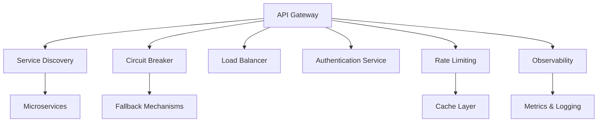
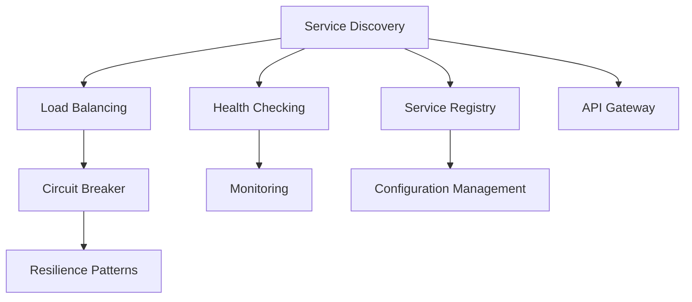
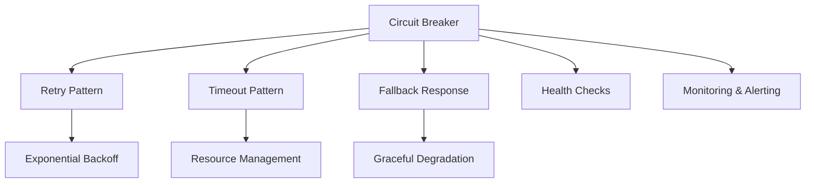
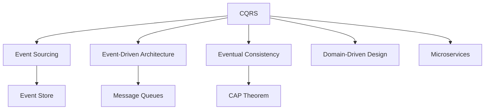
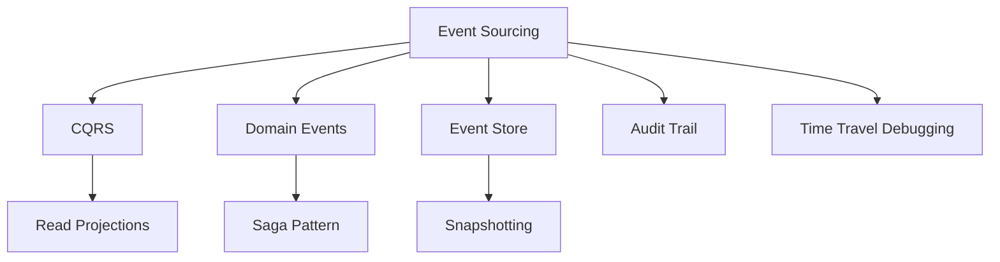

# Szoftver Architektúra

## Rövid összefoglaló

A szoftver architektúra a rendszerek szerkezeti és szervezési elveit határozza meg, amelyek hosszú távon biztosítják a fenntarthatóságot, skálázhatóságot és megbízhatóságot. Modern architektúrák mikroszolgáltatás alapúak, használnak rétegezett felépítést (layered architecture), port-adapter mintákat és bounded context koncepciókat. Az idempotencia és aszinkron üzenetkezelés alapvető elvek, amelyeket cache-eléssel és resiliency mechanizmusokkal (retry, circuit breaker) egészítünk ki. Megfigyelhetőség (observability) kulcsfontosságú a hibakereséshez. Fő buktatók: overengineering, chatty services és monolitikus adatbázis-használat.

## Fogalmak

### Monolit {#monolit}

<div class="concept-section mental-model" data-filter="patterns junior">

🏢 **Fogalom meghatározása**  
*A monolitikus architektúra egy szoftvertervezési minta, amelyben az alkalmazás minden komponense (UI, üzleti logika, adatelérési réteg) egyetlen, egységes kódbázisban és deployment egységben van összeépítve. Minden funkció szorosan összekapcsolódik, közös memóriaterületen fut, és általában egyetlen adatbázist használ. A deployment, skálázás és verziókezelés az egész alkalmazásra vonatkozik egyszerre.*

</div>

<div class="concept-section why-important" data-filter="patterns junior">

💡 **Miért számít?**
- **Egyszerű kezdés**: egy alkalmazás, egy adatbázis, egy deployment
- **Fejlesztési sebesség**: kezdeti fejlesztés gyors, összes kód egy helyen
- **Testing egyszerűség**: integráció és E2E tesztek könnyebbek
- **Skálázási korlátok**: egész alkalmazást kell skálázni, nem csak a bottleneck részeket

</div>

<div class="runnable-model" data-filter="patterns junior">

**Runnable mental model**
```java
// Monolitikus alkalmazás struktúra - minden egy helyen
@SpringBootApplication
public class MonolithicECommerceApplication {
    // Minden komponens egy alkalmazásban
    
    @RestController
    class OrderController {
        @GetMapping("/orders")
        public List<Order> getOrders() { /* orders logic */ }
    }
    
    @RestController  
    class ProductController {
        @GetMapping("/products")
        public List<Product> getProducts() { /* products logic */ }
    }
    
    @RestController
    class UserController {
        @GetMapping("/users")
        public List<User> getUsers() { /* users logic */ }
    }
    
    // Közös adatbázis minden funkcióhoz
    @Repository
    class DatabaseRepository {
        // orders, products, users táblák ugyanabban a DB-ben
        // Egy transaction mindent kezel
    }
}
```
*Figyeld meg: minden üzleti logika egy alkalmazásban, közös adatbázissal és deployment egységgel.*

</div>

<div class="concept-section myths" data-filter="patterns">

<details>
<summary>🧯 <strong>Gyakori tévhitek / félreértések</strong></summary>

<div>

- „Monolit mindig rossz." → Kis csapatoknak és egyszerű alkalmazásoknak tökéletes választás
- „Microservice mindig jobb." → Komplexitás és infrastruktúra overhead is jár vele
- „Monolitból nem lehet microservice." → Strangler Fig pattern segítségével fokozatosan átállítható

</div>

</details>

</div>

<div class="concept-section micro-learning" data-filter="patterns">

<details>
<summary>📚 <strong>5 perces mikro-tanulás</strong></summary>

<div>

**Monolit előnyei:**
- Egyszerű deployment (egy JAR/WAR file)
- ACID tranzakciók könnyű kezelése
- Performance - nincs network overhead
- Debugging egyszerűbb
- DevOps költségek alacsonyabbak

**Monolit hátrányai:**
- Skálázás korlátai
- Technology lock-in
- Fejlesztői csapat konfliktusok
- Large codebase karbantartása

**Mikor válassz monolitot:**
- Kis csapat (< 8-10 fő)
- MVP és proof of concept
- Jól definiált, stabil domain
- Egyszerű deployment requirements

</div>

</details>

</div>

### Microservices Patterns (Service Discovery, Circuit Breaker, API Gateway, Saga, Event Sourcing) {#microservices-patterns}

<div class="concept-section definition">

📋 **Fogalom meghatározása**

**Microservices Architecture** = Alkalmazás felbontása **kis, független, lazán csatolt szolgáltatásokra**, amelyek egy-egy **business capability**-t valósítanak meg, saját adatbázissal, független deploymenttel és API-n keresztüli kommunikációval.

**Kulcs elvek**:
1. **Single Responsibility**: Egy service = egy business capability (User, Order, Payment)
2. **Database per Service**: Minden service saját adatbázis (data autonomy, bounded context)
3. **Independent Deployment**: Service-ek külön-külön deployolhatók (CI/CD pipeline per service)
4. **Decentralized Governance**: Minden team saját tech stack-et választhat
5. **Failure Isolation**: Egy service hibája nem dönti le az egész rendszert

**Essential Microservices Patterns**:

1. **Service Discovery** (Szolgáltatás felderítés)
   - **Problem**: Dinamikus környezetben service instances címe változik (scaling, restart)
   - **Solution**: Service Registry (Eureka, Consul) + Client-side/Server-side discovery
   - **Components**: Service Registry, Health checks, Load balancing
   - **Example**: Eureka Server (Spring Cloud), Consul, Kubernetes Service Discovery

2. **Circuit Breaker** (Áramkör megszakító)
   - **Problem**: Cascading failures (egy lassú service blokkolja az egész rendszert)
   - **Solution**: Failure detection + automatic recovery + fallback
   - **States**: Closed (normal) → Open (failing) → Half-Open (testing recovery)
   - **Implementation**: Resilience4j, Hystrix (deprecated), Spring Cloud Circuit Breaker

3. **API Gateway** (Egyetlen belépési pont)
   - **Problem**: Clients minden service-t külön hívnának (N requests), authentication minden service-ben
   - **Solution**: Single entry point, request routing, authentication, rate limiting, response aggregation
   - **Features**: Routing, Authentication/Authorization, Rate limiting, Request/Response transformation, Caching
   - **Tools**: Kong, AWS API Gateway, Spring Cloud Gateway, Zuul

4. **Saga Pattern** (Distributed transactions)
   - **Problem**: ACID transactions nem működnek distributed environment-ben (2PC slow, locks)
   - **Solution**: Long-lived transaction = sequence of local transactions + compensation
   - **Types**: Choreography (event-driven, no orchestrator) vs Orchestration (central coordinator)
   - **Example**: Order → Payment → Inventory → Shipping (ha Payment fails → compensate Order)

5. **Event Sourcing** (Event stream as source of truth)
   - **Problem**: Current state only, no audit trail, difficult to reconstruct past
   - **Solution**: Store events (state changes) instead of current state, rebuild state by replaying events
   - **Benefits**: Complete audit trail, Temporal queries, Event replay, CQRS compatibility
   - **Challenges**: Event schema evolution, Snapshot strategy, Eventual consistency

**Microservices vs Monolith Trade-offs**:
```
Monolith:
✅ Egyszerű deployment (1 JAR)
✅ ACID transactions
✅ Egyszerű debugging
✅ Alacsony latency (in-memory)
❌ Scaling (egész app)
❌ Technology lock-in
❌ Single point of failure

Microservices:
✅ Independent scaling
✅ Technology diversity
✅ Team autonomy
✅ Fault isolation
❌ Network latency
❌ Distributed system complexity
❌ Data consistency challenges
❌ DevOps overhead
```

</div>

<div class="concept-section why-matters">

💡 **Miért számít a Microservices Patterns ismerete?**

**1. Industry adoption (Netflix, Amazon, Uber)**
```
Netflix:
- 700+ microservices
- 1B+ requests/day
- Chaos engineering (Chaos Monkey)
- Hystrix Circuit Breaker (now Resilience4j)

Amazon:
- "Two-pizza teams" (max 10 people per service)
- Independent deployment minden service-hez
- Service-oriented architecture since 2001

Uber:
- 2200+ microservices
- API Gateway kezel 40M+ requests/minute
- Event-driven architecture (Kafka)
```

**2. Scaling requirements**
```javascript
// Monolith scaling problem:
// User Service: 1000 req/s (OK)
// Order Service: 100 req/s (OK)
// Search Service: 50,000 req/s (BOTTLENECK!)

// → Must scale ENTIRE monolith for Search
// → Wastes resources (User/Order don't need scaling)

// Microservices solution:
// User Service: 2 instances
// Order Service: 2 instances
// Search Service: 20 instances (only this scaled!)
// → Resource efficiency + cost savings
```

**3. Team autonomy (Conway's Law)**
```
"Organizations design systems that mirror their communication structure"

Monolith:
- 50 developers → 1 codebase
- Merge conflicts, coordination overhead
- Release bottleneck (all features wait for QA)

Microservices:
- 5 teams × 10 developers
- Each team owns 2-3 services
- Independent releases (100+ deploys/day possible)
- Clear ownership and accountability
```

**4. Failure isolation importance**
```javascript
// Monolith: Single point of failure
// If Payment module crashes → entire app down
// Users can't browse products, can't view orders

// Microservices: Fault isolation
// If Payment service crashes:
//   - Users still browse products ✅
//   - Users still view orders ✅
//   - Payment temporarily unavailable (Circuit Breaker → fallback)
//   - Graceful degradation instead of total failure
```

**5. Technology evolution**
```java
// Monolith: Technology lock-in
// Started with Java 8 + Spring 4 + MySQL
// → Hard to upgrade (big bang migration)
// → Stuck with old tech for years

// Microservices: Technology diversity
// User Service: Java 17 + Spring Boot 3 + PostgreSQL
// Search Service: Elasticsearch + Go (performance)
// Analytics Service: Python + Spark (ML pipelines)
// Notification Service: Node.js + Redis (real-time)

// → Each service chooses best tool for the job
```

</div>

<div class="concept-section runnable-model">

🚀 **Runnable Mental Model**

**1. Service Discovery (Eureka Example)**
```java
// Eureka Server - Service Registry
@SpringBootApplication
@EnableEurekaServer
public class EurekaServerApplication {
    public static void main(String[] args) {
        SpringApplication.run(EurekaServerApplication.class, args);
    }
}

// application.yml
server:
  port: 8761
eureka:
  client:
    register-with-eureka: false  # Server doesn't register itself
    fetch-registry: false

// User Service - Registers with Eureka
@SpringBootApplication
@EnableEurekaClient
public class UserServiceApplication {
    public static void main(String[] args) {
        SpringApplication.run(UserServiceApplication.class, args);
    }
}

// application.yml
spring:
  application:
    name: user-service
eureka:
  client:
    service-url:
      defaultZone: http://localhost:8761/eureka/
  instance:
    prefer-ip-address: true

// Order Service - Discovers User Service via Eureka
@RestController
public class OrderController {
    @Autowired
    private RestTemplate restTemplate;  // Load-balanced automatically
    
    @GetMapping("/orders/{id}")
    public Order getOrder(@PathVariable Long id) {
        // Eureka resolves "user-service" to actual IP:port
        User user = restTemplate.getForObject(
            "http://user-service/users/" + order.getUserId(),
            User.class
        );
        
        return order;
    }
}

// RestTemplate with Load Balancing
@Configuration
public class RestTemplateConfig {
    @Bean
    @LoadBalanced  // Eureka + Ribbon load balancing
    public RestTemplate restTemplate() {
        return new RestTemplate();
    }
}
```

**2. Circuit Breaker (Resilience4j)**
```java
// Add dependency: resilience4j-spring-boot2

// Order Service with Circuit Breaker
@RestController
public class OrderController {
    @Autowired
    private UserServiceClient userServiceClient;
    
    @GetMapping("/orders/{id}")
    public Order getOrder(@PathVariable Long id) {
        Order order = orderRepository.findById(id);
        
        // Call User Service with Circuit Breaker protection
        User user = userServiceClient.getUserWithFallback(order.getUserId());
        
        order.setUser(user);
        return order;
    }
}

@Service
public class UserServiceClient {
    @Autowired
    private RestTemplate restTemplate;
    
    // Circuit Breaker annotation
    @CircuitBreaker(name = "userService", fallbackMethod = "getUserFallback")
    @Retry(name = "userService")  // Retry before opening circuit
    @Bulkhead(name = "userService")  // Limit concurrent calls
    public User getUser(Long userId) {
        return restTemplate.getForObject(
            "http://user-service/users/" + userId,
            User.class
        );
    }
    
    // Fallback method (same signature + Throwable)
    public User getUserFallback(Long userId, Throwable t) {
        System.err.println("User Service unavailable, returning cached data");
        return new User(userId, "Unknown User", "guest@example.com");
    }
}

// application.yml - Circuit Breaker configuration
resilience4j:
  circuitbreaker:
    instances:
      userService:
        sliding-window-size: 10  # Last 10 calls tracked
        failure-rate-threshold: 50  # Open if 50% fail
        wait-duration-in-open-state: 10s  # Stay open for 10s
        permitted-number-of-calls-in-half-open-state: 3
        automatic-transition-from-open-to-half-open-enabled: true
  
  retry:
    instances:
      userService:
        max-attempts: 3
        wait-duration: 1s
        
  bulkhead:
    instances:
      userService:
        max-concurrent-calls: 10  # Max 10 concurrent requests

// Circuit Breaker States:
// CLOSED (normal): Requests pass through, track failures
// OPEN (failing): Reject requests immediately, return fallback
// HALF_OPEN (testing): Allow limited requests to test recovery
```

**3. API Gateway (Spring Cloud Gateway)**
```java
// API Gateway Application
@SpringBootApplication
public class ApiGatewayApplication {
    public static void main(String[] args) {
        SpringApplication.run(ApiGatewayApplication.class, args);
    }
}

// application.yml - Route configuration
spring:
  cloud:
    gateway:
      routes:
        # User Service routes
        - id: user-service
          uri: lb://user-service  # Load-balanced via Eureka
          predicates:
            - Path=/api/users/**
          filters:
            - RewritePath=/api/users/(?<segment>.*), /users/$\{segment}
            - AddRequestHeader=X-Gateway, API-Gateway
        
        # Order Service routes
        - id: order-service
          uri: lb://order-service
          predicates:
            - Path=/api/orders/**
          filters:
            - RewritePath=/api/orders/(?<segment>.*), /orders/$\{segment}
            - name: CircuitBreaker
              args:
                name: orderServiceCB
                fallbackUri: forward:/fallback/orders
        
        # Product Service with rate limiting
        - id: product-service
          uri: lb://product-service
          predicates:
            - Path=/api/products/**
          filters:
            - name: RequestRateLimiter
              args:
                redis-rate-limiter.replenishRate: 10  # 10 req/s
                redis-rate-limiter.burstCapacity: 20

// Authentication Filter (Global)
@Component
public class AuthenticationFilter implements GlobalFilter {
    @Override
    public Mono<Void> filter(ServerWebExchange exchange, GatewayFilterChain chain) {
        String token = exchange.getRequest().getHeaders().getFirst("Authorization");
        
        if (token == null || !isValidToken(token)) {
            exchange.getResponse().setStatusCode(HttpStatus.UNAUTHORIZED);
            return exchange.getResponse().setComplete();
        }
        
        // Add user info to request header
        ServerHttpRequest request = exchange.getRequest().mutate()
            .header("X-User-Id", extractUserId(token))
            .build();
        
        return chain.filter(exchange.mutate().request(request).build());
    }
    
    private boolean isValidToken(String token) {
        // JWT validation logic
        return true;
    }
    
    private String extractUserId(String token) {
        // Extract user ID from JWT
        return "user123";
    }
}

// Fallback Controller
@RestController
public class FallbackController {
    @GetMapping("/fallback/orders")
    public ResponseEntity<Map<String, String>> orderFallback() {
        return ResponseEntity.status(HttpStatus.SERVICE_UNAVAILABLE)
            .body(Map.of(
                "error", "Order Service temporarily unavailable",
                "message", "Please try again later"
            ));
    }
}
```

**4. Saga Pattern (Orchestration with Spring State Machine)**
```java
// Order Saga States
public enum OrderSagaState {
    ORDER_CREATED,
    PAYMENT_PENDING,
    PAYMENT_COMPLETED,
    INVENTORY_RESERVED,
    SHIPPING_SCHEDULED,
    ORDER_COMPLETED,
    // Compensation states
    PAYMENT_FAILED,
    INVENTORY_FAILED,
    ORDER_CANCELLED
}

// Order Saga Events
public enum OrderSagaEvent {
    CREATE_ORDER,
    PAYMENT_SUCCESS,
    PAYMENT_FAILURE,
    INVENTORY_SUCCESS,
    INVENTORY_FAILURE,
    SHIPPING_SUCCESS,
    COMPENSATE_ORDER
}

// Saga Orchestrator
@Service
public class OrderSagaOrchestrator {
    @Autowired
    private PaymentServiceClient paymentService;
    
    @Autowired
    private InventoryServiceClient inventoryService;
    
    @Autowired
    private ShippingServiceClient shippingService;
    
    public void createOrder(CreateOrderRequest request) {
        String sagaId = UUID.randomUUID().toString();
        
        try {
            // Step 1: Create Order (local transaction)
            Order order = orderRepository.save(new Order(request));
            
            // Step 2: Process Payment
            PaymentResponse payment = paymentService.processPayment(
                new PaymentRequest(order.getId(), order.getTotalAmount())
            );
            
            if (!payment.isSuccess()) {
                // Compensate: Cancel order
                compensateOrder(order);
                throw new SagaException("Payment failed");
            }
            
            // Step 3: Reserve Inventory
            InventoryResponse inventory = inventoryService.reserveItems(
                new InventoryRequest(order.getItems())
            );
            
            if (!inventory.isSuccess()) {
                // Compensate: Refund payment + Cancel order
                paymentService.refundPayment(payment.getTransactionId());
                compensateOrder(order);
                throw new SagaException("Inventory reservation failed");
            }
            
            // Step 4: Schedule Shipping
            ShippingResponse shipping = shippingService.scheduleShipping(
                new ShippingRequest(order.getId(), order.getAddress())
            );
            
            if (!shipping.isSuccess()) {
                // Compensate: Release inventory + Refund payment + Cancel order
                inventoryService.releaseItems(inventory.getReservationId());
                paymentService.refundPayment(payment.getTransactionId());
                compensateOrder(order);
                throw new SagaException("Shipping scheduling failed");
            }
            
            // All steps successful → Mark order complete
            order.setStatus(OrderStatus.COMPLETED);
            orderRepository.save(order);
            
        } catch (SagaException e) {
            // Log saga failure
            sagaLogRepository.save(new SagaLog(sagaId, e.getMessage()));
            throw e;
        }
    }
    
    private void compensateOrder(Order order) {
        order.setStatus(OrderStatus.CANCELLED);
        orderRepository.save(order);
    }
}

// Choreography alternative (Event-driven)
@Service
public class OrderEventHandler {
    @Autowired
    private KafkaTemplate<String, OrderEvent> kafkaTemplate;
    
    // Order Service publishes event
    public void createOrder(CreateOrderRequest request) {
        Order order = orderRepository.save(new Order(request));
        
        // Publish OrderCreated event
        kafkaTemplate.send("order-events", new OrderCreatedEvent(order));
    }
    
    // Payment Service listens
    @KafkaListener(topics = "order-events")
    public void handleOrderCreated(OrderCreatedEvent event) {
        PaymentResult result = processPayment(event.getOrderId());
        
        if (result.isSuccess()) {
            kafkaTemplate.send("payment-events", new PaymentSuccessEvent(event.getOrderId()));
        } else {
            kafkaTemplate.send("payment-events", new PaymentFailedEvent(event.getOrderId()));
        }
    }
    
    // Order Service listens for compensation
    @KafkaListener(topics = "payment-events")
    public void handlePaymentFailed(PaymentFailedEvent event) {
        Order order = orderRepository.findById(event.getOrderId());
        order.setStatus(OrderStatus.CANCELLED);
        orderRepository.save(order);
    }
}
```

**5. Event Sourcing (Simplified Example)**
```java
// Event Store
@Entity
public class OrderEvent {
    @Id
    @GeneratedValue
    private Long id;
    
    private String aggregateId;  // Order ID
    private String eventType;     // OrderCreated, PaymentProcessed, etc.
    private String eventData;     // JSON payload
    private LocalDateTime timestamp;
    private Long version;         // Event sequence number
}

// Order Aggregate (rebuilds from events)
public class Order {
    private String orderId;
    private String userId;
    private List<OrderItem> items;
    private OrderStatus status;
    private BigDecimal totalAmount;
    
    // Rebuild state from events
    public static Order fromEvents(List<OrderEvent> events) {
        Order order = new Order();
        
        for (OrderEvent event : events) {
            order.apply(event);
        }
        
        return order;
    }
    
    private void apply(OrderEvent event) {
        switch (event.getEventType()) {
            case "OrderCreated":
                OrderCreatedData data = parseJson(event.getEventData(), OrderCreatedData.class);
                this.orderId = event.getAggregateId();
                this.userId = data.getUserId();
                this.items = data.getItems();
                this.status = OrderStatus.CREATED;
                this.totalAmount = data.getTotalAmount();
                break;
                
            case "PaymentProcessed":
                this.status = OrderStatus.PAYMENT_COMPLETED;
                break;
                
            case "OrderShipped":
                this.status = OrderStatus.SHIPPED;
                break;
                
            case "OrderCancelled":
                this.status = OrderStatus.CANCELLED;
                break;
        }
    }
}

// Event Sourcing Repository
@Repository
public class OrderEventStore {
    @Autowired
    private OrderEventRepository eventRepository;
    
    // Save event
    public void saveEvent(OrderEvent event) {
        eventRepository.save(event);
    }
    
    // Load all events for aggregate
    public List<OrderEvent> loadEvents(String orderId) {
        return eventRepository.findByAggregateIdOrderByVersionAsc(orderId);
    }
    
    // Rebuild Order from events
    public Order loadOrder(String orderId) {
        List<OrderEvent> events = loadEvents(orderId);
        return Order.fromEvents(events);
    }
}

// Command Handler
@Service
public class OrderCommandHandler {
    @Autowired
    private OrderEventStore eventStore;
    
    public void handleCreateOrder(CreateOrderCommand command) {
        // Create event
        OrderEvent event = new OrderEvent();
        event.setAggregateId(UUID.randomUUID().toString());
        event.setEventType("OrderCreated");
        event.setEventData(toJson(command));
        event.setTimestamp(LocalDateTime.now());
        event.setVersion(1L);
        
        // Save event (append-only)
        eventStore.saveEvent(event);
        
        // Optionally: Publish event to message bus for CQRS read models
        eventPublisher.publish(event);
    }
}

// Snapshot strategy (optimization)
@Service
public class OrderSnapshotService {
    // Save snapshot every N events to avoid replaying all events
    public void createSnapshot(String orderId) {
        Order order = eventStore.loadOrder(orderId);
        
        OrderSnapshot snapshot = new OrderSnapshot();
        snapshot.setAggregateId(orderId);
        snapshot.setState(toJson(order));
        snapshot.setVersion(order.getVersion());
        snapshot.setTimestamp(LocalDateTime.now());
        
        snapshotRepository.save(snapshot);
    }
    
    // Load from latest snapshot + remaining events
    public Order loadOrderOptimized(String orderId) {
        OrderSnapshot snapshot = snapshotRepository.findLatestByAggregateId(orderId);
        
        if (snapshot == null) {
            // No snapshot, load all events
            return eventStore.loadOrder(orderId);
        }
        
        // Load from snapshot
        Order order = fromJson(snapshot.getState(), Order.class);
        
        // Apply events after snapshot
        List<OrderEvent> eventsAfterSnapshot = eventStore.loadEventsAfterVersion(
            orderId, snapshot.getVersion()
        );
        
        for (OrderEvent event : eventsAfterSnapshot) {
            order.apply(event);
        }
        
        return order;
    }
}
```

**Decision Tree: Melyik Pattern?**
```javascript
function chooseMicroservicesPattern(requirements: {
    dynamicServiceInstances?: boolean;
    cascadingFailures?: boolean;
    singleEntryPoint?: boolean;
    distributedTransaction?: boolean;
    auditTrail?: boolean;
    temporalQueries?: boolean;
}): string {
    if (requirements.dynamicServiceInstances) {
        return "Service Discovery (Eureka, Consul) - Dynamic service registration and discovery";
    }
    
    if (requirements.cascadingFailures) {
        return "Circuit Breaker (Resilience4j) - Prevent cascading failures with fallback";
    }
    
    if (requirements.singleEntryPoint) {
        return "API Gateway (Spring Cloud Gateway, Kong) - Routing, auth, rate limiting";
    }
    
    if (requirements.distributedTransaction) {
        return "Saga Pattern (Orchestration or Choreography) - Compensating transactions";
    }
    
    if (requirements.auditTrail || requirements.temporalQueries) {
        return "Event Sourcing - Store events, rebuild state, temporal queries";
    }
    
    return "Analyze requirements: Scaling? Failure handling? Transaction consistency?";
}

// Példák
console.log(chooseMicroservicesPattern({ dynamicServiceInstances: true }));
// "Service Discovery (Eureka, Consul) - Dynamic service registration and discovery"

console.log(chooseMicroservicesPattern({ distributedTransaction: true }));
// "Saga Pattern (Orchestration or Choreography) - Compensating transactions"

console.log(chooseMicroservicesPattern({ auditTrail: true }));
// "Event Sourcing - Store events, rebuild state, temporal queries"
```

</div>

<div class="concept-section common-mistakes">

<details>
<summary>🧯 <strong>Gyakori tévhitek / hibák</strong></summary>

<div>

**1. "Microservice = small code"**
❌ **Tévhit**: Service mérete (LOC) határozza meg  
✅ **Valóság**: **Business capability** határozza meg
```java
// ❌ ROSSZ: User CRUD service (300 LOC)
// ❌ ROSSZ: Order CRUD service (300 LOC)

// ✅ JÓ: User Management service (1500 LOC)
//    - Registration, Authentication, Profile, Permissions
//    - Bounded context: Everything related to users

// ✅ JÓ: Order Processing service (2000 LOC)
//    - Order creation, Payment, Inventory, Shipping coordination
//    - Bounded context: Order lifecycle
```

**2. "Microservices mindig shared database-t használnak"**
❌ **Tévhit**: Services can query each other's database directly  
✅ **Valóság**: **Database per service** pattern (data autonomy)
```sql
-- ❌ ROSSZ: Order Service queries user_db.users directly
SELECT * FROM user_db.users WHERE id = ?;

-- ✅ JÓ: Order Service calls User Service API
// HTTP GET http://user-service/users/{id}
// → User Service owns its data, enforces business rules
```

**3. "Circuit Breaker = Retry pattern"**
❌ **Tévhit**: Just retry failed requests  
✅ **Valóság**: Circuit Breaker **prevents** retries when service is failing
```javascript
// Retry: Keep trying (can make things worse)
// - Service slow → More retries → More load → Service dies

// Circuit Breaker: Stop trying when failing
// - Detect failure threshold (e.g., 50% fail rate)
// - Open circuit → Reject requests immediately
// - Fallback → Return cached data or error
// → Prevents cascading failures
```

**4. "Saga pattern guarantees ACID transactions"**
❌ **Tévhit**: Saga = distributed ACID  
✅ **Valóság**: Saga = **eventual consistency** with compensating transactions
```java
// ACID (Monolith):
// - Atomicity: All or nothing (rollback if any step fails)
// - Immediate consistency

// Saga (Microservices):
// - No atomicity: Steps commit independently
// - Eventual consistency: Compensation if step fails
// - User might see intermediate states (e.g., "Payment processing...")

// Example: Order → Payment → Inventory
// Payment succeeds, Inventory fails
// → User sees "Order placed" briefly
// → Then "Order cancelled" after compensation
```

**5. "Event Sourcing = Event-driven architecture"**
❌ **Tévhit**: Same thing  
✅ **Valóság**: Different concepts
```
Event-driven architecture:
- Services communicate via events (Kafka, RabbitMQ)
- Events trigger actions (OrderCreated → send email)
- Current state stored in database

Event Sourcing:
- Events ARE the source of truth (append-only event store)
- Current state = replay events
- Audit trail, temporal queries, event replay

Can be combined:
- Event Sourcing internally + Publish events externally
```

</div>
</details>

</div>

<div class="concept-section performance">

<details>
<summary>🚀 <strong>Performance corner</strong></summary>

<div>

**Service Discovery Performance**
```javascript
// Client-side discovery (Eureka):
// - Client fetches registry (cached locally)
// - Client does load balancing
// - Pro: No extra network hop
// - Con: Client complexity

// Server-side discovery (Kubernetes Service):
// - DNS lookup or proxy
// - Server does load balancing
// - Pro: Client simplicity
// - Con: Extra network hop (but minimal <1ms)

// Benchmark (10,000 requests):
// Client-side (Eureka):     ~850ms (cache lookup)
// Server-side (K8s Service): ~920ms (+70ms for DNS/proxy)
// Direct IP (no discovery):  ~800ms (baseline)

// → Client-side slightly faster, but server-side simpler
```

**Circuit Breaker Overhead**
```java
// Resilience4j Circuit Breaker overhead:
// - Closed state: ~50-100ns per call (metrics tracking)
// - Open state: ~10ns per call (immediate reject)
// - Half-open state: ~100ns per call (test recovery)

// Benchmark (1M calls, service responds in 10ms):
// No Circuit Breaker:          10,000ms
// With Circuit Breaker:        10,005ms (+0.05% overhead)

// → Negligible overhead, huge benefit (prevents cascading failures)

// Failure scenario (service down):
// No Circuit Breaker: 30s timeout × 1000 threads = 30,000s wasted
// With Circuit Breaker: Fail fast after 10 failed calls → fallback
```

**API Gateway Latency**
```
Single request:
- Client → API Gateway:    ~5ms
- API Gateway → Service:   ~10ms
- Service processing:      ~50ms
- Total:                   ~65ms

Without Gateway:
- Client → Service:        ~10ms
- Service processing:      ~50ms
- Total:                   ~60ms

→ +5ms overhead (8% increase)

Benefits:
- Authentication centralized (saves 20ms per service call if distributed)
- Rate limiting (prevents DDoS)
- Request aggregation (N requests → 1 gateway call)

Example: Client needs User + Orders + Products
- Without Gateway: 3 requests × 60ms = 180ms
- With Gateway (aggregation): 1 request × 80ms = 80ms (55% faster!)
```

**Saga vs 2PC (Two-Phase Commit) Performance**
```
Two-Phase Commit (distributed ACID):
- Prepare phase: All services vote (locks acquired)
- Commit/Rollback phase: All services commit/rollback
- Latency: 2 network round trips
- Locks held during both phases (blocking)

Benchmark (3 services, 1000 transactions):
- 2PC: ~8500ms (locks + coordination overhead)
- Saga: ~3200ms (local transactions + async compensation)

→ Saga ~2.5x faster (no locks, eventual consistency)

Trade-off:
- 2PC: Strong consistency, slow, blocks
- Saga: Eventual consistency, fast, non-blocking
```

**Event Sourcing Snapshot Strategy**
```javascript
// No snapshot: Replay ALL events (slow)
// 10,000 events × 0.1ms = 1000ms to rebuild state

// With snapshot every 1000 events:
// Load snapshot (1ms) + Replay last 100 events (10ms) = 11ms

// Snapshot frequency optimization:
// - Too frequent: Snapshot overhead (disk I/O)
// - Too infrequent: Slow replay

// Rule of thumb: Snapshot every 100-1000 events
// OR Snapshot every 1 hour/day (time-based)

// Benchmark (1M orders, 10k events each):
// No snapshot:            ~10s to rebuild 1 order
// Snapshot every 1000:    ~50ms to rebuild 1 order (200x faster!)
```

</div>
</details>

</div>

<div class="concept-section tools">

<details>
<summary>🧰 <strong>Kapcsolódó API-k / eszközök</strong></summary>

<div>

**Service Discovery**
```java
// Eureka (Netflix OSS, Spring Cloud)
@EnableEurekaServer  // Server
@EnableEurekaClient  // Client

// Consul (HashiCorp)
// - Service mesh capabilities
// - Key-value store
// - Health checks
// CLI: consul agent -dev

// Kubernetes Service Discovery (built-in)
// - DNS-based (my-service.default.svc.cluster.local)
// - Environment variables (MY_SERVICE_SERVICE_HOST)
```

**Circuit Breaker**
```java
// Resilience4j (modern, lightweight)
@CircuitBreaker(name = "userService", fallbackMethod = "fallback")
@Retry(name = "userService")
@Bulkhead(name = "userService")

// Hystrix (Netflix, deprecated but still used)
@HystrixCommand(fallbackMethod = "fallback")

// Spring Cloud Circuit Breaker (abstraction)
// - Works with Resilience4j, Hystrix, Sentinel
```

**API Gateway**
```yaml
# Spring Cloud Gateway
spring:
  cloud:
    gateway:
      routes:
        - id: user-service
          uri: lb://user-service
          predicates:
            - Path=/api/users/**

# Kong (Lua-based, high performance)
# - Plugin ecosystem (auth, rate limiting, logging)
# - Admin API for configuration

# AWS API Gateway (managed service)
# - Serverless integration (Lambda)
# - Built-in DDoS protection

# NGINX (reverse proxy + API Gateway)
# - High performance, low latency
# - Lua scripting for custom logic
```

**Saga Orchestration**
```java
// Spring State Machine
@EnableStateMachine
// - Define states and transitions
// - Compensation logic

// Axon Framework (CQRS + Event Sourcing + Saga)
@Saga
@SagaEventHandler(associationProperty = "orderId")

// Temporal (Workflow engine)
// - Durable execution (survives failures)
// - Compensation workflows
```

**Event Sourcing**
```java
// Axon Framework
@Aggregate
@AggregateIdentifier
@EventSourcingHandler

// EventStore (specialized event database)
// - Optimized for event streams
// - Projections, subscriptions

// Kafka (event log)
// - Log compaction (snapshots)
// - Kafka Streams for projections
```

**Monitoring & Observability**
```
// Distributed Tracing:
// - Zipkin, Jaeger (OpenTelemetry)
// - Trace request across services

// Metrics:
// - Prometheus + Grafana
// - Service health, latency, error rates

// Logging:
// - ELK Stack (Elasticsearch, Logstash, Kibana)
// - Centralized logging

// Chaos Engineering:
// - Chaos Monkey (Netflix)
// - Gremlin
// - Test resilience by injecting failures
```

</div>
</details>

</div>

<div class="concept-section micro-learning">

<details>
<summary>🎧 <strong>Mikrotanulási promptok</strong></summary>

<div>

**1. Mikor használj microservices-t vs monolith-ot?**
<details>
<summary>Válasz mutatása</summary>

**Monolith jó választás ha**:
- Kis csapat (< 10 developer)
- Egyszerű domain (CRUD app)
- Low traffic (< 1000 req/s)
- Startup (MVP gyorsan kell)
- Budget korlát (kevesebb infra cost)

**Microservices jó választás ha**:
- Nagy csapat (> 20 developer, multiple teams)
- Complex domain (több bounded context)
- High traffic (independent scaling needed)
- Different scaling needs (search vs checkout)
- Technology diversity (ML + Java + Node)
- Frequent deployments (100+/day)

**Rule of thumb**: Start with monolith, migrate to microservices when pain points emerge (scaling, team conflicts, deployment bottlenecks).

**Amazon's rule**: "Two-pizza team" (max 10 people) owns 2-3 microservices.
</details>

**2. Hogyan működik a Circuit Breaker pattern és miért fontos?**
<details>
<summary>Válasz mutatása</summary>

**Problem**: Cascading failures
```
User Service calls Order Service (slow, 30s timeout)
→ 100 concurrent requests
→ 100 threads blocked for 30s each
→ User Service exhausts threads
→ Entire system down
```

**Circuit Breaker solution**: Fail fast
```
States:
1. CLOSED (normal): Requests pass through, track failures
2. OPEN (failing): Reject requests immediately, return fallback
3. HALF_OPEN (testing): Allow limited requests to test recovery

Thresholds (example):
- Failure rate: 50% (if 5/10 calls fail)
- Wait duration in open: 10s (before trying half-open)
- Calls in half-open: 3 (test if service recovered)

If service recovered: HALF_OPEN → CLOSED
If still failing: HALF_OPEN → OPEN (wait another 10s)
```

**Benefits**:
- Prevents thread exhaustion
- Fast failure (no waiting for timeout)
- Graceful degradation (fallback to cached data)

**Implementation**: Resilience4j `@CircuitBreaker` annotation
</details>

**3. Mi a különbség Service Discovery client-side és server-side között?**
<details>
<summary>Válasz mutatása</summary>

**Client-side discovery** (Eureka, Consul):
```
1. Services register with Service Registry (Eureka Server)
2. Client fetches registry (cached locally)
3. Client does load balancing (Ribbon)
4. Client calls service directly (no proxy)

Pros:
- No extra network hop (faster)
- Client controls load balancing strategy

Cons:
- Client complexity (must implement discovery logic)
- Every client needs discovery library
```

**Server-side discovery** (Kubernetes Service, AWS ELB):
```
1. Services register with platform (K8s, AWS)
2. Client queries DNS or load balancer
3. Load balancer routes to service instance
4. Load balancer does load balancing

Pros:
- Client simplicity (just DNS lookup or LB URL)
- Platform handles discovery (K8s Service)

Cons:
- Extra network hop (+1-2ms latency)
- Load balancer single point of failure (but highly available)
```

**Which to use**:
- Kubernetes: Use server-side (K8s Service built-in)
- Spring Cloud: Use client-side (Eureka + Ribbon)
- AWS: Use server-side (ELB, ALB)
</details>

**4. Mi a különbség API Gateway és Service Mesh között?**
<details>
<summary>Válasz mutatása</summary>

**API Gateway**: North-south traffic (client → services)
```
Responsibilities:
- Single entry point for clients
- Routing (path-based)
- Authentication/Authorization
- Rate limiting
- Request/Response transformation
- API composition (aggregate responses)

Position: Edge of the system

Examples: Kong, Spring Cloud Gateway, AWS API Gateway
```

**Service Mesh**: East-west traffic (service → service)
```
Responsibilities:
- Service-to-service communication
- Load balancing
- Circuit breaking
- Retries, timeouts
- Distributed tracing
- mTLS (mutual TLS) encryption
- Traffic splitting (canary deployments)

Position: Between services (sidecar proxy)

Examples: Istio, Linkerd, Consul Connect
```

**Can coexist**:
- API Gateway: Client → Gateway → Services
- Service Mesh: Services ↔ Services (with sidecar proxies)

**Istio architecture**:
- Envoy proxy (sidecar) for each service
- Control plane (Pilot, Citadel, Galley)
- No code changes (proxy intercepts traffic)
</details>

**5. Hogyan kezeled distributed transactions microservices-ben (Saga pattern)?**
<details>
<summary>Válasz mutatása</summary>

**Problem**: ACID transactions don't work across services
- 2PC (Two-Phase Commit) slow, blocks, not scalable

**Saga Pattern**: Sequence of local transactions + compensating transactions

**Two types**:

**1. Orchestration** (Centralized coordinator):
```java
OrderSagaOrchestrator {
    1. Create Order (local tx)
    2. Call Payment Service → Success? Continue : Compensate
    3. Call Inventory Service → Success? Continue : Compensate (refund)
    4. Call Shipping Service → Success? Done : Compensate (release + refund)
}

Pros:
- Centralized control (easier to debug)
- Clear workflow

Cons:
- Single point of failure (orchestrator)
- Orchestrator knows about all services (coupling)
```

**2. Choreography** (Event-driven, decentralized):
```java
OrderService:
    - Create Order → Publish OrderCreated event

PaymentService:
    - Listen OrderCreated → Process payment
    - Publish PaymentSuccess OR PaymentFailed

InventoryService:
    - Listen PaymentSuccess → Reserve items
    - Publish InventoryReserved OR InventoryFailed

OrderService:
    - Listen PaymentFailed/InventoryFailed → Cancel order (compensation)

Pros:
- Decentralized (no single point of failure)
- Loose coupling (services don't know about each other)

Cons:
- Hard to track workflow (events scattered across services)
- Debugging difficult (distributed tracing needed)
```

**Which to use**:
- Simple workflow (3-4 steps): Choreography
- Complex workflow (> 5 steps, branching logic): Orchestration
</details>

**6. Mikor használj Event Sourcing-ot és mik a trade-offok?**
<details>
<summary>Válasz mutatása</summary>

**Event Sourcing**: Store events (state changes) instead of current state

**Use cases**:
```
✅ Audit trail required:
   - Financial systems (every transaction logged)
   - Healthcare (patient history)
   - Compliance (GDPR, SOX)

✅ Temporal queries:
   - "What was the order status at 2pm yesterday?"
   - "Replay last week's events"

✅ Event replay:
   - Rebuild state after bug fix
   - Create new projections (read models)

✅ CQRS compatibility:
   - Write model: Event Store
   - Read model: Projections (optimized for queries)
```

**Pros**:
- Complete audit trail
- Time travel (temporal queries)
- Event replay (rebuild state, fix bugs)
- CQRS (separate write and read models)

**Cons**:
- **Event schema evolution**: Old events with new schema
- **Snapshot strategy**: Replaying 1M events slow (need snapshots)
- **Eventual consistency**: Read models lag behind write model
- **Storage**: More data (events + snapshots)
- **Complexity**: Learning curve, tooling (Axon, EventStore)

**When NOT to use**:
- Simple CRUD app (overkill)
- No audit trail needed
- Small team (limited expertise)

**Snapshot optimization**:
```
No snapshot: Replay ALL events (slow)
- 10,000 events × 0.1ms = 1000ms

With snapshot every 1000 events:
- Load snapshot (1ms) + Replay last 100 (10ms) = 11ms
```
</details>

**7. Hogyan debuggolsz microservices environment-ben distributed tracing-gel?**
<details>
<summary>Válasz mutatása</summary>

**Problem**: Single request spans multiple services
```
Client → API Gateway → User Service → Order Service → Payment Service
                    ↓               ↓                ↓
                 Logs 1          Logs 2           Logs 3

→ Hard to correlate logs across services
→ Which service caused the slow response?
```

**Distributed Tracing**: Track request across services

**Key concepts**:
```
Trace: Single request journey (e.g., "Create Order")
Span: Single operation within trace (e.g., "Call Payment Service")
Trace ID: Unique ID for entire request (propagated across services)
Span ID: Unique ID for each operation

Example:
Trace ID: abc123
  Span 1 (API Gateway):  ID=span1, Parent=null,  Duration=150ms
  Span 2 (User Service): ID=span2, Parent=span1, Duration=50ms
  Span 3 (Order Service):ID=span3, Parent=span1, Duration=80ms
  Span 4 (Payment Service):ID=span4, Parent=span3, Duration=30ms
```

**Implementation** (Spring Cloud Sleuth + Zipkin):
```xml
<dependency>
    <groupId>org.springframework.cloud</groupId>
    <artifactId>spring-cloud-starter-sleuth</artifactId>
</dependency>
<dependency>
    <groupId>org.springframework.cloud</groupId>
    <artifactId>spring-cloud-sleuth-zipkin</artifactId>
</dependency>
```

```yaml
spring:
  zipkin:
    base-url: http://localhost:9411  # Zipkin server
  sleuth:
    sampler:
      probability: 1.0  # Sample 100% of requests (use 0.1 in prod)
```

**How it works**:
1. API Gateway generates Trace ID (abc123)
2. Sleuth adds Trace ID to HTTP headers (`X-B3-TraceId`)
3. Each service logs with Trace ID + Span ID
4. Zipkin UI shows waterfall diagram (which service slow?)

**Zipkin UI**:
- Search by Trace ID
- See all spans in trace
- Identify bottleneck (longest span)

**Alternatives**: Jaeger (Uber), AWS X-Ray, Google Cloud Trace
</details>

**8. Mikor használj API Gateway aggregation pattern-t és mik a pitfallok?**
<details>
<summary>Válasz mutatása</summary>

**Problem**: Client needs data from multiple services
```
Mobile app dashboard:
- User profile (User Service)
- Recent orders (Order Service)
- Recommendations (Product Service)

Without aggregation:
- 3 HTTP requests from mobile (slow on 3G)
- 3 round trips (latency adds up)
- Client handles failures
```

**API Gateway Aggregation**: Single request to gateway, gateway fetches data
```java
@GetMapping("/dashboard")
public DashboardResponse getDashboard(@RequestHeader("X-User-Id") String userId) {
    // Parallel calls to services
    CompletableFuture<User> userFuture = CompletableFuture.supplyAsync(
        () -> userServiceClient.getUser(userId)
    );
    
    CompletableFuture<List<Order>> ordersFuture = CompletableFuture.supplyAsync(
        () -> orderServiceClient.getRecentOrders(userId)
    );
    
    CompletableFuture<List<Product>> recommendationsFuture = CompletableFuture.supplyAsync(
        () -> productServiceClient.getRecommendations(userId)
    );
    
    // Wait for all
    CompletableFuture.allOf(userFuture, ordersFuture, recommendationsFuture).join();
    
    return new DashboardResponse(
        userFuture.get(),
        ordersFuture.get(),
        recommendationsFuture.get()
    );
}
```

**Benefits**:
- Single request from client (reduces latency on slow networks)
- Parallel service calls (faster than sequential)
- API Gateway handles failures (fallback, circuit breaker)

**Pitfalls**:
```
❌ Tight coupling: Gateway knows about User/Order/Product schemas
   → Solution: BFF (Backend for Frontend) pattern per client type

❌ Gateway becomes bottleneck: All traffic through gateway
   → Solution: Scale gateway horizontally, cache responses

❌ One service slow → Entire request slow
   → Solution: Set timeouts, use circuit breakers, partial responses

❌ Data consistency: Aggregated data from different times
   → Solution: Eventual consistency accepted, or use versioning
```

**When NOT to use**:
- Real-time updates (use WebSocket instead)
- Large payloads (aggregate causes memory issues)
- Services return 10MB each → 30MB response!
  → Solution: Pagination, filtering at service level
</details>

</div>
</details>

</div>

<div class="concept-section applications">

📚 **Alkalmazási területek**
- **E-commerce**: Netflix (700+ services), Amazon (SOA/microservices since 2001), Uber (2200+ services)
- **Financial services**: PayPal (distributed transactions with Saga), Banking (event sourcing for audit)
- **Social media**: Twitter (scalability, independent service deployments)
- **Streaming**: Netflix (Chaos Monkey, Hystrix Circuit Breaker, Eureka Service Discovery)
- **Ride-sharing**: Uber (API Gateway 40M+ req/min, Kafka event-driven)
- **Cloud platforms**: AWS (API Gateway, Lambda microservices), Azure (Service Fabric)

</div>

<div class="concept-section interview-questions">

💼 **Interjú kérdések**
1. **"Microservices vs Monolith"** → Trade-offs, when to use each, migration strategy
2. **"Service Discovery"** → Client-side vs Server-side, Eureka, Kubernetes Service
3. **"Circuit Breaker"** → States (Closed/Open/Half-Open), Resilience4j configuration, fallback
4. **"API Gateway"** → Routing, authentication, rate limiting, aggregation pattern pitfalls
5. **"Distributed Transactions"** → 2PC vs Saga, Orchestration vs Choreography, compensation
6. **"Event Sourcing"** → Events vs state, snapshot strategy, CQRS, temporal queries
7. **"Saga compensation"** → How to rollback distributed transaction, idempotency
8. **"Microservices challenges"** → Data consistency, distributed tracing, testing, deployment

</div>

<div class="concept-section related-algorithms">

🔗 **Kapcsolódó koncepcók**  
`Domain-Driven Design (DDD)` · `CQRS` · `Bounded Context` · `Event-Driven Architecture` · `Service Mesh` · `Kubernetes` · `Distributed Systems` · `CAP Theorem`

</div>

<div class="tags">
  <span class="tag">microservices</span>
  <span class="tag">service-discovery</span>
  <span class="tag">circuit-breaker</span>
  <span class="tag">api-gateway</span>
  <span class="tag">saga-pattern</span>
  <span class="tag">event-sourcing</span>
  <span class="tag">distributed-systems</span>
  <span class="tag">resilience</span>
  <span class="tag">medior</span>
</div>

### Rétegek (Layered Architecture) {#retegek-layered-architecture}
Logikai rétegek: prezentáció, üzleti logika, adatkezelés. Segíti a separation of concerns elvét.

**Példa:**
```java
// Presentation Layer
@RestController
@RequestMapping("/api/users")
public class UserController {
    private final UserService userService;
    
    @GetMapping("/{id}")
    public ResponseEntity<UserDTO> getUser(@PathVariable Long id) {
        UserDTO user = userService.getUserById(id);
        return ResponseEntity.ok(user);
    }
    
    @PostMapping
    public ResponseEntity<UserDTO> createUser(@RequestBody CreateUserRequest request) {
        UserDTO createdUser = userService.createUser(request);
        return ResponseEntity.status(HttpStatus.CREATED).body(createdUser);
    }
}

// Business Logic Layer
@Service
@Transactional
public class UserService {
    private final UserRepository userRepository;
    private final EmailService emailService;
    
    public UserDTO createUser(CreateUserRequest request) {
        // Business logic validation
        if (userRepository.existsByEmail(request.getEmail())) {
            throw new UserAlreadyExistsException();
        }
        
        User user = new User(request.getName(), request.getEmail());
        User savedUser = userRepository.save(user);
        
        // Business logic - send welcome email
        emailService.sendWelcomeEmail(savedUser.getEmail());
        
        return UserMapper.toDTO(savedUser);
    }
}

// Data Access Layer
@Repository
public interface UserRepository extends JpaRepository<User, Long> {
    boolean existsByEmail(String email);
    Optional<User> findByEmail(String email);
}
```

Magyarázat: Minden réteg csak az alatta lévő rétegre támaszkodik, tiszta elválasztás a felelősségek között.

### Port–Adapter (Hexagonal) {#port-adapter-hexagonal}

<div class="concept-section mental-model" data-filter="patterns medior">

⬡ **Fogalom meghatározása**  
*A Hexagonal Architecture (más néven Ports and Adapters) egy szoftver architektúra minta, amely elválasztja az alkalmazás központi üzleti logikáját (domain core) a külső függőségektől (adatbázisok, UI, external services). A **portok** absztrakciók (interface-ek), amelyeken keresztül a core kommunikál a külvilággal, míg az **adapterek** konkrét implementációk, amelyek a portokhoz csatlakoznak. Ez lehetővé teszi a külső technológiák cseréjét anélkül, hogy az üzleti logikát módosítani kellene.*

</div>

<div class="concept-section why-important" data-filter="patterns medior">

💡 **Miért számít?**
- **Technology independence**: core logic független az adatbázistól, UI-tól
- **Testability**: könnyű unit és integration tesztek
- **Flexibility**: külső rendszerek cseréje anélkül, hogy a core logika változna
- **Clean architecture**: business logic a középpontban, infrastructure peremén

</div>

<div class="runnable-model" data-filter="patterns">

**Runnable mental model**
```java
// Domain Core - Port (Interface)
public interface UserRepository {
    User save(User user);
    Optional<User> findById(Long id);
    Optional<User> findByEmail(String email);
}

public interface NotificationService {
    void sendNotification(String message, String recipient);
}

// Domain Service (Core Logic) - csak portokat ismer
@Service
public class UserService {
    private final UserRepository userRepository;
    private final NotificationService notificationService;
    
    // Dependency injection - csak interfészektől függ
    public UserService(UserRepository userRepository, 
                      NotificationService notificationService) {
        this.userRepository = userRepository;
        this.notificationService = notificationService;
    }
    
    public User createUser(String name, String email) {
        // Core business logic
        if (userRepository.findByEmail(email).isPresent()) {
            throw new UserAlreadyExistsException(email);
        }
        
        User user = new User(name, email);
        User savedUser = userRepository.save(user);
        
        // Business rule: send welcome notification
        notificationService.sendNotification("Welcome!", email);
        
        return savedUser;
    }
}

// Adapter - Database Implementation (Infrastructure)
@Repository
public class JpaUserRepository implements UserRepository {
    private final JpaUserRepositoryInterface jpaRepo;
    
    @Override
    public User save(User user) {
        UserEntity entity = UserMapper.toEntity(user);
        UserEntity savedEntity = jpaRepo.save(entity);
        return UserMapper.toDomain(savedEntity);
    }
    
    @Override
    public Optional<User> findByEmail(String email) {
        return jpaRepo.findByEmail(email)
            .map(UserMapper::toDomain);
    }
}

// Adapter - Email Implementation (Infrastructure)
@Component
public class EmailNotificationService implements NotificationService {
    @Override
    public void sendNotification(String message, String recipient) {
        // SMTP email sending logic
        emailClient.sendEmail(recipient, "Welcome", message);
    }
}
```
*Figyeld meg: UserService csak az interfészeket ismeri, konkrét implementációktól független.*

</div>

<div class="concept-section micro-learning" data-filter="patterns">

<details>
<summary>📚 <strong>5 perces mikro-tanulás</strong></summary>

<div>

**Hexagonal Architecture rétegei:**
```
Domain Core (Business Logic):
- Entities, Value Objects
- Domain Services  
- Business Rules
- Ports (Interfaces)

Application Layer:
- Use Cases
- Application Services
- Command/Query Handlers

Infrastructure (Adapters):
- Database implementations
- External API clients
- Message queue handlers
- Web controllers
```

**Testing strategy:**
```java
// Unit test - mock adapters
@Test
void shouldCreateUserWithNotification() {
    // Given
    UserRepository mockRepo = mock(UserRepository.class);
    NotificationService mockNotification = mock(NotificationService.class);
    UserService service = new UserService(mockRepo, mockNotification);
    
    // When
    service.createUser("John", "john@test.com");
    
    // Then - business logic verification
    verify(mockRepo).save(any(User.class));
    verify(mockNotification).sendNotification("Welcome!", "john@test.com");
}
```

</div>

</details>

</div>

### Bounded Context {#bounded-context}
Domain Driven Design (DDD) fogalom: egy adott üzleti terület logikailag elkülönített része.

**Példa:**
```java
// User Management Context
package com.ecommerce.user;
public class User {
    private Long id;
    private String name;
    private String email;
    private UserStatus status;
}

// Order Management Context - másik User fogalom
package com.ecommerce.order;
public class User {
    private Long userId;
    private String shippingAddress;
    private PaymentMethod preferredPayment;
    // Itt csak a rendeléshez szükséges adatok
}

// Inventory Context - megint más User reprezentáció
package com.ecommerce.inventory;
public class User {
    private Long userId;
    private UserType type; // retail, wholesale
    private DiscountLevel discountLevel;
}
```

Magyarázat: Minden bounded context-ben a User fogalma más jelentéssel bír, a kontextusnak megfelelően.

### Idempotencia {#idempotencia}

<div class="concept-section mental-model" data-filter="resilience medior">

🔁 **Fogalom meghatározása**  
*Az idempotencia egy matematikai és számítástechnikai tulajdonság, amely szerint egy művelet többszöri végrehajtása ugyanazt az eredményt produkálja, mint az egyszeri végrehajtás. Elosztott rendszerekben kritikus koncepció: lehetővé teszi, hogy biztonságosan újra próbálkozhassunk sikertelen műveletekkel (retry) anélkül, hogy káros mellékhatásokat okoznánk (pl. duplikált tranzakciók, többszörös levonások). HTTP szempontból: GET, PUT, DELETE természetüknél fogva idempotensek, POST általában nem az.*

</div>

<div class="concept-section why-important" data-filter="resilience medior">

💡 **Miért számít?**
- **Network reliability**: hálózati hibák esetén biztonságos retry
- **Distributed systems**: több instance is futtathatja ugyanazt a műveletet
- **User experience**: retry logika anélkül, hogy side effect-ek lennének
- **Data consistency**: duplicate request-ek nem okoznak problémát

</div>

<div class="runnable-model" data-filter="resilience">

**Runnable mental model**
```java
@RestController
public class PaymentController {
    
    // Idempotent operation - ugyanazzal az idempotency key-vel
    @PostMapping("/payments")
    public ResponseEntity<Payment> processPayment(
            @RequestBody PaymentRequest request,
            @RequestHeader("Idempotency-Key") String idempotencyKey) {
        
        // 1. Ellenőrizzük, hogy már feldolgoztuk-e ezt a key-t
        Optional<Payment> existingPayment = paymentService
            .findByIdempotencyKey(idempotencyKey);
            
        if (existingPayment.isPresent()) {
            // Ugyanazt az eredményt adjuk vissza, nem duplikálunk
            return ResponseEntity.ok(existingPayment.get());
        }
        
        // 2. Első alkalommal dolgozzuk fel
        Payment payment = paymentService.processPayment(request, idempotencyKey);
        return ResponseEntity.status(HttpStatus.CREATED).body(payment);
    }
    
    // PUT operations are naturally idempotent
    @PutMapping("/users/{id}")
    public ResponseEntity<User> updateUser(@PathVariable Long id, 
                                          @RequestBody User user) {
        // Többszöri hívás ugyanazt az eredményt adja
        User updatedUser = userService.updateUser(id, user);
        return ResponseEntity.ok(updatedUser);
    }
}

// Service layer idempotency implementation
@Service
public class PaymentService {
    
    @Transactional
    public Payment processPayment(PaymentRequest request, String idempotencyKey) {
        // Idempotency key alapú locking
        Payment payment = new Payment(request.getAmount(), request.getUserId());
        payment.setIdempotencyKey(idempotencyKey);
        
        // Atomic operation - database constraint biztosítja az uniqueness-t
        try {
            return paymentRepository.save(payment);
        } catch (DataIntegrityViolationException e) {
            // Ha már létezik ilyen key, visszaadjuk az eredetit
            return paymentRepository.findByIdempotencyKey(idempotencyKey)
                .orElseThrow(() -> new IllegalStateException("Concurrent modification"));
        }
    }
}
```
*Figyeld meg: idempotency key biztosítja, hogy ugyanaz a payment request csak egyszer kerüljön feldolgozásra.*

</div>

<div class="concept-section myths" data-filter="resilience">

<details>
<summary>🧯 <strong>Gyakori tévhitek / félreértések</strong></summary>

<div>

- „Minden API automatikusan idempotent." → Csak GET, PUT, DELETE természetüknél fogva; POST-ot külön kell kezelni
- „Idempotencia = ugyanaz a response." → Az eredmény ugyanaz, de a response data frissebb lehet
- „Database transaction elég az idempotencia-hoz." → Külön idempotency key és business logic szükséges

</div>

</details>

</div>

<div class="concept-section micro-learning" data-filter="resilience">

<details>
<summary>📚 <strong>5 perces mikro-tanulás</strong></summary>

<div>

**HTTP metódusok idempotencia:**
```
GET     - ✅ Idempotent (read-only)
POST    - ❌ Nem idempotent (creates new resource)
PUT     - ✅ Idempotent (full replace)
PATCH   - ❌ Általában nem idempotent  
DELETE  - ✅ Idempotent (same end state)
```

**Idempotency patterns:**
```java
// 1. Unique constraint az adatbázisban
CREATE UNIQUE INDEX idx_payments_idempotency 
ON payments(idempotency_key);

// 2. Application-level checking
Optional<Payment> existing = findByIdempotencyKey(key);
if (existing.isPresent()) return existing.get();

// 3. Optimistic locking
@Version
private Long version;
```

**Best practices:**
- UUID-t használj idempotency key-nek
- TTL-t állíts be az idempotency record-okra
- 409 Conflict státuszkódot adj vissza race condition esetén

</div>

</details>

</div>

### Aszinkron üzenetkezelés {#aszinkron-uzenetkezeles}
Komponensek közötti kommunikáció események, üzenetsorok (RabbitMQ, Kafka) segítségével.

**Példa:**
```java
// Event Publisher
@Service
public class OrderService {
    
    @Autowired
    private RabbitTemplate rabbitTemplate;
    
    public Order createOrder(CreateOrderRequest request) {
        Order order = new Order(request);
        Order savedOrder = orderRepository.save(order);
        
        // Aszinkron esemény kibocsátás
        OrderCreatedEvent event = new OrderCreatedEvent(
            savedOrder.getId(), 
            savedOrder.getUserId(), 
            savedOrder.getItems()
        );
        
        rabbitTemplate.convertAndSend("order.exchange", "order.created", event);
        
        return savedOrder;
    }
}

// Event Consumer - Inventory Service
@Component
public class InventoryEventHandler {
    
    @RabbitListener(queues = "inventory.order.queue")
    public void handleOrderCreated(OrderCreatedEvent event) {
        // Készlet frissítése aszinkron módon
        for (OrderItem item : event.getItems()) {
            inventoryService.reserveStock(item.getProductId(), item.getQuantity());
        }
        
        // Ha sikeres, újabb eseményt küldünk
        stockReservedPublisher.publishStockReserved(event.getOrderId());
    }
}

// Event Consumer - Notification Service  
@Component
public class NotificationEventHandler {
    
    @RabbitListener(queues = "notification.order.queue")
    public void handleOrderCreated(OrderCreatedEvent event) {
        // Email küldése aszinkron módon
        User user = userService.findById(event.getUserId());
        emailService.sendOrderConfirmation(user.getEmail(), event.getOrderId());
    }
}
```

Magyarázat: Az Order Service nem blokkolódik a készlet és értesítés műveletek miatt, azok aszinkron futnak.

### Caching Strategies (Cache-aside, Write-through, Write-behind, Eviction Policies) {#caching-strategies}

<div class="concept-section definition">

📋 **Fogalom meghatározása**

**Caching** = Gyakran használt adatok **memóriában** tárolása (RAM) gyors elérés céljából, **adatbázis terhelés csökkentésével** és **response time javításával**.

**Kulcs elvek**:
1. **Cache Hit**: Adat megtalálható cache-ben → gyors válasz (< 1ms)
2. **Cache Miss**: Adat nincs cache-ben → DB query + cache write (10-100ms)
3. **Cache Invalidation**: "There are only two hard things in Computer Science: cache invalidation and naming things" (Phil Karlton)
4. **TTL (Time To Live)**: Adat élettartama cache-ben (pl. 1 óra)
5. **Eviction Policy**: Melyik adatot dobja ki cache, ha tele van (LRU, LFU, FIFO)

**Essential Caching Patterns**:

1. **Cache-Aside (Lazy Loading)**
   - Application kezeli cache-t (nem transparent)
   - Read: Cache-ben van? → return, nincs? → DB query + cache write
   - Write: DB write → cache invalidate (vagy cache write)
   - **Pros**: Csak használt adat cache-elve (memory efficient)
   - **Cons**: Cache miss penalty (first request slow)

2. **Read-Through**
   - Cache library kezeli DB query-t (transparent)
   - Application csak cache-t kérdez
   - Cache miss → library automatically DB query + cache write
   - **Pros**: Application simple (cache abstraction)
   - **Cons**: Cache library must know DB schema

3. **Write-Through**
   - Write: DB write + cache write (synchronous)
   - Cache mindig konzisztens DB-vel
   - **Pros**: No stale data, consistency
   - **Cons**: Slow writes (2 operations)

4. **Write-Behind (Write-Back)**
   - Write: Cache write (fast) → DB write async (later)
   - Application nem várja meg DB write-ot
   - **Pros**: Fast writes (< 1ms)
   - **Cons**: Data loss risk (cache crash before DB write), eventual consistency

5. **Refresh-Ahead**
   - Cache proaktívan frissíti lejárt adatokat (TTL előtt)
   - Application mindig fresh data-t kap
   - **Pros**: No cache miss penalty
   - **Cons**: Wasted refresh (data might not be accessed)

**Eviction Policies** (cache full → remove what?):
```
LRU (Least Recently Used):
- Remove least recently accessed item
- Example: Items accessed at t=1,3,5,7 → Remove t=1 item
- Use case: Time-based access patterns

LFU (Least Frequently Used):
- Remove least frequently accessed item
- Example: Item A accessed 10x, Item B 2x → Remove B
- Use case: Popularity-based (hot items)

FIFO (First In First Out):
- Remove oldest item (insertion order)
- Use case: Sequential access patterns

TTL (Time To Live):
- Remove expired items (age-based)
- Example: TTL = 1 hour → Remove after 1 hour
- Use case: Time-sensitive data (prices, inventory)

Random:
- Remove random item (no policy)
- Use case: Simple, no access pattern known
```

</div>

<div class="concept-section why-matters">

💡 **Miért számít a Caching Strategies ismerete?**

**1. Performance impact (10-100x speedup)**
```javascript
// Without cache: DB query every request
// 1000 requests/second × 50ms DB latency = 50,000ms CPU time
// → Server can handle ~20 req/s (1000ms / 50ms)

// With cache (90% hit rate):
// 900 requests → cache (1ms) = 900ms
// 100 requests → DB (50ms) = 5,000ms
// Total: 5,900ms (vs 50,000ms)
// → Server can handle ~170 req/s (10x improvement!)

// Real-world example (Facebook):
// Memcached: 1 trillion requests/day
// Cache hit rate: 95%
// Without cache → 20x more DB servers needed
```

**2. Database load reduction**
```sql
-- Popular product query (executed 10,000 times/minute):
SELECT * FROM products WHERE id = 123;

-- Without cache:
-- 10,000 queries/min × 10ms = 100,000ms/min DB time
-- → DB CPU at 100% (bottleneck)

-- With cache (TTL 1 hour, 99% hit rate):
-- 100 queries/min × 10ms = 1,000ms/min DB time
-- → DB CPU at 1% (idle)

-- Cost savings:
-- Without cache: 10 DB instances (read replicas)
-- With cache: 1 DB instance + Redis (cheaper)
```

**3. Industry adoption (CDN = distributed cache)**
```
Cloudflare:
- 200+ data centers worldwide
- Cache static assets (images, JS, CSS)
- Cache hit rate: ~80%
- Bandwidth savings: 60 PB/month

AWS CloudFront:
- Edge locations: 400+
- Cache dynamic content (API responses)
- TTL: 1 second - 1 year

Netflix:
- Open Connect CDN (proprietary)
- 95% traffic from cache (edge servers)
- Reduces origin server load by 20x
```

**4. Cache invalidation challenges**
```javascript
// Problem: Stale data
// User updates profile → DB updated → Cache still has old data!

// Solution 1: TTL (Time To Live)
cache.set("user:123", user, TTL=60); // Expire after 60s
// Pros: Simple
// Cons: Stale data for up to 60s

// Solution 2: Cache invalidation on write
updateUser(user) {
    db.save(user);
    cache.delete("user:" + user.id);  // Invalidate
}
// Pros: Always fresh
// Cons: Cache miss on next read (penalty)

// Solution 3: Write-through (update cache + DB)
updateUser(user) {
    db.save(user);
    cache.set("user:" + user.id, user);  // Update cache
}
// Pros: Always fresh, no cache miss
// Cons: Slow writes (2 operations)
```

**5. Eviction policy impact**
```
LRU example (cache size = 3):
Access pattern: A, B, C, A, D, E
- A, B, C → Cache: [A, B, C]
- A → Cache: [B, C, A] (A moved to front)
- D → Cache: [C, A, D] (B evicted, least recent)
- E → Cache: [A, D, E] (C evicted)

LFU example (cache size = 3):
Access pattern: A, B, C, A, D, E
Frequency: A=2, B=1, C=1, D=1, E=1
- A, B, C → Cache: [A:2, B:1, C:1]
- D → Cache: [A:2, D:1, C:1] (B evicted, frequency tie → FIFO)
- E → Cache: [A:2, E:1, D:1] (C evicted)

→ LRU better for recency (time-based), LFU better for popularity
```

</div>

<div class="concept-section runnable-model">

🚀 **Runnable Mental Model**

**1. Cache-Aside Pattern (Manual cache management)**
```java
@Service
public class ProductService {
    @Autowired
    private ProductRepository productRepository;
    
    @Autowired
    private RedisTemplate<String, Product> redisTemplate;
    
    public Product getProduct(Long id) {
        String cacheKey = "product:" + id;
        
        // 1. Try cache first (Cache-Aside)
        Product cached = redisTemplate.opsForValue().get(cacheKey);
        if (cached != null) {
            System.out.println("Cache HIT: " + cacheKey);
            return cached;  // Fast path (< 1ms)
        }
        
        // 2. Cache MISS → Query DB
        System.out.println("Cache MISS: " + cacheKey);
        Product product = productRepository.findById(id)
            .orElseThrow(() -> new ProductNotFoundException(id));
        
        // 3. Write to cache (TTL: 1 hour)
        redisTemplate.opsForValue().set(cacheKey, product, Duration.ofHours(1));
        
        return product;  // Slow path (10-50ms)
    }
    
    public Product updateProduct(Product product) {
        // 1. Update DB
        Product updated = productRepository.save(product);
        
        // 2. Invalidate cache (Cache-Aside write pattern)
        String cacheKey = "product:" + product.getId();
        redisTemplate.delete(cacheKey);
        
        // Alternative: Update cache instead of delete (Write-Through)
        // redisTemplate.opsForValue().set(cacheKey, updated, Duration.ofHours(1));
        
        return updated;
    }
}

// Benchmark:
// 1000 requests, 90% cache hit rate
// Cache hit: 1ms × 900 = 900ms
// Cache miss: 50ms × 100 = 5,000ms
// Total: 5,900ms (vs 50,000ms without cache = 8.5x faster)
```

**2. Spring Cache Annotations (Transparent caching)**
```java
@Configuration
@EnableCaching
public class CacheConfig {
    @Bean
    public CacheManager cacheManager() {
        RedisCacheConfiguration config = RedisCacheConfiguration.defaultCacheConfig()
            .entryTtl(Duration.ofHours(1))  // TTL: 1 hour
            .disableCachingNullValues();
        
        return RedisCacheManager.builder(redisConnectionFactory())
            .cacheDefaults(config)
            .build();
    }
}

@Service
public class UserService {
    @Autowired
    private UserRepository userRepository;
    
    // Cache-Aside READ (automatic)
    @Cacheable(value = "users", key = "#id")
    public User getUser(Long id) {
        System.out.println("DB query for user: " + id);
        return userRepository.findById(id)
            .orElseThrow(() -> new UserNotFoundException(id));
    }
    
    // Cache invalidation on UPDATE
    @CachePut(value = "users", key = "#user.id")
    public User updateUser(User user) {
        return userRepository.save(user);
    }
    
    // Cache invalidation on DELETE
    @CacheEvict(value = "users", key = "#id")
    public void deleteUser(Long id) {
        userRepository.deleteById(id);
    }
    
    // Evict ALL users from cache
    @CacheEvict(value = "users", allEntries = true)
    public void clearUserCache() {
        // No-op, annotation handles eviction
    }
}

// Test:
// getUser(1) → DB query + cache write
// getUser(1) → Cache hit (no DB query)
// updateUser(user1) → DB update + cache update
// getUser(1) → Cache hit (fresh data)
```

**3. Write-Through Pattern**
```java
@Service
public class OrderService {
    @Autowired
    private OrderRepository orderRepository;
    
    @Autowired
    private RedisTemplate<String, Order> redisTemplate;
    
    // Write-Through: DB write + Cache write (synchronous)
    public Order createOrder(CreateOrderRequest request) {
        // 1. Save to DB
        Order order = orderRepository.save(new Order(request));
        
        // 2. Save to cache immediately (Write-Through)
        String cacheKey = "order:" + order.getId();
        redisTemplate.opsForValue().set(cacheKey, order, Duration.ofHours(24));
        
        return order;
    }
    
    // Write-Through ensures cache consistency
    public Order getOrder(Long id) {
        String cacheKey = "order:" + id;
        Order cached = redisTemplate.opsForValue().get(cacheKey);
        
        if (cached != null) {
            return cached;  // Always fresh (Write-Through)
        }
        
        Order order = orderRepository.findById(id)
            .orElseThrow(() -> new OrderNotFoundException(id));
        
        redisTemplate.opsForValue().set(cacheKey, order, Duration.ofHours(24));
        return order;
    }
}

// Pros: Cache always consistent with DB
// Cons: Slower writes (2 operations: ~60ms vs 50ms DB-only)
```

**4. Write-Behind (Write-Back) Pattern**
```java
@Service
public class AnalyticsService {
    @Autowired
    private RedisTemplate<String, ViewCount> redisTemplate;
    
    @Autowired
    private ViewCountRepository viewCountRepository;
    
    @Scheduled(fixedRate = 60000)  // Every 60 seconds
    public void flushCacheToDB() {
        // Write-Behind: Async DB write
        Set<String> keys = redisTemplate.keys("viewcount:*");
        
        for (String key : keys) {
            ViewCount viewCount = redisTemplate.opsForValue().get(key);
            
            // Batch write to DB (async)
            viewCountRepository.save(viewCount);
        }
        
        System.out.println("Flushed " + keys.size() + " view counts to DB");
    }
    
    // Write-Behind: Cache write (fast), DB write later
    public void incrementViewCount(Long productId) {
        String cacheKey = "viewcount:" + productId;
        
        // 1. Update cache only (< 1ms)
        redisTemplate.opsForValue().increment(cacheKey);
        
        // 2. DB write happens later (scheduled task)
        // → Application doesn't wait for DB write
    }
}

// Use case: High-frequency writes (view counts, likes, analytics)
// Pros: Fast writes (< 1ms), batch DB writes reduce load
// Cons: Data loss risk (cache crash before flush), eventual consistency
```

**5. Distributed Cache with Invalidation**
```java
// Problem: Multiple app instances → cache inconsistency
// App1 updates user → App2 still has old cached user

// Solution: Redis Pub/Sub for cache invalidation
@Service
public class DistributedCacheService {
    @Autowired
    private RedisTemplate<String, String> redisTemplate;
    
    @Autowired
    private RedisMessageListenerContainer listenerContainer;
    
    @PostConstruct
    public void init() {
        // Subscribe to cache invalidation channel
        listenerContainer.addMessageListener(
            (message, pattern) -> {
                String cacheKey = new String(message.getBody());
                System.out.println("Invalidating cache: " + cacheKey);
                localCache.remove(cacheKey);  // Remove from local cache
            },
            new ChannelTopic("cache-invalidation")
        );
    }
    
    public void invalidateCache(String cacheKey) {
        // 1. Remove from local cache
        localCache.remove(cacheKey);
        
        // 2. Publish invalidation message (all instances receive)
        redisTemplate.convertAndSend("cache-invalidation", cacheKey);
    }
}

// Multi-level caching:
// L1: Local cache (Caffeine, in-memory) → 0.1ms
// L2: Redis (distributed) → 1ms
// L3: Database → 50ms
```

**6. LRU Cache Implementation (Manual)**
```java
import java.util.LinkedHashMap;
import java.util.Map;

public class LRUCache<K, V> extends LinkedHashMap<K, V> {
    private final int capacity;
    
    public LRUCache(int capacity) {
        // true = access-order (LRU), false = insertion-order (FIFO)
        super(capacity, 0.75f, true);
        this.capacity = capacity;
    }
    
    @Override
    protected boolean removeEldestEntry(Map.Entry<K, V> eldest) {
        return size() > capacity;  // Evict if exceeds capacity
    }
    
    public static void main(String[] args) {
        LRUCache<Integer, String> cache = new LRUCache<>(3);
        
        cache.put(1, "A");
        cache.put(2, "B");
        cache.put(3, "C");
        System.out.println(cache);  // {1=A, 2=B, 3=C}
        
        cache.get(1);  // Access 1 (moves to end)
        System.out.println(cache);  // {2=B, 3=C, 1=A}
        
        cache.put(4, "D");  // Evicts 2 (least recent)
        System.out.println(cache);  // {3=C, 1=A, 4=D}
    }
}
```

**7. Cache Stampede Prevention**
```java
@Service
public class StampedePreventionService {
    @Autowired
    private RedisTemplate<String, Product> redisTemplate;
    
    @Autowired
    private ProductRepository productRepository;
    
    // Problem: Cache expires → 1000 concurrent requests → 1000 DB queries!
    // Solution: Locking (only 1 request queries DB)
    
    public Product getProductWithLock(Long id) {
        String cacheKey = "product:" + id;
        String lockKey = "lock:" + cacheKey;
        
        // 1. Try cache
        Product cached = redisTemplate.opsForValue().get(cacheKey);
        if (cached != null) {
            return cached;
        }
        
        // 2. Acquire lock (only 1 request succeeds)
        Boolean lockAcquired = redisTemplate.opsForValue()
            .setIfAbsent(lockKey, "locked", Duration.ofSeconds(10));
        
        if (lockAcquired) {
            try {
                // Double-check cache (might be populated by now)
                cached = redisTemplate.opsForValue().get(cacheKey);
                if (cached != null) {
                    return cached;
                }
                
                // Query DB (only this request does)
                Product product = productRepository.findById(id)
                    .orElseThrow(() -> new ProductNotFoundException(id));
                
                // Write to cache
                redisTemplate.opsForValue().set(cacheKey, product, Duration.ofHours(1));
                
                return product;
            } finally {
                // Release lock
                redisTemplate.delete(lockKey);
            }
        } else {
            // Wait for lock holder to populate cache
            try {
                Thread.sleep(100);  // Wait 100ms
                return getProductWithLock(id);  // Retry (should hit cache now)
            } catch (InterruptedException e) {
                throw new RuntimeException(e);
            }
        }
    }
}

// Without lock: 1000 requests × 50ms DB = 50,000ms total
// With lock: 1 request × 50ms DB + 999 requests × 1ms cache = 1,049ms total (47x faster!)
```

**Decision Tree: Which Caching Strategy?**
```javascript
function chooseCachingStrategy(requirements: {
    readHeavy?: boolean;
    writeHeavy?: boolean;
    consistencyRequired?: boolean;
    fastWrites?: boolean;
    dataLossRisk?: 'acceptable' | 'not-acceptable';
}): string {
    if (requirements.readHeavy && !requirements.consistencyRequired) {
        return "Cache-Aside (Lazy Loading) - Read-heavy, eventual consistency OK";
    }
    
    if (requirements.consistencyRequired && !requirements.fastWrites) {
        return "Write-Through - Strong consistency, slower writes acceptable";
    }
    
    if (requirements.writeHeavy && requirements.dataLossRisk === 'acceptable') {
        return "Write-Behind (Write-Back) - Fast writes, eventual consistency, data loss risk";
    }
    
    if (requirements.fastWrites && requirements.dataLossRisk === 'not-acceptable') {
        return "Write-Through + Read-Through - Fast reads, consistent writes";
    }
    
    return "Cache-Aside (default) - Most flexible, application controls cache";
}

// Examples
console.log(chooseCachingStrategy({ readHeavy: true }));
// "Cache-Aside (Lazy Loading) - Read-heavy, eventual consistency OK"

console.log(chooseCachingStrategy({ writeHeavy: true, dataLossRisk: 'acceptable' }));
// "Write-Behind (Write-Back) - Fast writes, eventual consistency, data loss risk"
```

</div>

<div class="concept-section common-mistakes">

<details>
<summary>🧯 <strong>Gyakori tévhitek / hibák</strong></summary>

<div>

**1. "Cache mindig gyorsít"**
❌ **Tévhit**: Cache minden esetben performance javulást hoz  
✅ **Valóság**: Cache overhead (serialization, network) lehet nagyobb mint haszon
```java
// ❌ ROSSZ: Cache small, rarely-accessed data
@Cacheable("cities")  // 100 cities, accessed 1/day each
public City getCityById(Long id) {
    return cityRepository.findById(id);  // 10ms query
}
// → Cache overhead (serialization 2ms + Redis 1ms = 3ms) vs DB 10ms
// → Only 3x speedup, not worth complexity for rare access

// ✅ JÓ: Cache frequently-accessed, expensive data
@Cacheable("popularProducts")  // Top 100 products, 1000 req/s
public Product getProduct(Long id) {
    return productRepository.findById(id);  // 50ms query with joins
}
// → Cache 1ms vs DB 50ms = 50x speedup
// → Hit rate 90% = huge savings
```

**2. "TTL elég a cache invalidation-höz"**
❌ **Tévhit**: TTL alone solves stale data  
✅ **Valóság**: TTL = **eventual consistency** (stale data window)
```javascript
// TTL = 1 hour
// User updates profile at 10:00 AM
// → Cache expires at 11:00 AM
// → Stale data for 1 hour!

// Critical data (prices, inventory) needs active invalidation:
updateProduct(product) {
    db.save(product);
    cache.delete("product:" + product.id);  // Immediate invalidation
}

// OR Write-Through:
updateProduct(product) {
    db.save(product);
    cache.set("product:" + product.id, product);  // Fresh data
}
```

**3. "LRU mindig jobb mint FIFO"**
❌ **Tévhit**: LRU is universally better eviction policy  
✅ **Valóság**: **Depends on access pattern**
```
Sequential access (scan):
- Access: A, B, C, D, E, F (each accessed once)
- LRU evicts A, B, C (oldest) → Cache miss for all
- FIFO evicts A, B, C (same result)
→ LRU = FIFO (no recency benefit)

Random access with hot items:
- Access: A, A, B, A, C, A, D (A is hot)
- LRU keeps A (frequently accessed recently)
- FIFO might evict A (insertion order)
→ LRU better for recency patterns

Popularity-based (some items very popular):
- Item A: 1000 accesses, Item B: 10 accesses
- LRU: If B accessed recently, A might be evicted!
- LFU: Keeps A (frequency-based)
→ LFU better for popularity patterns
```

**4. "Cache-Aside = Read-Through"**
❌ **Tévhit**: Same pattern  
✅ **Valóság**: Different responsibilities
```
Cache-Aside:
- Application manages cache explicitly
- Application queries cache → If miss, query DB → Write cache
- Application controls when/what to cache

Read-Through:
- Cache library handles DB query transparently
- Application queries cache only
- Cache library automatically populates on miss
→ Simpler for application, but library must know DB schema
```

**5. "Distributed cache nem kell invalidation"**
❌ **Tévhit**: Redis shared by all instances = no invalidation needed  
✅ **Valóság**: **Local caches** (Caffeine) need invalidation
```
Multi-level caching:
- L1: Local cache (Caffeine, in-memory, 0.1ms)
- L2: Redis (distributed, 1ms)

Problem:
- App1 updates user in DB + Redis
- App2 still has old user in local cache!

Solution: Pub/Sub invalidation
redis.publish("cache-invalidation", "user:123");
// → All app instances remove "user:123" from local cache
```

</div>
</details>

</div>

<div class="concept-section performance">

<details>
<summary>🚀 <strong>Performance corner</strong></summary>

<div>

**Cache Hit Rate Impact**
```javascript
// Latency:
// Cache: 1ms
// DB: 50ms

// Hit rate 50%:
// 500 requests × 1ms = 500ms (cache)
// 500 requests × 50ms = 25,000ms (DB)
// Total: 25,500ms (avg 25.5ms/request)

// Hit rate 90%:
// 900 requests × 1ms = 900ms (cache)
// 100 requests × 50ms = 5,000ms (DB)
// Total: 5,900ms (avg 5.9ms/request)
// → 4.3x faster than 50% hit rate!

// Hit rate 99%:
// 990 requests × 1ms = 990ms (cache)
// 10 requests × 50ms = 500ms (DB)
// Total: 1,490ms (avg 1.5ms/request)
// → 17x faster than 50% hit rate!

// Takeaway: Every 1% hit rate increase = significant speedup
```

**Eviction Policy Overhead**
```
LRU (LinkedHashMap):
- Get: O(1) (hash lookup + move to end)
- Put: O(1) (hash insert + move to end)
- Memory: O(n) (hash table + doubly-linked list)

LFU (Heap):
- Get: O(log n) (heap update for frequency)
- Put: O(log n) (heap insert)
- Memory: O(n) (hash table + heap)

FIFO (Queue):
- Get: O(1) (hash lookup, no order change)
- Put: O(1) (queue enqueue)
- Memory: O(n) (hash table + queue)

Benchmark (1M operations):
- LRU: 1200ms
- LFU: 2800ms (2.3x slower, heap overhead)
- FIFO: 800ms (1.5x faster, no order maintenance)

→ FIFO fastest, LRU balanced, LFU for popularity
```

**Cache Stampede Benchmark**
```
Scenario: Cache expires, 1000 concurrent requests

Without lock:
- 1000 requests × 50ms DB query = 50,000ms total
- DB overload (1000 simultaneous connections)

With lock (stampede prevention):
- 1 request × 50ms DB query = 50ms
- 999 requests wait 100ms + 1ms cache = 101ms
- Total: 50ms + (999 × 101ms) = ~100,000ms

Wait, that's SLOWER!

Better: Lock + shorter wait + exponential backoff
- 1 request × 50ms DB = 50ms
- 999 requests wait 10ms + retry → cache hit = 11ms
- Total: 50ms + (999 × 11ms) = ~11,000ms (4.5x faster than no lock)
```

**Write-Through vs Write-Behind**
```
Write-Through (synchronous):
- DB write: 50ms
- Cache write: 1ms
- Total: 51ms per write
- 100 writes/s = 5,100ms = 5.1s

Write-Behind (asynchronous):
- Cache write: 1ms
- DB write: async (batched)
- Total: 1ms per write (perceived)
- 100 writes/s = 100ms = 0.1s
→ 51x faster writes!

Trade-off: Data loss risk (cache crash before DB flush)
```

**Serialization Overhead**
```
Serialize 1KB object:
- JSON: ~500µs (0.5ms)
- Protocol Buffers: ~100µs (0.1ms)
- Java Serialization: ~800µs (0.8ms)

1000 cache writes/s:
- JSON: 500ms/s (50% CPU)
- Protobuf: 100ms/s (10% CPU)
→ Protobuf 5x faster serialization

Compression:
- 10KB object uncompressed: 1ms Redis transfer
- 10KB object gzip: 2KB compressed = 0.2ms transfer + 0.5ms compress/decompress = 0.7ms total
→ Compression worth it for > 5KB objects
```

</div>
</details>

</div>

<div class="concept-section tools">

<details>
<summary>🧰 <strong>Kapcsolódó API-k / eszközök</strong></summary>

<div>

**Redis (Distributed cache)**
```bash
# Install Redis
brew install redis  # macOS
redis-server

# Redis CLI
redis-cli
SET user:123 "{\"name\":\"John\",\"email\":\"john@example.com\"}"
GET user:123
EXPIRE user:123 3600  # TTL 1 hour
TTL user:123          # Check remaining TTL
DEL user:123          # Manual invalidation

# Pub/Sub for cache invalidation
PUBLISH cache-invalidation "user:123"
SUBSCRIBE cache-invalidation
```

**Spring Cache Annotations**
```java
@EnableCaching  // Enable Spring Cache

@Cacheable(value = "users", key = "#id")  // Cache result
@CachePut(value = "users", key = "#user.id")  // Update cache
@CacheEvict(value = "users", key = "#id")  // Remove from cache
@CacheEvict(value = "users", allEntries = true)  // Clear all

// Conditional caching
@Cacheable(value = "users", unless = "#result == null")
```

**Caffeine (Local cache, high performance)**
```java
// Dependency: com.github.ben-manes.caffeine:caffeine

Cache<Long, User> cache = Caffeine.newBuilder()
    .maximumSize(10_000)  // Max 10k entries
    .expireAfterWrite(Duration.ofHours(1))  // TTL
    .recordStats()  // Enable statistics
    .build();

// Get or load
User user = cache.get(userId, id -> userRepository.findById(id));

// Manual put
cache.put(userId, user);

// Stats
CacheStats stats = cache.stats();
System.out.println("Hit rate: " + stats.hitRate());
```

**Memcached (Simple distributed cache)**
```bash
# Install Memcached
brew install memcached
memcached -m 64  # 64MB memory

# Java client: net.spy:spymemcached
MemcachedClient client = new MemcachedClient(
    new InetSocketAddress("localhost", 11211)
);

client.set("user:123", 3600, user);  // TTL 3600s
User cached = (User) client.get("user:123");
```

**Ehcache (Java caching, JSR-107 compliant)**
```java
// Dependency: org.ehcache:ehcache

CacheManager cacheManager = CacheManagerBuilder.newCacheManagerBuilder()
    .withCache("users",
        CacheConfigurationBuilder.newCacheConfigurationBuilder(
            Long.class, User.class,
            ResourcePoolsBuilder.heap(1000))  // Max 1000 entries
        .withExpiry(ExpiryPolicyBuilder.timeToLiveExpiration(Duration.ofHours(1)))
    )
    .build(true);

Cache<Long, User> cache = cacheManager.getCache("users", Long.class, User.class);
cache.put(userId, user);
User cached = cache.get(userId);
```

**Guava Cache (Google)**
```java
// Dependency: com.google.guava:guava

LoadingCache<Long, User> cache = CacheBuilder.newBuilder()
    .maximumSize(1000)
    .expireAfterWrite(1, TimeUnit.HOURS)
    .build(new CacheLoader<Long, User>() {
        @Override
        public User load(Long id) throws Exception {
            return userRepository.findById(id);
        }
    });

User user = cache.get(userId);  // Auto-load on miss
```

**CDN (Content Delivery Network)**
```
Cloudflare:
- Cache-Control: max-age=3600 (1 hour TTL)
- Purge API: curl -X POST "https://api.cloudflare.com/client/v4/zones/{zone_id}/purge_cache"

AWS CloudFront:
- Invalidation: aws cloudfront create-invalidation --distribution-id DISTID --paths "/*"

Varnish (Self-hosted CDN):
- varnishadm ban req.url ~ "^/products/123"
```

</div>
</details>

</div>

<div class="concept-section micro-learning">

<details>
<summary>🎧 <strong>Mikrotanulási promptok</strong></summary>

<div>

**1. Mikor használj Cache-Aside vs Write-Through vs Write-Behind?**
<details>
<summary>Válasz mutatása</summary>

**Cache-Aside (Lazy Loading)**:
```
When:
- Read-heavy workload (90%+ reads)
- Eventual consistency acceptable
- Application controls what to cache

Example: Product catalog (rarely updated)
- Read: Cache → DB on miss → Cache write
- Write: DB → Cache invalidate

Pros: Memory efficient (only accessed data cached)
Cons: Cache miss penalty (first request slow)
```

**Write-Through**:
```
When:
- Strong consistency required
- Write performance not critical
- Cache must match DB

Example: User profiles (consistency important)
- Read: Cache → DB on miss → Cache write
- Write: DB + Cache (synchronous)

Pros: No stale data, cache always consistent
Cons: Slow writes (2 operations: ~60ms vs 50ms)
```

**Write-Behind (Write-Back)**:
```
When:
- Write-heavy workload (analytics, metrics)
- Eventual consistency acceptable
- Data loss risk acceptable (or use persistent cache)

Example: View counts, likes (high frequency)
- Read: Cache
- Write: Cache (fast) → DB async (batched)

Pros: Fast writes (< 1ms), batch DB writes
Cons: Data loss risk (cache crash), eventual consistency
```

**Decision matrix**:
- **Read-heavy** + eventual consistency OK → **Cache-Aside**
- **Consistency critical** → **Write-Through**
- **Write-heavy** + data loss OK → **Write-Behind**
</details>

**2. Hogyan válassz eviction policy-t (LRU vs LFU vs FIFO)?**
<details>
<summary>Válasz mutatása</summary>

**LRU (Least Recently Used)**:
```
Use when: Access patterns have temporal locality (recent = likely accessed again)

Example: User sessions (recent users likely active)
Access: A, B, C, A, D → Evict B (least recent)

Pros: Good for recency patterns (80/20 rule)
Cons: One-time scans pollute cache (sequential access)

Implementation: LinkedHashMap (O(1) get/put)
```

**LFU (Least Frequently Used)**:
```
Use when: Access patterns have popularity (hot items)

Example: Popular products (top 100 accessed 1000x, others 1x)
Access: A×100, B×10, C×1 → Evict C (least frequent)

Pros: Retains hot items (better hit rate for skewed distribution)
Cons: Slower (O(log n) with heap), cold start problem (new items evicted quickly)

Implementation: HashMap + MinHeap
```

**FIFO (First In First Out)**:
```
Use when: No clear access pattern (random access)

Example: Batch processing (sequential scan)
Access: A, B, C, D → Evict A (oldest)

Pros: Simple, fast (O(1) get/put), no maintenance overhead
Cons: No recency/frequency advantage

Implementation: HashMap + Queue
```

**TTL (Time To Live)**:
```
Use when: Data has time-based validity

Example: Stock prices (expire after 1 minute)
Access: Irrelevant, expire by age

Pros: Predictable invalidation, good for time-sensitive data
Cons: Might evict hot items if TTL expires

Implementation: HashMap + PriorityQueue (expiry time)
```

**Benchmark** (1M gets, cache size 10k):
- LRU hit rate: 65% (temporal locality)
- LFU hit rate: 72% (skewed distribution, 80/20 rule)
- FIFO hit rate: 45% (random)
- **Winner: LFU for popularity, LRU for recency, FIFO for simplicity**
</details>

**3. Hogyan kezeld cache stampede-ot (thundering herd)?**
<details>
<summary>Válasz mutatása</summary>

**Problem**: Cache expires → 1000 concurrent requests → 1000 DB queries!
```
Without protection:
- Request 1-1000 → Cache miss
- 1000 requests query DB simultaneously
- DB overload (1000 connections, 50s total)
```

**Solution 1: Locking (request coalescing)**
```java
public Product getProduct(Long id) {
    String lockKey = "lock:product:" + id;
    
    // Only 1 request acquires lock
    Boolean locked = redis.setIfAbsent(lockKey, "locked", Duration.ofSeconds(10));
    
    if (locked) {
        try {
            // Query DB (only this request)
            Product product = db.findById(id);
            cache.set("product:" + id, product, Duration.ofHours(1));
            return product;
        } finally {
            redis.delete(lockKey);  // Release lock
        }
    } else {
        // Wait for lock holder to populate cache
        Thread.sleep(100);
        return getProduct(id);  // Retry (should hit cache now)
    }
}

// Result:
// 1 request × 50ms DB = 50ms
// 999 requests × 10ms wait + 1ms cache = 11ms
// → 47x less load than 1000 simultaneous queries
```

**Solution 2: Probabilistic early recomputation**
```java
// Don't wait for TTL expiration, refresh proactively
public Product getProduct(Long id) {
    String cacheKey = "product:" + id;
    Product cached = cache.get(cacheKey);
    
    if (cached != null) {
        long remainingTTL = cache.getTTL(cacheKey);
        long totalTTL = Duration.ofHours(1).toMillis();
        
        // If TTL < 10% remaining, probabilistically refresh
        if (remainingTTL < totalTTL * 0.1) {
            double refreshProb = Math.random();
            if (refreshProb < 0.1) {  // 10% chance to refresh
                // Async refresh (don't block)
                executor.submit(() -> {
                    Product fresh = db.findById(id);
                    cache.set(cacheKey, fresh, Duration.ofHours(1));
                });
            }
        }
        
        return cached;  // Return stale data (acceptable)
    }
    
    // Cache miss → Standard flow
    Product product = db.findById(id);
    cache.set(cacheKey, product, Duration.ofHours(1));
    return product;
}

// → Avoids stampede by refreshing before expiration
```

**Solution 3: Stale-while-revalidate**
```
// Serve stale data while refreshing in background
cache.get("product:123", { staleWhileRevalidate: true });

// → Returns stale data immediately (no wait)
// → Triggers async refresh in background
```
</details>

**4. Mi a különbség local cache (Caffeine) és distributed cache (Redis) között?**
<details>
<summary>Válasz mutatása</summary>

**Local Cache (Caffeine, Guava)**:
```
Storage: In-memory (JVM heap)
Scope: Single application instance

Pros:
- Extremely fast (< 0.1ms, no network)
- No serialization overhead
- No external dependency

Cons:
- Not shared across instances (each instance has own cache)
- Memory limited (JVM heap size)
- Cache invalidation complex (Pub/Sub needed)

Use case: Read-only data, hot data (frequently accessed)
```

**Distributed Cache (Redis, Memcached)**:
```
Storage: External server (RAM)
Scope: Shared across all application instances

Pros:
- Shared cache (all instances see same data)
- Larger capacity (not limited by JVM heap)
- Persistence (Redis RDB/AOF)

Cons:
- Slower (1-2ms network latency)
- Serialization overhead (JSON, Protobuf)
- External dependency (network, Redis server)

Use case: Multi-instance deployments, session storage, distributed systems
```

**Best practice: Multi-level caching**
```
L1: Local cache (Caffeine) → 0.1ms
- Check local cache first (fast path)

L2: Distributed cache (Redis) → 1ms
- If L1 miss, check Redis

L3: Database → 50ms
- If L2 miss, query DB

Invalidation: Redis Pub/Sub
- App1 updates data → Publish "invalidate:user:123"
- All app instances remove "user:123" from L1 cache

Hit rate optimization:
- L1 hit: 70% × 0.1ms = 0.07ms
- L2 hit: 25% × 1ms = 0.25ms
- DB hit: 5% × 50ms = 2.5ms
- Average: 2.82ms (vs 50ms without cache = 17x faster)
```
</details>

**5. Hogyan optimalizáld cache serialization overhead-ot?**
<details>
<summary>Válasz mutatása</summary>

**Problem**: Serialization slow for large objects
```
1KB object serialization (JSON): 0.5ms
- 1000 cache writes/s × 0.5ms = 500ms CPU time (50% CPU!)

10KB object: 5ms
- 1000 writes/s × 5ms = 5000ms = 5s CPU time (bottleneck)
```

**Solution 1: Use faster serialization format**
```
Benchmark (1KB object):
- JSON (Jackson): 500µs (0.5ms)
- Protocol Buffers: 100µs (0.1ms) → 5x faster
- MessagePack: 150µs (0.15ms) → 3.3x faster
- Java Serialization: 800µs (0.8ms) → 1.6x slower!

→ Use Protobuf or MessagePack for performance-critical caching
```

**Solution 2: Compress large objects**
```java
public void cacheWithCompression(String key, Object value) {
    byte[] serialized = serialize(value);  // 10KB
    
    if (serialized.length > 5000) {  // > 5KB → Compress
        byte[] compressed = gzip(serialized);  // 2KB
        redis.set(key, compressed);
        // Network: 2KB instead of 10KB (5x less bandwidth)
        // Overhead: 0.5ms compress/decompress
        // Savings: 8KB × 0.1ms/KB = 0.8ms network → Net gain: 0.3ms
    } else {
        redis.set(key, serialized);
    }
}

// Rule: Compress if object > 5KB
```

**Solution 3: Cache granularity (partial caching)**
```java
// ❌ ROSSZ: Cache entire 10KB User object
@Cacheable("users")
public User getUser(Long id) {
    return userRepository.findById(id);  // 10KB with all fields
}

// ✅ JÓ: Cache only frequently accessed fields (1KB)
@Cacheable("userBasics")
public UserBasic getUserBasic(Long id) {
    return new UserBasic(user.getId(), user.getName(), user.getEmail());
    // 1KB instead of 10KB → 10x less serialization overhead
}

// → Cache hot data only, fetch full object from DB when needed
```

**Solution 4: Binary cache (no serialization)**
```java
// For primitive types, skip serialization
cache.put(userId, userData);  // String → serialize

// Use Redis data structures directly
redis.hset("user:" + userId, "name", "John");  // No serialization
redis.hget("user:" + userId, "name");  // Return String directly

// → 0 serialization overhead for strings/numbers
```
</details>

**6. Mikor használj TTL-based cache invalidation vs event-driven invalidation?**
<details>
<summary>Válasz mutatása</summary>

**TTL-based invalidation** (Time To Live):
```
Strategy: Cache expires after fixed time (e.g., 1 hour)

When to use:
- Eventual consistency acceptable
- Data changes infrequently
- Invalidation events hard to capture

Example: Product catalog (updated once/day)
cache.set("product:123", product, TTL=1 hour);

Pros:
- Simple (no invalidation logic)
- Automatic cleanup (expired entries removed)

Cons:
- Stale data window (up to 1 hour old)
- Cache miss after expiration (even if unchanged)
```

**Event-driven invalidation**:
```
Strategy: Invalidate immediately on data change

When to use:
- Strong consistency required
- Critical data (prices, inventory)
- Frequent updates

Example: Inventory (real-time stock)
updateInventory(product) {
    db.save(product);
    cache.delete("product:" + product.id);  // Immediate invalidation
}

Pros:
- No stale data (always fresh)
- Cache hit rate higher (no expiration-based misses)

Cons:
- Complex (must capture all update events)
- Distributed systems: Pub/Sub needed for multi-instance invalidation
```

**Hybrid approach** (best of both):
```java
updateProduct(product) {
    db.save(product);
    cache.set("product:" + product.id, product, TTL=1 hour);  // Refresh cache
    // → Event-driven update + TTL fallback (if event missed)
}

// Benefits:
// - Fresh data (event-driven update)
// - TTL safety net (if invalidation event missed, expires in 1 hour)
// - High hit rate (cache refreshed, not deleted)
```

**Decision matrix**:
- **Consistency critical** → **Event-driven** (immediate invalidation)
- **Consistency tolerable** (minutes-hours) → **TTL-based** (simple)
- **Best practice** → **Hybrid** (event-driven refresh + TTL fallback)
</details>

**7. Hogyan debuggolsz cache performance problémákat?**
<details>
<summary>Válasz mutatása</summary>

**Step 1: Measure cache hit rate**
```java
// Caffeine stats
CacheStats stats = cache.stats();
System.out.println("Hit rate: " + stats.hitRate());
System.out.println("Miss rate: " + stats.missRate());
System.out.println("Eviction count: " + stats.evictionCount());

// Target: > 80% hit rate
// < 80% → Investigate why (too small cache, wrong TTL, access pattern)
```

**Step 2: Identify hot keys (high traffic)**
```bash
# Redis: Monitor commands in real-time
redis-cli MONITOR

# Count GET commands per key
redis-cli MONITOR | grep "GET" | awk '{print $4}' | sort | uniq -c | sort -nr

# Output:
# 1000 "user:123"  ← Hot key (1000 requests/s)
# 500 "product:456"
# 10 "order:789"

# → Cache hot keys with longer TTL
```

**Step 3: Check serialization overhead**
```java
// Log serialization time
long start = System.currentTimeMillis();
byte[] serialized = objectMapper.writeValueAsBytes(user);
long duration = System.currentTimeMillis() - start;
System.out.println("Serialization took: " + duration + "ms");

// If > 5ms → Switch to Protobuf or MessagePack
```

**Step 4: Profile cache operations**
```java
// Measure cache latency
long start = System.nanoTime();
User user = cache.get(userId);
long duration = (System.nanoTime() - start) / 1_000_000;  // ms
System.out.println("Cache GET took: " + duration + "ms");

// Expected:
// Local cache (Caffeine): < 1ms
// Redis (same datacenter): 1-2ms
// Redis (remote): 5-10ms

// If > 10ms → Network issue, Redis overloaded, serialization slow
```

**Step 5: Check eviction rate**
```java
// High eviction rate = cache too small
CacheStats stats = cache.stats();
double evictionRate = stats.evictionCount() / (double) stats.requestCount();

System.out.println("Eviction rate: " + (evictionRate * 100) + "%");

// If > 10% → Increase cache size
```

**Step 6: Analyze access patterns**
```
Cold start: Cache empty at startup → Many misses initially
→ Solution: Cache warming (pre-populate cache)

Scan patterns: Sequential access → Pollutes cache (LRU evicts hot items)
→ Solution: Use FIFO or separate cache for scans

Uneven distribution: 80% requests to 20% keys (Pareto distribution)
→ Solution: LRU works well, prioritize hot keys
```
</details>

**8. Hogyan implementálj cache warming strategy-t?**
<details>
<summary>Válasz mutatása</summary>

**Problem**: Cold start → Cache empty → High DB load initially
```
Application starts → 1000 requests → All cache misses → 1000 DB queries!
→ DB overload, slow response time (50ms × 1000 = 50s)
```

**Solution 1: Pre-populate cache at startup**
```java
@Component
public class CacheWarmer implements ApplicationListener<ContextRefreshedEvent> {
    @Autowired
    private ProductRepository productRepository;
    
    @Autowired
    private CacheManager cacheManager;
    
    @Override
    public void onApplicationEvent(ContextRefreshedEvent event) {
        System.out.println("Warming up cache...");
        
        // Load top 100 popular products
        List<Product> popularProducts = productRepository.findTop100ByOrderByViewCountDesc();
        
        Cache cache = cacheManager.getCache("products");
        for (Product product : popularProducts) {
            cache.put(product.getId(), product);
        }
        
        System.out.println("Cache warmed with " + popularProducts.size() + " products");
    }
}

// → First 100 requests hit cache (1ms) instead of DB (50ms)
```

**Solution 2: Lazy warming (load on first miss)**
```java
// Don't pre-populate entire cache, load on demand
@Cacheable(value = "products", key = "#id")
public Product getProduct(Long id) {
    // First request: DB query (50ms)
    // Subsequent requests: Cache hit (1ms)
    return productRepository.findById(id);
}

// Pros: Only accessed data cached (memory efficient)
// Cons: First request slow (cold start penalty)
```

**Solution 3: Background warming (periodic refresh)**
```java
@Scheduled(fixedRate = 3600000)  // Every hour
public void refreshCache() {
    System.out.println("Refreshing cache...");
    
    // Load fresh data from DB
    List<Product> products = productRepository.findTop100ByOrderByViewCountDesc();
    
    Cache cache = cacheManager.getCache("products");
    for (Product product : products) {
        cache.put(product.getId(), product);  // Refresh
    }
}

// → Cache never expires (always fresh), no cold start
```

**Solution 4: Event-driven warming (on data change)**
```java
@EventListener
public void onProductUpdated(ProductUpdatedEvent event) {
    // Refresh cache when product updated
    Product product = productRepository.findById(event.getProductId());
    cache.put(event.getProductId(), product);
    
    System.out.println("Cache warmed for product: " + event.getProductId());
}

// → Cache always consistent with DB
```

**Decision matrix**:
- **Critical data** (top 100 products) → **Startup warming** (pre-populate)
- **Large dataset** (millions of products) → **Lazy warming** (on-demand)
- **Time-sensitive** (prices, inventory) → **Background warming** (periodic refresh)
- **Consistency critical** → **Event-driven warming** (real-time refresh)
</details>

</div>
</details>

</div>

<div class="concept-section applications">

📚 **Alkalmazási területek**
- **E-commerce**: Product catalog caching (Amazon, eBay), Session storage (Redis), CDN for static assets
- **Social media**: Feed caching (Facebook Timeline), Profile caching (LinkedIn), Image CDN (Instagram)
- **Gaming**: Leaderboard caching (Redis Sorted Sets), Session state (Redis), Player stats (Memcached)
- **Finance**: Stock prices (short TTL cache), Exchange rates (TTL-based), Real-time quotes (Write-Behind)
- **Content**: Article caching (Medium, WordPress), Video thumbnails (CDN), API response caching (GraphQL)
- **Analytics**: Metrics aggregation (Write-Behind), Dashboard queries (Cache-Aside), Real-time counts (Redis counters)

</div>

<div class="concept-section interview-questions">

💼 **Interjú kérdések**
1. **"Cache-Aside vs Write-Through"** → When to use each, trade-offs, consistency implications
2. **"LRU vs LFU eviction"** → Access patterns, hit rate comparison, implementation complexity
3. **"Cache stampede"** → Problem description, locking solution, probabilistic early recomputation
4. **"TTL vs event-driven invalidation"** → Consistency trade-offs, hybrid approach
5. **"Multi-level caching"** → L1 (local) + L2 (Redis), invalidation strategy (Pub/Sub)
6. **"Cache hit rate optimization"** → Measure hit rate, identify hot keys, cache warming
7. **"Serialization overhead"** → JSON vs Protobuf, compression strategy, binary cache
8. **"Write-Behind data loss"** → Risk mitigation (persistent cache, flush frequency, checkpointing)

</div>

<div class="concept-section related-algorithms">

🔗 **Kapcsolódó koncepcók**  
`Redis` · `Memcached` · `CDN` · `HTTP Caching` · `Database Query Optimization` · `Distributed Systems` · `Eventual Consistency` · `CAP Theorem`

</div>

<div class="tags">
  <span class="tag">caching</span>
  <span class="tag">cache-aside</span>
  <span class="tag">write-through</span>
  <span class="tag">write-behind</span>
  <span class="tag">lru</span>
  <span class="tag">lfu</span>
  <span class="tag">redis</span>
  <span class="tag">performance</span>
  <span class="tag">medior</span>
</div>

### Message Queues (RabbitMQ, Kafka, Delivery Guarantees) {#message-queues}

<div class="concept-section definition">

📋 **Fogalom meghatározása**

**Message Queue** = **Asynchronous communication** pattern ahol **producer** üzeneteket küld **queue-ba** (sor), **consumer** pedig később dolgozza fel őket, **decoupling** érdekében (producer nem várja meg consumer válaszát).

**Kulcs elvek**:
1. **Asynchronous Processing**: Producer nem blokkolódik (üzenet küldés gyors, feldolgozás később)
2. **Decoupling**: Producer és Consumer nem ismeri egymást (csak queue-t)
3. **Load Leveling**: Burst traffic simítása (queue buffereli üzeneteket)
4. **Scalability**: Consumer-ek horizontálisan skálázhatók (több instance dolgozza fel ugyanazt a queue-t)
5. **Reliability**: Üzenetek nem vesznek el (persistence, acknowledgment)

**Queue vs Topic (Pub/Sub)**:
```
Queue (Point-to-Point):
- 1 üzenet → 1 consumer (compete for message)
- Example: Order processing (csak 1 consumer dolgozza fel)
- Load balancing: N consumers, each processes subset

Topic (Publish/Subscribe):
- 1 üzenet → N consumers (broadcast)
- Example: Order created → Email service + Analytics service + Inventory service
- Each consumer gets copy of message
```

**RabbitMQ vs Kafka**:
```
RabbitMQ (Message Broker):
- Traditional queue (AMQP protocol)
- Message deleted after consumption (acknowledged)
- Push model (broker pushes to consumer)
- Low latency (< 1ms)
- Use case: Request/Reply, RPC, Task distribution

Kafka (Event Log):
- Distributed commit log (append-only)
- Messages retained (configurable retention)
- Pull model (consumer pulls from broker)
- High throughput (millions of msg/s)
- Use case: Event streaming, Analytics, Log aggregation
```

**Delivery Guarantees**:
```
At-Most-Once (fire and forget):
- Producer sends → No acknowledgment
- Message might be lost (no retry)
- Fastest, no durability
- Use case: Metrics, logs (loss acceptable)

At-Least-Once (acknowledged):
- Producer sends → Consumer acknowledges after processing
- Message might be duplicated (retry if ack timeout)
- Most common (balance performance + reliability)
- Use case: Order processing (idempotent handlers)

Exactly-Once (transactional):
- Producer sends → Consumer processes + acks in transaction
- No duplicates, no loss (strongest guarantee)
- Slowest (transactional overhead)
- Use case: Financial transactions (no duplicates allowed)
```

**Dead Letter Queue (DLQ)**:
```
Problem: Message processing fails repeatedly (poison message)
Solution: After N retries → Move to DLQ (manual inspection)

Example:
- Order message has invalid format
- Consumer retries 3 times → All fail
- → Move to DLQ (admin investigates)
```

</div>

<div class="concept-section why-matters">

💡 **Miért számít a Message Queues ismerete?**

**1. Asynchronous processing (response time improvement)**
```javascript
// Synchronous (slow):
POST /orders
  1. Validate order (10ms)
  2. Process payment (500ms) ← Blocks
  3. Update inventory (200ms) ← Blocks
  4. Send email (300ms) ← Blocks
  5. Update analytics (100ms) ← Blocks
  Total: 1,110ms response time

// Asynchronous with queue (fast):
POST /orders
  1. Validate order (10ms)
  2. Save to DB (20ms)
  3. Publish OrderCreated event to queue (5ms)
  Total: 35ms response time (31x faster!)
  
  Background workers:
  - Payment worker processes payment (500ms)
  - Inventory worker updates stock (200ms)
  - Email worker sends confirmation (300ms)
  - Analytics worker updates stats (100ms)
  → User doesn't wait for these!
```

**2. Load leveling (burst traffic handling)**
```
Without queue:
- Black Friday traffic spike: 10,000 orders/second
- Server capacity: 1,000 orders/second
- → 9,000 requests fail (timeout, 503 errors)

With queue:
- 10,000 orders → Queue (accepts all)
- Consumers process at 1,000/second (steady rate)
- → All orders processed (might take 10 seconds, but no failures)
- → Queue acts as buffer
```

**3. Decoupling services (microservices architecture)**
```
Monolith tight coupling:
OrderService.createOrder() {
    paymentService.process();      // Direct call (coupling)
    inventoryService.reserve();    // Direct call (coupling)
    emailService.send();           // Direct call (coupling)
}
→ If EmailService down → Order creation fails!

Microservices with queue (loose coupling):
OrderService.createOrder() {
    queue.publish("order.created", order);  // Fire and forget
}

PaymentService listens to "order.created" → Processes payment
InventoryService listens to "order.created" → Reserves items
EmailService listens to "order.created" → Sends email

→ If EmailService down → Order still created!
→ Services independent (deploy separately)
```

**4. Industry adoption (Kafka at scale)**
```
LinkedIn (Kafka creators):
- 7 trillion messages/day
- 4.5 petabytes/day
- 4,000+ Kafka clusters

Netflix:
- 700 billion events/day via Kafka
- Real-time recommendations (user viewing data)
- Stream processing with Kafka Streams

Uber:
- 1 trillion messages/day via Kafka
- Real-time pricing (surge calculation)
- Driver location updates (every 4 seconds)

Airbnb:
- Kafka for data pipelines
- Real-time analytics
- Search indexing updates
```

**5. Reliability patterns (no message loss)**
```java
// Producer: Persistent messages (survive broker restart)
producer.send(new ProducerRecord<>("orders", order), (metadata, exception) -> {
    if (exception != null) {
        // Retry or log error (ensure delivery)
        log.error("Send failed", exception);
    } else {
        log.info("Sent to partition {} offset {}", metadata.partition(), metadata.offset());
    }
});

// Consumer: Acknowledge only after successful processing
@RabbitListener(queues = "orders")
public void processOrder(Order order, Channel channel, 
                         @Header(AmqpHeaders.DELIVERY_TAG) long tag) {
    try {
        orderService.process(order);  // Business logic
        channel.basicAck(tag, false);  // Acknowledge (message deleted)
    } catch (Exception e) {
        channel.basicNack(tag, false, true);  // Negative ack (requeue)
    }
}
```

</div>

<div class="concept-section runnable-model">

🚀 **Runnable Mental Model**

**1. RabbitMQ Producer + Consumer (At-Least-Once)**
```java
// Add dependency: spring-boot-starter-amqp

// RabbitMQ Configuration
@Configuration
public class RabbitMQConfig {
    public static final String ORDER_QUEUE = "orders";
    public static final String ORDER_EXCHANGE = "order-exchange";
    public static final String ORDER_ROUTING_KEY = "order.created";
    
    @Bean
    public Queue orderQueue() {
        return new Queue(ORDER_QUEUE, true);  // durable = true (survives restart)
    }
    
    @Bean
    public TopicExchange orderExchange() {
        return new TopicExchange(ORDER_EXCHANGE);
    }
    
    @Bean
    public Binding binding() {
        return BindingBuilder.bind(orderQueue())
            .to(orderExchange())
            .with(ORDER_ROUTING_KEY);
    }
}

// Producer (Order Service)
@Service
public class OrderService {
    @Autowired
    private RabbitTemplate rabbitTemplate;
    
    public void createOrder(CreateOrderRequest request) {
        // 1. Save order to DB
        Order order = orderRepository.save(new Order(request));
        
        // 2. Publish event to queue (asynchronous)
        rabbitTemplate.convertAndSend(
            RabbitMQConfig.ORDER_EXCHANGE,
            RabbitMQConfig.ORDER_ROUTING_KEY,
            order
        );
        
        System.out.println("Order created: " + order.getId());
        // User gets response immediately (no waiting for email/payment)
    }
}

// Consumer (Email Service)
@Service
public class EmailConsumer {
    @RabbitListener(queues = RabbitMQConfig.ORDER_QUEUE)
    public void handleOrderCreated(Order order) {
        System.out.println("Processing order: " + order.getId());
        
        // Send email (might take 300ms)
        emailService.sendOrderConfirmation(order);
        
        // If exception thrown → RabbitMQ requeues message (retry)
        // If success → Message acknowledged and deleted
    }
}

// Manual acknowledgment (more control)
@Service
public class PaymentConsumer {
    @RabbitListener(queues = "payments", ackMode = "MANUAL")
    public void processPayment(Order order, Channel channel, 
                               @Header(AmqpHeaders.DELIVERY_TAG) long tag) {
        try {
            paymentService.charge(order);
            
            // Acknowledge success (message deleted)
            channel.basicAck(tag, false);
            
        } catch (PaymentException e) {
            // Payment failed (e.g., insufficient funds)
            // → Send to DLQ (no retry)
            channel.basicNack(tag, false, false);  // requeue = false
            
        } catch (Exception e) {
            // Transient error (e.g., network timeout)
            // → Requeue for retry
            channel.basicNack(tag, false, true);  // requeue = true
        }
    }
}
```

**2. Kafka Producer + Consumer (Event Log)**
```java
// Add dependency: spring-kafka

// Kafka Configuration
@Configuration
public class KafkaConfig {
    @Bean
    public ProducerFactory<String, Order> producerFactory() {
        Map<String, Object> config = new HashMap<>();
        config.put(ProducerConfig.BOOTSTRAP_SERVERS_CONFIG, "localhost:9092");
        config.put(ProducerConfig.KEY_SERIALIZER_CLASS_CONFIG, StringSerializer.class);
        config.put(ProducerConfig.VALUE_SERIALIZER_CLASS_CONFIG, JsonSerializer.class);
        config.put(ProducerConfig.ACKS_CONFIG, "all");  // Wait for all replicas (durability)
        return new DefaultKafkaProducerFactory<>(config);
    }
    
    @Bean
    public KafkaTemplate<String, Order> kafkaTemplate() {
        return new KafkaTemplate<>(producerFactory());
    }
    
    @Bean
    public ConsumerFactory<String, Order> consumerFactory() {
        Map<String, Object> config = new HashMap<>();
        config.put(ConsumerConfig.BOOTSTRAP_SERVERS_CONFIG, "localhost:9092");
        config.put(ConsumerConfig.GROUP_ID_CONFIG, "order-processing-group");
        config.put(ConsumerConfig.KEY_DESERIALIZER_CLASS_CONFIG, StringDeserializer.class);
        config.put(ConsumerConfig.VALUE_DESERIALIZER_CLASS_CONFIG, JsonDeserializer.class);
        config.put(ConsumerConfig.ENABLE_AUTO_COMMIT_CONFIG, false);  // Manual commit
        return new DefaultKafkaConsumerFactory<>(config);
    }
}

// Producer (Order Service)
@Service
public class OrderService {
    @Autowired
    private KafkaTemplate<String, Order> kafkaTemplate;
    
    public void createOrder(CreateOrderRequest request) {
        Order order = orderRepository.save(new Order(request));
        
        // Publish to Kafka topic (key = orderId for partitioning)
        kafkaTemplate.send("order-events", order.getId().toString(), order)
            .addCallback(
                result -> System.out.println("Sent to partition " + result.getRecordMetadata().partition()),
                ex -> System.err.println("Send failed: " + ex.getMessage())
            );
    }
}

// Consumer (Payment Service)
@Service
public class PaymentConsumer {
    @KafkaListener(topics = "order-events", groupId = "payment-group")
    public void handleOrderEvent(ConsumerRecord<String, Order> record,
                                 Acknowledgment acknowledgment) {
        Order order = record.value();
        System.out.println("Received order from partition " + record.partition() 
                         + " offset " + record.offset());
        
        try {
            paymentService.processPayment(order);
            
            // Manual commit (only after successful processing)
            acknowledgment.acknowledge();
            
        } catch (Exception e) {
            // Don't acknowledge → Kafka will redeliver
            // OR implement custom retry logic + DLQ
            System.err.println("Payment failed, will retry: " + e.getMessage());
        }
    }
}

// Multiple consumers (scaling)
// Consumer 1: processes partition 0
// Consumer 2: processes partition 1
// Consumer 3: processes partition 2
// → Parallel processing (load balanced by Kafka)
```

**3. Dead Letter Queue (DLQ) Pattern**
```java
// RabbitMQ DLQ Configuration
@Configuration
public class DLQConfig {
    @Bean
    public Queue orderQueue() {
        return QueueBuilder.durable("orders")
            .withArgument("x-dead-letter-exchange", "dlq-exchange")
            .withArgument("x-dead-letter-routing-key", "dlq-orders")
            .build();
    }
    
    @Bean
    public Queue dlqQueue() {
        return new Queue("dlq-orders", true);
    }
    
    @Bean
    public DirectExchange dlqExchange() {
        return new DirectExchange("dlq-exchange");
    }
    
    @Bean
    public Binding dlqBinding() {
        return BindingBuilder.bind(dlqQueue())
            .to(dlqExchange())
            .with("dlq-orders");
    }
}

// Consumer with retry + DLQ
@Service
public class OrderConsumer {
    private static final int MAX_RETRIES = 3;
    
    @RabbitListener(queues = "orders")
    public void processOrder(Order order, 
                             @Header("x-retry-count") Integer retryCount,
                             Channel channel,
                             @Header(AmqpHeaders.DELIVERY_TAG) long tag) {
        retryCount = (retryCount == null) ? 0 : retryCount;
        
        try {
            orderService.process(order);
            channel.basicAck(tag, false);  // Success
            
        } catch (Exception e) {
            if (retryCount >= MAX_RETRIES) {
                // Max retries reached → Send to DLQ
                System.err.println("Max retries reached, sending to DLQ: " + order.getId());
                channel.basicNack(tag, false, false);  // Don't requeue (goes to DLQ)
            } else {
                // Retry
                System.err.println("Retry " + (retryCount + 1) + " for order: " + order.getId());
                
                // Requeue with incremented retry count
                MessageProperties props = new MessageProperties();
                props.setHeader("x-retry-count", retryCount + 1);
                
                channel.basicNack(tag, false, true);  // Requeue
            }
        }
    }
}

// DLQ Consumer (manual inspection)
@Service
public class DLQConsumer {
    @RabbitListener(queues = "dlq-orders")
    public void handleDLQ(Order order) {
        // Log for manual inspection
        System.err.println("DLQ message: " + order.getId());
        
        // Send alert to ops team
        alertService.sendAlert("Order processing failed: " + order.getId());
        
        // Optionally: Store in DB for later retry
        dlqRepository.save(new DLQMessage(order, Instant.now()));
    }
}
```

**4. Kafka Exactly-Once Semantics**
```java
// Producer: Idempotence + Transactions
@Configuration
public class KafkaProducerConfig {
    @Bean
    public ProducerFactory<String, Order> producerFactory() {
        Map<String, Object> config = new HashMap<>();
        config.put(ProducerConfig.BOOTSTRAP_SERVERS_CONFIG, "localhost:9092");
        config.put(ProducerConfig.KEY_SERIALIZER_CLASS_CONFIG, StringSerializer.class);
        config.put(ProducerConfig.VALUE_SERIALIZER_CLASS_CONFIG, JsonSerializer.class);
        
        // Exactly-Once configuration
        config.put(ProducerConfig.ENABLE_IDEMPOTENCE_CONFIG, true);  // No duplicates
        config.put(ProducerConfig.TRANSACTIONAL_ID_CONFIG, "order-producer-1");  // Transactions
        config.put(ProducerConfig.ACKS_CONFIG, "all");  // Wait for all replicas
        
        return new DefaultKafkaProducerFactory<>(config);
    }
}

// Transactional send
@Service
public class OrderService {
    @Autowired
    private KafkaTemplate<String, Order> kafkaTemplate;
    
    @Transactional
    public void createOrder(CreateOrderRequest request) {
        // 1. DB transaction
        Order order = orderRepository.save(new Order(request));
        
        // 2. Kafka transaction (atomic with DB)
        kafkaTemplate.executeInTransaction(operations -> {
            operations.send("order-events", order.getId().toString(), order);
            return true;
        });
        
        // Both succeed or both fail (no partial state)
    }
}

// Consumer: Read committed only (no uncommitted messages)
@Configuration
public class KafkaConsumerConfig {
    @Bean
    public ConsumerFactory<String, Order> consumerFactory() {
        Map<String, Object> config = new HashMap<>();
        config.put(ConsumerConfig.BOOTSTRAP_SERVERS_CONFIG, "localhost:9092");
        config.put(ConsumerConfig.GROUP_ID_CONFIG, "order-group");
        config.put(ConsumerConfig.ISOLATION_LEVEL_CONFIG, "read_committed");  // Exactly-once
        return new DefaultKafkaConsumerFactory<>(config);
    }
}
```

**5. Message Ordering Guarantees**
```java
// RabbitMQ: FIFO per queue (single consumer)
// Multiple consumers → No global ordering (compete for messages)

// Kafka: FIFO per partition
// Same key → Same partition → Ordered processing

// Order Service: Use orderId as key (same order always same partition)
@Service
public class OrderService {
    public void publishOrderEvent(OrderEvent event) {
        String key = event.getOrderId().toString();  // Partition by orderId
        
        kafkaTemplate.send("order-events", key, event);
        
        // Events for order 123:
        // - OrderCreated (partition 0, offset 100)
        // - PaymentProcessed (partition 0, offset 101)
        // - OrderShipped (partition 0, offset 102)
        // → Processed in order by consumer of partition 0
    }
}

// Consumer: Single-threaded per partition (ordered processing)
@KafkaListener(topics = "order-events", concurrency = "3")  // 3 consumers, 3 partitions
public void handleOrderEvent(OrderEvent event) {
    // Consumer 1 processes partition 0 sequentially
    // Consumer 2 processes partition 1 sequentially
    // Consumer 3 processes partition 2 sequentially
    // → Ordering preserved per partition
}
```

**Decision Tree: RabbitMQ vs Kafka?**
```javascript
function chooseMessageQueue(requirements: {
    throughput?: 'low' | 'high';
    retention?: 'transient' | 'persistent';
    pattern?: 'queue' | 'pubsub' | 'streaming';
    latency?: 'critical' | 'tolerable';
    ordering?: 'global' | 'partition' | 'none';
}): string {
    if (requirements.throughput === 'high' || requirements.retention === 'persistent') {
        return "Kafka - High throughput (millions msg/s), persistent log, event streaming";
    }
    
    if (requirements.pattern === 'streaming') {
        return "Kafka - Event streaming, analytics, log aggregation";
    }
    
    if (requirements.latency === 'critical' && requirements.throughput === 'low') {
        return "RabbitMQ - Low latency (< 1ms), traditional queue, RPC patterns";
    }
    
    if (requirements.pattern === 'queue') {
        return "RabbitMQ - Point-to-point queue, task distribution, message broker";
    }
    
    return "RabbitMQ for simple use cases, Kafka for high-throughput streaming";
}

// Examples
console.log(chooseMessageQueue({ throughput: 'high', retention: 'persistent' }));
// "Kafka - High throughput (millions msg/s), persistent log, event streaming"

console.log(chooseMessageQueue({ latency: 'critical', throughput: 'low' }));
// "RabbitMQ - Low latency (< 1ms), traditional queue, RPC patterns"
```

</div>

<div class="concept-section common-mistakes">

<details>
<summary>🧯 <strong>Gyakori tévhitek / hibák</strong></summary>

<div>

**1. "Message queue = synchronous communication"**
❌ **Tévhit**: Queue blocks producer until consumer processes  
✅ **Valóság**: Queue is **asynchronous** (fire and forget)
```java
// ❌ ROSSZ thinking: Producer waits for consumer
orderService.createOrder(order);  // Publishes to queue
// → Thinks it waits for email to be sent (NO!)

// ✅ JÓ thinking: Producer returns immediately
orderService.createOrder(order);  // Publishes to queue
// → Returns in 35ms (doesn't wait for email 300ms)
// → Consumer processes email asynchronously in background
```

**2. "At-Least-Once = no duplicates"**
❌ **Tévhit**: At-Least-Once guarantees exactly one delivery  
✅ **Valóság**: **Duplicates possible** (network timeout, retry)
```
Scenario:
1. Consumer processes message
2. Consumer sends ACK
3. Network timeout (ACK lost)
4. Broker retries → Consumer processes AGAIN (duplicate)

Solution: Idempotent handlers (same message processed multiple times = same result)

Example:
// ❌ ROSSZ: Not idempotent
processPayment(order) {
    account.balance -= order.amount;  // Duplicate = double charge!
}

// ✅ JÓ: Idempotent (check if already processed)
processPayment(order) {
    if (!paymentRepository.existsByOrderId(order.id)) {
        account.balance -= order.amount;
        paymentRepository.save(new Payment(order.id));
    }
}
```

**3. "Kafka = RabbitMQ with better performance"**
❌ **Tévhit**: Kafka is just faster RabbitMQ  
✅ **Valóság**: **Different paradigms** (message broker vs event log)
```
RabbitMQ (Message Broker):
- Message deleted after consumption
- Push model (broker → consumer)
- Queue-based (point-to-point)
- Use case: Task distribution, RPC

Kafka (Event Log):
- Messages retained (configurable, e.g., 7 days)
- Pull model (consumer ← broker)
- Topic-based (pub/sub + log)
- Use case: Event streaming, analytics, replay

→ Not interchangeable, choose based on use case
```

**4. "Queue guarantees ordering across all messages"**
❌ **Tévhit**: Global FIFO ordering in queue  
✅ **Valóság**: **Ordering only within partition** (Kafka) or **single consumer** (RabbitMQ)
```
RabbitMQ:
- Single consumer: FIFO ordering ✅
- Multiple consumers: No global ordering (compete for messages) ❌

Kafka:
- Single partition: FIFO ordering ✅
- Multiple partitions: No global ordering (messages distributed across partitions) ❌

Solution: Use message key (Kafka) or single consumer (RabbitMQ)
```

**5. "Dead Letter Queue is for all failures"**
❌ **Tévhit**: Send every failed message to DLQ  
✅ **Valóság**: DLQ only for **poison messages** (permanent failures)
```
Transient failures (retry):
- Network timeout → Retry ✅
- DB connection pool exhausted → Retry ✅
- External API rate limit → Retry with backoff ✅

Permanent failures (DLQ):
- Invalid message format → DLQ ✅
- Business logic error (e.g., user not found) → DLQ ✅
- Deserialization error → DLQ ✅

→ Retry transient, DLQ permanent
```

</div>
</details>

</div>

<div class="concept-section performance">

<details>
<summary>🚀 <strong>Performance corner</strong></summary>

<div>

**RabbitMQ vs Kafka Throughput**
```
Benchmark (1 producer, 3 consumers, 1KB messages):

RabbitMQ:
- Throughput: ~50,000 msg/s
- Latency: 0.5-1ms (low)
- CPU: 60% (push model overhead)

Kafka:
- Throughput: ~2,000,000 msg/s (40x faster!)
- Latency: 5-10ms (higher)
- CPU: 20% (efficient batch processing)

→ Kafka better for high throughput, RabbitMQ better for low latency
```

**Delivery Guarantee Overhead**
```java
// At-Most-Once (no ACK):
// Producer: 0.1ms send (fire and forget)
// Total: 0.1ms

// At-Least-Once (ACK):
// Producer: 0.1ms send + 0.5ms wait for ACK = 0.6ms
// Consumer: Process + send ACK
// Total: ~1ms (10x slower than at-most-once)

// Exactly-Once (transactional):
// Producer: 0.1ms send + 2ms transaction commit = 2.1ms
// Consumer: Process in transaction + commit
// Total: ~5ms (50x slower than at-most-once)

// Benchmark (1M messages):
// At-Most-Once: 100s (10,000 msg/s)
// At-Least-Once: 600s (1,666 msg/s)
// Exactly-Once: 5,000s (200 msg/s)

→ Trade-off: Reliability vs performance
```

**Kafka Partition Strategy**
```
Single partition:
- Ordering: Global FIFO ✅
- Throughput: Limited to 1 consumer (bottleneck) ❌
- Parallelism: None

Multiple partitions (e.g., 10 partitions):
- Ordering: Per-partition FIFO
- Throughput: 10 consumers process in parallel (10x throughput) ✅
- Parallelism: High

Benchmark (1M messages):
- 1 partition, 1 consumer: 100s
- 10 partitions, 10 consumers: 10s (10x faster!)

→ More partitions = higher throughput, but no global ordering
```

**Message Size Impact**
```
Small messages (1KB):
- RabbitMQ: 50,000 msg/s = 50 MB/s
- Kafka: 2,000,000 msg/s = 2,000 MB/s

Large messages (1MB):
- RabbitMQ: 500 msg/s = 500 MB/s (10x throughput drop)
- Kafka: 20,000 msg/s = 20,000 MB/s (100x throughput drop)

→ Network bandwidth becomes bottleneck for large messages
→ Solution: Compress messages (gzip reduces 1MB → 200KB)
```

**Consumer Lag Monitoring**
```java
// Kafka consumer lag = offset difference
// Producer offset: 1,000,000
// Consumer offset: 950,000
// → Lag: 50,000 messages (consumer slow!)

// Monitor with Kafka Consumer Groups API
AdminClient admin = AdminClient.create(props);
Map<TopicPartition, OffsetAndMetadata> offsets = 
    admin.listConsumerGroupOffsets("order-group").partitionsToOffsetAndMetadata().get();

for (Map.Entry<TopicPartition, OffsetAndMetadata> entry : offsets.entrySet()) {
    long consumerOffset = entry.getValue().offset();
    long endOffset = consumer.endOffsets(Set.of(entry.getKey())).get(entry.getKey());
    long lag = endOffset - consumerOffset;
    
    System.out.println("Partition " + entry.getKey().partition() + " lag: " + lag);
    
    if (lag > 10000) {
        // Alert: Consumer falling behind!
    }
}

// → Scale consumers if lag growing
```

</div>
</details>

</div>

<div class="concept-section tools">

<details>
<summary>🧰 <strong>Kapcsolódó API-k / eszközök</strong></summary>

<div>

**RabbitMQ**
```bash
# Install RabbitMQ
brew install rabbitmq
rabbitmq-server

# Management UI: http://localhost:15672
# Default credentials: guest/guest

# CLI commands
rabbitmqctl list_queues name messages
rabbitmqctl list_exchanges
rabbitmqctl list_bindings
```

```java
// Spring Boot RabbitMQ
// Dependency: spring-boot-starter-amqp

@RabbitListener(queues = "orders")
public void handleOrder(Order order) {
    // Process message
}
```

**Kafka**
```bash
# Install Kafka
brew install kafka
zookeeper-server-start /usr/local/etc/kafka/zookeeper.properties
kafka-server-start /usr/local/etc/kafka/server.properties

# Create topic
kafka-topics --create --topic orders --bootstrap-server localhost:9092 --partitions 3 --replication-factor 1

# List topics
kafka-topics --list --bootstrap-server localhost:9092

# Console producer
kafka-console-producer --topic orders --bootstrap-server localhost:9092

# Console consumer
kafka-console-consumer --topic orders --from-beginning --bootstrap-server localhost:9092

# Consumer groups
kafka-consumer-groups --list --bootstrap-server localhost:9092
kafka-consumer-groups --describe --group order-group --bootstrap-server localhost:9092
```

```java
// Spring Boot Kafka
// Dependency: spring-kafka

@KafkaListener(topics = "orders", groupId = "order-group")
public void handleOrder(Order order) {
    // Process message
}
```

**AWS SQS (Managed Queue)**
```java
// Dependency: aws-java-sdk-sqs

AmazonSQS sqs = AmazonSQSClientBuilder.defaultClient();

// Send message
SendMessageRequest send = new SendMessageRequest()
    .withQueueUrl(queueUrl)
    .withMessageBody("Order: 123");
sqs.sendMessage(send);

// Receive message
ReceiveMessageRequest receive = new ReceiveMessageRequest()
    .withQueueUrl(queueUrl)
    .withMaxNumberOfMessages(10);
List<Message> messages = sqs.receiveMessage(receive).getMessages();

// Delete message (ACK)
sqs.deleteMessage(queueUrl, message.getReceiptHandle());
```

**Kafka Streams (Stream Processing)**
```java
// Real-time aggregation
StreamsBuilder builder = new StreamsBuilder();

KStream<String, Order> orders = builder.stream("order-events");

// Count orders per user
KTable<String, Long> orderCounts = orders
    .groupBy((key, order) -> order.getUserId())
    .count();

orderCounts.toStream().to("order-counts");
```

**Monitoring Tools**
```
Kafka:
- Kafka Manager (Yahoo)
- Confluent Control Center
- Kafdrop (web UI)

RabbitMQ:
- Management Plugin (built-in UI)
- Prometheus + Grafana

AWS SQS:
- CloudWatch Metrics (queue depth, message age)
```

</div>
</details>

</div>

<div class="concept-section micro-learning">

<details>
<summary>🎧 <strong>Mikrotanulási promptok</strong></summary>

<div>

**1. Mikor használj RabbitMQ vs Kafka?**
<details>
<summary>Válasz mutatása</summary>

**RabbitMQ (Message Broker)**:
```
When:
- Low throughput (< 50k msg/s)
- Low latency critical (< 1ms)
- Traditional queue patterns (task distribution, RPC)
- Complex routing (topic exchanges, headers)
- Message TTL, priority queues

Example: Order processing, Email notifications, Task queues

Pros:
- Low latency (0.5-1ms)
- Rich routing (exchanges, bindings)
- Easy to set up

Cons:
- Lower throughput (50k msg/s)
- Messages deleted after consumption (no replay)
```

**Kafka (Event Log)**:
```
When:
- High throughput (> 100k msg/s)
- Event streaming, analytics
- Message replay needed (retain messages)
- Log aggregation
- Large consumer groups (100+ consumers)

Example: Real-time analytics, Log aggregation, Event sourcing, Stream processing

Pros:
- High throughput (millions msg/s)
- Message retention (replay events)
- Horizontal scaling (partitions)

Cons:
- Higher latency (5-10ms)
- Complex setup (Zookeeper, brokers, partitions)
```

**Decision matrix**:
- **Low latency + task distribution** → **RabbitMQ**
- **High throughput + event streaming** → **Kafka**
- **Message replay needed** → **Kafka**
- **Simple setup** → **RabbitMQ**
</details>

**2. Mi a különbség At-Most-Once, At-Least-Once és Exactly-Once delivery között?**
<details>
<summary>Válasz mutatása</summary>

**At-Most-Once** (fire and forget):
```
Flow:
1. Producer sends message
2. No acknowledgment
3. If send fails → Message lost

Guarantees:
- ✅ No duplicates
- ❌ Message might be lost

Use case: Metrics, logs (loss acceptable)

Performance: Fastest (no ACK overhead)
```

**At-Least-Once** (acknowledged):
```
Flow:
1. Producer sends message
2. Consumer processes message
3. Consumer sends ACK
4. If ACK timeout → Producer retries
5. → Duplicate possible (consumer processed twice)

Guarantees:
- ❌ Duplicates possible (retry on timeout)
- ✅ No message loss

Use case: Order processing (with idempotent handlers)

Performance: Medium (ACK overhead ~1ms)

Idempotency requirement:
processOrder(order) {
    if (!alreadyProcessed(order.id)) {
        // Process only once
        save(order);
    }
}
```

**Exactly-Once** (transactional):
```
Flow:
1. Producer sends message in transaction
2. Consumer processes message in transaction
3. Both commit together (atomic)
4. No duplicates, no loss

Guarantees:
- ✅ No duplicates
- ✅ No message loss

Use case: Financial transactions (critical data)

Performance: Slowest (transaction overhead ~5ms)

Implementation (Kafka):
// Producer
producer.beginTransaction();
producer.send(record);
producer.commitTransaction();

// Consumer
@Transactional
public void processMessage(Order order) {
    // DB transaction + Kafka commit atomic
}
```

**Trade-off summary**:
- **At-Most-Once**: Fast, risk of loss, no duplicates
- **At-Least-Once**: Balanced, no loss, possible duplicates (need idempotency)
- **Exactly-Once**: Slow, no loss, no duplicates
</details>

**3. Hogyan működik Kafka partitioning és miért fontos?**
<details>
<summary>Válasz mutatása</summary>

**Kafka Partitioning**:
```
Topic "orders" with 3 partitions:
- Partition 0: Messages with key hash % 3 == 0
- Partition 1: Messages with key hash % 3 == 1
- Partition 2: Messages with key hash % 3 == 2

Producer sends message with key (e.g., userId):
kafka.send("orders", key="user123", value=order);

→ hash("user123") % 3 = 1 → Partition 1
→ All messages with key="user123" go to Partition 1
```

**Why important**:

**1. Parallel processing (throughput)**:
```
Single partition:
- 1 consumer processes sequentially
- Throughput: 10k msg/s

3 partitions:
- 3 consumers process in parallel
- Throughput: 30k msg/s (3x faster!)
```

**2. Ordering guarantee**:
```
Same key → Same partition → FIFO ordering

Example: Order lifecycle
- OrderCreated (key="order123", partition 0, offset 100)
- PaymentProcessed (key="order123", partition 0, offset 101)
- OrderShipped (key="order123", partition 0, offset 102)

→ Consumer processes in order (100 → 101 → 102)

Different keys → Different partitions → No global ordering
- User A's order (partition 0)
- User B's order (partition 1)
→ Processed in parallel (no ordering guarantee between users)
```

**3. Horizontal scaling**:
```
Add consumer → Kafka rebalances partitions

Before (3 partitions, 1 consumer):
- Consumer 1 processes partitions 0, 1, 2

After (3 partitions, 3 consumers):
- Consumer 1 processes partition 0
- Consumer 2 processes partition 1
- Consumer 3 processes partition 2
→ 3x throughput!
```

**Partition key selection**:
```java
// ✅ JÓ: Partition by entity ID (same entity → same partition → ordered)
kafka.send("orders", key=order.getUserId(), value=order);

// ❌ ROSSZ: No key (round-robin distribution → no ordering)
kafka.send("orders", value=order);  // Random partition

// ❌ ROSSZ: Poor key distribution (all messages go to 1 partition)
kafka.send("orders", key="constant", value=order);  // Hotspot!
```
</details>

**4. Mi az a Dead Letter Queue (DLQ) és mikor használd?**
<details>
<summary>Válasz mutatása</summary>

**Dead Letter Queue (DLQ)**:
```
Definition: Queue for messages that failed processing after N retries

Problem: Poison message blocks queue
- Message has invalid format
- Consumer retries 3 times → All fail
- → Message requeued infinitely (blocks other messages)

Solution: After N retries → Move to DLQ
- Manual inspection by ops team
- Fix issue (e.g., update message format, fix consumer bug)
- Replay from DLQ after fix
```

**When to use DLQ**:
```
Permanent failures (DLQ):
✅ Invalid message format (deserialization error)
✅ Business logic error (user not found, product out of stock)
✅ Schema mismatch (old consumer, new message version)
✅ Poison message (corrupted data)

Transient failures (Retry, NOT DLQ):
❌ Network timeout (retry with backoff)
❌ DB connection pool exhausted (retry after delay)
❌ External API rate limit (retry with exponential backoff)
❌ Temporary service unavailable (circuit breaker)
```

**Implementation**:
```java
@RabbitListener(queues = "orders")
public void processOrder(Order order, 
                         @Header("x-retry-count") Integer retryCount,
                         Channel channel,
                         @Header(AmqpHeaders.DELIVERY_TAG) long tag) {
    retryCount = (retryCount == null) ? 0 : retryCount;
    
    try {
        orderService.process(order);
        channel.basicAck(tag, false);  // Success
        
    } catch (InvalidFormatException e) {
        // Permanent failure → DLQ immediately (no retry)
        System.err.println("Invalid format, sending to DLQ: " + order.getId());
        channel.basicNack(tag, false, false);  // Don't requeue (goes to DLQ)
        
    } catch (Exception e) {
        if (retryCount >= 3) {
            // Max retries → DLQ
            channel.basicNack(tag, false, false);  // DLQ
        } else {
            // Retry (transient failure)
            channel.basicNack(tag, false, true);  // Requeue
        }
    }
}
```

**DLQ monitoring**:
```
Alert if DLQ not empty:
- Check DLQ depth every 5 minutes
- If > 0 messages → Send alert to ops team
- Investigate root cause (logs, message content)
- Fix issue (consumer bug, message format)
- Replay messages from DLQ
```
</details>

**5. Hogyan biztosítsd message ordering-ot Kafka-ban?**
<details>
<summary>Válasz mutatása</summary>

**Kafka ordering guarantees**:
```
Per partition: FIFO ordering ✅
- Messages in partition 0 processed in order (offset 100, 101, 102)

Across partitions: No global ordering ❌
- Partition 0: Message A (offset 100)
- Partition 1: Message B (offset 50)
→ B might be processed before A (no guarantee)
```

**Solution 1: Single partition (simple, not scalable)**:
```java
// All messages go to partition 0 (no key)
kafka.send("orders", null, order);

Pros:
- Global FIFO ordering ✅

Cons:
- No parallelism (only 1 consumer) ❌
- Low throughput (bottleneck) ❌
```

**Solution 2: Partition by entity ID (recommended)**:
```java
// Same entity → Same partition → Ordered

kafka.send("orders", key=order.getUserId(), value=order);

// User 123's events:
// - OrderCreated (partition 0, offset 100)
// - PaymentProcessed (partition 0, offset 101)
// - OrderShipped (partition 0, offset 102)
// → Processed in order by consumer of partition 0

// User 456's events:
// - OrderCreated (partition 1, offset 50)
// → Processed by consumer of partition 1 (parallel)

Pros:
- Ordering per entity (user, order) ✅
- Parallel processing (multiple consumers) ✅

Cons:
- No global ordering (acceptable for most use cases)
```

**Solution 3: Custom partitioner (advanced)**:
```java
public class OrderPartitioner implements Partitioner {
    @Override
    public int partition(String topic, Object key, byte[] keyBytes,
                        Object value, byte[] valueBytes, Cluster cluster) {
        Order order = (Order) value;
        
        // Critical orders → Partition 0 (high priority consumer)
        if (order.isPriority()) {
            return 0;
        }
        
        // Normal orders → Hash by userId
        return Math.abs(order.getUserId().hashCode()) % cluster.partitionCountForTopic(topic);
    }
}
```

**Consumer configuration**:
```java
@KafkaListener(
    topics = "orders",
    concurrency = "3"  // 3 consumers (1 per partition for 3 partitions)
)
public void processOrder(Order order) {
    // Single-threaded per partition (ordered processing)
}

// DON'T use concurrency > partition count
// → Some consumers idle
```
</details>

**6. Mi a különbség Queue és Topic (Pub/Sub) között?**
<details>
<summary>Válasz mutatása</summary>

**Queue (Point-to-Point)**:
```
Pattern:
- 1 message → 1 consumer (compete for message)
- Load balancing (round-robin across consumers)

Example: Order processing
Producer → Queue "orders"
Consumer 1: Processes order 1
Consumer 2: Processes order 2
Consumer 3: Processes order 3
→ Each order processed by exactly 1 consumer

Use case:
- Task distribution
- Load balancing
- Parallel processing

RabbitMQ: queue
Kafka: consumer group (multiple consumers, same group)
```

**Topic (Publish/Subscribe)**:
```
Pattern:
- 1 message → N consumers (broadcast)
- Each consumer gets copy of message

Example: Order created event
Producer → Topic "order.created"
Consumer 1 (Email service): Sends confirmation email
Consumer 2 (Analytics): Updates order stats
Consumer 3 (Inventory): Reserves items
→ All 3 consumers process same order event

Use case:
- Event notification
- Multiple subscribers (different services)
- Fan-out pattern

RabbitMQ: topic exchange
Kafka: multiple consumer groups
```

**Kafka example**:
```java
// Queue behavior (consumer group):
@KafkaListener(topics = "orders", groupId = "order-processing")
public void processOrder1(Order order) {
    // Consumer 1 in group "order-processing"
}

@KafkaListener(topics = "orders", groupId = "order-processing")
public void processOrder2(Order order) {
    // Consumer 2 in same group
    // → Compete for messages (only 1 processes each message)
}

// Topic behavior (different groups):
@KafkaListener(topics = "orders", groupId = "email-service")
public void sendEmail(Order order) {
    // Consumer in group "email-service"
    // → Gets copy of all messages
}

@KafkaListener(topics = "orders", groupId = "analytics-service")
public void updateStats(Order order) {
    // Consumer in group "analytics-service"
    // → Gets copy of all messages
}
```
</details>

**7. Hogyan implementálj idempotent message handlers-t?**
<details>
<summary>Válasz mutatása</summary>

**Problem**: At-Least-Once delivery → Duplicates possible
```
Scenario:
1. Consumer processes payment (charge $100)
2. Consumer sends ACK
3. Network timeout (ACK lost)
4. Broker retries → Consumer processes AGAIN (charge $100 again!)
→ User charged $200 instead of $100 (double charge!)
```

**Solution: Idempotent handlers** (same message processed N times = same result)

**Strategy 1: Deduplication table**:
```java
@Transactional
@RabbitListener(queues = "payments")
public void processPayment(PaymentRequest request) {
    String messageId = request.getMessageId();  // Unique ID
    
    // Check if already processed
    if (paymentRepository.existsByMessageId(messageId)) {
        System.out.println("Duplicate message, skipping: " + messageId);
        return;  // Idempotent (no-op)
    }
    
    // Process payment (only if not already processed)
    Payment payment = new Payment();
    payment.setMessageId(messageId);
    payment.setAmount(request.getAmount());
    paymentRepository.save(payment);
    
    account.balance -= request.getAmount();
    accountRepository.save(account);
    
    // ACK (message deleted)
}
```

**Strategy 2: Natural idempotency (UPDATE instead of INSERT)**:
```java
// ❌ NOT idempotent (INSERT)
public void updateInventory(ProductId productId, int quantity) {
    inventoryRepository.save(new Inventory(productId, quantity));
    // Duplicate → Multiple inventory records (wrong!)
}

// ✅ Idempotent (UPDATE with WHERE clause)
public void updateInventory(ProductId productId, int quantity) {
    inventoryRepository.updateQuantity(productId, quantity);
    // UPDATE products SET quantity = ? WHERE id = ?
    // Duplicate → Same result (idempotent!)
}
```

**Strategy 3: Message version (optimistic locking)**:
```java
@Entity
public class Order {
    @Id
    private Long id;
    
    @Version  // Optimistic locking
    private Long version;
    
    private OrderStatus status;
}

@Transactional
public void updateOrderStatus(Long orderId, OrderStatus newStatus) {
    Order order = orderRepository.findById(orderId);
    order.setStatus(newStatus);
    orderRepository.save(order);  // Version incremented
    
    // Duplicate message:
    // - Version mismatch → OptimisticLockException
    // - No-op (idempotent)
}
```

**Strategy 4: Kafka offset tracking (Exactly-Once)**:
```java
// Store Kafka offset with business transaction (atomic)
@Transactional
public void processOrder(Order order, long kafkaOffset) {
    // Save order + offset in same transaction
    orderRepository.save(order);
    offsetRepository.save(new ProcessedOffset("orders", 0, kafkaOffset));
    
    // Duplicate:
    // - Check if offset already processed
    // - Skip if yes (idempotent)
}
```
</details>

**8. Hogyan monitorozd message queue health-t és consumer lag-et?**
<details>
<summary>Válasz mutatása</summary>

**Key metrics to monitor**:

**1. Queue depth (message backlog)**:
```
Queue depth = Messages waiting to be processed

Healthy: < 1000 messages (consumers keeping up)
Warning: 1000-10000 (consumers slow)
Critical: > 10000 (consumers falling behind, scale up!)

RabbitMQ:
rabbitmqctl list_queues name messages

Kafka:
kafka-consumer-groups --describe --group order-group --bootstrap-server localhost:9092
```

**2. Consumer lag (Kafka-specific)**:
```java
// Lag = Latest offset - Consumer offset
// Example: Latest = 1,000,000, Consumer = 950,000 → Lag = 50,000

AdminClient admin = AdminClient.create(props);
Map<TopicPartition, OffsetAndMetadata> offsets = 
    admin.listConsumerGroupOffsets("order-group").partitionsToOffsetAndMetadata().get();

for (Map.Entry<TopicPartition, OffsetAndMetadata> entry : offsets.entrySet()) {
    long consumerOffset = entry.getValue().offset();
    long endOffset = consumer.endOffsets(Set.of(entry.getKey())).get(entry.getKey());
    long lag = endOffset - consumerOffset;
    
    System.out.println("Partition " + entry.getKey().partition() + " lag: " + lag);
    
    if (lag > 10000) {
        // Alert: Consumer falling behind!
        alertService.sendAlert("Kafka lag critical: " + lag);
    }
}
```

**3. Message age (time in queue)**:
```
Message age = Current time - Message timestamp

Healthy: < 1 second (real-time processing)
Warning: 1-60 seconds (delay tolerable)
Critical: > 60 seconds (consumers too slow)

AWS SQS:
// ApproximateAgeOfOldestMessage metric
cloudWatch.getMetricStatistics("AWS/SQS", "ApproximateAgeOfOldestMessage");
```

**4. Consumer throughput (messages/second)**:
```java
// Track processed messages
@KafkaListener(topics = "orders")
public void processOrder(Order order) {
    processedMessagesCounter.increment();
    
    // Prometheus metric: processed_messages_total
}

// Alert if throughput drops:
// Normal: 1000 msg/s
// Current: 100 msg/s → Alert (10x drop!)
```

**5. Error rate (failed messages)**:
```java
@KafkaListener(topics = "orders")
public void processOrder(Order order) {
    try {
        orderService.process(order);
        successCounter.increment();
    } catch (Exception e) {
        errorCounter.increment();
        
        double errorRate = errorCounter.count() / 
                          (successCounter.count() + errorCounter.count());
        
        if (errorRate > 0.05) {  // > 5% error rate
            alertService.sendAlert("High error rate: " + errorRate);
        }
        
        throw e;  // Requeue for retry
    }
}
```

**6. DLQ size**:
```
DLQ size = Messages in dead letter queue

Healthy: 0 messages
Warning: > 0 (investigate poison messages)

Check DLQ every 5 minutes:
if (dlqSize > 0) {
    alertService.sendAlert("DLQ not empty: " + dlqSize + " messages");
}
```

**Dashboard (Grafana)**:
```
Panels:
1. Queue depth (line chart)
2. Consumer lag (line chart, per partition)
3. Message age (gauge)
4. Throughput (messages/second, counter)
5. Error rate (percentage, gauge)
6. DLQ size (counter)

Alerts:
- Queue depth > 10k → Slack notification
- Consumer lag > 50k → PagerDuty
- Error rate > 5% → Email
```
</details>

</div>
</details>

</div>

<div class="concept-section applications">

📚 **Alkalmazási területek**
- **E-commerce**: Order processing (asynchronous checkout), Inventory updates, Email notifications (order confirmation)
- **Social media**: Feed generation (timeline updates), Notifications (likes, comments), Analytics (user interactions)
- **Finance**: Payment processing (transactional messaging), Fraud detection (real-time alerts), Audit logs (event sourcing)
- **IoT**: Sensor data ingestion (millions of events/s), Real-time monitoring, Device telemetry
- **Logging**: Centralized log aggregation (Kafka + ELK), Application metrics, Distributed tracing
- **Gaming**: Leaderboard updates, Player matchmaking, In-game notifications

</div>

<div class="concept-section interview-questions">

💼 **Interjú kérdések**
1. **"RabbitMQ vs Kafka"** → Use cases, throughput comparison, message retention, when to choose each
2. **"At-Least-Once vs Exactly-Once"** → Delivery guarantees, idempotency requirement, performance trade-offs
3. **"Kafka partitioning"** → Ordering guarantees, parallel processing, partition key selection
4. **"Dead Letter Queue"** → Purpose, when to use, transient vs permanent failures, DLQ monitoring
5. **"Message ordering"** → Per-partition ordering, single consumer FIFO, global ordering challenges
6. **"Queue vs Topic"** → Point-to-point vs pub/sub, use cases, consumer groups (Kafka)
7. **"Idempotent handlers"** → Deduplication strategies, natural idempotency, version tracking
8. **"Consumer lag monitoring"** → Metrics (lag, queue depth, message age), alerting, scaling consumers

</div>

<div class="concept-section related-algorithms">

🔗 **Kapcsolódó koncepcók**  
`Asynchronous Programming` · `Event-Driven Architecture` · `Pub/Sub Pattern` · `Microservices` · `Event Sourcing` · `CQRS` · `Distributed Systems` · `Backpressure`

</div>

<div class="tags">
  <span class="tag">message-queue</span>
  <span class="tag">rabbitmq</span>
  <span class="tag">kafka</span>
  <span class="tag">async</span>
  <span class="tag">pub-sub</span>
  <span class="tag">event-driven</span>
  <span class="tag">microservices</span>
  <span class="tag">medior</span>
</div>

### Resiliency (Hibatűrés) {#resiliency-hibatures}
Hibatűrés: retry, circuit breaker, fallback mechanizmusok.

**Példa:**
```java
// Retry mechanizmus
@Service
public class ExternalApiService {
    
    @Retryable(value = {Exception.class}, maxAttempts = 3, backoff = @Backoff(delay = 1000))
    public ApiResponse callExternalService(String request) {
        // Hálózati hívás, ami sikertelen lehet
        return restTemplate.postForObject("/external-api", request, ApiResponse.class);
    }
    
    @Recover
    public ApiResponse recover(Exception ex, String request) {
        // Ha minden retry sikertelen, fallback válasz
        return new ApiResponse("Service temporarily unavailable");
    }
}

// Circuit Breaker pattern implementáció
@Component
public class CircuitBreakerService {
    
    private final CircuitBreaker circuitBreaker;
    
    public CircuitBreakerService() {
        this.circuitBreaker = CircuitBreaker.ofDefaults("externalService");
        circuitBreaker.getEventPublisher()
            .onStateTransition(event -> 
                log.info("Circuit breaker state transition: {}", event.getStateTransition()));
    }
    
    public String callServiceWithCircuitBreaker() {
        return circuitBreaker.executeSupplier(() -> {
            // Külső szolgáltatás hívása
            return externalApiClient.getData();
        });
    }
}

// Bulkhead pattern - resource isolation
@Configuration
public class ExecutorConfig {
    
    @Bean("userServiceExecutor")
    public Executor userServiceExecutor() {
        ThreadPoolTaskExecutor executor = new ThreadPoolTaskExecutor();
        executor.setCorePoolSize(5);
        executor.setMaxPoolSize(10);
        executor.setQueueCapacity(100);
        executor.setThreadNamePrefix("user-service-");
        return executor;
    }
    
    @Bean("orderServiceExecutor") 
    public Executor orderServiceExecutor() {
        ThreadPoolTaskExecutor executor = new ThreadPoolTaskExecutor();
        executor.setCorePoolSize(10);
        executor.setMaxPoolSize(20);
        executor.setQueueCapacity(200);
        executor.setThreadNamePrefix("order-service-");
        return executor;
    }
}
```

Magyarázat: Resiliency minták biztosítják, hogy a rendszer működjön külső szolgáltatások hibái esetén is.

### Load Balancing (Round-robin, Least Connections, IP Hash, Health Checks) {#load-balancing}

<div class="concept-section definition">

📋 **Fogalom meghatározása**

**Load Balancer** = **Traffic elosztás** több szerver instance között, **high availability** és **horizontal scaling** érdekében. Load balancer **egyetlen belépési pont** (single entry point), amely **intelligens routing** algoritmust használ a backend servers kiválasztásához.

**Kulcs elvek**:
1. **High Availability**: Ha egy server leáll → traffic átirányítás működő servers-hez (no downtime)
2. **Horizontal Scaling**: Több server instance → nagyobb throughput (scale out vs scale up)
3. **Health Checks**: Load balancer periodikusan ellenőrzi backend servers health-ét
4. **Session Affinity (Sticky Sessions)**: Ugyanaz a client → ugyanaz a server (session consistency)
5. **SSL Termination**: Load balancer kezeli HTTPS-t → backend servers HTTP-t használnak (performance)

**Load Balancer Types**:
```
Layer 4 (Transport Layer - TCP/UDP):
- Routes based on IP address + port
- Fast (no HTTP parsing)
- No application-level routing
- Example: AWS Network Load Balancer (NLB)

Layer 7 (Application Layer - HTTP/HTTPS):
- Routes based on HTTP headers, path, cookies
- Slower (HTTP parsing overhead)
- Advanced routing (path-based, host-based)
- Example: AWS Application Load Balancer (ALB), NGINX
```

**Load Balancing Algorithms**:

1. **Round-robin** (default)
   - Requests distributed sequentially (Server 1 → 2 → 3 → 1...)
   - **Pros**: Simple, fair distribution
   - **Cons**: Ignores server capacity/load (slow server gets same traffic as fast)

2. **Least Connections**
   - Route to server with **fewest active connections**
   - **Pros**: Better for long-lived connections (WebSocket, streaming)
   - **Cons**: Connection count ≠ actual load (lightweight vs heavyweight requests)

3. **IP Hash** (sticky sessions via hash)
   - Client IP hashed → always same server
   - **Pros**: Session affinity without cookies
   - **Cons**: Uneven distribution if client IPs clustered (e.g., corporate proxy)

4. **Weighted Round-robin**
   - Servers assigned **weight** (capacity)
   - Server with weight 2 gets 2x traffic vs weight 1
   - **Pros**: Handles heterogeneous servers (different specs)
   - **Cons**: Manual weight configuration

5. **Least Response Time**
   - Route to server with **lowest latency** + fewest connections
   - **Pros**: Optimal performance
   - **Cons**: Complex (requires latency tracking)

**Health Checks**:
```
Active Health Check:
- Load balancer sends HTTP GET /health every 5s
- If 3 consecutive failures → Mark server unhealthy (stop routing)
- If recovery detected → Mark healthy (resume routing)

Passive Health Check:
- Monitor real traffic responses
- If error rate > threshold → Mark unhealthy
- Less overhead (no extra requests)
```

**Session Affinity (Sticky Sessions)**:
```
Problem: Stateful sessions (user logged in)
- Request 1 → Server A (login, session stored)
- Request 2 → Server B (no session, user logged out!)

Solution: Sticky sessions
- Cookie-based: Load balancer sets cookie (server ID)
- IP-based: Hash client IP → same server
- → All requests from same client go to same server
```

</div>

<div class="concept-section why-matters">

💡 **Miért számít a Load Balancing ismerete?**

**1. High availability (99.99% uptime = 52 minutes downtime/year)**
```javascript
// Without load balancer (single server):
// Server crashes → 503 Service Unavailable
// Downtime: 10 minutes (until restart)
// → Lost revenue, angry users

// With load balancer (3 servers):
// Server 1 crashes → Load balancer detects (health check fails)
// → Traffic routed to Server 2 + 3 (no downtime!)
// → 99.99% uptime achieved

// Calculation:
// 1 server: 99% uptime (3.65 days/year downtime)
// 2 servers with LB: 99.99% uptime (52 minutes/year)
// 3 servers with LB: 99.999% uptime (5 minutes/year - "five nines")
```

**2. Horizontal scaling (scale out vs scale up)**
```
Vertical scaling (scale up):
- Upgrade single server (more CPU, RAM)
- Limits: Hardware ceiling (256 cores, 1TB RAM = expensive!)
- Downtime: Required for hardware upgrade

Horizontal scaling (scale out with load balancer):
- Add more servers (cheap commodity hardware)
- No limits: 10 → 100 → 1000 servers
- No downtime: Add server → Load balancer detects → Traffic routed

Example: Black Friday traffic spike
- Normal: 1000 req/s → 2 servers (500 req/s each)
- Spike: 10,000 req/s → Add 18 servers (500 req/s each)
- After spike: Remove 18 servers (auto-scaling)
```

**3. Industry adoption (every major platform uses load balancers)**
```
Netflix:
- AWS Elastic Load Balancer (ELB)
- 1 billion+ requests/day
- Auto-scaling (add/remove instances based on traffic)

Google:
- Google Cloud Load Balancing
- Anycast routing (traffic to nearest datacenter)
- 1 million+ requests/second handled

Amazon.com:
- Application Load Balancer (ALB)
- Path-based routing (/api → API servers, /static → CDN)
- WebSocket support (real-time updates)

Facebook:
- Custom load balancer (Katran - XDP-based)
- 40 billion+ requests/day
- Sub-millisecond latency
```

**4. SSL termination (offload encryption from backend)**
```
Without SSL termination:
- Client → HTTPS → Load balancer → HTTPS → Backend
- Backend CPU: 20% spent on SSL encryption/decryption
- → Wasted compute (backend should focus on business logic)

With SSL termination:
- Client → HTTPS → Load balancer → HTTP → Backend
- Load balancer handles SSL (dedicated hardware acceleration)
- Backend CPU: 0% SSL overhead → 100% business logic
- → 20% performance improvement!

Cost savings:
- 100 backend servers without SSL termination
- 80 backend servers with SSL termination (20% reduction)
- → $20k/month savings (assuming $1k/server/month)
```

**5. Advanced routing (microservices, A/B testing)**
```javascript
// Path-based routing (Application Load Balancer)
/api/users → User Service (10 instances)
/api/orders → Order Service (20 instances)
/api/products → Product Service (15 instances)

// Host-based routing (multi-tenancy)
tenant1.example.com → Tenant 1 infrastructure
tenant2.example.com → Tenant 2 infrastructure

// A/B testing (weighted routing)
95% traffic → Old version (stable)
5% traffic → New version (canary deployment)

// Header-based routing (mobile vs web)
User-Agent: Mobile → Mobile-optimized backend
User-Agent: Desktop → Desktop-optimized backend
```

</div>

<div class="concept-section runnable-model">

🚀 **Runnable Mental Model**

**1. NGINX Load Balancer (Round-robin + Health Checks)**
```nginx
# /etc/nginx/nginx.conf

http {
    # Upstream backend servers
    upstream backend_servers {
        # Round-robin (default algorithm)
        server 192.168.1.101:8080;  # Server 1
        server 192.168.1.102:8080;  # Server 2
        server 192.168.1.103:8080;  # Server 3
        
        # Health check parameters
        # max_fails: 3 consecutive failures → mark unhealthy
        # fail_timeout: 30s wait before retry
        server 192.168.1.104:8080 max_fails=3 fail_timeout=30s;
    }
    
    server {
        listen 80;
        server_name example.com;
        
        location / {
            # Proxy to backend servers
            proxy_pass http://backend_servers;
            
            # Preserve client info
            proxy_set_header Host $host;
            proxy_set_header X-Real-IP $remote_addr;
            proxy_set_header X-Forwarded-For $proxy_add_x_forwarded_for;
            
            # Timeouts
            proxy_connect_timeout 5s;
            proxy_send_timeout 10s;
            proxy_read_timeout 10s;
        }
    }
}

# Test:
# curl http://example.com → Round-robin across 4 servers
# Request 1 → 192.168.1.101
# Request 2 → 192.168.1.102
# Request 3 → 192.168.1.103
# Request 4 → 192.168.1.104
# Request 5 → 192.168.1.101 (loop)
```

**2. NGINX Least Connections Algorithm**
```nginx
upstream backend_servers {
    least_conn;  # Least connections algorithm
    
    server 192.168.1.101:8080;  # Currently: 5 active connections
    server 192.168.1.102:8080;  # Currently: 10 active connections
    server 192.168.1.103:8080;  # Currently: 3 active connections
    
    # New request → Routed to 192.168.1.103 (least connections)
}

# Use case: Long-lived connections (WebSocket, streaming)
# - Server 1: 2 WebSocket connections (1 hour each)
# - Server 2: 100 HTTP connections (1ms each)
# → Least connections routes to Server 2 (less loaded)
```

**3. NGINX IP Hash (Sticky Sessions)**
```nginx
upstream backend_servers {
    ip_hash;  # Hash client IP → same server
    
    server 192.168.1.101:8080;
    server 192.168.1.102:8080;
    server 192.168.1.103:8080;
}

# Client 203.0.113.5:
# hash(203.0.113.5) % 3 = 1 → Server 192.168.1.102
# All requests from 203.0.113.5 → 192.168.1.102 (sticky!)

# Use case: Session affinity (stateful apps)
# - User logs in → Session stored on Server 2
# - All subsequent requests → Server 2 (session available)
```

**4. NGINX Weighted Round-robin**
```nginx
upstream backend_servers {
    # Server weights (capacity)
    server 192.168.1.101:8080 weight=3;  # 3x capacity (newer hardware)
    server 192.168.1.102:8080 weight=2;  # 2x capacity
    server 192.168.1.103:8080 weight=1;  # 1x capacity (older hardware)
    
    # Traffic distribution:
    # Server 1: 50% (3/6)
    # Server 2: 33% (2/6)
    # Server 3: 17% (1/6)
}

# 6 requests:
# Request 1 → Server 1 (weight 3)
# Request 2 → Server 1
# Request 3 → Server 1
# Request 4 → Server 2 (weight 2)
# Request 5 → Server 2
# Request 6 → Server 3 (weight 1)
```

**5. NGINX Active Health Checks (NGINX Plus feature)**
```nginx
upstream backend_servers {
    zone backend 64k;  # Shared memory for health checks
    
    server 192.168.1.101:8080;
    server 192.168.1.102:8080;
    server 192.168.1.103:8080;
}

server {
    location / {
        proxy_pass http://backend_servers;
        
        # Active health check
        health_check interval=5s   # Check every 5 seconds
                     fails=3       # 3 failures → unhealthy
                     passes=2      # 2 successes → healthy
                     uri=/health   # Health check endpoint
                     match=server_ok;
    }
}

# Health check matcher
match server_ok {
    status 200;
    body ~ "OK";  # Response body contains "OK"
}

# Backend health endpoint:
@GetMapping("/health")
public ResponseEntity<String> health() {
    return ResponseEntity.ok("OK");
}
```

**6. Spring Cloud LoadBalancer (Client-side Load Balancing)**
```java
// Add dependency: spring-cloud-starter-loadbalancer

// Service Discovery with Eureka
@SpringBootApplication
@EnableDiscoveryClient
public class OrderServiceApplication {
    public static void main(String[] args) {
        SpringApplication.run(OrderServiceApplication.class, args);
    }
}

// Load-balanced RestTemplate
@Configuration
public class RestTemplateConfig {
    @Bean
    @LoadBalanced  // Enable client-side load balancing
    public RestTemplate restTemplate() {
        return new RestTemplate();
    }
}

// Order Service calls User Service (load-balanced)
@RestController
public class OrderController {
    @Autowired
    private RestTemplate restTemplate;
    
    @GetMapping("/orders/{id}")
    public Order getOrder(@PathVariable Long id) {
        Order order = orderRepository.findById(id);
        
        // "user-service" resolved via Eureka (multiple instances)
        // Spring Cloud LoadBalancer picks instance (round-robin default)
        User user = restTemplate.getForObject(
            "http://user-service/users/" + order.getUserId(),
            User.class
        );
        
        order.setUser(user);
        return order;
    }
}

// Custom load balancing strategy
@Configuration
public class LoadBalancerConfig {
    @Bean
    public ReactorLoadBalancer<ServiceInstance> randomLoadBalancer(
        Environment environment,
        LoadBalancerClientFactory loadBalancerClientFactory
    ) {
        String name = environment.getProperty(LoadBalancerClientFactory.PROPERTY_NAME);
        return new RandomLoadBalancer(
            loadBalancerClientFactory.getLazyProvider(name, ServiceInstanceListSupplier.class),
            name
        );
    }
}
```

**7. AWS Application Load Balancer (ALB) - Path-based Routing**
```yaml
# CloudFormation template

Resources:
  ApplicationLoadBalancer:
    Type: AWS::ElasticLoadBalancingV2::LoadBalancer
    Properties:
      Name: my-alb
      Type: application
      Scheme: internet-facing
      Subnets:
        - subnet-12345678
        - subnet-87654321
      SecurityGroups:
        - sg-12345678
  
  # Target Group 1: API Servers
  ApiTargetGroup:
    Type: AWS::ElasticLoadBalancingV2::TargetGroup
    Properties:
      Name: api-targets
      Port: 8080
      Protocol: HTTP
      VpcId: vpc-12345678
      HealthCheckPath: /health
      HealthCheckIntervalSeconds: 30
      HealthCheckTimeoutSeconds: 5
      HealthyThresholdCount: 2
      UnhealthyThresholdCount: 3
  
  # Target Group 2: Web Servers
  WebTargetGroup:
    Type: AWS::ElasticLoadBalancingV2::TargetGroup
    Properties:
      Name: web-targets
      Port: 80
      Protocol: HTTP
      VpcId: vpc-12345678
      HealthCheckPath: /
  
  # Listener: Route based on path
  Listener:
    Type: AWS::ElasticLoadBalancingV2::Listener
    Properties:
      LoadBalancerArn: !Ref ApplicationLoadBalancer
      Port: 443
      Protocol: HTTPS
      Certificates:
        - CertificateArn: arn:aws:acm:us-east-1:123456789012:certificate/abcd
      DefaultActions:
        - Type: forward
          TargetGroupArn: !Ref WebTargetGroup
  
  # Rule 1: /api/* → API Target Group
  ApiRule:
    Type: AWS::ElasticLoadBalancingV2::ListenerRule
    Properties:
      ListenerArn: !Ref Listener
      Priority: 1
      Conditions:
        - Field: path-pattern
          Values:
            - /api/*
      Actions:
        - Type: forward
          TargetGroupArn: !Ref ApiTargetGroup
  
  # Rule 2: Host-based routing
  TenantRule:
    Type: AWS::ElasticLoadBalancingV2::ListenerRule
    Properties:
      ListenerArn: !Ref Listener
      Priority: 2
      Conditions:
        - Field: host-header
          Values:
            - tenant1.example.com
      Actions:
        - Type: forward
          TargetGroupArn: !Ref Tenant1TargetGroup

# Result:
# https://example.com/ → Web Servers
# https://example.com/api/users → API Servers
# https://tenant1.example.com/ → Tenant 1 Servers
```

**8. Session Affinity (Sticky Sessions with Cookies)**
```nginx
upstream backend_servers {
    # Cookie-based sticky sessions
    sticky cookie srv_id expires=1h domain=.example.com path=/;
    
    server 192.168.1.101:8080;
    server 192.168.1.102:8080;
    server 192.168.1.103:8080;
}

# First request from client:
# → NGINX routes to Server 2 (round-robin)
# → NGINX sets cookie: srv_id=192.168.1.102
# → Response: Set-Cookie: srv_id=192.168.1.102; Expires=...

# Subsequent requests from same client:
# → Cookie: srv_id=192.168.1.102
# → NGINX routes to Server 2 (sticky!)

# Use case: Shopping cart stored in-memory on server
# - User adds item → Server 2 stores in session
# - User checks out → Same Server 2 (session available)
```

**Decision Tree: Which Load Balancing Algorithm?**
```javascript
function chooseLoadBalancingAlgorithm(requirements: {
    connectionType?: 'short-lived' | 'long-lived';
    sessionState?: 'stateful' | 'stateless';
    serverCapacity?: 'homogeneous' | 'heterogeneous';
    complexity?: 'simple' | 'advanced';
}): string {
    if (requirements.sessionState === 'stateful') {
        return "IP Hash or Cookie-based Sticky Sessions - Same client → same server";
    }
    
    if (requirements.connectionType === 'long-lived') {
        return "Least Connections - Better for WebSocket, streaming (active connections tracked)";
    }
    
    if (requirements.serverCapacity === 'heterogeneous') {
        return "Weighted Round-robin - Assign weights based on server capacity";
    }
    
    if (requirements.complexity === 'simple') {
        return "Round-robin - Simple, fair distribution (default)";
    }
    
    return "Least Response Time - Route to fastest server (optimal performance)";
}

// Examples
console.log(chooseLoadBalancingAlgorithm({ sessionState: 'stateful' }));
// "IP Hash or Cookie-based Sticky Sessions - Same client → same server"

console.log(chooseLoadBalancingAlgorithm({ connectionType: 'long-lived' }));
// "Least Connections - Better for WebSocket, streaming (active connections tracked)"
```

</div>

<div class="concept-section common-mistakes">

<details>
<summary>🧯 <strong>Gyakori tévhitek / hibák</strong></summary>

<div>

**1. "Load balancer automatically detects server failures"**
❌ **Tévhit**: Load balancer instantly knows when server crashes  
✅ **Valóság**: **Health checks have delay** (detection lag)
```
Health check interval: 5 seconds
Unhealthy threshold: 3 consecutive failures

Server crashes at t=0
- t=5s: First health check fails
- t=10s: Second health check fails
- t=15s: Third health check fails → Server marked unhealthy
→ 15 seconds detection lag (some requests fail!)

Solution: Reduce health check interval (1s) + threshold (2 failures)
→ Detection lag: 2 seconds (trade-off: more overhead)
```

**2. "Round-robin distributes traffic evenly"**
❌ **Tévhit**: Each server gets exactly same number of requests  
✅ **Valóság**: **Even distribution ≠ even load**
```
Round-robin with different request types:
- Server 1: GET /product (10ms)
- Server 2: POST /order (500ms - expensive!)
- Server 3: GET /product (10ms)

→ Server 2 overloaded (heavy requests), Server 1/3 idle
→ Round-robin ignores request weight/latency

Solution: Least Response Time or Weighted Round-robin
```

**3. "Sticky sessions work across load balancer restarts"**
❌ **Tévhit**: Sticky session persisted permanently  
✅ **Valóság**: **Cookie/hash-based affinity can break**
```
Cookie-based sticky sessions:
- Load balancer restarts → Cookie key changes
- → All sessions lost (users logged out!)

IP hash sticky sessions:
- Server removed → IP hash redistributes
- → Some users routed to different server (session lost!)

Solution: Externalize session storage (Redis, DB)
→ No sticky sessions needed (any server can access session)
```

**4. "Health checks = endpoint always responds 200"**
❌ **Tévhit**: Health check just checks if server running  
✅ **Valóság**: **Health check should verify dependencies**
```java
// ❌ ROSSZ: Shallow health check
@GetMapping("/health")
public ResponseEntity<String> health() {
    return ResponseEntity.ok("OK");  // Always returns OK!
}
// → Server marked healthy even if DB down (false positive)

// ✅ JÓ: Deep health check
@GetMapping("/health")
public ResponseEntity<HealthStatus> health() {
    boolean dbHealthy = checkDatabaseConnection();
    boolean cacheHealthy = checkRedisConnection();
    
    if (!dbHealthy || !cacheHealthy) {
        return ResponseEntity.status(503).body(
            new HealthStatus("UNHEALTHY", "DB or Cache down")
        );
    }
    
    return ResponseEntity.ok(new HealthStatus("HEALTHY", "All systems OK"));
}
// → Server marked unhealthy if dependencies fail (accurate)
```

**5. "Layer 4 load balancer is always faster than Layer 7"**
❌ **Tévhit**: L4 always outperforms L7  
✅ **Valóság**: **Depends on use case**
```
Layer 4 (TCP):
- Fast (no HTTP parsing)
- Limited routing (IP + port only)
- No SSL termination
- Use case: Generic TCP traffic, high throughput

Layer 7 (HTTP):
- Slower (HTTP parsing overhead: ~1-2ms)
- Advanced routing (path, headers, cookies)
- SSL termination (offload encryption)
- Use case: Microservices, A/B testing, path-based routing

Benchmark:
- L4: 1M req/s throughput
- L7: 500k req/s throughput (2x slower)

BUT: L7 enables features L4 can't (path routing, SSL termination)
→ Choose based on requirements, not just speed
```

</div>
</details>

</div>

<div class="concept-section performance">

<details>
<summary>🚀 <strong>Performance corner</strong></summary>

<div>

**Load Balancing Algorithm Comparison**
```javascript
// Benchmark: 10,000 requests, 3 servers

Round-robin:
- Distribution: Server 1: 3333, Server 2: 3334, Server 3: 3333 (even)
- Average latency: 50ms (if servers identical)
- Throughput: 10,000 req in 5s = 2,000 req/s

Least Connections (with mixed requests):
- Server 1: 5000 short requests (10ms each)
- Server 2: 2000 long requests (500ms each)
- Server 3: 3000 short requests (10ms each)
- → Server 1/3 handle more (better utilization)
- Average latency: 35ms (15ms improvement!)

Least Response Time:
- Server 1: 50ms avg latency → 4000 requests
- Server 2: 100ms avg latency → 2000 requests
- Server 3: 40ms avg latency → 4000 requests
- → Fastest servers handle more (optimal!)
- Average latency: 30ms (best performance)

→ Least Response Time best for performance, but most complex
```

**Health Check Overhead**
```
Active health check (HTTP GET /health every 5s):
- 3 backend servers × 1 load balancer
- 3 requests/5s = 0.6 req/s health check overhead
- Negligible (< 0.1% of traffic)

100 backend servers × 1 load balancer:
- 100 requests/5s = 20 req/s health check overhead
- Still negligible (< 1% of traffic)

Passive health check (monitor real traffic):
- 0 extra requests (no overhead)
- BUT: Detection lag higher (need real failures to detect)

Trade-off:
- Active: Low detection lag (~15s), small overhead
- Passive: No overhead, high detection lag (~60s)
```

**SSL Termination Performance**
```
Without SSL termination:
- Client → HTTPS → Load balancer → HTTPS → Backend
- Backend CPU: 20% SSL encryption/decryption
- Throughput: 1000 req/s per server

With SSL termination:
- Client → HTTPS → Load balancer → HTTP → Backend
- Backend CPU: 0% SSL (load balancer handles)
- Throughput: 1250 req/s per server (25% improvement!)

Cost:
- 10 backend servers without SSL term: $10k/month
- 8 backend servers with SSL term: $8k/month + $500 LB = $8.5k/month
- → $1.5k/month savings (15% reduction)
```

**Connection Pooling Impact**
```java
// Without connection pooling:
// Each request opens new TCP connection to backend
// TCP handshake: 3 packets (SYN, SYN-ACK, ACK) = 1ms overhead
// 1000 req/s × 1ms = 1000ms/s = 100% overhead!

// With connection pooling (HTTP keep-alive):
// Reuse existing connections (no handshake)
// 1000 req/s × 0ms = 0ms overhead
// → 100% throughput improvement!

// NGINX configuration:
upstream backend {
    server 192.168.1.101:8080;
    keepalive 32;  # Keep 32 idle connections open
}

location / {
    proxy_pass http://backend;
    proxy_http_version 1.1;  # HTTP/1.1 for keep-alive
    proxy_set_header Connection "";  # Remove Connection header
}
```

**Sticky Sessions Performance**
```
Cookie-based sticky sessions:
- Overhead: 50-100 bytes cookie per request
- 1M req/s × 100 bytes = 100 MB/s bandwidth
- Negligible overhead (< 1% of traffic)

IP hash sticky sessions:
- Overhead: Hash computation ~1µs (microsecond)
- 1M req/s × 1µs = 1s/s = 0.0001% CPU
- Zero overhead (fastest)

BUT: IP hash poor distribution if clients behind proxy
→ All corporate clients → same server (hotspot!)

Benchmark:
- No sticky: 2000 req/s per server
- Cookie sticky: 1980 req/s per server (1% overhead)
- IP hash sticky: 2000 req/s per server (0% overhead)
```

</div>
</details>

</div>

<div class="concept-section tools">

<details>
<summary>🧰 <strong>Kapcsolódó API-k / eszközök</strong></summary>

<div>

**NGINX (Open Source Load Balancer)**
```bash
# Install NGINX
brew install nginx  # macOS
sudo apt install nginx  # Ubuntu

# Start NGINX
nginx

# Reload configuration (no downtime)
nginx -s reload

# Test configuration
nginx -t

# Configuration: /etc/nginx/nginx.conf
```

```nginx
# Load balancing algorithms
upstream backend {
    # Round-robin (default)
    server server1.example.com;
    
    # Least connections
    least_conn;
    
    # IP hash
    ip_hash;
    
    # Weighted
    server server1.example.com weight=3;
}
```

**HAProxy (High Performance Load Balancer)**
```bash
# Install HAProxy
brew install haproxy

# Configuration: /etc/haproxy/haproxy.cfg
```

```
# HAProxy configuration
frontend http_front
    bind *:80
    default_backend http_back

backend http_back
    balance roundrobin
    option httpchk GET /health
    server server1 192.168.1.101:8080 check
    server server2 192.168.1.102:8080 check
    server server3 192.168.1.103:8080 check
```

**AWS Elastic Load Balancer (ELB)**
```bash
# Create Application Load Balancer
aws elbv2 create-load-balancer \
    --name my-alb \
    --subnets subnet-12345678 subnet-87654321 \
    --security-groups sg-12345678

# Create Target Group
aws elbv2 create-target-group \
    --name my-targets \
    --protocol HTTP \
    --port 8080 \
    --vpc-id vpc-12345678 \
    --health-check-path /health

# Register targets
aws elbv2 register-targets \
    --target-group-arn arn:aws:elasticloadbalancing:... \
    --targets Id=i-1234567890abcdef0 Id=i-0987654321fedcba0
```

**Spring Cloud LoadBalancer**
```java
// Dependency: spring-cloud-starter-loadbalancer

@LoadBalanced
@Bean
public RestTemplate restTemplate() {
    return new RestTemplate();
}

// Custom load balancer
@Bean
public ReactorLoadBalancer<ServiceInstance> loadBalancer(
    Environment environment,
    LoadBalancerClientFactory loadBalancerClientFactory
) {
    String name = environment.getProperty(LoadBalancerClientFactory.PROPERTY_NAME);
    return new RandomLoadBalancer(
        loadBalancerClientFactory.getLazyProvider(name, ServiceInstanceListSupplier.class),
        name
    );
}
```

**Kubernetes Service (Built-in Load Balancing)**
```yaml
apiVersion: v1
kind: Service
metadata:
  name: my-service
spec:
  type: LoadBalancer
  selector:
    app: my-app
  ports:
    - protocol: TCP
      port: 80
      targetPort: 8080
  # Round-robin across pods matching selector
```

**Monitoring Tools**
```
NGINX:
- nginx_status module (active connections, requests/s)
- Prometheus exporter (nginx-prometheus-exporter)

HAProxy:
- Stats page (http://localhost:8080/haproxy?stats)
- Prometheus exporter

AWS ELB:
- CloudWatch metrics (RequestCount, TargetResponseTime, UnHealthyHostCount)

Grafana dashboards:
- Load balancer throughput
- Backend server health
- Response time percentiles (p50, p95, p99)
```

</div>
</details>

</div>

<div class="concept-section micro-learning">

<details>
<summary>🎧 <strong>Mikrotanulási promptok</strong></summary>

<div>

**1. Mi a különbség Layer 4 (L4) és Layer 7 (L7) load balancer között?**
<details>
<summary>Válasz mutatása</summary>

**Layer 4 (Transport Layer - TCP/UDP)**:
```
Routing based on:
- IP address + port
- TCP/UDP headers only
- No application-level inspection

Example: AWS Network Load Balancer (NLB)

Flow:
Client → TCP SYN → Load balancer
Load balancer → TCP SYN → Backend (IP + port routing)

Pros:
- Fast (no HTTP parsing)
- High throughput (millions req/s)
- Protocol-agnostic (HTTP, WebSocket, SMTP, any TCP/UDP)

Cons:
- No content-based routing (can't route by path)
- No SSL termination (passes through)
- Limited features
```

**Layer 7 (Application Layer - HTTP/HTTPS)**:
```
Routing based on:
- HTTP headers (Host, User-Agent)
- URL path (/api/users, /api/orders)
- Cookies
- Request body

Example: AWS Application Load Balancer (ALB), NGINX

Flow:
Client → HTTP GET /api/users → Load balancer (parses HTTP)
Load balancer → Routes to API backend (path-based)

Pros:
- Advanced routing (path, host, header-based)
- SSL termination (decrypt HTTPS → HTTP to backend)
- Content modification (add headers, rewrite URLs)
- WAF integration (Web Application Firewall)

Cons:
- Slower (HTTP parsing overhead: 1-2ms)
- Lower throughput (500k req/s vs 1M req/s L4)
```

**When to use**:
- **L4**: Generic TCP traffic, high throughput, protocol-agnostic
- **L7**: Microservices, path-based routing, SSL termination, A/B testing
</details>

**2. Melyik load balancing algorithm-ot használd mikor (Round-robin vs Least Connections)?**
<details>
<summary>Válasz mutatása</summary>

**Round-robin**:
```
How it works:
- Requests distributed sequentially
- Server 1 → 2 → 3 → 1 → 2...
- No server state tracking

When to use:
✅ Short-lived requests (REST API, HTTP GET)
✅ Homogeneous servers (identical specs)
✅ Stateless applications
✅ Simple setup (default)

When NOT to use:
❌ Long-lived connections (WebSocket, streaming)
❌ Heterogeneous servers (different specs)

Example:
Server 1: 1000 short requests (10ms each) = 10s total
Server 2: 1000 short requests (10ms each) = 10s total
→ Even distribution, good performance
```

**Least Connections**:
```
How it works:
- Routes to server with fewest active connections
- Tracks connection count per server
- Dynamic (updates in real-time)

When to use:
✅ Long-lived connections (WebSocket, SSE, streaming)
✅ Mixed request types (short + long)
✅ Heterogeneous servers

Example:
Server 1: 2 WebSocket connections (1 hour each)
Server 2: 100 HTTP connections (10ms each)
→ Least connections routes to Server 2 (fewer active connections)

Pros: Better utilization (long connections don't block server)
Cons: Slightly more overhead (track connection count)
```

**Weighted Round-robin**:
```
When to use:
✅ Heterogeneous servers (different specs)
✅ Gradual rollout (canary deployment)

Example:
Server 1 (16 cores): weight=4
Server 2 (8 cores): weight=2
Server 3 (4 cores): weight=1

Traffic distribution:
Server 1: 57% (4/7)
Server 2: 29% (2/7)
Server 3: 14% (1/7)
```

**Decision matrix**:
- **Short-lived requests + homogeneous** → **Round-robin**
- **Long-lived connections** → **Least Connections**
- **Heterogeneous servers** → **Weighted Round-robin**
</details>

**3. Hogyan működik session affinity (sticky sessions) és mikor használd?**
<details>
<summary>Válasz mutatása</summary>

**Session Affinity (Sticky Sessions)**:
```
Problem: Stateful applications (session stored on server)
- User logs in → Server A stores session
- Next request → Server B (no session → user logged out!)

Solution: Route same client to same server
```

**Implementation 1: Cookie-based**:
```nginx
upstream backend {
    sticky cookie srv_id expires=1h;
    server 192.168.1.101:8080;
    server 192.168.1.102:8080;
}

# First request:
# → Load balancer routes to Server A
# → Sets cookie: srv_id=ServerA

# Subsequent requests:
# → Cookie: srv_id=ServerA
# → Always routed to Server A (sticky!)
```

**Implementation 2: IP hash**:
```nginx
upstream backend {
    ip_hash;  # Hash client IP
    server 192.168.1.101:8080;
    server 192.168.1.102:8080;
}

# Client 203.0.113.5:
# hash(203.0.113.5) % 2 = 0 → Server A
# All requests from this IP → Server A
```

**When to use**:
```
✅ Shopping cart (in-memory storage)
✅ User sessions (login state on server)
✅ WebSocket connections (stateful)
✅ File uploads (multi-part, resume)

❌ Stateless REST APIs (no need)
❌ Microservices with external session store (Redis)
```

**Problems with sticky sessions**:
```
1. Uneven load distribution:
- Popular user → Heavy load on 1 server
- Other servers idle

2. Server failure:
- Server A crashes → All sessions lost
- Users logged out

3. Scaling challenges:
- Add server → Some sticky sessions moved (lost)
```

**Better solution: Externalize session**:
```java
// Store session in Redis (shared across servers)
@Service
public class SessionService {
    @Autowired
    private RedisTemplate<String, UserSession> redisTemplate;
    
    public void saveSession(String sessionId, UserSession session) {
        redisTemplate.opsForValue().set(sessionId, session, Duration.ofHours(1));
    }
    
    public UserSession getSession(String sessionId) {
        return redisTemplate.opsForValue().get(sessionId);
    }
}

// Now any server can access session → No sticky sessions needed!
// → Better load distribution, fault tolerance
```
</details>

**4. Hogyan működnek health checks és miért fontosak?**
<details>
<summary>Válasz mutatása</summary>

**Health Checks**:
```
Purpose: Detect unhealthy servers → Stop routing traffic

Active health check:
- Load balancer sends HTTP GET /health every N seconds
- If response ≠ 200 or timeout → Mark unhealthy

Passive health check:
- Monitor real traffic responses
- If error rate > threshold → Mark unhealthy
```

**Configuration**:
```nginx
upstream backend {
    server 192.168.1.101:8080 max_fails=3 fail_timeout=30s;
    # max_fails: 3 consecutive failures → unhealthy
    # fail_timeout: 30s wait before retry
}

# Timeline:
# t=0s: Server healthy, receiving traffic
# t=5s: Health check fails (1/3)
# t=10s: Health check fails (2/3)
# t=15s: Health check fails (3/3) → UNHEALTHY
# → Stop routing traffic to this server
# t=45s: Retry health check (after fail_timeout)
# t=45s: Success → HEALTHY again
```

**Deep health check**:
```java
@GetMapping("/health")
public ResponseEntity<HealthStatus> health() {
    // Check dependencies
    boolean dbHealthy = checkDatabase();
    boolean cacheHealthy = checkRedis();
    boolean queueHealthy = checkRabbitMQ();
    
    if (!dbHealthy || !cacheHealthy || !queueHealthy) {
        return ResponseEntity.status(503).body(
            new HealthStatus("UNHEALTHY", "Dependency failure")
        );
    }
    
    return ResponseEntity.ok(new HealthStatus("HEALTHY", "OK"));
}

private boolean checkDatabase() {
    try {
        jdbcTemplate.queryForObject("SELECT 1", Integer.class);
        return true;
    } catch (Exception e) {
        return false;
    }
}
```

**Why important**:
```
Without health checks:
- Server crashes → Load balancer still routes traffic
- → 503 errors for users (bad experience)
- → Cascading failures (other servers overloaded)

With health checks:
- Server crashes → Detected in 15s
- → Traffic routed to healthy servers only
- → No user-facing errors (high availability)
```

**Health check parameters tuning**:
```
Aggressive (fast detection):
- Interval: 1s
- Threshold: 2 failures
- Detection time: 2s
- Overhead: High (1 req/s per server)

Balanced (default):
- Interval: 5s
- Threshold: 3 failures
- Detection time: 15s
- Overhead: Low (0.2 req/s per server)

Conservative (slow detection):
- Interval: 30s
- Threshold: 5 failures
- Detection time: 150s (2.5 minutes!)
- Overhead: Very low (0.03 req/s per server)
```
</details>

**5. Mi az SSL termination és miért használd?**
<details>
<summary>Válasz mutatása</summary>

**SSL Termination**:
```
Definition: Load balancer handles HTTPS encryption/decryption
→ Backend servers communicate via HTTP (unencrypted)

Without SSL termination:
Client → HTTPS → Load balancer → HTTPS → Backend
- Backend decrypts request (CPU overhead)
- Backend encrypts response (CPU overhead)

With SSL termination:
Client → HTTPS → Load balancer → HTTP → Backend
- Load balancer decrypts (dedicated hardware)
- Backend receives plaintext HTTP (no overhead)
```

**Configuration**:
```nginx
server {
    listen 443 ssl;
    server_name example.com;
    
    # SSL certificate
    ssl_certificate /etc/nginx/ssl/example.com.crt;
    ssl_certificate_key /etc/nginx/ssl/example.com.key;
    
    # SSL settings
    ssl_protocols TLSv1.2 TLSv1.3;
    ssl_ciphers HIGH:!aNULL:!MD5;
    
    location / {
        # HTTP to backend (no SSL)
        proxy_pass http://backend_servers;
        
        # Preserve client info
        proxy_set_header X-Forwarded-Proto https;
        proxy_set_header X-Forwarded-For $remote_addr;
    }
}
```

**Benefits**:
```
1. Performance:
- Backend CPU: 20% saved (no encryption)
- Throughput: 25% increase
- Example: 1000 req/s → 1250 req/s per server

2. Centralized certificate management:
- 1 certificate on load balancer
- vs 10 certificates on 10 backend servers
- Renewal: 1 place instead of 10

3. Hardware acceleration:
- Load balancers have SSL acceleration cards
- Backend servers: generic CPUs (slower)

4. Cost savings:
- 10 servers without SSL term: $10k/month
- 8 servers with SSL term: $8.5k/month (15% savings)
```

**Security consideration**:
```
Backend communication unencrypted (HTTP):
- OK if load balancer + backend in same VPC (trusted network)
- NOT OK if over public internet (man-in-the-middle risk)

Best practice:
- Load balancer + backend: Same VPC (private network)
- OR: mTLS (mutual TLS) between load balancer + backend
```
</details>

**6. Hogyan implementálj path-based routing microservices-hez?**
<details>
<summary>Válasz mutatása</summary>

**Path-based Routing**:
```
Problem: Multiple microservices, single domain
- User Service: /api/users
- Order Service: /api/orders
- Product Service: /api/products

Solution: Load balancer routes by path
```

**NGINX configuration**:
```nginx
upstream user_service {
    server 192.168.1.101:8080;
    server 192.168.1.102:8080;
}

upstream order_service {
    server 192.168.1.201:8080;
    server 192.168.1.202:8080;
}

upstream product_service {
    server 192.168.1.301:8080;
    server 192.168.1.302:8080;
}

server {
    listen 80;
    server_name api.example.com;
    
    # Route /api/users to User Service
    location /api/users {
        proxy_pass http://user_service;
        rewrite ^/api/users/(.*)$ /users/$1 break;  # Remove /api prefix
    }
    
    # Route /api/orders to Order Service
    location /api/orders {
        proxy_pass http://order_service;
        rewrite ^/api/orders/(.*)$ /orders/$1 break;
    }
    
    # Route /api/products to Product Service
    location /api/products {
        proxy_pass http://product_service;
        rewrite ^/api/products/(.*)$ /products/$1 break;
    }
}
```

**AWS Application Load Balancer**:
```yaml
Listener:
  Rules:
    - Priority: 1
      Condition: Path = /api/users/*
      Action: Forward to User Service Target Group
    
    - Priority: 2
      Condition: Path = /api/orders/*
      Action: Forward to Order Service Target Group
    
    - Priority: 3
      Condition: Path = /api/products/*
      Action: Forward to Product Service Target Group
```

**Benefits**:
```
1. Single domain:
- Client: https://api.example.com/api/users
- No CORS issues (same origin)

2. Independent scaling:
- User Service: 2 instances
- Order Service: 10 instances (high traffic)
- Product Service: 5 instances

3. Independent deployment:
- Update Order Service → No impact on User/Product
- Zero downtime deployment
```

**Advanced: Host-based routing (multi-tenancy)**:
```nginx
server {
    server_name tenant1.example.com;
    location / {
        proxy_pass http://tenant1_backend;
    }
}

server {
    server_name tenant2.example.com;
    location / {
        proxy_pass http://tenant2_backend;
    }
}
```
</details>

**7. Hogyan scale-eld horizontálisan backend servers-t load balancer-rel?**
<details>
<summary>Válasz mutatása</summary>

**Horizontal Scaling**:
```
Scale out: Add more servers (increase capacity)
Scale in: Remove servers (reduce cost)

Manual scaling:
1. Add server to backend pool
2. Load balancer health check passes
3. Traffic routed to new server

Auto-scaling (AWS):
1. CloudWatch metric: CPU > 70%
2. Auto Scaling Group adds instance
3. Instance passes health check
4. ALB routes traffic to new instance
```

**NGINX dynamic upstream**:
```nginx
# Static configuration (manual)
upstream backend {
    server 192.168.1.101:8080;
    server 192.168.1.102:8080;
    # Add server → Edit config + reload NGINX
}

# Dynamic configuration (service discovery)
# Use NGINX Plus or Consul Template
upstream backend {
    zone backend 64k;
    # Servers auto-discovered via Consul
}
```

**AWS Auto Scaling**:
```yaml
AutoScalingGroup:
  MinSize: 2  # Always 2 instances minimum (HA)
  MaxSize: 10  # Scale up to 10 instances
  DesiredCapacity: 2
  TargetGroupARN: !Ref MyTargetGroup
  
  ScalingPolicies:
    - PolicyName: ScaleUp
      ScalingAdjustment: 2  # Add 2 instances
      Cooldown: 300  # Wait 5 minutes before next scale
      Trigger:
        MetricName: CPUUtilization
        Threshold: 70  # CPU > 70%
    
    - PolicyName: ScaleDown
      ScalingAdjustment: -1  # Remove 1 instance
      Cooldown: 600  # Wait 10 minutes
      Trigger:
        MetricName: CPUUtilization
        Threshold: 30  # CPU < 30%
```

**Kubernetes Horizontal Pod Autoscaler**:
```yaml
apiVersion: autoscaling/v2
kind: HorizontalPodAutoscaler
metadata:
  name: my-app-hpa
spec:
  scaleTargetRef:
    apiVersion: apps/v1
    kind: Deployment
    name: my-app
  minReplicas: 2
  maxReplicas: 10
  metrics:
    - type: Resource
      resource:
        name: cpu
        target:
          type: Utilization
          averageUtilization: 70

# When CPU > 70%:
# → Add pods (scale out)
# → Kubernetes Service load balances across pods

# When CPU < 30%:
# → Remove pods (scale in)
```

**Benefits**:
```
1. Cost optimization:
- Normal traffic: 2 servers ($2k/month)
- Peak traffic: 10 servers ($10k/month)
- Average: 4 servers ($4k/month - auto-scale as needed)

2. High availability:
- Minimum 2 servers (no single point of failure)
- Server crashes → Auto-scaling replaces it

3. Performance:
- Traffic spike → Auto-scale up (maintain low latency)
- Traffic drop → Scale down (save cost)
```
</details>

**8. Hogyan monitorozd load balancer performance-t?**
<details>
<summary>Válasz mutatása</summary>

**Key metrics to monitor**:

**1. Request rate (requests/second)**:
```
Normal: 1000 req/s
Spike: 10,000 req/s → Scale up!

NGINX:
# Enable status module
location /nginx_status {
    stub_status;
}

# Query: curl http://localhost/nginx_status
# Active connections: 100
# Requests per second: 1000
```

**2. Backend response time (latency)**:
```
Healthy: p95 < 100ms
Degraded: p95 > 500ms → Investigate!

AWS ALB CloudWatch metrics:
- TargetResponseTime
- RequestCount
- HTTPCode_Target_5XX_Count
```

**3. Unhealthy host count**:
```
Healthy: 0 unhealthy hosts
Critical: > 0 → Server down!

Alert:
if (unhealthyHostCount > 0) {
    sendAlert("Server unhealthy!");
}
```

**4. Connection pool utilization**:
```
NGINX keepalive connections:
upstream backend {
    server 192.168.1.101:8080;
    keepalive 32;  # Max 32 idle connections
}

Monitor:
- Active connections: 30/32 (94% utilization → increase!)
- Idle connections: 20 (good - connection reuse)
```

**5. Load distribution**:
```
Round-robin expectation:
- Server 1: 33%
- Server 2: 33%
- Server 3: 34%

Actual:
- Server 1: 50% ← Uneven! (investigate)
- Server 2: 30%
- Server 3: 20%

Possible cause:
- Sticky sessions with IP hash
- Server 2/3 slower (health checks failing intermittently)
```

**Grafana Dashboard**:
```
Panels:
1. Request rate (line chart - requests/s over time)
2. Backend response time (percentiles: p50, p95, p99)
3. Unhealthy host count (counter - alert if > 0)
4. Load distribution per backend (pie chart)
5. Error rate (5xx errors / total requests)

Alerts:
- Request rate > 10k/s → Scale up notification
- p95 latency > 500ms → Performance degradation alert
- Unhealthy hosts > 0 → PagerDuty critical
```

**NGINX Prometheus Exporter**:
```bash
# Install nginx-prometheus-exporter
docker run -d -p 9113:9113 \
    nginx/nginx-prometheus-exporter:latest \
    -nginx.scrape-uri=http://nginx:8080/nginx_status

# Metrics endpoint: http://localhost:9113/metrics
# nginx_http_requests_total
# nginx_connections_active
# nginx_connections_waiting
```

**Load testing**:
```bash
# Apache Bench
ab -n 10000 -c 100 http://localhost/

# wrk
wrk -t 10 -c 100 -d 30s http://localhost/

# Analyze:
# - Requests/s: 5000 (throughput)
# - Latency p95: 50ms (good)
# - Errors: 0 (healthy)
```
</details>

</div>
</details>

</div>

<div class="concept-section applications">

📚 **Alkalmazási területek**
- **Web applications**: High availability (99.99% uptime), Horizontal scaling (add/remove servers), SSL termination
- **Microservices**: Path-based routing (/api/users, /api/orders), Service discovery integration (Eureka, Consul)
- **API Gateway**: Rate limiting per client, Authentication centralization, Request/Response transformation
- **E-commerce**: Black Friday traffic spikes (auto-scaling), Shopping cart session affinity, CDN integration
- **Gaming**: Player matchmaking (least connections), Real-time multiplayer (WebSocket sticky sessions), Global load balancing (geo-routing)
- **Streaming**: Content delivery (CDN + load balancer), Video transcoding farms (weighted round-robin), Live streaming (least response time)

</div>

<div class="concept-section interview-questions">

💼 **Interjú kérdések**
1. **"Layer 4 vs Layer 7 load balancer"** → Routing differences, performance trade-offs, use cases
2. **"Round-robin vs Least Connections"** → When to use each, long-lived connections handling
3. **"Session affinity (sticky sessions)"** → Cookie vs IP hash, problems, externalize session solution
4. **"Health checks"** → Active vs passive, deep health check implementation, tuning parameters
5. **"SSL termination"** → Benefits (performance, certificate management), security considerations
6. **"Path-based routing"** → Microservices routing, NGINX/ALB configuration, independent scaling
7. **"Horizontal scaling"** → Auto-scaling triggers, scale out vs scale up, cost optimization
8. **"Load balancer monitoring"** → Key metrics (request rate, latency, unhealthy hosts), Grafana dashboards

</div>

<div class="concept-section related-algorithms">

🔗 **Kapcsolódó koncepcók**  
`High Availability` · `Horizontal Scaling` · `Auto-scaling` · `Service Discovery` · `Health Checks` · `SSL/TLS` · `CDN` · `Reverse Proxy`

</div>

<div class="tags">
  <span class="tag">load-balancing</span>
  <span class="tag">nginx</span>
  <span class="tag">high-availability</span>
  <span class="tag">scaling</span>
  <span class="tag">health-checks</span>
  <span class="tag">ssl-termination</span>
  <span class="tag">aws-elb</span>
  <span class="tag">medior</span>
</div>

### Observability (Megfigyelhetőség) {#observability-megfigyelhetoseg}
Rendszer megfigyelhetősége: logging, metrics, tracing.

**Példa:**
```java
// Structured Logging
@RestController
public class UserController {
    
    private static final Logger logger = LoggerFactory.getLogger(UserController.class);
    
    @GetMapping("/users/{id}")
    public ResponseEntity<User> getUser(@PathVariable Long id) {
        // Structured log with context
        logger.info("Getting user - userId: {}, timestamp: {}", 
            id, Instant.now());
        
        try {
            User user = userService.findById(id);
            logger.info("User found successfully - userId: {}, userName: {}", 
                id, user.getName());
            return ResponseEntity.ok(user);
        } catch (UserNotFoundException e) {
            logger.warn("User not found - userId: {}, error: {}", 
                id, e.getMessage());
            return ResponseEntity.notFound().build();
        }
    }
}

// Custom Metrics with Micrometer
@Service
public class OrderService {
    
    private final Counter orderCreatedCounter;
    private final Timer orderProcessingTimer;
    
    public OrderService(MeterRegistry meterRegistry) {
        this.orderCreatedCounter = Counter.builder("orders.created")
            .description("Number of orders created")
            .register(meterRegistry);
            
        this.orderProcessingTimer = Timer.builder("orders.processing.time")
            .description("Order processing time")
            .register(meterRegistry);
    }
    
    public Order createOrder(CreateOrderRequest request) {
        return orderProcessingTimer.recordCallable(() -> {
            Order order = processOrder(request);
            orderCreatedCounter.increment(
                Tags.of("status", order.getStatus().toString())
            );
            return order;
        });
    }
}

// Distributed Tracing with Sleuth
@Service
@Slf4j
public class PaymentService {
    
    @NewSpan("payment-processing")
    public PaymentResult processPayment(@SpanTag("amount") BigDecimal amount, 
                                       @SpanTag("userId") Long userId) {
        
        log.info("Processing payment for user {} amount {}", userId, amount);
        
        // Trace context automatically propagated to downstream calls
        BankResponse response = bankApiClient.chargeCard(amount);
        
        return new PaymentResult(response.getTransactionId(), response.getStatus());
    }
}
```

Magyarázat: Observability segít gyorsan azonosítani és diagnosztizálni a problémákat production-ben.

### API Gateway {#api-gateway}

<div class="concept-section mental-model" data-filter="microservices junior">

🚪 **Fogalom meghatározása**  
*Az API Gateway egy központi belépési pont (single entry point) mikroszolgáltatás alapú rendszerekben, amely a kliensek és a backend szolgáltatások között közvetítő rétegként működik. Fő funkciói: routing (kérések továbbítása a megfelelő service-hez), authentication/authorization, rate limiting, load balancing, protocol translation, request/response transformation, és monitoring. Az API Gateway implementálja a cross-cutting concerns-öket, így ezeket nem kell minden egyes mikroszolgáltatásban újra implementálni.*

</div>

<div class="concept-section why-important" data-filter="microservices junior">

💡 **Miért számít?**
- **Single entry point**: egyetlen belépési pont a külső klienseknek
- **Cross-cutting concerns**: authentication, rate limiting, logging egy helyen
- **Service evolution**: backend változások nem érintik a klienseket
- **Protocol translation**: különböző protokollok közötti fordítás (REST, GraphQL, gRPC)

</div>

<div class="runnable-model" data-filter="microservices">

**Runnable mental model**
```java
// API Gateway implementáció Spring Cloud Gateway-vel
@Configuration
public class GatewayConfig {
    
    @Bean
    public RouteLocator customRouteLocator(RouteLocatorBuilder builder) {
        return builder.routes()
            // User Service routing
            .route("user-service", r -> r.path("/api/users/**")
                .filters(f -> f
                    .stripPrefix(1)
                    .addRequestHeader("X-Gateway", "true")
                    .circuitBreaker(config -> config
                        .setName("user-service-cb")
                        .setFallbackUri("forward:/fallback/users"))
                )
                .uri("lb://user-service")) // Load balanced
            
            // Product Service routing
            .route("product-service", r -> r.path("/api/products/**")
                .filters(f -> f
                    .stripPrefix(1)
                    .rateLimit(config -> config
                        .setRateLimiter(RedisRateLimiter.class)
                        .setKeyResolver(exchange -> 
                            Mono.just(exchange.getRequest().getRemoteAddress().toString()))
                    )
                )
                .uri("lb://product-service"))
            
            // Order Service routing with authentication
            .route("order-service", r -> r.path("/api/orders/**")
                .filters(f -> f
                    .stripPrefix(1)
                    .filter(new AuthenticationGatewayFilter())
                )
                .uri("lb://order-service"))
            .build();
    }
    
    // Custom authentication filter
    @Component
    public static class AuthenticationGatewayFilter implements GatewayFilter {
        @Override
        public Mono<Void> filter(ServerWebExchange exchange, GatewayFilterChain chain) {
            ServerHttpRequest request = exchange.getRequest();
            
            // JWT token validation
            String authHeader = request.getHeaders().getFirst("Authorization");
            if (authHeader == null || !authHeader.startsWith("Bearer ")) {
                ServerHttpResponse response = exchange.getResponse();
                response.setStatusCode(HttpStatus.UNAUTHORIZED);
                return response.setComplete();
            }
            
            // Validate JWT token
            String token = authHeader.substring(7);
            if (!jwtService.validateToken(token)) {
                ServerHttpResponse response = exchange.getResponse();
                response.setStatusCode(HttpStatus.UNAUTHORIZED);
                return response.setComplete();
            }
            
            // Add user info to request headers
            String userId = jwtService.extractUserId(token);
            ServerHttpRequest modifiedRequest = request.mutate()
                .header("X-User-Id", userId)
                .build();
            
            return chain.filter(exchange.mutate().request(modifiedRequest).build());
        }
    }
    
    // Fallback controller
    @RestController
    public static class FallbackController {
        @RequestMapping("/fallback/users")
        public ResponseEntity<Map<String, String>> userFallback() {
            Map<String, String> response = Map.of(
                "message", "User service is temporarily unavailable",
                "status", "fallback"
            );
            return ResponseEntity.status(HttpStatus.SERVICE_UNAVAILABLE).body(response);
        }
    }
}
```
*Figyeld meg: Gateway kezeli a routing-ot, authentication-t, rate limiting-et és fallback mechanizmust.*

</div>

<div class="concept-section myths" data-filter="microservices">

<details>
<summary>🧯 <strong>Gyakori tévhitek / félreértések</strong></summary>

<div>

- „API Gateway bottleneck lesz." → Horizontálisan skálázható, cache-elhető response-ok
- „Minden logic a Gateway-be kerül." → Csak cross-cutting concerns, business logic a service-ekben
- „Single point of failure." → Redundancia és circuit breaker-ekkel kezelhető

</div>

</details>

</div>

<div class="concept-section micro-learning" data-filter="microservices">

<details>
<summary>📚 <strong>5 perces mikro-tanulás</strong></summary>

<div>

**API Gateway funkciók:**
```
Routing & Load Balancing:
- Request routing backend services-hez
- Service discovery integration
- Health check és auto-failover

Security:
- Authentication & Authorization
- API key management
- Rate limiting & throttling
- Input validation

Monitoring & Analytics:
- Request/response logging
- Metrics collection
- Error tracking
- Performance monitoring
```

**Gateway patterns:**
```
Backend for Frontend (BFF):
- Mobile-specific gateway
- Web-specific gateway
- Custom data aggregation

Protocol Translation:
- REST → gRPC
- GraphQL → multiple REST calls
- WebSocket proxy
```

**Kong/AWS API Gateway példa konfig:**
```yaml
services:
- name: user-service
  url: http://user-service:8080
  
routes:
- name: user-routes
  service: user-service
  paths: ["/api/users"]
  
plugins:
- name: rate-limiting
  config:
    minute: 100
    hour: 1000
- name: jwt
  config:
    secret_is_base64: false
```

</div>

</details>

</div>

<div class="concept-section interview" data-filter="microservices">

<details>
<summary>💼 <strong>Interjú kérdések</strong></summary>

<div>

**Q: Mikor használnál API Gateway-t és mikor nem?**
> Használjuk: mikroszolgáltatások, cross-cutting concerns, external API-k kezelése. Nem használjuk: egyszerű monolit, internal service-to-service communication.

**Q: Hogyan kezelnéd az API Gateway skálázhatóságát?**
> Horizontal scaling, load balancer elé, stateless design, cache layer, connection pooling.

**Q: Mi a Backend for Frontend (BFF) pattern?**
> Különböző kliensekhez (mobile, web) optimalizált API gateway-ek, amelyek az adott platform igényeire szabott adatot szolgáltatnak.

</div>

</details>

</div>

<div class="concept-section connections" data-filter="microservices">

<details>
<summary>🔗 <strong>Kapcsolati térkép</strong></summary>

<div>



**Kapcsolódó minták:**
- **Service Discovery**: dinamikus service routing
- **Circuit Breaker**: hibakezelés downstream service-ekhez
- **Rate Limiting**: DDoS protection és fair usage
- **Authentication**: centralizált security
- **Observability**: monitoring és troubleshooting

</div>

</details>

</div>

### Service Discovery {#service-discovery}

<div class="concept-section mental-model" data-filter="microservices junior">

📍 **Fogalom meghatározása**  
*A Service Discovery egy mechanizmus mikroszolgáltatás környezetekben, amely automatikusan felderíti és nyilvántartja a hálózatban elérhető service instance-ok címeit és portjait. Két fő komponensből áll: **Service Registry** (központi katalógus, ahol a szolgáltatások regisztrálják magukat), és **Service Discovery Client** (amely lekérdezi a registry-t és kiválasztja a megfelelő instance-t). Támogatja a dinamikus IP címzést, auto-scaling-et, és health checking-et, így csak az egészséges instance-ok szerepelnek a registry-ben.*

</div>

<div class="concept-section why-important" data-filter="microservices junior">

💡 **Miért számít?**
- **Dynamic environment**: service instance-ok jönnek-mennek (scaling, deployment)
- **No hardcoded URLs**: IP címek és portok dinamikusan változnak
- **Health checking**: csak az egészséges instance-ok szerepelnek
- **Load distribution**: automatic load balancing a rendelkezésre álló instance-ok között

</div>

<div class="runnable-model" data-filter="microservices">

**Runnable mental model**
```java
// Service Registration - minden service regisztrálja magát
@SpringBootApplication
@EnableEurekaClient
public class UserServiceApplication {
    public static void main(String[] args) {
        SpringApplication.run(UserServiceApplication.class, args);
    }
}

// application.yml - User Service configuration
/*
spring:
  application:
    name: user-service
eureka:
  client:
    service-url:
      defaultZone: http://localhost:8761/eureka/
  instance:
    prefer-ip-address: true
    lease-renewal-interval-in-seconds: 10
    health-check-url-path: /actuator/health
server:
  port: 8081
*/

// Service Discovery Client - Order Service használja a User Service-t
@Service
public class OrderService {
    
    @Autowired
    private DiscoveryClient discoveryClient;
    
    @Autowired
    private LoadBalancerClient loadBalancer;
    
    @Autowired
    private RestTemplate restTemplate;
    
    public Order createOrder(CreateOrderRequest request) {
        // 1. Service Discovery - megkeressük a user-service instance-okat
        List<ServiceInstance> instances = discoveryClient.getInstances("user-service");
        
        if (instances.isEmpty()) {
            throw new ServiceUnavailableException("User service not available");
        }
        
        // 2. Load Balancing - választunk egy instance-t
        ServiceInstance instance = loadBalancer.choose("user-service");
        String userServiceUrl = instance.getUri().toString();
        
        // 3. API hívás a dinamikusan felderített service-hez
        User user = restTemplate.getForObject(
            userServiceUrl + "/users/" + request.getUserId(), 
            User.class
        );
        
        return processOrder(request, user);
    }
    
    // Még egyszerűbb megoldás - automatikus load balancing
    @LoadBalanced
    @Bean
    public RestTemplate restTemplate() {
        return new RestTemplate();
    }
    
    public Order createOrderSimple(CreateOrderRequest request) {
        // Eureka automatikusan feloldja a "user-service" nevet
        User user = restTemplate.getForObject(
            "http://user-service/users/" + request.getUserId(), 
            User.class
        );
        
        return processOrder(request, user);
    }
}

// Eureka Server - Service Registry
@SpringBootApplication
@EnableEurekaServer
public class ServiceRegistryApplication {
    public static void main(String[] args) {
        SpringApplication.run(ServiceRegistryApplication.class, args);
    }
}

// Health Check implementáció
@Component
public class UserServiceHealthIndicator implements HealthIndicator {
    
    @Autowired
    private DatabaseHealthService databaseHealth;
    
    @Override
    public Health health() {
        if (databaseHealth.isConnected()) {
            return Health.up()
                .withDetail("database", "connected")
                .withDetail("service", "user-service")
                .build();
        } else {
            return Health.down()
                .withDetail("database", "disconnected")
                .withDetail("error", "Cannot connect to database")
                .build();
        }
    }
}
```
*Figyeld meg: service-ek automatikusan regisztrálják magukat, a kliensek dinamikusan fedezik fel őket.*

</div>

<div class="concept-section myths" data-filter="microservices">

<details>
<summary>🧯 <strong>Gyakori tévhitek / félreértések</strong></summary>

<div>

- „Service Discovery csak Kubernetes-ben kell." → Minden dinamikus környezetben hasznos (Docker, cloud)
- „DNS elég a service discovery-hez." → DNS nem támogatja a health checking-et és load balancing-et
- „Service Registry single point of failure." → Cluster mode-ban futtatható redundanciával

</div>

</details>

</div>

<div class="concept-section micro-learning" data-filter="microservices">

<details>
<summary>📚 <strong>5 perces mikro-tanulás</strong></summary>

<div>

**Service Discovery pattern típusok:**
```
Client-Side Discovery:
- Kliens kérdezi le a registry-t
- Kliens dönt a load balancing-ról
- Példa: Netflix Eureka + Ribbon

Server-Side Discovery:
- Load balancer kérdezi le a registry-t
- Kliens nem tud a discovery-ről
- Példa: AWS ELB + ECS

Service Mesh:
- Infrastructure layer kezeli
- Transparent a service-eknek
- Példa: Istio, Linkerd
```

**Implementációs opciók:**
```yaml
# Consul service definition
service:
  name: user-service
  port: 8080
  address: 192.168.1.100
  health_check:
    http: http://192.168.1.100:8080/health
    interval: 10s
    timeout: 3s
  tags:
    - v1.2.0
    - production
```

**Kubernetes Service Discovery:**
```yaml
apiVersion: v1
kind: Service
metadata:
  name: user-service
spec:
  selector:
    app: user-service
  ports:
  - port: 80
    targetPort: 8080
  type: ClusterIP
---
# Automatic DNS: user-service.namespace.svc.cluster.local
```

</div>

</details>

</div>

<div class="concept-section interview" data-filter="microservices">

<details>
<summary>💼 <strong>Interjú kérdések</strong></summary>

<div>

**Q: Mi a különbség client-side és server-side service discovery között?**
> Client-side: kliens közvetlenül kérdezi le a registry-t és dönt. Server-side: proxy/load balancer kezeli, kliens nem tud róla.

**Q: Hogyan működik a health checking a service discovery-ben?**
> Periodic ping/HTTP check, unhealthy instance-ok automatikus eltávolítása a registry-ből, graceful shutdown handling.

**Q: Mik a service discovery megvalósításának főbb kihívásai?**
> Network partitions, registry consistency, service startup ordering, configuration management.

</div>

</details>

</div>

<div class="concept-section connections" data-filter="microservices">

<details>
<summary>🔗 <strong>Kapcsolati térkép</strong></summary>

<div>



**Kapcsolódó minták:**
- **API Gateway**: dinamikus routing service discovery alapján
- **Circuit Breaker**: health status alapján circuit nyitás
- **Load Balancing**: available instance-ok között
- **Configuration Management**: service metadata és konfig

</div>

</details>

</div>

### Circuit Breaker Pattern {#circuit-breaker-pattern}

<div class="concept-section mental-model" data-filter="resilience junior">

⚡ **Fogalom meghatározása**  
*A Circuit Breaker egy hibatolerancia tervezési minta elosztott rendszerekben, amely megakadályozza a kaszkádos hibákat (cascading failures) azáltal, hogy monitorozza a downstream szolgáltatások hívásait és automatikusan megszakítja a kapcsolatot, ha a hibaarány meghalad egy küszöböt. Három állapota van: **Closed** (normál működés), **Open** (hívások blokkolása, fast-fail), és **Half-Open** (próba jellegű hívások az újraindításhoz). Ez védi a rendszert az erőforrások kimerülésétől (thread pool exhaustion, connection timeout) és gyorsabb hibajelzést biztosít.*

</div>

<div class="concept-section why-important" data-filter="resilience junior">

💡 **Miért számít?**
- **Cascading failure prevention**: egy service hibája nem dönt le mindent
- **Fast failure**: gyors hibajelzés ahelyett, hogy várnánk a timeout-ra
- **System recovery**: automatic visszaállás amikor a downstream service meggyógyul
- **Resource protection**: nem pazaroljuk a connection-öket és thread-eket

</div>

<div class="runnable-model" data-filter="resilience">

**Runnable mental model**
```java
// Circuit Breaker implementáció Resilience4j-vel
@Service
public class PaymentService {
    
    private final CircuitBreaker circuitBreaker;
    private final TimeLimiter timeLimiter;
    
    public PaymentService() {
        // Circuit Breaker konfiguráció
        this.circuitBreaker = CircuitBreaker.ofDefaults("payment-service");
        
        // Custom konfiguráció
        CircuitBreakerConfig config = CircuitBreakerConfig.custom()
            .failureRateThreshold(50) // 50% failure rate
            .waitDurationInOpenState(Duration.ofSeconds(30)) // 30s waiting
            .slidingWindowSize(10) // 10 call sliding window
            .minimumNumberOfCalls(5) // min 5 call needed
            .slowCallRateThreshold(50) // 50% slow calls
            .slowCallDurationThreshold(Duration.ofSeconds(2)) // >2s = slow
            .build();
            
        this.circuitBreaker = CircuitBreaker.of("payment-service", config);
        
        // Event listeners
        circuitBreaker.getEventPublisher()
            .onStateTransition(event -> 
                log.info("Circuit breaker state transition: {} -> {}", 
                    event.getStateTransition().getFromState(),
                    event.getStateTransition().getToState()))
            .onCallNotPermitted(event -> 
                log.warn("Circuit breaker call not permitted: {}", event))
            .onFailureRateExceeded(event -> 
                log.error("Circuit breaker failure rate exceeded: {}%", 
                    event.getFailureRate()));
    }
    
    public PaymentResult processPayment(PaymentRequest request) {
        // Circuit Breaker wrapper
        Supplier<PaymentResult> decoratedSupplier = CircuitBreaker
            .decorateSupplier(circuitBreaker, () -> {
                // Downstream service hívás, ami hibás lehet
                return externalPaymentGateway.charge(
                    request.getCardNumber(), 
                    request.getAmount()
                );
            });
        
        try {
            return decoratedSupplier.get();
        } catch (CallNotPermittedException e) {
            // Circuit OPEN állapotban - fallback response
            log.warn("Payment service circuit breaker is OPEN, using fallback");
            return createFallbackResponse(request);
        }
    }
    
    // Alternative: Annotation-based approach
    @CircuitBreaker(name = "payment-service", fallbackMethod = "fallbackPayment")
    @TimeLimiter(name = "payment-service")
    public CompletableFuture<PaymentResult> processPaymentAsync(PaymentRequest request) {
        return CompletableFuture.supplyAsync(() -> 
            externalPaymentGateway.charge(request.getCardNumber(), request.getAmount())
        );
    }
    
    // Fallback method - same signature + Exception parameter
    public CompletableFuture<PaymentResult> fallbackPayment(PaymentRequest request, Exception ex) {
        log.warn("Payment fallback triggered: {}", ex.getMessage());
        
        // Fallback strategy
        PaymentResult fallbackResult = new PaymentResult();
        fallbackResult.setStatus(PaymentStatus.PENDING);
        fallbackResult.setMessage("Payment will be processed later");
        fallbackResult.setTransactionId("FALLBACK-" + UUID.randomUUID());
        
        // Async feldolgozásra sorba állítjuk
        paymentQueue.addToRetryQueue(request);
        
        return CompletableFuture.completedFuture(fallbackResult);
    }
    
    // Manual circuit breaker state management
    public void forceOpenCircuit() {
        circuitBreaker.transitionToOpenState();
    }
    
    public void resetCircuit() {
        circuitBreaker.reset();
    }
    
    // Health check endpoint circuit breaker státuszhoz
    @GetMapping("/health/circuit-breaker")
    public ResponseEntity<Map<String, Object>> getCircuitBreakerStatus() {
        CircuitBreaker.State state = circuitBreaker.getState();
        CircuitBreaker.Metrics metrics = circuitBreaker.getMetrics();
        
        Map<String, Object> status = Map.of(
            "state", state.toString(),
            "failureRate", metrics.getFailureRate(),
            "slowCallRate", metrics.getSlowCallRate(),
            "numberOfCalls", metrics.getNumberOfBufferedCalls(),
            "numberOfFailedCalls", metrics.getNumberOfFailedCalls()
        );
        
        return ResponseEntity.ok(status);
    }
}

// Configuration class
@Configuration
public class ResilienceConfig {
    
    @Bean
    public CircuitBreakerRegistry circuitBreakerRegistry() {
        return CircuitBreakerRegistry.ofDefaults();
    }
    
    // Különböző service-ekhez különböző konfiguráció
    @Bean
    public CircuitBreaker userServiceCircuitBreaker() {
        return CircuitBreaker.of("user-service", CircuitBreakerConfig.custom()
            .failureRateThreshold(30)
            .waitDurationInOpenState(Duration.ofSeconds(10))
            .build());
    }
    
    @Bean 
    public CircuitBreaker criticalServiceCircuitBreaker() {
        return CircuitBreaker.of("critical-service", CircuitBreakerConfig.custom()
            .failureRateThreshold(70) // toleránsabb
            .waitDurationInOpenState(Duration.ofSeconds(60)) // hosszabb várakozás
            .build());
    }
}
```
*Figyeld meg: Circuit Breaker automatikusan követi a failure rate-et és átváltja az állapotokat.*

</div>

<div class="concept-section myths" data-filter="resilience">

<details>
<summary>🧯 <strong>Gyakori tévhitek / félreértések</strong></summary>

<div>

- „Circuit Breaker megoldja az összes resilience problémát." → Csak az egyik eszköz, retry-val és timeout-tal együtt hatékony
- „Mindig fallback response kell." → Néha a fast failure jobb, mint a misleading response
- „Egy circuit breaker elég az egész alkalmazáshoz." → Service-enként és operation-önként külön kell konfigurálni

</div>

</details>

</div>

<div class="concept-section micro-learning" data-filter="resilience">

<details>
<summary>📚 <strong>5 perces mikro-tanulás</strong></summary>

<div>

**Circuit Breaker állapotok:**
```
CLOSED (Normal):
- Minden hívás átmegy
- Failure rate monitoring
- Ha threshold túllépve → OPEN

OPEN (Fault detected):
- Minden hívás elutasítva
- Fallback response
- Wait duration után → HALF_OPEN

HALF_OPEN (Testing):
- Limitált hívások engedélyezve
- Ha sikeres → CLOSED
- Ha sikertelen → OPEN
```

**Konfiguráció best practices:**
```java
// Production beállítások
CircuitBreakerConfig config = CircuitBreakerConfig.custom()
    .failureRateThreshold(50)           // 50% failure
    .slowCallRateThreshold(30)          // 30% slow calls
    .slowCallDurationThreshold(Duration.ofSeconds(3))
    .slidingWindowType(COUNT_BASED)     // vagy TIME_BASED
    .slidingWindowSize(20)              // 20 call window
    .minimumNumberOfCalls(10)           // min sample size
    .waitDurationInOpenState(Duration.ofSeconds(30))
    .permittedNumberOfCallsInHalfOpenState(5)
    .build();
```

**Monitoring metrics:**
```
- failure_rate: hiba százalék
- slow_call_rate: lassú hívások százaléka
- state: CLOSED/OPEN/HALF_OPEN
- calls_total: összes hívás
- calls_failed: sikertelen hívások
```

</div>

</details>

</div>

<div class="concept-section interview" data-filter="resilience">

<details>
<summary>💼 <strong>Interjú kérdések</strong></summary>

<div>

**Q: Mikor használnál Circuit Breaker pattern-t?**
> Downstream service-ek hívásánál, hálózati kommunikációnál, external API-knál, database connection-öknél.

**Q: Mi a különbség a retry és circuit breaker között?**
> Retry: ismételt próbálkozás sikertelen hívás után. Circuit Breaker: megelőzés, nem enged hívásokat ha a service hibás.

**Q: Hogyan állítanád be a circuit breaker threshold-okat?**
> Historical data alapján, gradual tuning, különböző service-ekhez különböző értékek, business impact figyelembevétele.

</div>

</details>

</div>

<div class="concept-section connections" data-filter="resilience">

<details>
<summary>🔗 <strong>Kapcsolati térkép</strong></summary>

<div>



**Kapcsolódó minták:**
- **Retry Pattern**: circuit breaker CLOSED állapotban retry
- **Timeout Pattern**: slow call detection-höz
- **Bulkhead Pattern**: resource isolation
- **Health Checks**: circuit breaker state monitoring

</div>

</details>

</div>

### CQRS (Command Query Responsibility Segregation) {#cqrs}

<div class="concept-section mental-model" data-filter="patterns medior">

📖 **Fogalom meghatározása**  
*A CQRS (Command Query Responsibility Segregation) egy architektúra minta, amely szétválasztja az adatok olvasási (query) és írási (command) műveleteit külön modellekre. A **Command model** az állapotváltozásokat kezeli (create, update, delete), míg a **Query model** az adatok lekérdezésére optimalizált (gyakran denormalizált, read-only). Ez lehetővé teszi az egyes modellek független skálázását, optimalizálását, és akár különböző adatbázis technológiák használatát. Gyakran kombinálják Event Sourcing mintával és eventual consistency megközelítéssel.*

</div>

<div class="concept-section why-important" data-filter="patterns medior">

💡 **Miért számít?**
- **Performance optimization**: read és write modellek külön optimalizálhatók
- **Scalability**: read és write instance-ok függetlenül skálázhatók
- **Complexity separation**: egyszerűbb business logic külön read/write oldalon
- **Different data formats**: denormalizált read modellek, normalizált write modellek

</div>

<div class="runnable-model" data-filter="patterns">

**Runnable mental model**
```java
// Command Side - Write operations (normalizált adatmodell)
@Entity
public class Order {
    @Id
    private Long id;
    private Long customerId;
    private OrderStatus status;
    private BigDecimal totalAmount;
    private LocalDateTime createdAt;
    
    @OneToMany(mappedBy = "order")
    private List<OrderItem> items;
}

@Entity
public class OrderItem {
    @Id
    private Long id;
    @ManyToOne
    private Order order;
    private Long productId;
    private Integer quantity;
    private BigDecimal unitPrice;
}

// Command Handler - business logic
@Component
public class OrderCommandHandler {
    
    private final OrderRepository orderRepository;
    private final EventPublisher eventPublisher;
    
    @Transactional
    public void handle(CreateOrderCommand command) {
        // Business validation
        validateOrderCommand(command);
        
        // Create aggregate
        Order order = new Order();
        order.setCustomerId(command.getCustomerId());
        order.setStatus(OrderStatus.PENDING);
        
        for (CreateOrderItem item : command.getItems()) {
            OrderItem orderItem = new OrderItem();
            orderItem.setProductId(item.getProductId());
            orderItem.setQuantity(item.getQuantity());
            orderItem.setUnitPrice(item.getUnitPrice());
            order.addItem(orderItem);
        }
        
        order.calculateTotal();
        Order savedOrder = orderRepository.save(order);
        
        // Publish domain event
        eventPublisher.publish(new OrderCreatedEvent(
            savedOrder.getId(),
            savedOrder.getCustomerId(),
            savedOrder.getTotalAmount(),
            savedOrder.getItems().stream()
                .map(item -> new OrderItemDTO(item.getProductId(), item.getQuantity()))
                .collect(Collectors.toList())
        ));
    }
}

// Query Side - Read operations (denormalizált read modellek)
@Document(collection = "order_summaries")
public class OrderSummary {
    private String id;
    private Long orderId;
    private String customerName;
    private String customerEmail;
    private String status;
    private BigDecimal totalAmount;
    private LocalDateTime orderDate;
    private Integer itemCount;
    private List<OrderItemSummary> items;
    
    // Optimalizált read-only adatstruktúra
    public static class OrderItemSummary {
        private String productName;
        private String productCategory;
        private Integer quantity;
        private BigDecimal unitPrice;
        private String productImageUrl;
    }
}

// Query Handler - read operations
@Component
public class OrderQueryHandler {
    
    private final OrderSummaryRepository orderSummaryRepository;
    
    public OrderSummary getOrderSummary(Long orderId) {
        return orderSummaryRepository.findByOrderId(orderId)
            .orElseThrow(() -> new OrderNotFoundException(orderId));
    }
    
    public Page<OrderSummary> getOrdersByCustomer(
            Long customerId, 
            Pageable pageable) {
        return orderSummaryRepository.findByCustomerIdOrderByOrderDateDesc(
            customerId, pageable);
    }
}

// Event Handler - szinkronizálja a read modellt
@Component
public class OrderProjectionHandler {
    
    private final OrderSummaryRepository orderSummaryRepository;
    private final CustomerService customerService;
    private final ProductService productService;
    
    @EventListener
    @Async
    public void handle(OrderCreatedEvent event) {
        // Összeállítjuk a denormalizált read modellt
        Customer customer = customerService.getCustomer(event.getCustomerId());
        
        List<OrderItemSummary> itemSummaries = event.getItems().stream()
            .map(item -> {
                Product product = productService.getProduct(item.getProductId());
                return new OrderItemSummary(
                    product.getName(),
                    product.getCategory(),
                    item.getQuantity(),
                    item.getUnitPrice(),
                    product.getImageUrl()
                );
            })
            .collect(Collectors.toList());
        
        OrderSummary summary = new OrderSummary();
        summary.setOrderId(event.getOrderId());
        summary.setCustomerName(customer.getName());
        summary.setCustomerEmail(customer.getEmail());
        summary.setStatus("PENDING");
        summary.setTotalAmount(event.getTotalAmount());
        summary.setOrderDate(event.getCreatedAt());
        summary.setItemCount(event.getItems().size());
        summary.setItems(itemSummaries);
        
        orderSummaryRepository.save(summary);
    }
}
```
*Figyeld meg: külön write (normalizált) és read (denormalizált) modellek, események szinkronizálják őket.*

</div>

<div class="concept-section myths" data-filter="patterns">

<details>
<summary>🧯 <strong>Gyakori tévhitek / félreértések</strong></summary>

<div>

- „CQRS mindig Event Sourcing-gal jár." → CQRS független az Event Sourcing-tól
- „CQRS minden esetben jobb." → Egyszerű CRUD alkalmazásokhoz overkill
- „Read model mindig real-time." → Eventual consistency elfogadható sok esetben

</div>

</details>

</div>

<div class="concept-section micro-learning" data-filter="patterns">

<details>
<summary>📚 <strong>5 perces mikro-tanulás</strong></summary>

<div>

**CQRS implementációs szintek:**
```
Level 1 - Separate Models:
- Külön read/write DTO-k
- Ugyanaz az adatbázis
- Egyszerű projection

Level 2 - Separate Databases:
- Write DB: relational, normalized
- Read DB: NoSQL, denormalized
- Event-driven sync

Level 3 - Event Sourcing:
- Write: event store
- Read: projections from events
- Full audit trail
```

**Performance előnyök:**
```
Write optimizations:
- Normalized schema
- ACID transactions
- Business rule validation
- Concurrency handling

Read optimizations:
- Denormalized views
- Caching layers
- Read replicas
- Specialized indexes
```

</div>

</details>

</div>

<div class="concept-section interview" data-filter="patterns">

<details>
<summary>💼 <strong>Interjú kérdések</strong></summary>

<div>

**Q: Mikor használnál CQRS-t és mikor nem?**
> Használjuk: komplex business logic, különböző read/write requirements, high-scale systems. Nem használjuk: egyszerű CRUD, kis alkalmazások, strong consistency igény.

**Q: Hogyan kezelnéd a read/write modellek közötti szinkronizációt?**
> Event-driven architecture, eventual consistency, retry mechanisms, conflict resolution strategies.

**Q: Mi a különbség CQRS és hagyományos layered architecture között?**
> CQRS: külön read/write stack, eventual consistency. Layered: shared model, immediate consistency, egyszerűbb szerkezet.

</div>

</details>

</div>

<div class="concept-section connections" data-filter="patterns">

<details>
<summary>🔗 <strong>Kapcsolati térkép</strong></summary>

<div>



**Kapcsolódó minták:**
- **Event Sourcing**: természetes write model CQRS-hez
- **Event-Driven Architecture**: read model szinkronizáció
- **Domain-Driven Design**: aggregate boundaries
- **Saga Pattern**: distributed transactions handling

</div>

</details>

</div>

### Event Sourcing {#event-sourcing}

<div class="concept-section mental-model" data-filter="patterns medior">

📜 **Fogalom meghatározása**  
*Az Event Sourcing egy adattárolási minta, amelyben az alkalmazás állapotát nem közvetlenül tároljuk, hanem az állapotváltozásokat kiváltó események immutábilis sorozataként (event stream). Minden állapotváltozás egy domain event-ként kerül rögzítésre egy event store-ban időbélyeggel. A jelenlegi állapot az események visszajátszásával (replay) rekonstruálható. Előnyök: teljes audit trail, időutazás (temporal queries), event-driven architecture támogatása, bug javítás utólagos újraszámítással. Hátránya a komplexitás növekedése és az eventual consistency kezelése.*

</div>

<div class="concept-section why-important" data-filter="patterns medior">

💡 **Miért számít?**
- **Complete audit trail**: minden változás teljes nyomon követhetősége
- **Time travel**: bármely múltbeli állapot rekonstruálható
- **Business insights**: mély üzleti analitika az események alapján
- **Debugging capability**: problémák könnyű visszakövetése és reprodukálása

</div>

<div class="runnable-model" data-filter="patterns">

**Runnable mental model**
```java
// Domain Events - immutable, értékes business információk
public abstract class DomainEvent {
    private final String eventId;
    private final LocalDateTime occurredAt;
    private final Long aggregateId;
    private final Long version;
    
    public DomainEvent(Long aggregateId, Long version) {
        this.eventId = UUID.randomUUID().toString();
        this.occurredAt = LocalDateTime.now();
        this.aggregateId = aggregateId;
        this.version = version;
    }
}

public class AccountCreatedEvent extends DomainEvent {
    private final String accountNumber;
    private final String ownerName;
    private final BigDecimal initialBalance;
    
    public AccountCreatedEvent(Long aggregateId, Long version, 
                              String accountNumber, String ownerName, BigDecimal initialBalance) {
        super(aggregateId, version);
        this.accountNumber = accountNumber;
        this.ownerName = ownerName;
        this.initialBalance = initialBalance;
    }
}

public class MoneyDepositedEvent extends DomainEvent {
    private final BigDecimal amount;
    private final String description;
    
    public MoneyDepositedEvent(Long aggregateId, Long version, 
                              BigDecimal amount, String description) {
        super(aggregateId, version);
        this.amount = amount;
        this.description = description;
    }
}

public class MoneyWithdrawnEvent extends DomainEvent {
    private final BigDecimal amount;
    private final String description;
    
    public MoneyWithdrawnEvent(Long aggregateId, Long version, 
                              BigDecimal amount, String description) {
        super(aggregateId, version);
        this.amount = amount;
        this.description = description;
    }
}

// Aggregate Root - event sourced
public class BankAccount {
    private Long id;
    private String accountNumber;
    private String ownerName;
    private BigDecimal balance;
    private Long version;
    
    // Uncommitted events
    private final List<DomainEvent> uncommittedEvents = new ArrayList<>();
    
    // Private constructor for reconstruction
    private BankAccount() {}
    
    // Factory method - creates new aggregate
    public static BankAccount createAccount(String accountNumber, String ownerName, 
                                          BigDecimal initialBalance) {
        BankAccount account = new BankAccount();
        account.applyEvent(new AccountCreatedEvent(
            null, 0L, accountNumber, ownerName, initialBalance));
        return account;
    }
    
    // Business methods - generate events
    public void deposit(BigDecimal amount, String description) {
        if (amount.compareTo(BigDecimal.ZERO) <= 0) {
            throw new IllegalArgumentException("Amount must be positive");
        }
        
        applyEvent(new MoneyDepositedEvent(id, version + 1, amount, description));
    }
    
    public void withdraw(BigDecimal amount, String description) {
        if (amount.compareTo(BigDecimal.ZERO) <= 0) {
            throw new IllegalArgumentException("Amount must be positive");
        }
        
        if (balance.compareTo(amount) < 0) {
            throw new InsufficientBalanceException("Insufficient balance");
        }
        
        applyEvent(new MoneyWithdrawnEvent(id, version + 1, amount, description));
    }
    
    // Event application - state changes
    private void applyEvent(DomainEvent event) {
        if (event instanceof AccountCreatedEvent) {
            apply((AccountCreatedEvent) event);
        } else if (event instanceof MoneyDepositedEvent) {
            apply((MoneyDepositedEvent) event);
        } else if (event instanceof MoneyWithdrawnEvent) {
            apply((MoneyWithdrawnEvent) event);
        }
        
        this.version = event.getVersion();
        this.uncommittedEvents.add(event);
    }
    
    private void apply(AccountCreatedEvent event) {
        this.id = event.getAggregateId();
        this.accountNumber = event.getAccountNumber();
        this.ownerName = event.getOwnerName();
        this.balance = event.getInitialBalance();
    }
    
    private void apply(MoneyDepositedEvent event) {
        this.balance = this.balance.add(event.getAmount());
    }
    
    private void apply(MoneyWithdrawnEvent event) {
        this.balance = this.balance.subtract(event.getAmount());
    }
    
    // Reconstruction from events - replay history
    public static BankAccount fromEvents(Long id, List<DomainEvent> events) {
        BankAccount account = new BankAccount();
        account.id = id;
        
        for (DomainEvent event : events) {
            account.applyEvent(event);
        }
        
        account.uncommittedEvents.clear(); // Already persisted
        return account;
    }
    
    public List<DomainEvent> getUncommittedEvents() {
        return new ArrayList<>(uncommittedEvents);
    }
    
    public void markEventsAsCommitted() {
        uncommittedEvents.clear();
    }
}

// Event Store - events perzisztálása
@Entity
@Table(name = "events")
public class EventEntity {
    @Id
    @GeneratedValue
    private Long id;
    
    @Column(name = "event_id")
    private String eventId;
    
    @Column(name = "aggregate_id")
    private Long aggregateId;
    
    @Column(name = "event_type")
    private String eventType;
    
    @Column(name = "event_data", columnDefinition = "TEXT")
    private String eventData;
    
    @Column(name = "version")
    private Long version;
    
    @Column(name = "occurred_at")
    private LocalDateTime occurredAt;
}

@Repository
public interface EventRepository extends JpaRepository<EventEntity, Long> {
    List<EventEntity> findByAggregateIdOrderByVersion(Long aggregateId);
    List<EventEntity> findByAggregateIdAndVersionGreaterThanOrderByVersion(
        Long aggregateId, Long version);
}

// Event Store Service
@Service
public class EventStore {
    
    private final EventRepository eventRepository;
    private final ObjectMapper objectMapper;
    
    @Transactional
    public void saveEvents(Long aggregateId, List<DomainEvent> events, Long expectedVersion) {
        // Optimistic locking check
        Long currentVersion = getCurrentVersion(aggregateId);
        if (!Objects.equals(currentVersion, expectedVersion)) {
            throw new ConcurrencyException("Aggregate has been modified");
        }
        
        // Save events
        for (DomainEvent event : events) {
            EventEntity entity = new EventEntity();
            entity.setEventId(event.getEventId());
            entity.setAggregateId(aggregateId);
            entity.setEventType(event.getClass().getSimpleName());
            entity.setEventData(serializeEvent(event));
            entity.setVersion(event.getVersion());
            entity.setOccurredAt(event.getOccurredAt());
            
            eventRepository.save(entity);
        }
    }
    
    public List<DomainEvent> getEvents(Long aggregateId) {
        List<EventEntity> entities = eventRepository.findByAggregateIdOrderByVersion(aggregateId);
        return entities.stream()
            .map(this::deserializeEvent)
            .collect(Collectors.toList());
    }
    
    public List<DomainEvent> getEventsAfterVersion(Long aggregateId, Long version) {
        List<EventEntity> entities = eventRepository
            .findByAggregateIdAndVersionGreaterThanOrderByVersion(aggregateId, version);
        return entities.stream()
            .map(this::deserializeEvent)
            .collect(Collectors.toList());
    }
    
    private String serializeEvent(DomainEvent event) {
        try {
            return objectMapper.writeValueAsString(event);
        } catch (Exception e) {
            throw new RuntimeException("Failed to serialize event", e);
        }
    }
    
    private DomainEvent deserializeEvent(EventEntity entity) {
        try {
            Class<? extends DomainEvent> eventClass = getEventClass(entity.getEventType());
            return objectMapper.readValue(entity.getEventData(), eventClass);
        } catch (Exception e) {
            throw new RuntimeException("Failed to deserialize event", e);
        }
    }
}

// Repository - aggregate loading/saving
@Service
public class BankAccountRepository {
    
    private final EventStore eventStore;
    
    public BankAccount findById(Long id) {
        List<DomainEvent> events = eventStore.getEvents(id);
        if (events.isEmpty()) {
            throw new AggregateNotFoundException("Account not found: " + id);
        }
        
        return BankAccount.fromEvents(id, events);
    }
    
    @Transactional
    public void save(BankAccount account) {
        List<DomainEvent> uncommittedEvents = account.getUncommittedEvents();
        if (uncommittedEvents.isEmpty()) {
            return;
        }
        
        eventStore.saveEvents(
            account.getId(), 
            uncommittedEvents, 
            account.getVersion() - uncommittedEvents.size()
        );
        
        account.markEventsAsCommitted();
    }
}

// Projection for read model
@Component
public class AccountBalanceProjection {
    
    private final AccountSummaryRepository summaryRepository;
    
    @EventListener
    public void handle(AccountCreatedEvent event) {
        AccountSummary summary = new AccountSummary();
        summary.setAccountId(event.getAggregateId());
        summary.setAccountNumber(event.getAccountNumber());
        summary.setOwnerName(event.getOwnerName());
        summary.setBalance(event.getInitialBalance());
        summary.setLastTransactionDate(event.getOccurredAt());
        summary.setTransactionCount(1);
        
        summaryRepository.save(summary);
    }
    
    @EventListener
    public void handle(MoneyDepositedEvent event) {
        AccountSummary summary = summaryRepository.findByAccountId(event.getAggregateId())
            .orElseThrow(() -> new IllegalStateException("Account summary not found"));
            
        summary.setBalance(summary.getBalance().add(event.getAmount()));
        summary.setLastTransactionDate(event.getOccurredAt());
        summary.setTransactionCount(summary.getTransactionCount() + 1);
        
        summaryRepository.save(summary);
    }
    
    @EventListener
    public void handle(MoneyWithdrawnEvent event) {
        AccountSummary summary = summaryRepository.findByAccountId(event.getAggregateId())
            .orElseThrow(() -> new IllegalStateException("Account summary not found"));
            
        summary.setBalance(summary.getBalance().subtract(event.getAmount()));
        summary.setLastTransactionDate(event.getOccurredAt());
        summary.setTransactionCount(summary.getTransactionCount() + 1);
        
        summaryRepository.save(summary);
    }
}
```
*Figyeld meg: minden állapotváltozás event-eken keresztül, teljes history megőrzése, projectionök az olvasáshoz.*

</div>

<div class="concept-section myths" data-filter="patterns">

<details>
<summary>🧯 <strong>Gyakori tévhitek / félreértések</strong></summary>

<div>

- „Event Sourcing túl komplex minden esethez." → Audit, compliance, analytics igényű domainekhez ideális
- „Soha nem törölhetsz adatokat." → GDPR-compatible megoldások léteznek (encryption, pseudonymization)
- „Event Sourcing mindig lassú." → Snapshots és optimalizált event store-okkal nagyon gyors lehet

</div>

</details>

</div>

<div class="concept-section micro-learning" data-filter="patterns">

<details>
<summary>📚 <strong>5 perces mikro-tanulás</strong></summary>

<div>

**Event Store optimalizáció:**
```
Snapshots:
- Periodic aggregate state mentése
- Gyorsabb loading nagyobb historynál
- Snapshot + incremental events

Partitioning:
- Aggregate ID alapján sharding
- Temporal partitioning (havi táblák)
- Hot/cold data separation

Indexing:
- (aggregate_id, version) composite index
- Event type indexing projectionokhoz
- Timestamp index analytics-hez
```

**Event versioning:**
```java
// Event schema evolution
@JsonTypeInfo(use = JsonTypeInfo.Id.NAME, property = "eventVersion")
@JsonSubTypes({
    @JsonSubTypes.Type(value = MoneyDepositedEventV1.class, name = "v1"),
    @JsonSubTypes.Type(value = MoneyDepositedEventV2.class, name = "v2")
})
public abstract class MoneyDepositedEvent extends DomainEvent {
    // Version-specific implementations
}

// Upcasting old events
public class EventUpcaster {
    public MoneyDepositedEventV2 upcast(MoneyDepositedEventV1 oldEvent) {
        return new MoneyDepositedEventV2(
            oldEvent.getAggregateId(),
            oldEvent.getVersion(),
            oldEvent.getAmount(),
            oldEvent.getDescription(),
            "CASH" // default payment method
        );
    }
}
```

**GDPR compliance:**
```java
// Personal data encryption
public class EncryptedPersonalData {
    private final String encryptedData;
    private final String keyReference;
    
    // Data subject deletion = key deletion
    public void forgetPersonalData() {
        encryptionKeyService.deleteKey(keyReference);
        // Encrypted data becomes unreadable
    }
}
```

</div>

</details>

</div>

<div class="concept-section interview" data-filter="patterns">

<details>
<summary>💼 <strong>Interjú kérdések</strong></summary>

<div>

**Q: Mikor választanál Event Sourcing-ot és mikor nem?**
> Használjuk: audit trail szükséges, komplex business rules, analytics igény, regulatory compliance. Nem használjuk: egyszerű CRUD, performance kritikus read-heavy alkalmazások.

**Q: Hogyan kezelnéd az Event Store performance problémáit?**
> Snapshots, partitioning, CQRS read modellek, async projections, event store clustering.

**Q: Mi történik ha egy event processing hibás?**
> Idempotent event handlers, retry mechanisms, dead letter queues, manual intervention tooling.

</div>

</details>

</div>

<div class="concept-section connections" data-filter="patterns">

<details>
<summary>🔗 <strong>Kapcsolati térkép</strong></summary>

<div>



**Kapcsolódó minták:**
- **CQRS**: természetes párja az Event Sourcing-nak
- **Saga Pattern**: distributed transactions event-driven way
- **Domain-Driven Design**: aggregate boundaries és domain events
- **Eventual Consistency**: aszinkron projection updates

</div>

</details>

</div>

### Saga Pattern {#saga-pattern}

<div class="concept-section mental-model" data-filter="distributed medior">

📋 **Fogalom meghatározása**  
*A Saga Pattern egy elosztott tranzakciókezelési mintázat, amely egy hosszú üzleti műveletet lokális tranzakciók sorozatára bont. Minden lépésnek van kompenzációs (compensating) művelete hiba esetén. Két implementáció: Choreography (esemény-alapú, decentralizált) és Orchestration (központi koordinátor). Eventual consistency-t biztosít elosztott rendszerekben.*

</div>

<div class="concept-section why-important" data-filter="distributed medior">

💡 **Miért számít?**
- **Distributed transactions**: több service között koordinált műveletek
- **Data consistency**: eventual consistency biztosítása mikroszolgáltatásokban
- **Rollback capability**: hibás lépések esetén kompenzáló műveletek
- **Long-running processes**: órákig vagy napokig tartó business workflow-k kezelése

</div>

<div class="runnable-model" data-filter="distributed">

**Runnable mental model**
```java
// Saga Events - koordináció események
public abstract class SagaEvent {
    private final String sagaId;
    private final LocalDateTime timestamp;
    
    public SagaEvent(String sagaId) {
        this.sagaId = sagaId;
        this.timestamp = LocalDateTime.now();
    }
}

// Order Saga Events
public class OrderSagaStartedEvent extends SagaEvent {
    private final CreateOrderRequest orderRequest;
    
    public OrderSagaStartedEvent(String sagaId, CreateOrderRequest orderRequest) {
        super(sagaId);
        this.orderRequest = orderRequest;
    }
}

public class InventoryReservedEvent extends SagaEvent {
    private final Long orderId;
    private final List<ReservedItem> reservedItems;
    
    public InventoryReservedEvent(String sagaId, Long orderId, List<ReservedItem> reservedItems) {
        super(sagaId);
        this.orderId = orderId;
        this.reservedItems = reservedItems;
    }
}

public class PaymentProcessedEvent extends SagaEvent {
    private final Long orderId;
    private final String transactionId;
    private final BigDecimal amount;
    
    public PaymentProcessedEvent(String sagaId, Long orderId, String transactionId, BigDecimal amount) {
        super(sagaId);
        this.orderId = orderId;
        this.transactionId = transactionId;
        this.amount = amount;
    }
}

public class InventoryReservationFailedEvent extends SagaEvent {
    private final Long orderId;
    private final String reason;
    
    public InventoryReservationFailedEvent(String sagaId, Long orderId, String reason) {
        super(sagaId);
        this.orderId = orderId;
        this.reason = reason;
    }
}

// Saga State Machine
public enum OrderSagaState {
    STARTED,
    INVENTORY_RESERVED,
    PAYMENT_PROCESSED,
    ORDER_CONFIRMED,
    COMPENSATING_PAYMENT,
    COMPENSATING_INVENTORY,
    CANCELLED,
    COMPLETED
}

// Orchestrator Pattern - központi koordinátor
@Component
public class OrderSagaOrchestrator {
    
    private final OrderService orderService;
    private final InventoryService inventoryService;
    private final PaymentService paymentService;
    private final NotificationService notificationService;
    private final SagaStateRepository sagaStateRepository;
    
    @SagaStart
    @EventListener
    public void handle(OrderSagaStartedEvent event) {
        String sagaId = event.getSagaId();
        
        // Save saga state
        SagaState sagaState = new SagaState(sagaId, OrderSagaState.STARTED);
        sagaState.setOrderRequest(event.getOrderRequest());
        sagaStateRepository.save(sagaState);
        
        // Start first step: reserve inventory
        try {
            List<ReservedItem> reservedItems = inventoryService.reserveItems(
                event.getOrderRequest().getItems());
                
            publishEvent(new InventoryReservedEvent(sagaId, null, reservedItems));
        } catch (InsufficientInventoryException e) {
            publishEvent(new InventoryReservationFailedEvent(sagaId, null, e.getMessage()));
        }
    }
    
    @EventListener
    public void handle(InventoryReservedEvent event) {
        String sagaId = event.getSagaId();
        SagaState sagaState = sagaStateRepository.findBySagaId(sagaId)
            .orElseThrow(() -> new SagaStateNotFoundException(sagaId));
            
        // Update saga state
        sagaState.setState(OrderSagaState.INVENTORY_RESERVED);
        sagaState.setReservedItems(event.getReservedItems());
        sagaStateRepository.save(sagaState);
        
        // Create order
        Order order = orderService.createOrder(sagaState.getOrderRequest());
        sagaState.setOrderId(order.getId());
        sagaStateRepository.save(sagaState);
        
        // Next step: process payment
        try {
            String transactionId = paymentService.processPayment(\n                sagaState.getOrderRequest().getPaymentInfo(),\n                order.getTotalAmount());\n                \n            publishEvent(new PaymentProcessedEvent(sagaId, order.getId(), transactionId, order.getTotalAmount()));\n        } catch (PaymentFailedException e) {\n            // Compensate: release inventory\n            publishEvent(new PaymentFailedEvent(sagaId, order.getId(), e.getMessage()));\n        }\n    }\n    \n    @EventListener\n    public void handle(PaymentProcessedEvent event) {\n        String sagaId = event.getSagaId();\n        SagaState sagaState = sagaStateRepository.findBySagaId(sagaId)\n            .orElseThrow(() -> new SagaStateNotFoundException(sagaId));\n            \n        // Update saga state\n        sagaState.setState(OrderSagaState.PAYMENT_PROCESSED);\n        sagaState.setTransactionId(event.getTransactionId());\n        sagaStateRepository.save(sagaState);\n        \n        // Confirm order\n        orderService.confirmOrder(event.getOrderId());\n        \n        // Send confirmation notification\n        notificationService.sendOrderConfirmation(sagaState.getOrderRequest().getCustomerId(), event.getOrderId());\n        \n        // Complete saga\n        sagaState.setState(OrderSagaState.COMPLETED);\n        sagaStateRepository.save(sagaState);\n        \n        publishEvent(new OrderSagaCompletedEvent(sagaId, event.getOrderId()));\n    }\n    \n    // Compensation handlers\n    @EventListener\n    public void handle(InventoryReservationFailedEvent event) {\n        String sagaId = event.getSagaId();\n        SagaState sagaState = sagaStateRepository.findBySagaId(sagaId)\n            .orElseThrow(() -> new SagaStateNotFoundException(sagaId));\n            \n        sagaState.setState(OrderSagaState.CANCELLED);\n        sagaState.setFailureReason(event.getReason());\n        sagaStateRepository.save(sagaState);\n        \n        // Notify customer about failure\n        notificationService.sendOrderFailureNotification(\n            sagaState.getOrderRequest().getCustomerId(), \n            event.getReason());\n        \n        publishEvent(new OrderSagaCancelledEvent(sagaId, event.getReason()));\n    }\n    \n    @EventListener\n    public void handle(PaymentFailedEvent event) {\n        String sagaId = event.getSagaId();\n        SagaState sagaState = sagaStateRepository.findBySagaId(sagaId)\n            .orElseThrow(() -> new SagaStateNotFoundException(sagaId));\n            \n        // Start compensation: release inventory\n        sagaState.setState(OrderSagaState.COMPENSATING_INVENTORY);\n        sagaStateRepository.save(sagaState);\n        \n        inventoryService.releaseReservation(sagaState.getReservedItems());\n        \n        // Cancel order\n        if (sagaState.getOrderId() != null) {\n            orderService.cancelOrder(sagaState.getOrderId());\n        }\n        \n        sagaState.setState(OrderSagaState.CANCELLED);\n        sagaState.setFailureReason(event.getReason());\n        sagaStateRepository.save(sagaState);\n        \n        publishEvent(new OrderSagaCancelledEvent(sagaId, event.getReason()));\n    }\n}\n\n// Choreography Pattern - decentralized coordination\n@Service\npublic class InventoryService {\n    \n    @EventListener\n    public void handle(OrderCreatedEvent event) {\n        try {\n            // Reserve inventory\n            List<ReservedItem> reservedItems = reserveItems(event.getOrderItems());\n            \n            // Publish success event\n            eventPublisher.publish(new InventoryReservedEvent(\n                event.getOrderId(), \n                reservedItems\n            ));\n        } catch (InsufficientInventoryException e) {\n            // Publish failure event\n            eventPublisher.publish(new InventoryReservationFailedEvent(\n                event.getOrderId(), \n                e.getMessage()\n            ));\n        }\n    }\n    \n    @EventListener\n    public void handle(OrderCancelledEvent event) {\n        // Compensate: release reserved inventory\n        releaseReservation(event.getOrderId());\n        \n        eventPublisher.publish(new InventoryReleasedEvent(\n            event.getOrderId()\n        ));\n    }\n}\n\n@Service\npublic class PaymentService {\n    \n    @EventListener\n    public void handle(InventoryReservedEvent event) {\n        try {\n            // Process payment\n            String transactionId = processPayment(\n                event.getPaymentInfo(), \n                event.getAmount()\n            );\n            \n            eventPublisher.publish(new PaymentProcessedEvent(\n                event.getOrderId(),\n                transactionId,\n                event.getAmount()\n            ));\n        } catch (PaymentFailedException e) {\n            // Trigger compensation\n            eventPublisher.publish(new PaymentFailedEvent(\n                event.getOrderId(),\n                e.getMessage()\n            ));\n        }\n    }\n    \n    @EventListener\n    public void handle(InventoryReservationFailedEvent event) {\n        // No payment needed if inventory reservation failed\n        log.info(\"Payment skipped due to inventory failure: {}\", event.getOrderId());\n    }\n    \n    @EventListener\n    public void handle(OrderCancelledEvent event) {\n        // Compensate: refund payment if already processed\n        if (event.getTransactionId() != null) {\n            refundPayment(event.getTransactionId());\n            \n            eventPublisher.publish(new PaymentRefundedEvent(\n                event.getOrderId(),\n                event.getTransactionId()\n            ));\n        }\n    }\n}\n\n// Saga State persistence\n@Entity\n@Table(name = \"saga_states\")\npublic class SagaState {\n    @Id\n    private String sagaId;\n    \n    @Enumerated(EnumType.STRING)\n    private OrderSagaState state;\n    \n    @Column(columnDefinition = \"TEXT\")\n    private String orderRequestData;\n    \n    private Long orderId;\n    private String transactionId;\n    private String failureReason;\n    \n    @Column(columnDefinition = \"TEXT\")\n    private String reservedItemsData;\n    \n    private LocalDateTime createdAt;\n    private LocalDateTime updatedAt;\n    \n    // JSON serialization helpers\n    public void setOrderRequest(CreateOrderRequest request) {\n        this.orderRequestData = JsonUtils.toJson(request);\n    }\n    \n    public CreateOrderRequest getOrderRequest() {\n        return JsonUtils.fromJson(orderRequestData, CreateOrderRequest.class);\n    }\n}\n\n// Saga monitoring and recovery\n@Service\npublic class SagaMonitoringService {\n    \n    private final SagaStateRepository sagaStateRepository;\n    \n    @Scheduled(fixedDelay = 60000) // Every minute\n    public void checkStuckSagas() {\n        LocalDateTime threshold = LocalDateTime.now().minusMinutes(10);\n        \n        List<SagaState> stuckSagas = sagaStateRepository\n            .findByStateNotInAndUpdatedAtBefore(\n                Arrays.asList(OrderSagaState.COMPLETED, OrderSagaState.CANCELLED),\n                threshold\n            );\n        \n        for (SagaState stuckSaga : stuckSagas) {\n            log.warn(\"Stuck saga detected: {} in state {}\", \n                stuckSaga.getSagaId(), \n                stuckSaga.getState());\n                \n            // Trigger recovery or alert\n            handleStuckSaga(stuckSaga);\n        }\n    }\n    \n    private void handleStuckSaga(SagaState sagaState) {\n        switch (sagaState.getState()) {\n            case STARTED:\n                // Retry inventory reservation\n                retryInventoryReservation(sagaState);\n                break;\n            case INVENTORY_RESERVED:\n                // Retry payment processing\n                retryPaymentProcessing(sagaState);\n                break;\n            case COMPENSATING_PAYMENT:\n            case COMPENSATING_INVENTORY:\n                // Retry compensation\n                retryCompensation(sagaState);\n                break;\n            default:\n                // Manual intervention needed\n                alertOperations(sagaState);\n        }\n    }\n}\n```\n*Figyeld meg: koordinált lépések kompenzáló műveletekkel, state tracking, error handling és recovery mechanizmusok.*\n\n</div>\n\n<div class=\"concept-section myths\" data-filter=\"distributed\">\n\n<details>\n<summary>🧯 <strong>Gyakori tévhitek / félreértések</strong></summary>\n\n<div>\n\n- „Saga garantálja az ACID tulajdonságokat." → Csak eventual consistency-t biztosít, nem ACID-ot\n- „Choreography mindig jobb mint Orchestration." → Orchestration egyszerűbb debug és monitoring\n- „Minden distributed transaction-höz Saga kell." → Egyszerű esetekben 2PC vagy eventual consistency elegendő\n\n</div>\n\n</details>\n\n</div>\n\n<div class=\"concept-section micro-learning\" data-filter=\"distributed\">\n\n<details>\n<summary>📚 <strong>5 perces mikro-tanulás</strong></summary>\n\n<div>\n\n**Saga Pattern típusok:**\n```\nOrchestration (Centralized):\n✅ Központi koordinátor\n✅ Egyszerű monitoring\n✅ Clear business logic\n❌ Single point of failure\n❌ Coupling to orchestrator\n\nChoreography (Decentralized):\n✅ Loosely coupled services\n✅ No single point of failure\n✅ Natural event-driven flow\n❌ Complex monitoring\n❌ Implicit business logic\n```\n\n**Compensation strategies:**\n```java\n// Semantic Compensation\npublic void compensateInventoryReservation(List<ReservedItem> items) {\n    // Business logic alapú visszavonás\n    for (ReservedItem item : items) {\n        inventoryService.releaseReservation(item.getReservationId());\n    }\n}\n\n// Syntactic Compensation\npublic void compensatePayment(String transactionId) {\n    // Technikai visszavonás\n    paymentGateway.refund(transactionId);\n}\n```\n\n**Error handling patterns:**\n```\nRetry Pattern:\n- Transient error-ok esetén\n- Exponential backoff\n- Max retry limit\n\nCircuit Breaker:\n- Service unavailable esetén\n- Fast failure\n- Graceful degradation\n\nDead Letter Queue:\n- Nem feldolgozható üzenetek\n- Manual intervention\n- Monitoring és alerting\n```\n\n</div>\n\n</details>\n\n</div>\n\n<div class=\"concept-section interview\" data-filter=\"distributed\">\n\n<details>\n<summary>💼 <strong>Interjú kérdések</strong></summary>\n\n<div>\n\n**Q: Mikor választanál Saga pattern-t 2PC (Two-Phase Commit) helyett?**\n> Saga: microservices, long-running processes, eventual consistency OK. 2PC: strong consistency szükséges, short transactions, monolith vagy closely coupled services.\n\n**Q: Hogyan kezelnéd a Saga timeout-okat és stuck state-eket?**\n> Monitoring job, configurable timeouts, automatic retry mechanisms, manual intervention workflows, alerting és escalation.\n\n**Q: Mi a különbség orchestration és choreography között?**\n> Orchestration: central coordinator, explicit workflow, easier debugging. Choreography: event-driven, decentralized, implicit workflow, better scalability.\n\n</div>\n\n</details>\n\n</div>\n\n<div class=\"concept-section connections\" data-filter=\"distributed\">\n\n<details>\n<summary>🔗 <strong>Kapcsolati térkép</strong></summary>\n\n<div>\n\n```mermaid\ngraph TD\n    A[Saga Pattern] --> B[Event-Driven Architecture]\n    A --> C[Eventual Consistency]\n    A --> D[Compensation Actions]\n    B --> E[Message Queues]\n    C --> F[CAP Theorem]\n    D --> G[Idempotency]\n    A --> H[Circuit Breaker]\n    A --> I[Retry Pattern]\n    A --> J[State Machines]\n```\n\n**Kapcsolódó minták:**\n- **Event-Driven Architecture**: kommunikáció services között\n- **Circuit Breaker**: hibakezelés external service-eknél\n- **Idempotency**: safe retry operations\n- **CQRS**: read/write separation saga context-ben\n\n</div>\n\n</details>\n\n</div>\n\n## Kódrészletek és minták"

### SOLID Alapelvek

**SRP – Single Responsibility Principle**
```java
// HIBÁS - több felelősség egy osztályban
class User {
    private String name;
    private String email;
    
    public void save() { /* adatbázis művelet */ }
    public void sendEmail(String msg) { /* email küldés */ }
    public boolean validate() { /* validáció */ }
}

// HELYES - szétválasztott felelősségek
class User {
    private String name;
    private String email;
    // csak data holder
}

class UserRepository {
    public void save(User user) { /* adatbázis művelet */ }
}

class EmailService {
    public void sendEmail(User user, String msg) { /* email küldés */ }
}

class UserValidator {
    public boolean validate(User user) { /* validáció */ }
}
```

**OCP – Open/Closed Principle**
```java
interface DiscountStrategy {
    double calculateDiscount(double amount);
}

class RegularDiscount implements DiscountStrategy {
    public double calculateDiscount(double amount) { return amount * 0.05; }
}

class PremiumDiscount implements DiscountStrategy {
    public double calculateDiscount(double amount) { return amount * 0.1; }
}

class PriceCalculator {
    private DiscountStrategy strategy;
    public PriceCalculator(DiscountStrategy strategy) { this.strategy = strategy; }
    public double calculate(double base) { return base - strategy.calculateDiscount(base); }
}
```

**LSP – Liskov Substitution Principle**
```java
abstract class Bird { abstract void eat(); }

class Sparrow extends Bird { 
    void eat() { /* ... */ } 
    void fly() { /* ... */ }
}

class Penguin extends Bird { 
    void eat() { /* ... */ } 
    // Pingvin nem implementálja a repülést - helyes LSP
}

// Jobb megközelítés
interface Flyable { void fly(); }
class Sparrow extends Bird implements Flyable { /* ... */ }
class Penguin extends Bird { /* ... */ } // Nem flyable
```

**ISP – Interface Segregation Principle**
```java
// HIBÁS - "fat interface"
interface Worker { void work(); void eat(); void sleep(); }

// HELYES - szeparált interfészek
interface Workable { void work(); }
interface Eatable { void eat(); }
interface Sleepable { void sleep(); }

class Human implements Workable, Eatable, Sleepable { /* ... */ }
class Robot implements Workable { /* csak dolgozik */ }
```

**DIP – Dependency Inversion Principle**
```java
interface NotificationService { void send(String msg); }

class EmailNotification implements NotificationService {
    public void send(String msg) { /* email */ }
}

class SMSNotification implements NotificationService {
    public void send(String msg) { /* SMS */ }
}

class OrderService {
    private NotificationService notification; // absztrakció!
    
    public OrderService(NotificationService notification) {
        this.notification = notification;
    }
    
    public void processOrder(Order order) {
        notification.send("Order processed");
    }
}
```

### Design Patterns

**Singleton**
```java
public class DatabaseConnection {
    private static DatabaseConnection instance;
    private DatabaseConnection() {}
    
    public static synchronized DatabaseConnection getInstance() {
        if (instance == null) instance = new DatabaseConnection();
        return instance;
    }
}

// Thread-safe, lazy loading
public class ThreadSafeSingleton {
    private static volatile ThreadSafeSingleton instance;
    private ThreadSafeSingleton() {}
    
    public static ThreadSafeSingleton getInstance() {
        if (instance == null) {
            synchronized (ThreadSafeSingleton.class) {
                if (instance == null) instance = new ThreadSafeSingleton();
            }
        }
        return instance;
    }
}
```

**Factory**
```java
interface Animal { void makeSound(); }
class Dog implements Animal { public void makeSound() { System.out.println("Woof!"); } }
class Cat implements Animal { public void makeSound() { System.out.println("Meow!"); } }

class AnimalFactory {
    public static Animal createAnimal(String type) {
        switch (type) {
            case "dog": return new Dog();
            case "cat": return new Cat();
            default: throw new IllegalArgumentException("Unknown: " + type);
        }
    }
}

// Használat
Animal dog = AnimalFactory.createAnimal("dog");
dog.makeSound(); // "Woof!"
```

**Builder**
```java
public class User {
    private String name, email;
    private int age;
    
    private User(Builder b) { name = b.name; email = b.email; age = b.age; }
    
    public static class Builder {
        private String name, email; private int age;
        
        public Builder(String name, String email) { this.name = name; this.email = email; }
        public Builder age(int age) { this.age = age; return this; }
        public User build() { return new User(this); }
    }
}

// Használat
User user = new User.Builder("John", "john@example.com")
    .age(25)
    .build();
```

**Adapter**
```java
// Legacy rendszer
class LegacyPrinter { public void printOld(String text) { System.out.println(text); } }

// Modern interfész
interface ModernPrinter { void print(String text); }

// Adapter
class PrinterAdapter implements ModernPrinter {
    private LegacyPrinter legacy;
    public PrinterAdapter(LegacyPrinter legacy) { this.legacy = legacy; }
    public void print(String text) { legacy.printOld(text); }
}
```

**Decorator**
```java
interface Coffee { String getDescription(); double getCost(); }

class SimpleCoffee implements Coffee {
    public String getDescription() { return "Simple"; }
    public double getCost() { return 2.0; }
}

abstract class CoffeeDecorator implements Coffee {
    protected Coffee coffee;
    public CoffeeDecorator(Coffee coffee) { this.coffee = coffee; }
}

class MilkDecorator extends CoffeeDecorator {
    public MilkDecorator(Coffee coffee) { super(coffee); }
    public String getDescription() { return coffee.getDescription() + ", milk"; }
    public double getCost() { return coffee.getCost() + 0.5; }
}

// Használat
Coffee coffee = new SimpleCoffee();
coffee = new MilkDecorator(coffee);
System.out.println(coffee.getDescription() + " costs " + coffee.getCost());
```

**Observer**
```java
interface Observer { void update(String msg); }
interface Subject { void attach(Observer o); void detach(Observer o); void notifyObservers(String msg); }

class NewsAgency implements Subject {
    private List<Observer> observers = new ArrayList<>();
    public void attach(Observer o) { observers.add(o); }
    public void detach(Observer o) { observers.remove(o); }
    public void notifyObservers(String msg) { 
        for (Observer o : observers) o.update(msg); 
    }
    
    public void setNews(String news) { notifyObservers(news); }
}

class NewsChannel implements Observer {
    private String name;
    public NewsChannel(String name) { this.name = name; }
    public void update(String news) { System.out.println(name + ": " + news); }
}
```

**Strategy**
```java
interface SortingStrategy { void sort(int[] arr); }
class BubbleSort implements SortingStrategy { public void sort(int[] arr) { /* ... */ } }
class QuickSort implements SortingStrategy { public void sort(int[] arr) { /* ... */ } }

class SortingContext {
    private SortingStrategy strategy;
    public SortingContext(SortingStrategy strategy) { this.strategy = strategy; }
    public void setStrategy(SortingStrategy strategy) { this.strategy = strategy; }
    public void performSort(int[] arr) { strategy.sort(arr); }
}
```

### Architektúra minták

**MVC (Model-View-Controller)**
```java
// Model - adatok és üzleti logika
class User { 
    private String name; 
    private String email; 
    // getters/setters
}

// View - megjelenítés
class UserView { 
    public void displayUser(String n, String e) { 
        System.out.println(n + " " + e); 
    } 
}

// Controller - koordináció
class UserController {
    private User model; 
    private UserView view;
    
    public UserController(User m, UserView v) { model = m; view = v; }
    public void updateView() { view.displayUser(model.getName(), model.getEmail()); }
}
```

**Repository Pattern**
```java
// Domain layer interface
interface UserRepository { 
    void save(User u); 
    User findById(Long id); 
    List<User> findAll(); 
    void delete(Long id); 
}

// Infrastructure layer implementation
@Repository
class DatabaseUserRepository implements UserRepository {
    @Autowired private EntityManager em;
    
    public void save(User u) { em.persist(u); }
    public User findById(Long id) { return em.find(User.class, id); }
    public List<User> findAll() { return em.createQuery("FROM User", User.class).getResultList(); }
    public void delete(Long id) { em.remove(em.find(User.class, id)); }
}

// Service layer - business logic
@Service
class UserService { 
    private UserRepository repo; 
    public UserService(UserRepository r) { repo = r; }
    
    @Transactional
    public void createUser(User user) {
        validateUser(user);
        repo.save(user);
        sendWelcomeEmail(user);
    }
}
```

**CQRS (Command Query Responsibility Segregation)**
```java
// Command side - írási műveletek
@Component
class CreateUserCommand {
    private UserRepository userRepo;
    private EventPublisher eventPublisher;
    
    public void handle(CreateUserRequest request) {
        User user = new User(request.getName(), request.getEmail());
        userRepo.save(user);
        eventPublisher.publish(new UserCreatedEvent(user.getId()));
    }
}

// Query side - olvasási műveletek
@Component  
class UserQueryService {
    private UserReadModelRepository readRepo; // denormalizált adatok
    
    public UserSummary getUserSummary(Long userId) {
        return readRepo.findSummaryById(userId);
    }
    
    public List<UserListItem> searchUsers(String query) {
        return readRepo.searchByNameOrEmail(query);
    }
}

// Event Handler - szinkronizálja a read model-t
@EventListener
class UserProjectionHandler {
    public void handle(UserCreatedEvent event) {
        // Read model frissítése
        UserSummary summary = createUserSummary(event);
        readModelRepo.save(summary);
    }
}
```

## Gyakori hibák és buktatók

<div class="concept-section myths" data-filter="junior medior">

### Overengineering

<details>
<summary>🧯 <strong>Túl komplex architektúra és felesleges absztrakciók</strong></summary>

<div>

**❌ Hibás példa - Túl bonyolult egy egyszerű CRUD-hoz:**
```java
// HIBÁS - Túl sok pattern egy egyszerű user kezeléshez
interface UserFactoryAbstractFactoryInterface {
    UserCreationStrategyInterface createUserCreationStrategy();
}

class UserFactoryAbstractFactory implements UserFactoryAbstractFactoryInterface {
    public UserCreationStrategyInterface createUserCreationStrategy() {
        return new ConcreteUserCreationStrategyFactoryBean()
            .createUserCreationStrategyImplementation();
    }
}

interface UserCreationStrategyInterface {
    User createUserUsingAdvancedFactoryPattern(UserCreationRequestDTO dto);
}

// 5 layer abstraction egy CRUD művelethez...
```

**✅ Helyes megoldás - YAGNI (You Aren't Gonna Need It):**
```java
// HELYES - Egyszerű, érthető megoldás
@Service
public class UserService {
    private final UserRepository userRepository;
    
    public User createUser(CreateUserRequest request) {
        // Input validáció
        if (request.getEmail() == null || !isValidEmail(request.getEmail())) {
            throw new ValidationException("Invalid email");
        }
        
        // Business logic
        User user = new User(request.getName(), request.getEmail());
        return userRepository.save(user);
    }
}
```

**Mikor kerüld az overengineering-et:**
- MVP és proof of concept projektek
- Kis csapat (< 5 fő)
- Egyszerű CRUD alkalmazások
- Tight deadline-ok
- Bizonytalan requirements

</div>

</details>

### Chatty Services

<details>
<summary>⚡ <strong>Túl sok apró szolgáltatás közötti kommunikáció</strong></summary>

<div>

**❌ Hibás példa - N+1 problem microservices-ben:**
```java
// HIBÁS - Túl sok HTTP hívás egy művelethez
public class OrderService {
    public Order createOrder(CreateOrderRequest request) {
        // 1. User szolgáltatás hívása
        User user = userServiceClient.getUser(request.getUserId());
        
        // 2. Minden termékhez külön hívás (N+1 problem!)
        List<Product> products = new ArrayList<>();
        for (Long productId : request.getProductIds()) {
            Product product = productServiceClient.getProduct(productId);
            products.add(product);
        }
        
        // 3. Inventory ellenőrzés minden termékhez külön
        for (Product product : products) {
            boolean available = inventoryServiceClient
                .checkAvailability(product.getId());
        }
        
        // 4. Pricing szolgáltatás hívása
        Price totalPrice = pricingServiceClient.calculatePrice(products);
        
        // 5. Payment szolgáltatás hívása
        PaymentResult payment = paymentServiceClient.processPayment(totalPrice);
        
        return new Order(user, products, payment);
        // 5 + N HTTP hívás egy order létrehozáshoz!
    }
}
```

**✅ Helyes megoldás - Batch operations és aggregation:**
```java
// HELYES - Batch hívások és async processing
public class OrderService {
    public Order createOrder(CreateOrderRequest request) {
        // Batch product hívás - egyetlen request
        List<Product> products = productServiceClient
            .getProducts(request.getProductIds());
        
        // Batch inventory ellenőrzés
        Map<Long, Boolean> availability = inventoryServiceClient
            .checkAvailabilityBatch(request.getProductIds());
            
        // Async event-driven processing
        publishOrderCreatedEvent(new OrderCreatedEvent(request));
        
        // Egy pricing hívás mindent kezel
        Price totalPrice = pricingServiceClient.calculateTotalPrice(request);
        
        return processOrder(request, products, totalPrice);
        // 3 HTTP hívás helyett 5 + N-ből
    }
}

// Event-driven async processing
@EventListener
public void handleOrderCreated(OrderCreatedEvent event) {
    // Payment processing async módon
    paymentService.processPaymentAsync(event.getOrderId());
    
    // Email notification async módon  
    notificationService.sendOrderConfirmationAsync(event);
}
```

**Performance impact:**
- 1000 termékkel: 1001 HTTP hívás → 3 HTTP hívás
- Network latency: 1001 * 50ms = 50 másodperc → 150ms
- Database connection pool terhelés jelentős csökkenése

</div>

</details>

### Monolitikus adatbázis microservices-szel

<details>
<summary>🗄️ <strong>Shared database anti-pattern</strong></summary>

<div>

**❌ Hibás példa - Microservices shared database-szel:**
```sql
-- HIBÁS - Minden service ugyanazt a DB-t használja
CREATE DATABASE ecommerce_shared;

-- User Service tábla
CREATE TABLE users (id, name, email, password_hash);

-- Order Service tábla  
CREATE TABLE orders (
    id, 
    user_id,  -- FOREIGN KEY users(id) - service coupling!
    total_amount, 
    status
);

-- Product Service tábla
CREATE TABLE products (id, name, description, price);

-- Order items tábla
CREATE TABLE order_items (
    order_id,    -- FK orders(id)
    product_id,  -- FK products(id) - cross-service FK!
    quantity, 
    price
);
```

```java
// PROBLEM - Services directly access other service tables
@Repository
public class OrderRepository {
    public Order getOrderWithUserDetails(Long orderId) {
        // HIBÁS - Order service directly queries users table
        return jdbcTemplate.queryForObject("""
            SELECT o.*, u.name, u.email 
            FROM orders o 
            JOIN users u ON o.user_id = u.id 
            WHERE o.id = ?
            """, orderId);
    }
}
```

**✅ Helyes megoldás - Database per service:**
```yaml
# Service-specific databases
user_service:
  database: user_db
  tables:
    - users (id, name, email, password_hash)
    - user_profiles (user_id, address, phone)

order_service:
  database: order_db  
  tables:
    - orders (id, user_id, total_amount, status)
    - order_items (order_id, product_id, quantity, price)
    # user_id és product_id csak reference ID-k, nem FK-k!

product_service:
  database: product_db
  tables:
    - products (id, name, description, price)
    - categories (id, name)
```

```java
// HELYES - API calls instead of cross-service queries
@Service
public class OrderService {
    public OrderWithDetails getOrderWithUserDetails(Long orderId) {
        // 1. Order lekérdezése saját DB-ből
        Order order = orderRepository.findById(orderId);
        
        // 2. User details API hívással
        User user = userServiceClient.getUser(order.getUserId());
        
        // 3. Data aggregation application layerben
        return new OrderWithDetails(order, user);
    }
}
```

**Database isolation előnyei:**
- Service autonomy - független deployment és scaling
- Technology diversity - service-enkénti DB választás
- Data ownership - clear responsibility boundaries
- Fault isolation - egy DB probléma nem befolyásolja az összes service-t

</div>

</details>

</div>

### Rossz rétegkeverés
Prezentációs logika keveredik az üzleti vagy adatkezelési réteggel.

**Hibás példa:**
```java
@RestController
public class UserController {
    
    @PostMapping("/users")
    public ResponseEntity<String> createUser(@RequestBody Map<String, String> request) {
        // HIBA: Üzleti logika a controller-ben
        String name = request.get("name");
        String email = request.get("email");
        
        // HIBA: Validáció a controller-ben
        if (name == null || name.trim().isEmpty()) {
            return ResponseEntity.badRequest().body("Name is required");
        }
        
        if (!email.contains("@")) {
            return ResponseEntity.badRequest().body("Invalid email format");
        }
        
        // HIBA: Közvetlen adatbázis hozzáférés a controller-ből
        try (Connection conn = DriverManager.getConnection("jdbc:...")) {
            PreparedStatement stmt = conn.prepareStatement(
                "INSERT INTO users (name, email) VALUES (?, ?)");
            stmt.setString(1, name);
            stmt.setString(2, email);
            stmt.executeUpdate();
        }
        
        // HIBA: HTML generálás a controller-ben
        return ResponseEntity.ok("<html><body>User " + name + " created!</body></html>");
    }
}

// Helyes megoldás - rétegek elválasztása
@RestController
public class UserController {
    private final UserService userService;
    
    @PostMapping("/users") 
    public ResponseEntity<UserDTO> createUser(@Valid @RequestBody CreateUserRequest request) {
        UserDTO user = userService.createUser(request);
        return ResponseEntity.status(HttpStatus.CREATED).body(user);
    }
}
```

## Interjúkérdések és válaszok

<div class="concept-section interview-pitfalls" data-filter="junior medior">

<details>
<summary>💼 <strong>Gyakori interjúkérdések - Junior szint</strong></summary>

<div>

**Q: Mi a különbség monolit és mikroszolgáltatás között?**
> Monolit: egy deploy egység, minden funkcionalitás együtt. Microservice: független, kis szolgáltatások, saját adatbázissal.

**Q: Mik a legfontosabb design pattern-ek?**
> Singleton, Factory, Builder, Adapter, Decorator, Observer, Strategy, Repository, MVC.

**Q: Mit jelent a separation of concerns?**
> Különböző felelősségek elkülönítése külön komponensekben, könnyebb fejlesztés és karbantartás.

**Q: Mi a hexagonális architektúra lényege?**
> Core business logika portokon keresztül kommunikál külső rendszerekkel, adapterek biztosítják az implementációt.

**Q: Mik a SOLID elvek?**
> SRP, OCP, LSP, ISP, DIP - clean code és maintainable architektúra alapelvei.

</div>

</details>

<details>
<summary>💼 <strong>Haladó interjúkérdések - Medior+ szint</strong></summary>

<div>

**Q: Hogyan oldanád meg a resiliency-t egy rendszerben?**
> Retry mechanizmus, circuit breaker, fallback válaszok, timeout beállítások, bulkhead pattern.

**Q: Mi az idempotencia és miért fontos?**
> Többszöri végrehajtás nem változtatja az eredményt. API-k megbízhatósága, hálózati hibák kezelése miatt fontos.

**Q: Hogyan terveznél egy skálázható REST API-t?**
> Layered architektúra, cache réteg, async műveletek, rate limiting, API versioning, proper HTTP status codes.

**Q: Mi a különbség chatty és chunky service között?**
> Chatty: sok kis hívás, lassú hálózat miatt. Chunky: kevesebb hívás nagyobb payloadokkal, hatékonyabb.

**Q: Hogyan implementálnál cache-t egy webalkalmazásban?**
> Redis/Memcached, application-level cache, HTTP cache headers, CDN, database query cache.

**Q: Mi a különbség CQRS és hagyományos CRUD között?**
> CQRS: külön read/write modellek, skálázható. CRUD: egy modell minden művelethez.

**Q: Hogyan biztosítanád az observability-t?**
> Structured logging, metrics (Prometheus), distributed tracing (Jaeger), health checks, alerting.

**Q: Mikor választanál event-driven architektúrát?**
> Loose coupling szükséges, async processing, high scalability, complex business workflows.

</div>

</details>

</div>

## Gyakorlati feladat

<div class="concept-section micro-learning" data-filter="junior medior">

<details>
<summary>🎯 <strong>E-commerce Platform Architecture Design</strong></summary>

<div>

### Webshop architektúra tervezése

**Feladat célja:** Tervezd meg egy skálázható e-commerce platform teljes architektúráját, amely demonstrálja a modern szoftverarchitektúra elveit.

**Üzleti követelmények:**
```
Funkcionális:
- User registration & authentication
- Product catalog browsing & search
- Shopping cart management  
- Order processing & payment
- Inventory management
- Email notifications
- Admin dashboard

Non-funkcionális:
- 10,000 concurrent users
- 99.9% uptime  
- < 200ms response time
- Global availability
- PCI DSS compliance (payment)
```

**Architektúra tervezési feladatok:**

**1. Service Decomposition:**
```
Microservices azonosítása:
- User Management Service
- Product Catalog Service
- Shopping Cart Service  
- Order Processing Service
- Payment Service
- Inventory Service
- Notification Service
- Search Service

Bounded Context-ek meghatározása
Database per service stratégia
```

**2. API Design:**
```http
# RESTful endpoints tervezése
POST /api/v1/users/register
GET  /api/v1/products?category=electronics&page=1
POST /api/v1/orders  
PUT  /api/v1/orders/{id}/status

# Error handling & status codes
# API versioning strategy
# Authentication & authorization
```

**3. Data Architecture:**
```sql
-- Service-specific schemas
user_service_db:
  - users, user_profiles, user_preferences

product_service_db:  
  - products, categories, product_images

order_service_db:
  - orders, order_items, order_status_history
```

**4. Communication Patterns:**
```
Synchronous:
- API Gateway → Services (HTTP/REST)
- User authentication flow
- Real-time inventory checks

Asynchronous:
- Order Created → Inventory Update
- Payment Processed → Order Fulfillment  
- User Registered → Welcome Email

Event-driven architecture design
```

**5. Resilience & Scalability:**
```
- Circuit breaker implementation
- Retry policies with exponential backoff
- Rate limiting & throttling
- Caching strategy (Redis)
- Load balancing & auto-scaling
- Database replication & sharding
```

**6. Deployment Architecture:**
```yaml
# Kubernetes deployment
apiVersion: apps/v1
kind: Deployment
metadata:
  name: user-service
spec:
  replicas: 3
  selector:
    matchLabels:
      app: user-service
  template:
    spec:
      containers:
      - name: user-service
        image: ecommerce/user-service:v1.2.0
        resources:
          requests:
            memory: "256Mi"
            cpu: "250m"
          limits:
            memory: "512Mi" 
            cpu: "500m"
```

**Értékelési kritériumok:**
- 📊 Proper service boundaries és minimal coupling
- 🔄 Event-driven communication design
- 🛡️ Security & data privacy compliance
- 📈 Scalability & performance considerations
- 🔍 Observability & monitoring strategy
- 💰 Cost optimization & resource efficiency

</div>

</details>

</div>

## Kapcsolódó témák

### Domain-Driven Design (DDD) {#domain-driven-design}

<div class="concept-section mental-model" data-filter="patterns senior">

📋 **Fogalom meghatározása**  
*A Domain-Driven Design egy szoftverfejlesztési megközelítés, amely a komplex üzleti logikát (domain) helyezi középpontba. Fő elemei: Ubiquitous Language (közös nyelv), Bounded Context (kontextus határok), Entities, Value Objects, Aggregates, Repositories, Domain Events. A modell az üzleti szabályokat és folyamatokat tükrözi, nem a technikai implementációt.*

</div>

<div class="concept-section why-important" data-filter="patterns senior">

💡 **Miért számít?**
- **Ubiquitous Language**: közös nyelv business és tech team között
- **Business focus**: szoftver a valós üzleti problémákat tükrözi
- **Bounded contexts**: komplexitás kezelése clear boundaries-szel
- **Rich domain models**: üzleti logika encapsulation az objektumokban

</div>

<div class="runnable-model" data-filter="patterns">

**Runnable mental model**
```java
// Value Objects - immutable, behavior rich
@Value
public class Money {
    private final BigDecimal amount;
    private final Currency currency;
    
    public Money add(Money other) {
        if (!this.currency.equals(other.currency)) {
            throw new CurrencyMismatchException();
        }
        return new Money(this.amount.add(other.amount), this.currency);
    }
    
    public boolean isGreaterThan(Money other) {
        return this.amount.compareTo(other.amount) > 0;
    }
}

// Entity - identity matters
@Entity
public class Customer {
    @Id
    private CustomerId id;
    private String name;
    private Email email;
    private CustomerStatus status;
    
    // Domain behavior
    public void changeEmail(Email newEmail) {
        if (this.status == CustomerStatus.INACTIVE) {
            throw new InactiveCustomerException("Cannot change email for inactive customer");
        }
        this.email = newEmail;
        // Domain event
        DomainEvents.publish(new CustomerEmailChangedEvent(this.id, newEmail));
    }
    
    public boolean canPlaceOrder(Money orderAmount) {
        return this.status == CustomerStatus.ACTIVE && 
               orderAmount.isLessThanOrEqual(getCreditLimit());
    }
}

// Aggregate Root - consistency boundary
@Entity
public class Order {
    @Id
    private OrderId id;
    private CustomerId customerId;
    private OrderStatus status;
    private Money totalAmount;
    
    @OneToMany(cascade = CascadeType.ALL)
    private List<OrderLine> orderLines = new ArrayList<>();
    
    // Factory method
    public static Order createOrder(CustomerId customerId, List<OrderLineRequest> requests) {
        Order order = new Order();
        order.id = OrderId.generate();
        order.customerId = customerId;
        order.status = OrderStatus.PENDING;
        
        for (OrderLineRequest request : requests) {
            order.addOrderLine(request.getProductId(), request.getQuantity(), request.getUnitPrice());
        }
        
        order.calculateTotal();
        return order;
    }
    
    // Business invariants
    private void addOrderLine(ProductId productId, int quantity, Money unitPrice) {
        if (quantity <= 0) {
            throw new InvalidQuantityException("Quantity must be positive");
        }
        
        OrderLine orderLine = new OrderLine(productId, quantity, unitPrice);
        orderLines.add(orderLine);
    }
    
    public void confirm() {
        if (status != OrderStatus.PENDING) {
            throw new OrderStateException("Can only confirm pending orders");
        }
        
        if (orderLines.isEmpty()) {
            throw new EmptyOrderException("Cannot confirm empty order");
        }
        
        this.status = OrderStatus.CONFIRMED;
        DomainEvents.publish(new OrderConfirmedEvent(this.id, this.totalAmount));
    }
}

// Domain Service - business logic spanning multiple aggregates
@Service
public class OrderingService {
    
    private final CustomerRepository customerRepository;
    private final ProductRepository productRepository;
    
    public Order placeOrder(CustomerId customerId, List<OrderLineRequest> requests) {
        // Load aggregates
        Customer customer = customerRepository.findById(customerId)
            .orElseThrow(() -> new CustomerNotFoundException(customerId));
            
        // Business rules validation
        Money totalAmount = calculateTotal(requests);
        if (!customer.canPlaceOrder(totalAmount)) {
            throw new OrderNotAllowedException("Customer cannot place this order");
        }
        
        // Check product availability
        for (OrderLineRequest request : requests) {
            Product product = productRepository.findById(request.getProductId())
                .orElseThrow(() -> new ProductNotFoundException(request.getProductId()));
                
            if (!product.isAvailable(request.getQuantity())) {
                throw new InsufficientStockException(request.getProductId());
            }
        }
        
        // Create order
        return Order.createOrder(customerId, requests);
    }
}

// Repository - domain interface
public interface CustomerRepository {
    Optional<Customer> findById(CustomerId id);
    Optional<Customer> findByEmail(Email email);
    void save(Customer customer);
    List<Customer> findActiveCustomers();
}

// Infrastructure implementation
@Repository
public class JpaCustomerRepository implements CustomerRepository {
    
    private final CustomerJpaRepository jpaRepository;
    
    @Override
    public Optional<Customer> findById(CustomerId id) {
        return jpaRepository.findById(id.getValue())
            .map(CustomerMapper::toDomain);
    }
    
    @Override
    public void save(Customer customer) {
        CustomerEntity entity = CustomerMapper.toEntity(customer);
        jpaRepository.save(entity);
    }
}
```
*Figyeld meg: rich domain models, business rules encapsulation, ubiquitous language használata.*

</div>

<div class="concept-section interview" data-filter="patterns">

<details>
<summary>💼 <strong>Interjú kérdések</strong></summary>

<div>

**Q: Mi a különbség Entity és Value Object között?**
> Entity: identity-based, mutable, lifecycle management. Value Object: value-based, immutable, no identity.

**Q: Hogyan kezelnéd a cross-aggregate consistency-t?**
> Eventual consistency, domain events, saga patterns, explicit consistency boundaries.

**Q: Mikor használnál Domain Service-t?**
> Business logic spanning multiple aggregates, external service coordination, policy enforcement.

</div>

</details>

</div>

### Serverless Architecture {#serverless-architecture}

<div class="concept-section mental-model" data-filter="cloud senior">

📋 **Fogalom meghatározása**  
*A Serverless architektúra egy cloud computing modell, ahol a cloud provider dinamikusan menedzseli a szerverinfrastruktúrát. A fejlesztő csak a kódra koncentrál (Function as a Service - FaaS), a scaling, provisioning, szerverkarbantartás automatikus. Eseményalapú, stateless függvények, fizetés csak a tényleges futtatási időért (AWS Lambda, Azure Functions, Google Cloud Functions).*

</div>

<div class="concept-section why-important" data-filter="cloud senior">

💡 **Miért számít?**
- **Cost efficiency**: csak a tényleges használatért fizetsz
- **Auto-scaling**: automatikus skálázás 0-tól milliókig
- **Reduced operational overhead**: nincs server management
- **Event-driven**: természetesen event-driven architektúra

</div>

<div class="runnable-model" data-filter="cloud">

**Runnable mental model**
```javascript
// AWS Lambda function - user registration
exports.handler = async (event) => {
    const { body } = event;
    const userData = JSON.parse(body);
    
    try {
        // Validate input
        if (!userData.email || !userData.name) {
            return {
                statusCode: 400,
                body: JSON.stringify({ error: 'Email and name are required' })
            };
        }
        
        // Save to DynamoDB
        const dynamodb = new AWS.DynamoDB.DocumentClient();
        const user = {
            id: generateUUID(),
            email: userData.email,
            name: userData.name,
            createdAt: new Date().toISOString(),
            status: 'ACTIVE'
        };
        
        await dynamodb.put({
            TableName: 'Users',
            Item: user
        }).promise();
        
        // Publish event to SNS
        const sns = new AWS.SNS();
        await sns.publish({
            TopicArn: process.env.USER_REGISTERED_TOPIC,
            Message: JSON.stringify({
                userId: user.id,
                email: user.email,
                name: user.name
            })
        }).promise();
        
        return {
            statusCode: 201,
            headers: {
                'Content-Type': 'application/json',
                'Access-Control-Allow-Origin': '*'
            },
            body: JSON.stringify({ 
                id: user.id,
                message: 'User registered successfully' 
            })
        };
        
    } catch (error) {
        console.error('Registration error:', error);
        
        return {
            statusCode: 500,
            body: JSON.stringify({ error: 'Internal server error' })
        };
    }
};

// Event-driven processing - welcome email
exports.sendWelcomeEmail = async (event) => {
    // SNS message processing
    for (const record of event.Records) {
        const message = JSON.parse(record.Sns.Message);
        
        const emailParams = {
            Source: process.env.FROM_EMAIL,
            Destination: {
                ToAddresses: [message.email]
            },
            Message: {
                Subject: {
                    Data: 'Welcome to our platform!'
                },
                Body: {
                    Html: {
                        Data: `
                            <h1>Welcome ${message.name}!</h1>
                            <p>Thank you for registering with us.</p>
                        `
                    }
                }
            }
        };
        
        const ses = new AWS.SES();
        await ses.sendEmail(emailParams).promise();
        
        console.log(`Welcome email sent to ${message.email}`);
    }
};

// API Gateway integration with validation
// serverless.yml configuration
/*
service: user-management

provider:
  name: aws
  runtime: nodejs14.x
  environment:
    USER_REGISTERED_TOPIC: !Ref UserRegisteredTopic
    FROM_EMAIL: noreply@example.com

functions:
  registerUser:
    handler: handlers/userRegistration.handler
    events:
      - http:
          path: /users
          method: post
          cors: true
          request:
            schemas:
              application/json: ${file(schemas/user-registration.json)}
    environment:
      USERS_TABLE: !Ref UsersTable

  sendWelcomeEmail:
    handler: handlers/welcomeEmail.sendWelcomeEmail
    events:
      - sns:
          arn: !Ref UserRegisteredTopic

  processUserAnalytics:
    handler: handlers/analytics.processUserData
    events:
      - stream:
          type: dynamodb
          arn: !GetAtt UsersTable.StreamArn

resources:
  Resources:
    UsersTable:
      Type: AWS::DynamoDB::Table
      Properties:
        TableName: Users
        AttributeDefinitions:
          - AttributeName: id
            AttributeType: S
          - AttributeName: email
            AttributeType: S
        KeySchema:
          - AttributeName: id
            KeyType: HASH
        GlobalSecondaryIndexes:
          - IndexName: EmailIndex
            KeySchema:
              - AttributeName: email
                KeyType: HASH
            Projection:
              ProjectionType: ALL
        StreamSpecification:
          StreamViewType: NEW_AND_OLD_IMAGES

    UserRegisteredTopic:
      Type: AWS::SNS::Topic
      Properties:
        TopicName: UserRegistered
*/

// Step Functions for complex workflows
const orderProcessingDefinition = {
    "Comment": "Order processing workflow",
    "StartAt": "ValidateOrder",
    "States": {
        "ValidateOrder": {
            "Type": "Task",
            "Resource": "arn:aws:lambda:region:account:function:validateOrder",
            "Next": "CheckInventory",
            "Retry": [
                {
                    "ErrorEquals": ["Lambda.ServiceException", "Lambda.AWSLambdaException"],
                    "IntervalSeconds": 2,
                    "MaxAttempts": 3,
                    "BackoffRate": 2
                }
            ],
            "Catch": [
                {
                    "ErrorEquals": ["States.TaskFailed"],
                    "Next": "OrderValidationFailed"
                }
            ]
        },
        "CheckInventory": {
            "Type": "Task",
            "Resource": "arn:aws:lambda:region:account:function:checkInventory",
            "Next": "ProcessPayment"
        },
        "ProcessPayment": {
            "Type": "Task",
            "Resource": "arn:aws:lambda:region:account:function:processPayment",
            "Next": "UpdateInventory",
            "Catch": [
                {
                    "ErrorEquals": ["PaymentFailedException"],
                    "Next": "PaymentFailed"
                }
            ]
        },
        "UpdateInventory": {
            "Type": "Task",
            "Resource": "arn:aws:lambda:region:account:function:updateInventory",
            "Next": "SendConfirmation"
        },
        "SendConfirmation": {
            "Type": "Task",
            "Resource": "arn:aws:lambda:region:account:function:sendOrderConfirmation",
            "End": true
        },
        "OrderValidationFailed": {
            "Type": "Fail",
            "Cause": "Order validation failed"
        },
        "PaymentFailed": {
            "Type": "Fail",
            "Cause": "Payment processing failed"
        }
    }
};

// Monitoring and observability
exports.healthCheck = async (event) => {
    const checks = await Promise.allSettled([
        checkDatabaseConnection(),
        checkExternalAPIHealth(),
        checkMessageQueueHealth()
    ]);
    
    const healthStatus = {
        status: checks.every(check => check.status === 'fulfilled') ? 'healthy' : 'unhealthy',
        timestamp: new Date().toISOString(),
        checks: {
            database: checks[0].status === 'fulfilled' ? 'healthy' : 'unhealthy',
            externalAPI: checks[1].status === 'fulfilled' ? 'healthy' : 'unhealthy',
            messageQueue: checks[2].status === 'fulfilled' ? 'healthy' : 'unhealthy'
        }
    };
    
    // Custom CloudWatch metrics
    const cloudwatch = new AWS.CloudWatch();
    await cloudwatch.putMetricData({
        Namespace: 'UserService',
        MetricData: [
            {
                MetricName: 'HealthCheck',
                Value: healthStatus.status === 'healthy' ? 1 : 0,
                Unit: 'Count',
                Timestamp: new Date()
            }
        ]
    }).promise();
    
    return {
        statusCode: healthStatus.status === 'healthy' ? 200 : 503,
        body: JSON.stringify(healthStatus)
    };
};
```
*Figyeld meg: event-driven architecture, auto-scaling, pay-per-use, managed services integration.*

</div>

<div class="concept-section interview" data-filter="cloud">

<details>
<summary>💼 <strong>Interjú kérdések</strong></summary>

<div>

**Q: Mikor választanál serverless-t és mikor nem?**
> Használjuk: event-driven workloads, variable traffic, prototyping. Nem használjuk: long-running processes, predictable high load, vendor lock-in concerns.

**Q: Hogyan kezelnéd a cold start problémát?**
> Provisioned concurrency, connection pooling, lightweight frameworks, proper memory allocation.

**Q: Mi a serverless monitoring kihívása?**
> Distributed tracing, custom metrics, log aggregation, vendor-specific tools integration.

</div>

</details>

</div>

## Kapcsolódó témák

- [Java Alapok](/theory/java) – OOP elvek, design patterns alapjai
- [Spring Framework](/theory/spring) – Dependency Injection, REST API-k
- [Web Development](/theory/web) – HTTP, API design, CORS
- [Frontend](/theory/frontend) – SPA architektúra, komponens design
- [DevOps](/theory/devops) – CI/CD, containerization, monitoring
- [SQL & Adatbázis](/theory/sql) – relációs modellek, indexek, tranzakciók
- [Tesztelés](/theory/testing) – integrációs tesztek, contract testing

## További olvasmányok

- [Martin Fowler: Software Architecture](https://martinfowler.com/architecture/) – architektúra minták, best practices
- [12-Factor App](https://12factor.net/) – cloud-native alkalmazás elvek
- [Domain Driven Design Reference](https://domainlanguage.com/ddd/reference/) – DDD alapfogalmak és minták
- [Microservices.io](https://microservices.io/) – mikroszolgáltatás minták gyűjteménye
- [Enterprise Integration Patterns](https://www.enterpriseintegrationpatterns.com/) – integration és messaging minták
- [Building Microservices by Sam Newman](https://www.oreilly.com/library/view/building-microservices/9781491950340/) – gyakorlati mikroszolgáltatás fejlesztés
