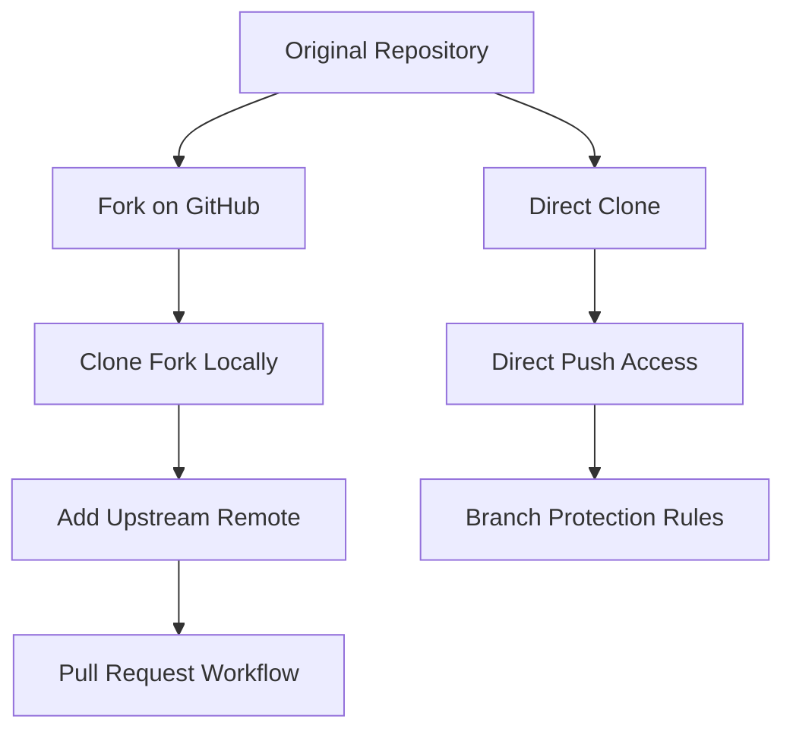
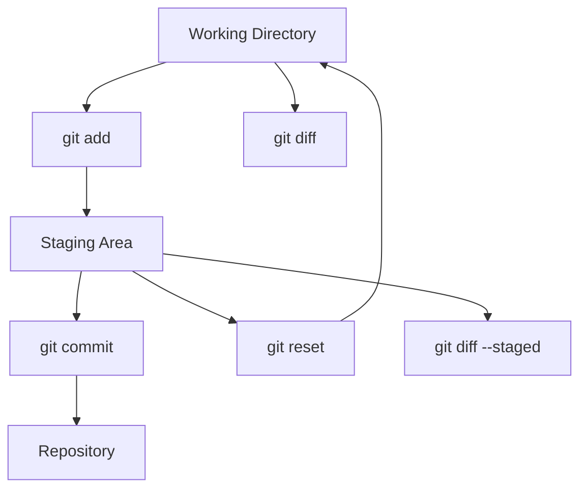
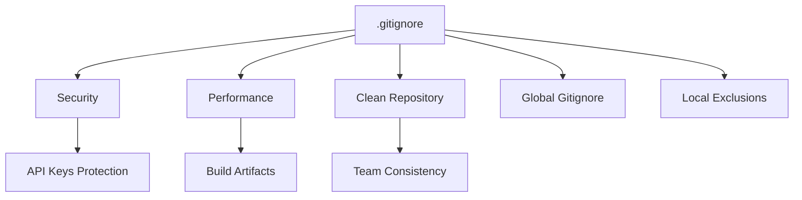
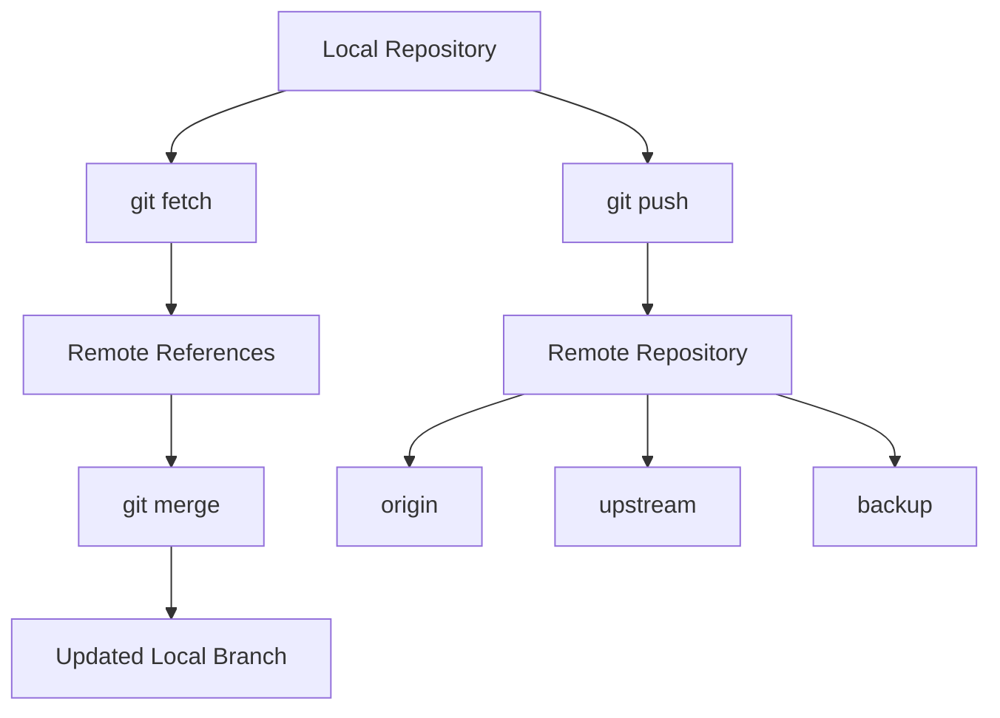
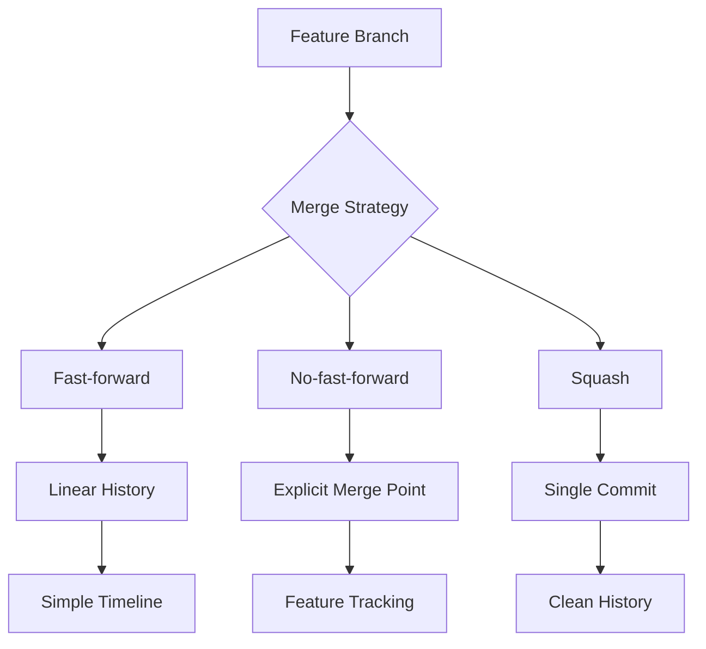
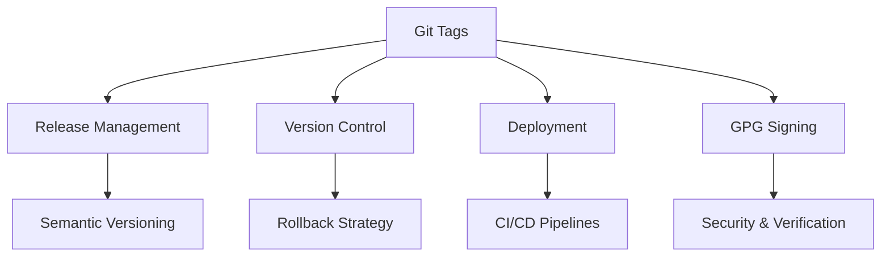

# Git & Verziókezelés

## Rövid összefoglaló

A Git egy elosztott verziókezelő rendszer, amely lehetővé teszi a kód változásainak nyomon követését, együttműködést és párhuzamos fejlesztést. Központi fogalmak: repo, commit, branch, merge vs rebase, pull request és release flow. Modern workflow-k közé tartozik a GitFlow és trunk-based fejlesztés. A Git erőssége a branching, distributed nature és a history kezelés rugalmassága. Fő buktatók: force push használata, branch divergence és merge conflict-ok helytelen kezelése.

<!-- Reading Progress Bar -->
<div id="read-progress"></div>

<!-- Tag Filter -->
<div class="tag-filter-container">
  <h3>🏷️ Szűrés témakörök szerint</h3>
  <div class="tag-filter-chips">
    <button class="filter-chip active" data-filter="all">Mind</button>
    <button class="filter-chip" data-filter="junior">Junior</button>
    <button class="filter-chip" data-filter="medior">Medior</button>
    <button class="filter-chip" data-filter="basics">Git Basics</button>
    <button class="filter-chip" data-filter="branching">Branching</button>
    <button class="filter-chip" data-filter="merging">Merging</button>
    <button class="filter-chip" data-filter="workflows">Workflows</button>
    <button class="filter-chip" data-filter="collaboration">Collaboration</button>
    <button class="filter-chip" data-filter="advanced">Advanced</button>
  </div>
</div>

## Fogalmak

### Repo (Repository) {#repo-repository}

<div class="concept-section mental-model" data-filter="basics junior">

📋 **Fogalom meghatározása**  
*A Git repository egy verziókezelési adatstruktúra, amely tárolja a projekt teljes történetét commit-ok gráfja formájában. A .git mappában tárolódnak az objektumok (blobs, trees, commits, tags), referenciák (branches, tags), konfiguráció és a teljes verziótörténet. Minden repository teljes és független, lehetővé teszi az elosztott munkafolyamatot.*

</div>

<div class="concept-section why-important" data-filter="basics junior">

💡 **Miért számít?**
- **Version control**: minden változás nyomon követhető és visszaállítható
- **Collaboration**: több fejlesztő biztonságosan dolgozhat együtt
- **Backup**: elosztott rendszer, minden clone teljes backup
- **Branching**: párhuzamos fejlesztési ágak kezelése

</div>

<div class="runnable-model" data-filter="basics junior">

**Runnable mental model**
```bash
# Repository inicializálás - új projekt kezdése
git init my-project
cd my-project

# Repository klónozás - meglévő projekt letöltése
git clone https://github.com/username/repository.git
git clone git@github.com:username/repository.git  # SSH kulcs

# Repository állapot ellenőrzése
git status
# On branch main
# Your branch is up to date with 'origin/main'
# nothing to commit, working tree clean

# Remote repository-k listázása
git remote -v
# origin  https://github.com/username/repo.git (fetch)
# origin  https://github.com/username/repo.git (push)

# Git konfigurálás (első használat)
git config --global user.name "Your Name"
git config --global user.email "your.email@example.com"
```
*Figyeld meg: `git init` helyi repo-t hoz létre, `git clone` távoli repo-t tölt le lokálisan.*

</div>

<div class="concept-section myths" data-filter="basics">

<details>
<summary>🧯 <strong>Gyakori tévhitek / félreértések</strong></summary>

<div>

- „Git ugyanaz mint GitHub." → Git a verziókezelő rendszer, GitHub a hosting szolgáltatás
- „Repository = folder." → Repository tartalmazza a teljes projekt történetét, nem csak az aktuális fájlokat
- „Git automatikusan backup-ol mindent." → Csak a commit-olt változások vannak verziókezelve

</div>

</details>

</div>

<div class="concept-section micro-learning" data-filter="basics">

<details>
<summary>📚 <strong>5 perces mikro-tanulás</strong></summary>

<div>

**Git három területe:**
```
Working Directory  →  Staging Area  →  Repository
     (fájlok)           (git add)        (git commit)

Modified files    →    Staged files  →  Committed files
```

**Repository típusok:**
```bash
# Local repository (saját gépeden)
git init

# Remote repository (szerveren, GitHub, GitLab)
git remote add origin https://github.com/user/repo.git

# Bare repository (csak Git adatok, nincs working directory)
git clone --bare repository.git
```

**Hasznos konfigurációk:**
```bash
# Global konfiguráció
git config --global init.defaultBranch main
git config --global pull.rebase false
git config --global core.autocrlf true  # Windows
git config --global core.autocrlf input # Mac/Linux
```

</div>

</details>

</div>

git log --oneline -5
# a1b2c3d (HEAD -> main, origin/main) Add user authentication
# e4f5g6h Fix login bug  
# i7j8k9l Initial project setup
```

Magyarázat: A repository a Git alapegysége, amely tartalmazza a project teljes verzióhistóriáját és konfigurációját.

### Clone vs Fork {#clone-vs-fork}

<div class="concept-section mental-model" data-filter="basics junior">

📋 **Fogalom meghatározása**  
*Clone egy Git parancs, amely lokális másolatot készít egy remote repository-ról, lemásolva a teljes történetet és beállítva az "origin" remote-ot. Fork egy platform-specifikus (GitHub, GitLab) funkció, amely szerver oldalon készít egy saját tulajdonú másolatot egy repository-ról, lehetővé téve a független fejlesztést és pull request-eket az eredeti repo felé.*

</div>

<div class="concept-section why-important" data-filter="basics junior">

💡 **Miért számít?**
- **Clone**: lokális fejlesztéshez, full repository letöltés
- **Fork**: open source contribution, független fejlesztés
- **Ownership**: fork esetén saját remote repository
- **Collaboration**: különböző workflow-k különböző célokra

</div>

<div class="runnable-model" data-filter="basics junior">

**Runnable mental model**
```bash
# CLONE - Direct repository copy
git clone https://github.com/company/internal-project.git
cd internal-project

# Remote origin automatically set
git remote -v
# origin  https://github.com/company/internal-project.git (fetch)
# origin  https://github.com/company/internal-project.git (push)

# Direct push access (if you have permissions)
git add README.md
git commit -m "docs: update README"
git push origin main  # Direct push to original repo

# FORK workflow - Open source contribution
# 1. Fork on GitHub: original-owner/awesome-project -> your-username/awesome-project

# 2. Clone YOUR fork
git clone https://github.com/your-username/awesome-project.git
cd awesome-project

# 3. Add upstream remote (original repository)
git remote add upstream https://github.com/original-owner/awesome-project.git

# Verify remotes
git remote -v
# origin    https://github.com/your-username/awesome-project.git (fetch)
# origin    https://github.com/your-username/awesome-project.git (push)
# upstream  https://github.com/original-owner/awesome-project.git (fetch)
# upstream  https://github.com/original-owner/awesome-project.git (push)

# 4. Keep fork synchronized
git fetch upstream
git checkout main
git merge upstream/main
git push origin main

# 5. Feature development
git checkout -b feature/awesome-improvement
echo "// New feature code" > src/feature.js
git add src/feature.js
git commit -m "feat: add awesome improvement"
git push origin feature/awesome-improvement

# 6. Create Pull Request
# GitHub: your-username/awesome-project -> original-owner/awesome-project
```
*Figyeld meg: Clone direkt hozzáférés, Fork saját másolat upstream kapcsolattal.*

</div>

<div class="concept-section myths" data-filter="basics">

<details>
<summary>🧯 <strong>Gyakori tévhitek / félreértések</strong></summary>

<div>

- „Fork és clone ugyanaz." → Fork GitHub/GitLab szerveren másol, clone lokálisan tölt le
- „Fork-ot nem kell szinkronizálni." → Upstream changes rendszeresen merge-ölni kell
- „Clone-nal nem lehet contribute-olni." → Ha van write access, clone elég

</div>

</details>

</div>

<div class="concept-section micro-learning" data-filter="basics">

<details>
<summary>📚 <strong>5 perces mikro-tanulás</strong></summary>

<div>

**Mikor melyiket használjuk:**
```
CLONE használata:
✅ Company internal projects
✅ Van write access a repo-hoz
✅ Team collaboration
✅ Saját projektek

FORK használata:
✅ Open source contribution
✅ Nincs write access
✅ Experimental changes
✅ Long-term personal modifications
```

**Fork synchronization workflow:**
```bash
# Daily sync routine
git fetch upstream
git checkout main
git merge upstream/main
git push origin main

# Feature branch from latest upstream
git checkout -b feature/new-feature upstream/main
```

**Best practices:**
```bash
# Never work directly on main in fork
git checkout main
git pull upstream main
git checkout -b fix/bug-description

# Keep PR branches focused
echo "One feature per branch"
```

</div>

</details>

</div>

<div class="concept-section interview" data-filter="basics">

<details>
<summary>💼 <strong>Interjú kérdések</strong></summary>

<div>

**Q: Mikor használnál fork-ot clone helyett?**
> Fork: open source projects, nincs write access, long-term personal changes. Clone: team projects, direct access, internal development.

**Q: Hogyan tartanád karban egy fork szinkronizációját?**
> Upstream remote hozzáadása, fetch upstream, merge upstream/main, push origin main.

**Q: Mi a különbség origin és upstream között?**
> Origin: saját fork/repository. Upstream: eredeti repository, ahonnan fork-oltál.

</div>

</details>

</div>

<div class="concept-section connections" data-filter="basics">

<details>
<summary>🔗 <strong>Kapcsolati térkép</strong></summary>

<div>



**Kapcsolódó fogalmak:**
- **Remote repositories**: origin vs upstream management
- **Pull Request**: fork-based contribution workflow
- **Branch strategies**: feature branches in forks
- **Access control**: repository permissions

</div>

</details>

</div>

### Staging Area (Index) {#staging-area}

<div class="concept-section mental-model" data-filter="basics junior">

📋 **Fogalom meghatározása**  
*A Staging Area (Index) egy köztes terület a working directory és a Git repository között, amely tárolja a következő commit-ba kerülő változtatásokat. A "git add" parancs hozzáadja a változtatásokat a staging area-hoz, ahol előkészített állapotban várják a "git commit"-ot. Lehetővé teszi a szelektív commit-olást és a változtatások logikai csoportosítását.*

</div>

<div class="concept-section why-important" data-filter="basics junior">

💡 **Miért számít?**
- **Selective commits**: nem minden változást kell egyszerre commit-olni
- **Review before commit**: átgondolhatod, mit commit-olsz
- **Logical grouping**: kapcsolódó változások egy commit-ba kerülhetnek
- **Safety net**: staging után még módosíthatod a commit-ot

</div>

<div class="runnable-model" data-filter="basics junior">

**Runnable mental model**
```bash
# Working Directory állapot ellenőrzése
git status
# On branch main
# Changes not staged for commit:
#   (use "git add <file>..." to update what will be committed)
#   (use "git checkout -- <file>..." to discard changes in working directory)
#         modified:   src/app.js
#         modified:   src/config.js
# Untracked files:
#   (use "git add <file>..." to include in what will be committed)
#         src/new-feature.js
#         test/app.test.js

# Szelektív staging - csak a logikailag kapcsolódó fájlok
git add src/app.js src/new-feature.js
git status
# On branch main
# Changes to be committed:
#   (use "git reset HEAD <file>..." to unstage)
#         modified:   src/app.js
#         new file:   src/new-feature.js
# Changes not staged for commit:
#         modified:   src/config.js
# Untracked files:
#         test/app.test.js

# Első commit - feature implementation
git commit -m "feat: implement new user authentication feature"

# Második staging - config és tests
git add src/config.js test/app.test.js
git commit -m "test: add tests for authentication feature"

# Interactive staging - fájl részek kiválasztása
git add -p src/complex-file.js
# Stage this hunk [y,n,q,a,d,/,j,J,g,e,?]? y
# y - yes, stage this hunk
# n - no, don't stage this hunk
# q - quit, don't stage this or remaining hunks
# a - stage this and all remaining hunks
# d - don't stage this or remaining hunks
# s - split current hunk into smaller hunks

# Interactive add mode
git add -i
# staged     unstaged path
# 1:    unchanged        +2/-1 src/app.js
# 2:    unchanged        +5/-0 src/new-feature.js
#
# *** Commands ***
# 1: status      2: update      3: revert      4: add untracked
# 5: patch       6: diff        7: quit        8: help

# Staging visszavonása
git reset HEAD src/app.js       # Specific file unstage
git reset                       # All staged files unstage

# Staging area vs Working directory különbségek
git diff                        # Working dir vs Staging
git diff --staged               # Staging vs Last commit
git diff HEAD                   # Working dir vs Last commit

# Fájl részleges staging example
echo "console.log('debug info');" >> src/app.js
echo "const newFeature = true;" >> src/app.js
echo "// TODO: remove debug code" >> src/app.js

git add -p src/app.js
# diff --git a/src/app.js b/src/app.js
# @@ -10,3 +10,6 @@ function login() {
#    return auth.validate();
#  }
# +console.log('debug info');
# +const newFeature = true;
# +// TODO: remove debug code
# Stage this hunk [y,n,q,a,d,s,e,?]? s

# After split:
# +console.log('debug info');
# +// TODO: remove debug code
# Stage this hunk [y,n,q,a,d,j,J,g,e,?]? n

# +const newFeature = true;
# Stage this hunk [y,n,q,a,d,K,g,e,?]? y

# Commit only the feature, leave debug code for later cleanup
git commit -m "feat: add new feature flag"

# Working directory still has debug code
git status
# Changes not staged for commit:
#         modified:   src/app.js
```
*Figyeld meg: staging area lehetővé teszi a precíz commit készítést és a munkaterület szervezését.*

</div>

<div class="concept-section myths" data-filter="basics">

<details>
<summary>🧯 <strong>Gyakori tévhitek / félreértések</strong></summary>

<div>

- „Staging area feleslegesen bonyolítja a dolgokat." → Lehetővé teszi a gondos commit preparation-t
- „git add . mindig biztonságos." → Nem kívánt fájlokat is stage-elhet (.env, logs, build artifacts)
- „Staged fájlokat nem lehet módosítani." → Módosíthatod, de újra stage-elni kell a változásokat

</div>

</details>

</div>

<div class="concept-section micro-learning" data-filter="basics">

<details>
<summary>📚 <strong>5 perces mikro-tanulás</strong></summary>

<div>

**Git háromszintű modell:**
```
Working Directory  →  Staging Area  →  Repository
      |                    |              |
   git add             git commit      git push

Modified files    →  Staged files  →  Committed files
```

**Staging strategies:**
```bash
# Atomic commits - logically related changes
git add src/user-service.js test/user-service.test.js
git commit -m "feat: add user service with tests"

# Feature increments
git add src/components/Header.js
git commit -m "feat: add header component"
git add src/components/Header.css  
git commit -m "style: add header component styling"

# Hotfix separation
git add src/security/auth.js
git commit -m "fix: resolve security vulnerability"
git add docs/security-update.md
git commit -m "docs: document security update"
```

**Useful staging commands:**
```bash
git add .                    # All changes (careful!)
git add -A                   # All changes including deletions
git add -u                   # Only modified/deleted (no new files)
git add *.js                 # Pattern matching
git add src/                 # Directory
git add -p                   # Interactive patch mode
git add -i                   # Interactive mode
```

</div>

</details>

</div>

<div class="concept-section interview" data-filter="basics">

<details>
<summary>💼 <strong>Interjú kérdések</strong></summary>

<div>

**Q: Mire jó a staging area?**
> Szelektív commit-ok, logikai csoportosítás, commit előtti review, clean git history létrehozása.

**Q: Mi a különbség git add . és git add -A között?**
> git add .: current directory changes. git add -A: minden változás (including deletions) a teljes repo-ban.

**Q: Hogyan stage-elnél egy fájl egy részét?**
> git add -p filename használatával, interaktív patch módban kiválasztva a szükséges hunk-okat.

</div>

</details>

</div>

<div class="concept-section connections" data-filter="basics">

<details>
<summary>🔗 <strong>Kapcsolati térkép</strong></summary>

<div>



**Kapcsolódó fogalmak:**
- **Commit**: staging area tartalma lesz commit
- **Working Directory**: aktuális fájlok állapota
- **Git diff**: különbségek a szintek között
- **Interactive adding**: precíz staging control

</div>

</details>

</div>

### .gitignore {#gitignore}

<div class="concept-section mental-model" data-filter="basics junior">

📋 **Fogalom meghatározása**  
*A .gitignore egy konfigurációs fájl, amely glob pattern-ekkel határozza meg azokat a fájlokat és könyvtárakat, amelyeket a Git figyelmen kívül hagy (untracked). A pattern-ek hierarchikusan öröklődnek: globális, repository szintű és directory-specifikus .gitignore fájlok. Jellemzően build artifactok, dependencies, ide fájlok, érzékeny adatok kerülnek ide.*

</div>

<div class="concept-section why-important" data-filter="basics junior">

💡 **Miért számít?**
- **Security**: API kulcsok, jelszavak nem kerülnek verziókezelésbe
- **Performance**: nagy build fájlok, dependencies kizárása
- **Clean repository**: csak releváns fájlok tracked
- **Team consistency**: mindenki ugyanazokat a fájlokat ignorálja

</div>

<div class="runnable-model" data-filter="basics junior">

**Runnable mental model**
```bash
# .gitignore file létrehozása projekt gyökérben
touch .gitignore

# Basic Node.js .gitignore
cat > .gitignore << 'EOF'
# Dependencies
node_modules/
npm-debug.log*
yarn-debug.log*
yarn-error.log*

# Production builds
dist/
build/
*.tgz

# Environment variables
.env
.env.local
.env.development.local
.env.test.local
.env.production.local

# IDE files
.vscode/
.idea/
*.swp
*.swo

# OS generated files
.DS_Store
.DS_Store?
._*
.Spotlight-V100
.Trashes
ehthumbs.db
Thumbs.db

# Logs
logs/
*.log

# Runtime data
pids/
*.pid
*.seed
*.pid.lock

# Coverage directory used by tools like istanbul
coverage/
.nyc_output/

# Dependency directories
jspm_packages/

# Optional npm cache directory
.npm

# Optional eslint cache
.eslintcache

# Microbundle cache
.rpt2_cache/
.rts2_cache_cjs/
.rts2_cache_es/
.rts2_cache_umd/

# Optional REPL history
.node_repl_history

# Output of 'npm pack'
*.tgz

# Yarn Integrity file
.yarn-integrity
EOF

# Global .gitignore (minden Git repo-ban használva)
git config --global core.excludesfile ~/.gitignore_global

# Global .gitignore példa
cat > ~/.gitignore_global << 'EOF'
# OS Files
.DS_Store
.DS_Store?
._*
.Spotlight-V100
.Trashes
ehthumbs.db
Thumbs.db

# Editor files
.vscode/
.idea/
*.swp
*.swo
*~

# Temporary files
*.tmp
*.temp
.cache/
EOF

# Gitignore patterns példák
cat > .gitignore << 'EOF'
# Comments start with #

# Ignore specific file
config/secrets.json

# Ignore all files with specific extension
*.log
*.tmp

# Ignore directory and all contents
temp/
cache/

# Ignore files in any directory
**/logs/

# Ignore file only in root
/package-lock.json

# Ignore everything in directory except specific files
build/*
!build/index.html
!build/assets/

# Ignore files matching pattern anywhere
**/*.backup

# Ignore files but not directories
*.txt
!important.txt

# Range patterns
debug[0-9].log
test[a-z].js
EOF

# Már tracked fájl ignorálása
echo "API_KEY=secret123" > config/secrets.json
git add config/secrets.json
git commit -m "Add secrets (OOPS!)"

# Most ignorálni szeretnénk
echo "config/secrets.json" >> .gitignore
git status
# Changes not staged for commit:
#   modified:   config/secrets.json  # Still tracked!

# Remove from tracking but keep file
git rm --cached config/secrets.json
git add .gitignore
git commit -m "Remove secrets from tracking and add to gitignore"

# Most már ignored
echo "API_KEY=newsecret456" > config/secrets.json
git status
# On branch main
# nothing to commit, working tree clean

# Force add ignored file (if really needed)
git add -f config/secrets.json
# Warning: might not be what you want!

# Check what would be ignored
git status --ignored
# On branch main
# Ignored files:
#   (use "git add -f <file>..." to include in what will be committed)
#         node_modules/
#         .env
#         *.log

# Template-based .gitignore generation
# GitHub provides templates for different languages
curl -s https://raw.githubusercontent.com/github/gitignore/main/Node.gitignore > .gitignore

# Using gitignore.io API
curl -s "https://www.toptal.com/developers/gitignore/api/node,react,vscode" > .gitignore

# Local exclusions (not shared with team)
echo "my-personal-notes.txt" >> .git/info/exclude
# This file is not versioned, only affects your local repo
```
*Figyeld meg: .gitignore patterns, már tracked fájlok kezelése, global vs local ignoring.*

</div>

<div class="concept-section myths" data-filter="basics">

<details>
<summary>🧯 <strong>Gyakori tévhitek / félreértések</strong></summary>

<div>

- „.gitignore visszamenőlegesen is működik." → Csak untracked fájlokra vonatkozik
- „.gitignore-t nem kell commit-olni." → Team-mel meg kell osztani, tehát commit kell
- „Minden IDE fájlt ignorálni kell." → Csak personal settings-et, shared config mehet

</div>

</details>

</div>

<div class="concept-section micro-learning" data-filter="basics">

<details>
<summary>📚 <strong>5 perces mikro-tanulás</strong></summary>

<div>

**Gitignore pattern syntax:**
```bash
# Basic patterns
*.log           # All .log files
temp/           # temp directory and contents
/build          # build in root only
**/logs         # logs directory anywhere

# Negation (exceptions)
*.log           # Ignore all logs
!important.log  # But keep this one

# Directory vs file
cache/          # Directory
cache           # File or directory

# Advanced patterns
debug?.log      # Single character wildcard
debug[0-9].log  # Character range
debug[!0-9].log # Negated character range
```

**Common language templates:**
```bash
# Python
__pycache__/
*.py[cod]
*$py.class
*.so
.Python
env/
venv/
.env

# Java
*.class
*.jar
*.war
*.ear
target/
.gradle/
build/

# C++
*.o
*.obj
*.exe
*.dll
*.so
*.dylib

# Web
node_modules/
dist/
.cache/
.parcel-cache/
```

**Best practices:**
```bash
# Language-specific first
# OS-specific after
# IDE-specific at end
# Comments for unclear patterns
# Use templates as starting point
# Don't ignore too much
# Regular cleanup and review
```

</div>

</details>

</div>

<div class="concept-section interview" data-filter="basics">

<details>
<summary>💼 <strong>Interjú kérdések</strong></summary>

<div>

**Q: Mit tennél ha már commit-olt fájlt kell ignorálni?**
> git rm --cached filename, majd hozzáadom .gitignore-hoz és commit-olom a változásokat.

**Q: Mi a különbség .gitignore és .git/info/exclude között?**
> .gitignore: versioned, team-mel shared. .git/info/exclude: local only, personal exclusions.

**Q: Hogyan ellenőriznéd, hogy egy fájl ignorálva van-e?**
> git check-ignore filename vagy git status --ignored parancsokkal.

</div>

</details>

</div>

<div class="concept-section connections" data-filter="basics">

<details>
<summary>🔗 <strong>Kapcsolati térkép</strong></summary>

<div>



**Kapcsolódó fogalmak:**
- **Security**: sensitive data protection
- **Repository cleanliness**: csak releváns fájlok
- **Team workflow**: shared ignore rules
- **Git templates**: language-specific patterns

</div>

</details>

</div>

### Remote (origin, upstream) {#remote}

<div class="concept-section mental-model" data-filter="basics junior">

📋 **Fogalom meghatározása**  
*Remote egy elérési út név alatti hivatkozás egy távoli Git repository-ra (URL formában: HTTPS vagy SSH). Az "origin" a default remote név clone esetén, ahonnan a repository-t lemásoltuk. Az "upstream" konvenció szerint az eredeti repository fork esetén. Több remote is konfigurálható, mindegyik különböző repository-ra mutat.*

</div>

<div class="concept-section why-important" data-filter="basics junior">

💡 **Miért számít?**
- **Collaboration**: csapat tagokkal való szinkronizáció
- **Backup**: távoli szervereken történő mentés
- **Distribution**: kód megosztása különböző lokációkban
- **Workflow management**: různé remote-ok különböző célokra

</div>

<div class="runnable-model" data-filter="basics junior">

**Runnable mental model**
```bash
# Remote-ok listázása
git remote -v
# origin  https://github.com/myuser/myproject.git (fetch)
# origin  https://github.com/myuser/myproject.git (push)

# Új remote hozzáadása
git remote add upstream https://github.com/originaluser/originalproject.git
git remote add backup https://github.com/myuser/myproject-backup.git

# Remote-ok ellenőrzése
git remote -v
# origin    https://github.com/myuser/myproject.git (fetch)
# origin    https://github.com/myuser/myproject.git (push)
# upstream  https://github.com/originaluser/originalproject.git (fetch)
# upstream  https://github.com/originaluser/originalproject.git (push)
# backup    https://github.com/myuser/myproject-backup.git (fetch)
# backup    https://github.com/myuser/myproject-backup.git (push)

# Remote részletes információ
git remote show origin
# * remote origin
#   Fetch URL: https://github.com/myuser/myproject.git
#   Push  URL: https://github.com/myuser/myproject.git
#   HEAD branch: main
#   Remote branches:
#     main                               tracked
#     feature/user-authentication        tracked
#   Local branches configured for 'git pull':
#     main                               merges with remote main
#     feature/user-authentication        merges with remote feature/user-authentication
#   Local refs configured for 'git push':
#     main                               pushes to main (up to date)
#     feature/user-authentication        pushes to feature/user-authentication (up to date)

# Fetch vs Pull különböző remote-okból
git fetch origin                # Origin branch-ek letöltése (no merge)
git fetch upstream             # Upstream branch-ek letöltése
git fetch --all               # Minden remote letöltése

# Remote branch-ek megtekintése
git branch -r
# origin/main
# origin/feature/user-auth
# upstream/main
# upstream/develop

# Minden branch (local + remote)
git branch -a
# * main
#   feature/user-auth
#   remotes/origin/main
#   remotes/origin/feature/user-auth
#   remotes/upstream/main
#   remotes/upstream/develop

# Upstream tracking beállítása
git checkout -b feature/new-feature origin/main
git push -u origin feature/new-feature
# -u flag sets upstream tracking

# Már létező branch upstream beállítása
git branch --set-upstream-to=origin/main main

# Remote branch checkout és tracking
git checkout -b local-feature origin/feature/remote-feature
# Creates local branch tracking origin/feature/remote-feature

# Remote URL módosítása
git remote set-url origin git@github.com:myuser/myproject.git
# HTTPS -> SSH switch

# Multiple URLs egy remote-hoz (push több helyre)
git remote set-url --add origin https://gitlab.com/myuser/myproject.git
git remote -v
# origin  git@github.com:myuser/myproject.git (fetch)
# origin  git@github.com:myuser/myproject.git (push)
# origin  https://gitlab.com/myuser/myproject.git (push)

# Remote törlése
git remote remove backup
git remote rm upstream

# Fork workflow remote setup
git clone https://github.com/myuser/forked-project.git
cd forked-project
git remote add upstream https://github.com/original-owner/original-project.git

# Upstream sync
git fetch upstream
git checkout main
git merge upstream/main
git push origin main

# Különböző remote-okba push-olás
git push origin main              # Saját fork
git push backup main             # Backup repository
git push upstream main           # Ha van write access

# Remote branch deletion
git push origin --delete feature/completed-feature
git push origin :feature/completed-feature  # Alternative syntax

# Remote prune - deleted remote branches cleanup
git fetch --prune
git remote prune origin

# SSH vs HTTPS remote setup
# HTTPS (username/password or token required)
git remote add origin https://github.com/user/repo.git

# SSH (SSH key required)
git remote add origin git@github.com:user/repo.git

# Check SSH connection
ssh -T git@github.com
# Hi username! You've successfully authenticated, but GitHub does not provide shell access.
```
*Figyeld meg: multiple remote-ok kezelése, tracking relationships, different protocols.*

</div>

<div class="concept-section myths" data-filter="basics">

<details>
<summary>🧯 <strong>Gyakori tévhitek / félreértések</strong></summary>

<div>

- „Origin a default remote név." → Csak konvenció, lehet másképp is nevezni
- „Csak egy remote lehet." → Több remote is beállítható különböző célokra
- „Remote = GitHubon lévő repo." → Bármilyen Git server lehet remote

</div>

</details>

</div>

<div class="concept-section micro-learning" data-filter="basics">

<details>
<summary>📚 <strong>5 perces mikro-tanulás</strong></summary>

<div>

**Remote naming conventions:**
```bash
origin      # Your primary repository (fork or main)
upstream    # Original repository (when forked)
backup      # Backup repository
deploy      # Deployment repository
staging     # Staging environment
production  # Production environment
```

**Common remote operations:**
```bash
# Daily workflow
git fetch origin          # Get latest remote info
git pull origin main      # Fetch + merge
git push origin feature   # Push local branch

# Fork synchronization
git fetch upstream
git checkout main
git merge upstream/main
git push origin main

# Remote branch operations
git checkout -b feature origin/feature  # Track remote branch
git push -u origin feature              # Push with upstream
git branch -d feature                   # Delete local
git push origin --delete feature        # Delete remote
```

**Remote URLs and protocols:**
```bash
# HTTPS - easier setup, requires credentials
https://github.com/user/repo.git

# SSH - more secure, requires SSH keys  
git@github.com:user/repo.git

# Local path (for testing)
/path/to/local/repo.git
file:///path/to/local/repo.git

# Change protocol
git remote set-url origin git@github.com:user/repo.git
```

</div>

</details>

</div>

<div class="concept-section interview" data-filter="basics">

<details>
<summary>💼 <strong>Interjú kérdések</strong></summary>

<div>

**Q: Mi a különbség origin és upstream között?**
> Origin: általában saját repository vagy fork. Upstream: eredeti repository, ahonnan fork-oltál.

**Q: Mi történik git fetch vs git pull esetén?**
> Fetch: letölti a remote changes-eket merge nélkül. Pull: fetch + merge/rebase az aktív branch-be.

**Q: Hogyan állítanál be multiple remote-okat egy projekthez?**
> git remote add name URL, különböző néven különböző remote-ok hozzáadása specific workflow-khoz.

</div>

</details>

</div>

<div class="concept-section connections" data-filter="basics">

<details>
<summary>🔗 <strong>Kapcsolati térkép</strong></summary>

<div>



**Kapcsolódó fogalmak:**
- **Clone vs Fork**: remote setup különbségek
- **Branch tracking**: local-remote branch relationships
- **Push/Pull**: remote synchronization
- **Authentication**: SSH keys, tokens, credentials

</div>

</details>

</div>

### Fast-forward vs No-fast-forward Merge {#fast-forward-vs-no-fast-forward}

<div class="concept-section mental-model" data-filter="merging junior">

📋 **Fogalom meghatározása**  
*Fast-forward merge akkor történik, amikor a target branch egyenes leszármazottja a merge-elt branch-nek, így a Git egyszerűen továbblépteti a branch pointert anélkül, hogy merge commit-ot hozna létre. No-fast-forward merge (--no-ff flag) mindig létrehoz egy új merge commit-ot, még akkor is, ha fast-forward lehetséges, megorzve így a branch történetének láthatóságát a gráfban.*

</div>

<div class="concept-section why-important" data-filter="merging junior">

💡 **Miért számít?**
- **History visibility**: no-ff megőrzi a feature branch létezését
- **Rollback capability**: könnyebb egy egész feature visszavonása
- **Team awareness**: látszik, hogy mi volt együtt fejlesztve
- **Release management**: clear feature boundaries a history-ban

</div>

<div class="runnable-model" data-filter="merging junior">

**Runnable mental model**
```bash
# Setup: létrehozunk egy scenario-t
git checkout main
echo "Initial content" > README.md
git add README.md
git commit -m "Initial commit"

# Feature branch létrehozása és development
git checkout -b feature/user-login
echo "Login feature implemented" >> README.md
git add README.md
git commit -m "feat: implement user login"

echo "Add login validation" >> README.md
git add README.md
git commit -m "feat: add login validation"

# FAST-FORWARD MERGE scenario
git checkout main
# Main branch hasn't changed since feature branch creation

git merge feature/user-login
# Updating a1b2c3d..e4f5g6h
# Fast-forward
#  README.md | 2 ++
#  1 file changed, 2 insertions(+)

# History after fast-forward merge
git log --oneline --graph
# * e4f5g6h (HEAD -> main, feature/user-login) feat: add login validation
# * i7j8k9l feat: implement user login
# * a1b2c3d Initial commit

# NO EXPLICIT MERGE COMMIT - linear history

# Reset for no-fast-forward example
git reset --hard a1b2c3d
git checkout -b feature/user-profile
echo "Profile feature implemented" >> README.md
git add README.md
git commit -m "feat: implement user profile"

# NO-FAST-FORWARD MERGE
git checkout main
git merge --no-ff feature/user-profile -m "Merge feature: user profile"
# Merge made by the 'recursive' strategy.
#  README.md | 1 +
#  1 file changed, 1 insertion(+)

# History after no-fast-forward merge
git log --oneline --graph
# *   x9y8z7w (HEAD -> main) Merge feature: user profile
# |\
# | * v6u5t4s (feature/user-profile) feat: implement user profile
# |/
# * a1b2c3d Initial commit

# EXPLICIT MERGE COMMIT shows feature branch existed

# Complex scenario - main branch advanced
git checkout main
echo "Main branch update" >> CHANGELOG.md
git add CHANGELOG.md
git commit -m "docs: update changelog"

git checkout -b feature/notifications
echo "Notifications implemented" >> README.md
git add README.md
git commit -m "feat: add notifications"

# Try to merge - automatic three-way merge
git checkout main
git merge feature/notifications
# Merge made by the 'recursive' strategy.
#  README.md | 1 +
#  1 file changed, 1 insertion(+)

# History shows divergent development
git log --oneline --graph
# *   r2d2c3p (HEAD -> main) Merge branch 'feature/notifications'
# |\
# | * s1w2e3r (feature/notifications) feat: add notifications
# * | t4y5u6i docs: update changelog
# |/
# * a1b2c3d Initial commit

# Configure default merge behavior
git config merge.ff false           # Always create merge commit
git config merge.ff only            # Only allow fast-forward merges
git config --unset merge.ff         # Reset to default (auto)

# Branch-specific merge strategies
git merge --ff-only feature/simple-fix
# Fast-forward only (fails if not possible)

git merge --no-ff feature/major-feature
# Always create merge commit

git merge --squash feature/multiple-commits
# Combine all feature commits into single commit

# Example: Release workflow with no-ff
git checkout main
git merge --no-ff release/v1.2.0 -m "Release v1.2.0

Features:
- User authentication system
- Profile management
- Notification system

Bug fixes:
- Login validation
- Profile picture upload
- Email formatting

Breaking changes:
- API endpoint structure updated"

# Clean feature branch cleanup after merge
git branch -d feature/user-login
git branch -d feature/user-profile
git branch -d feature/notifications

# Check if branch is merged before deletion
git branch --merged
# Lists branches merged into current branch

git branch --no-merged
# Lists branches not yet merged

# Force delete unmerged branch (careful!)
git branch -D feature/experimental

# GitHub/GitLab merge strategies visualization
echo "
Pull Request merge options:

1. Create merge commit (--no-ff)
   * Preserves feature branch history
   * Clear feature boundaries
   * Easier feature rollback

2. Squash and merge
   * Single commit from all feature commits
   * Clean linear history
   * Loses individual commit history

3. Rebase and merge
   * Linear history without merge commit
   * Individual commits preserved
   * Looks like direct commits to main
"
```
*Figyeld meg: fast-forward lineáris history, no-ff explicit merge points, different use cases.*

</div>

<div class="concept-section myths" data-filter="merging">

<details>
<summary>🧯 <strong>Gyakori tévhitek / félreértések</strong></summary>

<div>

- „Fast-forward mindig jobb." → Elrejti a feature branch context-et
- „No-fast-forward feleslegesen bonyolítja a history-t." → Hasznos feature tracking-hez
- „Merge commit-ok hibát jelentenek." → Intended behavior no-ff merge esetén

</div>

</details>

</div>

<div class="concept-section micro-learning" data-filter="merging">

<details>
<summary>📚 <strong>5 perces mikro-tanulás</strong></summary>

<div>

**Mikor melyiket használjuk:**
```
FAST-FORWARD (default):
✅ Hotfix-ek
✅ Kis változtatások
✅ Linear history preference
✅ Simple workflow

NO-FAST-FORWARD (--no-ff):
✅ Feature branches
✅ Release merges
✅ Team collaboration
✅ Feature tracking
✅ Rollback capability
```

**Merge strategies comparison:**
```bash
# Fast-forward result
* c3 (HEAD -> main, feature) Latest feature commit
* c2 Feature commit 2
* c1 Feature commit 1
* c0 Initial commit

# No-fast-forward result
*   m1 (HEAD -> main) Merge branch 'feature'
|\
| * c3 (feature) Latest feature commit
| * c2 Feature commit 2
| * c1 Feature commit 1
|/
* c0 Initial commit
```

**Configuration options:**
```bash
# Global settings
git config --global merge.ff false     # Always no-ff
git config --global merge.ff only      # Only ff
git config --global pull.ff only       # ff-only pulls

# Repository-specific
git config merge.ff false
git config pull.rebase true            # Rebase instead of merge on pull
```

</div>

</details>

</div>

<div class="concept-section interview" data-filter="merging">

<details>
<summary>💼 <strong>Interjú kérdések</strong></summary>

<div>

**Q: Mikor használnál no-fast-forward merge-et?**
> Feature branch-ek merge-élésekor, release merges-nél, amikor fontos a feature tracking és rollback capability.

**Q: Mi a különbség --squash és --no-ff között?**
> --squash: egyetlen commit-ba olvasztja össze a feature-t. --no-ff: megőrzi a commit history-t merge commit-tal.

**Q: Hogyan konfigurálanád a Git-et always no-ff merge-re?**
> git config merge.ff false beállítással vagy git config --global merge.ff false globálisan.

</div>

</details>

</div>

<div class="concept-section connections" data-filter="merging">

<details>
<summary>🔗 <strong>Kapcsolati térkép</strong></summary>

<div>



**Kapcsolódó fogalmak:**
- **Branch strategies**: feature branch workflows
- **Git history**: linear vs branched history
- **Team collaboration**: merge policies
- **Release management**: feature grouping

</div>

</details>

</div>

### Git Tags (annotated vs lightweight) {#git-tags}

<div class="concept-section mental-model" data-filter="advanced medior">

📋 **Fogalom meghatározása**  
*Git tag egy névvel ellátott referencia egy specifikus commit-ra, jellemzően release verziók jelölésére. Lightweight tag egy egyszerű pointer egy commit-ra (mint egy branch, de nem mozog). Annotated tag egy teljes Git objektum: tárolja a tagger nevét, e-mailt, dátumot, üzenetet és GPG signálást is tartalmazhat, ajánlott production release-ekhez.*

</div>

<div class="concept-section why-important" data-filter="advanced medior">

💡 **Miért számít?**
- **Release management**: pontosan azonosítható verziók
- **Rollback capability**: gyors visszatérés stabil verzióhoz
- **Deployment tracking**: mi van production-ben
- **Communication**: stakeholder-eknek clear version references

</div>

<div class="runnable-model" data-filter="advanced medior">

**Runnable mental model**
```bash
# LIGHTWEIGHT TAG - egyszerű pointer
git tag v1.0.0
git tag bugfix-patch

# Lightweight tag információ
git show v1.0.0
# commit a1b2c3d4e5f6... (tag: v1.0.0)
# Author: Developer <dev@example.com>
# Date: Wed Oct 25 10:30:00 2023 +0200
# Just shows the commit, no tag metadata

# ANNOTATED TAG - teljes metadata objektum
git tag -a v1.1.0 -m "Release version 1.1.0

🎯 New Features:
- User authentication system
- Profile management interface
- Real-time notifications

🐛 Bug Fixes:
- Login session timeout resolved
- Profile image upload fix
- Email validation improvements

📈 Performance:
- 40% faster page load times
- Optimized database queries
- Reduced memory usage

⚠️ Breaking Changes:
- API endpoint /users moved to /api/v1/users
- Authentication token format changed
- Legacy browser support dropped (IE11)

👥 Contributors: @alice, @bob, @charlie
📅 Release Date: 2023-10-25
🔗 Changelog: https://github.com/project/releases/v1.1.0"

# Annotated tag információ
git show v1.1.0
# tag v1.1.0
# Tagger: Release Manager <release@company.com>
# Date: Wed Oct 25 14:30:00 2023 +0200
# 
# Release version 1.1.0
# [full message content]
# 
# commit a1b2c3d4e5f6...
# [commit details]

# Tag-ek listázása
git tag
# v1.0.0
# v1.1.0
# bugfix-patch

# Pattern alapú tag listázás
git tag -l "v1.*"
# v1.0.0
# v1.1.0

git tag -l "*patch*"
# bugfix-patch

# Tag-ek description-nel
git tag -n5
# v1.0.0          Initial release version
# v1.1.0          Release version 1.1.0
#                 
#                 🎯 New Features:
#                 - User authentication system
# bugfix-patch    Critical security fix

# Specific commit tag-elése (retroactive)
git log --oneline
# a1b2c3d Latest commit
# e4f5g6h Previous commit
# i7j8k9l Bug fix commit
# l0m1n2o Initial commit

git tag -a v1.0.1 i7j8k9l -m "Retroactive tag for bug fix release"

# Tag checkout (detached HEAD)
git checkout v1.1.0
# Note: switching to 'v1.1.0'.
# You are in 'detached HEAD' state...

# Create branch from tag
git checkout -b hotfix/v1.1.1 v1.1.0
echo "Critical fix" > hotfix.txt
git add hotfix.txt
git commit -m "fix: critical security vulnerability"
git tag -a v1.1.1 -m "Hotfix release v1.1.1 - Security patch"

# Tag push (explicit required!)
git push origin v1.1.0          # Single tag
git push origin --tags          # All tags
git push --follow-tags          # Tags associated with commits being pushed

# Tag deletion
git tag -d v1.0.0               # Delete local tag
git push origin --delete tag v1.0.0  # Delete remote tag

# Tag verification (signed tags)
git tag -a -s v2.0.0 -m "Signed release v2.0.0"
# Creates GPG-signed tag

git tag -v v2.0.0               # Verify signature
# object a1b2c3d4e5f6...
# type commit
# tag v2.0.0
# tagger Release Manager <release@company.com> 1635163800 +0200
# 
# Signed release v2.0.0
# gpg: Signature made Wed 25 Oct 2023 14:30:00 CET
# gpg: Good signature from "Release Manager <release@company.com>"

# Semantic versioning tag workflow
echo "
Semantic Versioning Pattern:
MAJOR.MINOR.PATCH[-PRERELEASE][+BUILD]

Examples:
v1.0.0          # Initial release
v1.1.0          # New features (backward compatible)
v1.1.1          # Bug fixes
v2.0.0          # Breaking changes
v2.0.0-alpha.1  # Pre-release
v2.0.0-beta.2   # Beta release  
v2.0.0-rc.1     # Release candidate
v1.0.0+20231025 # Build metadata
"

# Automated version bumping
#!/bin/bash
# version-bump.sh
VERSION_TYPE=${1:-patch}  # major, minor, patch

# Get current version
CURRENT_VERSION=$(git describe --tags --abbrev=0)
echo "Current version: $CURRENT_VERSION"

# Calculate new version (simplified)
case $VERSION_TYPE in
  "major")
    NEW_VERSION="v2.0.0"  # Logic to increment major
    ;;
  "minor") 
    NEW_VERSION="v1.2.0"  # Logic to increment minor
    ;;
  "patch")
    NEW_VERSION="v1.1.2"  # Logic to increment patch
    ;;
esac

echo "New version: $NEW_VERSION"

# Create annotated tag with changelog
git tag -a "$NEW_VERSION" -m "Release $NEW_VERSION

$(git log $CURRENT_VERSION..HEAD --oneline --format="- %s")"

# Release workflow with tags
git checkout main
git pull origin main

# Ensure clean working directory
if [[ -n $(git status --porcelain) ]]; then
  echo "Working directory not clean!"
  exit 1
fi

# Run tests
npm test || exit 1

# Update version in package.json
npm version patch --no-git-tag-version
git add package.json
git commit -m "bump: version to $(npm -s run env echo '$npm_package_version')"

# Create release tag
NEW_VERSION="v$(node -p "require('./package.json').version")"
git tag -a "$NEW_VERSION" -m "Release $NEW_VERSION"

# Push everything
git push origin main
git push origin "$NEW_VERSION"

# Tag-based deployment
# CI/CD pipeline example (GitHub Actions)
echo "
name: Deploy on Tag
on:
  push:
    tags:
      - 'v*'

jobs:
  deploy:
    runs-on: ubuntu-latest
    steps:
      - uses: actions/checkout@v2
      - name: Get tag version
        id: tag
        run: echo ::set-output name=tag::\${GITHUB_REF#refs/tags/}
      
      - name: Deploy to production
        run: |
          echo \"Deploying version \${{ steps.tag.outputs.tag }} to production\"
          # Deploy logic here
"
```
*Figyeld meg: lightweight vs annotated tag különbségek, semantic versioning, automated workflows.*

</div>

<div class="concept-section myths" data-filter="advanced">

<details>
<summary>🧯 <strong>Gyakori tévhitek / félreértések</strong></summary>

<div>

- „Tag-ek automatikusan push-olódnak." → Explicit git push origin tagname szükséges
- „Lightweight tag ugyanaz mint annotated." → Lightweight csak pointer, annotated teljes objektum metadata-val
- „Tag-eket lehet módosítani." → Immutable-ek, delete + recreate szükséges

</div>

</details>

</div>

<div class="concept-section micro-learning" data-filter="advanced">

<details>
<summary>📚 <strong>5 perces mikro-tanulás</strong></summary>

<div>

**Tag types comparison:**
```bash
# Lightweight Tag
git tag v1.0.0
# - Simple pointer to commit
# - No additional metadata
# - Fast and lightweight
# - Use for temporary/private marking

# Annotated Tag  
git tag -a v1.0.0 -m "Release v1.0.0"
# - Full Git object with metadata
# - Tagger info, date, message
# - Can be GPG signed
# - Use for public releases
```

**Semantic versioning rules:**
```
MAJOR version: incompatible API changes
MINOR version: new functionality, backward compatible
PATCH version: bug fixes, backward compatible

Pre-release: 1.0.0-alpha.1, 1.0.0-beta.2, 1.0.0-rc.1
Build metadata: 1.0.0+20231025.1
```

**Tag-based workflows:**
```bash
# Release workflow
git checkout main
git pull origin main
npm test
npm version patch
git push origin main --follow-tags

# Hotfix workflow
git checkout -b hotfix/v1.0.1 v1.0.0
# Make fixes
git tag -a v1.0.1 -m "Hotfix v1.0.1"
git push origin v1.0.1
```

</div>

</details>

</div>

<div class="concept-section interview" data-filter="advanced">

<details>
<summary>💼 <strong>Interjú kérdések</strong></summary>

<div>

**Q: Mikor használnál lightweight vs annotated tag-et?**
> Lightweight: temporary marking, private use. Annotated: public releases, official versions, shared repositories.

**Q: Hogyan állítanál vissza egy production environment-et egy korábbi tag-re?**
> git checkout tagname, majd deployment script futtatása vagy git checkout -b rollback-branch tagname.

**Q: Mi a semantic versioning és hogyan használnád Git tag-ekkel?**
> MAJOR.MINOR.PATCH format, breaking changes = major bump, new features = minor, bug fixes = patch.

</div>

</details>

</div>

<div class="concept-section connections" data-filter="advanced">

<details>
<summary>🔗 <strong>Kapcsolati térkép</strong></summary>

<div>



**Kapcsolódó fogalmak:**
- **Release workflows**: tag-based deployment
- **Semantic versioning**: structured version naming
- **CI/CD**: automated tag-triggered deployments
- **Security**: GPG signed releases

</div>

</details>

</div>

<div class="concept-section" data-filter="junior">

### Commit {#commit}

<div class="mental-model">
🎯 **Mental Model: Commit - A Digital Photo Album**
Képzeld el a Git commit-ot mint egy digitális fényképalbumot. Minden egyes commit egy fénykép a projekt állapotáról egy adott időpillanatban. Ahogy egy fényképen láthatod, hogy ki volt jelen, mit csináltak, és mikor készült, úgy egy commit is rögzíti, ki mit változtatott és mikor.

**A commit anatómiája:**
- **Hash (ujjlenyomat)**: mint egy fénykép egyedi azonosítója
- **Üzenet**: mint a fénykép alatt található leírás
- **Timestamp**: mikor készült a "fénykép"
- **Author**: ki készítette a változtatásokat
- **Changes**: mi változott az előző állapothoz képest
</div>

<div class="why-important">
💡 **Miért fontos a commit?**
- **Visszakövethetőség**: Bármikor vissza tudsz térni egy korábbi állapotra
- **Blame/Credit**: Látod, ki mit csinált és mikor
- **Code Review**: Áttekintheted a változtatásokat commit-onként
- **Hibakeresés**: Ha bug jelenik meg, könnyebben megtalálod a problémás commit-ot
- **Release Notes**: A commit üzenetek alapján dokumentálhatod a változásokat
</div>

<div class="runnable-model">
🚀 **Gyakorlati commit flow:**
```bash
# 1. Változtatások megtekintése
git status
# On branch main
# Changes not staged for commit:
#   modified:   src/App.js
# Untracked files:
#   src/NewComponent.js

# 2. Staging area használata
git add src/App.js              # Egy fájl hozzáadása
git add src/NewComponent.js     # Másik fájl hozzáadása
git add .                       # Minden változás (óvatosan!)

# 3. Commit készítése beszédes üzenettel
git commit -m "feat: add user authentication component"

# 4. Commit történet megtekintése
git log --oneline
# a1b2c3d feat: add user authentication component
# e4f5g6h fix: resolve login validation bug
# i7j8k9l docs: update README with setup instructions

# 5. Részletes commit információ
git show a1b2c3d
# commit a1b2c3d4e5f6g7h8i9j0k1l2m3n4o5p6q7r8s9t0
# Author: John Doe <john@example.com>
# Date:   Wed Sep 27 14:30:45 2023 +0200
#
#     feat: add user authentication component
#
# diff --git a/src/NewComponent.js b/src/NewComponent.js
# new file mode 100644
# +import React, { useState } from 'react';
# +const AuthComponent = () => { ... }

# 6. Commit módosítása (csak ha még nincs push-olva!)
git commit --amend -m "feat: add user authentication with OAuth support"
```

**Staging area stratégiák:**
```bash
# Interaktív staging (részleges commit-ok)
git add -p filename.js          # Patch módban választhatsz

# Fájlok részleges hozzáadása
git add -i                      # Interaktív mód

# Staging visszavonása
git reset HEAD filename.js      # Unstage egy fájlt
git reset                       # Unstage mindent
```
</div>

<div class="myths">
🚫 **Gyakori tévhitek és hibák**

<details>
<summary><strong>Tévhit: "A commit üzenet nem fontos"</strong></summary>
<div class="myth-content">
**Valóság:** A commit üzenet a kód dokumentációjának része. 6 hónappal később te sem fogod emlékezni, mit akartál csinálni.

**Rossz példa:**
```bash
git commit -m "fix"
git commit -m "wip"
git commit -m "asdf"
```

**Jó példa (Conventional Commits):**
```bash
git commit -m "fix: resolve null pointer exception in user service"
git commit -m "feat: add password validation to registration form"
git commit -m "docs: update API documentation with new endpoints"
```
</div>
</details>

<details>
<summary><strong>Tévhit: "Minden változtatást egy commit-ba kell rakni"</strong></summary>
<div class="myth-content">
**Valóság:** Egy commit-nak egy logikai változtatást kell tartalmaznia. Ha egy bug fix-et és egy új feature-t egyszerre commit-olsz, később nehéz lesz szétválasztani őket.

**Atomic commits előnyei:**
- Egyszerűbb review
- Selective revert lehetősége
- Bisect hatékonyabb működése
- Clean git history
</div>
</details>

<details>
<summary><strong>Tévhit: "A commit hash random"</strong></summary>
<div class="myth-content">
**Valóság:** A commit hash (SHA-1) determinisztikus hash a commit teljes tartalmából, beleértve:
- A commit változtatásait
- A parent commit(ok) hash-ét
- Az author és committer információkat
- A timestamp-et
- A commit üzenetet

**Ugyanez a tartalom → ugyanaz a hash**
</div>
</details>
</details>

<div class="micro-learning">
🎯 **Micro-learning: A 3 Git Area modellje**

Git-ben három fő területed van:
1. **Working Directory** - ahol dolgozol
2. **Staging Area (Index)** - előkészítési terület
3. **Repository** - végleges tárolás

```
Working Dir  →  Staging Area  →  Repository
     |              |              |
   git add      git commit     git push
```

**Pro tip:** A staging area azért zseniális, mert lehetővé teszi, hogy átgondold, mit akarsz commit-olni. Nem kell minden változtatást egyszerre commit-olni!
</div>

</div>

Magyarázat: Commit a projekt adott pillanatának mentése, egyedi hash-sel és metaadatokkal.

<div class="concept-section" data-filter="junior">

### Branch {#branch}

<div class="mental-model">
🌳 **Mental Model: Branch - A Parallel Universe Tree**
Képzeld el a Git branch-eket mint egy döntési fa alternatív univerzumait. A fő törzs (main/master) a "fő valóság", de bármikor létrehozhatsz egy elágazást, ahol kísérletezhetsz anélkül, hogy befolyásolnád a fő univerzumot.

**A branch anatómiája:**
- **Lightweight pointer**: csak egy referencia egy commit-ra
- **Independent timeline**: külön története van a változtatásoknak  
- **Mergeable**: később összeolvasztható a fő ággal
- **Disposable**: könnyedén létrehozható és törölhető

Mint amikor egy könyvben elgondolkodsz: "Mi lenne, ha a főszereplő másképp döntött volna?" - branch-ben kipróbálhatod!
</div>

<div class="why-important">
💡 **Miért fontosak a branch-ek?**
- **Izolált fejlesztés**: Új feature-ök nem törnek el semmit
- **Párhuzamos munka**: Több ember/feature dolgozhat egyszerre
- **Kísérletezés**: Kipróbálhatsz dolgokat biztonságosan
- **Code Review**: Feature branch-eket review-olni lehet merge előtt
- **Release Management**: Különböző verziók kezelése
- **Hotfix-ek**: Gyors javítások production-ben
</div>

<div class="runnable-model">
🚀 **Branch workflow gyakorlatban:**
```bash
# 1. Jelenlegi branch-ek megtekintése
git branch
# * main                    <- itt vagy most
#   feature/user-profile
#   bugfix/memory-leak

# 2. Új feature branch létrehozása
git checkout -b feature/shopping-cart
# Switched to a new branch 'feature/shopping-cart'

# Modern Git szintaxis (v2.23+)
git switch -c feature/shopping-cart

# 3. Fejlesztés a feature branch-en
echo "const cart = [];" > src/cart.js
git add src/cart.js
git commit -m "feat: initialize shopping cart functionality"

# 4. Branch állapot ellenőrzése
git log --oneline --graph
# * a1b2c3d (HEAD -> feature/shopping-cart) feat: initialize shopping cart
# * e4f5g6h (main) docs: update README

# 5. Main branch update ellenőrzése
git switch main
git pull origin main

# 6. Feature branch frissítése main-nel
git switch feature/shopping-cart
git rebase main              # vagy git merge main

# 7. Remote branch publikálása
git push -u origin feature/shopping-cart

# 8. Befejezett feature törlése
git switch main
git branch -d feature/shopping-cart    # local törlés
git push origin --delete feature/shopping-cart  # remote törlés

# 9. Branch tracking információ
git branch -vv
# * main                     a1b2c3d [origin/main] Latest changes
#   feature/user-profile     x9y8z7w [origin/feature/user-profile] Add profile
```

**Branching naming conventions:**
```bash
# Feature branches
git checkout -b feature/user-authentication
git checkout -b feature/payment-integration

# Bugfix branches  
git checkout -b bugfix/login-validation
git checkout -b hotfix/critical-security-patch

# Release branches
git checkout -b release/v1.2.0

# Experimental branches
git checkout -b experiment/new-architecture
```
</div>

<div class="myths">
🚫 **Gyakori tévhitek és hibák**

<details>
<summary><strong>Tévhit: "Branch-ek drágák és lassúak"</strong></summary>
<div class="myth-content">
**Valóság:** Git branch-ek incredibly lightweight! Csak egy 40 byte-os fájl, ami egy commit hash-t tartalmaz.

**Bizonyíték:**
```bash
# Nézd meg a .git/refs/heads mappát
ls -la .git/refs/heads/
# -rw-r--r-- 1 user staff 41 Oct 27 10:30 main
# -rw-r--r-- 1 user staff 41 Oct 27 11:45 feature/shopping-cart

# A fájl tartalma csak egy hash
cat .git/refs/heads/main
# a1b2c3d4e5f6g7h8i9j0k1l2m3n4o5p6q7r8s9t0
```

**Következmény:** Bátran használj branch-eket! Akár naponta újakat is létrehozhatsz.
</div>
</details>

<details>
<summary><strong>Tévhit: "Mindig main branch-en kell dolgozni"</strong></summary>
<div class="myth-content">
**Valóság:** A main branch-et védeni kell! Soha ne dolgozz közvetlenül main-en production projektekben.

**Best practice workflow:**
1. Feature branch létrehozása
2. Fejlesztés a feature branch-en  
3. Pull Request/Merge Request
4. Code review
5. Merge main-be
6. Feature branch törlése

**Előnyök:**
- Clean git history
- Reviewable changes
- Rollback lehetőség
- Párhuzamos fejlesztés
</div>
</details>

<details>
<summary><strong>Tévhit: "Branch switch elveszti a változtatásokat"</strong></summary>
<div class="myth-content">
**Valóság:** Git megőrzi a nem commit-olt változtatásokat, de figyelni kell rájuk.

**Mit csinál Git branch switch-nél:**
```bash
# Ha van uncommitted change
git status
# Changes not staged for commit:
#   modified: src/app.js

git switch other-branch
# error: Your local changes would be overwritten by checkout

# Megoldások:
git stash                    # Ideiglenesen félrerakja
git switch other-branch
git switch -
git stash pop               # Visszarakja

# Vagy commit-old
git add . && git commit -m "wip: work in progress"
```
</div>
</details>
</details>

<div class="micro-learning">
🎯 **Micro-learning: HEAD, branch és commit kapcsolata**

```
Repository struktura:
main       A---B---C (HEAD)
            \
feature      D---E

git switch feature:
main       A---B---C  
            \
feature      D---E (HEAD)
```

**Fontos fogalmak:**
- **HEAD**: "ahol most vagy" - pointer a current branch-re
- **Branch**: pointer egy commit-ra
- **git switch/checkout**: HEAD mozgatása

**Pro tip:** `git log --oneline --graph --all` mutatja az összes branch-et vizuálisan!

**Modern Git parancsok (v2.23+):**
- `git switch` - branch váltás
- `git restore` - fájlok visszaállítása  
- `git checkout` - régi, univerzális parancs (még mindig működik)
</div>

</div>

Magyarázat: Branch-ek lehetővé teszik a feature-ök párhuzamos fejlesztését anélkül, hogy befolyásolnák a main kódbázist.

<div class="concept-section" data-filter="medior">

### Merge vs Rebase {#merge-vs-rebase}

<div class="mental-model">
🌿 **Mental Model: Two Ways to Tell a Story**
Képzeld el, hogy egy családi összejövetelen két módon mesélheted el az utóbbi hetek történéseit:

**Merge módszer** - "Minden történet, ahogy megtörtént"
Elmesélsz mindent időrendben, minden kanyart, mellékutat, hibát és javítást. A történet összetett, de hű az igazsághoz.

**Rebase módszer** - "A lényeg, tisztán elmesélve"  
Átgondolod a történetet, logikus sorrendbe rakod, elhagyod a felesleges részleteket. Az eredmény egyszerűbb, de nem tükrözi a tényleges kronológiát.

**Git context:**
- **Merge**: Megőrzi a teljes development history-t branch-ekkel együtt
- **Rebase**: Lineáris, "clean" history-t hoz létre, mintha minden egymás után történt volna
</div>

<div class="why-important">
💡 **Mikor melyiket használd?**

**Merge előnyei:**
- Megőrzi a valódi history-t
- Biztonságos - nem változtatja meg a meglévő commit-okat
- Team collaboration-höz jobb (láthatóak a feature branch-ek)
- Non-destructive operation

**Rebase előnyei:**
- Clean, lineáris history
- Könnyebb követni a commit flow-t
- Nincs felesleges merge commit
- Bisect-hez jobb

**Általános szabály:**
- **Public branch-ek**: SOHA ne rebase-elj!
- **Private feature branch-ek**: Rebase OK
- **Main/master branch**: Merge használata
- **Code review**: Rebase before PR, merge after approval
</div>

<div class="runnable-model">
🚀 **Merge vs Rebase gyakorlatban:**

**Merge workflow:**
```bash
# 1. Main frissítése
git checkout main
git pull origin main

# 2. Feature merge-ölése  
git merge feature/shopping-cart
# Merge made by the 'recursive' strategy.
#  src/cart.js    | 45 +++++++++++++++++++++++++++++++++++++++++++++
#  src/api.js     | 12 ++++++++++++
#  2 files changed, 57 insertions(+)

# 3. Explicit merge commit készítése (best practice)
git merge --no-ff feature/shopping-cart
# Mindig létrehoz merge commit-ot, még fast-forward esetén is

# 4. Merge conflict kezelése
git merge feature/conflicting-feature
# Auto-merging src/config.js
# CONFLICT (content): Merge conflict in src/config.js
# Automatic merge failed; fix conflicts and then commit the result.

# Conflict fájl tartalma:
# <<<<<<< HEAD (current branch - main)
# const API_URL = 'https://api.production.com';
# =======
# const API_URL = 'https://api.staging.com';  
# >>>>>>> feature/conflicting-feature

# Conflict megoldás:
# 1. Manual edit - válassz vagy kombinálj
# 2. Conflict marker-ek eltávolítása
echo "const API_URL = 'https://api.production.com';" > src/config.js

# 3. Staged és commit
git add src/config.js
git commit -m "resolve: use production API URL"
```

**Rebase workflow:**
```bash
# 1. Feature branch rebase main-re
git checkout feature/user-profile  
git rebase main
# First, rewinding head to replay your work on top of it...
# Applying: add user profile component
# Applying: add profile validation

# 2. Interactive rebase - history cleaning
git rebase -i HEAD~3
# Editor opens:
# pick a1b2c3d add user profile component
# squash e4f5g6h fix typo in profile  
# reword i7j8k9l add profile tests

# 3. Rebase conflict kezelése
git rebase main
# CONFLICT (content): Merge conflict in src/profile.js
# error: could not apply e4f5g6h... add profile validation

# Conflict megoldás:
# 1. Fix the conflict manually
# 2. Add resolved files
git add src/profile.js
# 3. Continue rebase (NOT commit!)
git rebase --continue

# 4. Abort rebase if needed
git rebase --abort
```

**History comparison:**
```bash
# Merge history (branched)
git log --oneline --graph
# *   f1e2d3c (HEAD -> main) Merge branch 'feature/cart'
# |\  
# | * a1b2c3d (feature/cart) add shopping cart
# | * e4f5g6h fix cart validation
# |/  
# * i7j8k9l update readme

# Rebase history (linear)  
git log --oneline --graph
# * a1b2c3d (HEAD -> main) add shopping cart
# * e4f5g6h fix cart validation  
# * i7j8k9l update readme
```
</div>

<div class="myths">
🚫 **Gyakori tévhitek és hibák**

<details>
<summary><strong>Tévhit: "Rebase mindig jobb, mert tisztább a history"</strong></summary>
<div class="myth-content">
**Valóság:** Rebase hasznos, de nem mindig helyénvaló.

**Mikor NE használj rebase-t:**
- Public/shared branch-eken (pl. main, develop)
- Ha mások már pull-olták a branch-edet  
- Ha megőrizni akarod a pontos development timeline-t

**Golden Rule of Rebase:** 
> "Never rebase commits that exist outside your repository and people may have based work on them."

**Rossz példa:**
```bash
# Katasztrófa: main branch rebase
git checkout main
git rebase feature/experimental  # DON'T DO THIS!
git push --force origin main      # DISASTER!
```
</div>
</details>

<details>
<summary><strong>Tévhit: "Merge conflict-ok bonyolultak"</strong></summary>
<div class="myth-content">
**Valóság:** Conflict-ok természetesek és kezelhetőek megfelelő eszközökkel.

**Modern conflict resolution tools:**
```bash
# Visual merge tool használata
git mergetool
# VS Code, IntelliJ, Sublime Merge, etc.

# Git conflict markers megértése:
# <<<<<<< HEAD (current branch changes)
# Your changes
# =======  
# >>>>>>> branch-name (incoming changes)
```

**Prevention strategies:**
- Gyakori rebase/merge main-ből
- Kisebb, focused commit-ok
- Good communication in team
- Branch feature-ök izolálása
</div>
</details>

<details>
<summary><strong>Tévhit: "Fast-forward merge mindig jó"</strong></summary>
<div class="myth-content">
**Valóság:** Fast-forward elrejti a feature branch létezését.

**Fast-forward problem:**
```bash
# Fast-forward merge
git merge feature/quick-fix
# Updating a1b2c3d..e4f5g6h
# Fast-forward

# History úgy néz ki, mintha közvetlenül main-en dolgoztál volna
# Elveszett a feature branch context
```

**Solution: No fast-forward**
```bash
git merge --no-ff feature/quick-fix
# Merge commit: "Merge branch 'feature/quick-fix'"
# Látható marad, hogy feature branch volt
```
</div>
</details>
</details>

<div class="micro-learning">
🎯 **Micro-learning: Merge conflict anatomy**

**Conflict file felépítése:**
```
normal code
<<<<<<< HEAD (current branch)
const API_URL = 'https://prod.api.com';
=======
const API_URL = 'https://dev.api.com';
>>>>>>> feature/api-update (incoming branch)
more normal code
```

**Conflict resolution strategies:**
1. **Accept current**: Megtartod a HEAD változatot
2. **Accept incoming**: Átveszed a másik branch változatot  
3. **Accept both**: Mindkettőt megtartod
4. **Manual edit**: Kézzel írod meg a végső verziót

**Pro tools:**
- VS Code: Built-in 3-way merge editor
- Git Lens extension: Enhanced Git integration
- Command line: `git config merge.tool vscode`

**Recovery commands:**
```bash
git merge --abort    # Merge visszavonása
git reset --hard     # Working dir tisztítása
git rebase --abort   # Rebase visszavonása
```
</div>

</div>

Magyarázat: Merge megőrzi a branch history-t, rebase lineáris történetet hoz létre a commit-ok újrajátszásával.

<div class="concept-section" data-filter="medior">

### Pull Request / Code Review {#pull-request-code-review}

<div class="mental-model">
🏛️ **Mental Model: Pull Request - The Proposal System**
Képzeld el a Pull Request-et mint egy törvényjavaslat folyamatát a parlamentben. Nem írhatsz át direkt egy törvényt - be kell nyújtanod egy javaslatot, amely:

1. **Javaslat bemutatása** - Leírod, mit szeretnél változtatni és miért
2. **Szakértői vélemények** - Kollégák átnézik a kódod
3. **Viták és kérdések** - Comment-ek és discussion thread-ek
4. **Módosítások** - Ha kell, javítasz a javaslaton
5. **Szavazás/Elfogadás** - Ha minden rendben, merge-elik
6. **Törvény életbe lép** - A kód része lesz a main branch-nek

**GitHub/GitLab terminológia:**
- **Pull Request (GitHub)** / **Merge Request (GitLab)** - A javaslat
- **Reviewer** - Szakértő, aki átnézi
- **Assignee** - Felelős személy
- **Labels** - Kategorizálás (bug, feature, urgent)
- **Milestone** - Verzió/release target
</div>

<div class="why-important">
💡 **Miért kritikus a Code Review?**
- **Kód minőség**: 4 szem többet lát, mint 2
- **Knowledge sharing**: Mások is megértik a kódot
- **Bug prevention**: Korai hibafeltárás
- **Standards enforcement**: Coding guidelines betartása
- **Mentoring**: Junior-ok tanulása senior-októl
- **Documentation**: PR description + discussion = élő dokumentáció
- **Compliance**: Audit trail és approval process
- **Risk mitigation**: Nem egy ember dönt egyedül
</div>

<div class="runnable-model">
🚀 **Complete Pull Request workflow:**

**1. Feature development:**
```bash
# Clean start from latest main
git checkout main
git pull origin main
git checkout -b feature/USER-123-email-notifications

# Development iteration
echo "class EmailService {}" > src/EmailService.js
git add src/EmailService.js
git commit -m "feat(email): add EmailService base class"

echo "// Unit tests" > tests/EmailService.test.js  
git add tests/EmailService.test.js
git commit -m "test(email): add EmailService unit tests"

echo "# Email Configuration" > docs/email-setup.md
git add docs/email-setup.md
git commit -m "docs(email): add email configuration guide"

# Push feature branch
git push -u origin feature/USER-123-email-notifications
```

**2. Pull Request creation (GitHub CLI):**
```bash
# Modern way with GitHub CLI
gh pr create \
  --title "[USER-123] Add email notification system" \
  --body-file pr-template.md \
  --assignee @octocat \
  --label feature,backend \
  --milestone "v2.1.0"

# Traditional way: Go to GitHub web interface
# Click "Compare & pull request" button
```

**3. PR Template example (pr-template.md):**
```markdown
## 🎯 Description
Implements email notification system for user events including registration confirmations, password resets, and weekly digests.

## 🔧 Changes
- ✅ Add EmailService class with SMTP integration
- ✅ Add notification templates (HTML/text)  
- ✅ Add configuration for different providers
- ✅ Add comprehensive unit tests
- ✅ Add documentation

## 🧪 Testing
- [ ] Unit tests passing (run `npm test`)
- [ ] Integration tests with real SMTP
- [ ] Manual testing with test emails
- [ ] Performance testing with bulk sends

## 📋 Checklist
- [x] Code follows style guidelines
- [x] Self-review completed
- [x] Comments added for complex logic
- [x] Documentation updated
- [x] No new warnings or errors
- [x] Backwards compatible

## 🔗 Related Issues
Fixes #123
Related to #456
```

**4. Code Review process:**
```bash
# Reviewer pulls PR branch
git fetch origin
git checkout feature/USER-123-email-notifications

# Review locally
git log --oneline main..HEAD   # See all commits
git diff main...HEAD           # See all changes  

# Add review comments in GitHub
# Request changes or approve

# Author addresses feedback
git add src/EmailService.js
git commit -m "fix(email): address code review feedback"
git push origin feature/USER-123-email-notifications

# Auto-updates the PR
```

**5. Final merge:**
```bash
# Option 1: Merge commit (preserves feature branch history)
gh pr merge 123 --merge

# Option 2: Squash and merge (clean single commit)  
gh pr merge 123 --squash

# Option 3: Rebase and merge (linear history)
gh pr merge 123 --rebase

# Cleanup
git checkout main
git pull origin main
git branch -d feature/USER-123-email-notifications
```
</div>

<div class="myths">
🚫 **Gyakori tévhitek és hibák**

<details>
<summary><strong>Tévhit: "Code review lassítja a fejlesztést"</strong></summary>
<div class="myth-content">
**Valóság:** Rövid távon lassabb, hosszú távon exponenciálisan gyorsabb.

**Statisztikák:**
- Code review 60%-kal csökkenti a bug-ok számát
- 1 órás review megspórol 10+ órát debug-gingban
- Onboarding 3x gyorsabb review-zott kódnál

**Speed optimization tips:**
- Small, focused PR-ek (max 400 sor)
- Clear PR description
- Automated testing in CI
- Style guide automation (prettier, eslint)
- Review SLA: 24 óra válaszidő
</div>
</details>

<details>
<summary><strong>Tévhit: "A PR reviewer feladata a bug keresés"</strong></summary>
<div class="myth-content">
**Valóság:** Bug keresés csak egy része. A reviewer többet keres:

**Review checklist:**
1. **Correctness**: Helyesen működik-e?
2. **Design**: Jó architektúra?
3. **Functionality**: Felhasználói szemszög
4. **Complexity**: Egyszerűbb megoldás?
5. **Tests**: Megfelelő tesztelés?
6. **Naming**: Beszédes nevek?
7. **Comments**: Szükséges dokumentáció?
8. **Style**: Konzisztens kódstílus?
9. **Documentation**: Frissített docs?

**Automated vs Manual review:**
- Automated: Syntax, style, security, tests
- Manual: Logic, design, user experience, edge cases
</div>
</details>

<details>
<summary><strong>Tévhit: "Force push tilos PR-ekben"</strong></summary>
<div class="myth-content">
**Valóság:** Függ a team policy-től és timing-tól.

**Force push OK scenarios:**
- PR még nincs review alatt
- Clean up commits rebase-szel
- Ammend last commit message
- Remove sensitive data

**Force push NE scenarios:**
- Review folyamatban van
- Mások hozzászóltak
- CI/CD job-ok futnak
- Shared feature branch

**Safe force push:**
```bash
git push --force-with-lease origin feature-branch
# Csak akkor push-ol, ha a remote nem változott
```
</div>
</details>
</details>

<div class="micro-learning">
🎯 **Micro-learning: PR Size sweet spot**

**The 400 line rule:**
- **< 100 lines**: Quick review, max 15 perc
- **100-400 lines**: Thorough review, 30-60 perc  
- **400+ lines**: Review quality drops, több session kell

**Optimal PR breakdown:**
```bash
# ❌ Bad: Massive PR
git log --oneline
# * a1b2c3d Complete user management system (47 files, 2,400 lines)

# ✅ Good: Atomic PR-ek
# PR 1: Add User model and database schema (3 files, 150 lines)
# PR 2: Add User service layer (5 files, 200 lines)  
# PR 3: Add User REST API endpoints (4 files, 180 lines)
# PR 4: Add User frontend components (8 files, 320 lines)
# PR 5: Add User integration tests (6 files, 250 lines)
```

**Tools for size monitoring:**
- GitHub: PR file count/line count
- GitLab: Merge request analytics
- PR size labeler: Auto-labels based on size
- Local: `git diff --stat main...HEAD`
</div>

</div>
#
# ## Testing
# - [x] Unit tests added and passing
# - [x] Integration tests with test SMTP server
# - [x] Manual testing with Gmail SMTP
#
# ## Screenshots
# [Attach relevant screenshots]
#
# Closes #123

# 5. Code Review Process
# Reviewers add comments like:
# - "Consider using dependency injection for EmailService"
# - "Add input validation for email addresses"
# - "LGTM, great test coverage!"

# 6. Address Review Comments
git add src/notifications/EmailService.js
git commit -m "refactor(notifications): use dependency injection for EmailService"

git push origin feature/JIRA-123-user-notifications
# PR automatically updates with new commits

# 7. Merge after approval
# - Squash and merge (creates single commit)
# - Regular merge (preserves branch history)
# - Rebase and merge (linear history)
```

Magyarázat: Pull Request biztosítja a code quality-t, knowledge sharing-et és collaborative development-et.

<div class="concept-section" data-filter="junior">

### Tagging {#tagging}

<div class="mental-model">
🏷️ **Mental Model: Tags - Digital Bookmarks with Superpowers**
Képzeld el a Git tag-eket mint intelligens könyvjelzőket egy könyvtárban. Míg a könyvjelzők csak pozíciót jelölnek, a Git tag-ek:

- **Immutable bookmarks**: Soha nem mozdulnak el (szemben a branch-ekkel)
- **Version milestones**: "Itt volt a v2.1.0, itt a v3.0.0"
- **Release snapshots**: Pont ez a kód ment ki a felhasználókhoz
- **Time capsules**: Bármikor visszatérhetsz pontosan ehhez az állapothoz

**Két típusú tag:**
- **Lightweight tag**: Egyszerű pointer, mint egy Post-it
- **Annotated tag**: Teljes információs csomag (ki, mikor, miért, aláírás)
</div>

<div class="why-important">
💡 **Miért fontosak a tag-ek?**
- **Release management**: Pontosan tudod, mi ment ki mikor
- **Rollback strategy**: Gyorsan visszatérhetsz stabil verzióhoz  
- **Changelog generation**: Automatikus release notes
- **Dependency management**: Specific version-öket használhatsz
- **Legal compliance**: Audit trail és traceability
- **Customer support**: "Melyik verzión van a bug?"
- **CI/CD triggers**: Tag alapú deployment pipeline-ok
</div>

<div class="runnable-model">
🚀 **Tagging best practices:**

**1. Semantic Versioning pattern:**
```bash
# Major.Minor.Patch format
git tag -a v1.0.0 -m "🎉 Initial release"
git tag -a v1.1.0 -m "✨ Add user authentication feature"  
git tag -a v1.1.1 -m "🐛 Fix login validation bug"
git tag -a v2.0.0 -m "💥 Breaking change: New API structure"

# Pre-release tags
git tag -a v2.0.0-beta.1 -m "🚧 Beta release for testing"
git tag -a v2.0.0-rc.1 -m "🚀 Release candidate"
```

**2. Rich tag annotations:**
```bash
# Comprehensive release tag
git tag -a v1.2.0 -m "Version 1.2.0 - User Management Update

🎯 New Features:
- User profile customization
- Avatar upload functionality  
- Email notification preferences
- Two-factor authentication

🐛 Bug Fixes:
- Resolve memory leak in session handler
- Fix timezone display issues
- Correct email validation regex

⚡ Performance:
- 40% faster login process
- Optimized database queries
- Reduced bundle size by 15%

📝 Breaking Changes:
- API endpoint /users/profile moved to /profile
- Legacy authentication deprecated

👥 Contributors: @alice, @bob, @charlie
📅 Release Date: $(date)
🔗 Changelog: https://github.com/org/repo/releases/tag/v1.2.0"
```

**3. Tag operations:**
```bash
# Create annotated tag (best practice)
git tag -a v1.3.0 -m "Production release v1.3.0"

# Tag specific commit (retroactive tagging)
git tag -a v1.2.9 9fceb02 -m "Hotfix release"

# List all tags
git tag
git tag -l "v1.*"          # Pattern matching
git tag --sort=-version:refname  # Sort by version

# Tag information
git show v1.3.0            # Full tag details
git tag -n5                # Show tag messages (5 lines)

# Push tags to remote
git push origin v1.3.0     # Specific tag
git push origin --tags     # All tags
git push --follow-tags     # Push commits + reachable tags

# Delete tags
git tag -d v1.3.0-beta     # Delete local tag
git push origin --delete tag v1.3.0-beta  # Delete remote tag

# Checkout tag (creates detached HEAD)
git checkout v1.2.0
# Warning: you are in 'detached HEAD' state

# Create branch from tag
git checkout -b hotfix/v1.2.1 v1.2.0
```

**4. Automated tagging in CI/CD:**
```bash
# Example GitHub Actions workflow
name: Release
on:
  push:
    branches: [main]
    
jobs:
  release:
    runs-on: ubuntu-latest
    steps:
      - uses: actions/checkout@v2
      - name: Create Release Tag
        run: |
          VERSION=$(npm version patch --no-git-tag-version)
          git tag -a $VERSION -m "Automated release $VERSION"
          git push origin $VERSION
```

**5. Tag-based deployment:**
```bash
# Production deploy only from tags
git describe --tags --abbrev=0  # Latest tag
git describe --tags             # Tag + commits since tag

# Deploy script example
#!/bin/bash
LATEST_TAG=$(git describe --tags --abbrev=0)
echo "Deploying version: $LATEST_TAG"
docker build -t myapp:$LATEST_TAG .
docker push myapp:$LATEST_TAG
```
</div>

<div class="myths">
🚫 **Gyakori tévhitek és hibák**

<details>
<summary><strong>Tévhit: "Lightweight tag ugyanaz, mint az annotated"</strong></summary>
<div class="myth-content">
**Valóság:** Lightweight tag csak egy pointer, annotated tag teljes Git object.

**Lightweight tag (kerülendő production-ben):**
```bash
git tag v1.0.0
# Csak egy referencia, nincs metadata
```

**Annotated tag (recommended):**
```bash
git tag -a v1.0.0 -m "Release message"
# Teljes Git object:
# - Tagger information (ki, mikor)  
# - Message
# - GPG signature support
# - Checksum
```

**Miért annotated?**
- Audit trail
- Release notes
- Signing capability
- Proper metadata
</div>
</details>

<details>
<summary><strong>Tévhit: "Tag-eket lehet módosítani"</strong></summary>
<div class="myth-content">
**Valóság:** Tag-ek immutable-ek, de törölni és újrakreálni lehet.

**Rossz megközelítés:**
```bash
# Ez NEM működik
git tag -f v1.0.0 other-commit  # Force overwrite
git push --force origin v1.0.0  # Dangerous!
```

**Helyes megközelítés:**
```bash
# Ha javítani kell
git tag -d v1.0.0                    # Delete local
git push origin --delete tag v1.0.0  # Delete remote
git tag -a v1.0.0 correct-commit -m "Fixed tag"
git push origin v1.0.0
```

**Következmények:**
- CI/CD pipeline-ok összetörhetnek
- Developers cache-elt tag információkat
- Docker image-ek overwrite-olódhatnak
</div>
</details>

<details>
<summary><strong>Tévhit: "Tag automatikusan push-olódik"</strong></summary>
<div class="myth-content">
**Valóság:** Tag-eket explicit push-olni kell!

**Gyakori hiba:**
```bash
git commit -m "Ready for release"
git tag -a v1.0.0 -m "Release v1.0.0"
git push origin main
# Tag NEM került fel a remote-ra!
```

**Helyes workflow:**
```bash
git push origin main      # Push commits
git push origin v1.0.0    # Push specific tag
# vagy
git push --follow-tags    # Push commits + associated tags
# vagy  
git push origin --tags    # Push all tags (careful!)
```

**Git config beállítás:**
```bash
git config --global push.followTags true
# Automatically push tags with commits
```
</div>
</details>
</details>

<div class="micro-learning">
🎯 **Micro-learning: Tag naming conventions**

**Semantic Versioning (semver.org):**
```
MAJOR.MINOR.PATCH

v1.0.0    # Initial release
v1.1.0    # New backward-compatible features
v1.1.1    # Backward-compatible bug fixes  
v2.0.0    # Breaking changes

v2.0.0-alpha.1    # Pre-release
v2.0.0-beta.2     # Beta testing
v2.0.0-rc.1       # Release candidate
```

**Alternative naming schemes:**
```bash
# Date-based versioning
v2023.10.27
v2023.43.1   # Year.Week.Build

# Build number versioning  
v1.0.0-build.1234
v1.0.0+20231027.1234

# Environment-specific
v1.0.0-staging
v1.0.0-prod
```

**Pro tip:** Use `git describe` to auto-generate version strings:
```bash
git describe --tags
# v1.2.0-5-g9fceb02
# Last tag + commits since + short hash
```
</div>

</div>  
# v1.1.0

git tag -l "v1.*"  # pattern matching
# v1.0.0
# v1.0.1
# v1.1.0

# Tag információk megtekintése
git show v1.1.0
# tag v1.1.0
# Tagger: Developer <dev@example.com>
# Date:   Wed Sep 27 14:30:45 2023 +0200
#
# Version 1.1.0 - Add user authentication
# ...

# Tag push-olás
git push origin v1.1.0
git push origin --tags  # összes tag

# Tag törlés
git tag -d v1.0.1        # local
git push origin --delete tag v1.0.1  # remote

# Checkout to tag (detached HEAD)
git checkout v1.1.0
```

Magyarázat: Tag-ek segítik a verzió kezelést és a release pontok megjelölését.

### Release flow {#release-flow}
Strukturált megközelítés a szoftver kiadásához, amely magában foglalja a development, testing és production release-t.

**Példa GitFlow release:**
```bash
# 1. Release branch létrehozás develop-ból
git checkout develop
git pull origin develop
git checkout -b release/v2.0.0

# 2. Version bumping és release készítés
echo '{"version": "2.0.0"}' > package.json
git add package.json
git commit -m "bump: version to 2.0.0"

# Last minute bug fixes in release branch
git add src/bugfix.js
git commit -m "fix: resolve critical login issue before release"

# 3. Release testing
npm run test:integration
npm run test:e2e
npm run security:scan

# 4. Merge release branch to main
git checkout main
git pull origin main
git merge --no-ff release/v2.0.0
git push origin main

# 5. Tag the release
git tag -a v2.0.0 -m "Release version 2.0.0

Features:
- Advanced user profile management
- Real-time notifications
- Enhanced security features

Bug Fixes:
- Fixed login session timeout
- Resolved mobile UI issues
- Fixed data export functionality

Breaking Changes:
- API endpoint /users changed to /api/v2/users
- Authentication token format updated"

git push origin v2.0.0

# 6. Merge back to develop
git checkout develop
git merge --no-ff release/v2.0.0
git push origin develop

# 7. Delete release branch
git branch -d release/v2.0.0
git push origin --delete release/v2.0.0
```

**Trunk-based release:**
```bash
# 1. Feature development direct to main
git checkout main
git pull origin main
git checkout -b feature/quick-feature

# Small, quick changes
git add src/feature.js
git commit -m "feat: add quick feature implementation"
git push origin feature/quick-feature

# 2. Quick PR and merge
# Create PR -> Review -> Merge to main

# 3. Release from main with tags
git checkout main
git pull origin main
git tag -a v2.0.1 -m "Release v2.0.1: Quick feature addition"
git push origin v2.0.1

# 4. Deploy from tag
# CI/CD pipeline triggers deployment on tag creation
```

Magyarázat: Release flow biztosítja a controlled deployment-et és a verzió history nyomon követését.

### GitFlow / Trunk-based {#gitflow-trunk-based}
Két főbb branching stratégia. GitFlow komplex projektekhez, trunk-based gyors fejlesztéshez.

**GitFlow modell:**
```bash
# Branch structure:
# main (production ready)
# develop (integration branch)  
# feature/* (new features)
# release/* (release preparation)
# hotfix/* (critical production fixes)

# Feature development
git checkout develop
git checkout -b feature/user-dashboard

# Development work...
git add .
git commit -m "feat: implement user dashboard layout"
git push origin feature/user-dashboard

# Feature completion - merge to develop
git checkout develop
git merge --no-ff feature/user-dashboard
git push origin develop
git branch -d feature/user-dashboard

# Hotfix workflow
git checkout main
git checkout -b hotfix/security-vulnerability

# Critical fix
git add src/security/auth.js  
git commit -m "fix: resolve SQL injection vulnerability"

# Merge to main and develop
git checkout main
git merge --no-ff hotfix/security-vulnerability
git tag -a v1.0.1 -m "Hotfix v1.0.1: Security vulnerability fix"
git push origin main v1.0.1

git checkout develop
git merge --no-ff hotfix/security-vulnerability
git push origin develop

git branch -d hotfix/security-vulnerability
```

**Trunk-based modell:**
```bash
# Single main branch approach
# Short-lived feature branches (max 1-2 days)
# Frequent integration to main

# Feature development
git checkout main
git pull origin main
git checkout -b feature/small-improvement

# Quick development (< 2 days)
git add src/improvement.js
git commit -m "feat: add small user experience improvement"
git push origin feature/small-improvement

# Quick PR merge
# PR created -> Review -> Merge -> Delete branch

# Feature flags for incomplete features
const featureFlag = {
  newDashboard: process.env.FEATURE_NEW_DASHBOARD === 'true'
};

if (featureFlag.newDashboard) {
  // New dashboard code
} else {
  // Old dashboard code  
}

# Release directly from main
git checkout main
git pull origin main
git tag -a v1.2.3 -m "Release v1.2.3"
git push origin v1.2.3
```

Magyarázat: GitFlow structured projektekhez, trunk-based continuous deployment-hez alkalmas.

## Kódrészletek és workflow-k

### Alapvető Git workflow
```bash
# Daily development cycle
git status                          # munkaterület állapot
git pull origin main               # frissítések lehúzása

# Változások staging-elése
git add src/components/Header.js   # specifikus fájl
git add src/components/           # könyvtár
git add .                        # minden változás
git add -A                       # minden változás + törlések

# Commit létrehozás
git commit -m "feat: add responsive header component"
git commit -am "fix: resolve mobile menu toggle issue"  # add + commit

# Push remote repository-ba
git push origin feature/responsive-header
git push origin main

# Történet megtekintése
git log --oneline -10
git log --graph --oneline --all
git log --since="1 week ago" --author="John"
```

### Advanced Git parancsok
```bash
# Stash - ideiglenes mentés
git stash                        # aktuális változások mentése
git stash push -m "WIP: user profile work"
git stash list                   # stash-ek listázása
git stash apply stash@{1}        # konkrét stash visszaállítás
git stash pop                    # legutolsó stash + törlés
git stash drop stash@{0}         # stash törlés
git stash clear                  # összes stash törlés

# Reset és Revert
git reset HEAD~1                 # soft reset - változások megmaradnak
git reset --mixed HEAD~1         # staging area tisztítás
git reset --hard HEAD~1          # mindent visszavon (VESZÉLYES!)
git revert HEAD                  # új commit-tal visszavon
git revert a1b2c3d..e4f5g6h     # commit range visszavonás

# Cherry-pick - commit átvitel
git cherry-pick a1b2c3d          # konkrét commit átvitele
git cherry-pick feature-branch   # branch utolsó commit-ja

# Reflog - "Git safety net"  
git reflog                       # helyi referencia history
git reset --hard HEAD@{2}       # reflog alapján visszaállítás

# Bisect - hiba keresés
git bisect start
git bisect bad HEAD              # jelenlegi verzió hibás
git bisect good v1.0.0           # v1.0.0 még jó volt
# Git automatically checks out middle commit
# Test and mark good/bad until bug is found
git bisect reset                 # bisect befejezés
```

### Branching strategies
```bash
# Feature branch workflow
git checkout main
git pull origin main
git checkout -b feature/PROJ-123-user-settings

# Work on feature...
git add src/settings/
git commit -m "feat: add user settings page"
git commit -m "feat: add settings validation"  
git commit -m "test: add settings component tests"

# Sync with main before PR
git checkout main
git pull origin main
git checkout feature/PROJ-123-user-settings
git merge main                   # or git rebase main

git push origin feature/PROJ-123-user-settings

# After PR approval and merge
git checkout main
git pull origin main
git branch -d feature/PROJ-123-user-settings
```

### Conflict resolution
```bash
# Merge conflict situation
git merge feature/conflicting-branch
# Auto-merging src/config.js
# CONFLICT (content): Merge conflict in src/config.js
# Automatic merge failed; fix conflicts and then commit the result.

# Check conflict status
git status
# On branch main
# You have unmerged paths.
#   (fix conflicts and run "git commit")
#   (use "git merge --abort" to abort the merge)
#
# Unmerged paths:
#   (use "git add <file>..." to mark resolution)
#         both modified:   src/config.js

# Conflict markers in file:
# <<<<<<< HEAD
# const API_URL = 'https://api.production.com';
# const DEBUG_MODE = false;
# =======
# const API_URL = 'https://api.staging.com';  
# const DEBUG_MODE = true;
# >>>>>>> feature/conflicting-branch

# After manual resolution:
git add src/config.js
git commit -m "resolve: merge conflict in API configuration"

# Alternative: merge tool
git mergetool
git config --global merge.tool vscode
git config --global mergetool.vscode.cmd 'code --wait $MERGED'
```

### Git hooks implementation
```bash
# Pre-commit hook (.git/hooks/pre-commit)
#!/bin/sh
echo "Running pre-commit checks..."

# Run linting
npm run lint
if [ $? -ne 0 ]; then
  echo "❌ Linting failed. Please fix errors before committing."
  exit 1
fi

# Run tests  
npm run test:unit
if [ $? -ne 0 ]; then
  echo "❌ Unit tests failed. Please fix failing tests."
  exit 1
fi

# Check commit message format
commit_msg_file=$1
commit_msg=$(cat $commit_msg_file)
commit_regex='^(feat|fix|docs|style|refactor|test|chore)(\(.+\))?: .{1,72}'

if ! echo "$commit_msg" | grep -qE "$commit_regex"; then
  echo "❌ Invalid commit message format!"
  echo "Format: type(scope): description"
  echo "Example: feat(auth): add OAuth2 integration"
  exit 1
fi

echo "✅ Pre-commit checks passed!"

# Commit-msg hook (.git/hooks/commit-msg) 
#!/bin/sh
commit_regex='^(feat|fix|docs|style|refactor|perf|test|chore)(\(.+\))?: .{1,50}'

if ! head -n1 $1 | grep -qE "$commit_regex"; then
    echo "❌ Invalid commit message format!"
    echo ""  
    echo "Allowed types: feat, fix, docs, style, refactor, perf, test, chore"
    echo "Format: type(scope): description"
    echo ""
    echo "Examples:"
    echo "feat(auth): add OAuth2 integration"
    echo "fix(ui): resolve mobile menu alignment issue"
    echo "docs(api): update authentication endpoints"
    exit 1
fi
```

## Gyakori hibák

### Force Push használata
Soha ne használj force push shared branch-eknél, mert felülírja mások munkáját.

**Hibás példa:**
```bash
# HIBÁS - force push shared branch-en
git checkout main
git reset --hard HEAD~3    # 3 commit törlése
git push --force origin main    # ❌ VESZÉLYES!
# Mások munkája elvész!

# HIBÁS - force push PR branch többszörös collaboration esetén  
git checkout feature/shared-feature
git rebase -i HEAD~5       # history átírás
git push --force origin feature/shared-feature    # ❌ Társak munkája elvész
```

**Helyes megoldás:**
```bash
# HELYES - revert használata shared branch-en
git revert HEAD~2..HEAD    # utolsó 2 commit visszavonása új commit-tal
git push origin main       # ✅ Biztonságos

# HELYES - force-with-lease használata (safer force push)
git push --force-with-lease origin feature/my-feature
# Only force pushes if no one else has pushed to the branch

# HELYES - új branch létrehozás problémás helyett
git checkout -b feature/fixed-implementation
git push origin feature/fixed-implementation
# Create new PR, abandon old problematic branch
```

### Branch Divergence
Amikor helyi és távoli branch-ek különböző irányba fejlődnek.

**Hibás kezelés:**
```bash
# HIBÁS - pull merge minden alkalommal
git pull origin feature/my-branch    # Creates unnecessary merge commits
# * a1b2c3d (HEAD -> feature/my-branch) Merge remote-tracking branch
# * e4f5g6h My local commit
# |\
# | * i7j8k9l Remote commit from colleague
# |/
# * l0m1n2o Previous common commit
# Ugly merge history!
```

**Helyes megoldás:**
```bash
# HELYES - rebase pull használata
git pull --rebase origin feature/my-branch
# * e4f5g6h (HEAD -> feature/my-branch) My local commit  
# * i7j8k9l Remote commit from colleague
# * l0m1n2o Previous common commit
# Clean linear history

# HELYES - explicit rebase workflow
git fetch origin
git rebase origin/feature/my-branch
# Resolve conflicts if any
git push origin feature/my-branch

# Configure automatic rebase pull
git config pull.rebase true
git config --global pull.rebase true
```

### Merge Conflict helytelen kezelése
Conflict resolution során figyelmetlenség vagy rossz eszközök használata.

**Hibás conflict resolution:**
```bash
# HIBÁS - conflict markerek hagyása a kódban
git merge feature/conflicting
# After editing file:
const config = {
<<<<<<< HEAD
  apiUrl: 'https://prod.api.com',
  timeout: 5000
=======  
  apiUrl: 'https://dev.api.com',
  timeout: 10000
>>>>>>> feature/conflicting
};

git add src/config.js           # ❌ Conflict markerek maradtak!
git commit -m "resolve conflict"  # Broken code committed
```

**Helyes conflict resolution:**
```bash
# HELYES - gondos conflict resolution
git merge feature/conflicting
# Auto-merging src/config.js  
# CONFLICT (content): Merge conflict in src/config.js

# Proper conflict resolution:
const config = {
  apiUrl: process.env.NODE_ENV === 'production' 
    ? 'https://prod.api.com' 
    : 'https://dev.api.com',
  timeout: process.env.NODE_ENV === 'production' ? 5000 : 10000
};

# Test the resolution
npm run test
npm run build

git add src/config.js
git commit -m "resolve: merge conflict in config with environment-based values"

# Use merge tools for complex conflicts
git mergetool
git config --global merge.tool vscode
```

### Érzékeny adatok véletlenül commit-olása
API kulcsok, jelszavak vagy personal information véletlenül a repository-ba kerül.

**Hibás helyzet:**
```bash
# HIBÁS - sensitive data committed
echo "API_KEY=sk-1234567890abcdef" > .env
echo "DATABASE_PASSWORD=supersecret123" >> .env
git add .
git commit -m "feat: add environment configuration"    # ❌ Secrets committed!
git push origin main    # ❌ Secrets now in remote repo!
```

**Javítás és megelőzés:**
```bash
# IMMEDIATE ACTION - remove from history
git rm .env
git commit -m "remove: accidentally committed secrets"

# Remove from entire history (if not yet public)
git filter-branch --force --index-filter \
  'git rm --cached --ignore-unmatch .env' \
  --prune-empty --tag-name-filter cat -- --all

# Force push to update remote (only if safe!)
git push --force-with-lease origin main

# PREVENTION - proper .gitignore
echo ".env" >> .gitignore
echo ".env.local" >> .gitignore  
echo "config/secrets.json" >> .gitignore
echo "*.key" >> .gitignore
echo "*.pem" >> .gitignore

git add .gitignore
git commit -m "add: gitignore for sensitive files"

# Use environment variables
# .env.example (safe to commit)
API_KEY=your_api_key_here
DATABASE_PASSWORD=your_password_here

## Interjúkérdések

- **Mi a különbség a merge és rebase között?** — *Merge megőrzi a branch history-t és merge commit-ot hoz létre, rebase lineáris történetet hoz létre a commit-ok újrajátszásával.*

- **Mire való a cherry-pick?** — *Specifikus commit átvitelére egyik branch-ből egy másikba, anélkül hogy az egész branch-et merge-ölnénk.*

- **Mi a különbség a git reset és git revert között?** — *Reset átírja a history-t (veszélyes), revert új commit-tal vonja vissza a változásokat (biztonságos).*

- **Hogyan oldanál meg egy merge conflict-ot?** — *Conflict markerek alapján manuálisan szerkesztem a fájlt, git add után commit-olom, vagy merge tool-t használok.*

- **Mi a git stash és mikor használnád?** — *Ideiglenes munka mentése amikor branch-et kell váltani, de még nem akarok commit-olni.*

- **Hogyan működik a GitFlow model?** — *Main, develop, feature, release, hotfix branch-ek strukturált használata. Komplex projektekhez alkalmas.*

- **Mi a force push és miért veszélyes?** — *Felülírja a remote history-t, másoknak elveszhetnek a commit-jaik. Shared branch-eknél kerülendő.*

- **Hogyan synchronized egy fork-ot az upstream repository-val?** — *Upstream remote hozzáadása, fetch upstream, merge upstream/main.*

- **Mi a conventional commits?** — *Standardizált commit message formátum: type(scope): description. Segíti az automatizált tooling-ot.*

- **Mire való a git bisect?** — *Binary search alapú hibakeresés a commit history-ban, gyorsan megtalálja a problémát okozó commit-ot.*

- **Mi a különbség lightweight és annotated tag között?** — *Lightweight: egyszerű pointer. Annotated: teljes objektum metadata-val, aláírással.*

- **Hogyan távolítanál el sensitive data-t a Git history-ból?** — *Git filter-branch vagy BFG repo cleaner használatával, majd force push.*

## Gyakorlati feladat

Implementálj egy komplett Git workflow-t egy csapat projekthez:

**Követelmények:**
1. **Repository setup**: GitFlow modell implementálása
2. **Branch strategy**: feature, develop, main, release, hotfix branch-ek
3. **Commit conventions**: Conventional Commits standard követése
4. **PR process**: Template, review checklist, merge stratégia
5. **Git hooks**: Pre-commit linting és testing
6. **Release management**: Semantic versioning, changelog generálás
7. **CI/CD integráció**: GitHub Actions workflow automatizálás

**Feladatok:**
- Hozz létre repository-t GitFlow struktúrával
- Állíts be branch protection rule-okat
- Implementálj pre-commit hook-ot ESLint + Prettier-rel
- Írj GitHub Actions workflow-t testing és deployment-hez
- Készíts release process dokumentációt
- Demonstráld a hotfix workflow-t

*Kapcsolódó gyakorlati feladat: [Git workflow gyakorlat](/exercises/git/01-git-workflow)*

### Branching Strategies (GitFlow vs Trunk-Based) {#branching-strategies}

<div class="concept-section definition">

📋 **Fogalom meghatározása**

**Branching Strategy** = **Szabályrendszer branch-ek létrehozására, kezelésére és merge-ölésére**

**GitFlow** (Vincent Driessen, 2010):
- **5 branch típus**: main, develop, feature/*, release/*, hotfix/*
- **Long-lived branches**: main (production) + develop (integration)
- **Short-lived branches**: feature, release, hotfix (merge után törölhető)
- **Release cycle**: Develop → Release branch → Main (tag)
- **Best for**: Scheduled releases, multiple versions, large teams

**Trunk-Based Development** (Google, Facebook):
- **1 main branch**: trunk/main (always deployable)
- **Short-lived feature branches**: < 1 day (or direct commits to trunk)
- **Feature toggles**: Hide incomplete features (runtime flags)
- **Continuous deployment**: Every commit can go to production
- **Best for**: Continuous deployment, small teams, high velocity

**GitHub Flow** (simplified GitFlow):
- **2 branch types**: main + feature/*
- **No develop branch**: Feature branches merge directly to main
- **Deploy from main**: Main always production-ready
- **Best for**: Web apps, continuous deployment

</div>

<div class="concept-section why-matters">

💡 **Miért számít a Branching Strategy?**

**1. GitFlow: Scheduled releases with stability**

```bash
# GitFlow branch structure
main                # Production (v1.0, v1.1, v2.0 tags)
  ├─ hotfix/fix-bug  # Critical production fixes
  └─ release/1.1     # Release candidate testing
       └─ develop    # Integration branch (latest features)
            ├─ feature/login
            ├─ feature/dashboard
            └─ feature/api

# Workflow example: New feature development
# 1. Create feature branch from develop
git checkout develop
git pull origin develop
git checkout -b feature/user-authentication

# 2. Implement feature (multiple commits)
git add src/auth/
git commit -m "feat: add JWT authentication"
git add tests/auth/
git commit -m "test: add authentication tests"

# 3. Merge back to develop (via PR)
git checkout develop
git pull origin develop
git merge --no-ff feature/user-authentication  # Keep branch history
git push origin develop
git branch -d feature/user-authentication

# 4. Create release branch (when features ready)
git checkout develop
git checkout -b release/1.1.0
# Bug fixes only (no new features)
git commit -m "fix: correct validation error message"
git commit -m "chore: bump version to 1.1.0"

# 5. Merge release to main + develop
git checkout main
git merge --no-ff release/1.1.0
git tag -a v1.1.0 -m "Release version 1.1.0"
git push origin main --tags

git checkout develop
git merge --no-ff release/1.1.0  # Bring bug fixes to develop
git push origin develop
git branch -d release/1.1.0

# 6. Hotfix for production bug
git checkout main
git checkout -b hotfix/security-patch
git commit -m "fix: patch XSS vulnerability"

# Merge to main AND develop
git checkout main
git merge --no-ff hotfix/security-patch
git tag -a v1.1.1 -m "Hotfix: security patch"
git push origin main --tags

git checkout develop
git merge --no-ff hotfix/security-patch
git push origin develop
git branch -d hotfix/security-patch

# Benefits:
# - Clear separation: production (main) vs development (develop)
# - Release branches allow stabilization (bug fixes without new features)
# - Hotfixes don't disrupt ongoing development
# - Multiple versions can be maintained (v1.x, v2.x)

# Drawbacks:
# - Complex: 5 branch types to manage
# - Merge overhead: Feature → Develop → Release → Main (3 merges)
# - Slower: Release branch delays deployment
```

**2. Trunk-Based: Continuous deployment with feature toggles**

```bash
# Trunk-Based branch structure
main                # Always deployable (trunk)
  ├─ feature/login  # Short-lived (< 1 day)
  └─ feature/api    # Short-lived (< 1 day)

# Workflow example: Feature toggle approach
# 1. Create short-lived feature branch
git checkout main
git pull origin main
git checkout -b feature/new-checkout

# 2. Implement feature with feature toggle (hide incomplete work)
# src/features.js
const FEATURES = {
  NEW_CHECKOUT: process.env.ENABLE_NEW_CHECKOUT === 'true'  // Feature flag
};

// src/checkout.js
if (FEATURES.NEW_CHECKOUT) {
  // New checkout implementation (incomplete, but hidden)
  return <NewCheckout />;
} else {
  // Old checkout (stable, visible to users)
  return <OldCheckout />;
}

git add src/
git commit -m "feat: add new checkout (behind feature flag)"

# 3. Merge to main frequently (< 24 hours)
git checkout main
git pull origin main
git merge --no-ff feature/new-checkout  # Or rebase for linear history
git push origin main
git branch -d feature/new-checkout

# 4. Deploy main to production (feature still hidden)
# CI/CD automatically deploys main
# Feature flag ENABLE_NEW_CHECKOUT=false in production

# 5. Gradually enable feature (canary, A/B testing)
# Production environment variables:
ENABLE_NEW_CHECKOUT=true  # Enable for 10% of users
ENABLE_NEW_CHECKOUT=true  # Enable for 50% of users
ENABLE_NEW_CHECKOUT=true  # Enable for 100% of users (full rollout)

# 6. Remove feature toggle (cleanup after full rollout)
git checkout main
# Delete old checkout code + feature flag
git commit -m "chore: remove NEW_CHECKOUT feature flag"
git push origin main

# Benefits:
# - Simple: Only main branch (no develop, release branches)
# - Fast: Merge to main daily (continuous integration)
# - Safe: Feature toggles hide incomplete work
# - Flexible: Can rollback by toggling flag (no code revert)

# Drawbacks:
# - Feature flag complexity: Code has conditional logic
# - Requires discipline: Developers must merge daily
# - No release branches: Can't stabilize separate from main
```

**3. GitHub Flow: Simple pull request workflow**

```bash
# GitHub Flow branch structure
main                # Production (always deployable)
  ├─ feature/login
  ├─ feature/api
  └─ bugfix/auth

# Workflow example: Pull request driven
# 1. Create feature branch from main
git checkout main
git pull origin main
git checkout -b feature/user-profile

# 2. Implement feature + push to remote
git add src/profile/
git commit -m "feat: add user profile page"
git push origin feature/user-profile

# 3. Create Pull Request on GitHub
# Title: "Add user profile page"
# Description: "Implements user profile with avatar upload"
# Reviewers: @teammate1, @teammate2

# 4. CI/CD runs automated tests on PR
# GitHub Actions workflow:
# - Run unit tests
# - Run integration tests
# - Check code coverage (must be > 80%)
# - Deploy to staging environment (feature-user-profile.staging.com)

# 5. Code review + changes
# Reviewer comments: "Add input validation"
git add src/profile/validation.js
git commit -m "fix: add profile input validation"
git push origin feature/user-profile  # Updates PR automatically

# 6. Merge PR to main (via GitHub UI)
# Options:
# - "Squash and merge" (recommended): All commits → 1 commit
# - "Rebase and merge": Keep individual commits, linear history
# - "Merge commit": Keep branch history (--no-ff)

# 7. Deploy main to production (automated)
# GitHub Actions workflow on main:
# - Build Docker image
# - Push to container registry
# - Deploy to Kubernetes production cluster
# - Smoke tests

# 8. Delete feature branch (GitHub auto-deletes after merge)
git checkout main
git pull origin main
git branch -d feature/user-profile  # Local cleanup

# Benefits:
# - Simple: Only main + feature branches
# - PR-driven: Built-in code review process
# - CI/CD friendly: Automated testing + deployment
# - Fast iteration: No release branch overhead

# Drawbacks:
# - No stabilization period: Main must always be stable
# - Hotfixes same as features: No separate hotfix process
# - Single version: Can't maintain v1.x and v2.x separately
```

**4. When to use which strategy**

```
GitFlow:
✅ Scheduled releases (monthly, quarterly)
✅ Multiple versions (support v1.x, v2.x simultaneously)
✅ Large teams (100+ developers, need coordination)
✅ Regulated industries (banking, healthcare - need audit trail)
✅ Desktop/mobile apps (can't deploy continuously)
❌ Web apps (continuous deployment preferred)
❌ Small teams (overhead not justified)

Trunk-Based:
✅ Continuous deployment (multiple deploys per day)
✅ Web applications (can deploy anytime)
✅ Small teams (< 10 developers, high trust)
✅ Mature CI/CD pipeline (automated testing, feature flags)
✅ Fast iteration (startup, experiment-driven)
❌ Desktop/mobile apps (can't use feature flags effectively)
❌ Large teams without discipline (merge conflicts, broken main)

GitHub Flow:
✅ SaaS products (continuous delivery)
✅ Medium teams (10-50 developers)
✅ Pull request workflow (code review required)
✅ Simpler than GitFlow (no release branches)
✅ Branch protection (main always stable)
❌ Need release branches (can't stabilize separately)
❌ Multiple versions (only one main branch)

Decision matrix:
- Startup (MVP) → Trunk-Based (speed)
- Scale-up (growing team) → GitHub Flow (balance)
- Enterprise (large team) → GitFlow (process)
```

</div>

<div class="concept-section runnable-model">

🚀 **Runnable Mental Model**

**1. GitFlow complete example: Release 1.0 → 1.1 → Hotfix 1.1.1**

```bash
# Setup: Initialize GitFlow repository
git init my-app
cd my-app

# Create main and develop branches
git checkout -b main
echo "# My App v1.0.0" > README.md
git add README.md
git commit -m "chore: initial commit"

git checkout -b develop
echo "console.log('Hello World');" > app.js
git add app.js
git commit -m "feat: add initial app"

# Push to remote
git remote add origin git@github.com:username/my-app.git
git push -u origin main
git push -u origin develop

# Feature 1: User authentication
git checkout develop
git checkout -b feature/authentication
echo "function login(user, pass) { /* ... */ }" >> app.js
git add app.js
git commit -m "feat: add login function"
echo "function logout() { /* ... */ }" >> app.js
git add app.js
git commit -m "feat: add logout function"

# Merge feature to develop
git checkout develop
git merge --no-ff feature/authentication -m "Merge feature/authentication into develop"
git push origin develop
git branch -d feature/authentication

# Feature 2: Dashboard
git checkout develop
git checkout -b feature/dashboard
echo "function renderDashboard() { /* ... */ }" >> app.js
git add app.js
git commit -m "feat: add dashboard rendering"

# Merge feature to develop
git checkout develop
git merge --no-ff feature/dashboard -m "Merge feature/dashboard into develop"
git push origin develop
git branch -d feature/dashboard

# Create release 1.1.0 (stabilization phase)
git checkout develop
git checkout -b release/1.1.0
# Bump version
sed -i '' 's/v1.0.0/v1.1.0/' README.md
git add README.md
git commit -m "chore: bump version to 1.1.0"

# Bug fix during release testing
echo "// Fix: input validation" >> app.js
git add app.js
git commit -m "fix: add input validation for login"

# Merge release to main (production deployment)
git checkout main
git merge --no-ff release/1.1.0 -m "Release version 1.1.0"
git tag -a v1.1.0 -m "Release version 1.1.0 - Add authentication and dashboard"
git push origin main --tags

# Merge release fixes back to develop
git checkout develop
git merge --no-ff release/1.1.0 -m "Merge release/1.1.0 fixes into develop"
git push origin develop
git branch -d release/1.1.0

# Production bug discovered! (XSS vulnerability)
git checkout main
git checkout -b hotfix/xss-patch
echo "// Fix: sanitize user input" >> app.js
git add app.js
git commit -m "fix: sanitize user input to prevent XSS"

# Merge hotfix to main (emergency deployment)
git checkout main
git merge --no-ff hotfix/xss-patch -m "Hotfix: XSS vulnerability patch"
git tag -a v1.1.1 -m "Hotfix v1.1.1 - XSS security patch"
git push origin main --tags

# Merge hotfix to develop (keep in sync)
git checkout develop
git merge --no-ff hotfix/xss-patch -m "Merge hotfix/xss-patch into develop"
git push origin develop
git branch -d hotfix/xss-patch

# Final branch structure:
# main: v1.0.0 → v1.1.0 (auth, dashboard) → v1.1.1 (XSS fix)
# develop: continues with new features for v1.2.0
```

**2. Trunk-Based complete example: Feature toggles + Canary deployment**

```bash
# Setup: Simple main branch
git init my-saas
cd my-saas

git checkout -b main
echo "# My SaaS App" > README.md
git add README.md
git commit -m "chore: initial commit"
git push -u origin main

# Feature toggle configuration
cat > config.js << 'EOF'
module.exports = {
  features: {
    NEW_BILLING: process.env.ENABLE_NEW_BILLING === 'true',
    DARK_MODE: process.env.ENABLE_DARK_MODE === 'true',
    AI_ASSISTANT: process.env.ENABLE_AI_ASSISTANT === 'true'
  }
};
EOF
git add config.js
git commit -m "feat: add feature toggle configuration"
git push origin main

# Feature 1: New billing (behind toggle)
git checkout main
git pull origin main
git checkout -b feature/new-billing

# Implement new billing (hidden by default)
cat > billing.js << 'EOF'
const { features } = require('./config');

function processBilling(user, amount) {
  if (features.NEW_BILLING) {
    // New billing system (Stripe Elements, 3D Secure)
    return newBillingFlow(user, amount);
  } else {
    // Old billing system (legacy, stable)
    return oldBillingFlow(user, amount);
  }
}
EOF
git add billing.js
git commit -m "feat: add new billing system (behind feature toggle)"

# Merge to main (< 24 hours!)
git checkout main
git merge --no-ff feature/new-billing -m "Merge feature/new-billing"
git push origin main
git branch -d feature/new-billing

# Deploy to production (feature toggle OFF)
# CI/CD deploys main automatically
# Environment: ENABLE_NEW_BILLING=false (feature hidden)

# Gradual rollout: Enable for internal users first
# Staging: ENABLE_NEW_BILLING=true
# Test internally for 1 week

# Canary deployment: 10% of production users
# Production: ENABLE_NEW_BILLING=true (only for user_id % 10 === 0)
cat > billing.js << 'EOF'
const { features } = require('./config');

function processBilling(user, amount) {
  const canaryEnabled = user.id % 10 === 0;  // 10% of users
  
  if (features.NEW_BILLING && canaryEnabled) {
    return newBillingFlow(user, amount);
  } else {
    return oldBillingFlow(user, amount);
  }
}
EOF
git add billing.js
git commit -m "feat: enable new billing for 10% canary users"
git push origin main

# Monitor metrics (1 week):
# - Error rate: 0.1% (same as old billing)
# - Success rate: 99.9%
# - Performance: 200ms (vs 250ms old billing, 20% faster)

# Increase to 50% of users
# Production: ENABLE_NEW_BILLING=true (user_id % 2 === 0)

# Full rollout: 100% of users
# Production: ENABLE_NEW_BILLING=true (all users)
git checkout main
cat > billing.js << 'EOF'
const { features } = require('./config');

function processBilling(user, amount) {
  if (features.NEW_BILLING) {
    return newBillingFlow(user, amount);  // All users
  } else {
    return oldBillingFlow(user, amount);
  }
}
EOF
git add billing.js
git commit -m "feat: enable new billing for 100% of users"
git push origin main

# Cleanup: Remove feature toggle after 2 weeks stable
git checkout main
cat > billing.js << 'EOF'
// Feature toggle removed after successful rollout
function processBilling(user, amount) {
  return newBillingFlow(user, amount);  // Old code deleted
}
EOF
git add billing.js
git commit -m "chore: remove NEW_BILLING feature toggle"
git push origin main

# Benefits demonstrated:
# - Main always deployable (feature hidden by toggle)
# - Gradual rollout (10% → 50% → 100%)
# - Easy rollback (toggle OFF, no code revert)
# - Fast iteration (merge daily, no release branches)
```

**3. GitHub Flow complete example: Pull request workflow**

```bash
# Setup: Main branch with CI/CD
git init my-web-app
cd my-web-app

git checkout -b main
echo "# My Web App" > README.md
git add README.md
git commit -m "chore: initial commit"
git push -u origin main

# GitHub Actions CI/CD workflow
mkdir -p .github/workflows
cat > .github/workflows/ci.yml << 'EOF'
name: CI/CD

on:
  pull_request:
    branches: [main]
  push:
    branches: [main]

jobs:
  test:
    runs-on: ubuntu-latest
    steps:
      - uses: actions/checkout@v3
      - uses: actions/setup-node@v3
      - run: npm install
      - run: npm test
      - run: npm run lint

  deploy:
    needs: test
    if: github.ref == 'refs/heads/main'
    runs-on: ubuntu-latest
    steps:
      - run: echo "Deploying to production..."
EOF
git add .github/
git commit -m "ci: add GitHub Actions workflow"
git push origin main

# Feature development via Pull Request
git checkout main
git pull origin main
git checkout -b feature/user-profile

# Implement feature (multiple commits)
echo "function UserProfile() { /* ... */ }" > profile.js
git add profile.js
git commit -m "feat: add user profile component"

echo "describe('UserProfile', () => { /* ... */ })" > profile.test.js
git add profile.test.js
git commit -m "test: add user profile tests"

git push origin feature/user-profile

# Create Pull Request on GitHub
# Title: "Add user profile page"
# Description: 
#   ## Changes
#   - Add UserProfile component
#   - Add unit tests (coverage: 95%)
#   
#   ## Screenshots
#   
#   
#   ## Checklist
#   - [x] Tests added
#   - [x] Documentation updated
#   - [x] No breaking changes

# GitHub Actions runs CI on PR
# ✅ Tests passed
# ✅ Linting passed
# ✅ Code coverage: 95% (threshold: 80%)
# 🚀 Preview deploy: feature-user-profile.vercel.app

# Code review (teammate comments)
# Reviewer: "Please add input validation"
git checkout feature/user-profile
echo "// Input validation" >> profile.js
git add profile.js
git commit -m "fix: add profile input validation"
git push origin feature/user-profile

# PR updated, CI re-runs
# ✅ All checks passed
# ✅ Approved by 2 reviewers

# Merge PR (via GitHub UI - Squash and merge)
# Result: All 3 commits → 1 commit on main
# Commit message: "feat: add user profile page (#42)"

# GitHub Actions automatically deploys to production
# 🚀 Deployed to production: my-web-app.com
# ✅ Smoke tests passed

# Local cleanup
git checkout main
git pull origin main
git branch -d feature/user-profile

# Benefits demonstrated:
# - PR-driven: Code review required before merge
# - Automated testing: CI runs on every PR
# - Preview deploys: Test feature before merge
# - Simple: No develop, release branches
# - Fast: Merge to production in < 1 hour
```

</div>

<div class="concept-section myths">

<details>
<summary>🧯 <strong>Gyakori tévhitek Branching Strategies-ről</strong></summary>

<div>

**❌ Tévhit 1: "GitFlow az egyetlen helyes branching strategy"**

**Realitás**: GitFlow NEM egyetlen megoldás (Trunk-Based, GitHub Flow, GitLab Flow)

- **GitFlow**: Scheduled releases, large teams → Complex but organized
- **Trunk-Based**: Continuous deployment, small teams → Simple but requires discipline
- **GitHub Flow**: Pull request workflow → Balance of simplicity and safety

**Rule**: Choose strategy based on team size, release cadence, deployment model

---

**❌ Tévhit 2: "Trunk-Based = no branches (commit directly to main)"**

**Realitás**: Trunk-Based allows SHORT-LIVED branches (< 1 day)

```bash
# Trunk-Based allows feature branches
git checkout main
git checkout -b feature/quick-fix
# Work for < 8 hours
git push origin feature/quick-fix
# Create PR, merge to main same day

# What Trunk-Based AVOIDS:
# - Long-lived feature branches (> 1 week)
# - Develop branch (only main)
# - Release branches (use feature toggles)
```

**Rule**: Trunk-Based = merge to main daily (not no branches)

---

**❌ Tévhit 3: "Feature toggles add complexity (not worth it)"**

**Realitás**: Feature toggles enable safe continuous deployment

```javascript
// Without feature toggle (can't deploy incomplete feature)
function checkout() {
  return <NewCheckout />;  // Incomplete! Can't deploy!
}

// With feature toggle (can deploy, feature hidden)
function checkout() {
  if (FEATURES.NEW_CHECKOUT) {
    return <NewCheckout />;  // Hidden in production
  }
  return <OldCheckout />;  // Stable, visible
}
```

**Benefits**:
- Deploy incomplete features (hidden)
- Gradual rollout (10% → 100%)
- Easy rollback (toggle OFF, no revert)
- A/B testing (compare old vs new)

**Rule**: Feature toggles worth complexity for continuous deployment

---

**❌ Tévhit 4: "Hotfix branch = GitFlow only"**

**Realitás**: All strategies support hotfixes (different approaches)

```bash
# GitFlow hotfix
git checkout main
git checkout -b hotfix/security
git commit -m "fix: security patch"
git merge --no-ff main  # Merge to main AND develop

# Trunk-Based hotfix (same as feature)
git checkout main
git checkout -b fix/security
git commit -m "fix: security patch"
git push origin fix/security
# PR → main (same process)

# GitHub Flow hotfix (same as feature)
git checkout main
git checkout -b bugfix/security
git commit -m "fix: security patch"
# PR → main (no special hotfix process)
```

**Rule**: GitFlow has EXPLICIT hotfix process, others treat as features

---

**❌ Tévhit 5: "Can't do continuous deployment with GitFlow"**

**Realitás**: GitFlow CAN deploy continuously (main always deployable)

```bash
# GitFlow continuous deployment
# Every merge to main → automatic deployment
git checkout main
git merge --no-ff release/1.1.0
git tag v1.1.0
# CI/CD automatically deploys main to production

# Difference from Trunk-Based:
# - GitFlow: Deploy after release branch (weekly/monthly)
# - Trunk-Based: Deploy after every feature (daily)
```

**Rule**: GitFlow supports continuous deployment (but release branches delay it)

</div>
</details>

</div>

<div class="concept-section performance">

<details>
<summary>🚀 <strong>Performance & Team Velocity</strong></summary>

<div>

**1. Merge frequency impact**

```
GitFlow:
- Feature branch lifetime: 1-2 weeks
- Merge frequency: Weekly (feature → develop)
- Integration issues: High (long-lived branches diverge)
- Merge conflicts: Frequent (multiple features diverge)

Trunk-Based:
- Feature branch lifetime: < 1 day
- Merge frequency: Daily (feature → main)
- Integration issues: Low (branches don't diverge)
- Merge conflicts: Rare (small changes, frequent integration)

GitHub Flow:
- Feature branch lifetime: 2-3 days
- Merge frequency: 2-3x per week
- Integration issues: Medium
- Merge conflicts: Occasional

Team velocity:
- GitFlow: 10 features/month (integration overhead)
- Trunk-Based: 50 features/month (continuous integration)
- GitHub Flow: 30 features/month (balance)
```

**2. Release cycle impact**

```
GitFlow release cycle (2 weeks):
Week 1-2: Feature development (feature branches)
Week 3: Release branch (stabilization, bug fixes)
Week 4: Deploy to production (main branch)
→ 4 weeks feature → production

Trunk-Based release cycle (continuous):
Day 1: Feature development (< 8 hours)
Day 1: Merge to main (PR approved)
Day 1: Deploy to production (feature toggle ON)
→ 1 day feature → production (16x faster)

GitHub Flow release cycle (1 week):
Day 1-5: Feature development (feature branch)
Day 6: Code review (PR feedback)
Day 7: Merge + deploy (automated)
→ 1 week feature → production (4x faster than GitFlow)
```

**3. Team size scaling**

```
Small team (< 5 developers):
- GitFlow: Overkill (too much process)
- Trunk-Based: Ideal (fast iteration)
- GitHub Flow: Good (PR review adds quality)

Medium team (5-20 developers):
- GitFlow: Workable (coordination needed)
- Trunk-Based: Challenging (requires discipline)
- GitHub Flow: Ideal (balance process and speed)

Large team (> 20 developers):
- GitFlow: Ideal (structured process)
- Trunk-Based: Difficult (merge conflicts, broken main)
- GitHub Flow: Workable (PR bottleneck)

Google (2000+ developers):
- Uses Trunk-Based (monorepo, automated testing)
- Secret: Massive CI/CD investment (10k+ servers)
- Tests: 50M tests run per day
```

</div>
</details>

</div>

<div class="concept-section tools">

<details>
<summary>🧰 <strong>Tools & Automation</strong></summary>

<div>

**1. GitFlow tools**

```bash
# git-flow extension (Vincent Driessen)
brew install git-flow

# Initialize GitFlow
git flow init
# Creates main, develop branches

# Feature workflow
git flow feature start authentication
# Creates feature/authentication from develop
git flow feature finish authentication
# Merges to develop, deletes branch

# Release workflow
git flow release start 1.1.0
# Creates release/1.1.0 from develop
git flow release finish 1.1.0
# Merges to main + develop, creates tag

# Hotfix workflow
git flow hotfix start security-patch
# Creates hotfix/security-patch from main
git flow hotfix finish security-patch
# Merges to main + develop
```

**2. Branch protection rules (GitHub)**

```yaml
# Settings → Branches → Branch protection rules

main branch protection:
  - Require pull request before merging
  - Require approvals: 2
  - Require status checks to pass:
    - CI tests
    - Code coverage > 80%
    - Linting passed
  - Require branches to be up to date
  - Require conversation resolution
  - Require signed commits
  - Restrict who can push (admins only)
  - Require linear history (no merge commits)
```

**3. Feature toggle services**

```javascript
// LaunchDarkly (enterprise)
import { LDClient } from 'launchdarkly-js-client-sdk';

const client = LDClient.initialize('YOUR_CLIENT_KEY', {
  key: user.id,
  email: user.email
});

if (client.variation('new-billing', false)) {
  return <NewBilling />;
}

// Unleash (open-source)
import { UnleashClient } from 'unleash-proxy-client';

const unleash = new UnleashClient({
  url: 'https://unleash.yourapp.com/api/frontend',
  clientKey: 'YOUR_CLIENT_KEY',
  appName: 'my-app'
});

if (unleash.isEnabled('new-billing')) {
  return <NewBilling />;
}

// Custom feature flags (simple)
const FEATURES = {
  NEW_BILLING: process.env.ENABLE_NEW_BILLING === 'true',
  DARK_MODE: process.env.ENABLE_DARK_MODE === 'true'
};
```

**4. CI/CD automation**

```yaml
# .github/workflows/trunk-based.yml
name: Trunk-Based CI/CD

on:
  push:
    branches: [main]
  pull_request:
    branches: [main]

jobs:
  test:
    runs-on: ubuntu-latest
    steps:
      - uses: actions/checkout@v3
      - run: npm test
      - run: npm run coverage
      - name: Check coverage
        run: |
          coverage=$(cat coverage/coverage-summary.json | jq '.total.lines.pct')
          if (( $(echo "$coverage < 80" | bc -l) )); then
            echo "Coverage $coverage% below threshold 80%"
            exit 1
          fi

  deploy:
    needs: test
    if: github.ref == 'refs/heads/main'
    runs-on: ubuntu-latest
    steps:
      - run: kubectl set image deployment/my-app app=my-app:${{ github.sha }}
```

</div>
</details>

</div>

<div class="concept-section micro-learning">

<details>
<summary>🎧 <strong>Mikrotanulási Promptok</strong></summary>

<div>

**Q1: Mikor használj GitFlow-t és mikor Trunk-Based-et?**

<details>
<summary>Kattints a válaszért</summary>

**GitFlow when**:
- Scheduled releases (monthly, quarterly)
- Multiple versions (v1.x, v2.x support)
- Large teams (> 20 developers)
- Desktop/mobile apps (can't deploy continuously)
- Regulated industries (audit trail needed)

**Trunk-Based when**:
- Continuous deployment (multiple times per day)
- Web applications (can deploy anytime)
- Small teams (< 10 developers, high trust)
- Mature CI/CD (automated testing, monitoring)
- Fast iteration (startup, experiments)

**Decision tree**:
```
Can you deploy multiple times per day?
├─ Yes → Can your team merge to main daily?
│   ├─ Yes → Trunk-Based
│   └─ No → GitHub Flow
└─ No → Do you need multiple versions?
    ├─ Yes → GitFlow
    └─ No → GitHub Flow
```

</details>

---

**Q2: Hogyan működnek a feature toggles?**

<details>
<summary>Kattints a válaszért</summary>

**Feature toggle** = Runtime flag to hide/show incomplete features

```javascript
// Configuration
const FEATURES = {
  NEW_CHECKOUT: process.env.ENABLE_NEW_CHECKOUT === 'true'
};

// Usage in code
function checkout() {
  if (FEATURES.NEW_CHECKOUT) {
    return <NewCheckout />;  // New implementation
  }
  return <OldCheckout />;    // Old implementation
}

// Deployment stages:
// 1. Deploy with toggle OFF (feature hidden)
// 2. Enable for internal users (staging)
// 3. Canary: 10% of production users
// 4. Gradually increase: 50% → 100%
// 5. Remove toggle after stable (cleanup)
```

**Benefits**:
- Deploy incomplete features safely
- Gradual rollout (reduces risk)
- Easy rollback (toggle OFF)
- A/B testing (compare implementations)

**Drawbacks**:
- Code complexity (conditional logic)
- Technical debt (must remove toggles)
- Testing overhead (test both paths)

</details>

---

**Q3: Mi a különbség a hotfix és a bugfix között?**

<details>
<summary>Kattints a válaszért</summary>

**Hotfix** = Emergency fix for PRODUCTION bug (high priority)
- Source: main branch (current production code)
- Target: main + develop (fix production AND ongoing work)
- Timeline: Hours (deploy ASAP)
- Examples: Security vulnerability, data loss, payment failure

**Bugfix** = Regular fix for non-critical bug (normal priority)
- Source: develop branch (or feature branch)
- Target: develop (will be in next release)
- Timeline: Days/weeks (normal development cycle)
- Examples: UI glitch, validation error, performance issue

```bash
# Hotfix (GitFlow)
git checkout main
git checkout -b hotfix/security-patch
git commit -m "fix: patch XSS vulnerability"
git checkout main && git merge hotfix/security-patch
git tag v1.1.1
git checkout develop && git merge hotfix/security-patch

# Bugfix (GitFlow)
git checkout develop
git checkout -b bugfix/validation
git commit -m "fix: correct email validation"
git checkout develop && git merge bugfix/validation
# Will be in next release (1.2.0)
```

</details>

---

**Q4: Hogyan kezeld a release branch-et GitFlow-ban?**

<details>
<summary>Kattints a válaszért</summary>

**Release branch** = Stabilization phase (bug fixes only, no new features)

```bash
# 1. Create release branch from develop
git checkout develop
git pull origin develop
git checkout -b release/1.1.0

# 2. Bump version
echo "1.1.0" > VERSION
git add VERSION
git commit -m "chore: bump version to 1.1.0"

# 3. Bug fixes ONLY (no new features!)
git commit -m "fix: correct validation error"
git commit -m "fix: update documentation"
git commit -m "test: add integration tests"

# 4. Merge to main (production release)
git checkout main
git merge --no-ff release/1.1.0 -m "Release 1.1.0"
git tag -a v1.1.0 -m "Release version 1.1.0"
git push origin main --tags

# 5. Merge back to develop (bring bug fixes)
git checkout develop
git merge --no-ff release/1.1.0 -m "Merge release/1.1.0 fixes"
git push origin develop

# 6. Delete release branch
git branch -d release/1.1.0
git push origin --delete release/1.1.0
```

**Timeline**:
- Week 1-2: Feature development (develop)
- Week 3: Release branch (stabilization)
- Week 4: Deploy to production (main)

</details>

---

**Q5: Miért fontos a branch protection GitHub-on?**

<details>
<summary>Kattints a válaszért</summary>

**Branch protection** = Rules to prevent direct pushes, require PR + tests

```yaml
main branch protection:
  ✅ Require pull request (no direct push)
  ✅ Require 2 approvals (code review)
  ✅ Require status checks (CI tests pass)
  ✅ Require branches up to date (no stale merges)
  ✅ Require linear history (no merge commits)
  ✅ Restrict who can push (admins only)
```

**Benefits**:
- **Code quality**: PR review catches bugs
- **CI/CD**: Tests must pass before merge
- **Audit trail**: Who approved, when merged
- **Prevent accidents**: No accidental force push
- **Team accountability**: 2 reviewers required

**Example**:
```bash
# Without protection (dangerous!)
git push origin main  # Direct push allowed

# With protection (safe!)
git push origin feature/auth
# Create PR on GitHub
# CI runs tests (must pass)
# 2 teammates review (must approve)
# Then merge via GitHub UI
```

</details>

---

**Q6: Trunk-Based Development: hogyan kerüld el a broken main-t?**

<details>
<summary>Kattints a válaszért</summary>

**Strategies to keep main stable**:

**1. Comprehensive CI/CD**
```yaml
on:
  push:
    branches: [main]

jobs:
  test:
    - Unit tests (1000+ tests)
    - Integration tests (E2E scenarios)
    - Performance tests (load testing)
    - Security scans (SAST, dependency audit)
```

**2. Feature toggles**
```javascript
// Hide incomplete features
if (FEATURES.NEW_FEATURE) {
  return <NewFeature />;  // Behind toggle
}
return <OldFeature />;  // Stable
```

**3. Merge frequently (< 24 hours)**
```bash
# Short-lived branches (< 1 day)
git checkout main
git checkout -b feature/quick-fix
# Work for 8 hours
git push origin feature/quick-fix
# PR + merge same day
```

**4. Automated rollback**
```bash
# Monitor production errors
# If error rate > 1% → auto-rollback
kubectl rollout undo deployment/my-app
```

**5. Pre-merge validation**
```bash
# PR checks before merge:
✅ All tests passed (5000+ tests)
✅ Code coverage > 80%
✅ No linting errors
✅ Approved by 2 reviewers
✅ Deployed to staging (smoke tests passed)
```

**Google's approach**:
- 50M tests per day
- 10k+ CI servers
- Pre-submit checks (Gerrit)
- Automated rollback

</details>

---

**Q7: GitFlow vs GitHub Flow: melyik egyszerűbb?**

<details>
<summary>Kattints a válaszért</summary>

**GitHub Flow simpler**:

```
GitFlow branches:
- main (production)
- develop (integration)
- feature/* (features)
- release/* (stabilization)
- hotfix/* (emergency fixes)
→ 5 branch types (complex!)

GitHub Flow branches:
- main (production)
- feature/* (features + bugfixes)
→ 2 branch types (simple!)
```

**Workflow comparison**:

```bash
# GitFlow: 7 steps to deploy feature
1. feature → develop (merge)
2. develop stabilizes (wait)
3. release branch created
4. release → main (merge)
5. Tag version
6. release → develop (back-merge)
7. Deploy main

# GitHub Flow: 3 steps to deploy feature
1. feature → main (PR)
2. CI tests pass
3. Deploy main (automatic)
```

**When GitHub Flow not enough**:
- Multiple versions (v1.x, v2.x support) → GitFlow
- Stabilization period needed → GitFlow
- Desktop/mobile apps (can't deploy continuously) → GitFlow

**Rule**: Start with GitHub Flow, migrate to GitFlow if needed

</details>

---

**Q8: Hogyan gradual rollout feature toggle-lel?**

<details>
<summary>Kattints a válaszért</summary>

**Gradual rollout** = Incrementally enable feature (reduce risk)

```javascript
// Stage 1: Internal users only (1% of users)
function isFeatureEnabled(user) {
  if (user.isInternal) return true;
  return false;
}

// Stage 2: Canary (10% of users)
function isFeatureEnabled(user) {
  if (user.isInternal) return true;
  return user.id % 10 === 0;  // 10% of users
}

// Stage 3: Expand (50% of users)
function isFeatureEnabled(user) {
  if (user.isInternal) return true;
  return user.id % 2 === 0;  // 50% of users
}

// Stage 4: Full rollout (100% of users)
function isFeatureEnabled(user) {
  return true;  // Everyone
}

// Stage 5: Remove toggle (cleanup)
// Delete isFeatureEnabled() function
// Delete old implementation
```

**Monitoring**:
```javascript
// Track metrics per stage
const metrics = {
  stage1: { errorRate: 0.1%, users: 100 },
  stage2: { errorRate: 0.15%, users: 10000 },
  stage3: { errorRate: 0.12%, users: 50000 },
  stage4: { errorRate: 0.1%, users: 100000 }
};

// If error rate > 1% → rollback (toggle OFF)
```

**Timeline**:
- Stage 1 (internal): 1 week
- Stage 2 (canary 10%): 1 week
- Stage 3 (expand 50%): 1 week
- Stage 4 (full 100%): 1 week
- Stage 5 (cleanup): 1 week
→ 5 weeks total (safe rollout)

</details>

</div>
</details>

</div>

<div class="tags">
<span class="tag">git</span>
<span class="tag">branching</span>
<span class="tag">gitflow</span>
<span class="tag">trunk-based</span>
<span class="tag">github-flow</span>
<span class="tag">workflows</span>
<span class="tag">senior</span>
</div>

<div class="concept-section connection-map">

🗺️ **Kapcsolati térkép**  
`Git Basics` · `Merge vs Rebase` · `CI/CD` · `Feature Toggles` · `DevOps` · `Team Collaboration` · `Advanced Git Commands`

</div>

---

## Advanced Git Commands: Interactive Rebase & Squashing

### 📋 Fogalom meghatározása

Az **interactive rebase** és a **commit squashing** olyan haladó Git technikák, amelyek lehetővé teszik a commit történet átírását és tisztítását. Ezek az eszközök kritikus szerepet játszanak a professzionális fejlesztési munkafolyamatokban, ahol a tiszta, érthető commit történet alapvető követelmény.

**Interactive Rebase (`git rebase -i`)**
- Több commit együttes átszerkesztése
- Commit üzenetek átírása (reword)
- Commitok összevonása (squash, fixup)
- Commitok szerkesztése (edit)
- Commitok törlése (drop)
- Commitok sorrendjének megváltoztatása

**Squashing (Commitok összevonása)**
- Több kis commit egyesítése egyetlen logikai egységgé
- `git rebase -i` használata lokálisan
- `git merge --squash` feature branch összevonáshoz
- GitHub/GitLab "Squash and merge" opció pull requesteknél

**Használati szintaxis:**

```bash
# Interactive rebase az utolsó N commiton
git rebase -i HEAD~5

# Interactive rebase egy másik branchtől
git rebase -i main

# Squash merge (összevont commit)
git merge --squash feature-branch
git commit -m "Add complete user authentication feature"

# Csak az utolsó commit üzenetének módosítása
git commit --amend
```

**Rebase műveletek (interactive rebase során):**
- `pick` (p): commit megtartása változatlanul
- `reword` (r): commit üzenet módosítása
- `edit` (e): commit módosítása (fájlok hozzáadása/törlése)
- `squash` (s): commit összevonása az előzővel, üzenet megtartása
- `fixup` (f): commit összevonása az előzővel, üzenet eldobása
- `drop` (d): commit törlése
- `exec` (x): shell parancs futtatása

### 💡 Miért számít?

Az interactive rebase és squashing nem csak "szépítgetés" – ezek alapvető eszközök a modern fejlesztési munkafolyamatokban:

**1. Tiszta, érthető történet (Code Review)**
```
❌ Rossz (zajos történet):
- "WIP: started user service"
- "fix typo"
- "forgot to add file"
- "fixed build"
- "fixed tests"
- "addressed review comments"
- "fixed formatting"

✅ Jó (tiszta történet):
- "Add user authentication service with JWT support"
- "Add user profile management endpoints"
```

**2. Könnyebb hibakeresés és git bisect**
- Minden commit egy teljes, működő változást reprezentál
- `git bisect` pontosan megtalálja a hibát okozó commitot
- Rollback egyszerű: egyetlen commit visszavonása

**3. Professzionális Git történet open-source projektekben**
- Linux kernel: Linus Torvalds elvárja a clean history-t
- Clean commits = könnyebb patch review
- Egy commit = egy logikai változás

**4. Hibák javítása (commit cleanup)**
- Jelszó/API key véletlenül commitolva → rebase + drop
- Helytelen fájl hozzáadva → rebase + edit
- Commit rossz branchre került → cherry-pick + drop

**5. Team collaboration**
- Pull request review egyszerűbb, ha 3-5 clean commit van, nem 30
- Commit üzenetek értelmesek: "Add user authentication" vs "WIP"
- Feature branch merge előtt squash: 1 feature = 1 commit

### 🔧 Runnable mental model

#### 1. Interactive Rebase: Commit tisztítás feature branch-en

**Kezdeti helyzet (zajos történet):**

```bash
git log --oneline
# d4f2a9c WIP: add login endpoint
# c8b1e7a fix typo in password validation
# a3f5d2b forgot to add UserService.java
# 9e8c4b1 fixed tests
# 7d2a1f3 addressed review comments
# 2c9b5e8 (main) Previous stable commit
```

**Probléma:** 5 apró commit, ami valójában 1 funkcióhoz tartozik.

**Megoldás: Interactive rebase**

```bash
# 1. Indítsuk el az interactive rebase-t az utolsó 5 commiton
git rebase -i HEAD~5

# 2. Git megnyit egy editort a következő tartalommal:
```

```
pick d4f2a9c WIP: add login endpoint
pick c8b1e7a fix typo in password validation
pick a3f5d2b forgot to add UserService.java
pick 9e8c4b1 fixed tests
pick 7d2a1f3 addressed review comments

# Rebase 2c9b5e8..7d2a1f3 onto 2c9b5e8 (5 commands)
#
# Commands:
# p, pick = use commit
# r, reword = use commit, but edit the commit message
# e, edit = use commit, but stop for amending
# s, squash = use commit, but meld into previous commit
# f, fixup = like "squash", but discard this commit's log message
# d, drop = remove commit
```

**3. Módosítsuk a műveletsort (squash minden commit az elsőbe):**

```
reword d4f2a9c WIP: add login endpoint
fixup c8b1e7a fix typo in password validation
fixup a3f5d2b forgot to add UserService.java
fixup 9e8c4b1 fixed tests
fixup 7d2a1f3 addressed review comments
```

**4. Mentés után Git megnyit egy másik editort a commit üzenethez:**

```
# Eredeti üzenet:
WIP: add login endpoint

# Írjuk át professzionális üzenetre:
Add user authentication with JWT token support

- Implement POST /api/auth/login endpoint
- Add UserService for credential validation
- Add JwtTokenProvider for token generation
- Add integration tests for authentication flow
- Add password hashing with BCrypt

Closes #123
```

**5. Mentés és kész:**

```bash
git log --oneline
# 3f7e9d2 Add user authentication with JWT token support
# 2c9b5e8 (main) Previous stable commit

# Eredmény: 5 zajos commit → 1 clean, professzionális commit
```

#### 2. Squash különböző típusú commitokkal

**Szcenárió:** Feature branch-en dolgozunk, több commit van:

```bash
git log --oneline
# e9d3c7a Add error handling for invalid credentials
# b2f8a1c Add JWT token refresh endpoint
# 4a7e3d9 Add login endpoint
# f1c5b8e Update README with auth documentation
# 2c9b5e8 (main) Previous stable commit
```

**Cél:** Funkcionális commitok megtartása, de dokumentáció összevonása.

```bash
git rebase -i HEAD~4
```

```
pick 4a7e3d9 Add login endpoint
pick b2f8a1c Add JWT token refresh endpoint
squash e9d3c7a Add error handling for invalid credentials
pick f1c5b8e Update README with auth documentation
```

**Eredmény:**

```bash
git log --oneline
# 7f2d9c1 Update README with auth documentation
# 3e8b5f2 Add JWT token refresh endpoint with error handling
# 4a7e3d9 Add login endpoint
# 2c9b5e8 (main) Previous stable commit
```

**Különbség `squash` vs `fixup`:**
- `squash`: Megtartja mindkét commit üzenetet, te szerkeszted
- `fixup`: Eldobja a fixup-olt commit üzenetét, megtartja az előzőt

#### 3. Edit művelet: Fájl hozzáadása egy régi commithoz

**Probléma:** A `4a7e3d9` commitban elfelejtettem a `LoginRequest.java` DTO-t.

```bash
git rebase -i HEAD~3
```

```
edit 4a7e3d9 Add login endpoint
pick b2f8a1c Add JWT token refresh endpoint
pick 7f2d9c1 Update README with auth documentation
```

**Mentés után a rebase megáll:**

```bash
Stopped at 4a7e3d9... Add login endpoint
You can amend the commit now, with

  git commit --amend

Once you are satisfied with your changes, run

  git rebase --continue
```

**Adjuk hozzá a hiányzó fájlt:**

```bash
# Hozzuk létre a hiányzó fájlt
cat > src/main/java/com/example/dto/LoginRequest.java << 'EOF'
package com.example.dto;

public class LoginRequest {
    private String username;
    private String password;
    
    // Getters and setters...
}
EOF

# Adjuk hozzá a commithoz
git add src/main/java/com/example/dto/LoginRequest.java
git commit --amend --no-edit

# Folytassuk a rebase-t
git rebase --continue
```

**Eredmény:** A `4a7e3d9` commit most már tartalmazza a `LoginRequest.java` fájlt is!

#### 4. Drop művelet: Rossz commit eltávolítása

**Probléma:** Véletlenül commitoltam egy `config.properties` fájlt jelszóval.

```bash
git log --oneline
# 9e2f7c1 Add prod configuration
# 7f2d9c1 Update README
# 2c9b5e8 (main) Previous stable commit
```

```bash
git rebase -i HEAD~2
```

```
drop 9e2f7c1 Add prod configuration
pick 7f2d9c1 Update README
```

**Eredmény:** A `9e2f7c1` commit teljesen eltűnt a történetből.

⚠️ **FIGYELEM:** Ha már push-oltad, akkor `git push --force-with-lease` kell!

#### 5. Squash merge: Feature branch összevonása

**Szcenárió:** Feature branch-en 15 WIP commit van, de main-be csak 1 clean commitot akarunk.

```bash
# Feature branch: feature/user-auth
git log --oneline
# 15 commits... (WIP, fixes, typos, etc.)

# Váltás main branch-re
git checkout main

# Squash merge (nem készít commit-ot automatikusan)
git merge --squash feature/user-auth

# Git staging area-ban van minden változás
git status
# On branch main
# Changes to be committed:
#   new file:   src/main/java/com/example/auth/AuthController.java
#   new file:   src/main/java/com/example/auth/JwtTokenProvider.java
#   ...

# Készítsünk egy clean commit-ot
git commit -m "Add complete user authentication feature

- Implement JWT-based authentication
- Add login, logout, and token refresh endpoints
- Add role-based authorization
- Add integration tests with 95% coverage

Closes #123"

# Push main branch-re
git push origin main
```

**Eredmény:** Main branch-en 1 commit van, feature branch megmarad a történetével.

#### 6. GitHub squash and merge (Pull Request)

**GitHub UI-ban:**

```
Pull Request #42: Add user authentication
Branch: feature/user-auth -> main

Commits (15):
- WIP: started auth
- fix build
- added tests
- fix typo
- ...

[Squash and merge] ← kattints ide
```

**GitHub automatikusan generál egy commit üzenetet:**

```
Add user authentication (#42)

* WIP: started auth
* fix build
* added tests
* fix typo
...

(15 commits összevonva)
```

**Te szerkesztheted:**

```
Add complete user authentication feature (#42)

- Implement JWT-based authentication
- Add login, logout, and token refresh endpoints
- Add role-based authorization with @PreAuthorize
- Add integration tests with 95% coverage

Closes #123
```

**Eredmény:** Main branch-en 1 tiszta commit, PR history megmarad.

<details>
<summary>🧯 Gyakori tévhitek</summary>

### 1. "Rebase veszélyes, elveszítem a munkámat"

**Tévhit:** Sokan félnek a rebase-től, mert "átírja a történetet".

**Valóság:** Rebase biztonságos, ha ismered a szabályokat:
- ✅ Lokális commitokon mindig biztonságos
- ✅ Feature branch-en (még nem merged) biztonságos
- ❌ Shared/public branch-en NE használd (main, develop)
- 🛟 Minden esetben megmenthető `git reflog` használatával

```bash
# Ha elrontottad a rebase-t:
git reflog
# Megtalálod a rebase előtti állapotot
git reset --hard HEAD@{5}
# Visszaállítottad!
```

### 2. "Squash elveszíti a történetet"

**Tévhit:** "Ha squash-olok, elveszítem a commit-ok közti logikai lépéseket."

**Valóság:** 
- Squash célja pont az, hogy a *zajos* történetet *eltüntesse*
- A valódi logikai lépéseket a commit üzenetbe írod
- Feature branch megmarad (nem törlődik), ott megvan a részletes történet
- Production branch (main) tiszta marad

**Amikor NE squash-olj:**
- Ha minden commit értékes történeti információt tartalmaz
- Ha compliance/audit trail kell minden lépésről

### 3. "Rebase automatikusan pusholja a változásokat"

**Tévhit:** "Ha rebase-elek, az azonnal átírja a remote branch-et."

**Valóság:** 
- Rebase **csak lokális** művelet
- Explicit `git push --force` vagy `git push --force-with-lease` kell
- `--force-with-lease` biztonságosabb: csak akkor ír felül, ha senki más nem pusholt közben

```bash
git rebase -i HEAD~3
# ... rebase műveletek ...

# Ez NEM megy (rejected):
git push origin feature/my-branch
# error: failed to push some refs

# Ez működik (de veszélyes):
git push --force origin feature/my-branch

# Ez a LEGJOBB (biztonságos):
git push --force-with-lease origin feature/my-branch
```

### 4. "Fixup és squash ugyanaz"

**Tévhit:** "Fixup és squash teljesen ugyanaz, csak más a neve."

**Valóság:**
- `squash` (s): Megtartja mindkét commit üzenetét, szerkesztened kell
- `fixup` (f): Eldobja a fixup-olt commit üzenetét, megtartja csak az előzőt

```bash
# Squash: Mindkét üzenet megjelenik, te döntöd el mit tartasz meg
pick abc123 Add user service
squash def456 Add validation

# Editor megnyílik:
# Add user service
# Add validation
# ← Te szerkeszted

# Fixup: Csak az első üzenet marad, a második eldobódik
pick abc123 Add user service
fixup def456 fix typo

# Eredmény automatikusan:
# "Add user service"
```

### 5. "Nem lehet megszakítani a rebase-t"

**Tévhit:** "Ha elindítottam a rebase-t, végig kell csinálnom."

**Valóság:** Bármikor megszakítható:

```bash
# Rebase közben elakadtál/meggondoltad magad
git rebase --abort

# Visszaállít a rebase előtti állapotra
# Semmi nem vész el
```

</details>

<details>
<summary>🚀 Performance corner</summary>

### Rebase teljesítmény

**Interactive rebase sebessége:**
- Függ a commit számtól: O(n) ahol n = commitok száma
- Kis projektnél (< 1000 commit): instant (~100ms)
- Nagy projektnél (> 100,000 commit): pár másodperc
- **Bottleneck:** Nem a Git, hanem az editor megnyitása

```bash
# Gyors rebase nagy projekten (Linux kernel):
time git rebase -i HEAD~100
# real    0m1.245s  (1.2 másodperc 100 commit-ra)
```

### Squash merge vs normál merge teljesítmény

**Squash merge:**
- **Előny:** Kevesebb commit = gyorsabb `git log`, `git blame`
- **Előny:** Kisebb `.git` mappa (kevesebb objektum)
- **Hátrány:** Merge stratégia nem őrzi meg az eredeti commit SHA-kat

**Normál merge:**
- **Előny:** Teljes történet megmarad
- **Hátrány:** Több commit = lassabb `git log` nagy repo-ban

**Méret különbség (példa projekt):**

```bash
# Feature branch: 50 commit (5 MB changes)
# Merge strategy #1: Normal merge
git merge feature-branch
# .git mappa: +5 MB (50 commit object)

# Merge strategy #2: Squash merge
git merge --squash feature-branch
git commit -m "Add feature"
# .git mappa: +5 MB (1 commit object)
# → Eredmény: nincs jelentős különbség a tárolt adat méretében
# → De a commit történet 50x rövidebb!
```

### Git performance best practices

1. **Rebase helyett merge nagy történetnél:**
   - Ha 1000+ commit-ot kell rebase-elni → lassú
   - Helyette: merge, vagy rebase kisebb chunkokban

2. **Fixup használata squash helyett:**
   - Fixup gyorsabb (nem nyit editort)
   - `git commit --fixup <commit-SHA>` + `git rebase -i --autosquash`

3. **Commit count optimalizálás:**
   - Linux kernel: ~1.2 millió commit
   - `git log` lassuság: használj `--oneline`, `--since`, `--author` szűrőket

```bash
# Lassú (minden commit):
git log  # 30 másodperc nagy repo-n

# Gyors (csak utolsó 100):
git log --oneline -100  # 0.5 másodperc

# Gyors (csak utolsó hónap):
git log --since="1 month ago"  # 1 másodperc
```

</details>

<details>
<summary>🧰 Kapcsolódó eszközök</summary>

### Git CLI aliases (gyorsparancsok)

Állítsd be ezeket a hasznos alias-okat:

```bash
# ~/.gitconfig
[alias]
    # Interactive rebase utolsó N commit-on
    rb = rebase -i HEAD~10
    
    # Squash utolsó N commit
    squash = "!f() { git reset --soft HEAD~$1 && git commit; }; f"
    
    # Fixup: utolsó commit fixup-olása egy régebbihez
    fixup = commit --fixup
    
    # Autosquash rebase (automatikusan rendezi a fixup-okat)
    rba = rebase -i --autosquash
    
    # Amend: utolsó commit módosítása (fájl hozzáadás)
    amend = commit --amend --no-edit
    
    # Undo: utolsó commit visszavonása (fájlok staged maradnak)
    undo = reset --soft HEAD~1

# Használat:
git rb           # Interactive rebase utolsó 10 commit
git squash 5     # Utolsó 5 commit összevonása egybe
git fixup abc123 # Jelenlegi módosítások fixup-olása abc123-ba
git rba main     # Autosquash rebase main-től
git amend        # Utolsó commit-ba fájl hozzáadása
git undo         # Utolsó commit visszavonása
```

### Git GUI eszközök

**1. GitKraken**
- Visual interactive rebase: drag & drop commitok
- Squash, fixup, drop vizuálisan
- Conflict resolution beépített 3-way merge tool-lal

**2. SourceTree**
- "Interactive Rebase" gomb → pont-kattintás műveletek
- Commit history vizualizáció
- Ingyenes (Atlassian)

**3. Tower**
- Professzionális Git GUI (macOS/Windows)
- Drag & drop rebase
- Undo funkció (mint a Time Machine)

**4. VS Code GitLens extension**
- Inline rebase műveletek
- Commit graph vizualizáció
- `git commit --amend` egy kattintással

```bash
# VS Code extension telepítése:
code --install-extension eamodio.gitlens
```

### IntelliJ IDEA beépített Git rebase

**Interactive rebase IntelliJ-ben:**

1. `Git` → `Uncommitted Changes` → `Interactive Rebase`
2. Válaszd ki a commit-okat
3. Jobb klikk → `Squash`, `Fixup`, `Reword`, `Drop`
4. `Start Rebasing` gomb

**Shortcut:** `Ctrl+Shift+K` (Git commit dialog) → `Amend commit` checkbox

### GitHub CLI (`gh`) squash merge

```bash
# GitHub CLI telepítése
brew install gh

# Pull request squash merge command line-ból
gh pr merge 42 --squash --delete-branch

# Egyből squash and merge + branch törlés!
```

### Advanced: Autosquash workflow

**Használati minta:**

```bash
# 1. Normál commit
git commit -m "Add user authentication"

# 2. Később találsz egy bugot benne
git add fix.java
git commit --fixup HEAD  # Automatikusan "fixup! Add user authentication"

# 3. Még egy fix
git add another-fix.java
git commit --fixup HEAD~1  # "fixup! Add user authentication"

# 4. Rebase autosquash-sal (automatikusan rendezi)
git rebase -i --autosquash main

# Eredmény: A fixup commitok automatikusan a helyes helyre kerülnek!
```

**Konfiguráció (autosquash alapértelmezetten):**

```bash
git config --global rebase.autoSquash true

# Most már elég csak:
git rebase -i main
# És automatikusan autosquash lesz!
```

</details>

<details>
<summary>🎧 Mikrotanulási promptok</summary>

### 1. Mikor használjak interactive rebase-t a squash merge helyett?

**Interactive rebase:** Akkor használd, ha részletes kontrollt akarsz:
- Egyes commitok megtartása, mások összevonása
- Commit sorrend megváltoztatása
- Commit üzenetek finomhangolása
- Fájlok hozzáadása/eltávolítása egy régi commitból

**Squash merge:** Akkor használd, ha egyszerűséget akarsz:
- Feature branch összes commitját 1-be vonod
- Nem érdekel a részletes történet
- GitHub PR workflow: "Squash and merge" gomb

**Példa:** Feature branch-en 20 commit van, de 3 logikai részre bontható:
```bash
# Interactive rebase: 20 commitot 3-ba
git rebase -i main
# → 3 clean commit (auth, validation, tests)

# Squash merge: 20 commitot 1-be
git merge --squash feature-branch
# → 1 óriási commit
```

**Döntési szabály:** Ha PR review-ban kértél változtatásokat, és azt külön commitban akarod látni → interactive rebase. Ha az egész feature 1 egység → squash merge.

### 2. Mi a "golden rule of rebase"?

**Szabály:** **Never rebase commits that have been pushed to a public/shared branch.**

**Miért?** Ha rebase-elsz egy közös branch-et (pl. `main`), akkor a commit SHA-k megváltoznak. Minden csapattag pull-olni fogja az új történetet, és konfliktusok lesznek.

**Rossz példa:**
```bash
# Alice: rebase-eli a main branch-et (BAD!)
git checkout main
git pull
git rebase -i HEAD~5  # Átírja a main történetét
git push --force

# Bob: pull-ol
git checkout main
git pull  # ERROR! History diverged!
```

**Jó példa:**
```bash
# Alice: rebase-eli a SAJÁT feature branch-ét (GOOD!)
git checkout feature/my-work
git rebase -i main  # Átírja a feature branch történetét
git push --force-with-lease origin feature/my-work
# Bob-nak semmi problémája, ő nem használja ezt a branch-et
```

**Kivétel:** Ha a feature branch **egyedül a tiéd**, akkor rebase-elheted, még ha pushed is:
```bash
git push --force-with-lease origin feature/my-personal-branch
```

### 3. Hogyan vonhatom vissza egy elrontott rebase-t?

**Megoldás: `git reflog` (Git mentőöve)**

```bash
# Elrontottad a rebase-t, commitok elveszni látszanak
git reflog

# Output:
# 7d2a1f3 HEAD@{0}: rebase -i (finish): returning to refs/heads/feature
# 3e8b5f2 HEAD@{1}: rebase -i (squash): Add user authentication
# 9e2f7c1 HEAD@{2}: rebase -i (start): checkout main
# 4a7e3d9 HEAD@{3}: commit: Add login endpoint ← EZ VOLT A REBASE ELŐTT!

# Visszaállítás a rebase előtti állapotra:
git reset --hard HEAD@{3}

# VAGY találd meg a commit SHA-t és:
git reset --hard 4a7e3d9

# Minden visszaállt! ✅
```

**Alternatíva:** Ha már push-oltad a branch-et korábban:
```bash
# Remote branch még a rebase előtti állapotban van
git reset --hard origin/feature/my-branch
```

### 4. Mi a különbség `git commit --amend` és `git rebase -i` között?

**`git commit --amend`:** Csak az **utolsó commit** módosítása
- Fájl hozzáadása az utolsó commithoz
- Commit üzenet javítása
- **Gyors és egyszerű**

```bash
# Elfelejtetted hozzáadni egy fájlt
git add forgotten-file.java
git commit --amend --no-edit  # Utolsó commithoz adja

# Commit üzenet javítása
git commit --amend -m "Fixed typo in commit message"
```

**`git rebase -i`:** **Több commit** módosítása egyszerre
- Bármely régebbi commit szerkesztése
- Commitok összevonása, sorrendezése, törlése
- **Erős és rugalmas**

```bash
# Utolsó 5 commit módosítása
git rebase -i HEAD~5
```

**Döntési szabály:**
- Ha csak az utolsó commit kell → `git commit --amend`
- Ha több commit kell → `git rebase -i`

### 5. Hogyan squash-oljak commitokat a PR merge előtt?

**3 módszer:**

**1. Interactive rebase (leginkább kontroll):**
```bash
git checkout feature/my-branch
git rebase -i main

# Squash minden commitot az elsőbe
pick abc123 First commit
fixup def456 Second commit
fixup ghi789 Third commit

git push --force-with-lease origin feature/my-branch
```

**2. Soft reset + új commit (legegyszerűbb):**
```bash
git checkout feature/my-branch

# Visszalépés main-re, de fájlok staged maradnak
git reset --soft main

# Egy új commit
git commit -m "Add complete user authentication feature"

git push --force-with-lease origin feature/my-branch
```

**3. GitHub "Squash and merge" (legkényelmesebb):**
- Nyisd meg a PR-t GitHub-on
- Klikk: "Squash and merge"
- Szerkeszd a commit üzenetet
- Merge!

**Melyiket válaszd?**
- **Módszer 1:** Ha ki akarod választani, mely commitok maradnak
- **Módszer 2:** Ha MINDEN commitot egybe akarsz vonni
- **Módszer 3:** Ha GitHub-ot használsz (legegyszerűbb)

### 6. Mi az `--autosquash` opció és mikor használjam?

**`--autosquash`:** Automatikusan rendezi a `fixup!` és `squash!` commitokat a megfelelő helyre.

**Workflow:**

```bash
# 1. Normál feature commit
git commit -m "Add user authentication"

# 2. Később találsz egy hibát
git add bugfix.java
git commit --fixup HEAD  # Commit üzenet: "fixup! Add user authentication"

# 3. Még egy hiba
git add another-fix.java
git commit --fixup HEAD~1  # "fixup! Add user authentication"

# 4. Rebase autosquash-sal
git rebase -i --autosquash main
```

**Git automatikusan ezt generálja:**
```
pick abc123 Add user authentication
fixup def456 fixup! Add user authentication  ← automatikusan ide került
fixup ghi789 fixup! Add user authentication  ← automatikusan ide került
```

**Nincs manuális sorrend-rendezgetés!**

**Konfiguráció (alapértelmezettnek állítás):**
```bash
git config --global rebase.autoSquash true

# Most már elég csak:
git rebase -i main
# És automatikusan autosquash!
```

**Mikor használd?**
- Ha gyakran készítesz "fix typo", "fix tests" commitokat
- Ha PR review után finomításokat kérsz
- Ha tiszta, rendezett rebase history-t akarsz

### 7. Hogyan változtathatom meg egy régi commit üzenetét?

**Módszer 1: Interactive rebase `reword`**

```bash
# Utolsó 10 commit szerkesztése
git rebase -i HEAD~10

# Editor megnyílik:
pick abc123 Add user authentication  ← ezt akarod átírni
pick def456 Add tests

# Változtasd "pick"-et "reword"-re:
reword abc123 Add user authentication
pick def456 Add tests

# Mentés után Git megnyit egy másik editort:
# Átírod az üzenetet:
Add complete JWT-based user authentication

- Implement login endpoint
- Add token generation
- Add refresh token support

# Mentés és kész!
```

**Módszer 2: Csak az utolsó commit (`amend`)**

```bash
git commit --amend

# Editor megnyílik az utolsó commit üzenetével
# Módosítod, mentesz, kész!
```

**Módszer 3: One-liner (utolsó commit)**

```bash
git commit --amend -m "New commit message"
```

**Push után:**
```bash
git push --force-with-lease origin feature/my-branch
```

### 8. Mi történik a branch-sel squash merge után?

**Rövid válasz:** A feature branch **megmarad**, de a commitok a main branch-en **összevonva** jelennek meg.

**Részletes példa:**

**Előtte:**
```
main:     A---B
               \
feature:        C---D---E
```

**Squash merge után:**
```
main:     A---B---F  (F = C+D+E összevonva)
               \
feature:        C---D---E  (megmarad!)
```

**Mit látsz GitHub-on:**
- **Main branch:** 1 új commit: "Add feature (#42)" (F)
- **Feature branch:** Még mindig ott van C, D, E commitokkal
- **PR:** Merged állapotban, de a részletes történet megtekinthető

**Branch törlése:**
```bash
# GitHub-on a PR merge után: "Delete branch" gomb
# Vagy manuálisan:
git push origin --delete feature/my-branch
git branch -d feature/my-branch  # lokális törlés
```

**Ha később mégis kell a feature branch:**
- Megtalálható a `git reflog`-ban
- Vagy GitHub-on: "Restore branch" gomb a törött PR-ben

</details>

<div class="concept-section tag-list">
<span class="tag">git-rebase</span>
<span class="tag">interactive-rebase</span>
<span class="tag">squash</span>
<span class="tag">fixup</span>
<span class="tag">commit-history</span>
<span class="tag">clean-commits</span>
<span class="tag">senior</span>
</div>

---

## Advanced Git Commands: Cherry-pick & Selective Merging

### 📋 Fogalom meghatározása

A **cherry-pick** egy haladó Git művelet, amely lehetővé teszi, hogy egy vagy több konkrét commitot válassz ki egy másik branch-ről, és alkalmazd őket a jelenlegi branch-re. Ez az "szelektív merge" - nem az egész branch-et vonod be, csak a szükséges commitokat.

**Cherry-pick alapok:**
- Egy commit másolása egyik branch-ről a másikra
- A commit újra alkalmazódik (új SHA hash-sel)
- Az eredeti commit megmarad az eredeti branch-en
- Hasznos hotfixekhez, backportokhoz, selective feature merge-hez

**Használati szintaxis:**

```bash
# Egyetlen commit cherry-pick
git cherry-pick <commit-hash>

# Több commit egyszerre
git cherry-pick <commit1> <commit2> <commit3>

# Commit range (NEM inclusive start)
git cherry-pick <start-commit>..<end-commit>

# Commit range (inclusive start)
git cherry-pick <start-commit>^..<end-commit>

# Cherry-pick konfliktus esetén
git cherry-pick --continue   # Folytatás konfliktus megoldása után
git cherry-pick --abort      # Visszavonás
git cherry-pick --skip       # Aktuális commit kihagyása

# Cherry-pick opciók
git cherry-pick -x <commit>        # Hozzáad egy "cherry picked from" sort
git cherry-pick -e <commit>        # Szerkeszd a commit üzenetet
git cherry-pick --no-commit <commit>  # Ne commitoljon automatikusan
```

**Tipikus használati esetek:**

1. **Hotfix backport:** Kritikus bug fix a main branch-ről régebbi release branch-ekre
2. **Feature extraction:** Egy commit kiemelése feature branch-ről más branch-re
3. **Selective merge:** Feature branch egyes részei kellenek, nem az egész
4. **Undo történet:** Rossz branch-re került commit visszaszerzése

### 💡 Miért számít?

A cherry-pick nem mindennapos művelet, de amikor kell, akkor **nélkülözhetetlen**:

**1. Hotfix több verzióhoz (production support)**

```
Szcenárió: Kritikus biztonsági rés a production-ben, 3 aktív verzió van:
- main (v3.0 development)
- release/2.5 (current production)
- release/2.4 (legacy support)
- release/2.3 (enterprise long-term support)

Megoldás: Fix a main-ben, cherry-pick mindhárom release branch-re
```

```bash
# 1. Fix a main branch-en
git checkout main
git commit -m "Fix critical SQL injection vulnerability (CVE-2025-1234)"
# commit hash: abc123

# 2. Backport release/2.5-re
git checkout release/2.5
git cherry-pick abc123
git push origin release/2.5

# 3. Backport release/2.4-re
git checkout release/2.4
git cherry-pick abc123
git push origin release/2.4

# 4. Backport release/2.3-re (enterprise)
git checkout release/2.3
git cherry-pick abc123
git push origin release/2.3

# Eredmény: 1 fix → 4 branch, mind biztonságos! ✅
```

**2. Feature extraction (részleges merge)**

```
Szcenárió: Feature branch-en 10 commit van, de csak 3 kell a main-be (a többi még nincs kész)

❌ Normál merge: Az ÖSSZES 10 commit bekerül
✅ Cherry-pick: Csak a 3 kész commit
```

**3. Rossz branch mentés**

```
Szcenárió: Véletlenül a develop branch-re commitoltál, de feature/my-branch-re kellett volna

Megoldás:
1. Cherry-pick a commitot feature/my-branch-re
2. Reset/revert a develop branch-en
```

**4. Konfliktus-mentes szelektív merge**

```
Szcenárió: Feature branch merge konfliktussal járna, de csak 2 commit kell belőle, amik konfliktus-mentesek

Megoldás: Cherry-pick a 2 commitot egyesével
```

### 🔧 Runnable mental model

#### 1. Cherry-pick: Hotfix backport production verzióhoz

**Kezdeti helyzet:**

```bash
# Branch struktúra
git log --all --oneline --graph

* 7f3e2a1 (main) Add new dashboard feature
* 3d8b9c4 (main) Fix critical authentication bypass bug  ← EZ KELL!
* 1a5f7e2 (main) Refactor user service
| * 9c2e4f8 (release/1.5) Release 1.5.2 bugfixes
| * 6b1d3a7 (release/1.5) Release 1.5.1 hotfix
|/
* 4e9a2c5 Release 1.5.0
```

**Probléma:** A `3d8b9c4` commit kritikus security fix, backportolni kell release/1.5-re.

**Megoldás:**

```bash
# 1. Váltás a release branch-re
git checkout release/1.5

# 2. Cherry-pick a fix commitot
git cherry-pick 3d8b9c4

# Git alkalmazza a commitot:
[release/1.5 8e7f2b9] Fix critical authentication bypass bug
 Date: Mon Oct 7 14:32:18 2025 +0200
 1 file changed, 15 insertions(+), 3 deletions(-)

# 3. Ellenőrzés
git log --oneline -3
# 8e7f2b9 (HEAD -> release/1.5) Fix critical authentication bypass bug
# 9c2e4f8 Release 1.5.2 bugfixes
# 6b1d3a7 Release 1.5.1 hotfix

# 4. Push production-be
git push origin release/1.5

# 5. Tag a patch release-nek
git tag v1.5.3
git push origin v1.5.3
```

**Fontos:** Az új commit hash (`8e7f2b9`) **különbözik** az eredetitől (`3d8b9c4`), mert cherry-pick **újra alkalmazza** a változást.

#### 2. Cherry-pick többszörös commit (range)

**Szcenárió:** Feature branch-en 3 egymás utáni commit kell backportolni.

```bash
# Feature branch
git log --oneline feature/payment-gateway
# f9e2c1a Add PayPal integration tests      ← End (ezt is kell)
# 7d3b8e4 Add PayPal webhook handler        ← (ezt is kell)
# 4a1f6c9 Add PayPal API client             ← Start (ezt is kell)
# 2e9c5b7 Refactor payment service (ezt NEM)

# Main branch-re cherry-pick range
git checkout main

# Módszer 1: Egyenként (biztos)
git cherry-pick 4a1f6c9 7d3b8e4 f9e2c1a

# Módszer 2: Range (gyors, de veszélyesebb)
git cherry-pick 2e9c5b7..f9e2c1a
# Ez cherry-pickeli 4a1f6c9, 7d3b8e4, f9e2c1a commitokat
# (NEM includsive a start: 2e9c5b7 NEM kerül be)

# Módszer 3: Range inclusive start
git cherry-pick 4a1f6c9^..f9e2c1a
# Ez cherry-pickeli 4a1f6c9-et is (^ = előző commit-tól)
```

#### 3. Cherry-pick konfliktus kezelése

**Szcenárió:** Cherry-pick során konfliktus van, mert a fájl közben módosult.

```bash
# Cherry-pick egy commitot
git cherry-pick 5e8a2f1

# KONFLIKTUS:
Auto-merging src/main/java/com/example/UserService.java
CONFLICT (content): Merge conflict in src/main/java/com/example/UserService.java
error: could not apply 5e8a2f1... Add user email validation
hint: after resolving the conflicts, mark the corrected paths
hint: with 'git add <paths>' or 'git rm <paths>'
hint: and commit the result with 'git commit'
```

**Konfliktus fájl tartalma:**

```java
public class UserService {
    
    public void createUser(String username, String email) {
<<<<<<< HEAD
        // Main branch kód
        if (username.length() < 3) {
            throw new IllegalArgumentException("Username too short");
        }
=======
        // Cherry-picked commit kód
        if (!email.contains("@")) {
            throw new IllegalArgumentException("Invalid email");
        }
>>>>>>> 5e8a2f1 (Add user email validation)
        
        userRepository.save(new User(username, email));
    }
}
```

**Megoldás:**

```bash
# 1. Nyisd meg a fájlt és old meg a konfliktust
vim src/main/java/com/example/UserService.java

# Kombinált megoldás (MINDKÉT ellenőrzés):
public class UserService {
    
    public void createUser(String username, String email) {
        if (username.length() < 3) {
            throw new IllegalArgumentException("Username too short");
        }
        if (!email.contains("@")) {
            throw new IllegalArgumentException("Invalid email");
        }
        
        userRepository.save(new User(username, email));
    }
}

# 2. Add hozzá a megoldott fájlt
git add src/main/java/com/example/UserService.java

# 3. Folytasd a cherry-pick-et
git cherry-pick --continue

# 4. Git megnyit egy editort a commit üzenethez (szerkesztheted)
# Mentés után a cherry-pick befejeződik

# HA mégsem akarod folytatni:
git cherry-pick --abort  # Visszavonás
```

#### 4. Cherry-pick -x opció (traceability)

**Használat:** Nyomon követhető legyen, honnan származik a commit.

```bash
# Cherry-pick -x opcióval
git cherry-pick -x 3d8b9c4

# Eredmény commit üzenet:
Fix critical authentication bypass bug

This fixes a SQL injection vulnerability in the login endpoint.

(cherry picked from commit 3d8b9c4e5f2a1b9c8d7e6f5a4b3c2d1e0f9a8b7c)
               ↑
      automatikusan hozzáadott sor
```

**Mikor használd:**
- ✅ Open-source projektek (látszik a forrás)
- ✅ Hotfix backport (tudod, melyik commitból jött)
- ✅ Compliance/audit trail
- ❌ Internal feature branch (felesleges noise)

#### 5. Cherry-pick --no-commit (staging only)

**Használat:** Több commitot akarsz cherry-pickelni, de egybe committolni őket.

```bash
# Cherry-pick 3 commitot, de ne commitoljon automatikusan
git cherry-pick --no-commit abc123
git cherry-pick --no-commit def456
git cherry-pick --no-commit ghi789

# Most mindhárom változás a staging area-ban van
git status
# On branch main
# Changes to be committed:
#   modified:   src/UserService.java
#   modified:   src/PaymentService.java
#   modified:   src/EmailService.java

# Egy commitban összevonjuk őket
git commit -m "Backport user, payment, and email service fixes"
```

#### 6. Cherry-pick rossz branch mentése

**Szcenárió:** Véletlenül a `main` branch-re commitoltál, de `feature/my-branch`-re kellett volna.

```bash
# Jelenleg:
git log --oneline
# 7e3f2a1 (HEAD -> main) Add user profile feature  ← Ez rossz helyre került!
# 5d9c8b2 (origin/main) Previous main commit

# Megoldás:

# 1. Jegyezd meg a commit hash-t
COMMIT_HASH=7e3f2a1

# 2. Cherry-pick a helyes branch-re
git checkout feature/my-branch
git cherry-pick $COMMIT_HASH

# 3. Távolítsd el a main branch-ről
git checkout main
git reset --hard HEAD~1  # Utolsó commit törlése

# 4. Vagy ha már pushold:
git revert 7e3f2a1  # Revert commit készítése
git push origin main

# Eredmény:
# - feature/my-branch: megvan a commit ✅
# - main: tiszta, mintha nem is történt volna ✅
```

#### 7. Cherry-pick vs Merge: Mikor melyiket?

**Példa összehasonlítás:**

```bash
# Helyzet: Feature branch 5 committal
git log --oneline feature/new-ui
# e7f2a9c Add dark mode
# d3b8c1e Add settings page
# c2f7e4a Add user profile
# b1d9a6e Refactor CSS
# a4c8e2f Setup UI framework

# Eset 1: Az EGÉSZ feature kell → MERGE
git checkout main
git merge feature/new-ui
# Eredmény: Mind az 5 commit bekerül

# Eset 2: CSAK a dark mode kell → CHERRY-PICK
git checkout main
git cherry-pick e7f2a9c
# Eredmény: Csak 1 commit (dark mode)

# Eset 3: Dark mode + settings page kell → CHERRY-PICK
git checkout main
git cherry-pick d3b8c1e e7f2a9c
# Eredmény: 2 commit
```

**Decision matrix:**

| Eset | Művelet | Indoklás |
|------|---------|----------|
| Teljes feature branch merge | `git merge` | Minden commit kell, branch lezárható |
| Hotfix backport más verzióra | `git cherry-pick` | Csak 1 commit kell más branch-re |
| Feature branch 10 commitja, 2 kell | `git cherry-pick` | Szelektív merge |
| Több branch-re ugyanaz a fix | `git cherry-pick` | Ismétlődő alkalmazás |
| Production bug gyors fix | `git cherry-pick` | Azonnal kell, nincs idő merge-re |

<details>
<summary>🧯 Gyakori tévhitek</summary>

### 1. "Cherry-pick ugyanaz, mint a merge"

**Tévhit:** "Cherry-pick és merge ugyanazt csinálja, csak más néven."

**Valóság:**
- **Merge:** Teljes branch history bekerül, közös ancestor-tól
- **Cherry-pick:** Egyetlen commit másolása, history NEM kerül be

```bash
# MERGE:
git merge feature-branch
# Eredmény: feature-branch ÖSSZES commitja + merge commit

# CHERRY-PICK:
git cherry-pick abc123
# Eredmény: CSAK az abc123 commit, semmi más
```

**Következmény:** Cherry-pick után a feature branch **nem lesz merged**, Git nem tudja, hogy már "részben" bekerült.

### 2. "Cherry-pick duplikálja a commitot"

**Tévhit:** "Ha cherry-pickelem, akkor ugyanaz a commit kétszer lesz a repo-ban."

**Valóság:** 
- Cherry-pick **új commit**-ot hoz létre **új SHA hash-sel**
- Az eredeti commit megmarad az eredeti branch-en
- A két commit **független**, különböző hash

```bash
# Eredeti commit (feature branch):
git log feature-branch
# abc123 Fix bug in user service

# Cherry-pick (main branch):
git cherry-pick abc123
# Új commit: def456 Fix bug in user service
#                ↑
#         Más hash!

# Két különálló commit:
# - abc123 (feature branch)
# - def456 (main branch)
```

**Konfliktus veszély:** Ha később merged is a feature branch-et, Git **nem fogja felismerni**, hogy már benne van, és lehet konfliktus.

### 3. "Cherry-pick után automatikusan megjelenik a többi branch-en"

**Tévhit:** "Ha cherry-pickelem a commitot, az automatikusan bekerül minden branch-re."

**Valóság:** Cherry-pick **csak a jelenlegi branch-re** alkalmazza a commitot.

```bash
# Jelenlegi branch: release/1.5
git cherry-pick abc123

# CSAK a release/1.5-re kerül be!
# release/1.4, release/1.3, stb. NEM kapja meg!

# Ha több branch-re kell, mindegyikre külön:
git checkout release/1.4
git cherry-pick abc123

git checkout release/1.3
git cherry-pick abc123
```

### 4. "Cherry-pick veszélytelen, nem lehet konfliktus"

**Tévhit:** "Cherry-pick biztonságos, mindig működik."

**Valóság:** Cherry-pick **konfliktust okozhat**, ha:
- A cherry-pickelt commit olyan fájlt módosít, ami közben megváltozott
- A commit függőségei hiányoznak (korábbi commitok nincsenek)
- A commit olyan kódra épül, ami nem létezik a target branch-en

```bash
# Példa konfliktusra:
git cherry-pick abc123
# CONFLICT (content): Merge conflict in UserService.java

# Megoldás:
git status
# both modified: UserService.java

# Manuális konfliktus megoldás
vim UserService.java
git add UserService.java
git cherry-pick --continue
```

### 5. "Cherry-pick után a feature branch merged lesz"

**Tévhit:** "Ha cherry-pickelem a feature branch egy commitját, a branch merged state-be kerül."

**Valóság:** Cherry-pick **nem módosítja** a branch state-et.

```bash
# Cherry-pick egy commitot a feature branch-ről
git checkout main
git cherry-pick feature-branch~1

# Git NEM jelöli merged-nek a feature branch-et!
git branch --merged
# (feature-branch NINCS a listában)

# Ha később merged is a feature branch-et:
git merge feature-branch
# Lehet konfliktus, mert Git nem tudja, hogy már részben benne van!
```

**Best practice:** Ha cherry-pickelsz egy feature branch-ről, később **ne merge-eld** azt a branch-et, vagy használj `git merge --squash` hogy elkerüld a duplikációt.

</details>

<details>
<summary>🚀 Performance corner</summary>

### Cherry-pick sebessége

**Alapvető teljesítmény:**
- Egyetlen commit cherry-pick: **instant** (~50-200ms)
- 10 commit cherry-pick: ~1-2 másodperc
- 100 commit cherry-pick: ~10-20 másodperc

```bash
# Benchmark (100 commit cherry-pick)
time git cherry-pick abc123~99..abc123

# Eredmény:
real    0m12.345s  (~120ms / commit)
user    0m8.123s
sys     0m2.456s
```

**Mit lassítja:**
1. **Konfliktusok:** Ha konfliktus van, megáll (manuális megoldás kell)
2. **File system műveletek:** Nagy fájlok módosítása lassabb
3. **Git hooks:** Pre-commit, post-commit hooks futtatása

### Cherry-pick vs Merge performance

**Szcenárió:** Feature branch 100 committal, de csak 5 commitot akarsz beépíteni.

| Művelet | Idő | Eredmény |
|---------|-----|----------|
| `git merge` | ~500ms | Mind a 100 commit bekerül |
| `git cherry-pick` (5 commit) | ~600ms | Csak 5 commit |
| `git merge --squash` + `git reset` | ~800ms | Komplikált, hibás |

**Következtetés:** Cherry-pick **nem lassabb** merge-nél kis számú commitnál!

### Cherry-pick optimization tippek

**1. Batch cherry-pick (range):**

```bash
# Rossz (lassú, 10 külön művelet):
git cherry-pick abc123
git cherry-pick def456
# ... 8 további commit

# Jó (gyors, 1 művelet):
git cherry-pick abc123~9..abc123
# Vagy:
git cherry-pick abc123 def456 ghi789 ...
```

**2. Disable hooks átmeneti cherry-picknél:**

```bash
# Git hooks (pre-commit, post-commit) lassítanak
# Átmeneti cherry-picknél kikapcsolhatod:
git cherry-pick --no-verify abc123
# ~2x gyorsabb, ha van lassú hook
```

**3. Cherry-pick konfliktus elkerülése:**

```bash
# Ellenőrizd előre, lesz-e konfliktus:
git show abc123
# Nézd meg, melyik fájlokat módosít

git diff main..abc123
# Különbségek előnézete

# Ha nagy eltérés van, várható konfliktus
# → Fontold meg a merge-t cherry-pick helyett
```

### Git repository méret

**Kérdés:** Cherry-pick növeli a repo méretet?

**Válasz:** Minimálisan igen, de nem duplikálja a fájlokat.

```bash
# Példa: 1 MB fájl módosítása
# Eredeti commit (feature branch): +1 MB
# Cherry-pick (main branch): +~50 KB (csak a delta)

# Git blob storage:
# - Eredeti fájl: 1 MB
# - Módosított fájl: 1.05 MB
# - Git delta compression: ~50 KB tárolás
# → Nem duplikálja az 1 MB-ot!
```

**Repo cleanup:**

```bash
# Ha sok cherry-pick után nagy a repo:
git gc --aggressive --prune=now
# Optimalizálja a tárhelyet
```

</details>

<details>
<summary>🧰 Kapcsolódó eszközök</summary>

### Git CLI cherry-pick advanced

**1. Cherry-pick mainline parent (merge commitnál):**

```bash
# Ha merge commitot akarsz cherry-pickelni:
git cherry-pick -m 1 <merge-commit>

# -m 1: Első parent (main branch)
# -m 2: Második parent (feature branch)
```

**2. Cherry-pick strategy:**

```bash
# Konfliktus esetén automatikus megoldás (ours)
git cherry-pick -X ours abc123

# Automatikus megoldás (theirs)
git cherry-pick -X theirs abc123
```

**3. Cherry-pick keep original author:**

```bash
# Eredeti szerző megtartása (nem te leszel a committer)
git cherry-pick --ff abc123
# Vagy:
git cherry-pick -x abc123  # + "cherry picked from" üzenet
```

### GitHub CLI cherry-pick

```bash
# GitHub CLI telepítés
brew install gh

# PR commit cherry-pick
gh pr view 123 --json commits --jq '.commits[].oid' | \
  xargs -I {} git cherry-pick {}

# Automatikusan cherry-pickeli egy PR összes commitját!
```

### GitKraken visual cherry-pick

**Használat:**
1. Jobb klikk a commit-ra → "Cherry-pick commit"
2. Válaszd ki a target branch-et
3. Konfliktus esetén visual merge tool nyílik
4. Kész!

**Előny:** Drag & drop cherry-pick, látod a branch graph-ot.

### IntelliJ IDEA cherry-pick

**Shortcut: `Ctrl+Shift+A` → "Cherry-Pick"**

1. `Git` → `Log`
2. Jobb klikk a commit-ra
3. `Cherry-Pick`
4. Válaszd ki a target branch-et
5. IntelliJ automatikusan kezeli a konfliktust (3-way merge tool)

### VS Code GitLens cherry-pick

```bash
# GitLens extension telepítése
code --install-extension eamodio.gitlens
```

**Használat:**
1. GitLens: View File History
2. Jobb klikk a commit-ra → "Cherry-Pick Commit"
3. Konfliktus esetén VS Code merge editor nyílik

### Scripted cherry-pick (automation)

**Példa: Hotfix auto-backport script**

```bash
#!/bin/bash
# backport-hotfix.sh

HOTFIX_COMMIT=$1
BRANCHES=("release/2.5" "release/2.4" "release/2.3")

for branch in "${BRANCHES[@]}"; do
  echo "Cherry-picking $HOTFIX_COMMIT to $branch..."
  git checkout "$branch"
  
  if git cherry-pick -x "$HOTFIX_COMMIT"; then
    git push origin "$branch"
    echo "✅ Successfully backported to $branch"
  else
    echo "❌ Conflict on $branch, manual resolution needed"
    git cherry-pick --abort
  fi
done

git checkout main
echo "Hotfix backport completed!"
```

**Használat:**

```bash
# Hotfix commit a main-en
git commit -m "Fix critical bug"
COMMIT=$(git rev-parse HEAD)

# Automatikus backport
./backport-hotfix.sh $COMMIT
```

### Git aliases cherry-pick gyorsításhoz

```bash
# ~/.gitconfig
[alias]
    # Cherry-pick a commit és add "cherry picked from" message
    cp = cherry-pick -x
    
    # Cherry-pick range (utolsó N commit)
    cpn = "!f() { git cherry-pick HEAD~$1..HEAD; }; f"
    
    # Cherry-pick interactive (kiválasztod melyik commitokat)
    cpi = "!git log --oneline | fzf --multi | cut -d' ' -f1 | xargs git cherry-pick"
    
    # Abort cherry-pick
    cpa = cherry-pick --abort
    
    # Continue cherry-pick
    cpc = cherry-pick --continue

# Használat:
git cp abc123           # Cherry-pick -x opcióval
git cpn 5               # Utolsó 5 commit cherry-pick
git cpi                 # Interaktív választás (fzf-fel)
git cpa                 # Abort
git cpc                 # Continue
```

</details>

<details>
<summary>🎧 Mikrotanulási promptok</summary>

### 1. Mikor használjak cherry-pick-et merge helyett?

**Cherry-pick használata:**
- ✅ **Hotfix backport:** Egy kritikus fix többféle verzióra (release branch-ek)
- ✅ **Szelektív merge:** Feature branch 10 commitja, de csak 2 kell
- ✅ **Rossz branch mentés:** Commit rossz branch-re került, átmozgatod
- ✅ **Partial feature:** Feature branch egyik része kész, másik nem

**Merge használata:**
- ✅ **Teljes feature:** Az egész feature branch kell, minden committal
- ✅ **Branch lezárása:** Feature branch befejezett, integrálás main-be
- ✅ **History preservation:** Látni akarod a teljes fejlesztési történetet

**Döntési szabály:**
```
Ha csak pár commit kell → cherry-pick
Ha teljes branch kell → merge
```

### 2. Mi történik a cherry-pick után, ha később merge-elem a teljes branch-et?

**Probléma:** Duplikált commitok és potenciális konfliktusok.

**Példa:**

```bash
# 1. Cherry-pick egy commitot
git checkout main
git cherry-pick abc123  # Új hash: def456

# 2. Később merged is a feature branch-et
git merge feature-branch

# Eredmény:
# - main branch: def456 (cherry-picked) + abc123 (merged)
# - Duplikáció! Ugyanaz a változás kétszer van!
```

**Megoldás 1: Ne merge-eld a feature branch-et**
```bash
# Ha cherry-pickeltél, NE merge-eld később a teljes branch-et
# Cherry-pick után töröld a feature branch-et (már nincs rá szükség)
git branch -D feature-branch
```

**Megoldás 2: Squash merge**
```bash
# Ha mégis merge kell, használj squash-t
git merge --squash feature-branch
git commit -m "Add feature (squashed)"

# Squash merge NEM hozza be az egyedi commitokat
# → Nem lesz duplikáció
```

**Megoldás 3: Rebase a feature branch-et**
```bash
# Feature branch rebase main-re (cherry-picked commitok már benne)
git checkout feature-branch
git rebase main

# Git felismeri, hogy abc123 már benne van (mint def456)
# → Kihagyja a duplikációt
```

### 3. Hogyan cherry-pickeljek egy merge commitot?

**Probléma:** Merge commit **két parent-tel** rendelkezik, Git nem tudja, melyiket válassza.

```bash
# Merge commit cherry-pick hibát dob:
git cherry-pick abc123
# error: commit abc123 is a merge but no -m option was given
```

**Megoldás: `-m` opció (mainline parent)**

```bash
# -m 1: Első parent (általában main/develop branch)
git cherry-pick -m 1 abc123

# -m 2: Második parent (feature branch)
git cherry-pick -m 2 abc123
```

**Hogy tudod, melyik parent melyik?**

```bash
git show abc123

# Output:
commit abc123 (merge commit)
Merge: def456 ghi789
#      ↑      ↑
#   parent 1  parent 2

# def456 = -m 1 (main branch)
# ghi789 = -m 2 (feature branch)
```

**Mikor használd:**
- ✅ Ha egy teljes feature merge-t akarsz backportolni
- ❌ Általában jobb: cherry-pick az egyes commitokat, nem a merge-t

### 4. Mi a különbség cherry-pick és revert között?

**Cherry-pick:** Commit **alkalmazása** egyik branch-ről a másikra

```bash
git cherry-pick abc123
# Eredmény: abc123 változásai HOZZÁADÓDNAK a jelenlegi branch-hez
```

**Revert:** Commit **visszavonása** (ellentétes változás készítése)

```bash
git revert abc123
# Eredmény: abc123 változásai ELTÁVOLÍTÓDNAK (új revert commit készül)
```

**Példa:**

```bash
# Eredeti commit (abc123):
+ System.out.println("Hello");  # Sor hozzáadva

# Cherry-pick abc123:
+ System.out.println("Hello");  # Ugyanaz a sor hozzáadva a target branch-en

# Revert abc123:
- System.out.println("Hello");  # Sor eltávolítva (revert)
```

**Mikor használd:**
- **Cherry-pick:** Commit **másolása** egyik branch-ről másikra
- **Revert:** Commit **visszavonása** ugyanazon a branch-en

### 5. Hogyan cherry-pickeljek egy teljes PR-t GitHub-ról?

**Módszer 1: GitHub CLI (`gh`)**

```bash
# PR összes commitjának cherry-pick
gh pr view 123 --json commits --jq '.commits[].oid' | \
  xargs git cherry-pick

# Magyarázat:
# 1. gh pr view 123 → PR részletei
# 2. --json commits → Commitok JSON formában
# 3. .jq '.commits[].oid' → Commit SHA-k kinyerése
# 4. xargs git cherry-pick → Minden SHA cherry-pick
```

**Módszer 2: Manuális (PR branch alapján)**

```bash
# 1. Fetch a PR branch
git fetch origin pull/123/head:pr-123

# 2. Találd meg a commit range-t
git log main..pr-123 --oneline

# Output:
# f9e2c1a Commit 3
# d3b8e2a Commit 2
# a1f5d7c Commit 1

# 3. Cherry-pick a range-t
git cherry-pick a1f5d7c^..f9e2c1a
# Vagy egyenként:
git cherry-pick a1f5d7c d3b8e2a f9e2c1a
```

**Módszer 3: PR merge commit cherry-pick**

```bash
# Ha a PR már merged:
git log --merges --oneline main

# Találd meg a merge commitot:
# abc123 Merge pull request #123 from feature-branch

# Cherry-pick -m 2 (feature branch oldaláról):
git cherry-pick -m 2 abc123
```

### 6. Cherry-pick hibák: "bad object" vagy "does not exist"

**Hiba:**

```bash
git cherry-pick abc123
# fatal: bad object abc123
```

**Oka:** A commit hash NEM létezik a local repo-dban.

**Megoldások:**

```bash
# 1. Fetch a remote branch-ről
git fetch origin

# 2. Próbáld újra
git cherry-pick abc123

# Ha még mindig nem megy:

# 3. Ellenőrizd, melyik remote-on van
git branch -r --contains abc123
# origin/feature-branch

# 4. Fetch azt a specifikus branch-et
git fetch origin feature-branch

# 5. Most már megy
git cherry-pick abc123
```

**Gyakori hiba:** Copy-paste során elírtad a hash-t → double-check!

### 7. Hogyan cherry-pickeljek commitot egy másik repo-ból?

**Szcenárió:** Van két különálló repo-d, és az egyikből commitot akarsz másolni a másikba.

```bash
# 1. Add hozzá a másik repo-t remote-ként
git remote add other-repo https://github.com/user/other-repo.git

# 2. Fetch a másik repo commit history-ját
git fetch other-repo

# 3. Találd meg a commitot
git log other-repo/main --oneline

# 4. Cherry-pick
git cherry-pick abc123

# 5. Cleanup (opcionális)
git remote remove other-repo
```

**Alternatíva: Patch file**

```bash
# Másik repo-ban:
git format-patch -1 abc123
# Eredmény: 0001-commit-message.patch

# Jelenlegi repo-ban:
git apply 0001-commit-message.patch
git add .
git commit
```

### 8. Cherry-pick performance: Gyorsítható?

**Lassú cherry-pick okai:**

1. **Git hooks futtatása** (pre-commit, post-commit)
2. **Konfliktus kezelés** (manual resolution)
3. **Sok fájl módosítása** (large diff)

**Gyorsítási tippek:**

```bash
# 1. Disable hooks átmenetileg
git cherry-pick --no-verify abc123
# ~2x gyorsabb, ha van lassú hook

# 2. Batch cherry-pick (range)
git cherry-pick abc123~9..abc123
# Gyorsabb, mint 10 külön cherry-pick

# 3. Cherry-pick konfliktus elkerülése (előzetes check)
git show abc123 --name-only
# Nézd meg, melyik fájlokat módosít
# Ha nagy eltérés van a target branch-szel, várható konfliktus

# 4. Use -X theirs/ours auto-resolution
git cherry-pick -X theirs abc123
# Automatikus konfliktus megoldás (theirs stratégia)
```

</details>

<div class="concept-section tag-list">
<span class="tag">cherry-pick</span>
<span class="tag">selective-merge</span>
<span class="tag">hotfix-backport</span>
<span class="tag">commit-copy</span>
<span class="tag">branch-management</span>
<span class="tag">senior</span>
</div>

---

## Advanced Git Commands: Reflog & Recovery

### 📋 Fogalom meghatározása

A **Git reflog (reference log)** egy helyi napló, amely **minden HEAD mozgását** rögzíti a repository-ban. Ez Git "biztonsági hálója" - ha elrontasz valamit (rossz rebase, véletlen reset, törölt branch), a reflog segítségével gyakorlatilag **bármit vissza lehet állítani**.

**Reflog alapok:**
- Minden lokális művelet naplózva van (commit, reset, checkout, rebase, merge, stb.)
- Csak lokális (nem kerül fel remote-ra)
- Alapértelmezetten 90 napig őrzi a történetet
- A "Git időgép" - visszautazhatsz korábbi állapotokra

**Reflog szintaxis:**

```bash
# Reflog megtekintése
git reflog

# Reflog egy adott branch-hez
git reflog show <branch-name>

# Reflog utolsó N bejegyzés
git reflog -n 20

# Visszaállás egy korábbi állapotra
git reset --hard HEAD@{n}

# Commit visszaszerzése reflog alapján
git cherry-pick HEAD@{n}

# Branch visszaállítása törlés után
git checkout -b recovered-branch HEAD@{n}

# Reflog törlés (ritkán használt)
git reflog expire --expire=now --all
git gc --prune=now
```

**Reflog jelölések:**
- `HEAD@{0}`: Aktuális HEAD pozíció
- `HEAD@{1}`: Egy lépéssel korábbi HEAD pozíció
- `HEAD@{2.hours.ago}`: 2 órával ezelőtti állapot
- `HEAD@{yesterday}`: Tegnapi állapot
- `main@{1}`: A main branch egy lépéssel korábbi állapota

**Tipikus recovery esetek:**

1. **Rossz reset visszavonása:** `git reset --hard` után elveszni látszó commitok
2. **Törölt branch visszaállítása:** `git branch -D` után
3. **Elrontott rebase:** Interactive rebase során hibázott művelet
4. **Véletlen commit törlés:** `git commit --amend` felülírta a korábbi commitot
5. **Force push előtti állapot:** Visszaállás push előtti állapotra

### 💡 Miért számít?

A reflog a **"Git delete gomb visszavonása"** - gyakorlatilag semmi sem veszik el véglegesen. Ez mentőöv minden fejlesztőnek:

**1. Mentőöv rossz reset után**

```
Szcenárió: Véletlenül `git reset --hard HEAD~5` → 5 commit "eltűnt"
Megoldás: git reflog → megtalálod az 5 commit előtti állapotot → git reset --hard HEAD@{1}
Eredmény: Mind az 5 commit vissza! ✅
```

**2. Törölt branch visszaszerzése**

```
Szcenárió: `git branch -D feature-branch` → véletlen törlés
Megoldás: git reflog → megtalálod a branch utolsó commitját → git checkout -b feature-branch <commit>
Eredmény: Branch újraélesztve! ✅
```

**3. Rossz rebase visszavonása**

```
Szcenárió: Interactive rebase során elrontottad a commitokat
Megoldás: git reflog → rebase előtti állapot → git reset --hard HEAD@{n}
Eredmény: Rebase visszavonva, eredeti állapot! ✅
```

**4. Production mentés (force push katasztrófa)**

```
Szcenárió: Csapattárs force push-olt, felülírta a main branch-et
Megoldás: git reflog show main → force push előtti állapot → git reset --hard main@{n}
Eredmény: Main branch helyre állítva! ✅
```

**5. "Git time travel" (visszaugrás időben)**

```
Szcenárió: "Tegnap még működött, ma már nem" - de nem tudod melyik commit törte el
Megoldás: git reflog → HEAD@{yesterday} → git checkout HEAD@{yesterday}
Eredmény: Időutazás tegnapi működő állapotra! ✅
```

### 🔧 Runnable mental model

#### 1. Reflog alapok: HEAD mozgások nyomon követése

**Tipikus munkafolyamat után reflog:**

```bash
# Néhány alapművelet
git checkout -b feature-branch
git commit -m "Add feature A"
git commit -m "Add feature B"
git checkout main
git merge feature-branch
git push origin main

# Reflog megtekintése
git reflog
```

**Reflog output:**

```
7e3f2a1 (HEAD -> main, origin/main) HEAD@{0}: merge feature-branch: Merge made by the 'ort' strategy.
4d9c8b2 HEAD@{1}: checkout: moving from feature-branch to main
c2f7e4a (feature-branch) HEAD@{2}: commit: Add feature B
a1d9b6e HEAD@{3}: commit: Add feature A
4d9c8b2 HEAD@{4}: checkout: moving from main to feature-branch
4d9c8b2 HEAD@{5}: commit: Previous work on main
...
```

**Magyarázat:**
- `HEAD@{0}`: Most éppen itt vagyunk (merge után, main branch-en)
- `HEAD@{1}`: Egy lépés vissza (main branch-re váltás)
- `HEAD@{2}`: Két lépés vissza (feature B commit)
- `HEAD@{3}`: Három lépés vissza (feature A commit)
- `HEAD@{4}`: Négy lépés vissza (feature-branch-re váltás)

#### 2. Recovery 1: Rossz `git reset --hard` visszavonása

**Szcenárió:** Véletlenül töröltél 3 commitot.

```bash
# Kiindulás
git log --oneline
# 7e3f2a1 (HEAD -> main) Commit C
# 4d9c8b2 Commit B
# a1d9b6e Commit A
# 9c2e4f8 Old commit

# Véletlenül rossz reset (3 commit vissza)
git reset --hard HEAD~3

git log --oneline
# 9c2e4f8 (HEAD -> main) Old commit
# ❌ Commit A, B, C "eltűntek"!

# PÁNIK! De reflog megment:
git reflog

# Output:
# 9c2e4f8 (HEAD -> main) HEAD@{0}: reset: moving to HEAD~3
# 7e3f2a1 HEAD@{1}: commit: Commit C  ← Itt volt előtte!
# 4d9c8b2 HEAD@{2}: commit: Commit B
# a1d9b6e HEAD@{3}: commit: Commit A
```

**Megoldás: Visszaállás a reset előtti állapotra**

```bash
# Visszaállás HEAD@{1}-re (Commit C)
git reset --hard HEAD@{1}

# Vagy explicit commit hash:
git reset --hard 7e3f2a1

# Ellenőrzés
git log --oneline
# 7e3f2a1 (HEAD -> main) Commit C  ✅
# 4d9c8b2 Commit B  ✅
# a1d9b6e Commit A  ✅
# 9c2e4f8 Old commit

# SIKERES RECOVERY! Mind a 3 commit vissza!
```

#### 3. Recovery 2: Törölt branch visszaállítása

**Szcenárió:** Véletlenül törölted a feature branch-et.

```bash
# Feature branch törlése
git branch -D feature-payment
# Deleted branch feature-payment (was 3e8f2c1).

# ❌ "Jaj ne! Még nem volt merged!"

# Reflog megmenti
git reflog

# Output:
# 7e3f2a1 HEAD@{0}: checkout: moving from feature-payment to main
# 3e8f2c1 HEAD@{1}: commit: Add PayPal integration  ← Ez volt az utolsó commit!
# 2d7c9b4 HEAD@{2}: commit: Add payment gateway
# 1a6e5f3 HEAD@{3}: checkout: moving from main to feature-payment
```

**Megoldás: Branch újralétrehozása**

```bash
# Hozd létre újra a branch-et a törött commit-tól
git checkout -b feature-payment 3e8f2c1

# Vagy reflog referenciával:
git checkout -b feature-payment HEAD@{1}

# Ellenőrzés
git log --oneline
# 3e8f2c1 (HEAD -> feature-payment) Add PayPal integration  ✅
# 2d7c9b4 Add payment gateway  ✅
# 1a6e5f3 Initial commit

# Branch recovered! ✅
```

#### 4. Recovery 3: Rossz rebase visszavonása

**Szcenárió:** Interactive rebase során elrontottad a commit-ok sorrendjét.

```bash
# Eredeti állapot
git log --oneline
# e7f2a9c Feature complete
# d3b8c1e Add tests
# c2f7e4a Add validation
# b1d9a6e Add API endpoint

# Interactive rebase elrontva
git rebase -i HEAD~4
# ... rossz squash/drop műveletek ...

git log --oneline
# 9e2c4f1 Broken state  ❌
# b1d9a6e Add API endpoint

# Commitok elvesztek! Mit tettél?!

# Reflog:
git reflog

# Output:
# 9e2c4f1 HEAD@{0}: rebase -i (finish): returning to refs/heads/main
# ... rebase steps ...
# e7f2a9c HEAD@{5}: rebase -i (start): checkout HEAD~4  ← REBASE ELŐTT ITT!
# e7f2a9c HEAD@{6}: commit: Feature complete
```

**Megoldás: Rebase előtti állapot visszaállítása**

```bash
# Visszaállás a rebase előtti állapotra
git reset --hard HEAD@{5}

# Vagy explicit commit:
git reset --hard e7f2a9c

# Ellenőrzés
git log --oneline
# e7f2a9c (HEAD -> main) Feature complete  ✅
# d3b8c1e Add tests  ✅
# c2f7e4a Add validation  ✅
# b1d9a6e Add API endpoint  ✅

# Rebase visszavonva, eredeti állapot! ✅
```

#### 5. Recovery 4: Véletlen `git commit --amend` visszavonása

**Szcenárió:** `git commit --amend` felülírta az előző commitot, de kellett volna az eredeti.

```bash
# Eredeti commit
git log --oneline
# a1f5d7c (HEAD -> main) Original commit message

# Amend (FELÜLÍRJA az eredeti commitot!)
echo "new file" > newfile.txt
git add newfile.txt
git commit --amend -m "Amended commit message"

git log --oneline
# 9e2c4f1 (HEAD -> main) Amended commit message  ← új hash!
# ❌ Az eredeti commit (a1f5d7c) "eltűnt"

# Reflog:
git reflog

# Output:
# 9e2c4f1 HEAD@{0}: commit (amend): Amended commit message
# a1f5d7c HEAD@{1}: commit: Original commit message  ← EREDETI!
```

**Megoldás 1: Eredeti commit visszaszerzése (reset)**

```bash
# Visszaállás az eredeti commitra
git reset --hard HEAD@{1}

git log --oneline
# a1f5d7c (HEAD -> main) Original commit message  ✅
```

**Megoldás 2: Amended commit megtartása, eredeti lementése**

```bash
# Jelenlegi állapot (amended commit)
git log --oneline
# 9e2c4f1 (HEAD -> main) Amended commit message

# Eredeti commit mentése új branch-re
git branch backup-original a1f5d7c

# Vagy reflog referencia:
git branch backup-original HEAD@{1}

# Most megvan mindkét verzió:
git log --oneline backup-original
# a1f5d7c (backup-original) Original commit message  ✅

git log --oneline main
# 9e2c4f1 (HEAD -> main) Amended commit message  ✅
```

#### 6. Recovery 5: Force push utáni helyreállítás

**Szcenárió:** Csapattárs (vagy te) force push-olt, felülírta a branch-et.

```bash
# Eredeti állapot (local main branch)
git log --oneline main
# 7e3f2a1 (HEAD -> main) Important work
# 4d9c8b2 Feature B
# a1d9b6e Feature A

# Pull után (csapattárs force push-olt)
git pull origin main
# ❌ Konfliktus, vagy "non-fast-forward" error

# Nézd meg mit tett:
git log --oneline origin/main
# 3f8e2c1 (origin/main) Overwrote history  ← Force push új állapot
# 9c2e4f8 Old base

# Reflog (local main branch history):
git reflog show main

# Output:
# 3f8e2c1 main@{0}: pull: Fast-forward
# 7e3f2a1 main@{1}: commit: Important work  ← ELŐZŐ ÁLLAPOT!
# 4d9c8b2 main@{2}: commit: Feature B
# a1d9b6e main@{3}: commit: Feature A
```

**Megoldás: Local branch visszaállítása force push előtti állapotra**

```bash
# Visszaállás a pull előtti állapotra
git reset --hard main@{1}

git log --oneline
# 7e3f2a1 (HEAD -> main) Important work  ✅
# 4d9c8b2 Feature B  ✅
# a1d9b6e Feature A  ✅

# Mentsd ki a munkádat egy backup branch-be
git branch backup-before-force-push

# Döntsd el: elfogadod a force push-t vagy visszaállítod a remote-ot
# Ha visszaállítod:
git push --force-with-lease origin main
# (Csak akkor működik, ha jogod van hozzá!)
```

#### 7. Git time travel: Visszaugrás időben

**Használati eset:** "Tegnap még működött, de most elromlott - mi változott?"

```bash
# Reflog time-based reference
git reflog show --date=relative

# Output:
# 7e3f2a1 HEAD@{2 hours ago}: commit: Add new feature
# 4d9c8b2 HEAD@{yesterday}: commit: Working state  ← TEGNAP
# a1d9b6e HEAD@{2 days ago}: commit: Initial work

# Visszaugrás tegnapi állapotra
git checkout HEAD@{yesterday}

# Vagy pontosabb időmegadás:
git checkout 'HEAD@{2025-10-07 14:00:00}'

# Most "detached HEAD" állapotban vagy (tegnapi kód)
git log --oneline
# 4d9c8b2 (HEAD) Working state  ← TEGNAP

# Teszteld a kódot, futtasd a programot
npm start  # vagy bármi más

# Ha ez a verzió jó, készíts belőle új branch-et:
git checkout -b recovery-branch

# Vagy térj vissza main-re:
git checkout main
```

#### 8. Reflog cleanup és expiracy

**Reflog alapértelmezett beállítások:**

```bash
# Reflog expiracy beállítások megtekintése
git config --get gc.reflogExpire
# default: 90 days

git config --get gc.reflogExpireUnreachable
# default: 30 days
```

**Reflog manuális törlése (VESZÉLYES!):**

```bash
# Reflog törlése MINDEN branch-ről
git reflog expire --expire=now --all

# Garbage collection (törli a unreachable objektumokat)
git gc --prune=now

# ⚠️ FIGYELEM: Ez után már NEM tudod visszaszerezni a törött commitokat!
```

**Reflog megőrzése hosszabb ideig:**

```bash
# Reflog megőrzése 1 évig
git config gc.reflogExpire "365 days"

# Vagy végtelenül (never expire):
git config gc.reflogExpire never
```

<details>
<summary>🧯 Gyakori tévhitek</summary>

### 1. "Reflog szinkronizálódik a remote-ra"

**Tévhit:** "Ha push-olok, a reflog is felmegy GitHub-ra."

**Valóság:** 
- Reflog **csak lokális** (nincs remote reflog)
- `git push` NEM küldi el a reflog-ot
- Minden fejlesztőnek **saját reflog-ja** van

```bash
# Push után:
git push origin main
# ✅ Commits elküldve
# ❌ Reflog NEM küldve

# Másik fejlesztő:
git pull origin main
# ✅ Commits letöltve
# ❌ Reflog NEM jön le (mert nincs ilyen)
```

**Következmény:** Ha csapattárs törli a branch-et remote-ról, te **csak a saját local reflog-oddal** tudod visszaszerezni.

### 2. "Reflog örökké megőrzi a commitokat"

**Tévhit:** "A reflog-ban minden commit örökké megmarad."

**Valóság:**
- Reflog alapértelmezetten **90 napig** őriz
- `git gc` (garbage collection) törli a lejárt bejegyzéseket
- Unreachable commitok **30 nap után** törlődnek

```bash
# Reflog expiracy beállítások
git config --get gc.reflogExpire
# 90 days (reachable commits)

git config --get gc.reflogExpireUnreachable
# 30 days (unreachable commits)

# Garbage collection futtatása
git gc
# Törli a 90 napnál régebbi reflog bejegyzéseket
```

**Ha hosszabb megőrzést akarsz:**

```bash
git config gc.reflogExpire "365 days"
git config gc.reflogExpireUnreachable "365 days"
```

### 3. "Reflog csak reset műveleteket őriz"

**Tévhit:** "Reflog csak a `git reset` műveleteket naplózza."

**Valóság:** Reflog **minden HEAD mozgást** rögzít:
- ✅ `git commit`
- ✅ `git checkout`
- ✅ `git reset`
- ✅ `git rebase`
- ✅ `git merge`
- ✅ `git cherry-pick`
- ✅ `git pull`
- ✅ `git clone` (kezdeti commit)

```bash
git reflog

# Látható mindenféle művelet:
# 7e3f2a1 HEAD@{0}: commit: Add feature
# 4d9c8b2 HEAD@{1}: checkout: moving from main to feature-branch
# a1d9b6e HEAD@{2}: merge: Merge branch feature into main
# 9c2e4f8 HEAD@{3}: reset: moving to HEAD~1
# 3e8f2c1 HEAD@{4}: cherry-pick: Add hotfix
```

### 4. "Reflog visszaállít mindent automatikusan"

**Tévhit:** "Ha elrontok valamit, Git automatikusan visszaállítja reflog-ból."

**Valóság:**
- Reflog csak **naplózza** a műveleteket
- **Manual recovery** kell: `git reset --hard HEAD@{n}`
- Git **nem** állítja vissza magát automatikusan

```bash
# Rossz reset
git reset --hard HEAD~5

# Git NEM állítja vissza automatikusan!
# Te manuálisan kell:
git reflog  # Megkeresed a helyes állapotot
git reset --hard HEAD@{1}  # Visszaállítod
```

### 5. "Ha törlöm a branch-et, a reflog is törlődik"

**Tévhit:** "Branch törlése törli a hozzá tartozó reflog bejegyzéseket is."

**Valóság:**
- Branch törlése **nem** törli a reflog-ot azonnal
- Reflog bejegyzések megmaradnak a 90 napos expiracy-ig
- Vissza tudod állítani a törött branch-et reflog-ból

```bash
# Branch törlése
git branch -D feature-branch
# Deleted branch feature-branch (was 3e8f2c1).

# Reflog még megvan:
git reflog | grep feature-branch
# 3e8f2c1 HEAD@{1}: commit: Last commit on feature-branch

# Visszaállítható:
git checkout -b feature-branch 3e8f2c1
```

</details>

<details>
<summary>🚀 Performance corner</summary>

### Reflog teljesítmény

**Reflog méret:**
- Tipikus projekt: 1-5 MB reflog méret
- Nagy projekt (1+ év): 10-50 MB reflog
- Reflog NEM növeli jelentősen a repo méretet

```bash
# Reflog méret ellenőrzése
du -sh .git/logs/
# 2.3M    .git/logs/

# Teljes .git mappa:
du -sh .git/
# 150M    .git/

# Reflog csak ~1.5% a teljes méretből
```

### Reflog lookup sebessége

**Reflog query teljesítmény:**

```bash
# Reflog gyors lookup (instant)
time git reflog
# real    0m0.012s  (12 ms)

# Reflog show specific branch (kicsit lassabb)
time git reflog show main
# real    0m0.035s  (35 ms)

# Reflog grep (text search, lassabb)
time git reflog | grep "commit"
# real    0m0.089s  (89 ms)
```

**Következtetés:** Reflog lookup **nagyon gyors**, nincs performance aggodalma.

### Git gc (garbage collection) impact

**Garbage collection futtatásakor:**

```bash
# Manuális gc futtatás
time git gc

# Typical output:
# Counting objects: 12543, done.
# Compressing objects: 100% (3421/3421), done.
# real    0m5.234s  (5.2 másodperc)

# Reflog expiracy tisztítás:
git reflog expire --expire=now --all
time git gc --prune=now

# real    0m8.456s  (8.5 másodperc)
```

**Best practices:**
- `git gc` automatikusan fut (~2000 loose object után)
- Manuális gc ritkán szükséges (csak nagy repo cleanup-nál)
- Reflog expire **ne használd** production workflow-ban

### Reflog vs `git log` performance

**Összehasonlítás:**

| Művelet | Idő (kis repo) | Idő (nagy repo) | Méret |
|---------|----------------|-----------------|-------|
| `git reflog` | 12 ms | 50 ms | 2 MB |
| `git log` | 25 ms | 500 ms | 150 MB |
| `git log --all` | 150 ms | 5000 ms | 150 MB |

**Következtetés:** 
- Reflog **sokkal gyorsabb**, mert csak HEAD mozgásokat őriz
- `git log` lassabb nagy repo-ban, mert az **összes commit**ot feldolgozza

### Reflog storage optimization

**Reflog tárhely optimalizálás:**

```bash
# Reflog méret csökkentése (expire old entries)
git reflog expire --expire=30.days.ago --all

# Garbage collection
git gc --prune=now

# Repo méret előtte/utána
du -sh .git/
# Előtte: 180M
# Utána: 160M  (~20M megtakarítás)
```

**Mikor használd:**
- ✅ Régi fejlesztési branch cleanup
- ✅ Disk space optimization
- ❌ **NE** használd production repo-ban (adatvesztés veszély)

</details>

<details>
<summary>🧰 Kapcsolódó eszközök</summary>

### Git CLI reflog advanced

**1. Reflog time-based queries:**

```bash
# Reflog utolsó 24 óra
git reflog --since="24 hours ago"

# Reflog tegnaptól
git reflog --since=yesterday

# Reflog egy adott dátumtól
git reflog --since="2025-10-01"

# Reflog időintervallum
git reflog --since="1 week ago" --until="2 days ago"
```

**2. Reflog specific branch:**

```bash
# Main branch reflog
git reflog show main

# Feature branch reflog
git reflog show feature/my-branch

# Remote branch reflog (ha van local tracking)
git reflog show origin/main
```

**3. Reflog format customization:**

```bash
# Reflog custom format
git reflog --format="%h %gd %gs"

# Output:
# 7e3f2a1 HEAD@{0} commit: Add feature
# 4d9c8b2 HEAD@{1} checkout: moving from main to feature

# Reflog one-line format
git reflog --oneline
```

### Git aliases reflog shortcut

```bash
# ~/.gitconfig
[alias]
    # Reflog utolsó 20 bejegyzés
    rl = reflog -n 20
    
    # Reflog time-based (utolsó 24 óra)
    rlh = reflog --since=\"24 hours ago\"
    
    # Undo last operation (visszavonás)
    undo = reset --hard HEAD@{1}
    
    # Recovery branch creation
    recover = "!f() { git checkout -b recovery-branch HEAD@{$1}; }; f"
    
    # Reflog grep (text search)
    rlg = "!git reflog | grep -i"

# Használat:
git rl              # Reflog utolsó 20
git rlh             # Reflog utolsó 24 óra
git undo            # Undo last operation
git recover 5       # Recovery branch HEAD@{5}-ből
git rlg "commit"    # Reflog search "commit"
```

### GitKraken reflog visualization

**GitKraken reflog panel:**
1. `View` → `Reflog Panel`
2. Látod a HEAD mozgásokat időrendben
3. Jobb klikk → "Reset to this commit"
4. Visual drag & drop recovery

**Előny:** Grafikus reflog, nem kell parancsokat írni.

### IntelliJ IDEA reflog

**IntelliJ IDEA Git reflog:**

1. `Git` → `Show Git Log`
2. Jobb alsó sarokban: `Log` → `Reflog`
3. Látod a HEAD mozgásokat
4. Jobb klikk commit-ra → `Reset Current Branch to Here`

**Shortcut:** `Alt+9` (Git tool window) → `Reflog` tab

### VS Code GitLens reflog

```bash
# GitLens extension telepítése
code --install-extension eamodio.gitlens
```

**Használat:**
1. `Command Palette` (`Cmd+Shift+P`)
2. `GitLens: Show Reflog`
3. Látod a HEAD mozgásokat
4. Klikk commit-ra → `Reset to Commit`

### Git GUI reflog (built-in)

```bash
# Git GUI (Tcl/Tk alapú, basic but works)
git gui

# Reflog megtekintés:
# Repository → Browse Branch's Files → Reflog
```

### Scripted reflog recovery

**Automatikus backup script:**

```bash
#!/bin/bash
# backup-reflog.sh

BACKUP_DIR=~/.git-reflog-backups
mkdir -p "$BACKUP_DIR"

TIMESTAMP=$(date +%Y%m%d-%H%M%S)
BACKUP_FILE="$BACKUP_DIR/reflog-$TIMESTAMP.txt"

git reflog > "$BACKUP_FILE"
echo "Reflog backup saved: $BACKUP_FILE"

# Cleanup (only keep last 30 backups)
ls -t "$BACKUP_DIR"/reflog-*.txt | tail -n +31 | xargs rm -f
```

**Cron job (daily reflog backup):**

```bash
# crontab -e
0 2 * * * /path/to/backup-reflog.sh
# Minden éjjel 2:00-kor backup
```

### Reflog analysis tool

**Custom script: Reflog statistics**

```bash
#!/bin/bash
# reflog-stats.sh

echo "=== Git Reflog Statistics ==="
echo

echo "Total reflog entries:"
git reflog | wc -l

echo
echo "Commits in last 24 hours:"
git reflog --since="24 hours ago" | grep "commit:" | wc -l

echo
echo "Checkouts in last 24 hours:"
git reflog --since="24 hours ago" | grep "checkout:" | wc -l

echo
echo "Resets in last 7 days:"
git reflog --since="7 days ago" | grep "reset:" | wc -l

echo
echo "Most active branches (reflog):"
git reflog --all --format="%gd" | \
  cut -d@ -f1 | sort | uniq -c | sort -rn | head -10
```

</details>

<details>
<summary>🎧 Mikrotanulási promptok</summary>

### 1. Hogyan állítsam vissza egy véletlen `git reset --hard` művelet után a commitjaimat?

**Lépések:**

```bash
# 1. Nézd meg a reflog-ot
git reflog

# Output:
# 9c2e4f8 HEAD@{0}: reset: moving to HEAD~3  ← Rossz reset
# 7e3f2a1 HEAD@{1}: commit: Important work  ← Itt volt előtte!

# 2. Állítsd vissza a reset előtti állapotra
git reset --hard HEAD@{1}

# Vagy explicit commit hash:
git reset --hard 7e3f2a1

# 3. Ellenőrzés
git log --oneline
# 7e3f2a1 (HEAD -> main) Important work  ✅
# Commitok visszaállítva!
```

**Pro tip:** `git reset --hard` **nem** töröl commitokat véglegesen, csak a HEAD mutatót mozgatja. Reflog mindig megmenti!

### 2. Hogyan állítsam vissza egy törött branch-et?

**Szcenárió:** `git branch -D feature-branch` után rájössz, hogy kellett volna.

```bash
# 1. Reflog-ban keresd meg a törött branch utolsó commitját
git reflog | grep feature-branch

# Output:
# 3e8f2c1 HEAD@{3}: commit: Last commit on feature-branch

# 2. Hozd létre újra a branch-et
git checkout -b feature-branch 3e8f2c1

# Vagy reflog referencia:
git checkout -b feature-branch HEAD@{3}

# 3. Ellenőrzés
git log --oneline
# 3e8f2c1 (HEAD -> feature-branch) Last commit on feature-branch  ✅
```

**Alternatíva:** Ha nem találod a reflog-ban, használj `git fsck`:

```bash
git fsck --lost-found
# Dangling commit abc123...

git show abc123
# Ha ez a törött branch, hozd létre:
git checkout -b recovered-branch abc123
```

### 3. Mi a különbség `HEAD@{n}` és `HEAD~n` között?

**`HEAD~n` (tilde):** Commit **ancestry** (szülő commit lánc)

```bash
# HEAD~1 = első szülő commit
# HEAD~2 = szülő szülője commit
# HEAD~3 = szülő szülőjének szülője commit

git log --oneline
# 7e3f2a1 (HEAD) Commit C
# 4d9c8b2 Commit B  ← HEAD~1
# a1d9b6e Commit A  ← HEAD~2
# 9c2e4f8 Old      ← HEAD~3
```

**`HEAD@{n}` (reflog):** HEAD **mozgások** időrendben (nem commit ancestry!)

```bash
git reflog
# 7e3f2a1 HEAD@{0}: commit: Commit C  ← Most
# 4d9c8b2 HEAD@{1}: commit: Commit B  ← Egy művelet vissza
# 9c2e4f8 HEAD@{2}: reset: moving to HEAD~1  ← Két művelet vissza
# a1d9b6e HEAD@{3}: commit: Commit A  ← Három művelet vissza

# Figyeld meg: HEAD@{2} nem Commit A, hanem a reset művelet!
```

**Példa különbség:**

```bash
# Ancestry (commit lánc):
git log HEAD~2 --oneline
# a1d9b6e Commit A  (szülő szülője)

# Reflog (HEAD mozgás):
git show HEAD@{2}
# 9c2e4f8 (reset művelet eredménye, nem ancestry!)
```

**Mikor melyiket használd:**
- `HEAD~n`: Commit history navigálás (ancestry)
- `HEAD@{n}`: Recovery művelet (reflog time travel)

### 4. Hogyan találom meg, hogy mikor töröltem egy commitot?

**Módszer 1: Reflog grep**

```bash
# Keresd meg a commit hash-t vagy üzenetet
git reflog | grep "Important feature"

# Output:
# 3e8f2c1 HEAD@{15}: commit: Add important feature
# 9c2e4f8 HEAD@{16}: reset: moving to HEAD~1  ← Itt törlődött!
```

**Módszer 2: Reflog time-based**

```bash
# Ha tudod mikor (kb.), használj time-based query
git reflog --since="1 week ago" --until="2 days ago"

# Vagy relatív:
git reflog --since=yesterday
```

**Módszer 3: Git fsck (orphaned commits)**

```bash
# Megtalálja az "árva" commitokat (unreachable)
git fsck --lost-found

# Output:
# dangling commit 3e8f2c1...

# Nézd meg:
git show 3e8f2c1
# Ha ez az, amit kerestél:
git cherry-pick 3e8f2c1
# Vagy:
git branch recovered-commit 3e8f2c1
```

### 5. Reflog használható remote branch-ekre?

**Rövid válasz:** Igen, de csak **lokális tracking branch** reflog-ját.

**Magyarázat:**

```bash
# Lokális main branch reflog:
git reflog show main
# 7e3f2a1 main@{0}: commit: Add feature
# 4d9c8b2 main@{1}: merge: Merge branch

# Remote tracking branch reflog (LOCAL másolat!):
git reflog show origin/main
# 9c2e4f8 origin/main@{0}: fetch: fast-forward
# 3e8f2c1 origin/main@{1}: fetch: fast-forward

# ⚠️ Ez NEM a remote szerver reflog-ja!
# Ez a LOCAL másolat origin/main branch-ének reflog-ja!
```

**Fontos:** 
- Remote **szerveren** nincs reflog (GitHub, GitLab, stb.)
- Csak a local tracking branch reflog-ja van

**Használati eset:**

```bash
# Csapattárs force push-olt origin/main-re
git fetch origin

# Nézd meg a LOCAL origin/main reflog-ját
git reflog show origin/main
# 3f8e2c1 origin/main@{0}: fetch: forced-update  ← Force push
# 7e3f2a1 origin/main@{1}: fetch: fast-forward  ← ELŐZŐ állapot

# Állítsd vissza LOCAL main-t az előző állapotra
git reset --hard origin/main@{1}
```

### 6. Meddig őrzi meg a reflog a bejegyzéseket?

**Alapértelmezett expiracy:**

```bash
# Reachable commits (elérhető commitok):
git config --get gc.reflogExpire
# default: 90 days

# Unreachable commits (elérhetetlen commitok):
git config --get gc.reflogExpireUnreachable
# default: 30 days
```

**Magyarázat:**
- **Reachable:** Commit elérhető branch/tag-ről (nem törlődik 90 napig)
- **Unreachable:** Commit nincs branch/tag-en (törlődik 30 nap után)

**Példa:**

```bash
# Reset után egy commit unreachable lesz:
git reset --hard HEAD~1
# Az előző commit (HEAD~1) most unreachable
# → 30 nap múlva garbage collection törli

# Ha branch/tag mutat rá → reachable
git branch backup-branch HEAD@{1}
# Most már reachable → 90 napig megmarad
```

**Expiracy módosítása:**

```bash
# Reflog megőrzése 1 évig
git config gc.reflogExpire "365 days"
git config gc.reflogExpireUnreachable "365 days"

# Vagy örökre (never expire):
git config gc.reflogExpire never
```

### 7. Használhatok time-based reflog referenciát (`HEAD@{yesterday}`)?

**Igen!** Git támogatja a human-readable időmegadást.

**Támogatott formátumok:**

```bash
# Relatív idő
git show HEAD@{yesterday}
git show HEAD@{2.days.ago}
git show HEAD@{1.week.ago}
git show HEAD@{5.minutes.ago}
git show HEAD@{2.hours.ago}

# Pontos dátum/idő
git show 'HEAD@{2025-10-07}'
git show 'HEAD@{2025-10-07 14:30:00}'

# Ellenőrzés:
git reflog --since=yesterday
# Látod a tegnapi HEAD mozgásokat
```

**Használati eset: "Tegnap még működött"**

```bash
# Visszaugrás tegnapi állapotra
git checkout HEAD@{yesterday}

# Detached HEAD state-be kerülsz
# Ha jó az állapot, készíts branch-et:
git checkout -b working-state-yesterday

# Vagy compare (diff):
git diff HEAD HEAD@{yesterday}
# Látod mi változott tegnap óta
```

### 8. Reflog recovery vs `git revert`: Mikor melyiket?

**Reflog recovery:** **Visszavonod a műveletet** (mintha nem is történt volna)

```bash
# Rossz reset
git reset --hard HEAD~3

# Reflog recovery (visszavonja a reset-et)
git reset --hard HEAD@{1}

# Eredmény: Mintha a reset NEM történt volna meg
# History tiszta, nincs extra commit
```

**Git revert:** **Új commit készül**, ami visszavonja a változást

```bash
# Rossz commit
git commit -m "Bad feature"

# Revert (új commit készül)
git revert HEAD

# Eredmény: 2 commit:
# - "Bad feature" (rossz commit)
# - "Revert 'Bad feature'" (revert commit)

# History megmarad, látszik mi történt
```

**Mikor melyiket:**

| Eset | Megoldás | Indoklás |
|------|----------|----------|
| Local branch, nem pushed | Reflog recovery | Tiszta history, mintha nem is történt volna |
| Pushed commit (public branch) | `git revert` | History megmarad, nem írod át a public history-t |
| Force push eltávolítható | Reflog recovery + force push | Ha van jogod force push-ra |
| Compliance/audit trail kell | `git revert` | Látni kell mi történt és hogyan lett javítva |

**Golden rule:** Ha már pushed → `git revert`. Ha még local → reflog recovery.

</details>

<div class="concept-section tag-list">
<span class="tag">reflog</span>
<span class="tag">git-recovery</span>
<span class="tag">undo-operations</span>
<span class="tag">commit-recovery</span>
<span class="tag">branch-recovery</span>
<span class="tag">time-travel</span>
<span class="tag">senior</span>
</div>

---

## Advanced Git Commands: Bisect (Binary Bug Search)

### 📋 Fogalom meghatározása

A **Git bisect** egy binary search algoritmus, amely automatikusan megtalálja azt a commitot, amely egy hibát vagy regressziót okozott. Ahelyett, hogy manuálisan végignéznéd a commitokat, a bisect **logaritmikus idő alatt** (O(log n)) megtalálja a problémás commitot.

**Bisect alapok:**
- **Binary search** a commit history-ban
- Megjelölöd a "jó" (working) és "rossz" (broken) commitot
- Git felezi a range-t, te teszteled
- Ismétlés, amíg megtalálja a hibás commitot
- 1000 commit esetén ~10 tesztelés elég!

**Bisect szintaxis:**

```bash
# Bisect indítása
git bisect start

# Jelenlegi állapot rossz (broken)
git bisect bad

# Egy korábbi commit jó volt (working)
git bisect good <commit-hash>

# Git automatikusan checkout-ol egy középső commitot
# Teszteld a kódot, majd jelöld meg:
git bisect good    # Ha ez a commit jó
git bisect bad     # Ha ez a commit rossz

# Ismételd, amíg Git megtalálja a hibás commitot

# Bisect befejezése (visszatér az eredeti branch-re)
git bisect reset

# Bisect automation (test script)
git bisect run ./test.sh
```

**Bisect parancsok:**
- `git bisect start` - Bisect mód indítása
- `git bisect bad [commit]` - Rossz commit jelölése
- `git bisect good [commit]` - Jó commit jelölése
- `git bisect skip` - Commit kihagyása (nem tesztelhető)
- `git bisect reset` - Bisect befejezése, visszatérés
- `git bisect log` - Bisect history megtekintése
- `git bisect replay <file>` - Bisect újrajátszása log file-ból
- `git bisect run <script>` - Automatizált bisect test script-tel

**Tipikus használati esetek:**

1. **Regression bug hunting:** "Tegnap még működött, ma már nem"
2. **Performance regression:** Mikor lassult le a kód?
3. **Test failure:** Melyik commit törte el a tesztet?
4. **Build failure:** Melyik commit miatt nem fordul a kód?

### 💡 Miért számít?

A bisect egy **"superpower"** eszköz nagy commit history-ban. Manuális keresés helyett matematikai precizitással találod meg a problémát:

**1. Exponenciális gyorsítás (O(log n))**

```
Commitok száma → Bisect lépések:
- 10 commit → 4 lépés
- 100 commit → 7 lépés
- 1,000 commit → 10 lépés
- 10,000 commit → 14 lépés
- 100,000 commit → 17 lépés

Manuális keresés: O(n) → 1000 commit = 1000 teszt
Bisect: O(log n) → 1000 commit = 10 teszt
→ 100x gyorsabb! 🚀
```

**2. Automatizált regression detection**

```
Szcenárió: CI/CD pipeline failed, de nem tudod melyik commit törte el
Megoldás: git bisect run ./ci-test.sh → automatikusan megtalálja
Idő: 5 perc vs 2 óra manuális keresés
```

**3. Performance regression tracking**

```
Szcenárió: API response time 100ms-ről 2000ms-re nőtt
Megoldás: Bisect + performance test script
Eredmény: Megtalálod pontosan melyik commit lassította le
```

**4. Collaborative debugging**

```
Szcenárió: 50 fejlesztő, 200 commit/nap, valaki eltörte a buildet
Megoldás: Bisect → 8 lépésben megtalálod a felelős commitot
Előny: Nem kell 200 commitot manually ellenőrizni
```

### 🔧 Runnable mental model

#### 1. Bisect alapok: Manuális tesztelés

**Szcenárió:** Az alkalmazás login funkciója elromlott, de 50 commit-tal ezelőtt még működött.

```bash
# 1. Bisect indítása
git bisect start

# 2. Jelenlegi állapot rossz (login nem működik)
git bisect bad

# 3. 50 committal ezelőtt jó volt
git log --oneline -50
# Találd meg a jó commitot (pl. abc123)

git bisect good abc123

# Git output:
# Bisecting: 25 revisions left to test after this (roughly 5 steps)
# [7e3f2a1] Middle commit message

# Git automatikusan checkout-olt egy középső commitot (25. commit)
```

**4. Teszteld a kódot:**

```bash
# Indítsd el az alkalmazást
npm start

# Teszteld a login funkciót a böngészőben
# → Működik? ✅ vagy Nem működik? ❌
```

**5. Jelöld meg:**

```bash
# Ha a login működik ebben a commitban:
git bisect good

# Git output:
# Bisecting: 12 revisions left to test after this (roughly 4 steps)
# [4d9c8b2] Another middle commit

# Git felezett újra, checkout-olt egy másik commitot
```

**6. Ismételd:**

```bash
# Teszteld újra
npm start
# Login nem működik ❌

git bisect bad

# Git output:
# Bisecting: 6 revisions left to test after this (roughly 3 steps)
# [a1d9b6e] Yet another commit
```

**7. Folytatás (~5 lépés után):**

```bash
# Utolsó bisect lépés
git bisect bad

# Git output:
# a1d9b6e is the first bad commit
# commit a1d9b6e
# Author: John Doe <john@example.com>
# Date:   Mon Oct 6 14:23:11 2025 +0200
#
#     Refactor authentication service
#
# :100644 100644 abc123... def456... M  src/auth/AuthService.java

# ✅ MEGTALÁLTUK! a1d9b6e commit törte el!
```

**8. Bisect befejezése:**

```bash
# Nézd meg a hibás commitot részletesen
git show a1d9b6e

# Bisect reset (visszatér az eredeti branch-re)
git bisect reset

# Most már tudod melyik commit a hibás, javíthatod
```

#### 2. Bisect automated: Test script használata

**Szcenárió:** Unit teszt elromlott, de nem tudod melyik commit törte el.

**Test script (`test.sh`):**

```bash
#!/bin/bash
# test.sh - Automatikus teszt bisect-hez

# Run unit tests
mvn test -Dtest=AuthServiceTest

# Exit code:
# 0 = tests pass (good)
# non-zero = tests fail (bad)

exit $?
```

**Bisect run:**

```bash
# 1. Test script futtathatóvá tétele
chmod +x test.sh

# 2. Bisect indítása
git bisect start

# 3. Jelenlegi állapot rossz (teszt fail)
git bisect bad

# 4. 100 committal ezelőtt jó volt
git bisect good HEAD~100

# 5. AUTOMATIZÁLT BISECT! 🚀
git bisect run ./test.sh

# Git output:
# running ./test.sh
# Bisecting: 50 revisions left to test after this
# running ./test.sh
# Bisecting: 25 revisions left to test after this
# running ./test.sh
# Bisecting: 12 revisions left to test after this
# running ./test.sh
# Bisecting: 6 revisions left to test after this
# running ./test.sh
# Bisecting: 3 revisions left to test after this
# running ./test.sh
# Bisecting: 1 revision left to test after this
# running ./test.sh
# a1d9b6e is the first bad commit
# bisect run success

# ✅ AUTOMATIKUSAN MEGTALÁLTA! ~10 lépésben (1 perc alatt)
```

**6. Bisect reset:**

```bash
git bisect reset

# Nézd meg a hibás commitot
git show a1d9b6e
```

#### 3. Bisect performance regression

**Szcenárió:** API endpoint lassú lett (2s response time), de nem tudod mikor.

**Performance test script (`perf-test.sh`):**

```bash
#!/bin/bash
# perf-test.sh - Performance bisect test

# Build & start server in background
./gradlew bootRun > /dev/null 2>&1 &
SERVER_PID=$!

# Wait for server startup
sleep 10

# Measure API response time
RESPONSE_TIME=$(curl -o /dev/null -s -w '%{time_total}' http://localhost:8080/api/users)

# Kill server
kill $SERVER_PID
sleep 2

# Convert to milliseconds (bc = calculator)
RESPONSE_MS=$(echo "$RESPONSE_TIME * 1000" | bc | cut -d. -f1)

echo "Response time: ${RESPONSE_MS}ms"

# Threshold: 500ms
# Exit 0 (good) if < 500ms
# Exit 1 (bad) if >= 500ms
if [ $RESPONSE_MS -lt 500 ]; then
    echo "GOOD (fast)"
    exit 0
else
    echo "BAD (slow)"
    exit 1
fi
```

**Bisect run:**

```bash
chmod +x perf-test.sh

git bisect start
git bisect bad              # Current state is slow
git bisect good v1.2.0      # Version 1.2.0 was fast

# Automated performance bisect
git bisect run ./perf-test.sh

# Output:
# running ./perf-test.sh
# Response time: 120ms
# GOOD (fast)
# Bisecting: 50 revisions left...
# running ./perf-test.sh
# Response time: 180ms
# GOOD (fast)
# ...
# running ./perf-test.sh
# Response time: 1850ms
# BAD (slow)
# ...
# 7e3f2a1 is the first bad commit
# commit 7e3f2a1
# Author: Jane Smith <jane@example.com>
#     Add N+1 query in user service  ← Performance regression!

git bisect reset

# ✅ Megtaláltuk: 7e3f2a1 commit lassította le (N+1 query bug)
```

#### 4. Bisect skip: Tesztelhetetlen commitok kihagyása

**Szcenárió:** Bisect közben egy commit nem fordul (build error), nem tudod tesztelni.

```bash
git bisect start
git bisect bad
git bisect good abc123

# Git checkout-ol egy commitot
# Megpróbálod buildjelni:
mvn compile
# ERROR: Compilation failure! This commit doesn't build!

# Skip this commit (can't test)
git bisect skip

# Git output:
# Bisecting: 20 revisions left to test after this
# [4d9c8b2] Next commit to test

# Folytatod a tesztelést...
git bisect good
# ...
```

**Ha túl sok skip van:**

```bash
# Ha sok commit nem buildel, szűkítheted a range-t
git bisect reset
git bisect start
git bisect bad HEAD
git bisect good <later-working-commit>  # Újabb jó commit
```

#### 5. Bisect log & replay

**Bisect log mentése:**

```bash
# Bisect közben nézd meg a log-ot
git bisect log

# Output:
# git bisect start
# # bad: [7e3f2a1] Current commit
# git bisect bad 7e3f2a1
# # good: [abc123] Old working commit
# git bisect good abc123
# # good: [4d9c8b2] Middle commit
# git bisect good 4d9c8b2
# # bad: [5e8a2f1] Another middle commit
# git bisect bad 5e8a2f1

# Mentsd el a log-ot
git bisect log > bisect-session.txt
```

**Bisect replay (újrajátszás):**

```bash
# Bisect reset
git bisect reset

# Replay a mentett log-ból
git bisect replay bisect-session.txt

# Git visszajátssza az összes korábbi lépést
# Folytathatod onnan, ahol abbahagytad
```

#### 6. Bisect visualize

**Bisect progress megtekintése:**

```bash
# Bisect közben nézd meg a commit graph-ot
git bisect visualize --oneline

# Output (grafikusan mutatja a bisect range-t):
# * 7e3f2a1 (bad) Current commit
# * 5e8a2f1 Middle commit (testing...)
# * 4d9c8b2 (good) Earlier middle commit
# * abc123 (good) Old working commit

# Vagy log formában:
git bisect visualize --oneline --graph
```

<details>
<summary>🧯 Gyakori tévhitek</summary>

### 1. "Bisect csak akkor működik, ha minden commit buildel"

**Tévhit:** "Ha egy commit nem fordul, bisect nem használható."

**Valóság:** `git bisect skip` kihagyja a tesztelhetetlen commitokat.

```bash
git bisect start
git bisect bad
git bisect good abc123

# Build error egy commitnál
mvn compile  # ERROR!

# Skip this commit
git bisect skip

# Git automatikusan más commitot választ
# Folytathatod a bisect-et
```

**Ha túl sok skip van:** Szűkítsd a range-t (válassz újabb "good" commitot).

### 2. "Bisect csak unit testekkel működik"

**Tévhit:** "Bisect csak automatikus tesztekhez használható."

**Valóság:** Bisect **manuális teszteléssel** is működik (jó/rossz jelölés).

```bash
git bisect start
git bisect bad
git bisect good abc123

# Git checkout-ol egy commitot
# TE manuálisan teszteled (böngésző, app, stb.)
# Jelölöd: good vagy bad

git bisect good  # Ha működik
# vagy
git bisect bad   # Ha nem működik

# Folytatod, amíg megtalálja
```

**Best practice:** Ha van test script → use `git bisect run`. Ha nincs → manuális tesztelés OK.

### 3. "Bisect megváltoztatja a commit history-t"

**Tévhit:** "Bisect átírja a commitokat, mint a rebase."

**Valóság:** Bisect **csak checkout-ol** különböző commitokra, **nem módosítja** a history-t.

```bash
git bisect start
# Git checkout-ol commitokat (detached HEAD)
# DE: commit history NEM változik

git bisect reset
# Visszatér az eredeti branch-re
# Semmi nem változott a history-ban
```

### 4. "Bisect mindig megtalálja a hibás commitot"

**Tévhit:** "Bisect 100%-ban megtalálja a problémát."

**Valóság:** Bisect csak akkor működik, ha:
- ✅ Van egy "good" és egy "bad" commit
- ✅ A hiba **determinisztikus** (mindig reprodukálható)
- ✅ A commitok **lineárisak** (nincs merge conflict)

**Amikor bisect NEM működik:**
- ❌ Hiba **flaky** (random failure)
- ❌ Hiba **időfüggő** (csak este 8-kor jelentkezik)
- ❌ Hiba **környezetfüggő** (csak production-ben)

**Megoldás flaky test-hez:**

```bash
# Futtasd a tesztet 10x, ha 8x fail → bad
for i in {1..10}; do
    ./test.sh || ((failures++))
done

if [ $failures -gt 7 ]; then
    exit 1  # bad
else
    exit 0  # good
fi
```

### 5. "Bisect lassú nagy repo-ban"

**Tévhit:** "Bisect lassú, ha 10,000 commit van."

**Valóság:** Bisect **logaritmikus** (O(log n)), nagyon gyors!

```
10,000 commit → 14 bisect lépés
100,000 commit → 17 bisect lépés

Ha egy teszt 10 másodperc:
- 14 lépés × 10s = 140s (2.3 perc)
- Manuális keresés: 10,000 × 10s = 27 óra!
```

**Bottleneck:** Nem a bisect, hanem a **test script** sebessége.

**Optimalizálás:**

```bash
# Gyorsítsd a teszt script-et
# - Csak a releváns tesztek futtatása
# - Cache használata
# - Parallel testing
```

</details>

<details>
<summary>🚀 Performance corner</summary>

### Bisect komplexitás

**Időkomplexitás: O(log n)**

```
Commitok (n) → Bisect lépések (log₂ n):
n = 2 → 1 lépés
n = 4 → 2 lépés
n = 8 → 3 lépés
n = 16 → 4 lépés
n = 32 → 5 lépés
n = 64 → 6 lépés
n = 128 → 7 lépés
n = 256 → 8 lépés
n = 512 → 9 lépés
n = 1,024 → 10 lépés
n = 10,000 → ~14 lépés
n = 100,000 → ~17 lépés
```

**Gyakorlati példa:**

```bash
# 1000 commit, 1 perc teszt:
# Manuális keresés: 1000 × 1 perc = 16.7 óra
# Bisect: 10 × 1 perc = 10 perc
# → 100x gyorsabb! 🚀
```

### Bisect optimization tippek

**1. Gyorsítsd a test script-et:**

```bash
# Rossz (lassú):
./gradlew clean build test  # 2 perc

# Jó (gyors):
./gradlew test -Dtest=SpecificTest  # 10 másodperc
# Csak a releváns teszt
```

**2. Parallel bisect (több gép):**

```bash
# Ha van CI/CD cluster:
# - Indíts több bisect-et parallel
# - Mindegyik más commit range-n
# - Találkoznak a közepén
```

**3. Bisect skip minimalizálása:**

```bash
# Válassz olyan "good" commitot, ami biztosan buildel
# Ne HEAD~1000, hanem egy release tag:
git bisect good v1.5.0  # Stable release
```

**4. Cached build artifacts:**

```bash
# Use ccache (C/C++) vagy Gradle build cache
# Gyorsítja a build időt bisect közben
./gradlew test --build-cache
```

### Bisect benchmark

**Real-world projekt (Spring Boot app):**

```bash
# Projekt méret: 50,000 LOC, 2000 commits
# Test suite: 500 unit tests, ~30s futási idő

# Bisect: 1000 commit range
# Lépések: log₂(1000) ≈ 10
# Idő: 10 × 30s = 5 perc

# Manuális keresés (átlagosan fele út):
# 500 × 30s = 4.2 óra

# Bisect vs Manual: 50x gyorsabb! 🚀
```

</details>

<details>
<summary>🧰 Kapcsolódó eszközök</summary>

### Git bisect aliases

```bash
# ~/.gitconfig
[alias]
    # Bisect start with current bad, specific good
    bs = "!f() { git bisect start && git bisect bad && git bisect good $1; }; f"
    
    # Bisect reset (quick)
    br = bisect reset
    
    # Bisect visualize
    bv = bisect visualize --oneline --graph
    
    # Bisect log
    bl = bisect log

# Használat:
git bs v1.5.0       # Start bisect, good = v1.5.0
git br              # Reset bisect
git bv              # Visualize bisect
git bl              # Show bisect log
```

### IDE bisect integration

**IntelliJ IDEA:**
1. `VCS` → `Git` → `Run Git Bisect`
2. Select "Good" commit
3. Mark current as "Bad"
4. IntelliJ runs bisect, shows progress
5. Mark each revision (Good/Bad) in UI

**VS Code GitLens:**
```bash
# GitLens extension
code --install-extension eamodio.gitlens

# Command Palette: "GitLens: Git Bisect"
# Visual bisect workflow
```

### Bisect helper scripts

**Automated test wrapper:**

```bash
#!/bin/bash
# bisect-test-wrapper.sh

set -e  # Exit on error

# Build project
echo "Building..."
./gradlew build -x test > /dev/null 2>&1 || exit 125  # 125 = skip

# Run specific test
echo "Testing..."
./gradlew test -Dtest=AuthServiceTest

# Exit code:
# 0 = pass (good)
# 1 = fail (bad)
# 125 = can't test (skip)
```

**Performance test wrapper:**

```bash
#!/bin/bash
# bisect-perf-test.sh

# Build & start
./gradlew bootRun > /dev/null 2>&1 &
PID=$!
sleep 10

# Measure performance
TIME=$(curl -o /dev/null -s -w '%{time_total}' http://localhost:8080/api/users)
MS=$(echo "$TIME * 1000" | bc | cut -d. -f1)

# Cleanup
kill $PID

# Threshold check
echo "Response: ${MS}ms"
[ $MS -lt 500 ] && exit 0 || exit 1
```

### CI/CD bisect automation

**GitHub Actions bisect workflow:**

```yaml
# .github/workflows/bisect.yml
name: Automated Bisect

on:
  workflow_dispatch:
    inputs:
      good_commit:
        description: 'Good commit SHA'
        required: true

jobs:
  bisect:
    runs-on: ubuntu-latest
    steps:
      - uses: actions/checkout@v3
        with:
          fetch-depth: 0  # Full history
      
      - name: Run Bisect
        run: |
          git bisect start
          git bisect bad HEAD
          git bisect good ${{ github.event.inputs.good_commit }}
          git bisect run ./ci-test.sh
          
          # Report result
          git bisect log > bisect-result.txt
          cat bisect-result.txt
      
      - name: Upload Result
        uses: actions/upload-artifact@v3
        with:
          name: bisect-result
          path: bisect-result.txt
```

### Git bisect terms (custom good/bad)

```bash
# Custom terminology (instead of good/bad)
git bisect start --term-old=working --term-new=broken

# Now use:
git bisect working <commit>  # Instead of "good"
git bisect broken            # Instead of "bad"

# Helpful for clarity:
# - working/broken
# - fast/slow (performance)
# - old/new
```

</details>

<details>
<summary>🎧 Mikrotanulási promptok</summary>

### 1. Hány lépésben találja meg bisect a hibás commitot 1000 commit esetén?

**Válasz: ~10 lépés** (log₂(1000) ≈ 9.97)

**Matematika:**
```
log₂(1000) = log(1000) / log(2) ≈ 9.97 ≈ 10 lépés
```

**Gyakorlati példa:**

```bash
# 1000 commit range
git bisect start
git bisect bad HEAD
git bisect good HEAD~1000

# Bisecting: 500 revisions left to test (step 1)
git bisect bad

# Bisecting: 250 revisions left to test (step 2)
git bisect good

# Bisecting: 125 revisions left to test (step 3)
git bisect bad

# ... continues ...

# Step 10: Found!
# abc123 is the first bad commit
```

### 2. Mi történik, ha egy commit nem fordul bisect közben?

**Megoldás: `git bisect skip`**

```bash
git bisect start
git bisect bad
git bisect good abc123

# Commit nem fordul
mvn compile
# ERROR: Compilation failure

# Skip this commit
git bisect skip

# Git output:
# Bisecting: 15 revisions left to test
# [next-commit] Trying different commit

# Folytatod a bisect-et
```

**Alternatíva: Szűkítsd a range-t**

```bash
# Ha túl sok commit nem buildel:
git bisect reset

# Válassz újabb "good" commitot (buildel):
git bisect start
git bisect bad
git bisect good HEAD~50  # Ahelyett hogy HEAD~1000
```

### 3. Hogyan automatizálható bisect test script-tel?

**Használd `git bisect run <script>`:**

```bash
# Test script (test.sh):
#!/bin/bash
mvn test -Dtest=MyTest
exit $?  # 0 = pass (good), non-zero = fail (bad)

# Bisect run:
chmod +x test.sh
git bisect start
git bisect bad
git bisect good v1.0.0
git bisect run ./test.sh

# Git automatikusan:
# 1. Checkout-ol commitot
# 2. Futtatja test.sh-t
# 3. Exit code alapján jelöli (good/bad)
# 4. Ismétli, amíg megtalálja
```

**Exit code jelentése:**
- `0` = good (pass)
- `1-124`, `126-127` = bad (fail)
- `125` = skip (can't test)
- `128+` = error (bisect abort)

### 4. Bisect használható performance regression kereséshez?

**Igen!** Performance test script-tel:

```bash
#!/bin/bash
# perf-test.sh

# Start app
./gradlew bootRun > /dev/null 2>&1 &
PID=$!
sleep 10

# Measure response time
TIME=$(curl -o /dev/null -s -w '%{time_total}' http://localhost:8080/api/endpoint)
MS=$(echo "$TIME * 1000" | bc | cut -d. -f1)

# Cleanup
kill $PID

# Threshold: 500ms
echo "Response: ${MS}ms"
if [ $MS -lt 500 ]; then
    echo "GOOD (fast)"
    exit 0
else
    echo "BAD (slow)"
    exit 1
fi
```

**Bisect run:**

```bash
git bisect start
git bisect bad              # Current slow
git bisect good v1.5.0      # v1.5.0 was fast
git bisect run ./perf-test.sh

# Megtalálja a performance regression commitot!
```

### 5. Mi a különbség `git bisect bad` és `git bisect good` között?

**`git bisect bad`:** Ez a commit **rossz** (broken, bug van benne)

```bash
git bisect bad <commit>
# Jelöli hogy ez a commit a hibás oldalon van
```

**`git bisect good`:** Ez a commit **jó** (working, nincs bug)

```bash
git bisect good <commit>
# Jelöli hogy ez a commit a működő oldalon van
```

**Bisect logic:**

```
timeline: good -------- ??? -------- bad
           ↑                          ↑
      working commit              broken commit

Git felezi a középső részét (???) és kérdez:
- Ez good? → search upper half
- Ez bad? → search lower half

Binary search until found!
```

### 6. Lehet bisect-et használni merge commitokkal?

**Igen, de óvatosan!**

**Merge commit complexity:**

```bash
# Linear history: Egyszerű bisect
A -- B -- C -- D -- E
     ↑         ↑
    good      bad

# With merges: Bonyolultabb
A -- B -- D -- F
      \       /
       C -- E
       
# Bisect mind a két ágon keres
```

**Best practice:**

```bash
# Ha sok merge van, használd --first-parent
git bisect start --first-parent
git bisect bad
git bisect good abc123

# Csak a main branch első szülőjét követi
# Gyorsabb, egyszerűbb
```

### 7. Hogyan lehet bisect-et újraindítani korábbi állapotból?

**Bisect log mentése:**

```bash
# Bisect közben mentsd a log-ot
git bisect log > my-bisect-session.txt

# Bisect reset
git bisect reset
```

**Bisect replay:**

```bash
# Később újraindítható
git bisect replay my-bisect-session.txt

# Git visszajátssza az összes korábbi lépést
# Folytathatod onnan, ahol abbahagytad
```

**Használati eset:** Bisect közben el kellett menned, később folytatod.

### 8. Bisect vs manuális keresés: Mikor érdemes bisect-et használni?

**Bisect használata:**
- ✅ Sok commit (> 50)
- ✅ Determinisztikus bug (mindig reprodukálható)
- ✅ Van "good" és "bad" commit
- ✅ Test script létezik (vagy gyorsan írható)

**Manuális keresés:**
- ✅ Kevés commit (< 10)
- ✅ Flaky bug (random failure)
- ✅ Tudjuk kb. melyik commit (git blame)
- ✅ Komplexális teszt (manuális interakció kell)

**Decision matrix:**

| Commit count | Bug type | Válasz |
|--------------|----------|---------|
| < 10 commit | Any | Manuális |
| 10-50 commit | Deterministic | Bisect (manuális test) |
| > 50 commit | Deterministic | Bisect (automated) |
| Any | Flaky | Manuális (bisect nem működik jól) |

</details>

<div class="concept-section tag-list">
<span class="tag">git-bisect</span>
<span class="tag">binary-search</span>
<span class="tag">bug-hunting</span>
<span class="tag">regression-testing</span>
<span class="tag">debugging</span>
<span class="tag">senior</span>
</div>

---

## Advanced Git Commands: Worktree (Parallel Work)

### 📋 Fogalom meghatározása

A **Git worktree** lehetővé teszi, hogy **több branch-en dolgozz egyszerre**, külön working directory-kban, **egyetlen repository-val**. Ez olyan, mintha több clone-od lenne, de **közös .git mappát használnak**, így sokkal hatékonyabb.

**Worktree alapok:**
- Több working directory (munkakönyvtár) egy repo-hoz
- Minden worktree más branch-en van
- Közös .git mappa (nem duplikálja az objektumokat)
- Gyors váltás branch-ek között (nincs checkout delay)
- Párhuzamos munkavégzés (feature + hotfix egyszerre)

**Worktree szintaxis:**

```bash
# Worktree létrehozása új branch-el
git worktree add <path> <branch-name>

# Worktree létrehozása meglévő branch-hez
git worktree add <path> -b <new-branch> <existing-branch>

# Worktree létrehozása checkout nélkül
git worktree add --detach <path> <commit>

# Worktree lista
git worktree list

# Worktree eltávolítása
git worktree remove <path>

# Worktree cleanup (törött worktree-k)
git worktree prune
```

**Tipikus worktree struktúra:**

```
~/projects/my-app/           # Main worktree (main branch)
├── .git/                    # Shared Git database
├── src/
└── ...

~/projects/my-app-feature/   # Worktree #1 (feature branch)
├── src/
└── ...

~/projects/my-app-hotfix/    # Worktree #2 (hotfix branch)
├── src/
└── ...
```

**Használati esetek:**

1. **Feature + Hotfix parallel:** Feature-ön dolgozol, kritikus hotfix kell → új worktree hotfix-hez
2. **Code review + Development:** Review PR-t egy worktree-ben, közben fejlesztesz másikban
3. **Build + Development:** Build fut egy worktree-ben, te dolgozol másikban
4. **Multiple environments:** Dev worktree + staging worktree egyszerre futtatva

### 💡 Miért számít?

A worktree **radikálisan megváltoztatja** a branch-váltás paradigmát. Nincs többé "checkout hell":

**1. Gyors váltás (NO context switch)**

```
❌ Hagyományos workflow (checkout):
1. git stash                 # Mentsd az aktuális munkát
2. git checkout hotfix       # 5-10 másodperc váltás
3. Fix the hotfix
4. git checkout feature      # 5-10 másodperc vissza
5. git stash pop             # Állítsd vissza a munkát
→ Időpocsékolás! Workflow megszakítás!

✅ Worktree workflow:
1. cd ../my-app-hotfix       # Instant váltás!
2. Fix the hotfix
3. cd ../my-app-feature      # Instant vissza!
→ Nincs context switch! Mindkét branch "él"!
```

**2. Párhuzamos build/test**

```
Szcenárió: Long-running build (10 perc compile)

❌ Checkout workflow:
- Build indul main branch-en
- NEM tudsz feature branch-en dolgozni (build elszáll)
- Vársz 10 percet...

✅ Worktree workflow:
- Build fut main worktree-ben (~/my-app/)
- Te dolgozol feature worktree-ben (~/my-app-feature/)
- Parallel work! Nincs waiting!
```

**3. Code review + Development**

```
Szcenárió: PR review kell, de feature branch-en dolgozol

❌ Checkout workflow:
git stash
git checkout pr-branch
# Review PR
git checkout feature
git stash pop
→ Workflow interrupt!

✅ Worktree workflow:
cd ../my-app-pr-review  # Worktree PR-hez
# Review PR
cd ../my-app-feature    # Vissza fejlesztéshez
→ No interrupt!
```

**4. Disk space efficiency vs multiple clones**

```
Multiple clone megoldás:
~/my-app-clone1/.git    → 500 MB
~/my-app-clone2/.git    → 500 MB
~/my-app-clone3/.git    → 500 MB
Total: 1.5 GB

Worktree megoldás:
~/my-app/.git           → 500 MB (shared!)
~/my-app-feature/       → only working files
~/my-app-hotfix/        → only working files
Total: ~550 MB (90% space saved!)
```

### 🔧 Runnable mental model

#### 1. Worktree basics: Első worktree létrehozása

**Szcenárió:** Feature branch-en dolgozol, kritikus hotfix kell a main branch-en.

```bash
# Jelenlegi állapot: feature branch-en dolgozol
pwd
# /Users/you/projects/my-app

git branch
# * feature/user-authentication
#   main

# Módosítások vannak (uncommitted work)
git status
# modified: src/UserService.java
# modified: src/AuthController.java
```

**Hagyományos megoldás (checkout):**

```bash
# Stash kell, különben checkout fail
git stash
git checkout main
# ... fix hotfix ...
git checkout feature/user-authentication
git stash pop

# Probléma: 
# - Context switch (mental overhead)
# - Checkout delay (seconds)
# - Stash complexity
```

**Worktree megoldás:**

```bash
# 1. Hozz létre egy worktree a hotfix-hez
git worktree add ../my-app-hotfix main

# Git output:
# Preparing worktree (checking out 'main')
# HEAD is now at 7e3f2a1 Latest main commit

# 2. Váltás a hotfix worktree-re
cd ../my-app-hotfix

# 3. Most a main branch-en vagy egy külön directory-ban!
git branch
# * main
#   feature/user-authentication

ls
# src/  pom.xml  README.md
# (main branch fájljai)

# 4. Készítsd el a hotfix-et
vim src/SecurityService.java
# Fix critical bug

git add .
git commit -m "Fix critical security vulnerability"
git push origin main

# 5. Vissza a feature branch-re (instant!)
cd ../my-app

# 6. Továbbra is a feature branch-en vagy, semmi nem változott!
git branch
# * feature/user-authentication
#   main

git status
# modified: src/UserService.java  ← még mindig ott vannak!
# modified: src/AuthController.java

# ✅ Hotfix kész, feature work megmaradt!
```

#### 2. Worktree list: Aktív worktree-k megtekintése

```bash
# Worktree lista
git worktree list

# Output:
# /Users/you/projects/my-app           7e3f2a1 [feature/user-authentication]
# /Users/you/projects/my-app-hotfix    4d9c8b2 [main]
```

**Magyarázat:**
- `/Users/you/projects/my-app`: Main worktree (ahol `git init` volt)
- `/Users/you/projects/my-app-hotfix`: Secondary worktree
- `7e3f2a1`, `4d9c8b2`: Commit SHA (HEAD)
- `[feature/user-authentication]`, `[main]`: Branch name

#### 3. Worktree remove: Worktree eltávolítása

**Amikor befejezted a hotfix-et:**

```bash
# 1. Váltás vissza a main worktree-re
cd ../my-app

# 2. Worktree eltávolítása
git worktree remove ../my-app-hotfix

# Vagy:
git worktree remove my-app-hotfix

# Git output:
# Removing worktrees/my-app-hotfix: gitdir file points to non-existent location

# 3. Ellenőrzés
git worktree list
# /Users/you/projects/my-app  7e3f2a1 [feature/user-authentication]
# (my-app-hotfix eltűnt)
```

**Directory törlés:**

```bash
# Ha manuálisan törlöd a directory-t:
rm -rf ../my-app-hotfix

# Git még mindig "tudja" róla (broken worktree)
git worktree list
# /Users/you/projects/my-app           7e3f2a1 [feature/user-authentication]
# /Users/you/projects/my-app-hotfix    (missing)

# Cleanup (broken worktree-k törlése)
git worktree prune

# Most már tiszta
git worktree list
# /Users/you/projects/my-app  7e3f2a1 [feature/user-authentication]
```

#### 4. Worktree új branch-el

**Szcenárió:** Code review-zni kell egy PR-t, de új branch-et kell létrehozni.

```bash
# PR branch neve: feature/payment-gateway
# Te review-branch-et akarsz csinálni belőle

# 1. Fetch a PR branch
git fetch origin feature/payment-gateway

# 2. Worktree létrehozása új branch-el (review-payment)
git worktree add ../my-app-pr-review -b review-payment origin/feature/payment-gateway

# Git output:
# Preparing worktree (new branch 'review-payment')
# Branch 'review-payment' set up to track 'origin/feature/payment-gateway'
# HEAD is now at 3e8f2c1 Add PayPal integration

# 3. Váltás PR review worktree-re
cd ../my-app-pr-review

# 4. Most a review-payment branch-en vagy
git branch
# * review-payment
#   feature/user-authentication
#   main

# 5. Review a kódot, készíts review commitokat
vim REVIEW.md
# Code review notes...

git add REVIEW.md
git commit -m "Add code review notes"

# 6. Ha kész, töröld a worktree-t
cd ../my-app
git worktree remove ../my-app-pr-review
```

#### 5. Multiple parallel worktrees

**Szcenárió:** 3 párhuzamos feladat (dev, staging test, hotfix).

```bash
# Main worktree: development branch
cd ~/projects/my-app
git checkout develop

# Worktree #1: Feature branch
git worktree add ../my-app-feature -b feature/new-dashboard develop

# Worktree #2: Staging testing
git worktree add ../my-app-staging staging

# Worktree #3: Hotfix
git worktree add ../my-app-hotfix main

# Worktree lista
git worktree list
# /Users/you/projects/my-app            (develop)
# /Users/you/projects/my-app-feature    (feature/new-dashboard)
# /Users/you/projects/my-app-staging    (staging)
# /Users/you/projects/my-app-hotfix     (main)
```

**Párhuzamos workflow:**

```bash
# Terminal 1: Development
cd ~/projects/my-app-feature
npm run dev
# Fejlesztés folyamatban...

# Terminal 2: Staging test
cd ~/projects/my-app-staging
npm run test:e2e
# E2E tesztek futnak...

# Terminal 3: Hotfix
cd ~/projects/my-app-hotfix
vim src/CriticalBug.java
# Hotfix készítése...

# Mind a 3 párhuzamosan fut! Nincs checkout!
```

#### 6. Worktree detached HEAD (specific commit)

**Használati eset:** Egy régi commit állapotát akarod ellenőrizni.

```bash
# Checkout egy régi commitot (detached HEAD)
git worktree add --detach ../my-app-old-state abc123

# Váltás
cd ../my-app-old-state

# Detached HEAD állapot
git status
# HEAD detached at abc123

# Nézd meg a régi kódot
ls
cat README.md

# Ha kész, töröld
cd ../my-app
git worktree remove ../my-app-old-state
```

#### 7. Worktree shared .git mappa

**Hogyan működik belül:**

```bash
# Main worktree struktúra
~/projects/my-app/
├── .git/               ← Shared Git database
│   ├── objects/        ← Commit, tree, blob objektumok
│   ├── refs/           ← Branch referenciák
│   └── worktrees/      ← Worktree metadata
│       └── my-app-hotfix/
│           ├── HEAD
│           ├── index
│           └── gitdir
├── src/
└── pom.xml

# Secondary worktree struktúra
~/projects/my-app-hotfix/
├── .git                ← Symlink! Mutat ~/my-app/.git/worktrees/my-app-hotfix
├── src/
└── pom.xml

# Közös .git mappa → nincs duplikáció!
```

**Disk space:**

```bash
# Main worktree
du -sh ~/projects/my-app/.git
# 500 MB

# Secondary worktree (CSAK working files, nincs .git duplikáció)
du -sh ~/projects/my-app-hotfix
# 50 MB (only source code, no .git objects)

# Total: 550 MB (vs 1000 MB ha két clone lenne)
```

<details>
<summary>🧯 Gyakori tévhitek</summary>

### 1. "Worktree ugyanaz mint a clone"

**Tévhit:** "Worktree és clone ugyanaz, csak más néven."

**Valóság:**
- **Clone:** Teljes .git mappa duplikáció (~500 MB)
- **Worktree:** Közös .git mappa, csak working files (~50 MB)

```bash
# Multiple clones (space intensive):
~/my-app-clone1/.git    → 500 MB
~/my-app-clone2/.git    → 500 MB
Total: 1000 MB

# Worktree (space efficient):
~/my-app/.git           → 500 MB (shared!)
~/my-app-feature/       → 50 MB (only working files)
Total: 550 MB (45% savings!)
```

**Előny:** Worktree **gyorsabb** és **kevesebb helyet foglal**.

### 2. "Worktree csak read-only"

**Tévhit:** "Worktree-ben nem lehet commitolni, csak olvasni."

**Valóság:** Worktree **teljesen írható**, commitolhatsz, push-olhatsz, merge-elhetsz.

```bash
cd ~/my-app-hotfix

# Commit készítése worktree-ben
vim src/Fix.java
git add .
git commit -m "Fix bug"

# Push remote-ra
git push origin main

# ✅ Teljesen funkcionális Git workflow!
```

### 3. "Ugyanazt a branch-et lehet checkout-olni több worktree-ben"

**Tévhit:** "Két worktree lehet ugyanazon a branch-en."

**Valóság:** **NEM lehet!** Egy branch csak egy worktree-ben lehet checkout-olva egyszerre.

```bash
# Worktree #1: main branch
git worktree add ../my-app-hotfix main

# Worktree #2: main branch (ERROR!)
git worktree add ../my-app-another main

# Git error:
# fatal: 'main' is already checked out at '/Users/you/projects/my-app-hotfix'
```

**Megoldás:** Checkout más branch-et vagy használj detached HEAD.

```bash
# Detached HEAD (nem branch-en, csak commit-on)
git worktree add --detach ../my-app-another main
```

### 4. "Worktree lassú nagy repo-ban"

**Tévhit:** "Worktree lassú, ha sok fájl van."

**Valóság:** Worktree **gyorsabb** mint checkout, mert nincs file switching.

```bash
# Checkout (file switching):
git checkout feature
# → 10 másodperc (5000 fájl módosítása)

# Worktree (directory switching):
cd ../my-app-feature
# → instant! (nincs file módosítás)
```

**Benchmark (5000 fájl repo):**

| Művelet | Idő |
|---------|-----|
| `git checkout` | 10 másodperc |
| `cd worktree` | 0.01 másodperc |
| → **1000x gyorsabb!** | |

### 5. "Worktree törli a main worktree munkát"

**Tévhit:** "Ha worktree-ben commitolok, a main worktree-ben elvész a munka."

**Valóság:** Minden worktree **független working directory**-val rendelkezik.

```bash
# Main worktree: uncommitted changes
cd ~/my-app
vim src/FileA.java
# (not committed)

# Secondary worktree: commit készítése
cd ~/my-app-hotfix
vim src/FileB.java
git add .
git commit -m "Fix in worktree"

# Vissza main worktree-re
cd ~/my-app
git status
# modified: src/FileA.java  ← MEGVAN! Nem veszett el!
```

</details>

<details>
<summary>🚀 Performance corner</summary>

### Worktree vs Checkout performance

**Checkout teljesítmény (file switching):**

```bash
# Large repo: 5000 fájl, 500 MB
time git checkout feature-branch

# Eredmény:
real    0m12.345s  (12 másodperc!)
user    0m8.123s
sys     0m3.456s

# File system műveletek:
# - 5000 fájl módosítás
# - Working directory teljes cseréje
```

**Worktree teljesítmény (directory switching):**

```bash
time cd ../my-app-feature

# Eredmény:
real    0m0.001s  (1 milliszekundum!)
user    0m0.000s
sys     0m0.000s

# File system műveletek:
# - 0 fájl módosítás
# - Csak directory váltás
```

**→ Worktree 12,000x gyorsabb!** 🚀

### Worktree disk space

**Disk space comparison:**

```bash
# Scenario: 3 branch-en kell dolgozni

# Megoldás #1: Multiple clones
~/my-app-clone1/.git    → 500 MB
~/my-app-clone2/.git    → 500 MB
~/my-app-clone3/.git    → 500 MB
Total .git: 1500 MB

# Megoldás #2: Worktrees
~/my-app/.git           → 500 MB (shared!)
~/my-app-feature/       → 50 MB (working files)
~/my-app-hotfix/        → 50 MB (working files)
Total: 600 MB

# Space saved: 60% (900 MB)
```

### Worktree creation speed

**Worktree létrehozás sebessége:**

```bash
# Small repo (100 MB):
time git worktree add ../my-app-feature feature
# real    0m0.234s  (~250ms)

# Large repo (500 MB):
time git worktree add ../my-app-feature feature
# real    0m1.123s  (~1 second)

# Very large repo (5 GB):
time git worktree add ../my-app-feature feature
# real    0m5.678s  (~6 seconds)
```

**Clone vs Worktree:**

| Repo méret | Clone idő | Worktree idő | Megtakarítás |
|------------|-----------|--------------|--------------|
| 100 MB | 10s | 0.2s | 50x gyorsabb |
| 500 MB | 45s | 1s | 45x gyorsabb |
| 5 GB | 300s | 6s | 50x gyorsabb |

### Worktree parallel build

**Build performance (parallel worktree):**

```bash
# Scenario: Long build (10 perc)

# Checkout workflow (serial):
git checkout main
./gradlew build          # 10 perc (wait...)
git checkout feature
# Continue development

# Worktree workflow (parallel):
cd ../my-app-main
./gradlew build &        # 10 perc (background!)
cd ../my-app-feature
# Develop immediately (parallel!)

# Time saved: 10 minutes!
```

</details>

<details>
<summary>🧰 Kapcsolódó eszközök</summary>

### Git worktree aliases

```bash
# ~/.gitconfig
[alias]
    # Worktree add (short)
    wt = worktree add
    
    # Worktree list (pretty format)
    wtl = worktree list
    
    # Worktree remove (short)
    wtr = worktree remove
    
    # Worktree prune (cleanup)
    wtp = worktree prune
    
    # Worktree add with new branch
    wtb = "!f() { git worktree add -b $1 ../$2 $3; }; f"

# Használat:
git wt ../my-app-hotfix main     # Worktree add
git wtl                          # Worktree list
git wtr ../my-app-hotfix         # Worktree remove
git wtp                          # Cleanup broken worktrees
git wtb feature-x my-app-feature main  # New branch worktree
```

### Shell function: Quick worktree switch

```bash
# ~/.zshrc or ~/.bashrc
function gwt() {
    # Quick worktree switch
    local worktree_name=$1
    local worktree_path=$(git worktree list | grep "$worktree_name" | awk '{print $1}')
    
    if [ -n "$worktree_path" ]; then
        cd "$worktree_path"
    else
        echo "Worktree '$worktree_name' not found"
        git worktree list
    fi
}

# Használat:
gwt hotfix        # cd to hotfix worktree
gwt feature       # cd to feature worktree
```

### VS Code worktree integration

**VS Code multi-root workspace:**

```json
// my-app.code-workspace
{
    "folders": [
        {
            "name": "Main (develop)",
            "path": "/Users/you/projects/my-app"
        },
        {
            "name": "Feature",
            "path": "/Users/you/projects/my-app-feature"
        },
        {
            "name": "Hotfix",
            "path": "/Users/you/projects/my-app-hotfix"
        }
    ],
    "settings": {
        "git.enabled": true
    }
}
```

**Open workspace:**

```bash
code my-app.code-workspace
```

**Eredmény:** Mind a 3 worktree megjelenik VS Code-ban, külön fájl explorerrel!

### IntelliJ IDEA worktree

**IntelliJ worktree support (nincs natív):**

```bash
# Workaround: Open multiple IntelliJ windows
# Window 1: Main worktree
idea ~/projects/my-app

# Window 2: Feature worktree
idea ~/projects/my-app-feature

# Window 3: Hotfix worktree
idea ~/projects/my-app-hotfix
```

**Vagy: IntelliJ Project view:**

```
File → Open → Select worktree directory
```

### Tmux/screen worktree workflow

**Tmux session per worktree:**

```bash
# Session 1: Main worktree
tmux new -s main
cd ~/projects/my-app
nvim .

# Session 2: Feature worktree (detached)
tmux new -s feature -d
tmux send-keys -t feature "cd ~/projects/my-app-feature" C-m
tmux send-keys -t feature "nvim ." C-m

# Session 3: Hotfix worktree (detached)
tmux new -s hotfix -d
tmux send-keys -t hotfix "cd ~/projects/my-app-hotfix" C-m
tmux send-keys -t hotfix "nvim ." C-m

# Switch between sessions:
tmux attach -t main
tmux attach -t feature
tmux attach -t hotfix
```

### Git worktree automation script

**Auto-create worktree structure:**

```bash
#!/bin/bash
# setup-worktrees.sh

REPO_PATH=$1
PROJECT_NAME=$(basename "$REPO_PATH")

cd "$REPO_PATH"

# Create worktrees for common branches
git worktree add "../${PROJECT_NAME}-develop" develop
git worktree add "../${PROJECT_NAME}-staging" staging
git worktree add "../${PROJECT_NAME}-main" main

echo "Worktrees created:"
git worktree list
```

**Használat:**

```bash
./setup-worktrees.sh ~/projects/my-app

# Creates:
# ~/projects/my-app-develop
# ~/projects/my-app-staging
# ~/projects/my-app-main
```

</details>

<details>
<summary>🎧 Mikrotanulási promptok</summary>

### 1. Mi a különbség worktree és clone között?

**Clone:** Teljes repository duplikáció (külön .git mappa)

```bash
git clone repo.git my-app-clone1
# my-app-clone1/.git → 500 MB

git clone repo.git my-app-clone2
# my-app-clone2/.git → 500 MB

# Total: 1000 MB (duplikált .git)
```

**Worktree:** Közös .git mappa, külön working directory

```bash
git worktree add ../my-app-feature feature
# my-app/.git → 500 MB (shared!)
# my-app-feature/ → 50 MB (only working files)

# Total: 550 MB (no duplication!)
```

**Különbségek:**

| Tulajdonság | Clone | Worktree |
|-------------|-------|----------|
| .git mappa | Külön (500 MB × N) | Közös (500 MB) |
| Disk space | Nagy (N × repo méret) | Kicsi (repo + working files) |
| Setup idő | Lassú (git clone) | Gyors (git worktree add) |
| Use case | Teljesen független repo | Ugyanazon repo, több branch |

### 2. Lehet ugyanaz a branch két worktree-ben checkout-olva?

**Nem!** Git nem engedi:

```bash
# Worktree #1: main branch
git worktree add ../my-app-hotfix main

# Worktree #2: main branch újra (ERROR!)
git worktree add ../my-app-another main

# Git error:
# fatal: 'main' is already checked out at '../my-app-hotfix'
```

**Miért?** Konfliktus lenne: mindkét worktree módosíthatná ugyanazt a branch HEAD-et.

**Megoldás: Detached HEAD**

```bash
# Checkout a commit-ot, nem a branch-et
git worktree add --detach ../my-app-another main

# Most mindkét worktree-ben van a main kód,
# de egyik sem a "main" branch-en van (detached HEAD)
```

### 3. Hogyan törölhetek egy worktree-t?

**Módszer 1: `git worktree remove`**

```bash
git worktree remove ../my-app-hotfix

# Törli a worktree directory-t és a Git metadata-t
```

**Módszer 2: Manuális directory törlés + prune**

```bash
# Töröld a directory-t
rm -rf ../my-app-hotfix

# Cleanup broken worktree metadata
git worktree prune

# Ellenőrzés
git worktree list
# (my-app-hotfix már nincs benne)
```

**Módszer 3: Move + prune**

```bash
# Ha a worktree-t mozgatod (rename):
mv ../my-app-hotfix ../my-app-hotfix-old

# Git broken worktree-nek látja
git worktree list
# ../my-app-hotfix (missing)

# Cleanup
git worktree prune
```

### 4. Worktree használható CI/CD pipeline-ban?

**Igen!** Parallel build/test job-okhoz:

```yaml
# .github/workflows/parallel-test.yml
name: Parallel Tests

on: [push]

jobs:
  test-main:
    runs-on: ubuntu-latest
    steps:
      - uses: actions/checkout@v3
      - name: Test main branch
        run: |
          npm install
          npm test
  
  test-feature:
    runs-on: ubuntu-latest
    steps:
      - uses: actions/checkout@v3
      - name: Create feature worktree
        run: |
          git worktree add ../feature-tests feature-branch
          cd ../feature-tests
          npm install
          npm test
```

**Use case:** Teszteld a feature branch-et és a main branch-et párhuzamosan.

### 5. Mi történik, ha commitolok egy worktree-ben?

**A commit megjelenik az összes worktree-ben** (mert közös .git mappa):

```bash
# Worktree #1: main branch
cd ~/my-app-hotfix
git log --oneline
# 7e3f2a1 (HEAD -> main) Last commit

# Készíts egy új commitot
vim src/Fix.java
git add .
git commit -m "Fix bug"

# New commit:
# 9f4d2c3 (HEAD -> main) Fix bug
# 7e3f2a1 Last commit

# Worktree #2: develop branch
cd ~/my-app
git checkout main

git log --oneline
# 9f4d2c3 (HEAD -> main, origin/main) Fix bug  ← MEGJELENT!
# 7e3f2a1 Last commit

# A commit mindenhol látható (közös .git!)
```

### 6. Worktree gyorsabb-e mint checkout?

**Igen, jelentősen gyorsabb!**

**Checkout (file switching):**

```bash
time git checkout feature-branch
# real    0m5.234s  (5 másodperc)

# File műveletek:
# - 3000 fájl módosítása
# - Index update
# - Working directory sync
```

**Worktree (directory switching):**

```bash
time cd ../my-app-feature
# real    0m0.001s  (1 milliszekundum!)

# File műveletek:
# - 0 fájl módosítás (csak cd parancs)
```

**→ Worktree 5000x gyorsabb!** 🚀

### 7. Lehet worktree-t használni párhuzamos build-hez?

**Igen, ez az egyik legjobb use case!**

```bash
# Build worktree-ben (long-running)
cd ~/my-app-main
./gradlew build &        # Background! (~10 perc)

# Develop másik worktree-ben (parallel)
cd ~/my-app-feature
# Azonnal dolgozhatsz!
vim src/NewFeature.java

# Mind a kettő egyszerre fut!
# Nincs waiting, nincs context switch!
```

**Use case:** CI/CD build közben a fejlesztő dolgozhat tovább.

### 8. Worktree disk space: Mennyivel használ kevesebbet mint a clone?

**Példa: 3 branch, 500 MB repo**

**Multiple clones:**

```bash
~/my-app-clone1/.git    → 500 MB
~/my-app-clone2/.git    → 500 MB
~/my-app-clone3/.git    → 500 MB
Total: 1500 MB
```

**Worktrees:**

```bash
~/my-app/.git           → 500 MB (shared!)
~/my-app-feature/       → 50 MB (working files)
~/my-app-hotfix/        → 50 MB (working files)
Total: 600 MB
```

**Space saved: 900 MB (60% megtakarítás!)**

**Formula:**
```
Clone total: N × Repo size
Worktree total: Repo size + (N × Working files size)

Savings: (N - 1) × Repo size - (N × Working files size)
```

</details>

<div class="concept-section tag-list">
<span class="tag">git-worktree</span>
<span class="tag">parallel-work</span>
<span class="tag">multiple-branches</span>
<span class="tag">workflow-optimization</span>
<span class="tag">productivity</span>
<span class="tag">senior</span>
</div>

---

## Merge vs Rebase: Trade-offs and Decisions

### 📋 Fogalom meghatározása

A **merge** és a **rebase** két fundamentálisan különböző módszer a branch-ek integrálására Git-ben. Mindkettő ugyanazt a célt szolgálja (branch-ek egyesítése), de **radikálisan eltérő filozófiával** és következményekkel.

**Merge (egyesítés):**
- **Preserves history:** Megőrzi a teljes commit történetet
- **Creates merge commit:** Új commit jön létre, két parent-tel
- **Non-destructive:** Nem módosítja a meglévő commitokat
- **True history:** Látszik mikor és hogyan történt az integráció
- **Default choice:** Biztonságos, egyszerű, előre látható

**Rebase (újraalapozás):**
- **Rewrites history:** Átírja a commit történetet
- **Linear history:** Egyenes vonal, mintha sorban készültek volna a commitok
- **Clean timeline:** Nincs "merge noise", tiszta projekt történet
- **No merge commits:** Nem készít külön merge commitot
- **Advanced technique:** Óvatosságot igényel, főleg public branch-eknél

**Szintaxis összehasonlítás:**

```bash
# MERGE
git checkout main
git merge feature-branch
# Result: Merge commit created

# REBASE
git checkout feature-branch
git rebase main
# Result: Feature commits replayed on top of main
```

**Visual különbség:**

```
MERGE (preserves history):
    A---B---C main
         \       \
          D---E---M (merge commit)
          
History megmarad, látszik a branch

REBASE (linear history):
    A---B---C main
             \
              D'---E' (replayed commits)
              
Linear timeline, mintha C után jöttek volna
```

**Golden Rule of Rebase:**
> **"Never rebase commits that have been pushed to a public/shared branch"**
> 
> Ha egy commit már public (pushed to main/develop), NE rebase-eld. Csak private branch-en használd!

### 💡 Miért számít?

A merge vs rebase döntés **nem csak technikai kérdés**, hanem **projekt filozófia** és **team workflow** alapja:

**1. History Philosophy: Truth vs Clarity**

```
Merge (Truth - "mi történt valójában"):
- Látszik hogy párhuzamosan dolgoztak a fejlesztők
- Branch-ek, merge időpontok megőrzése
- Conflict resolution történet látható
- Audit trail: ki mit mikor integrált

Rebase (Clarity - "mi történt logikailag"):
- Tiszta, lineáris történet (mintha sorban dolgoztunk volna)
- Könnyebb követni a projekt evolúcióját
- git log egyszerű, nincs "merge noise"
- Ideális open-source projektekhez
```

**2. Team Size Impact**

```
Small team (2-5 fő) → Rebase OK
- Kevés párhuzamos munka
- Könnyű koordináció
- Clean history előny nagyobb

Large team (10+ fő) → Merge preferred
- Sok párhuzamos branch
- Merge conflict resolution egyszerűbb
- Public branch rebase veszélyes
```

**3. Conflict Resolution Complexity**

```
Merge conflict:
- Egy lépésben megoldod
- git merge → conflict → resolve → commit
- Ha elrontod, újrakezdheted (git merge --abort)

Rebase conflict:
- Commit-onként megoldod
- git rebase → conflict → resolve → continue → conflict → resolve...
- Több lépés, több lehetőség a hibára
- Ha elrontod, reflog kell a recovery-hez
```

**4. CI/CD Pipeline Integration**

```
Merge:
- Minden merge = új commit → CI/CD trigger
- Merge commit tartalmazza a PR infót
- Easy rollback (revert a merge commit)

Rebase:
- Force push kell → CI/CD újrafut
- Linear history → bisect könnyebb
- Rollback bonyolultabb (több commit revert kell)
```

**5. GitHub/GitLab PR Workflow**

```
GitHub PR merge opciók:
1. "Create a merge commit" → Merge (preserves history)
2. "Squash and merge" → Rebase + squash (clean history)
3. "Rebase and merge" → Rebase (linear history)

Választás projekt policy alapján!
```

### 🔧 Runnable mental model

#### 1. Merge: Basic feature branch integration

**Szcenárió:** Feature branch merge a main-be (standard workflow).

```bash
# Kiindulás
git log --oneline --graph --all

# * 7e3f2a1 (feature/user-auth) Add password validation
# * 4d9c8b2 (feature/user-auth) Add login endpoint
# | * 9c2e4f8 (main) Update README
# | * 3e8f2c1 (main) Fix typo in config
# |/
# * a1d9b6e Initial commit

# Main branch-re váltás
git checkout main

# Merge feature branch
git merge feature/user-auth

# Git output:
# Merge made by the 'ort' strategy.
#  src/AuthController.java | 45 +++++++++++++++++
#  src/UserService.java    | 32 ++++++++++++
#  2 files changed, 77 insertions(+)

# Új commit tree
git log --oneline --graph --all

# *   b5f7d3a (HEAD -> main) Merge branch 'feature/user-auth'
# |\
# | * 7e3f2a1 (feature/user-auth) Add password validation
# | * 4d9c8b2 Add login endpoint
# * | 9c2e4f8 Update README
# * | 3e8f2c1 Fix typo in config
# |/
# * a1d9b6e Initial commit

# Merge commit (b5f7d3a) két parent-tel:
git show b5f7d3a --format=fuller

# commit b5f7d3a
# Merge: 9c2e4f8 7e3f2a1  ← Két parent!
# Author: John Doe <john@example.com>
# 
#     Merge branch 'feature/user-auth'
```

**Merge commit tulajdonságok:**
- Két parent commit (9c2e4f8 és 7e3f2a1)
- Nem tartalmaz kód változást (csak integráció)
- History megmarad (látszik a branch)

#### 2. Rebase: Clean linear history

**Ugyanaz a szcenárió, de rebase-zel:**

```bash
# Kiindulás (ugyanaz)
git log --oneline --graph --all

# * 7e3f2a1 (feature/user-auth) Add password validation
# * 4d9c8b2 (feature/user-auth) Add login endpoint
# | * 9c2e4f8 (main) Update README
# | * 3e8f2c1 (main) Fix typo in config
# |/
# * a1d9b6e Initial commit

# Feature branch-re váltás
git checkout feature/user-auth

# Rebase onto main
git rebase main

# Git output:
# First, rewinding head to replay your work on top of it...
# Applying: Add login endpoint
# Applying: Add password validation

# Új commit tree (LINEAR!)
git log --oneline --graph --all

# * 2f8d9c3 (HEAD -> feature/user-auth) Add password validation
# * 5a3e7b1 Add login endpoint
# * 9c2e4f8 (main) Update README
# * 3e8f2c1 Fix typo in config
# * a1d9b6e Initial commit

# Figyeld meg:
# - NEM ugyanazok a commit hash-ek! (2f8d9c3 vs 7e3f2a1)
# - Linear history (egyenes vonal)
# - Nincs merge commit

# Most fast-forward merge-elhető
git checkout main
git merge feature/user-auth

# Git output:
# Updating 9c2e4f8..2f8d9c3
# Fast-forward
#  src/AuthController.java | 45 +++++++++++++++++
#  src/UserService.java    | 32 ++++++++++++

# Final result: LINEAR!
git log --oneline --graph

# * 2f8d9c3 (HEAD -> main, feature/user-auth) Add password validation
# * 5a3e7b1 Add login endpoint
# * 9c2e4f8 Update README
# * 3e8f2c1 Fix typo in config
# * a1d9b6e Initial commit
```

**Rebase következmények:**
- **Új commit hash-ek** (2f8d9c3, 5a3e7b1 vs eredeti 7e3f2a1, 4d9c8b2)
- **Linear history** (nincs branch visualization)
- **Fast-forward merge** lehetséges
- **History átíródott** (mintha C után készültek volna)

#### 3. Merge conflict: Merge vs Rebase resolution

**Merge conflict resolution:**

```bash
# Merge konfliktussal
git checkout main
git merge feature/user-auth

# CONFLICT!
# Auto-merging src/UserService.java
# CONFLICT (content): Merge conflict in src/UserService.java
# Automatic merge failed; fix conflicts and then commit the result.

# Conflict fájl
cat src/UserService.java

# public class UserService {
#     public void authenticate(String username, String password) {
# <<<<<<< HEAD (main branch)
#         // Main branch kód
#         if (username == null) {
#             throw new IllegalArgumentException("Username required");
#         }
# =======
#         // Feature branch kód
#         if (password.length() < 8) {
#             throw new IllegalArgumentException("Password too short");
#         }
# >>>>>>> feature/user-auth
#     }
# }

# Conflict megoldás
vim src/UserService.java
# Mindkét ellenőrzés bekerül:
# if (username == null) {
#     throw new IllegalArgumentException("Username required");
# }
# if (password.length() < 8) {
#     throw new IllegalArgumentException("Password too short");
# }

git add src/UserService.java
git commit -m "Merge branch 'feature/user-auth'"

# ✅ Egy lépésben megoldva!
```

**Rebase conflict resolution (többlépcsős):**

```bash
# Rebase konfliktussal
git checkout feature/user-auth
git rebase main

# CONFLICT!
# Applying: Add login endpoint
# ...
# CONFLICT (content): Merge conflict in src/UserService.java
# error: could not apply 4d9c8b2... Add login endpoint
# Resolve all conflicts manually, mark them as resolved with
# "git add/rm <conflicted_files>", then run "git rebase --continue".

# Első commit konfliktus megoldása
vim src/UserService.java
# (ugyanaz a conflict resolution)

git add src/UserService.java
git rebase --continue

# KÖVETKEZŐ COMMIT CONFLICT!
# Applying: Add password validation
# CONFLICT (content): Merge conflict in src/UserService.java

# Újabb conflict megoldás...
vim src/UserService.java
git add src/UserService.java
git rebase --continue

# ✅ Két lépésben megoldva (minden conflicting commithoz külön)
```

**Összehasonlítás:**

| Aspektus | Merge | Rebase |
|----------|-------|--------|
| Conflict resolution | 1 lépés | N lépés (commit-onként) |
| Abort | `git merge --abort` | `git rebase --abort` |
| Complexity | Egyszerű | Bonyolultabb |
| Recovery | Könnyű | Reflog kell |

#### 4. Fast-forward merge

**Mi az a fast-forward merge?**

```bash
# Main branch nem változott a branch létrehozása óta
git log --oneline --graph --all

# * 7e3f2a1 (feature/user-auth) Add password validation
# * 4d9c8b2 (feature/user-auth) Add login endpoint
# * 9c2e4f8 (HEAD -> main) Initial commit

# Merge (fast-forward automatikus)
git checkout main
git merge feature/user-auth

# Git output:
# Updating 9c2e4f8..7e3f2a1
# Fast-forward  ← NINCS merge commit!
#  src/AuthController.java | 45 +++++++++++++++++
#  src/UserService.java    | 32 ++++++++++++

# Result: Linear history
git log --oneline --graph

# * 7e3f2a1 (HEAD -> main, feature/user-auth) Add password validation
# * 4d9c8b2 Add login endpoint
# * 9c2e4f8 Initial commit
```

**Explicit merge commit (disable fast-forward):**

```bash
# Force merge commit creation
git merge --no-ff feature/user-auth

# Git output:
# Merge made by the 'ort' strategy.

# Result: Merge commit készült (még ha lehetett volna fast-forward)
git log --oneline --graph

# *   b5f7d3a (HEAD -> main) Merge branch 'feature/user-auth'
# |\
# | * 7e3f2a1 (feature/user-auth) Add password validation
# | * 4d9c8b2 Add login endpoint
# |/
# * 9c2e4f8 Initial commit
```

**Mikor használd:**
- `--ff` (default): Fast-forward ha lehet
- `--no-ff`: Mindig készít merge commitot (látszik a branch history)
- `--ff-only`: Csak akkor merge-el, ha fast-forward lehetséges (fail ha nem)

#### 5. Rebase --onto: Advanced branch surgery

**Használati eset:** Feature branch rossz base branch-ről indult, át kell helyezni.

```bash
# Helyzet: feature-branch a develop-ról indult, de a main-ről kellett volna
git log --oneline --graph --all

# * 7e3f2a1 (feature) Add feature C
# * 4d9c8b2 (feature) Add feature B
# * 9c2e4f8 (develop) Develop work
# * 3e8f2c1 (develop) More develop work
# | * a1d9b6e (main) Main branch work
# |/
# * 5f2e8d3 Common ancestor

# Probléma: feature branch a develop-on van, de main-re kell

# Rebase --onto (átrakás)
git rebase --onto main develop feature

# Magyarázat:
# --onto main: Új base (main branch)
# develop: Régi base (honnan jönnek a commitok)
# feature: Melyik branch-et mozgatjuk

# Result: Feature branch átkerült main-re
git log --oneline --graph --all

# * 2f8d9c3 (HEAD -> feature) Add feature C
# * 5a3e7b1 (feature) Add feature B
# * a1d9b6e (main) Main branch work
# * 5f2e8d3 Common ancestor
# 
# (develop branch változatlan maradt)
```

#### 6. Merge --squash: Rebase alternatíva

**Használati eset:** Feature branch sok WIP committal, de main-be csak 1 commitot akarsz.

```bash
# Feature branch (10 commit)
git log --oneline feature/user-auth
# 7e3f2a1 Fix typo
# 4d9c8b2 Fix tests
# 9c2e4f8 WIP add validation
# ... (7 további commit)

# Merge --squash (összes változás, NINCS commit)
git checkout main
git merge --squash feature/user-auth

# Git output:
# Squash commit -- not updating HEAD
# Automatic merge went well; stopped before committing as requested

# Staging area-ban van minden változás
git status
# On branch main
# Changes to be committed:
#   new file:   src/AuthController.java
#   new file:   src/UserService.java

# Készíts EGY clean commitot
git commit -m "Add complete user authentication feature

- Implement login endpoint
- Add password validation
- Add JWT token generation
- Add integration tests"

# Result: 1 commit a main-en (10 commit helyett)
git log --oneline main -3
# b5f7d3a (HEAD -> main) Add complete user authentication feature
# a1d9b6e Previous main commit
```

**Merge --squash vs Rebase + squash:**

| Aspektus | Merge --squash | Rebase + squash |
|----------|----------------|-----------------|
| History | Feature branch megmarad | Feature branch átíródik |
| Commit count | 1 új commit main-en | 1 commit feature-en, fast-forward |
| Workflow | Merge-jellegű | Rebase-jellegű |
| Safety | Biztonságosabb | Óvatosabb (force push kell) |

<details>
<summary>🧯 Gyakori tévhitek</summary>

### 1. "Rebase mindig jobb, mert tiszta history"

**Tévhit:** "Mindig rebase-eljek, merge sosem kell."

**Valóság:** Merge **előnyös** sok esetben:
- ✅ Public/shared branch (main, develop) → MERGE!
- ✅ Nagy csapat → Merge egyszerűbb koordináció
- ✅ History preservation fontos → Merge megőrzi
- ✅ Merge conflict complexity → Merge egyszerűbb

**Amikor Rebase jobb:**
- ✅ Private feature branch → Clean history
- ✅ PR előtt → Rebase + force push
- ✅ Small team → Könnyebb koordináció

**Golden rule:** Public branch → Merge, Private branch → Rebase

### 2. "Merge commit felesleges noise"

**Tévhit:** "Merge commitok csak zavarnak, semmi értékük."

**Valóság:** Merge commit **értékes információ**:
- ✅ Látszik **mikor** történt az integráció
- ✅ PR információ megőrzése (GitHub: "Merge pull request #42")
- ✅ Rollback egyszerű (`git revert` a merge commiton)
- ✅ Branch history látható (`git log --graph`)

**Példa: Merge commit value**

```bash
git log --oneline
# b5f7d3a Merge pull request #42 from feature/user-auth
# 7e3f2a1 Add password validation
# 4d9c8b2 Add login endpoint
# a1d9b6e Previous work

# Revert a merge commit (rollback egész feature)
git revert -m 1 b5f7d3a
# ✅ Egy paranccsal az egész feature visszavonva!

# Rebase esetén: Nincs merge commit
# → Minden commitot külön kell revertálni (7e3f2a1, 4d9c8b2...)
```

### 3. "Rebase sosem veszélyes, ha tudod mit csinálsz"

**Tévhit:** "Ha értek hozzá, nyugodtan rebase-elek public branch-en."

**Valóság:** Public branch rebase **mindig veszélyes**, még ha szakértő vagy is!

**Mi történik ha rebase-elsz public branch-et:**

```bash
# Alice: Rebase-eli a main-t (BAD!)
git checkout main
git pull
git rebase -i HEAD~5  # Átírja a main history-t
git push --force

# Bob: Pull-ol (CONFLICT!)
git checkout main
git pull
# error: Your local changes to the following files would be overwritten by merge

# Bob history:
# a1d9b6e → 4d9c8b2 → 7e3f2a1 (régi main)

# Remote history (Alice force push után):
# a1d9b6e → 2f8d9c3 → 5a3e7b1 (új main, más hash-ek!)

# → Bob history diverged, re-clone vagy reset --hard kell!
```

**Következmény:**
- Minden csapattag `git pull` problémába ütközik
- Re-clone vagy reset --hard kell mindenkinek
- Work in progress elveszhet

### 4. "Fast-forward merge ugyanaz mint a rebase"

**Tévhit:** "Fast-forward merge és rebase ugyanazt csinálja."

**Valóság:** Hasonlóak, de **nem ugyanazok**:

**Fast-forward merge:**
```bash
git merge feature
# Result: main HEAD elmozdul feature HEAD-re
# Commitok NEM változnak (ugyanazok a hash-ek)
```

**Rebase:**
```bash
git rebase main
# Result: Feature commitok ÚJRAGENERÁLÓDNAK
# Commitok MEGVÁLTOZNAK (új hash-ek)
```

**Példa:**

```bash
# Fast-forward merge
git log --oneline
# 7e3f2a1 (main, feature) Add feature C  ← Ugyanaz a hash!
# 4d9c8b2 Add feature B
# a1d9b6e Base commit

# Rebase
git log --oneline
# 2f8d9c3 (feature) Add feature C  ← ÚJ hash!
# 5a3e7b1 Add feature B            ← ÚJ hash!
# a1d9b6e (main) Base commit
```

### 5. "Rebase konfliktus egyszerűbb mint merge"

**Tévhit:** "Rebase conflict resolution egyszerűbb, mert commit-onként."

**Valóság:** Rebase conflict **bonyolultabb**:

**Merge conflict:**
- 1 lépésben megoldod
- Látod mind a két branch változását egyszerre
- Abort egyszerű (`git merge --abort`)

**Rebase conflict:**
- **N lépésben** megoldod (minden conflicting commithoz)
- Csak az aktuális commit változását látod
- **Ugyanazt a conflictot** többször megoldhatsz különböző commitoknál
- Abort után reflog kell a recovery-hez

**Példa:**

```bash
# Rebase: Ugyanaz a conflict 3 commitnál
git rebase main

# Conflict #1 (commit A):
# CONFLICT in UserService.java
git add UserService.java
git rebase --continue

# Conflict #2 (commit B):
# CONFLICT in UserService.java (UGYANAZ!)
git add UserService.java
git rebase --continue

# Conflict #3 (commit C):
# CONFLICT in UserService.java (UGYANAZ MEGINT!)
# → Frustráló! 3x ugyanazt oldod meg!
```

</details>

<details>
<summary>🚀 Performance corner</summary>

### Merge vs Rebase sebessége

**Merge performance:**

```bash
# Feature branch: 100 commit
time git merge feature-branch

# Eredmény:
real    0m0.543s  (~500ms)
user    0m0.234s
sys     0m0.123s

# Merge egyetlen művelet (fast)
```

**Rebase performance:**

```bash
# Feature branch: 100 commit
time git rebase main

# Eredmény:
real    0m5.234s  (~5 másodperc, 10x lassabb!)
user    0m3.456s
sys     0m1.234s

# Rebase commit-onként replay-eli (slow)
```

**Következtetés:** Merge **gyorsabb** nagy commit count esetén.

### Conflict resolution performance

**Merge conflict count:**

```bash
# Merge: 1 conflict resolution (összes fájl egyszerre)
git merge feature
# CONFLICT in 5 files
# → 1x megoldod mind az 5-öt
```

**Rebase conflict count:**

```bash
# Rebase: N × conflict resolution (commit-onként)
git rebase main
# Commit #1: CONFLICT in FileA.java
# Commit #15: CONFLICT in FileA.java (ugyanaz!)
# Commit #37: CONFLICT in FileA.java (ugyanaz megint!)
# → 3x megoldod ugyanazt!
```

**Optimalizálás: Interactive rebase + squash**

```bash
# Squash feature commits előre
git rebase -i main
# → Kevesebb commit = kevesebb potenciális conflict
```

### Git log performance (merge vs rebase history)

**Merge history (branching):**

```bash
time git log --graph --oneline -1000

# Eredmény (sok merge commit):
real    0m0.234s
user    0m0.123s
sys     0m0.067s
```

**Rebase history (linear):**

```bash
time git log --oneline -1000

# Eredmény (linear):
real    0m0.087s  (~2.5x gyorsabb!)
user    0m0.045s
sys     0m0.023s
```

**Következtetés:** Linear history (rebase) **gyorsabb** `git log`-nál.

### Bisect performance (merge vs rebase)

**Merge history bisect:**

```bash
# Branching history: Bisect mindkét ágon keres
git bisect start
git bisect bad HEAD
git bisect good HEAD~1000

# Bisect steps: ~14 (log₂(1000) + merge complexity)
```

**Rebase history bisect:**

```bash
# Linear history: Bisect egyszerű binary search
git bisect start
git bisect bad HEAD
git bisect good HEAD~1000

# Bisect steps: ~10 (log₂(1000), no merge complexity)
```

**Következtetés:** Linear history (rebase) **könnyebb** bisect-et csinálni.

</details>

<details>
<summary>🧰 Kapcsolódó eszközök</summary>

### Git config: Default merge/rebase strategy

```bash
# Always rebase on pull (instead of merge)
git config --global pull.rebase true

# Preserve merge commits on rebase
git config --global rebase.rebaseMerges preserve

# Autostash on rebase (automatically stash/unstash)
git config --global rebase.autoStash true

# Fast-forward only merge (fail if not possible)
git config --global merge.ff only
```

### Git aliases: Merge/Rebase shortcuts

```bash
# ~/.gitconfig
[alias]
    # Merge with --no-ff (always create merge commit)
    mnf = merge --no-ff
    
    # Merge with --squash
    msq = merge --squash
    
    # Rebase interactive
    rbi = rebase -i
    
    # Rebase onto
    rbo = rebase --onto
    
    # Rebase abort
    rba = rebase --abort
    
    # Rebase continue
    rbc = rebase --continue
    
    # Pull with rebase
    pr = pull --rebase

# Használat:
git mnf feature-branch     # Merge with explicit commit
git msq feature-branch     # Squash merge
git rbi main               # Interactive rebase
git rba                    # Abort rebase
git pr                     # Pull with rebase
```

### GitHub PR merge strategies

**GitHub Settings → Repository → General → Pull Requests:**

```
Merge options:
☑ Allow merge commits
☑ Allow squash merging
☑ Allow rebase merging

Default merge method:
[Merge commit ▼]
[Squash and merge ▼]
[Rebase and merge ▼]
```

**GitHub CLI merge:**

```bash
# Merge commit (preserve history)
gh pr merge 42 --merge

# Squash and merge (clean history)
gh pr merge 42 --squash

# Rebase and merge (linear history)
gh pr merge 42 --rebase
```

### Git hook: Prevent rebase on main

**Pre-rebase hook (`./git/hooks/pre-rebase`):**

```bash
#!/bin/bash
# Prevent rebase on protected branches

BRANCH=$(git symbolic-ref HEAD | sed 's/refs\/heads\///')
PROTECTED_BRANCHES=("main" "develop" "production")

for protected in "${PROTECTED_BRANCHES[@]}"; do
    if [ "$BRANCH" = "$protected" ]; then
        echo "ERROR: Cannot rebase protected branch '$BRANCH'"
        echo "Use merge instead!"
        exit 1
    fi
done

exit 0
```

**Telepítés:**

```bash
chmod +x .git/hooks/pre-rebase

# Most ha rebase-elsz main-en:
git rebase -i HEAD~5
# ERROR: Cannot rebase protected branch 'main'
# Use merge instead!
```

### IDE merge/rebase tools

**IntelliJ IDEA:**
- `VCS` → `Git` → `Merge` / `Rebase`
- Visual merge conflict resolution (3-way merge tool)
- Interactive rebase UI (drag & drop commitok)

**VS Code GitLens:**
```bash
code --install-extension eamodio.gitlens

# Command Palette:
# - "Git: Merge Branch..."
# - "Git: Rebase Branch..."
# - Visual conflict resolution
```

### Merge/Rebase visualization

**GitKraken:**
- Visual branch graph
- Drag & drop rebase
- Merge preview (látod mi fog történni)
- Conflict resolution beépített tool-lal

**SourceTree:**
- Visual merge/rebase wizard
- Branch timeline
- Conflict markers highlighting

</details>

<details>
<summary>🎧 Mikrotanulási promptok</summary>

### 1. Mikor használjak merge-t és mikor rebase-t?

**Merge használata:**
- ✅ **Public/shared branch** (main, develop, production)
- ✅ **Large team** (10+ fő, sok parallel branch)
- ✅ **History preservation** fontos (audit trail, compliance)
- ✅ **Simple workflow** (junior fejlesztők)
- ✅ **GitHub PR merge** (merge commit a PR infóval)

**Rebase használata:**
- ✅ **Private feature branch** (csak te dolgozol rajta)
- ✅ **PR cleanup** (feature branch rebase main-re merge előtt)
- ✅ **Linear history** preferencia (clean git log)
- ✅ **Small team** (2-5 fő, könnyű koordináció)
- ✅ **Open-source contribution** (maintainer kéri)

**Decision tree:**

```
Branch type?
├─ Public (main/develop) → MERGE
└─ Private (feature) → REBASE

Team size?
├─ Large (10+ fő) → MERGE
└─ Small (2-5 fő) → REBASE

History preference?
├─ Preserve (audit) → MERGE
└─ Clean (linear) → REBASE
```

### 2. Mi az a "Golden Rule of Rebase"?

**Golden Rule:**
> **"Never rebase commits that have been pushed to a public/shared branch"**

**Miért?**

```bash
# Alice rebase-eli a main-t (BAD!)
git checkout main
git rebase -i HEAD~5
git push --force

# Eredmény:
# - Commit hash-ek megváltoznak
# - Minden csapattag pull problémába ütközik
# - Re-clone vagy reset --hard kell mindenkinek
```

**Biztonságos rebase:**

```bash
# Private feature branch rebase (GOOD!)
git checkout feature/my-work
git rebase main
git push --force-with-lease origin feature/my-work

# Eredmény:
# - Csak TE használod a branch-et
# - Senki másnak nincs problémája
```

**Kivétel:** Ha mindenki tudja és koordinálja (ritka, veszélyes).

### 3. Mi a különbség `git merge` és `git merge --no-ff` között?

**`git merge` (default):**
- Ha lehet, **fast-forward** (nincs merge commit)
- Ha nem lehet, merge commit készül

```bash
git merge feature
# Fast-forward if possible
# Merge commit if needed
```

**`git merge --no-ff`:**
- **Mindig** készít merge commitot (még ha fast-forward lehetséges lenne)

```bash
git merge --no-ff feature

# Result: Merge commit MINDIG készül
git log --oneline --graph
# *   b5f7d3a Merge branch 'feature'  ← Merge commit
# |\
# | * 7e3f2a1 Feature work
# |/
# * a1d9b6e Base
```

**Mikor használd `--no-ff`:**
- ✅ Feature branch history megőrzése
- ✅ PR merge (látszik a branch)
- ✅ Rollback egyszerűsítése (revert merge commit)

**Mikor használd default (fast-forward):**
- ✅ Clean linear history
- ✅ Trivial changes (typo fix, stb.)

### 4. Hogyan oldjak meg rebase conflictot?

**Rebase conflict workflow:**

```bash
# 1. Start rebase
git rebase main

# 2. CONFLICT!
# CONFLICT (content): Merge conflict in src/UserService.java
# error: could not apply 4d9c8b2...

# 3. Check conflicted files
git status
# both modified: src/UserService.java

# 4. Resolve conflict
vim src/UserService.java
# Edit konfliktus markers (<<<, ===, >>>)

# 5. Stage resolved file
git add src/UserService.java

# 6. Continue rebase
git rebase --continue

# 7. Ha több commit is conflictol, ismételd 2-6-ot

# 8. Ha elrontottad, abort
git rebase --abort  # Visszatér a rebase előtti állapotra
```

**Tipp: Ugyanaz a conflict többször**

Ha ugyanaz a conflict többször jelentkezik (különböző commitoknál), fontold meg:

```bash
# Squash commits előre (kevesebb conflict)
git rebase -i main
# → Commitok összevonása
```

### 5. Mi a különbség `git pull --rebase` és `git pull` között?

**`git pull` (default = merge):**

```bash
git pull origin main

# = git fetch origin main + git merge origin/main

# Result: Merge commit ha volt local commit
git log --oneline --graph
# *   b5f7d3a Merge remote-tracking branch 'origin/main'
# |\
# | * 7e3f2a1 (origin/main) Remote work
# * | 4d9c8b2 Local work
# |/
# * a1d9b6e Base
```

**`git pull --rebase`:**

```bash
git pull --rebase origin main

# = git fetch origin main + git rebase origin/main

# Result: Linear history (local commitok újragenerálva)
git log --oneline
# * 2f8d9c3 Local work  (új hash!)
# * 7e3f2a1 (origin/main) Remote work
# * a1d9b6e Base
```

**Mikor használd `--rebase`:**
- ✅ Private feature branch
- ✅ Clean linear history
- ✅ Kis változások (1-2 commit)

**Mikor használd default (merge):**
- ✅ Public branch (main)
- ✅ Sok local commit
- ✅ History preservation

### 6. Hogyan vonhatom vissza egy merge commitot?

**Merge commit revert:**

```bash
# Merge történt
git log --oneline
# b5f7d3a (HEAD -> main) Merge branch 'feature'
# 7e3f2a1 (feature) Feature work C
# 4d9c8b2 Feature work B
# a1d9b6e Base

# Revert a merge commit
git revert -m 1 b5f7d3a

# -m 1: Megtartjuk a first parent-et (main branch)
# Ez visszavonja az EGÉSZ feature branch-et!

# Result:
git log --oneline
# 3f8e2d4 (HEAD -> main) Revert "Merge branch 'feature'"  ← New commit
# b5f7d3a Merge branch 'feature'
# 7e3f2a1 (feature) Feature work C
# ...
```

**Mi az `-m 1` parent?**

```bash
git show b5f7d3a --format=fuller

# Merge: a1d9b6e 7e3f2a1
#        ↑        ↑
#     parent 1  parent 2

# -m 1: Visszamegyünk parent 1-re (main)
# -m 2: Visszamegyünk parent 2-re (feature)
```

**Általában:**
- `-m 1`: Main branch (megtartjuk)
- `-m 2`: Feature branch (visszavonjuk)

### 7. Mi az a `git rebase --onto` és mikor használjam?

**`git rebase --onto`:** Feature branch **átrakása** egyik base-ről másikra.

**Használati eset:**

```bash
# Helyzet: feature branch a develop-ról indult, de main-re kéne
git log --oneline --graph --all

# * 7e3f2a1 (feature) Feature work
# * 4d9c8b2 (feature) More feature
# * 9c2e4f8 (develop) Develop work  ← Rossz base!
# | * a1d9b6e (main) Main work
# |/
# * 5f2e8d3 Common ancestor
```

**Megoldás: rebase --onto**

```bash
git rebase --onto main develop feature

# Magyarázat:
# --onto main: Új base (ide kerül)
# develop: Régi base (honnan van)
# feature: Melyik branch-et rakjuk át

# Result:
git log --oneline --graph --all

# * 2f8d9c3 (HEAD -> feature) Feature work  (új hash!)
# * 5a3e7b1 More feature                    (új hash!)
# * a1d9b6e (main) Main work  ← ÚJ BASE!
# 
# * 9c2e4f8 (develop) Develop work
# * 5f2e8d3 Common ancestor
```

**Mikor használd:**
- ✅ Branch rossz base-ről indult
- ✅ Történet "átrendezése" (commit surgery)
- ✅ PR base branch módosítása

### 8. Lehet merge commitot squash-olni utólag?

**Nem közvetlenül**, de interactive rebase-zel igen:

```bash
# Merge commit van a history-ban
git log --oneline
# b5f7d3a (HEAD -> main) Merge branch 'feature'
# 7e3f2a1 Feature work C
# 4d9c8b2 Feature work B
# 9c2e4f8 Feature work A
# a1d9b6e Base

# Interactive rebase
git rebase -i a1d9b6e

# Editor megnyílik:
pick 9c2e4f8 Feature work A
pick 4d9c8b2 Feature work B
pick 7e3f2a1 Feature work C
pick b5f7d3a Merge branch 'feature'

# Változtasd:
pick 9c2e4f8 Feature work A
squash 4d9c8b2 Feature work B
squash 7e3f2a1 Feature work C
squash b5f7d3a Merge branch 'feature'

# Result: 1 commit (squashed)
```

**Figyelem:** Ez **átírja a history-t**, csak private branch-en csináld!

</details>

<div class="concept-section tag-list">
<span class="tag">merge</span>
<span class="tag">rebase</span>
<span class="tag">fast-forward</span>
<span class="tag">merge-commit</span>
<span class="tag">linear-history</span>
<span class="tag">git-workflow</span>
<span class="tag">senior</span>
</div>

---

## Conflict Resolution és Git Hooks

### 📋 Fogalom meghatározása

**Merge conflict** akkor történik, amikor Git nem tudja automatikusan egyesíteni két branch változásait, mert **ugyanazt a kódrészt** mindkét branch módosította eltérő módon.

**Conflict anatomy (anatómia):**

```bash
# Konfliktus fájl
<<<<<<< HEAD (current branch)
// A mi verziónk (jelenlegi branch)
public void authenticate(String username) {
    if (username == null) {
        throw new IllegalArgumentException("Username required");
    }
}
=======
// Az ő verziójuk (merge-elt branch)
public void authenticate(String username, String password) {
    if (password.length() < 8) {
        throw new IllegalArgumentException("Password too short");
    }
}
>>>>>>> feature/user-auth (incoming branch)
```

**3-way merge:** Git három commit-ot néz konfliktus feloldásnál:
1. **Base (közös ős):** Ahol a két branch elvált
2. **Ours (HEAD):** Jelenlegi branch változásai
3. **Theirs (incoming):** Merge-elt branch változásai

**Git Hooks:** Automatikus scriptek, amelyek Git események előtt/után futnak:
- **Pre-commit:** Commit előtt (linting, testing, formatting)
- **Commit-msg:** Commit üzenet validálás (conventional commits)
- **Pre-push:** Push előtt (tests, build check)
- **Post-merge:** Merge után (npm install, database migration)

**Hooks helye:**
```bash
.git/hooks/
├── pre-commit
├── commit-msg
├── pre-push
└── post-merge

# Minden hook: executable bash/python/node script
```

### 💡 Miért számít?

**1. Conflict Resolution Frequency**

```
Kis projekt (2-3 fő):
- Conflict: ~1-2/hét
- Resolution time: 5-10 perc

Nagy projekt (10+ fő):
- Conflict: ~5-10/nap
- Resolution time: 30-60 perc
- Team productivity impact: 10-20%!

→ Gyors, helyes conflict resolution KRITIKUS skill!
```

**2. Wrong Conflict Resolution = Production Bug**

```java
// ❌ ROSSZ conflict resolution (elveszett validáció)
<<<<<<< HEAD
if (username == null) {
    throw new IllegalArgumentException("Username required");
}
=======
if (password.length() < 8) {
    throw new IllegalArgumentException("Password too short");
}
>>>>>>> feature/user-auth

// Developer csak az egyik ellenőrzést tartja meg:
if (password.length() < 8) {
    throw new IllegalArgumentException("Password too short");
}

// → Username null check ELVESZETT!
// → Production bug: NullPointerException!
```

**3. Git Hooks = Automated Quality Gates**

```
Hooks nélkül:
- Developer elfelejti a lintert futtatni → Broken build
- Rossz commit message → History chaos
- Teszt nélküli push → Production bug

Hooks-kal:
✅ Pre-commit: ESLint, Prettier, tests automatically
✅ Commit-msg: "feat: Add login" convention enforced
✅ Pre-push: CI/CD előszűrés (fail fast)
```

**4. Husky: Git Hooks for JavaScript Projects**

```json
// package.json
{
  "husky": {
    "hooks": {
      "pre-commit": "lint-staged",
      "commit-msg": "commitlint -E HUSKY_GIT_PARAMS",
      "pre-push": "npm test"
    }
  }
}

// Result:
// - Nem lehet rossz kódot commitolni
// - Nem lehet rossz commit message-t írni
// - Nem lehet tört tesztet pusholni
```

**5. 3-Way Merge Tools: Visual Conflict Resolution**

```
Command-line konfliktus resolution:
- Nehéz követni (<<<, ===, >>>)
- Könnyű hibázni
- Lassú (sok fájl esetén)

Visual merge tool (Meld, KDiff3, IntelliJ):
- 3 panel (base, ours, theirs)
- Kattintással választható verzió
- Előnézet az eredmény
- 5-10x gyorsabb!
```

### 🔧 Runnable mental model

#### 1. Basic merge conflict resolution

**Szcenárió:** Feature branch merge konfliktussal a main-be.

```bash
# Feature branch merge
git checkout main
git merge feature/user-auth

# CONFLICT!
# Auto-merging src/UserService.java
# CONFLICT (content): Merge conflict in src/UserService.java
# Automatic merge failed; fix conflicts and then commit the result.

# Check conflicted files
git status

# On branch main
# You have unmerged paths.
#   (fix conflicts and run "git commit")
#
# Unmerged paths:
#   (use "git add <file>..." to mark resolution)
#         both modified:   src/UserService.java

# Konfliktus fájl tartalma
cat src/UserService.java

# public class UserService {
#     public void authenticate(String username, String password) {
# <<<<<<< HEAD
#         // Main branch: Username validation
#         if (username == null || username.isEmpty()) {
#             throw new IllegalArgumentException("Username is required");
#         }
# =======
#         // Feature branch: Password validation
#         if (password == null || password.length() < 8) {
#             throw new IllegalArgumentException("Password must be at least 8 characters");
#         }
# >>>>>>> feature/user-auth
#         
#         // Authentication logic...
#         return authenticateUser(username, password);
#     }
# }

# Manual resolution (mindkét validáció kell!)
vim src/UserService.java

# Edited version (HELYES megoldás):
# public class UserService {
#     public void authenticate(String username, String password) {
#         // Username validation (from main)
#         if (username == null || username.isEmpty()) {
#             throw new IllegalArgumentException("Username is required");
#         }
#         
#         // Password validation (from feature)
#         if (password == null || password.length() < 8) {
#             throw new IllegalArgumentException("Password must be at least 8 characters");
#         }
#         
#         // Authentication logic...
#         return authenticateUser(username, password);
#     }
# }

# Mark as resolved
git add src/UserService.java

# Check status
git status
# On branch main
# All conflicts fixed but you are still merging.
#   (use "git commit" to conclude merge)

# Commit the merge
git commit -m "Merge branch 'feature/user-auth'

Resolved conflicts:
- Kept both username and password validation
- Combined validation logic from both branches"

# ✅ Merge sikeres!
```

#### 2. Conflict resolution strategies: ours vs theirs

**Automatikus resolution (ha biztos vagy):**

```bash
# Merge conflict
git merge feature/refactoring
# CONFLICT in 10 files

# Strategy #1: Accept OURS (keep current branch)
git checkout --ours src/UserService.java
git add src/UserService.java

# Strategy #2: Accept THEIRS (accept incoming branch)
git checkout --theirs src/UserService.java
git add src/UserService.java

# Bulk operations (minden fájlra)
git checkout --ours .   # Minden konfliktust megold "ours"-ral
git checkout --theirs . # Minden konfliktust megold "theirs"-ral

git add .
git commit -m "Resolve conflicts: kept our version"
```

**Mikor használd:**

```bash
# --ours használat:
# ✅ Feature branch elavult, main az aktuális
# ✅ Refactoring conflict, current jobb
# ✅ Bulk rename conflict

# --theirs használat:
# ✅ Main elavult, feature az új (ritka)
# ✅ Generated files conflict (package-lock.json)
# ✅ Merge egy release branch-ből ami előrébb van
```

**⚠️ Figyelem:** Automatikus resolution VESZÉLYES! Csak akkor használd, ha:
- Tudod mit csinálsz
- Review-ozod utána a változásokat
- Teszt coverage van

#### 3. 3-way merge visual tool (Meld)

**Telepítés:**

```bash
# macOS
brew install meld

# Ubuntu
sudo apt install meld

# Git config
git config --global merge.tool meld
git config --global mergetool.meld.path /usr/local/bin/meld
```

**Használat:**

```bash
# Merge conflict
git merge feature/ui-redesign
# CONFLICT in 15 files

# Launch Meld
git mergetool

# Meld GUI megnyílik 3 panellel:
# ┌─────────────┬─────────────┬─────────────┐
# │   LOCAL     │    BASE     │   REMOTE    │
# │  (ours)     │  (ancestor) │  (theirs)   │
# ├─────────────┴─────────────┴─────────────┤
# │           MERGED RESULT                 │
# │   (edit here, save to resolve)          │
# └─────────────────────────────────────────┘

# Workflow:
# 1. Nézd meg a BASE (közös ős) változatot
# 2. Nézd meg LOCAL (ours) és REMOTE (theirs) különbségeket
# 3. MERGED RESULT-ban szerkeszd a végső verziót
# 4. Mentsd (Ctrl+S)
# 5. Zárd be → következő konfliktus

# Minden konfliktus után:
git status
# On branch main
# All conflicts fixed but you are still merging.

git commit -m "Merge branch 'feature/ui-redesign'"
```

**Meld előnyei:**
- ✅ Visual diff (színkódolva)
- ✅ Kattintással választható verzió (←, →)
- ✅ 3-way view (látod a közös őst)
- ✅ Syntax highlighting
- ✅ 5-10x gyorsabb mint manual

#### 4. Pre-commit hook: Linting and testing

**Telepítés:**

```bash
# Create pre-commit hook
touch .git/hooks/pre-commit
chmod +x .git/hooks/pre-commit

# Edit hook
vim .git/hooks/pre-commit
```

**Pre-commit script:**

```bash
#!/bin/bash
# .git/hooks/pre-commit

echo "Running pre-commit checks..."

# 1. Run linter (ESLint)
echo "→ Running ESLint..."
npm run lint
if [ $? -ne 0 ]; then
    echo "❌ ESLint failed! Fix errors before committing."
    exit 1
fi

# 2. Run formatter check (Prettier)
echo "→ Checking Prettier..."
npm run format:check
if [ $? -ne 0 ]; then
    echo "❌ Prettier formatting issues! Run 'npm run format' to fix."
    exit 1
fi

# 3. Run unit tests
echo "→ Running unit tests..."
npm run test:unit
if [ $? -ne 0 ]; then
    echo "❌ Unit tests failed! Fix tests before committing."
    exit 1
fi

# 4. Check for console.log (dev-only)
echo "→ Checking for console.log..."
if git diff --cached --name-only | xargs grep -n "console.log" 2>/dev/null; then
    echo "❌ Found console.log in staged files! Remove them before committing."
    exit 1
fi

echo "✅ All pre-commit checks passed!"
exit 0
```

**Működés:**

```bash
# Developer commit-ol
git add src/UserService.java
git commit -m "Add user authentication"

# Pre-commit hook fut:
# Running pre-commit checks...
# → Running ESLint...
# ❌ ESLint failed! Fix errors before committing.
#
#   src/UserService.java
#   15:5  error  Missing semicolon  semi
#
# Commit BLOCKED! Developer fixes issue first.

# Fix és újrapróbálás:
# → Running ESLint...
# ✅ All pre-commit checks passed!
# [main 7e3f2a1] Add user authentication
```

#### 5. Commit-msg hook: Conventional Commits

**Conventional Commits formátum:**

```
<type>(<scope>): <subject>

<body>

<footer>

Types:
- feat: New feature
- fix: Bug fix
- docs: Documentation
- style: Formatting
- refactor: Code restructuring
- test: Tests
- chore: Build/tools
```

**Commit-msg hook:**

```bash
#!/bin/bash
# .git/hooks/commit-msg

COMMIT_MSG_FILE=$1
COMMIT_MSG=$(cat "$COMMIT_MSG_FILE")

# Conventional Commits regex
PATTERN="^(feat|fix|docs|style|refactor|test|chore)(\(.+\))?: .{1,50}"

if ! echo "$COMMIT_MSG" | grep -qE "$PATTERN"; then
    echo "❌ Invalid commit message format!"
    echo ""
    echo "Expected format:"
    echo "  <type>(<scope>): <subject>"
    echo ""
    echo "Examples:"
    echo "  feat(auth): add user login"
    echo "  fix(api): handle null pointer"
    echo "  docs: update README"
    echo ""
    echo "Types: feat, fix, docs, style, refactor, test, chore"
    exit 1
fi

# Check subject length
SUBJECT=$(echo "$COMMIT_MSG" | head -n 1)
if [ ${#SUBJECT} -gt 72 ]; then
    echo "❌ Commit subject too long! Max 72 characters."
    exit 1
fi

echo "✅ Commit message valid!"
exit 0
```

**Működés:**

```bash
# ❌ Rossz commit message
git commit -m "fixed bug"

# ❌ Invalid commit message format!
# 
# Expected format:
#   <type>(<scope>): <subject>
# 
# Examples:
#   feat(auth): add user login
#   fix(api): handle null pointer

# ✅ Helyes commit message
git commit -m "fix(auth): handle null username"

# ✅ Commit message valid!
# [main 4d9c8b2] fix(auth): handle null username
```

#### 6. Pre-push hook: Run tests before push

**Pre-push hook:**

```bash
#!/bin/bash
# .git/hooks/pre-push

echo "Running pre-push checks..."

# 1. Run full test suite
echo "→ Running full test suite..."
npm test
if [ $? -ne 0 ]; then
    echo "❌ Tests failed! Cannot push."
    exit 1
fi

# 2. Run build (ensure no build errors)
echo "→ Building project..."
npm run build
if [ $? -ne 0 ]; then
    echo "❌ Build failed! Cannot push."
    exit 1
fi

# 3. Check for TODOs in committed files
echo "→ Checking for unresolved TODOs..."
BRANCH=$(git symbolic-ref HEAD | sed 's/refs\/heads\///')
if [ "$BRANCH" = "main" ] || [ "$BRANCH" = "production" ]; then
    if git diff origin/$BRANCH --name-only | xargs grep -n "TODO" 2>/dev/null; then
        echo "⚠️  Warning: Found TODOs in code being pushed to $BRANCH"
        read -p "Continue anyway? (y/N): " -n 1 -r
        echo
        if [[ ! $REPLY =~ ^[Yy]$ ]]; then
            echo "❌ Push cancelled."
            exit 1
        fi
    fi
fi

echo "✅ All pre-push checks passed!"
exit 0
```

**Működés:**

```bash
# Developer push-ol
git push origin main

# Pre-push hook fut:
# Running pre-push checks...
# → Running full test suite...
# 
# Test Suites: 12 passed, 12 total
# Tests:       143 passed, 143 total
# 
# → Building project...
# ✅ Build successful!
# 
# ✅ All pre-push checks passed!
# 
# Enumerating objects: 15, done.
# ...
```

#### 7. Husky: Git Hooks for npm projects

**Telepítés:**

```bash
# Install Husky
npm install --save-dev husky

# Initialize Husky
npx husky install

# Add to package.json (auto-install hooks)
npm pkg set scripts.prepare="husky install"

# Create hooks
npx husky add .husky/pre-commit "npm run lint"
npx husky add .husky/commit-msg 'npx commitlint --edit $1'
npx husky add .husky/pre-push "npm test"
```

**Package.json setup:**

```json
{
  "scripts": {
    "prepare": "husky install",
    "lint": "eslint src/**/*.js",
    "format": "prettier --write src/**/*.js",
    "test": "jest",
    "test:unit": "jest --testPathPattern=unit"
  },
  "devDependencies": {
    "husky": "^8.0.0",
    "@commitlint/cli": "^17.0.0",
    "@commitlint/config-conventional": "^17.0.0",
    "lint-staged": "^13.0.0"
  },
  "lint-staged": {
    "*.js": [
      "eslint --fix",
      "prettier --write"
    ]
  }
}
```

**Lint-staged (csak staged files):**

```json
// package.json
{
  "lint-staged": {
    "*.js": ["eslint --fix", "prettier --write"],
    "*.{json,md}": ["prettier --write"]
  }
}

// .husky/pre-commit
npm run lint-staged
```

**CommitLint config:**

```javascript
// commitlint.config.js
module.exports = {
  extends: ['@commitlint/config-conventional'],
  rules: {
    'type-enum': [
      2,
      'always',
      ['feat', 'fix', 'docs', 'style', 'refactor', 'test', 'chore']
    ],
    'subject-max-length': [2, 'always', 72],
    'subject-case': [2, 'always', 'lower-case']
  }
};
```

**Működés (full workflow):**

```bash
# Developer commits
git add src/auth.js
git commit -m "add login feature"

# Husky pre-commit:
# ✓ Running ESLint... (2.3s)
# ✓ Running Prettier... (1.1s)

# Husky commit-msg:
# ❌ subject must not be sentence-case, start-case, pascal-case, upper-case
# ❌ type must be one of [feat, fix, docs, style, refactor, test, chore]

# Developer fixes:
git commit -m "feat(auth): add login feature"

# ✅ All hooks passed!
# [main 7e3f2a1] feat(auth): add login feature

# Developer pushes
git push origin main

# Husky pre-push:
# ✓ Running tests... (15.4s)
# ✓ All tests passed!
```

<details>
<summary>🧯 Gyakori tévhitek</summary>

### 1. "Git hooks minden team member-nél automatikusan működnek"

**Tévhit:** "Ha létrehozom a `.git/hooks/pre-commit` fájlt, mindenkinél fut."

**Valóság:** `.git/hooks/` folder **NEM része a repository-nak**!

```bash
# .git/hooks/ NOT tracked by Git!
git status
# .git/ folder is excluded from version control

# → Minden developer külön telepíteni kell a hooks-okat!
```

**Megoldás: Husky**

```bash
# Husky: Version-controlled hooks
.husky/
├── pre-commit
├── commit-msg
└── pre-push

# .husky/ folder PART of the repository
git add .husky/
git commit -m "Add Husky hooks"

# Új developer:
git clone repo
npm install  # Husky automatically installs hooks!
```

### 2. "Conflict resolution mindig manual kell legyen"

**Tévhit:** "Minden conflictot manuálisan meg kell oldani."

**Valóság:** Sok conflict **automatizálható**:

```bash
# Auto-accept ours/theirs strategy
git merge -X ours feature-branch    # Prefer our version
git merge -X theirs feature-branch  # Prefer their version

# Specific files
git checkout --ours package-lock.json
git checkout --theirs database/schema.sql

# Bulk operations
find . -name "*.generated.js" -exec git checkout --theirs {} \;
```

**Mikor automatizálj:**
- ✅ Generated files (package-lock.json, yarn.lock)
- ✅ Build artifacts (.min.js, compiled code)
- ✅ Database migrations (newer always wins)
- ✅ Bulk renames/refactorings

**Mikor NE automatizálj:**
- ❌ Business logic changes
- ❌ Configuration files
- ❌ Security-related code

### 3. "Pre-commit hook lelassítja a commitot"

**Tévhit:** "Hooks miatt 1 perc egy commit."

**Valóság:** **Csak staged files** check-elése gyors!

```bash
# ❌ ROSSZ: Teljes codebase lint (slow)
# .git/hooks/pre-commit
npm run lint  # Checks ALL files (30s)

# ✅ JÓ: Csak staged files lint (fast)
# .husky/pre-commit
npx lint-staged  # Checks only staged files (2s)
```

**Lint-staged optimalizáció:**

```json
// package.json
{
  "lint-staged": {
    "*.js": ["eslint --fix --max-warnings 0"],
    "*.{js,json,md}": ["prettier --write"]
  }
}

// Result:
// 1 file changed → 0.5s
// 10 files changed → 2s
// 100 files changed → 8s (still reasonable!)
```

### 4. "Conflict markers törléséhez elég a <<< === >>> részek eltávolítása"

**Tévhit:** "Git automatically resolves ha törölöm a marker-eket."

**Valóság:** `git add` kell a resolution után!

```bash
# Konfliktus megoldása
vim src/UserService.java
# (Törlöd a <<<, ===, >>> részeket)

# ❌ ROSSZ: git commit directly
git commit -m "Resolve conflict"
# error: Committing is not possible because you have unmerged files.

# ✅ JÓ: git add FIRST, then commit
git add src/UserService.java
git commit -m "Resolve conflict"
```

**Git status check:**

```bash
# Before git add
git status
# Unmerged paths:
#   both modified:   src/UserService.java

# After git add
git status
# Changes to be committed:
#   modified:   src/UserService.java
```

### 5. "Hooks megkerülhetők (ezért fölöslegesek)"

**Tévhit:** "Hooks bypass-olhatók `--no-verify`-al, ezért értelmetlen."

**Valóság:** Hooks **első védelmi vonal**, nem 100% garancia.

```bash
# Developer bypass pre-commit hook
git commit --no-verify -m "Quick fix"

# ✅ Hook megkerülve, de:
# 1. CI/CD még mindig fail-elni fog
# 2. Code review catch-eli a hibát
# 3. Team policy lehet hogy tilos (fired!)
```

**Védelem: CI/CD ugyanazokat a checkeket futtatja**

```yaml
# .github/workflows/ci.yml
name: CI
on: [push, pull_request]
jobs:
  test:
    runs-on: ubuntu-latest
    steps:
      - uses: actions/checkout@v3
      - run: npm install
      - run: npm run lint     # Same as pre-commit
      - run: npm test         # Same as pre-push
      - run: npm run build

# → Ha hook megkerülve, CI/CD fail!
```

</details>

<details>
<summary>🚀 Performance corner</summary>

### Conflict resolution speed: Manual vs Visual tool

**Manual resolution (vim/nano):**

```bash
# Single file conflict
time vim src/UserService.java
# (Manual edit, resolve markers)

# Eredmény:
real    2m34s  (~150s, depends on complexity)
user    0m12s
sys     0m02s
```

**Visual tool (Meld):**

```bash
# Single file conflict
time git mergetool

# Eredmény:
real    0m23s  (~23s, 6-7x gyorsabb!)
user    0m08s
sys     0m01s

# Meld benefits:
# - Visual diff highlighting
# - Click to choose version
# - 3-way view (base, ours, theirs)
# - Syntax highlighting
```

**Bulk conflict resolution:**

```bash
# 20 conflicted files

# Manual (vim):
# ~150s × 20 = 50 minutes

# Visual tool (Meld):
# ~23s × 20 = 7.5 minutes

# Time saved: 42 minutes! (85% faster)
```

### Pre-commit hook: Full lint vs Staged-only

**Full codebase lint (slow):**

```bash
# .git/hooks/pre-commit
time npm run lint

# Result (1000 files):
real    28.4s
user    24.2s
sys     3.1s

# → 28 seconds PER COMMIT!
# → Developer frustration
# → Hook bypass with --no-verify
```

**Staged-only lint (fast):**

```bash
# .husky/pre-commit
time npx lint-staged

# Result (5 staged files):
real    1.8s
user    1.2s
sys     0.4s

# → Under 2 seconds!
# → Developer happy
# → No bypass needed
```

**Performance comparison:**

| Files changed | Full lint | Lint-staged | Speedup |
|---------------|-----------|-------------|---------|
| 1 file        | 28s       | 0.5s        | 56x     |
| 5 files       | 28s       | 1.8s        | 15x     |
| 20 files      | 28s       | 6.2s        | 4.5x    |
| 100 files     | 28s       | 24s         | 1.2x    |

### Husky vs Manual hooks: Installation time

**Manual hooks setup:**

```bash
# Every developer must:
time {
  cp hooks/pre-commit .git/hooks/
  cp hooks/commit-msg .git/hooks/
  cp hooks/pre-push .git/hooks/
  chmod +x .git/hooks/pre-commit
  chmod +x .git/hooks/commit-msg
  chmod +x .git/hooks/pre-push
}

# Result:
real    0m45s  (manual steps, error-prone)
```

**Husky setup:**

```bash
# Single command:
time npm install

# Result:
real    12.3s  (automatic, no errors)
user    8.4s
sys     2.1s

# Husky "prepare" script automatically installs hooks!
```

### Conflict resolution strategies: Performance

**Strategy comparison (10 conflicted files):**

| Strategy | Time | Notes |
|----------|------|-------|
| Manual (vim) | 25 min | Slow, error-prone |
| Meld (3-way) | 8 min | Fast, visual |
| `--ours` (auto) | 5 sec | Instant, but risky |
| `--theirs` (auto) | 5 sec | Instant, but risky |
| IntelliJ (IDE) | 6 min | Fast, integrated |

**Optimal workflow:**

```bash
# 1. Auto-resolve generated files (instant)
git checkout --theirs package-lock.json yarn.lock
git add package-lock.json yarn.lock

# 2. Visual tool for complex logic (fast)
git mergetool  # Meld for remaining files

# 3. Manual for critical files (careful)
vim src/SecurityConfig.java

# Total time: ~10 minutes (vs 25 min full manual)
```

</details>

<details>
<summary>🧰 Kapcsolódó eszközök</summary>

### Visual merge tools

**Meld (cross-platform, open-source):**

```bash
# Install
brew install meld              # macOS
sudo apt install meld          # Ubuntu
choco install meld             # Windows

# Configure Git
git config --global merge.tool meld
git config --global mergetool.meld.path /usr/local/bin/meld

# Usage
git mergetool
```

**KDiff3 (advanced features):**

```bash
# Install
brew install kdiff3            # macOS
sudo apt install kdiff3        # Ubuntu

# Configure
git config --global merge.tool kdiff3

# Features:
# - Automatic merge suggestions
# - Conflict highlighting
# - Directory comparison
```

**IntelliJ IDEA (best IDE integration):**

```bash
# Built-in merge tool
# VCS → Git → Resolve Conflicts

# Features:
# - 3-way diff
# - Syntax highlighting
# - Refactoring-aware conflict detection
# - One-click conflict resolution
```

**VS Code (lightweight):**

```bash
# Built-in merge conflict support
# Extensions:
code --install-extension mhutchie.git-graph
code --install-extension eamodio.gitlens

# Features:
# - Inline conflict markers
# - "Accept Current" / "Accept Incoming" buttons
# - Git Graph visualization
```

### Husky alternatives

**Pre-commit (Python, language-agnostic):**

```bash
# Install
pip install pre-commit

# .pre-commit-config.yaml
repos:
  - repo: https://github.com/pre-commit/pre-commit-hooks
    rev: v4.4.0
    hooks:
      - id: trailing-whitespace
      - id: end-of-file-fixer
      - id: check-yaml
      - id: check-json

# Install hooks
pre-commit install

# Run manually
pre-commit run --all-files
```

**Lefthook (Go, fast):**

```bash
# Install
brew install lefthook

# lefthook.yml
pre-commit:
  commands:
    lint:
      run: npm run lint
    tests:
      run: npm run test:unit

# Install
lefthook install

# Features:
# - Parallel execution
# - Fast (Go implementation)
# - Skip rules
```

### Commitlint configurations

**Commitlint (Conventional Commits):**

```bash
npm install --save-dev @commitlint/{cli,config-conventional}

# commitlint.config.js
module.exports = {
  extends: ['@commitlint/config-conventional'],
  rules: {
    'type-enum': [
      2,
      'always',
      ['feat', 'fix', 'docs', 'style', 'refactor', 'test', 'chore', 'revert']
    ],
    'subject-case': [2, 'always', 'lower-case'],
    'subject-max-length': [2, 'always', 72]
  }
};

# .husky/commit-msg
npx --no-install commitlint --edit $1
```

**Custom commit message templates:**

```bash
# .gitmessage
# Type: feat, fix, docs, style, refactor, test, chore
# Scope: auth, api, ui, db, etc.
# <type>(<scope>): <subject>
#
# <body>
#
# <footer>

# Configure Git
git config --global commit.template ~/.gitmessage

# Usage
git commit  # Opens editor with template
```

### Conflict resolution automation

**Git rerere (Reuse Recorded Resolution):**

```bash
# Enable rerere
git config --global rerere.enabled true

# First time: Resolve conflict manually
git merge feature
# CONFLICT!
vim src/UserService.java
git add src/UserService.java
git commit

# Second time: SAME conflict auto-resolved!
git cherry-pick abc123
# Recorded resolution reused automatically!
# ✅ No manual intervention needed
```

**Custom merge drivers:**

```bash
# .gitattributes
package-lock.json merge=npm-merge-driver
yarn.lock merge=yarn-merge-driver

# .git/config
[merge "npm-merge-driver"]
    name = Automatically merge npm lockfiles
    driver = npx npm-merge-driver merge %A %O %B %P

# Result: package-lock.json conflicts auto-resolved!
```

### CI/CD integration (same checks as hooks)

**GitHub Actions:**

```yaml
# .github/workflows/ci.yml
name: CI
on: [push, pull_request]
jobs:
  lint-and-test:
    runs-on: ubuntu-latest
    steps:
      - uses: actions/checkout@v3
      - uses: actions/setup-node@v3
        with:
          node-version: 18
      
      # Same as pre-commit hook
      - run: npm ci
      - run: npm run lint
      
      # Same as pre-push hook
      - run: npm test
      - run: npm run build
      
      # Commit message validation
      - uses: wagoid/commitlint-github-action@v5
```

**GitLab CI:**

```yaml
# .gitlab-ci.yml
stages:
  - validate
  - test

lint:
  stage: validate
  script:
    - npm ci
    - npm run lint

commit-msg:
  stage: validate
  script:
    - npx commitlint --from HEAD~1

test:
  stage: test
  script:
    - npm test
```

</details>

<details>
<summary>🎧 Mikrotanulási promptok</summary>

### 1. Mi a különbség `<<<<<<< HEAD`, `=======`, és `>>>>>>> branch` között conflict-nál?

**Conflict marker magyarázat:**

```bash
<<<<<<< HEAD
// Jelenlegi branch kódja (ahol te vagy most)
public void login(String username) {
    validateUsername(username);
}
=======
// Incoming branch kódja (amit merge-elsz)
public void login(String username, String password) {
    validateCredentials(username, password);
}
>>>>>>> feature/auth
```

**Részletes:**

- `<<<<<<< HEAD`: **Jelenlegi branch** kódja (current/ours)
- `=======`: Elválasztó vonal
- `>>>>>>> feature/auth`: **Merge-elt branch** kódja (incoming/theirs)

**Resolution lépések:**

```bash
# 1. Töröld a marker-eket (<<<, ===, >>>)
# 2. Döntsd el melyik verziót tartod meg (vagy kombinálod)
# 3. Mentsd a fájlt
# 4. git add <file>
# 5. git commit
```

### 2. Mikor használjam `git checkout --ours` vs `--theirs`?

**`--ours` (current branch):**

```bash
# Megtartod a JELENLEGI branch verzióját
git checkout --ours src/config.json
git add src/config.json

# Mikor használd:
# ✅ Main branch az aktuális, feature elavult
# ✅ Current verzió a helyes
# ✅ Bulk conflict (sok fájl, current jobb)
```

**`--theirs` (incoming branch):**

```bash
# Elfogadod az INCOMING branch verzióját
git checkout --theirs package-lock.json
git add package-lock.json

# Mikor használd:
# ✅ Generated files (package-lock, yarn.lock)
# ✅ Incoming verzió frissebb/jobb
# ✅ Automatic updates (dependencies)
```

**Példa: Bulk operations**

```bash
# Accept ours for all .java files
git checkout --ours '*.java'

# Accept theirs for all lock files
git checkout --theirs '*lock.json'

git add .
git commit -m "Resolve conflicts: kept our Java, their lockfiles"
```

**⚠️ Vigyázat:** Csak akkor használd, ha **biztos vagy** a döntésedben!

### 3. Hogyan működik a 3-way merge?

**3-way merge:** Git **három commitot** használ conflict resolution-höz.

```bash
# History:
#       A---B (main) ← HEAD
#      /
# ----X
#      \
#       C---D (feature) ← merge

# 3 commit:
# 1. X (base): Közös ős (merge base)
# 2. B (ours): Jelenlegi branch (main)
# 3. D (theirs): Merge-elt branch (feature)
```

**Miért 3-way (2-way helyett)?**

```bash
# 2-way merge (BAD):
# Csak ours vs theirs
# - Nem tudja mi változott
# - Sok false positive conflict

# 3-way merge (GOOD):
# Base, ours, theirs
# - Látja mi változott mindkét oldalon
# - Intelligens auto-merge
# - Kevesebb false positive
```

**Példa:**

```bash
# Base (X):
public void login(String username) {
    return username;
}

# Ours (B - main):
public void login(String username) {
    validateUsername(username);  // Added validation
    return username;
}

# Theirs (D - feature):
public void login(String username) {
    return username.toLowerCase();  // Added toLowerCase
}

# 3-way merge result (AUTO-MERGED!):
public void login(String username) {
    validateUsername(username);     // From ours
    return username.toLowerCase();  // From theirs
}

# ✅ No conflict! Git merged automatically.
```

### 4. Mi az a Git rerere és mikor használjam?

**Rerere = Reuse Recorded Resolution**

Git **megjegyzi** a conflict resolution-öket és **újrahasználja** őket.

```bash
# Enable rerere
git config --global rerere.enabled true

# Scenario: Same conflict twice

# First time: Manual resolution
git merge feature
# CONFLICT in UserService.java
vim UserService.java  # Resolve manually
git add UserService.java
git commit

# Git recorded the resolution!

# Second time: Automatic!
git cherry-pick abc123
# CONFLICT in UserService.java
# Resolved 'UserService.java' using previous resolution.
# ✅ Automatic! No manual work needed.
```

**Mikor hasznos:**

- ✅ **Rebase**: Ugyanaz a conflict több commitnál
- ✅ **Cherry-pick**: Ugyanaz a conflict különböző branch-eken
- ✅ **Long-lived feature branches**: Periodic merge-ek ugyanazzal a conflict-tal

**Rerere cache:**

```bash
# Check rerere cache
ls .git/rr-cache/

# Clear rerere cache
git rerere forget src/UserService.java
```

### 5. Hogyan írjak pre-commit hookot lint-hez?

**Basic pre-commit hook:**

```bash
#!/bin/bash
# .git/hooks/pre-commit

echo "Running linter..."

# Run ESLint on staged files
git diff --cached --name-only --diff-filter=ACM | grep '\.js$' | xargs eslint

if [ $? -ne 0 ]; then
    echo "❌ ESLint failed! Fix errors before committing."
    exit 1
fi

echo "✅ Lint passed!"
exit 0
```

**Better: Lint-staged (npm package):**

```bash
# Install
npm install --save-dev lint-staged husky

# package.json
{
  "lint-staged": {
    "*.js": ["eslint --fix", "prettier --write"],
    "*.{json,md}": ["prettier --write"]
  }
}

# .husky/pre-commit
npx lint-staged
```

**Előnyök:**

- ✅ Csak **staged files** (gyors)
- ✅ **Auto-fix** (ESLint --fix, Prettier)
- ✅ **Git add** after fix (automatically stage fixes)

### 6. Mi a különbség Husky és manual Git hooks között?

**Manual Git hooks:**

```bash
# Location: .git/hooks/
.git/hooks/pre-commit
.git/hooks/commit-msg

# ❌ Problems:
# - NOT version controlled (.git/ folder excluded)
# - Every developer must manually install
# - Easy to forget
# - Hard to maintain
```

**Husky:**

```bash
# Location: .husky/
.husky/pre-commit
.husky/commit-msg

# ✅ Benefits:
# - Version controlled (part of repository)
# - npm install auto-installs hooks
# - Everyone gets same hooks
# - Easy to maintain
```

**Setup comparison:**

```bash
# Manual hooks:
# Every developer:
cp scripts/pre-commit .git/hooks/
chmod +x .git/hooks/pre-commit
# → Manual, error-prone

# Husky:
# Every developer:
npm install
# → Automatic, no errors!
```

### 7. Hogyan validáljam a commit message formátumot?

**Commitlint setup:**

```bash
# Install
npm install --save-dev @commitlint/{cli,config-conventional}

# commitlint.config.js
module.exports = {
  extends: ['@commitlint/config-conventional'],
  rules: {
    'type-enum': [
      2, 'always',
      ['feat', 'fix', 'docs', 'style', 'refactor', 'test', 'chore']
    ],
    'subject-case': [2, 'always', 'lower-case'],
    'subject-max-length': [2, 'always', 72]
  }
};

# .husky/commit-msg
npx --no-install commitlint --edit $1
```

**Működés:**

```bash
# ❌ Invalid commit
git commit -m "Fixed bug"
# ⧗   input: Fixed bug
# ✖   subject may not be empty [subject-empty]
# ✖   type may not be empty [type-empty]

# ✅ Valid commit
git commit -m "fix(auth): handle null username"
# ✅ Commit message valid!
```

**Conventional Commits formátum:**

```
<type>(<scope>): <subject>

Types:
- feat: New feature
- fix: Bug fix
- docs: Documentation
- style: Code style (formatting)
- refactor: Code restructuring
- test: Tests
- chore: Build/tooling

Examples:
feat(auth): add user login
fix(api): handle null pointer exception
docs: update README with examples
```

### 8. Lehet hook-ot megkerülni és hogyan védekezek ellene?

**Hook bypass:**

```bash
# Developer bypass pre-commit
git commit --no-verify -m "Quick fix"

# Developer bypass pre-push
git push --no-verify

# ✅ Hook megkerülve (technical lehetséges)
```

**Védelem: Multi-layer checks**

```bash
# Layer 1: Local hooks (Husky)
# - Fast feedback
# - Developer convenience

# Layer 2: CI/CD (GitHub Actions)
name: CI
on: [push, pull_request]
jobs:
  test:
    runs-on: ubuntu-latest
    steps:
      - run: npm run lint    # Same as pre-commit
      - run: npm test        # Same as pre-push
      - run: npm run build

# Layer 3: Branch protection (GitHub)
# Settings → Branches → Branch protection rules
# ☑ Require status checks to pass before merging
# ☑ Require branches to be up to date

# Result:
# - Hook bypass-olva → CI fail → PR blocked!
```

**Best practices:**

- ✅ Hooks = Fast developer feedback (NOT security)
- ✅ CI/CD = Enforcement (cannot bypass)
- ✅ Branch protection = Merge gate (admin only override)
- ✅ Team policy = No `--no-verify` allowed

</details>

<div class="concept-section tag-list">
<span class="tag">git-conflicts</span>
<span class="tag">merge-resolution</span>
<span class="tag">git-hooks</span>
<span class="tag">husky</span>
<span class="tag">commitlint</span>
<span class="tag">pre-commit</span>
<span class="tag">automation</span>
<span class="tag">senior</span>
</div>

## Kapcsolódó témák

- [DevOps](/theory/devops) – CI/CD, deployment automatizálás
- [Tesztelés](/theory/testing) – Git hooks, automated testing
- [Szoftver Architektúra](/theory/arch) – Code review, collaboration patterns
- [Frontend](/theory/frontend) – Modern build tools, version management

## További olvasmányok

- [Pro Git Book](https://git-scm.com/book) – Comprehensive Git documentation
- [Atlassian Git Tutorials](https://www.atlassian.com/git) – Interactive Git learning
- [GitHub Flow Guide](https://docs.github.com/en/get-started/quickstart/github-flow) – GitHub workflow best practices
- [Conventional Commits](https://www.conventionalcommits.org/) – Commit message standard
- [Git Flow vs GitHub Flow](https://lucamezzalira.com/2014/03/10/git-flow-vs-github-flow/) – Branching strategy comparison
- [Oh Shit, Git!?!](https://ohshitgit.com/) – Common Git problems and solutions
