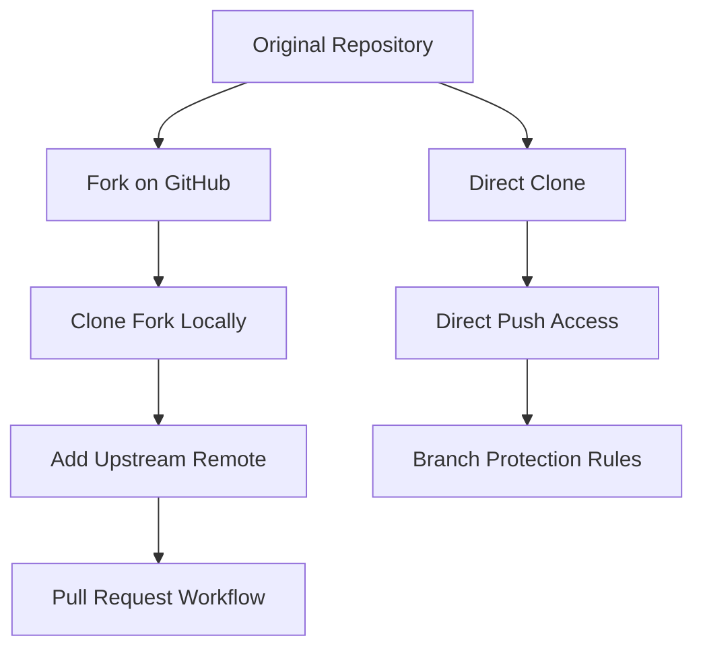
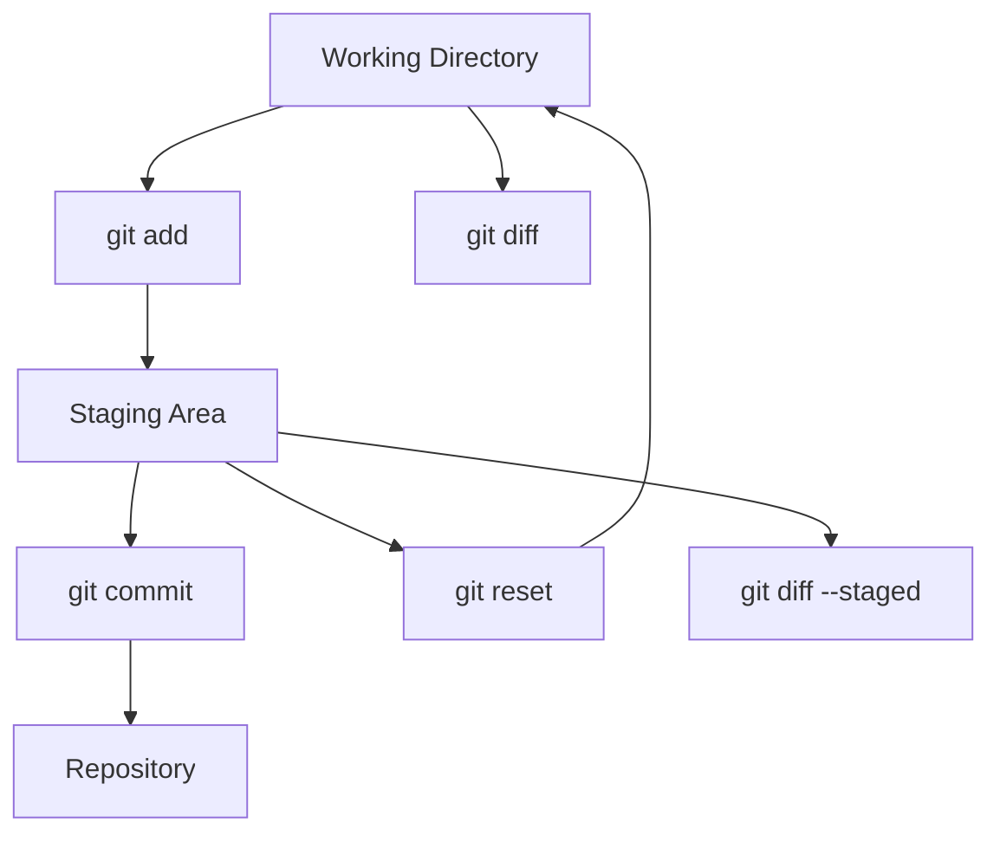
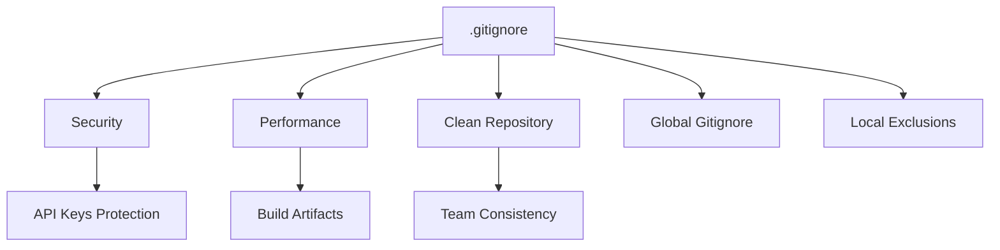
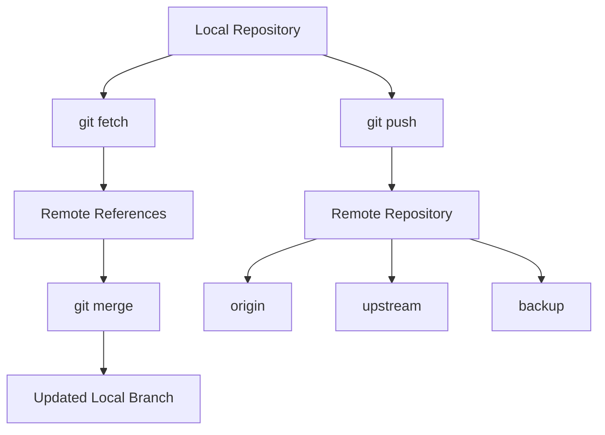
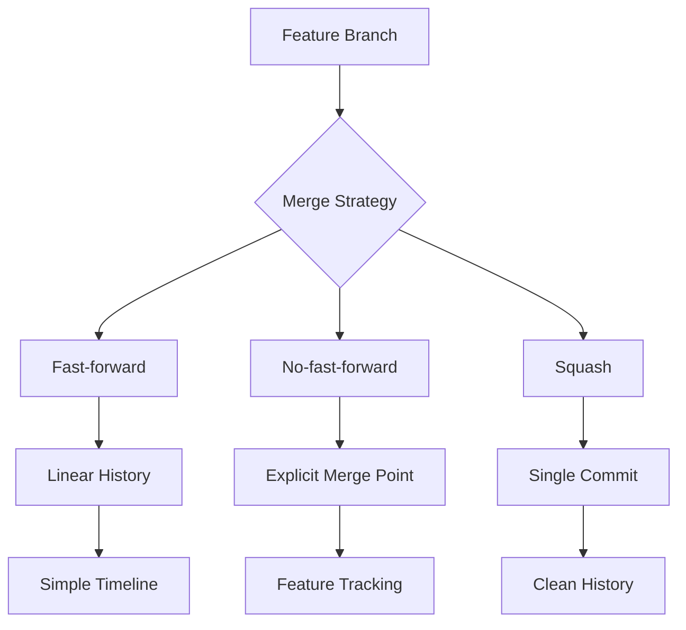
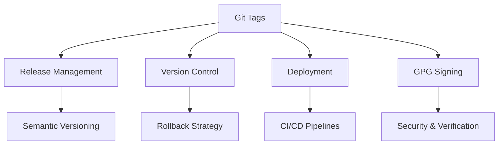

# Git & Verziókezelés

## Rövid összefoglaló

A Git egy elosztott verziókezelő rendszer, amely lehetővé teszi a kód változásainak nyomon követését, együttműködést és párhuzamos fejlesztést. Központi fogalmak: repo, commit, branch, merge vs rebase, pull request és release flow. Modern workflow-k közé tartozik a GitFlow és trunk-based fejlesztés. A Git erőssége a branching, distributed nature és a history kezelés rugalmassága. Fő buktatók: force push használata, branch divergence és merge conflict-ok helytelen kezelése.

<!-- Reading Progress Bar -->
<div id="read-progress"></div>

<!-- Tag Filter -->
<div class="tag-filter-container">
  <h3>🏷️ Szűrés témakörök szerint</h3>
  <div class="tag-filter-chips">
    <button class="filter-chip active" data-filter="all">Mind</button>
    <button class="filter-chip" data-filter="junior">Junior</button>
    <button class="filter-chip" data-filter="medior">Medior</button>
    <button class="filter-chip" data-filter="basics">Git Basics</button>
    <button class="filter-chip" data-filter="branching">Branching</button>
    <button class="filter-chip" data-filter="merging">Merging</button>
    <button class="filter-chip" data-filter="workflows">Workflows</button>
    <button class="filter-chip" data-filter="collaboration">Collaboration</button>
    <button class="filter-chip" data-filter="advanced">Advanced</button>
  </div>
</div>

## Fogalmak

### Repo (Repository) {#repo-repository}

<div class="concept-section mental-model" data-filter="basics junior">

🧭 **Így gondolj rá**  
*A Git repository olyan, mint egy időutazó könyvtár: minden változásnak megvan a saját "időpecsétje", és bármikor visszaugorhatsz egy korábbi verzióhoz.*

</div>

<div class="concept-section why-important" data-filter="basics junior">

💡 **Miért számít?**
- **Version control**: minden változás nyomon követhető és visszaállítható
- **Collaboration**: több fejlesztő biztonságosan dolgozhat együtt
- **Backup**: elosztott rendszer, minden clone teljes backup
- **Branching**: párhuzamos fejlesztési ágak kezelése

</div>

<div class="runnable-model" data-filter="basics junior">

**Runnable mental model**
```bash
# Repository inicializálás - új projekt kezdése
git init my-project
cd my-project

# Repository klónozás - meglévő projekt letöltése
git clone https://github.com/username/repository.git
git clone git@github.com:username/repository.git  # SSH kulcs

# Repository állapot ellenőrzése
git status
# On branch main
# Your branch is up to date with 'origin/main'
# nothing to commit, working tree clean

# Remote repository-k listázása
git remote -v
# origin  https://github.com/username/repo.git (fetch)
# origin  https://github.com/username/repo.git (push)

# Git konfigurálás (első használat)
git config --global user.name "Your Name"
git config --global user.email "your.email@example.com"
```
*Figyeld meg: `git init` helyi repo-t hoz létre, `git clone` távoli repo-t tölt le lokálisan.*

</div>

<div class="concept-section myths" data-filter="basics">

<details>
<summary>🧯 <strong>Gyakori tévhitek / félreértések</strong></summary>

<div>

- „Git ugyanaz mint GitHub." → Git a verziókezelő rendszer, GitHub a hosting szolgáltatás
- „Repository = folder." → Repository tartalmazza a teljes projekt történetét, nem csak az aktuális fájlokat
- „Git automatikusan backup-ol mindent." → Csak a commit-olt változások vannak verziókezelve

</div>

</details>

</div>

<div class="concept-section micro-learning" data-filter="basics">

<details>
<summary>📚 <strong>5 perces mikro-tanulás</strong></summary>

<div>

**Git három területe:**
```
Working Directory  →  Staging Area  →  Repository
     (fájlok)           (git add)        (git commit)

Modified files    →    Staged files  →  Committed files
```

**Repository típusok:**
```bash
# Local repository (saját gépeden)
git init

# Remote repository (szerveren, GitHub, GitLab)
git remote add origin https://github.com/user/repo.git

# Bare repository (csak Git adatok, nincs working directory)
git clone --bare repository.git
```

**Hasznos konfigurációk:**
```bash
# Global konfiguráció
git config --global init.defaultBranch main
git config --global pull.rebase false
git config --global core.autocrlf true  # Windows
git config --global core.autocrlf input # Mac/Linux
```

</div>

</details>

</div>

git log --oneline -5
# a1b2c3d (HEAD -> main, origin/main) Add user authentication
# e4f5g6h Fix login bug  
# i7j8k9l Initial project setup
```

Magyarázat: A repository a Git alapegysége, amely tartalmazza a project teljes verzióhistóriáját és konfigurációját.

### Clone vs Fork {#clone-vs-fork}

<div class="concept-section mental-model" data-filter="basics junior">

🧭 **Így gondolj rá**  
*Clone mint fénymásolás: azonos másolatot készítesz egy dokumentumról. Fork mint egy könyv saját kiadásának készítése: van saját ISBN-ed, de az eredeti tartalom alapján dolgozol.*

</div>

<div class="concept-section why-important" data-filter="basics junior">

💡 **Miért számít?**
- **Clone**: lokális fejlesztéshez, full repository letöltés
- **Fork**: open source contribution, független fejlesztés
- **Ownership**: fork esetén saját remote repository
- **Collaboration**: különböző workflow-k különböző célokra

</div>

<div class="runnable-model" data-filter="basics junior">

**Runnable mental model**
```bash
# CLONE - Direct repository copy
git clone https://github.com/company/internal-project.git
cd internal-project

# Remote origin automatically set
git remote -v
# origin  https://github.com/company/internal-project.git (fetch)
# origin  https://github.com/company/internal-project.git (push)

# Direct push access (if you have permissions)
git add README.md
git commit -m "docs: update README"
git push origin main  # Direct push to original repo

# FORK workflow - Open source contribution
# 1. Fork on GitHub: original-owner/awesome-project -> your-username/awesome-project

# 2. Clone YOUR fork
git clone https://github.com/your-username/awesome-project.git
cd awesome-project

# 3. Add upstream remote (original repository)
git remote add upstream https://github.com/original-owner/awesome-project.git

# Verify remotes
git remote -v
# origin    https://github.com/your-username/awesome-project.git (fetch)
# origin    https://github.com/your-username/awesome-project.git (push)
# upstream  https://github.com/original-owner/awesome-project.git (fetch)
# upstream  https://github.com/original-owner/awesome-project.git (push)

# 4. Keep fork synchronized
git fetch upstream
git checkout main
git merge upstream/main
git push origin main

# 5. Feature development
git checkout -b feature/awesome-improvement
echo "// New feature code" > src/feature.js
git add src/feature.js
git commit -m "feat: add awesome improvement"
git push origin feature/awesome-improvement

# 6. Create Pull Request
# GitHub: your-username/awesome-project -> original-owner/awesome-project
```
*Figyeld meg: Clone direkt hozzáférés, Fork saját másolat upstream kapcsolattal.*

</div>

<div class="concept-section myths" data-filter="basics">

<details>
<summary>🧯 <strong>Gyakori tévhitek / félreértések</strong></summary>

<div>

- „Fork és clone ugyanaz." → Fork GitHub/GitLab szerveren másol, clone lokálisan tölt le
- „Fork-ot nem kell szinkronizálni." → Upstream changes rendszeresen merge-ölni kell
- „Clone-nal nem lehet contribute-olni." → Ha van write access, clone elég

</div>

</details>

</div>

<div class="concept-section micro-learning" data-filter="basics">

<details>
<summary>📚 <strong>5 perces mikro-tanulás</strong></summary>

<div>

**Mikor melyiket használjuk:**
```
CLONE használata:
✅ Company internal projects
✅ Van write access a repo-hoz
✅ Team collaboration
✅ Saját projektek

FORK használata:
✅ Open source contribution
✅ Nincs write access
✅ Experimental changes
✅ Long-term personal modifications
```

**Fork synchronization workflow:**
```bash
# Daily sync routine
git fetch upstream
git checkout main
git merge upstream/main
git push origin main

# Feature branch from latest upstream
git checkout -b feature/new-feature upstream/main
```

**Best practices:**
```bash
# Never work directly on main in fork
git checkout main
git pull upstream main
git checkout -b fix/bug-description

# Keep PR branches focused
echo "One feature per branch"
```

</div>

</details>

</div>

<div class="concept-section interview" data-filter="basics">

<details>
<summary>💼 <strong>Interjú kérdések</strong></summary>

<div>

**Q: Mikor használnál fork-ot clone helyett?**
> Fork: open source projects, nincs write access, long-term personal changes. Clone: team projects, direct access, internal development.

**Q: Hogyan tartanád karban egy fork szinkronizációját?**
> Upstream remote hozzáadása, fetch upstream, merge upstream/main, push origin main.

**Q: Mi a különbség origin és upstream között?**
> Origin: saját fork/repository. Upstream: eredeti repository, ahonnan fork-oltál.

</div>

</details>

</div>

<div class="concept-section connections" data-filter="basics">

<details>
<summary>🔗 <strong>Kapcsolati térkép</strong></summary>

<div>



**Kapcsolódó fogalmak:**
- **Remote repositories**: origin vs upstream management
- **Pull Request**: fork-based contribution workflow
- **Branch strategies**: feature branches in forks
- **Access control**: repository permissions

</div>

</details>

</div>

### Staging Area (Index) {#staging-area}

<div class="concept-section mental-model" data-filter="basics junior">

🧭 **Így gondolj rá**  
*A Staging Area olyan, mint egy csomagolóasztal a postán: itt rendezed össze, mit akarsz elküldeni (commit-olni). Nem minden fájl megy egyből a csomagba - válogatod, rendezed, ellenőrzöd, majd összecsomagolod.*

</div>

<div class="concept-section why-important" data-filter="basics junior">

💡 **Miért számít?**
- **Selective commits**: nem minden változást kell egyszerre commit-olni
- **Review before commit**: átgondolhatod, mit commit-olsz
- **Logical grouping**: kapcsolódó változások egy commit-ba kerülhetnek
- **Safety net**: staging után még módosíthatod a commit-ot

</div>

<div class="runnable-model" data-filter="basics junior">

**Runnable mental model**
```bash
# Working Directory állapot ellenőrzése
git status
# On branch main
# Changes not staged for commit:
#   (use "git add <file>..." to update what will be committed)
#   (use "git checkout -- <file>..." to discard changes in working directory)
#         modified:   src/app.js
#         modified:   src/config.js
# Untracked files:
#   (use "git add <file>..." to include in what will be committed)
#         src/new-feature.js
#         test/app.test.js

# Szelektív staging - csak a logikailag kapcsolódó fájlok
git add src/app.js src/new-feature.js
git status
# On branch main
# Changes to be committed:
#   (use "git reset HEAD <file>..." to unstage)
#         modified:   src/app.js
#         new file:   src/new-feature.js
# Changes not staged for commit:
#         modified:   src/config.js
# Untracked files:
#         test/app.test.js

# Első commit - feature implementation
git commit -m "feat: implement new user authentication feature"

# Második staging - config és tests
git add src/config.js test/app.test.js
git commit -m "test: add tests for authentication feature"

# Interactive staging - fájl részek kiválasztása
git add -p src/complex-file.js
# Stage this hunk [y,n,q,a,d,/,j,J,g,e,?]? y
# y - yes, stage this hunk
# n - no, don't stage this hunk
# q - quit, don't stage this or remaining hunks
# a - stage this and all remaining hunks
# d - don't stage this or remaining hunks
# s - split current hunk into smaller hunks

# Interactive add mode
git add -i
# staged     unstaged path
# 1:    unchanged        +2/-1 src/app.js
# 2:    unchanged        +5/-0 src/new-feature.js
#
# *** Commands ***
# 1: status      2: update      3: revert      4: add untracked
# 5: patch       6: diff        7: quit        8: help

# Staging visszavonása
git reset HEAD src/app.js       # Specific file unstage
git reset                       # All staged files unstage

# Staging area vs Working directory különbségek
git diff                        # Working dir vs Staging
git diff --staged               # Staging vs Last commit
git diff HEAD                   # Working dir vs Last commit

# Fájl részleges staging example
echo "console.log('debug info');" >> src/app.js
echo "const newFeature = true;" >> src/app.js
echo "// TODO: remove debug code" >> src/app.js

git add -p src/app.js
# diff --git a/src/app.js b/src/app.js
# @@ -10,3 +10,6 @@ function login() {
#    return auth.validate();
#  }
# +console.log('debug info');
# +const newFeature = true;
# +// TODO: remove debug code
# Stage this hunk [y,n,q,a,d,s,e,?]? s

# After split:
# +console.log('debug info');
# +// TODO: remove debug code
# Stage this hunk [y,n,q,a,d,j,J,g,e,?]? n

# +const newFeature = true;
# Stage this hunk [y,n,q,a,d,K,g,e,?]? y

# Commit only the feature, leave debug code for later cleanup
git commit -m "feat: add new feature flag"

# Working directory still has debug code
git status
# Changes not staged for commit:
#         modified:   src/app.js
```
*Figyeld meg: staging area lehetővé teszi a precíz commit készítést és a munkaterület szervezését.*

</div>

<div class="concept-section myths" data-filter="basics">

<details>
<summary>🧯 <strong>Gyakori tévhitek / félreértések</strong></summary>

<div>

- „Staging area feleslegesen bonyolítja a dolgokat." → Lehetővé teszi a gondos commit preparation-t
- „git add . mindig biztonságos." → Nem kívánt fájlokat is stage-elhet (.env, logs, build artifacts)
- „Staged fájlokat nem lehet módosítani." → Módosíthatod, de újra stage-elni kell a változásokat

</div>

</details>

</div>

<div class="concept-section micro-learning" data-filter="basics">

<details>
<summary>📚 <strong>5 perces mikro-tanulás</strong></summary>

<div>

**Git háromszintű modell:**
```
Working Directory  →  Staging Area  →  Repository
      |                    |              |
   git add             git commit      git push

Modified files    →  Staged files  →  Committed files
```

**Staging strategies:**
```bash
# Atomic commits - logically related changes
git add src/user-service.js test/user-service.test.js
git commit -m "feat: add user service with tests"

# Feature increments
git add src/components/Header.js
git commit -m "feat: add header component"
git add src/components/Header.css  
git commit -m "style: add header component styling"

# Hotfix separation
git add src/security/auth.js
git commit -m "fix: resolve security vulnerability"
git add docs/security-update.md
git commit -m "docs: document security update"
```

**Useful staging commands:**
```bash
git add .                    # All changes (careful!)
git add -A                   # All changes including deletions
git add -u                   # Only modified/deleted (no new files)
git add *.js                 # Pattern matching
git add src/                 # Directory
git add -p                   # Interactive patch mode
git add -i                   # Interactive mode
```

</div>

</details>

</div>

<div class="concept-section interview" data-filter="basics">

<details>
<summary>💼 <strong>Interjú kérdések</strong></summary>

<div>

**Q: Mire jó a staging area?**
> Szelektív commit-ok, logikai csoportosítás, commit előtti review, clean git history létrehozása.

**Q: Mi a különbség git add . és git add -A között?**
> git add .: current directory changes. git add -A: minden változás (including deletions) a teljes repo-ban.

**Q: Hogyan stage-elnél egy fájl egy részét?**
> git add -p filename használatával, interaktív patch módban kiválasztva a szükséges hunk-okat.

</div>

</details>

</div>

<div class="concept-section connections" data-filter="basics">

<details>
<summary>🔗 <strong>Kapcsolati térkép</strong></summary>

<div>



**Kapcsolódó fogalmak:**
- **Commit**: staging area tartalma lesz commit
- **Working Directory**: aktuális fájlok állapota
- **Git diff**: különbségek a szintek között
- **Interactive adding**: precíz staging control

</div>

</details>

</div>

### .gitignore {#gitignore}

<div class="concept-section mental-model" data-filter="basics junior">

🧭 **Így gondolj rá**  
*A .gitignore olyan, mint egy bouncer egy klubban: megmondja, ki/mi mehet be és ki nem. A Git figyelmen kívül hagyja a .gitignore-ban felsorolt fájlokat és mappákat, mintha ott sem lennének.*

</div>

<div class="concept-section why-important" data-filter="basics junior">

💡 **Miért számít?**
- **Security**: API kulcsok, jelszavak nem kerülnek verziókezelésbe
- **Performance**: nagy build fájlok, dependencies kizárása
- **Clean repository**: csak releváns fájlok tracked
- **Team consistency**: mindenki ugyanazokat a fájlokat ignorálja

</div>

<div class="runnable-model" data-filter="basics junior">

**Runnable mental model**
```bash
# .gitignore file létrehozása projekt gyökérben
touch .gitignore

# Basic Node.js .gitignore
cat > .gitignore << 'EOF'
# Dependencies
node_modules/
npm-debug.log*
yarn-debug.log*
yarn-error.log*

# Production builds
dist/
build/
*.tgz

# Environment variables
.env
.env.local
.env.development.local
.env.test.local
.env.production.local

# IDE files
.vscode/
.idea/
*.swp
*.swo

# OS generated files
.DS_Store
.DS_Store?
._*
.Spotlight-V100
.Trashes
ehthumbs.db
Thumbs.db

# Logs
logs/
*.log

# Runtime data
pids/
*.pid
*.seed
*.pid.lock

# Coverage directory used by tools like istanbul
coverage/
.nyc_output/

# Dependency directories
jspm_packages/

# Optional npm cache directory
.npm

# Optional eslint cache
.eslintcache

# Microbundle cache
.rpt2_cache/
.rts2_cache_cjs/
.rts2_cache_es/
.rts2_cache_umd/

# Optional REPL history
.node_repl_history

# Output of 'npm pack'
*.tgz

# Yarn Integrity file
.yarn-integrity
EOF

# Global .gitignore (minden Git repo-ban használva)
git config --global core.excludesfile ~/.gitignore_global

# Global .gitignore példa
cat > ~/.gitignore_global << 'EOF'
# OS Files
.DS_Store
.DS_Store?
._*
.Spotlight-V100
.Trashes
ehthumbs.db
Thumbs.db

# Editor files
.vscode/
.idea/
*.swp
*.swo
*~

# Temporary files
*.tmp
*.temp
.cache/
EOF

# Gitignore patterns példák
cat > .gitignore << 'EOF'
# Comments start with #

# Ignore specific file
config/secrets.json

# Ignore all files with specific extension
*.log
*.tmp

# Ignore directory and all contents
temp/
cache/

# Ignore files in any directory
**/logs/

# Ignore file only in root
/package-lock.json

# Ignore everything in directory except specific files
build/*
!build/index.html
!build/assets/

# Ignore files matching pattern anywhere
**/*.backup

# Ignore files but not directories
*.txt
!important.txt

# Range patterns
debug[0-9].log
test[a-z].js
EOF

# Már tracked fájl ignorálása
echo "API_KEY=secret123" > config/secrets.json
git add config/secrets.json
git commit -m "Add secrets (OOPS!)"

# Most ignorálni szeretnénk
echo "config/secrets.json" >> .gitignore
git status
# Changes not staged for commit:
#   modified:   config/secrets.json  # Still tracked!

# Remove from tracking but keep file
git rm --cached config/secrets.json
git add .gitignore
git commit -m "Remove secrets from tracking and add to gitignore"

# Most már ignored
echo "API_KEY=newsecret456" > config/secrets.json
git status
# On branch main
# nothing to commit, working tree clean

# Force add ignored file (if really needed)
git add -f config/secrets.json
# Warning: might not be what you want!

# Check what would be ignored
git status --ignored
# On branch main
# Ignored files:
#   (use "git add -f <file>..." to include in what will be committed)
#         node_modules/
#         .env
#         *.log

# Template-based .gitignore generation
# GitHub provides templates for different languages
curl -s https://raw.githubusercontent.com/github/gitignore/main/Node.gitignore > .gitignore

# Using gitignore.io API
curl -s "https://www.toptal.com/developers/gitignore/api/node,react,vscode" > .gitignore

# Local exclusions (not shared with team)
echo "my-personal-notes.txt" >> .git/info/exclude
# This file is not versioned, only affects your local repo
```
*Figyeld meg: .gitignore patterns, már tracked fájlok kezelése, global vs local ignoring.*

</div>

<div class="concept-section myths" data-filter="basics">

<details>
<summary>🧯 <strong>Gyakori tévhitek / félreértések</strong></summary>

<div>

- „.gitignore visszamenőlegesen is működik." → Csak untracked fájlokra vonatkozik
- „.gitignore-t nem kell commit-olni." → Team-mel meg kell osztani, tehát commit kell
- „Minden IDE fájlt ignorálni kell." → Csak personal settings-et, shared config mehet

</div>

</details>

</div>

<div class="concept-section micro-learning" data-filter="basics">

<details>
<summary>📚 <strong>5 perces mikro-tanulás</strong></summary>

<div>

**Gitignore pattern syntax:**
```bash
# Basic patterns
*.log           # All .log files
temp/           # temp directory and contents
/build          # build in root only
**/logs         # logs directory anywhere

# Negation (exceptions)
*.log           # Ignore all logs
!important.log  # But keep this one

# Directory vs file
cache/          # Directory
cache           # File or directory

# Advanced patterns
debug?.log      # Single character wildcard
debug[0-9].log  # Character range
debug[!0-9].log # Negated character range
```

**Common language templates:**
```bash
# Python
__pycache__/
*.py[cod]
*$py.class
*.so
.Python
env/
venv/
.env

# Java
*.class
*.jar
*.war
*.ear
target/
.gradle/
build/

# C++
*.o
*.obj
*.exe
*.dll
*.so
*.dylib

# Web
node_modules/
dist/
.cache/
.parcel-cache/
```

**Best practices:**
```bash
# Language-specific first
# OS-specific after
# IDE-specific at end
# Comments for unclear patterns
# Use templates as starting point
# Don't ignore too much
# Regular cleanup and review
```

</div>

</details>

</div>

<div class="concept-section interview" data-filter="basics">

<details>
<summary>💼 <strong>Interjú kérdések</strong></summary>

<div>

**Q: Mit tennél ha már commit-olt fájlt kell ignorálni?**
> git rm --cached filename, majd hozzáadom .gitignore-hoz és commit-olom a változásokat.

**Q: Mi a különbség .gitignore és .git/info/exclude között?**
> .gitignore: versioned, team-mel shared. .git/info/exclude: local only, personal exclusions.

**Q: Hogyan ellenőriznéd, hogy egy fájl ignorálva van-e?**
> git check-ignore filename vagy git status --ignored parancsokkal.

</div>

</details>

</div>

<div class="concept-section connections" data-filter="basics">

<details>
<summary>🔗 <strong>Kapcsolati térkép</strong></summary>

<div>



**Kapcsolódó fogalmak:**
- **Security**: sensitive data protection
- **Repository cleanliness**: csak releváns fájlok
- **Team workflow**: shared ignore rules
- **Git templates**: language-specific patterns

</div>

</details>

</div>

### Remote (origin, upstream) {#remote}

<div class="concept-section mental-model" data-filter="basics junior">

🧭 **Így gondolj rá**  
*A remote-ok olyan, mint a telefonkönyvedben lévő névjegyek: nem maga a személy, hanem egy név és cím, hogy hogyan éred el őket. Origin a "home", upstream a "headquarters".*

</div>

<div class="concept-section why-important" data-filter="basics junior">

💡 **Miért számít?**
- **Collaboration**: csapat tagokkal való szinkronizáció
- **Backup**: távoli szervereken történő mentés
- **Distribution**: kód megosztása különböző lokációkban
- **Workflow management**: různé remote-ok különböző célokra

</div>

<div class="runnable-model" data-filter="basics junior">

**Runnable mental model**
```bash
# Remote-ok listázása
git remote -v
# origin  https://github.com/myuser/myproject.git (fetch)
# origin  https://github.com/myuser/myproject.git (push)

# Új remote hozzáadása
git remote add upstream https://github.com/originaluser/originalproject.git
git remote add backup https://github.com/myuser/myproject-backup.git

# Remote-ok ellenőrzése
git remote -v
# origin    https://github.com/myuser/myproject.git (fetch)
# origin    https://github.com/myuser/myproject.git (push)
# upstream  https://github.com/originaluser/originalproject.git (fetch)
# upstream  https://github.com/originaluser/originalproject.git (push)
# backup    https://github.com/myuser/myproject-backup.git (fetch)
# backup    https://github.com/myuser/myproject-backup.git (push)

# Remote részletes információ
git remote show origin
# * remote origin
#   Fetch URL: https://github.com/myuser/myproject.git
#   Push  URL: https://github.com/myuser/myproject.git
#   HEAD branch: main
#   Remote branches:
#     main                               tracked
#     feature/user-authentication        tracked
#   Local branches configured for 'git pull':
#     main                               merges with remote main
#     feature/user-authentication        merges with remote feature/user-authentication
#   Local refs configured for 'git push':
#     main                               pushes to main (up to date)
#     feature/user-authentication        pushes to feature/user-authentication (up to date)

# Fetch vs Pull különböző remote-okból
git fetch origin                # Origin branch-ek letöltése (no merge)
git fetch upstream             # Upstream branch-ek letöltése
git fetch --all               # Minden remote letöltése

# Remote branch-ek megtekintése
git branch -r
# origin/main
# origin/feature/user-auth
# upstream/main
# upstream/develop

# Minden branch (local + remote)
git branch -a
# * main
#   feature/user-auth
#   remotes/origin/main
#   remotes/origin/feature/user-auth
#   remotes/upstream/main
#   remotes/upstream/develop

# Upstream tracking beállítása
git checkout -b feature/new-feature origin/main
git push -u origin feature/new-feature
# -u flag sets upstream tracking

# Már létező branch upstream beállítása
git branch --set-upstream-to=origin/main main

# Remote branch checkout és tracking
git checkout -b local-feature origin/feature/remote-feature
# Creates local branch tracking origin/feature/remote-feature

# Remote URL módosítása
git remote set-url origin git@github.com:myuser/myproject.git
# HTTPS -> SSH switch

# Multiple URLs egy remote-hoz (push több helyre)
git remote set-url --add origin https://gitlab.com/myuser/myproject.git
git remote -v
# origin  git@github.com:myuser/myproject.git (fetch)
# origin  git@github.com:myuser/myproject.git (push)
# origin  https://gitlab.com/myuser/myproject.git (push)

# Remote törlése
git remote remove backup
git remote rm upstream

# Fork workflow remote setup
git clone https://github.com/myuser/forked-project.git
cd forked-project
git remote add upstream https://github.com/original-owner/original-project.git

# Upstream sync
git fetch upstream
git checkout main
git merge upstream/main
git push origin main

# Különböző remote-okba push-olás
git push origin main              # Saját fork
git push backup main             # Backup repository
git push upstream main           # Ha van write access

# Remote branch deletion
git push origin --delete feature/completed-feature
git push origin :feature/completed-feature  # Alternative syntax

# Remote prune - deleted remote branches cleanup
git fetch --prune
git remote prune origin

# SSH vs HTTPS remote setup
# HTTPS (username/password or token required)
git remote add origin https://github.com/user/repo.git

# SSH (SSH key required)
git remote add origin git@github.com:user/repo.git

# Check SSH connection
ssh -T git@github.com
# Hi username! You've successfully authenticated, but GitHub does not provide shell access.
```
*Figyeld meg: multiple remote-ok kezelése, tracking relationships, different protocols.*

</div>

<div class="concept-section myths" data-filter="basics">

<details>
<summary>🧯 <strong>Gyakori tévhitek / félreértések</strong></summary>

<div>

- „Origin a default remote név." → Csak konvenció, lehet másképp is nevezni
- „Csak egy remote lehet." → Több remote is beállítható különböző célokra
- „Remote = GitHubon lévő repo." → Bármilyen Git server lehet remote

</div>

</details>

</div>

<div class="concept-section micro-learning" data-filter="basics">

<details>
<summary>📚 <strong>5 perces mikro-tanulás</strong></summary>

<div>

**Remote naming conventions:**
```bash
origin      # Your primary repository (fork or main)
upstream    # Original repository (when forked)
backup      # Backup repository
deploy      # Deployment repository
staging     # Staging environment
production  # Production environment
```

**Common remote operations:**
```bash
# Daily workflow
git fetch origin          # Get latest remote info
git pull origin main      # Fetch + merge
git push origin feature   # Push local branch

# Fork synchronization
git fetch upstream
git checkout main
git merge upstream/main
git push origin main

# Remote branch operations
git checkout -b feature origin/feature  # Track remote branch
git push -u origin feature              # Push with upstream
git branch -d feature                   # Delete local
git push origin --delete feature        # Delete remote
```

**Remote URLs and protocols:**
```bash
# HTTPS - easier setup, requires credentials
https://github.com/user/repo.git

# SSH - more secure, requires SSH keys  
git@github.com:user/repo.git

# Local path (for testing)
/path/to/local/repo.git
file:///path/to/local/repo.git

# Change protocol
git remote set-url origin git@github.com:user/repo.git
```

</div>

</details>

</div>

<div class="concept-section interview" data-filter="basics">

<details>
<summary>💼 <strong>Interjú kérdések</strong></summary>

<div>

**Q: Mi a különbség origin és upstream között?**
> Origin: általában saját repository vagy fork. Upstream: eredeti repository, ahonnan fork-oltál.

**Q: Mi történik git fetch vs git pull esetén?**
> Fetch: letölti a remote changes-eket merge nélkül. Pull: fetch + merge/rebase az aktív branch-be.

**Q: Hogyan állítanál be multiple remote-okat egy projekthez?**
> git remote add name URL, különböző néven különböző remote-ok hozzáadása specific workflow-khoz.

</div>

</details>

</div>

<div class="concept-section connections" data-filter="basics">

<details>
<summary>🔗 <strong>Kapcsolati térkép</strong></summary>

<div>



**Kapcsolódó fogalmak:**
- **Clone vs Fork**: remote setup különbségek
- **Branch tracking**: local-remote branch relationships
- **Push/Pull**: remote synchronization
- **Authentication**: SSH keys, tokens, credentials

</div>

</details>

</div>

### Fast-forward vs No-fast-forward Merge {#fast-forward-vs-no-fast-forward}

<div class="concept-section mental-model" data-filter="merging junior">

🧭 **Így gondolj rá**  
*Fast-forward olyan, mint amikor egy vonat egyenes sínen halad: nincs akadály, egyszerűen továbbmegy. No-fast-forward olyan, mint amikor két út találkozik: explicit találkozási pont (merge commit) jelzi, hogy itt két irány egyesült.*

</div>

<div class="concept-section why-important" data-filter="merging junior">

💡 **Miért számít?**
- **History visibility**: no-ff megőrzi a feature branch létezését
- **Rollback capability**: könnyebb egy egész feature visszavonása
- **Team awareness**: látszik, hogy mi volt együtt fejlesztve
- **Release management**: clear feature boundaries a history-ban

</div>

<div class="runnable-model" data-filter="merging junior">

**Runnable mental model**
```bash
# Setup: létrehozunk egy scenario-t
git checkout main
echo "Initial content" > README.md
git add README.md
git commit -m "Initial commit"

# Feature branch létrehozása és development
git checkout -b feature/user-login
echo "Login feature implemented" >> README.md
git add README.md
git commit -m "feat: implement user login"

echo "Add login validation" >> README.md
git add README.md
git commit -m "feat: add login validation"

# FAST-FORWARD MERGE scenario
git checkout main
# Main branch hasn't changed since feature branch creation

git merge feature/user-login
# Updating a1b2c3d..e4f5g6h
# Fast-forward
#  README.md | 2 ++
#  1 file changed, 2 insertions(+)

# History after fast-forward merge
git log --oneline --graph
# * e4f5g6h (HEAD -> main, feature/user-login) feat: add login validation
# * i7j8k9l feat: implement user login
# * a1b2c3d Initial commit

# NO EXPLICIT MERGE COMMIT - linear history

# Reset for no-fast-forward example
git reset --hard a1b2c3d
git checkout -b feature/user-profile
echo "Profile feature implemented" >> README.md
git add README.md
git commit -m "feat: implement user profile"

# NO-FAST-FORWARD MERGE
git checkout main
git merge --no-ff feature/user-profile -m "Merge feature: user profile"
# Merge made by the 'recursive' strategy.
#  README.md | 1 +
#  1 file changed, 1 insertion(+)

# History after no-fast-forward merge
git log --oneline --graph
# *   x9y8z7w (HEAD -> main) Merge feature: user profile
# |\
# | * v6u5t4s (feature/user-profile) feat: implement user profile
# |/
# * a1b2c3d Initial commit

# EXPLICIT MERGE COMMIT shows feature branch existed

# Complex scenario - main branch advanced
git checkout main
echo "Main branch update" >> CHANGELOG.md
git add CHANGELOG.md
git commit -m "docs: update changelog"

git checkout -b feature/notifications
echo "Notifications implemented" >> README.md
git add README.md
git commit -m "feat: add notifications"

# Try to merge - automatic three-way merge
git checkout main
git merge feature/notifications
# Merge made by the 'recursive' strategy.
#  README.md | 1 +
#  1 file changed, 1 insertion(+)

# History shows divergent development
git log --oneline --graph
# *   r2d2c3p (HEAD -> main) Merge branch 'feature/notifications'
# |\
# | * s1w2e3r (feature/notifications) feat: add notifications
# * | t4y5u6i docs: update changelog
# |/
# * a1b2c3d Initial commit

# Configure default merge behavior
git config merge.ff false           # Always create merge commit
git config merge.ff only            # Only allow fast-forward merges
git config --unset merge.ff         # Reset to default (auto)

# Branch-specific merge strategies
git merge --ff-only feature/simple-fix
# Fast-forward only (fails if not possible)

git merge --no-ff feature/major-feature
# Always create merge commit

git merge --squash feature/multiple-commits
# Combine all feature commits into single commit

# Example: Release workflow with no-ff
git checkout main
git merge --no-ff release/v1.2.0 -m "Release v1.2.0

Features:
- User authentication system
- Profile management
- Notification system

Bug fixes:
- Login validation
- Profile picture upload
- Email formatting

Breaking changes:
- API endpoint structure updated"

# Clean feature branch cleanup after merge
git branch -d feature/user-login
git branch -d feature/user-profile
git branch -d feature/notifications

# Check if branch is merged before deletion
git branch --merged
# Lists branches merged into current branch

git branch --no-merged
# Lists branches not yet merged

# Force delete unmerged branch (careful!)
git branch -D feature/experimental

# GitHub/GitLab merge strategies visualization
echo "
Pull Request merge options:

1. Create merge commit (--no-ff)
   * Preserves feature branch history
   * Clear feature boundaries
   * Easier feature rollback

2. Squash and merge
   * Single commit from all feature commits
   * Clean linear history
   * Loses individual commit history

3. Rebase and merge
   * Linear history without merge commit
   * Individual commits preserved
   * Looks like direct commits to main
"
```
*Figyeld meg: fast-forward lineáris history, no-ff explicit merge points, different use cases.*

</div>

<div class="concept-section myths" data-filter="merging">

<details>
<summary>🧯 <strong>Gyakori tévhitek / félreértések</strong></summary>

<div>

- „Fast-forward mindig jobb." → Elrejti a feature branch context-et
- „No-fast-forward feleslegesen bonyolítja a history-t." → Hasznos feature tracking-hez
- „Merge commit-ok hibát jelentenek." → Intended behavior no-ff merge esetén

</div>

</details>

</div>

<div class="concept-section micro-learning" data-filter="merging">

<details>
<summary>📚 <strong>5 perces mikro-tanulás</strong></summary>

<div>

**Mikor melyiket használjuk:**
```
FAST-FORWARD (default):
✅ Hotfix-ek
✅ Kis változtatások
✅ Linear history preference
✅ Simple workflow

NO-FAST-FORWARD (--no-ff):
✅ Feature branches
✅ Release merges
✅ Team collaboration
✅ Feature tracking
✅ Rollback capability
```

**Merge strategies comparison:**
```bash
# Fast-forward result
* c3 (HEAD -> main, feature) Latest feature commit
* c2 Feature commit 2
* c1 Feature commit 1
* c0 Initial commit

# No-fast-forward result
*   m1 (HEAD -> main) Merge branch 'feature'
|\
| * c3 (feature) Latest feature commit
| * c2 Feature commit 2
| * c1 Feature commit 1
|/
* c0 Initial commit
```

**Configuration options:**
```bash
# Global settings
git config --global merge.ff false     # Always no-ff
git config --global merge.ff only      # Only ff
git config --global pull.ff only       # ff-only pulls

# Repository-specific
git config merge.ff false
git config pull.rebase true            # Rebase instead of merge on pull
```

</div>

</details>

</div>

<div class="concept-section interview" data-filter="merging">

<details>
<summary>💼 <strong>Interjú kérdések</strong></summary>

<div>

**Q: Mikor használnál no-fast-forward merge-et?**
> Feature branch-ek merge-élésekor, release merges-nél, amikor fontos a feature tracking és rollback capability.

**Q: Mi a különbség --squash és --no-ff között?**
> --squash: egyetlen commit-ba olvasztja össze a feature-t. --no-ff: megőrzi a commit history-t merge commit-tal.

**Q: Hogyan konfigurálanád a Git-et always no-ff merge-re?**
> git config merge.ff false beállítással vagy git config --global merge.ff false globálisan.

</div>

</details>

</div>

<div class="concept-section connections" data-filter="merging">

<details>
<summary>🔗 <strong>Kapcsolati térkép</strong></summary>

<div>



**Kapcsolódó fogalmak:**
- **Branch strategies**: feature branch workflows
- **Git history**: linear vs branched history
- **Team collaboration**: merge policies
- **Release management**: feature grouping

</div>

</details>

</div>

### Git Tags (annotated vs lightweight) {#git-tags}

<div class="concept-section mental-model" data-filter="advanced medior">

🧭 **Így gondolj rá**  
*Git tag-ek olyan, mint mérföldkövek egy úton: jelzik a fontos pontokat az útvonalban. Lightweight tag egy egyszerű tábla "v1.0", annotated tag egy információs tábla teljes leírással: ki állította, mikor és miért.*

</div>

<div class="concept-section why-important" data-filter="advanced medior">

💡 **Miért számít?**
- **Release management**: pontosan azonosítható verziók
- **Rollback capability**: gyors visszatérés stabil verzióhoz
- **Deployment tracking**: mi van production-ben
- **Communication**: stakeholder-eknek clear version references

</div>

<div class="runnable-model" data-filter="advanced medior">

**Runnable mental model**
```bash
# LIGHTWEIGHT TAG - egyszerű pointer
git tag v1.0.0
git tag bugfix-patch

# Lightweight tag információ
git show v1.0.0
# commit a1b2c3d4e5f6... (tag: v1.0.0)
# Author: Developer <dev@example.com>
# Date: Wed Oct 25 10:30:00 2023 +0200
# Just shows the commit, no tag metadata

# ANNOTATED TAG - teljes metadata objektum
git tag -a v1.1.0 -m "Release version 1.1.0

🎯 New Features:
- User authentication system
- Profile management interface
- Real-time notifications

🐛 Bug Fixes:
- Login session timeout resolved
- Profile image upload fix
- Email validation improvements

📈 Performance:
- 40% faster page load times
- Optimized database queries
- Reduced memory usage

⚠️ Breaking Changes:
- API endpoint /users moved to /api/v1/users
- Authentication token format changed
- Legacy browser support dropped (IE11)

👥 Contributors: @alice, @bob, @charlie
📅 Release Date: 2023-10-25
🔗 Changelog: https://github.com/project/releases/v1.1.0"

# Annotated tag információ
git show v1.1.0
# tag v1.1.0
# Tagger: Release Manager <release@company.com>
# Date: Wed Oct 25 14:30:00 2023 +0200
# 
# Release version 1.1.0
# [full message content]
# 
# commit a1b2c3d4e5f6...
# [commit details]

# Tag-ek listázása
git tag
# v1.0.0
# v1.1.0
# bugfix-patch

# Pattern alapú tag listázás
git tag -l "v1.*"
# v1.0.0
# v1.1.0

git tag -l "*patch*"
# bugfix-patch

# Tag-ek description-nel
git tag -n5
# v1.0.0          Initial release version
# v1.1.0          Release version 1.1.0
#                 
#                 🎯 New Features:
#                 - User authentication system
# bugfix-patch    Critical security fix

# Specific commit tag-elése (retroactive)
git log --oneline
# a1b2c3d Latest commit
# e4f5g6h Previous commit
# i7j8k9l Bug fix commit
# l0m1n2o Initial commit

git tag -a v1.0.1 i7j8k9l -m "Retroactive tag for bug fix release"

# Tag checkout (detached HEAD)
git checkout v1.1.0
# Note: switching to 'v1.1.0'.
# You are in 'detached HEAD' state...

# Create branch from tag
git checkout -b hotfix/v1.1.1 v1.1.0
echo "Critical fix" > hotfix.txt
git add hotfix.txt
git commit -m "fix: critical security vulnerability"
git tag -a v1.1.1 -m "Hotfix release v1.1.1 - Security patch"

# Tag push (explicit required!)
git push origin v1.1.0          # Single tag
git push origin --tags          # All tags
git push --follow-tags          # Tags associated with commits being pushed

# Tag deletion
git tag -d v1.0.0               # Delete local tag
git push origin --delete tag v1.0.0  # Delete remote tag

# Tag verification (signed tags)
git tag -a -s v2.0.0 -m "Signed release v2.0.0"
# Creates GPG-signed tag

git tag -v v2.0.0               # Verify signature
# object a1b2c3d4e5f6...
# type commit
# tag v2.0.0
# tagger Release Manager <release@company.com> 1635163800 +0200
# 
# Signed release v2.0.0
# gpg: Signature made Wed 25 Oct 2023 14:30:00 CET
# gpg: Good signature from "Release Manager <release@company.com>"

# Semantic versioning tag workflow
echo "
Semantic Versioning Pattern:
MAJOR.MINOR.PATCH[-PRERELEASE][+BUILD]

Examples:
v1.0.0          # Initial release
v1.1.0          # New features (backward compatible)
v1.1.1          # Bug fixes
v2.0.0          # Breaking changes
v2.0.0-alpha.1  # Pre-release
v2.0.0-beta.2   # Beta release  
v2.0.0-rc.1     # Release candidate
v1.0.0+20231025 # Build metadata
"

# Automated version bumping
#!/bin/bash
# version-bump.sh
VERSION_TYPE=${1:-patch}  # major, minor, patch

# Get current version
CURRENT_VERSION=$(git describe --tags --abbrev=0)
echo "Current version: $CURRENT_VERSION"

# Calculate new version (simplified)
case $VERSION_TYPE in
  "major")
    NEW_VERSION="v2.0.0"  # Logic to increment major
    ;;
  "minor") 
    NEW_VERSION="v1.2.0"  # Logic to increment minor
    ;;
  "patch")
    NEW_VERSION="v1.1.2"  # Logic to increment patch
    ;;
esac

echo "New version: $NEW_VERSION"

# Create annotated tag with changelog
git tag -a "$NEW_VERSION" -m "Release $NEW_VERSION

$(git log $CURRENT_VERSION..HEAD --oneline --format="- %s")"

# Release workflow with tags
git checkout main
git pull origin main

# Ensure clean working directory
if [[ -n $(git status --porcelain) ]]; then
  echo "Working directory not clean!"
  exit 1
fi

# Run tests
npm test || exit 1

# Update version in package.json
npm version patch --no-git-tag-version
git add package.json
git commit -m "bump: version to $(npm -s run env echo '$npm_package_version')"

# Create release tag
NEW_VERSION="v$(node -p "require('./package.json').version")"
git tag -a "$NEW_VERSION" -m "Release $NEW_VERSION"

# Push everything
git push origin main
git push origin "$NEW_VERSION"

# Tag-based deployment
# CI/CD pipeline example (GitHub Actions)
echo "
name: Deploy on Tag
on:
  push:
    tags:
      - 'v*'

jobs:
  deploy:
    runs-on: ubuntu-latest
    steps:
      - uses: actions/checkout@v2
      - name: Get tag version
        id: tag
        run: echo ::set-output name=tag::\${GITHUB_REF#refs/tags/}
      
      - name: Deploy to production
        run: |
          echo \"Deploying version \${{ steps.tag.outputs.tag }} to production\"
          # Deploy logic here
"
```
*Figyeld meg: lightweight vs annotated tag különbségek, semantic versioning, automated workflows.*

</div>

<div class="concept-section myths" data-filter="advanced">

<details>
<summary>🧯 <strong>Gyakori tévhitek / félreértések</strong></summary>

<div>

- „Tag-ek automatikusan push-olódnak." → Explicit git push origin tagname szükséges
- „Lightweight tag ugyanaz mint annotated." → Lightweight csak pointer, annotated teljes objektum metadata-val
- „Tag-eket lehet módosítani." → Immutable-ek, delete + recreate szükséges

</div>

</details>

</div>

<div class="concept-section micro-learning" data-filter="advanced">

<details>
<summary>📚 <strong>5 perces mikro-tanulás</strong></summary>

<div>

**Tag types comparison:**
```bash
# Lightweight Tag
git tag v1.0.0
# - Simple pointer to commit
# - No additional metadata
# - Fast and lightweight
# - Use for temporary/private marking

# Annotated Tag  
git tag -a v1.0.0 -m "Release v1.0.0"
# - Full Git object with metadata
# - Tagger info, date, message
# - Can be GPG signed
# - Use for public releases
```

**Semantic versioning rules:**
```
MAJOR version: incompatible API changes
MINOR version: new functionality, backward compatible
PATCH version: bug fixes, backward compatible

Pre-release: 1.0.0-alpha.1, 1.0.0-beta.2, 1.0.0-rc.1
Build metadata: 1.0.0+20231025.1
```

**Tag-based workflows:**
```bash
# Release workflow
git checkout main
git pull origin main
npm test
npm version patch
git push origin main --follow-tags

# Hotfix workflow
git checkout -b hotfix/v1.0.1 v1.0.0
# Make fixes
git tag -a v1.0.1 -m "Hotfix v1.0.1"
git push origin v1.0.1
```

</div>

</details>

</div>

<div class="concept-section interview" data-filter="advanced">

<details>
<summary>💼 <strong>Interjú kérdések</strong></summary>

<div>

**Q: Mikor használnál lightweight vs annotated tag-et?**
> Lightweight: temporary marking, private use. Annotated: public releases, official versions, shared repositories.

**Q: Hogyan állítanál vissza egy production environment-et egy korábbi tag-re?**
> git checkout tagname, majd deployment script futtatása vagy git checkout -b rollback-branch tagname.

**Q: Mi a semantic versioning és hogyan használnád Git tag-ekkel?**
> MAJOR.MINOR.PATCH format, breaking changes = major bump, new features = minor, bug fixes = patch.

</div>

</details>

</div>

<div class="concept-section connections" data-filter="advanced">

<details>
<summary>🔗 <strong>Kapcsolati térkép</strong></summary>

<div>



**Kapcsolódó fogalmak:**
- **Release workflows**: tag-based deployment
- **Semantic versioning**: structured version naming
- **CI/CD**: automated tag-triggered deployments
- **Security**: GPG signed releases

</div>

</details>

</div>

<div class="concept-section" data-filter="junior">

### Commit {#commit}

<div class="mental-model">
🎯 **Mental Model: Commit - A Digital Photo Album**
Képzeld el a Git commit-ot mint egy digitális fényképalbumot. Minden egyes commit egy fénykép a projekt állapotáról egy adott időpillanatban. Ahogy egy fényképen láthatod, hogy ki volt jelen, mit csináltak, és mikor készült, úgy egy commit is rögzíti, ki mit változtatott és mikor.

**A commit anatómiája:**
- **Hash (ujjlenyomat)**: mint egy fénykép egyedi azonosítója
- **Üzenet**: mint a fénykép alatt található leírás
- **Timestamp**: mikor készült a "fénykép"
- **Author**: ki készítette a változtatásokat
- **Changes**: mi változott az előző állapothoz képest
</div>

<div class="why-important">
💡 **Miért fontos a commit?**
- **Visszakövethetőség**: Bármikor vissza tudsz térni egy korábbi állapotra
- **Blame/Credit**: Látod, ki mit csinált és mikor
- **Code Review**: Áttekintheted a változtatásokat commit-onként
- **Hibakeresés**: Ha bug jelenik meg, könnyebben megtalálod a problémás commit-ot
- **Release Notes**: A commit üzenetek alapján dokumentálhatod a változásokat
</div>

<div class="runnable-model">
🚀 **Gyakorlati commit flow:**
```bash
# 1. Változtatások megtekintése
git status
# On branch main
# Changes not staged for commit:
#   modified:   src/App.js
# Untracked files:
#   src/NewComponent.js

# 2. Staging area használata
git add src/App.js              # Egy fájl hozzáadása
git add src/NewComponent.js     # Másik fájl hozzáadása
git add .                       # Minden változás (óvatosan!)

# 3. Commit készítése beszédes üzenettel
git commit -m "feat: add user authentication component"

# 4. Commit történet megtekintése
git log --oneline
# a1b2c3d feat: add user authentication component
# e4f5g6h fix: resolve login validation bug
# i7j8k9l docs: update README with setup instructions

# 5. Részletes commit információ
git show a1b2c3d
# commit a1b2c3d4e5f6g7h8i9j0k1l2m3n4o5p6q7r8s9t0
# Author: John Doe <john@example.com>
# Date:   Wed Sep 27 14:30:45 2023 +0200
#
#     feat: add user authentication component
#
# diff --git a/src/NewComponent.js b/src/NewComponent.js
# new file mode 100644
# +import React, { useState } from 'react';
# +const AuthComponent = () => { ... }

# 6. Commit módosítása (csak ha még nincs push-olva!)
git commit --amend -m "feat: add user authentication with OAuth support"
```

**Staging area stratégiák:**
```bash
# Interaktív staging (részleges commit-ok)
git add -p filename.js          # Patch módban választhatsz

# Fájlok részleges hozzáadása
git add -i                      # Interaktív mód

# Staging visszavonása
git reset HEAD filename.js      # Unstage egy fájlt
git reset                       # Unstage mindent
```
</div>

<div class="myths">
🚫 **Gyakori tévhitek és hibák**

<details>
<summary><strong>Tévhit: "A commit üzenet nem fontos"</strong></summary>
<div class="myth-content">
**Valóság:** A commit üzenet a kód dokumentációjának része. 6 hónappal később te sem fogod emlékezni, mit akartál csinálni.

**Rossz példa:**
```bash
git commit -m "fix"
git commit -m "wip"
git commit -m "asdf"
```

**Jó példa (Conventional Commits):**
```bash
git commit -m "fix: resolve null pointer exception in user service"
git commit -m "feat: add password validation to registration form"
git commit -m "docs: update API documentation with new endpoints"
```
</div>
</details>

<details>
<summary><strong>Tévhit: "Minden változtatást egy commit-ba kell rakni"</strong></summary>
<div class="myth-content">
**Valóság:** Egy commit-nak egy logikai változtatást kell tartalmaznia. Ha egy bug fix-et és egy új feature-t egyszerre commit-olsz, később nehéz lesz szétválasztani őket.

**Atomic commits előnyei:**
- Egyszerűbb review
- Selective revert lehetősége
- Bisect hatékonyabb működése
- Clean git history
</div>
</details>

<details>
<summary><strong>Tévhit: "A commit hash random"</strong></summary>
<div class="myth-content">
**Valóság:** A commit hash (SHA-1) determinisztikus hash a commit teljes tartalmából, beleértve:
- A commit változtatásait
- A parent commit(ok) hash-ét
- Az author és committer információkat
- A timestamp-et
- A commit üzenetet

**Ugyanez a tartalom → ugyanaz a hash**
</div>
</details>
</details>

<div class="micro-learning">
🎯 **Micro-learning: A 3 Git Area modellje**

Git-ben három fő területed van:
1. **Working Directory** - ahol dolgozol
2. **Staging Area (Index)** - előkészítési terület
3. **Repository** - végleges tárolás

```
Working Dir  →  Staging Area  →  Repository
     |              |              |
   git add      git commit     git push
```

**Pro tip:** A staging area azért zseniális, mert lehetővé teszi, hogy átgondold, mit akarsz commit-olni. Nem kell minden változtatást egyszerre commit-olni!
</div>

</div>

Magyarázat: Commit a projekt adott pillanatának mentése, egyedi hash-sel és metaadatokkal.

<div class="concept-section" data-filter="junior">

### Branch {#branch}

<div class="mental-model">
🌳 **Mental Model: Branch - A Parallel Universe Tree**
Képzeld el a Git branch-eket mint egy döntési fa alternatív univerzumait. A fő törzs (main/master) a "fő valóság", de bármikor létrehozhatsz egy elágazást, ahol kísérletezhetsz anélkül, hogy befolyásolnád a fő univerzumot.

**A branch anatómiája:**
- **Lightweight pointer**: csak egy referencia egy commit-ra
- **Independent timeline**: külön története van a változtatásoknak  
- **Mergeable**: később összeolvasztható a fő ággal
- **Disposable**: könnyedén létrehozható és törölhető

Mint amikor egy könyvben elgondolkodsz: "Mi lenne, ha a főszereplő másképp döntött volna?" - branch-ben kipróbálhatod!
</div>

<div class="why-important">
💡 **Miért fontosak a branch-ek?**
- **Izolált fejlesztés**: Új feature-ök nem törnek el semmit
- **Párhuzamos munka**: Több ember/feature dolgozhat egyszerre
- **Kísérletezés**: Kipróbálhatsz dolgokat biztonságosan
- **Code Review**: Feature branch-eket review-olni lehet merge előtt
- **Release Management**: Különböző verziók kezelése
- **Hotfix-ek**: Gyors javítások production-ben
</div>

<div class="runnable-model">
🚀 **Branch workflow gyakorlatban:**
```bash
# 1. Jelenlegi branch-ek megtekintése
git branch
# * main                    <- itt vagy most
#   feature/user-profile
#   bugfix/memory-leak

# 2. Új feature branch létrehozása
git checkout -b feature/shopping-cart
# Switched to a new branch 'feature/shopping-cart'

# Modern Git szintaxis (v2.23+)
git switch -c feature/shopping-cart

# 3. Fejlesztés a feature branch-en
echo "const cart = [];" > src/cart.js
git add src/cart.js
git commit -m "feat: initialize shopping cart functionality"

# 4. Branch állapot ellenőrzése
git log --oneline --graph
# * a1b2c3d (HEAD -> feature/shopping-cart) feat: initialize shopping cart
# * e4f5g6h (main) docs: update README

# 5. Main branch update ellenőrzése
git switch main
git pull origin main

# 6. Feature branch frissítése main-nel
git switch feature/shopping-cart
git rebase main              # vagy git merge main

# 7. Remote branch publikálása
git push -u origin feature/shopping-cart

# 8. Befejezett feature törlése
git switch main
git branch -d feature/shopping-cart    # local törlés
git push origin --delete feature/shopping-cart  # remote törlés

# 9. Branch tracking információ
git branch -vv
# * main                     a1b2c3d [origin/main] Latest changes
#   feature/user-profile     x9y8z7w [origin/feature/user-profile] Add profile
```

**Branching naming conventions:**
```bash
# Feature branches
git checkout -b feature/user-authentication
git checkout -b feature/payment-integration

# Bugfix branches  
git checkout -b bugfix/login-validation
git checkout -b hotfix/critical-security-patch

# Release branches
git checkout -b release/v1.2.0

# Experimental branches
git checkout -b experiment/new-architecture
```
</div>

<div class="myths">
🚫 **Gyakori tévhitek és hibák**

<details>
<summary><strong>Tévhit: "Branch-ek drágák és lassúak"</strong></summary>
<div class="myth-content">
**Valóság:** Git branch-ek incredibly lightweight! Csak egy 40 byte-os fájl, ami egy commit hash-t tartalmaz.

**Bizonyíték:**
```bash
# Nézd meg a .git/refs/heads mappát
ls -la .git/refs/heads/
# -rw-r--r-- 1 user staff 41 Oct 27 10:30 main
# -rw-r--r-- 1 user staff 41 Oct 27 11:45 feature/shopping-cart

# A fájl tartalma csak egy hash
cat .git/refs/heads/main
# a1b2c3d4e5f6g7h8i9j0k1l2m3n4o5p6q7r8s9t0
```

**Következmény:** Bátran használj branch-eket! Akár naponta újakat is létrehozhatsz.
</div>
</details>

<details>
<summary><strong>Tévhit: "Mindig main branch-en kell dolgozni"</strong></summary>
<div class="myth-content">
**Valóság:** A main branch-et védeni kell! Soha ne dolgozz közvetlenül main-en production projektekben.

**Best practice workflow:**
1. Feature branch létrehozása
2. Fejlesztés a feature branch-en  
3. Pull Request/Merge Request
4. Code review
5. Merge main-be
6. Feature branch törlése

**Előnyök:**
- Clean git history
- Reviewable changes
- Rollback lehetőség
- Párhuzamos fejlesztés
</div>
</details>

<details>
<summary><strong>Tévhit: "Branch switch elveszti a változtatásokat"</strong></summary>
<div class="myth-content">
**Valóság:** Git megőrzi a nem commit-olt változtatásokat, de figyelni kell rájuk.

**Mit csinál Git branch switch-nél:**
```bash
# Ha van uncommitted change
git status
# Changes not staged for commit:
#   modified: src/app.js

git switch other-branch
# error: Your local changes would be overwritten by checkout

# Megoldások:
git stash                    # Ideiglenesen félrerakja
git switch other-branch
git switch -
git stash pop               # Visszarakja

# Vagy commit-old
git add . && git commit -m "wip: work in progress"
```
</div>
</details>
</details>

<div class="micro-learning">
🎯 **Micro-learning: HEAD, branch és commit kapcsolata**

```
Repository struktura:
main       A---B---C (HEAD)
            \
feature      D---E

git switch feature:
main       A---B---C  
            \
feature      D---E (HEAD)
```

**Fontos fogalmak:**
- **HEAD**: "ahol most vagy" - pointer a current branch-re
- **Branch**: pointer egy commit-ra
- **git switch/checkout**: HEAD mozgatása

**Pro tip:** `git log --oneline --graph --all` mutatja az összes branch-et vizuálisan!

**Modern Git parancsok (v2.23+):**
- `git switch` - branch váltás
- `git restore` - fájlok visszaállítása  
- `git checkout` - régi, univerzális parancs (még mindig működik)
</div>

</div>

Magyarázat: Branch-ek lehetővé teszik a feature-ök párhuzamos fejlesztését anélkül, hogy befolyásolnák a main kódbázist.

<div class="concept-section" data-filter="medior">

### Merge vs Rebase {#merge-vs-rebase}

<div class="mental-model">
🌿 **Mental Model: Two Ways to Tell a Story**
Képzeld el, hogy egy családi összejövetelen két módon mesélheted el az utóbbi hetek történéseit:

**Merge módszer** - "Minden történet, ahogy megtörtént"
Elmesélsz mindent időrendben, minden kanyart, mellékutat, hibát és javítást. A történet összetett, de hű az igazsághoz.

**Rebase módszer** - "A lényeg, tisztán elmesélve"  
Átgondolod a történetet, logikus sorrendbe rakod, elhagyod a felesleges részleteket. Az eredmény egyszerűbb, de nem tükrözi a tényleges kronológiát.

**Git context:**
- **Merge**: Megőrzi a teljes development history-t branch-ekkel együtt
- **Rebase**: Lineáris, "clean" history-t hoz létre, mintha minden egymás után történt volna
</div>

<div class="why-important">
💡 **Mikor melyiket használd?**

**Merge előnyei:**
- Megőrzi a valódi history-t
- Biztonságos - nem változtatja meg a meglévő commit-okat
- Team collaboration-höz jobb (láthatóak a feature branch-ek)
- Non-destructive operation

**Rebase előnyei:**
- Clean, lineáris history
- Könnyebb követni a commit flow-t
- Nincs felesleges merge commit
- Bisect-hez jobb

**Általános szabály:**
- **Public branch-ek**: SOHA ne rebase-elj!
- **Private feature branch-ek**: Rebase OK
- **Main/master branch**: Merge használata
- **Code review**: Rebase before PR, merge after approval
</div>

<div class="runnable-model">
🚀 **Merge vs Rebase gyakorlatban:**

**Merge workflow:**
```bash
# 1. Main frissítése
git checkout main
git pull origin main

# 2. Feature merge-ölése  
git merge feature/shopping-cart
# Merge made by the 'recursive' strategy.
#  src/cart.js    | 45 +++++++++++++++++++++++++++++++++++++++++++++
#  src/api.js     | 12 ++++++++++++
#  2 files changed, 57 insertions(+)

# 3. Explicit merge commit készítése (best practice)
git merge --no-ff feature/shopping-cart
# Mindig létrehoz merge commit-ot, még fast-forward esetén is

# 4. Merge conflict kezelése
git merge feature/conflicting-feature
# Auto-merging src/config.js
# CONFLICT (content): Merge conflict in src/config.js
# Automatic merge failed; fix conflicts and then commit the result.

# Conflict fájl tartalma:
# <<<<<<< HEAD (current branch - main)
# const API_URL = 'https://api.production.com';
# =======
# const API_URL = 'https://api.staging.com';  
# >>>>>>> feature/conflicting-feature

# Conflict megoldás:
# 1. Manual edit - válassz vagy kombinálj
# 2. Conflict marker-ek eltávolítása
echo "const API_URL = 'https://api.production.com';" > src/config.js

# 3. Staged és commit
git add src/config.js
git commit -m "resolve: use production API URL"
```

**Rebase workflow:**
```bash
# 1. Feature branch rebase main-re
git checkout feature/user-profile  
git rebase main
# First, rewinding head to replay your work on top of it...
# Applying: add user profile component
# Applying: add profile validation

# 2. Interactive rebase - history cleaning
git rebase -i HEAD~3
# Editor opens:
# pick a1b2c3d add user profile component
# squash e4f5g6h fix typo in profile  
# reword i7j8k9l add profile tests

# 3. Rebase conflict kezelése
git rebase main
# CONFLICT (content): Merge conflict in src/profile.js
# error: could not apply e4f5g6h... add profile validation

# Conflict megoldás:
# 1. Fix the conflict manually
# 2. Add resolved files
git add src/profile.js
# 3. Continue rebase (NOT commit!)
git rebase --continue

# 4. Abort rebase if needed
git rebase --abort
```

**History comparison:**
```bash
# Merge history (branched)
git log --oneline --graph
# *   f1e2d3c (HEAD -> main) Merge branch 'feature/cart'
# |\  
# | * a1b2c3d (feature/cart) add shopping cart
# | * e4f5g6h fix cart validation
# |/  
# * i7j8k9l update readme

# Rebase history (linear)  
git log --oneline --graph
# * a1b2c3d (HEAD -> main) add shopping cart
# * e4f5g6h fix cart validation  
# * i7j8k9l update readme
```
</div>

<div class="myths">
🚫 **Gyakori tévhitek és hibák**

<details>
<summary><strong>Tévhit: "Rebase mindig jobb, mert tisztább a history"</strong></summary>
<div class="myth-content">
**Valóság:** Rebase hasznos, de nem mindig helyénvaló.

**Mikor NE használj rebase-t:**
- Public/shared branch-eken (pl. main, develop)
- Ha mások már pull-olták a branch-edet  
- Ha megőrizni akarod a pontos development timeline-t

**Golden Rule of Rebase:** 
> "Never rebase commits that exist outside your repository and people may have based work on them."

**Rossz példa:**
```bash
# Katasztrófa: main branch rebase
git checkout main
git rebase feature/experimental  # DON'T DO THIS!
git push --force origin main      # DISASTER!
```
</div>
</details>

<details>
<summary><strong>Tévhit: "Merge conflict-ok bonyolultak"</strong></summary>
<div class="myth-content">
**Valóság:** Conflict-ok természetesek és kezelhetőek megfelelő eszközökkel.

**Modern conflict resolution tools:**
```bash
# Visual merge tool használata
git mergetool
# VS Code, IntelliJ, Sublime Merge, etc.

# Git conflict markers megértése:
# <<<<<<< HEAD (current branch changes)
# Your changes
# =======  
# >>>>>>> branch-name (incoming changes)
```

**Prevention strategies:**
- Gyakori rebase/merge main-ből
- Kisebb, focused commit-ok
- Good communication in team
- Branch feature-ök izolálása
</div>
</details>

<details>
<summary><strong>Tévhit: "Fast-forward merge mindig jó"</strong></summary>
<div class="myth-content">
**Valóság:** Fast-forward elrejti a feature branch létezését.

**Fast-forward problem:**
```bash
# Fast-forward merge
git merge feature/quick-fix
# Updating a1b2c3d..e4f5g6h
# Fast-forward

# History úgy néz ki, mintha közvetlenül main-en dolgoztál volna
# Elveszett a feature branch context
```

**Solution: No fast-forward**
```bash
git merge --no-ff feature/quick-fix
# Merge commit: "Merge branch 'feature/quick-fix'"
# Látható marad, hogy feature branch volt
```
</div>
</details>
</details>

<div class="micro-learning">
🎯 **Micro-learning: Merge conflict anatomy**

**Conflict file felépítése:**
```
normal code
<<<<<<< HEAD (current branch)
const API_URL = 'https://prod.api.com';
=======
const API_URL = 'https://dev.api.com';
>>>>>>> feature/api-update (incoming branch)
more normal code
```

**Conflict resolution strategies:**
1. **Accept current**: Megtartod a HEAD változatot
2. **Accept incoming**: Átveszed a másik branch változatot  
3. **Accept both**: Mindkettőt megtartod
4. **Manual edit**: Kézzel írod meg a végső verziót

**Pro tools:**
- VS Code: Built-in 3-way merge editor
- Git Lens extension: Enhanced Git integration
- Command line: `git config merge.tool vscode`

**Recovery commands:**
```bash
git merge --abort    # Merge visszavonása
git reset --hard     # Working dir tisztítása
git rebase --abort   # Rebase visszavonása
```
</div>

</div>
# d, drop = remove commit

# Squash commits example:
# pick a1b2c3d add user profile component
# squash e4f5g6h add profile validation
# squash i7j8k9l add profile tests
# Results in single commit with all changes

# Rebase conflict resolution
git rebase main
# CONFLICT (content): Merge conflict in src/profile.js
# error: could not apply e4f5g6h... add profile validation
# 
# Resolve all conflicts manually, mark them as resolved with
# "git add/rm <conflicted_files>", then run "git rebase --continue"

# After resolving conflicts:
git add src/profile.js
git rebase --continue

# Abort rebase if needed
git rebase --abort
```

Magyarázat: Merge megőrzi a branch history-t, rebase lineáris történetet hoz létre a commit-ok újrajátszásával.

<div class="concept-section" data-filter="medior">

### Pull Request / Code Review {#pull-request-code-review}

<div class="mental-model">
🏛️ **Mental Model: Pull Request - The Proposal System**
Képzeld el a Pull Request-et mint egy törvényjavaslat folyamatát a parlamentben. Nem írhatsz át direkt egy törvényt - be kell nyújtanod egy javaslatot, amely:

1. **Javaslat bemutatása** - Leírod, mit szeretnél változtatni és miért
2. **Szakértői vélemények** - Kollégák átnézik a kódod
3. **Viták és kérdések** - Comment-ek és discussion thread-ek
4. **Módosítások** - Ha kell, javítasz a javaslaton
5. **Szavazás/Elfogadás** - Ha minden rendben, merge-elik
6. **Törvény életbe lép** - A kód része lesz a main branch-nek

**GitHub/GitLab terminológia:**
- **Pull Request (GitHub)** / **Merge Request (GitLab)** - A javaslat
- **Reviewer** - Szakértő, aki átnézi
- **Assignee** - Felelős személy
- **Labels** - Kategorizálás (bug, feature, urgent)
- **Milestone** - Verzió/release target
</div>

<div class="why-important">
💡 **Miért kritikus a Code Review?**
- **Kód minőség**: 4 szem többet lát, mint 2
- **Knowledge sharing**: Mások is megértik a kódot
- **Bug prevention**: Korai hibafeltárás
- **Standards enforcement**: Coding guidelines betartása
- **Mentoring**: Junior-ok tanulása senior-októl
- **Documentation**: PR description + discussion = élő dokumentáció
- **Compliance**: Audit trail és approval process
- **Risk mitigation**: Nem egy ember dönt egyedül
</div>

<div class="runnable-model">
🚀 **Complete Pull Request workflow:**

**1. Feature development:**
```bash
# Clean start from latest main
git checkout main
git pull origin main
git checkout -b feature/USER-123-email-notifications

# Development iteration
echo "class EmailService {}" > src/EmailService.js
git add src/EmailService.js
git commit -m "feat(email): add EmailService base class"

echo "// Unit tests" > tests/EmailService.test.js  
git add tests/EmailService.test.js
git commit -m "test(email): add EmailService unit tests"

echo "# Email Configuration" > docs/email-setup.md
git add docs/email-setup.md
git commit -m "docs(email): add email configuration guide"

# Push feature branch
git push -u origin feature/USER-123-email-notifications
```

**2. Pull Request creation (GitHub CLI):**
```bash
# Modern way with GitHub CLI
gh pr create \
  --title "[USER-123] Add email notification system" \
  --body-file pr-template.md \
  --assignee @octocat \
  --label feature,backend \
  --milestone "v2.1.0"

# Traditional way: Go to GitHub web interface
# Click "Compare & pull request" button
```

**3. PR Template example (pr-template.md):**
```markdown
## 🎯 Description
Implements email notification system for user events including registration confirmations, password resets, and weekly digests.

## 🔧 Changes
- ✅ Add EmailService class with SMTP integration
- ✅ Add notification templates (HTML/text)  
- ✅ Add configuration for different providers
- ✅ Add comprehensive unit tests
- ✅ Add documentation

## 🧪 Testing
- [ ] Unit tests passing (run `npm test`)
- [ ] Integration tests with real SMTP
- [ ] Manual testing with test emails
- [ ] Performance testing with bulk sends

## 📋 Checklist
- [x] Code follows style guidelines
- [x] Self-review completed
- [x] Comments added for complex logic
- [x] Documentation updated
- [x] No new warnings or errors
- [x] Backwards compatible

## 🔗 Related Issues
Fixes #123
Related to #456
```

**4. Code Review process:**
```bash
# Reviewer pulls PR branch
git fetch origin
git checkout feature/USER-123-email-notifications

# Review locally
git log --oneline main..HEAD   # See all commits
git diff main...HEAD           # See all changes  

# Add review comments in GitHub
# Request changes or approve

# Author addresses feedback
git add src/EmailService.js
git commit -m "fix(email): address code review feedback"
git push origin feature/USER-123-email-notifications

# Auto-updates the PR
```

**5. Final merge:**
```bash
# Option 1: Merge commit (preserves feature branch history)
gh pr merge 123 --merge

# Option 2: Squash and merge (clean single commit)  
gh pr merge 123 --squash

# Option 3: Rebase and merge (linear history)
gh pr merge 123 --rebase

# Cleanup
git checkout main
git pull origin main
git branch -d feature/USER-123-email-notifications
```
</div>

<div class="myths">
🚫 **Gyakori tévhitek és hibák**

<details>
<summary><strong>Tévhit: "Code review lassítja a fejlesztést"</strong></summary>
<div class="myth-content">
**Valóság:** Rövid távon lassabb, hosszú távon exponenciálisan gyorsabb.

**Statisztikák:**
- Code review 60%-kal csökkenti a bug-ok számát
- 1 órás review megspórol 10+ órát debug-gingban
- Onboarding 3x gyorsabb review-zott kódnál

**Speed optimization tips:**
- Small, focused PR-ek (max 400 sor)
- Clear PR description
- Automated testing in CI
- Style guide automation (prettier, eslint)
- Review SLA: 24 óra válaszidő
</div>
</details>

<details>
<summary><strong>Tévhit: "A PR reviewer feladata a bug keresés"</strong></summary>
<div class="myth-content">
**Valóság:** Bug keresés csak egy része. A reviewer többet keres:

**Review checklist:**
1. **Correctness**: Helyesen működik-e?
2. **Design**: Jó architektúra?
3. **Functionality**: Felhasználói szemszög
4. **Complexity**: Egyszerűbb megoldás?
5. **Tests**: Megfelelő tesztelés?
6. **Naming**: Beszédes nevek?
7. **Comments**: Szükséges dokumentáció?
8. **Style**: Konzisztens kódstílus?
9. **Documentation**: Frissített docs?

**Automated vs Manual review:**
- Automated: Syntax, style, security, tests
- Manual: Logic, design, user experience, edge cases
</div>
</details>

<details>
<summary><strong>Tévhit: "Force push tilos PR-ekben"</strong></summary>
<div class="myth-content">
**Valóság:** Függ a team policy-től és timing-tól.

**Force push OK scenarios:**
- PR még nincs review alatt
- Clean up commits rebase-szel
- Ammend last commit message
- Remove sensitive data

**Force push NE scenarios:**
- Review folyamatban van
- Mások hozzászóltak
- CI/CD job-ok futnak
- Shared feature branch

**Safe force push:**
```bash
git push --force-with-lease origin feature-branch
# Csak akkor push-ol, ha a remote nem változott
```
</div>
</details>
</details>

<div class="micro-learning">
🎯 **Micro-learning: PR Size sweet spot**

**The 400 line rule:**
- **< 100 lines**: Quick review, max 15 perc
- **100-400 lines**: Thorough review, 30-60 perc  
- **400+ lines**: Review quality drops, több session kell

**Optimal PR breakdown:**
```bash
# ❌ Bad: Massive PR
git log --oneline
# * a1b2c3d Complete user management system (47 files, 2,400 lines)

# ✅ Good: Atomic PR-ek
# PR 1: Add User model and database schema (3 files, 150 lines)
# PR 2: Add User service layer (5 files, 200 lines)  
# PR 3: Add User REST API endpoints (4 files, 180 lines)
# PR 4: Add User frontend components (8 files, 320 lines)
# PR 5: Add User integration tests (6 files, 250 lines)
```

**Tools for size monitoring:**
- GitHub: PR file count/line count
- GitLab: Merge request analytics
- PR size labeler: Auto-labels based on size
- Local: `git diff --stat main...HEAD`
</div>

</div>
#
# ## Testing
# - [x] Unit tests added and passing
# - [x] Integration tests with test SMTP server
# - [x] Manual testing with Gmail SMTP
#
# ## Screenshots
# [Attach relevant screenshots]
#
# Closes #123

# 5. Code Review Process
# Reviewers add comments like:
# - "Consider using dependency injection for EmailService"
# - "Add input validation for email addresses"
# - "LGTM, great test coverage!"

# 6. Address Review Comments
git add src/notifications/EmailService.js
git commit -m "refactor(notifications): use dependency injection for EmailService"

git push origin feature/JIRA-123-user-notifications
# PR automatically updates with new commits

# 7. Merge after approval
# - Squash and merge (creates single commit)
# - Regular merge (preserves branch history)
# - Rebase and merge (linear history)
```

Magyarázat: Pull Request biztosítja a code quality-t, knowledge sharing-et és collaborative development-et.

<div class="concept-section" data-filter="junior">

### Tagging {#tagging}

<div class="mental-model">
🏷️ **Mental Model: Tags - Digital Bookmarks with Superpowers**
Képzeld el a Git tag-eket mint intelligens könyvjelzőket egy könyvtárban. Míg a könyvjelzők csak pozíciót jelölnek, a Git tag-ek:

- **Immutable bookmarks**: Soha nem mozdulnak el (szemben a branch-ekkel)
- **Version milestones**: "Itt volt a v2.1.0, itt a v3.0.0"
- **Release snapshots**: Pont ez a kód ment ki a felhasználókhoz
- **Time capsules**: Bármikor visszatérhetsz pontosan ehhez az állapothoz

**Két típusú tag:**
- **Lightweight tag**: Egyszerű pointer, mint egy Post-it
- **Annotated tag**: Teljes információs csomag (ki, mikor, miért, aláírás)
</div>

<div class="why-important">
💡 **Miért fontosak a tag-ek?**
- **Release management**: Pontosan tudod, mi ment ki mikor
- **Rollback strategy**: Gyorsan visszatérhetsz stabil verzióhoz  
- **Changelog generation**: Automatikus release notes
- **Dependency management**: Specific version-öket használhatsz
- **Legal compliance**: Audit trail és traceability
- **Customer support**: "Melyik verzión van a bug?"
- **CI/CD triggers**: Tag alapú deployment pipeline-ok
</div>

<div class="runnable-model">
🚀 **Tagging best practices:**

**1. Semantic Versioning pattern:**
```bash
# Major.Minor.Patch format
git tag -a v1.0.0 -m "🎉 Initial release"
git tag -a v1.1.0 -m "✨ Add user authentication feature"  
git tag -a v1.1.1 -m "🐛 Fix login validation bug"
git tag -a v2.0.0 -m "💥 Breaking change: New API structure"

# Pre-release tags
git tag -a v2.0.0-beta.1 -m "🚧 Beta release for testing"
git tag -a v2.0.0-rc.1 -m "🚀 Release candidate"
```

**2. Rich tag annotations:**
```bash
# Comprehensive release tag
git tag -a v1.2.0 -m "Version 1.2.0 - User Management Update

🎯 New Features:
- User profile customization
- Avatar upload functionality  
- Email notification preferences
- Two-factor authentication

🐛 Bug Fixes:
- Resolve memory leak in session handler
- Fix timezone display issues
- Correct email validation regex

⚡ Performance:
- 40% faster login process
- Optimized database queries
- Reduced bundle size by 15%

📝 Breaking Changes:
- API endpoint /users/profile moved to /profile
- Legacy authentication deprecated

👥 Contributors: @alice, @bob, @charlie
📅 Release Date: $(date)
🔗 Changelog: https://github.com/org/repo/releases/tag/v1.2.0"
```

**3. Tag operations:**
```bash
# Create annotated tag (best practice)
git tag -a v1.3.0 -m "Production release v1.3.0"

# Tag specific commit (retroactive tagging)
git tag -a v1.2.9 9fceb02 -m "Hotfix release"

# List all tags
git tag
git tag -l "v1.*"          # Pattern matching
git tag --sort=-version:refname  # Sort by version

# Tag information
git show v1.3.0            # Full tag details
git tag -n5                # Show tag messages (5 lines)

# Push tags to remote
git push origin v1.3.0     # Specific tag
git push origin --tags     # All tags
git push --follow-tags     # Push commits + reachable tags

# Delete tags
git tag -d v1.3.0-beta     # Delete local tag
git push origin --delete tag v1.3.0-beta  # Delete remote tag

# Checkout tag (creates detached HEAD)
git checkout v1.2.0
# Warning: you are in 'detached HEAD' state

# Create branch from tag
git checkout -b hotfix/v1.2.1 v1.2.0
```

**4. Automated tagging in CI/CD:**
```bash
# Example GitHub Actions workflow
name: Release
on:
  push:
    branches: [main]
    
jobs:
  release:
    runs-on: ubuntu-latest
    steps:
      - uses: actions/checkout@v2
      - name: Create Release Tag
        run: |
          VERSION=$(npm version patch --no-git-tag-version)
          git tag -a $VERSION -m "Automated release $VERSION"
          git push origin $VERSION
```

**5. Tag-based deployment:**
```bash
# Production deploy only from tags
git describe --tags --abbrev=0  # Latest tag
git describe --tags             # Tag + commits since tag

# Deploy script example
#!/bin/bash
LATEST_TAG=$(git describe --tags --abbrev=0)
echo "Deploying version: $LATEST_TAG"
docker build -t myapp:$LATEST_TAG .
docker push myapp:$LATEST_TAG
```
</div>

<div class="myths">
🚫 **Gyakori tévhitek és hibák**

<details>
<summary><strong>Tévhit: "Lightweight tag ugyanaz, mint az annotated"</strong></summary>
<div class="myth-content">
**Valóság:** Lightweight tag csak egy pointer, annotated tag teljes Git object.

**Lightweight tag (kerülendő production-ben):**
```bash
git tag v1.0.0
# Csak egy referencia, nincs metadata
```

**Annotated tag (recommended):**
```bash
git tag -a v1.0.0 -m "Release message"
# Teljes Git object:
# - Tagger information (ki, mikor)  
# - Message
# - GPG signature support
# - Checksum
```

**Miért annotated?**
- Audit trail
- Release notes
- Signing capability
- Proper metadata
</div>
</details>

<details>
<summary><strong>Tévhit: "Tag-eket lehet módosítani"</strong></summary>
<div class="myth-content">
**Valóság:** Tag-ek immutable-ek, de törölni és újrakreálni lehet.

**Rossz megközelítés:**
```bash
# Ez NEM működik
git tag -f v1.0.0 other-commit  # Force overwrite
git push --force origin v1.0.0  # Dangerous!
```

**Helyes megközelítés:**
```bash
# Ha javítani kell
git tag -d v1.0.0                    # Delete local
git push origin --delete tag v1.0.0  # Delete remote
git tag -a v1.0.0 correct-commit -m "Fixed tag"
git push origin v1.0.0
```

**Következmények:**
- CI/CD pipeline-ok összetörhetnek
- Developers cache-elt tag információkat
- Docker image-ek overwrite-olódhatnak
</div>
</details>

<details>
<summary><strong>Tévhit: "Tag automatikusan push-olódik"</strong></summary>
<div class="myth-content">
**Valóság:** Tag-eket explicit push-olni kell!

**Gyakori hiba:**
```bash
git commit -m "Ready for release"
git tag -a v1.0.0 -m "Release v1.0.0"
git push origin main
# Tag NEM került fel a remote-ra!
```

**Helyes workflow:**
```bash
git push origin main      # Push commits
git push origin v1.0.0    # Push specific tag
# vagy
git push --follow-tags    # Push commits + associated tags
# vagy  
git push origin --tags    # Push all tags (careful!)
```

**Git config beállítás:**
```bash
git config --global push.followTags true
# Automatically push tags with commits
```
</div>
</details>
</details>

<div class="micro-learning">
🎯 **Micro-learning: Tag naming conventions**

**Semantic Versioning (semver.org):**
```
MAJOR.MINOR.PATCH

v1.0.0    # Initial release
v1.1.0    # New backward-compatible features
v1.1.1    # Backward-compatible bug fixes  
v2.0.0    # Breaking changes

v2.0.0-alpha.1    # Pre-release
v2.0.0-beta.2     # Beta testing
v2.0.0-rc.1       # Release candidate
```

**Alternative naming schemes:**
```bash
# Date-based versioning
v2023.10.27
v2023.43.1   # Year.Week.Build

# Build number versioning  
v1.0.0-build.1234
v1.0.0+20231027.1234

# Environment-specific
v1.0.0-staging
v1.0.0-prod
```

**Pro tip:** Use `git describe` to auto-generate version strings:
```bash
git describe --tags
# v1.2.0-5-g9fceb02
# Last tag + commits since + short hash
```
</div>

</div>  
# v1.1.0

git tag -l "v1.*"  # pattern matching
# v1.0.0
# v1.0.1
# v1.1.0

# Tag információk megtekintése
git show v1.1.0
# tag v1.1.0
# Tagger: Developer <dev@example.com>
# Date:   Wed Sep 27 14:30:45 2023 +0200
#
# Version 1.1.0 - Add user authentication
# ...

# Tag push-olás
git push origin v1.1.0
git push origin --tags  # összes tag

# Tag törlés
git tag -d v1.0.1        # local
git push origin --delete tag v1.0.1  # remote

# Checkout to tag (detached HEAD)
git checkout v1.1.0
```

Magyarázat: Tag-ek segítik a verzió kezelést és a release pontok megjelölését.

### Release flow {#release-flow}
Strukturált megközelítés a szoftver kiadásához, amely magában foglalja a development, testing és production release-t.

**Példa GitFlow release:**
```bash
# 1. Release branch létrehozás develop-ból
git checkout develop
git pull origin develop
git checkout -b release/v2.0.0

# 2. Version bumping és release készítés
echo '{"version": "2.0.0"}' > package.json
git add package.json
git commit -m "bump: version to 2.0.0"

# Last minute bug fixes in release branch
git add src/bugfix.js
git commit -m "fix: resolve critical login issue before release"

# 3. Release testing
npm run test:integration
npm run test:e2e
npm run security:scan

# 4. Merge release branch to main
git checkout main
git pull origin main
git merge --no-ff release/v2.0.0
git push origin main

# 5. Tag the release
git tag -a v2.0.0 -m "Release version 2.0.0

Features:
- Advanced user profile management
- Real-time notifications
- Enhanced security features

Bug Fixes:
- Fixed login session timeout
- Resolved mobile UI issues
- Fixed data export functionality

Breaking Changes:
- API endpoint /users changed to /api/v2/users
- Authentication token format updated"

git push origin v2.0.0

# 6. Merge back to develop
git checkout develop
git merge --no-ff release/v2.0.0
git push origin develop

# 7. Delete release branch
git branch -d release/v2.0.0
git push origin --delete release/v2.0.0
```

**Trunk-based release:**
```bash
# 1. Feature development direct to main
git checkout main
git pull origin main
git checkout -b feature/quick-feature

# Small, quick changes
git add src/feature.js
git commit -m "feat: add quick feature implementation"
git push origin feature/quick-feature

# 2. Quick PR and merge
# Create PR -> Review -> Merge to main

# 3. Release from main with tags
git checkout main
git pull origin main
git tag -a v2.0.1 -m "Release v2.0.1: Quick feature addition"
git push origin v2.0.1

# 4. Deploy from tag
# CI/CD pipeline triggers deployment on tag creation
```

Magyarázat: Release flow biztosítja a controlled deployment-et és a verzió history nyomon követését.

### GitFlow / Trunk-based {#gitflow-trunk-based}
Két főbb branching stratégia. GitFlow komplex projektekhez, trunk-based gyors fejlesztéshez.

**GitFlow modell:**
```bash
# Branch structure:
# main (production ready)
# develop (integration branch)  
# feature/* (new features)
# release/* (release preparation)
# hotfix/* (critical production fixes)

# Feature development
git checkout develop
git checkout -b feature/user-dashboard

# Development work...
git add .
git commit -m "feat: implement user dashboard layout"
git push origin feature/user-dashboard

# Feature completion - merge to develop
git checkout develop
git merge --no-ff feature/user-dashboard
git push origin develop
git branch -d feature/user-dashboard

# Hotfix workflow
git checkout main
git checkout -b hotfix/security-vulnerability

# Critical fix
git add src/security/auth.js  
git commit -m "fix: resolve SQL injection vulnerability"

# Merge to main and develop
git checkout main
git merge --no-ff hotfix/security-vulnerability
git tag -a v1.0.1 -m "Hotfix v1.0.1: Security vulnerability fix"
git push origin main v1.0.1

git checkout develop
git merge --no-ff hotfix/security-vulnerability
git push origin develop

git branch -d hotfix/security-vulnerability
```

**Trunk-based modell:**
```bash
# Single main branch approach
# Short-lived feature branches (max 1-2 days)
# Frequent integration to main

# Feature development
git checkout main
git pull origin main
git checkout -b feature/small-improvement

# Quick development (< 2 days)
git add src/improvement.js
git commit -m "feat: add small user experience improvement"
git push origin feature/small-improvement

# Quick PR merge
# PR created -> Review -> Merge -> Delete branch

# Feature flags for incomplete features
const featureFlag = {
  newDashboard: process.env.FEATURE_NEW_DASHBOARD === 'true'
};

if (featureFlag.newDashboard) {
  // New dashboard code
} else {
  // Old dashboard code  
}

# Release directly from main
git checkout main
git pull origin main
git tag -a v1.2.3 -m "Release v1.2.3"
git push origin v1.2.3
```

Magyarázat: GitFlow structured projektekhez, trunk-based continuous deployment-hez alkalmas.

## Kódrészletek és workflow-k

### Alapvető Git workflow
```bash
# Daily development cycle
git status                          # munkaterület állapot
git pull origin main               # frissítések lehúzása

# Változások staging-elése
git add src/components/Header.js   # specifikus fájl
git add src/components/           # könyvtár
git add .                        # minden változás
git add -A                       # minden változás + törlések

# Commit létrehozás
git commit -m "feat: add responsive header component"
git commit -am "fix: resolve mobile menu toggle issue"  # add + commit

# Push remote repository-ba
git push origin feature/responsive-header
git push origin main

# Történet megtekintése
git log --oneline -10
git log --graph --oneline --all
git log --since="1 week ago" --author="John"
```

### Advanced Git parancsok
```bash
# Stash - ideiglenes mentés
git stash                        # aktuális változások mentése
git stash push -m "WIP: user profile work"
git stash list                   # stash-ek listázása
git stash apply stash@{1}        # konkrét stash visszaállítás
git stash pop                    # legutolsó stash + törlés
git stash drop stash@{0}         # stash törlés
git stash clear                  # összes stash törlés

# Reset és Revert
git reset HEAD~1                 # soft reset - változások megmaradnak
git reset --mixed HEAD~1         # staging area tisztítás
git reset --hard HEAD~1          # mindent visszavon (VESZÉLYES!)
git revert HEAD                  # új commit-tal visszavon
git revert a1b2c3d..e4f5g6h     # commit range visszavonás

# Cherry-pick - commit átvitel
git cherry-pick a1b2c3d          # konkrét commit átvitele
git cherry-pick feature-branch   # branch utolsó commit-ja

# Reflog - "Git safety net"  
git reflog                       # helyi referencia history
git reset --hard HEAD@{2}       # reflog alapján visszaállítás

# Bisect - hiba keresés
git bisect start
git bisect bad HEAD              # jelenlegi verzió hibás
git bisect good v1.0.0           # v1.0.0 még jó volt
# Git automatically checks out middle commit
# Test and mark good/bad until bug is found
git bisect reset                 # bisect befejezés
```

### Branching strategies
```bash
# Feature branch workflow
git checkout main
git pull origin main
git checkout -b feature/PROJ-123-user-settings

# Work on feature...
git add src/settings/
git commit -m "feat: add user settings page"
git commit -m "feat: add settings validation"  
git commit -m "test: add settings component tests"

# Sync with main before PR
git checkout main
git pull origin main
git checkout feature/PROJ-123-user-settings
git merge main                   # or git rebase main

git push origin feature/PROJ-123-user-settings

# After PR approval and merge
git checkout main
git pull origin main
git branch -d feature/PROJ-123-user-settings
```

### Conflict resolution
```bash
# Merge conflict situation
git merge feature/conflicting-branch
# Auto-merging src/config.js
# CONFLICT (content): Merge conflict in src/config.js
# Automatic merge failed; fix conflicts and then commit the result.

# Check conflict status
git status
# On branch main
# You have unmerged paths.
#   (fix conflicts and run "git commit")
#   (use "git merge --abort" to abort the merge)
#
# Unmerged paths:
#   (use "git add <file>..." to mark resolution)
#         both modified:   src/config.js

# Conflict markers in file:
# <<<<<<< HEAD
# const API_URL = 'https://api.production.com';
# const DEBUG_MODE = false;
# =======
# const API_URL = 'https://api.staging.com';  
# const DEBUG_MODE = true;
# >>>>>>> feature/conflicting-branch

# After manual resolution:
git add src/config.js
git commit -m "resolve: merge conflict in API configuration"

# Alternative: merge tool
git mergetool
git config --global merge.tool vscode
git config --global mergetool.vscode.cmd 'code --wait $MERGED'
```

### Git hooks implementation
```bash
# Pre-commit hook (.git/hooks/pre-commit)
#!/bin/sh
echo "Running pre-commit checks..."

# Run linting
npm run lint
if [ $? -ne 0 ]; then
  echo "❌ Linting failed. Please fix errors before committing."
  exit 1
fi

# Run tests  
npm run test:unit
if [ $? -ne 0 ]; then
  echo "❌ Unit tests failed. Please fix failing tests."
  exit 1
fi

# Check commit message format
commit_msg_file=$1
commit_msg=$(cat $commit_msg_file)
commit_regex='^(feat|fix|docs|style|refactor|test|chore)(\(.+\))?: .{1,72}'

if ! echo "$commit_msg" | grep -qE "$commit_regex"; then
  echo "❌ Invalid commit message format!"
  echo "Format: type(scope): description"
  echo "Example: feat(auth): add OAuth2 integration"
  exit 1
fi

echo "✅ Pre-commit checks passed!"

# Commit-msg hook (.git/hooks/commit-msg) 
#!/bin/sh
commit_regex='^(feat|fix|docs|style|refactor|perf|test|chore)(\(.+\))?: .{1,50}'

if ! head -n1 $1 | grep -qE "$commit_regex"; then
    echo "❌ Invalid commit message format!"
    echo ""  
    echo "Allowed types: feat, fix, docs, style, refactor, perf, test, chore"
    echo "Format: type(scope): description"
    echo ""
    echo "Examples:"
    echo "feat(auth): add OAuth2 integration"
    echo "fix(ui): resolve mobile menu alignment issue"
    echo "docs(api): update authentication endpoints"
    exit 1
fi
```

## Gyakori hibák

### Force Push használata
Soha ne használj force push shared branch-eknél, mert felülírja mások munkáját.

**Hibás példa:**
```bash
# HIBÁS - force push shared branch-en
git checkout main
git reset --hard HEAD~3    # 3 commit törlése
git push --force origin main    # ❌ VESZÉLYES!
# Mások munkája elvész!

# HIBÁS - force push PR branch többszörös collaboration esetén  
git checkout feature/shared-feature
git rebase -i HEAD~5       # history átírás
git push --force origin feature/shared-feature    # ❌ Társak munkája elvész
```

**Helyes megoldás:**
```bash
# HELYES - revert használata shared branch-en
git revert HEAD~2..HEAD    # utolsó 2 commit visszavonása új commit-tal
git push origin main       # ✅ Biztonságos

# HELYES - force-with-lease használata (safer force push)
git push --force-with-lease origin feature/my-feature
# Only force pushes if no one else has pushed to the branch

# HELYES - új branch létrehozás problémás helyett
git checkout -b feature/fixed-implementation
git push origin feature/fixed-implementation
# Create new PR, abandon old problematic branch
```

### Branch Divergence
Amikor helyi és távoli branch-ek különböző irányba fejlődnek.

**Hibás kezelés:**
```bash
# HIBÁS - pull merge minden alkalommal
git pull origin feature/my-branch    # Creates unnecessary merge commits
# * a1b2c3d (HEAD -> feature/my-branch) Merge remote-tracking branch
# * e4f5g6h My local commit
# |\
# | * i7j8k9l Remote commit from colleague
# |/
# * l0m1n2o Previous common commit
# Ugly merge history!
```

**Helyes megoldás:**
```bash
# HELYES - rebase pull használata
git pull --rebase origin feature/my-branch
# * e4f5g6h (HEAD -> feature/my-branch) My local commit  
# * i7j8k9l Remote commit from colleague
# * l0m1n2o Previous common commit
# Clean linear history

# HELYES - explicit rebase workflow
git fetch origin
git rebase origin/feature/my-branch
# Resolve conflicts if any
git push origin feature/my-branch

# Configure automatic rebase pull
git config pull.rebase true
git config --global pull.rebase true
```

### Merge Conflict helytelen kezelése
Conflict resolution során figyelmetlenség vagy rossz eszközök használata.

**Hibás conflict resolution:**
```bash
# HIBÁS - conflict markerek hagyása a kódban
git merge feature/conflicting
# After editing file:
const config = {
<<<<<<< HEAD
  apiUrl: 'https://prod.api.com',
  timeout: 5000
=======  
  apiUrl: 'https://dev.api.com',
  timeout: 10000
>>>>>>> feature/conflicting
};

git add src/config.js           # ❌ Conflict markerek maradtak!
git commit -m "resolve conflict"  # Broken code committed
```

**Helyes conflict resolution:**
```bash
# HELYES - gondos conflict resolution
git merge feature/conflicting
# Auto-merging src/config.js  
# CONFLICT (content): Merge conflict in src/config.js

# Proper conflict resolution:
const config = {
  apiUrl: process.env.NODE_ENV === 'production' 
    ? 'https://prod.api.com' 
    : 'https://dev.api.com',
  timeout: process.env.NODE_ENV === 'production' ? 5000 : 10000
};

# Test the resolution
npm run test
npm run build

git add src/config.js
git commit -m "resolve: merge conflict in config with environment-based values"

# Use merge tools for complex conflicts
git mergetool
git config --global merge.tool vscode
```

### Érzékeny adatok véletlenül commit-olása
API kulcsok, jelszavak vagy personal information véletlenül a repository-ba kerül.

**Hibás helyzet:**
```bash
# HIBÁS - sensitive data committed
echo "API_KEY=sk-1234567890abcdef" > .env
echo "DATABASE_PASSWORD=supersecret123" >> .env
git add .
git commit -m "feat: add environment configuration"    # ❌ Secrets committed!
git push origin main    # ❌ Secrets now in remote repo!
```

**Javítás és megelőzés:**
```bash
# IMMEDIATE ACTION - remove from history
git rm .env
git commit -m "remove: accidentally committed secrets"

# Remove from entire history (if not yet public)
git filter-branch --force --index-filter \
  'git rm --cached --ignore-unmatch .env' \
  --prune-empty --tag-name-filter cat -- --all

# Force push to update remote (only if safe!)
git push --force-with-lease origin main

# PREVENTION - proper .gitignore
echo ".env" >> .gitignore
echo ".env.local" >> .gitignore  
echo "config/secrets.json" >> .gitignore
echo "*.key" >> .gitignore
echo "*.pem" >> .gitignore

git add .gitignore
git commit -m "add: gitignore for sensitive files"

# Use environment variables
# .env.example (safe to commit)
API_KEY=your_api_key_here
DATABASE_PASSWORD=your_password_here

## Interjúkérdések

- **Mi a különbség a merge és rebase között?** — *Merge megőrzi a branch history-t és merge commit-ot hoz létre, rebase lineáris történetet hoz létre a commit-ok újrajátszásával.*

- **Mire való a cherry-pick?** — *Specifikus commit átvitelére egyik branch-ből egy másikba, anélkül hogy az egész branch-et merge-ölnénk.*

- **Mi a különbség a git reset és git revert között?** — *Reset átírja a history-t (veszélyes), revert új commit-tal vonja vissza a változásokat (biztonságos).*

- **Hogyan oldanál meg egy merge conflict-ot?** — *Conflict markerek alapján manuálisan szerkesztem a fájlt, git add után commit-olom, vagy merge tool-t használok.*

- **Mi a git stash és mikor használnád?** — *Ideiglenes munka mentése amikor branch-et kell váltani, de még nem akarok commit-olni.*

- **Hogyan működik a GitFlow model?** — *Main, develop, feature, release, hotfix branch-ek strukturált használata. Komplex projektekhez alkalmas.*

- **Mi a force push és miért veszélyes?** — *Felülírja a remote history-t, másoknak elveszhetnek a commit-jaik. Shared branch-eknél kerülendő.*

- **Hogyan synchronized egy fork-ot az upstream repository-val?** — *Upstream remote hozzáadása, fetch upstream, merge upstream/main.*

- **Mi a conventional commits?** — *Standardizált commit message formátum: type(scope): description. Segíti az automatizált tooling-ot.*

- **Mire való a git bisect?** — *Binary search alapú hibakeresés a commit history-ban, gyorsan megtalálja a problémát okozó commit-ot.*

- **Mi a különbség lightweight és annotated tag között?** — *Lightweight: egyszerű pointer. Annotated: teljes objektum metadata-val, aláírással.*

- **Hogyan távolítanál el sensitive data-t a Git history-ból?** — *Git filter-branch vagy BFG repo cleaner használatával, majd force push.*

## Gyakorlati feladat

Implementálj egy komplett Git workflow-t egy csapat projekthez:

**Követelmények:**
1. **Repository setup**: GitFlow modell implementálása
2. **Branch strategy**: feature, develop, main, release, hotfix branch-ek
3. **Commit conventions**: Conventional Commits standard követése
4. **PR process**: Template, review checklist, merge stratégia
5. **Git hooks**: Pre-commit linting és testing
6. **Release management**: Semantic versioning, changelog generálás
7. **CI/CD integráció**: GitHub Actions workflow automatizálás

**Feladatok:**
- Hozz létre repository-t GitFlow struktúrával
- Állíts be branch protection rule-okat
- Implementálj pre-commit hook-ot ESLint + Prettier-rel
- Írj GitHub Actions workflow-t testing és deployment-hez
- Készíts release process dokumentációt
- Demonstráld a hotfix workflow-t

*Kapcsolódó gyakorlati feladat: [Git workflow gyakorlat](/exercises/git/01-git-workflow)*

## Kapcsolódó témák

- [DevOps](/theory/devops) – CI/CD, deployment automatizálás
- [Tesztelés](/theory/testing) – Git hooks, automated testing
- [Szoftver Architektúra](/theory/arch) – Code review, collaboration patterns
- [Frontend](/theory/frontend) – Modern build tools, version management

## További olvasmányok

- [Pro Git Book](https://git-scm.com/book) – Comprehensive Git documentation
- [Atlassian Git Tutorials](https://www.atlassian.com/git) – Interactive Git learning
- [GitHub Flow Guide](https://docs.github.com/en/get-started/quickstart/github-flow) – GitHub workflow best practices
- [Conventional Commits](https://www.conventionalcommits.org/) – Commit message standard
- [Git Flow vs GitHub Flow](https://lucamezzalira.com/2014/03/10/git-flow-vs-github-flow/) – Branching strategy comparison
- [Oh Shit, Git!?!](https://ohshitgit.com/) – Common Git problems and solutions
